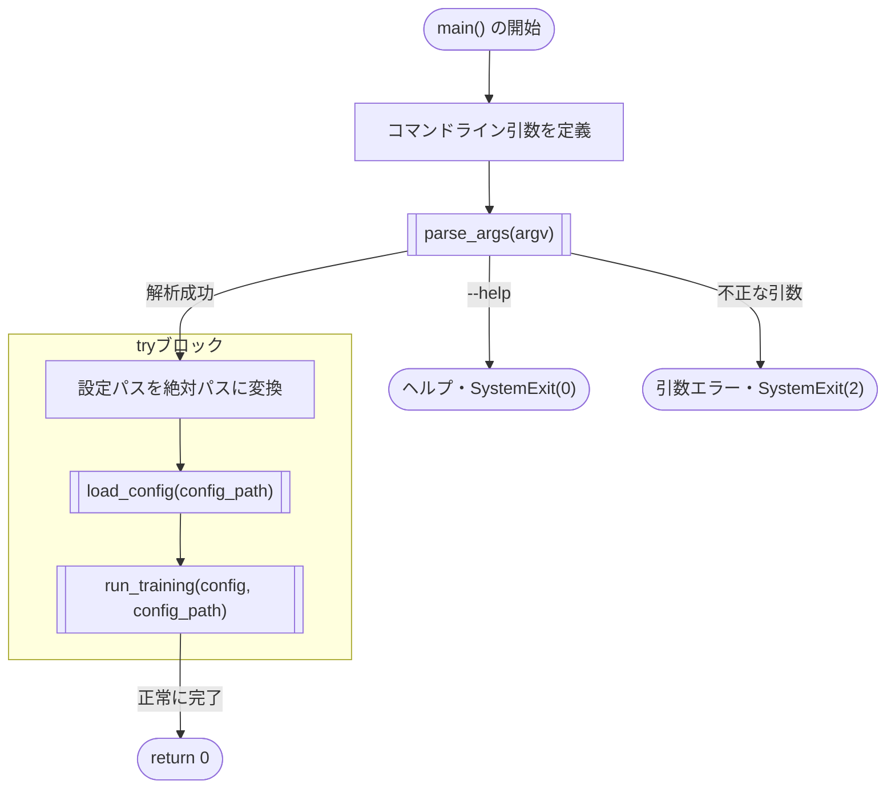
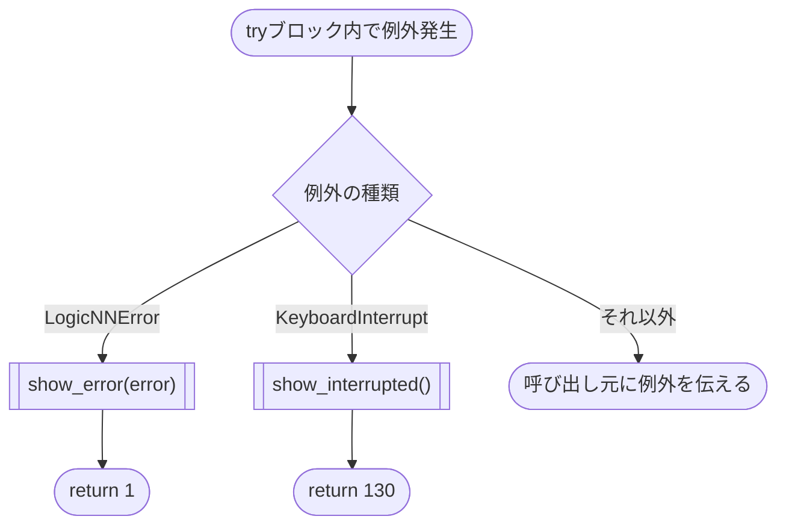

# main.py

<div className="source-reference-meta"><code>logicNN/main.py</code><span>コマンドラインからの学習実行</span></div>

コマンドラインから学習を開始するための関数を定義します。学習ループやモデルの計算は、別のモジュールで実装しています。

## main() {/* #main */}

```python
def main(argv: Sequence[str] | None = None) -> int:
```

### 機能概要 {/* #responsibility */}

コマンドライン引数で指定された設定ファイルを読み込み、`run_training()` を呼び出します。処理が終了すると、正常終了・エラー・中断を表す整数を返します。

設定の検証は `load_config()`、データとモデルの準備・学習・評価・保存・回路出力は `run_training()` で行います。`main()` 自体には、これらの処理の詳細は含めません。

`run_training()` の戻り値である学習結果は、`main()` では使用しません。`main()` の戻り値は終了状態のみです。

### 引数 {/* #arguments */}

| 引数 | 型 | 既定値 | 説明 |
|---|---|---|---|
| `argv` | `Sequence[str] \| None` | `None` | 解析対象のコマンドライン引数。`None` の場合は、プログラム起動時に指定された引数を使用する |

- `argv=None`：`python main.py ...` で指定された引数を使用します。
- `argv=[]`：引数なしとして解析し、既定の設定ファイルを使用します。
- `argv=["--config", "config/mnist_lgn.json"]`：指定した引数を解析します。このリストに `python` や `main.py` は含めません。

`--config` の既定値は `config/mnist_lgn.json` です。`allow_abbrev=False` のため、`--conf` のような省略名は受け付けません。

`--config` に相対パスを指定した場合は、実行時の作業ディレクトリを基準に解決します。JSON内の `data.root`、`run.log_dir`、`run.initial_checkpoint_path` に指定した相対パスは、`load_config()` がプロジェクトルートを基準に解決します。絶対パスはそのまま使用します。

### 処理の流れ {/* #activity */}

#### 通常実行と引数解析

処理は上から下へ進みます。二重枠は関数の呼び出しを表します。学習中の繰り返し処理は `run_training()` の内部処理のため、この図では省略しています。



`try` ブロックは、設定ファイルのパス変換、設定の読み込み、学習の実行を囲んでいます。この中で例外が発生すると、以降の処理を中止し、次の図のように処理します。

#### 例外処理

`try` ブロック内で `LogicNNError` または `KeyboardInterrupt` が発生した場合は、メッセージを表示し、それぞれ `1`、`130` を返します。それ以外の例外は、この関数では処理せず、呼び出し元に伝えます。



`show_error()` はエラーの原因・詳細・対処方法を、`show_interrupted()` は中断メッセージを標準エラー出力に表示します。これらの表示処理で別の例外が発生した場合も、呼び出し元に伝わります。

### 戻り値と終了状態 {/* #exit-status */}

| 条件 | main() の動作 |
|---|---|
| `run_training()` が正常に完了 | `0` を返す |
| `try` 内で `LogicNNError` が発生 | 利用者向けのエラーを表示し、`1` を返す |
| `try` 内で `KeyboardInterrupt` が発生 | 中断メッセージを表示し、`130` を返す |
| `--help` を指定 | argparseがヘルプを表示し、`SystemExit(0)` を発生させる。`main()` は戻り値を返さない |
| 未知の引数や、パスを指定していない `--config` を使用 | argparseがエラーを表示し、`SystemExit(2)` を発生させる。学習は開始しない |
| その他の例外が発生 | この関数では処理せず、呼び出し元に伝える。通常のCLI実行ではトレースバックが表示される |

`parse_args()` は `try` ブロックの外で実行します。そのため、引数の解析中に発生した例外や中断は、この関数の `except` 節では処理しません。

### 呼び出し例 {/* #examples */}

プロジェクトルートを作業ディレクトリとして実行します。

```shell
python main.py
python main.py --config config/mnist_lgn.json
```

上の2つは、どちらも同じ設定ファイルで学習を開始します。ヘルプだけを表示する場合は、`python main.py --help` を実行します。この場合、学習は開始しません。

Pythonから直接呼び出す場合は、引数をリストで指定します。次の例も、実際に学習を開始します。

```python
from main import main

exit_code = main(["--config", "config/mnist_lgn.json"])
```

`python main.py` で実行すると、関数外の `raise SystemExit(main())` により、`main()` の戻り値がプログラムの終了コードになります。Pythonから直接呼び出した場合は、戻り値を受け取るだけで、呼び出し元のプログラムは終了しません。ただし、`--help` などで発生する `SystemExit` は、直接呼び出した場合も呼び出し元に伝わります。

### ソースコード {/* #source */}

<details>
<summary>main() の実装を開く</summary>

```python
def main(argv: Sequence[str] | None = None) -> int:
    """CLI設定を読んで学習を一度実行し、既知エラーと利用者中断だけを通知する。"""
    parser = argparse.ArgumentParser(description="論理ゲートNNを学習し、設定に応じて回路を出力します。", allow_abbrev=False)
    parser.add_argument("--config", default="config/mnist_lgn.json", metavar="PATH", help="設定JSONのパス（既定: config/mnist_lgn.json）")
    args = parser.parse_args(argv)
    try:
        config_path = Path(args.config).expanduser().resolve()
        config      = load_config(config_path)
        run_training(config, config_path)
    except LogicNNError as error:
        show_error(error)
        return 1
    except KeyboardInterrupt:
        show_interrupted()
        return 130
    return 0
```

</details>

### 関連ファイル {/* #related-files */}

呼び出し先の詳細は、以下のページで確認できます。

| ファイル | 関数・クラス | 用途 |
|---|---|---|
| [utils/config/loader.py](./utils/config/loader.md#load-config) | `load_config()` | 設定ファイルの読み込みと検証 |
| [utils/trainer/workflow.py](./utils/trainer/workflow.md#run-training) | `run_training()` | 学習・評価・保存・回路出力の実行 |
| [utils/console/rich_display.py](./utils/console/rich_display.md) | `show_error()` / `show_interrupted()` | エラーと中断の表示。`utils.console` からインポートする |
| [utils/exceptions.py](./utils/exceptions.md#logicnnerror-class) | `LogicNNError` | ユーザー向けのエラーメッセージを持つ例外クラス |
