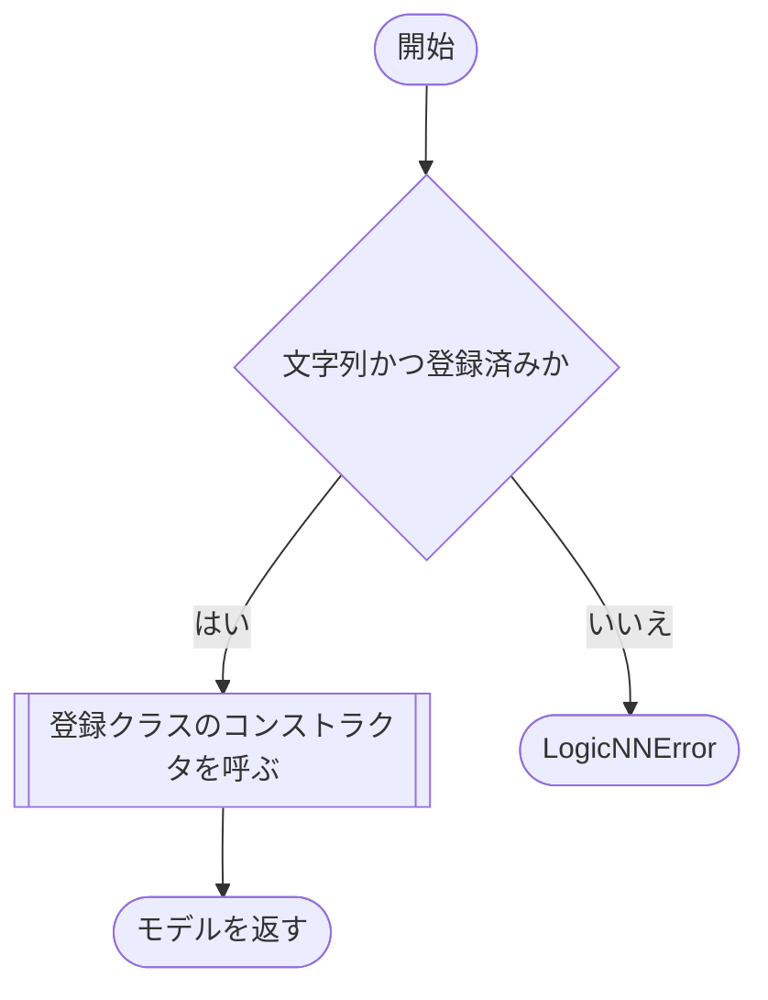

# builder.py

`model/builder.py`

モデルの登録名とクラスの対応表を定義します。現在は `mnist_lgn` を `MNISTLGN` に対応させています。モデル構造の値は設定JSONではなくモデル定義内で指定します。

{/* source-sha256: f802f833356ad648ce7568bfdfc7094ec6df8e21f9b2723ce79fa89a0163cd08 */}

{/* function: build_model@14 */}

## build\_model() {/* #build-model */}

```python
def build_model(name: str) -> nn.Module:
```

### 機能概要

登録名からモデルクラスを選び、新しいインスタンスを生成します。

### 引数

| 引数 | 型 | 既定値 | 説明 |
|---|---|---|---|
| `name` | `str` | `必須` | モデルの登録名。現在は `mnist_lgn`。 |

### 処理の流れ



### 戻り値

型：`nn.Module`

生成した `nn.Module`。既存モデルの使い回しや重みの読み込みは行いません。

### 呼び出し例

```python
from model import build_model

model = build_model("mnist_lgn")
```

### ソースコード

<details>
<summary>build\_model() の実装を開く</summary>

```python
def build_model(name: str) -> nn.Module:
    """登録名を検証し、外部の構造パラメータを渡さずモデルを生成する。"""
    if not isinstance(name, str) or name not in MODEL_REGISTRY:
        available = ", ".join(sorted(MODEL_REGISTRY))
        raise LogicNNError("未登録のモデルです", detail=f"model.name={name!r}。登録済み: {available}", hint=f"model.nameを次から指定してください: {available}")
    return MODEL_REGISTRY[name]()
```

</details>

## 関連ファイル

- [model/lgn/\_\_init\_\_.py](/code-reference/model/lgn/__init__)
- [utils/exceptions.py](/code-reference/utils/exceptions)
