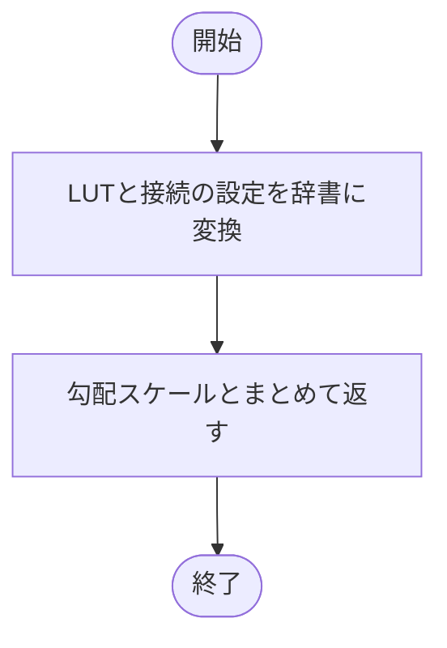
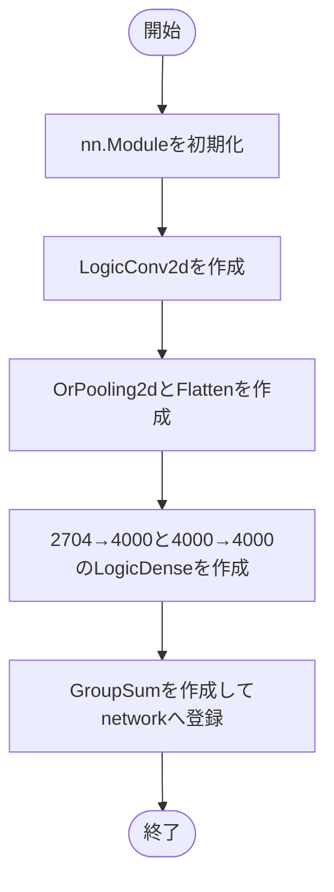
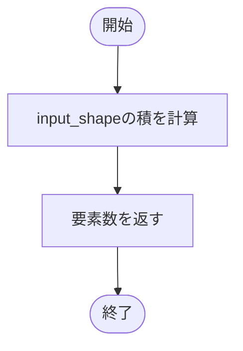
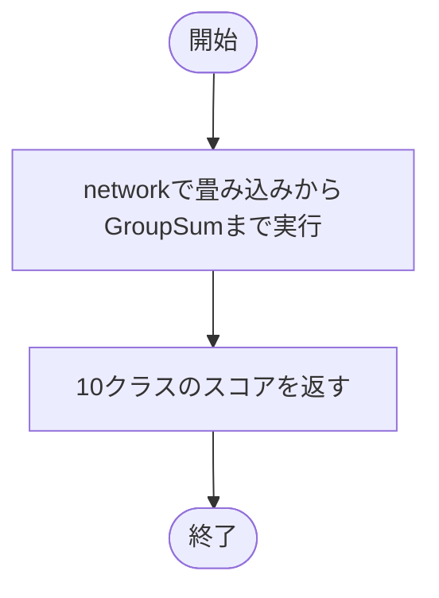
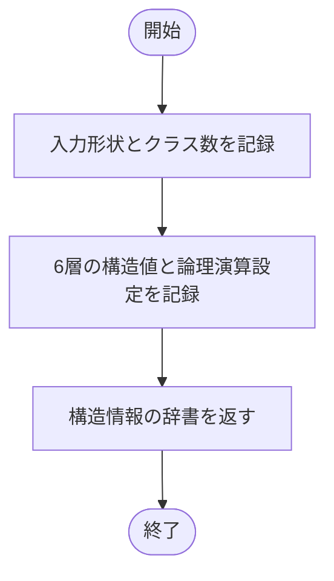

# mnist_lgn.py

`model/lgn/mnist_lgn.py`

前処理済みMNIST用の論理ゲートNNです。構造定数、層の生成、推論、保存用の構造情報を定義します。入力の二値化はこのモデルでは行いません。

{/* source-sha256: e3090792916db10c1c20ac3a132d7eee1259be5c3a592967595fc1eeae47b133 */}

{/* function: _logic_settings@35 */}

## \_logic\_settings() {/* #logic-settings */}

```python
def _logic_settings() -> dict[str, object]:
```

### 機能概要

LUTと接続の設定をdataclassから辞書へ変換し、勾配スケールとまとめます。構造情報の各論理層に同じ設定項目を記録するための内部関数です。

### 引数

指定する引数はありません。

### 処理の流れ



### 戻り値

型：`dict[str, object]`

`lut`、`connections`、`gradient_scale` を持つ新しい辞書。

### ソースコード

<details>
<summary>\_logic\_settings() の実装を開く</summary>

```python
def _logic_settings() -> dict[str, object]:
    """旧モデルから維持したLUT・接続の既定設定を独立した記録用辞書にする。"""
    return {"lut": asdict(LUT_SETTINGS), "connections": asdict(CONNECTION_SETTINGS), "gradient_scale": GRADIENT_SCALE}
```

</details>

## MNISTLGN {/* #mnistlgn-class */}

論理畳み込み、OR pooling、Flatten、2段の論理Dense、GroupSumで10クラスのスコアを計算するモデルです。バッチ数は固定しません。

継承元：`nn.Module`

| 属性 | 型 | 既定値 | 説明 |
|---|---|---|---|
| `input_shape` | `tuple[int, ...]` | `INPUT_SHAPE` | バッチ次元を除く入力形状 `(1, 28, 28)`。 |
| `num_classes` | `int` | `NUM_CLASSES` | 分類先のクラス数。MNISTでは10。 |

{/* function: MNISTLGN.__init__@46 */}

## MNISTLGN.\_\_init\_\_() {/* #mnistlgn-init */}

```python
def __init__(self) -> None:
```

### 機能概要

モデル内の定数に従い、6段の処理を `nn.Sequential` に登録します。畳み込み出力は `[batch,16,26,26]`、pooling後は `[batch,16,13,13]`、Flatten後は2704要素です。Denseで4000要素に変換し、最後に10クラスへ集約します。

### 引数

`self` 以外に指定する引数はありません。

### 処理の流れ



### 戻り値

型：`None`

`None`。生成した層は `self.network` に保持します。

### 状態の変更・ファイル出力

- 学習パラメータと接続情報を初期化します。乱数を使用する層の初期値は生成時の乱数状態に依存します。

### ソースコード

<details>
<summary>MNISTLGN.\_\_init\_\_() の実装を開く</summary>

```python
def __init__(self) -> None:
    """構造と学習方式をモデル定義内の定数だけから組み立てる。"""
    super().__init__()
    self.network = nn.Sequential(
        LogicConv2d(
            INPUT_SHAPE[1:], INPUT_SHAPE[0], CONV_KERNELS, TREE_DEPTH, RECEPTIVE_FIELD, stride=CONV_STRIDE, padding=CONV_PADDING,
            lut=LUT_SETTINGS, connections=CONNECTION_SETTINGS, gradient_scale=GRADIENT_SCALE,
        ),
        OrPooling2d(kernel_size=POOL_KERNEL_SIZE, stride=POOL_STRIDE, padding=POOL_PADDING),
        nn.Flatten(start_dim=FLATTEN_START_DIM, end_dim=FLATTEN_END_DIM),
        LogicDense(FLATTENED_SIZE, HIDDEN_SIZE, lut=LUT_SETTINGS, connections=CONNECTION_SETTINGS, gradient_scale=GRADIENT_SCALE),
        LogicDense(HIDDEN_SIZE, HIDDEN_SIZE, lut=LUT_SETTINGS, connections=CONNECTION_SETTINGS, gradient_scale=GRADIENT_SCALE),
        GroupSum(NUM_CLASSES, tau=GROUP_TAU, bias=GROUP_BIAS),
    )
```

</details>

{/* function: MNISTLGN.input_size@62 */}

## MNISTLGN.input\_size()（プロパティ） {/* #mnistlgn-input-size */}

```python
def input_size(self) -> int:
```

### 機能概要

入力形状の積を計算します。独立した設定値ではなく、`input_shape` から毎回求める読み取り専用プロパティです。

### 引数

`self` 以外に指定する引数はありません。

### 処理の流れ



### 戻り値

型：`int`

入力1件の要素数。現在は `1 × 28 × 28 = 784`。

### ソースコード

<details>
<summary>MNISTLGN.input\_size() の実装を開く</summary>

```python
@property
def input_size(self) -> int:
    """batchを含まない入力形状から、入力要素数を読み取り専用で導出する。"""
    return math.prod(self.input_shape)
```

</details>

{/* function: MNISTLGN.forward@66 */}

## MNISTLGN.forward() {/* #mnistlgn-forward */}

```python
def forward(self, inputs: Tensor) -> Tensor:
```

### 機能概要

入力を `network` に渡し、登録順に各層を実行します。連続値による学習か離散評価かの切り替えは、各層のモードに従います。

### 引数

| 引数 | 型 | 既定値 | 説明 |
|---|---|---|---|
| `inputs` | `Tensor` | `必須` | 前処理済み入力。形状 `[batch, 1, 28, 28]`。通常の学習経路では0/1のfloat32 Tensor。 |

### 処理の流れ



### 戻り値

型：`Tensor`

形状 `[batch, 10]` のクラススコア。確率や予測クラス番号ではありません。

### ソースコード

<details>
<summary>MNISTLGN.forward() の実装を開く</summary>

```python
def forward(self, inputs: Tensor) -> Tensor:
    """前処理済みの[batch,1,28,28]を[batch,10]のクラススコアへ変換する。"""
    return self.network(inputs)
```

</details>

{/* function: MNISTLGN.architecture_info@70 */}

## MNISTLGN.architecture\_info() {/* #mnistlgn-architecture-info */}

```python
def architecture_info(self) -> dict[str, object]:
```

### 機能概要

入力形状、クラス数、層の順序と固定設定をJSON互換の辞書にまとめます。学習済みの重みは含めません。

### 引数

`self` 以外に指定する引数はありません。

### 処理の流れ



### 戻り値

型：`dict[str, object]`

`input_shape`、`input_size`、`num_classes`、`layers` を持つ独立した辞書。

### ソースコード

<details>
<summary>MNISTLGN.architecture\_info() の実装を開く</summary>

```python
def architecture_info(self) -> dict[str, object]:
    """層順序・全固定設定・導出shapeをJSON互換の独立した辞書として返す。"""
    return {
        "input_shape": list(self.input_shape), "input_size": self.input_size, "num_classes": self.num_classes,
        "layers": [
            {
                "type": "LogicConv2d", "input_size": list(INPUT_SHAPE[1:]), "in_channels": INPUT_SHAPE[0], "out_channels": CONV_KERNELS,
                "tree_depth": TREE_DEPTH, "kernel_size": [RECEPTIVE_FIELD] * 2, "stride": [CONV_STRIDE] * 2, "padding": [CONV_PADDING] * 2,
                "output_size": list(CONV_OUTPUT_SIZE), **_logic_settings(),
            },
            {
                "type": "OrPooling2d", "kernel_size": [POOL_KERNEL_SIZE] * 2, "stride": [POOL_STRIDE] * 2, "padding": [POOL_PADDING] * 2,
                "output_size": list(POOL_OUTPUT_SIZE),
            },
            {"type": "Flatten", "start_dim": FLATTEN_START_DIM, "end_dim": FLATTEN_END_DIM, "out_features": FLATTENED_SIZE},
            {"type": "LogicDense", "in_features": FLATTENED_SIZE, "out_features": HIDDEN_SIZE, **_logic_settings()},
            {"type": "LogicDense", "in_features": HIDDEN_SIZE, "out_features": HIDDEN_SIZE, **_logic_settings()},
            {"type": "GroupSum", "groups": NUM_CLASSES, "tau": GROUP_TAU, "bias": GROUP_BIAS},
        ],
    }
```

</details>

## 関連ファイル

- [utils/logicNN_core/src/logicnn_core/layer_settings.py](/code-reference/utils/logicNN_core/src/logicnn_core/layer_settings)
- [utils/logicNN_core/src/logicnn_core/layers/\_\_init\_\_.py](/code-reference/utils/logicNN_core/src/logicnn_core/layers/__init__)
