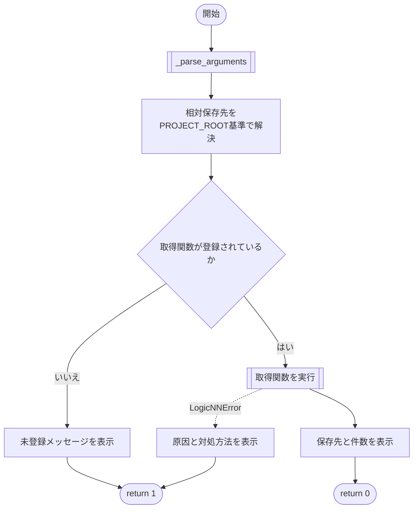
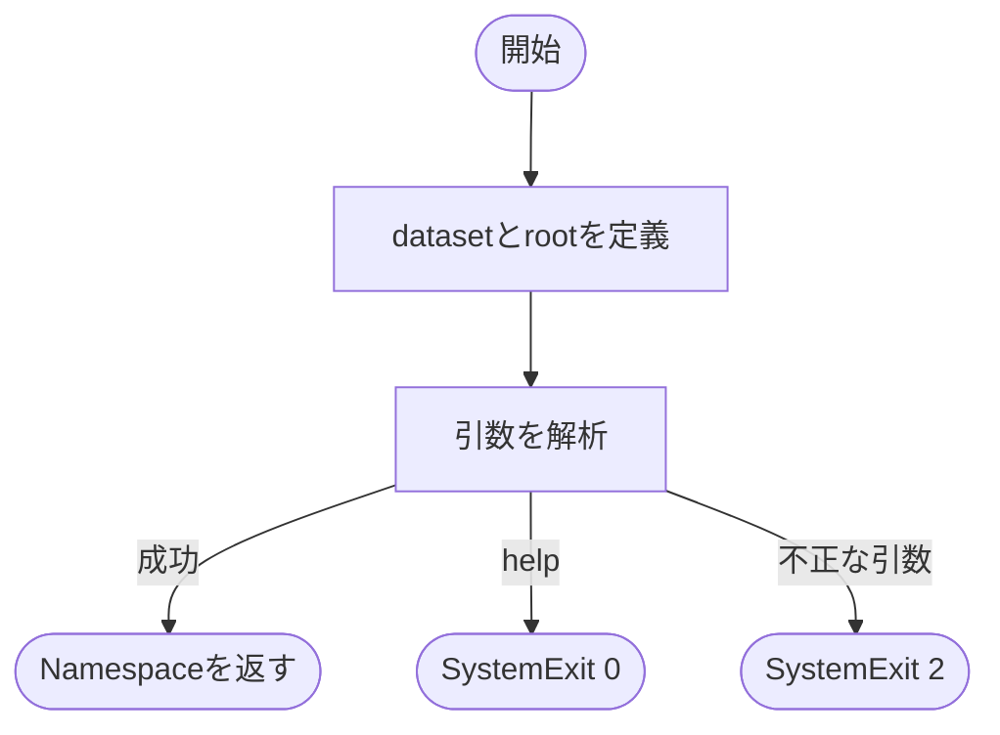
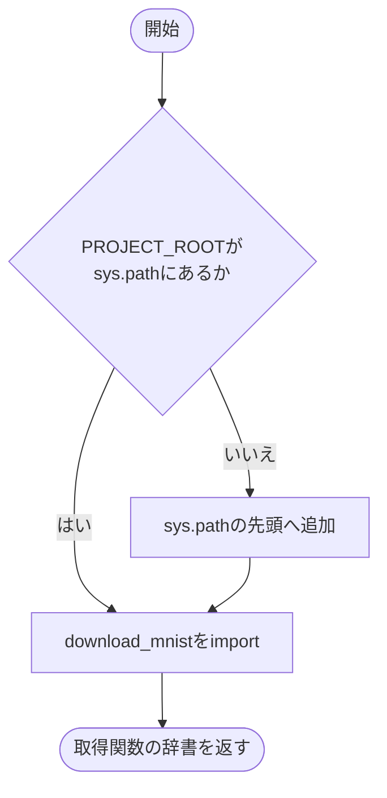

# download_dataset.py

`tools/download_dataset.py`

学習とは別にデータセットをダウンロードするCLIです。現在はMNISTに対応し、通常は `python tools/download_dataset.py --dataset mnist --root data` で実行します。

{/* source-sha256: 40f66c12761633c8d038bf6a72a2fd7a11b83a72bdcb2962c5fc41f423ad091f */}

{/* function: main@16 */}

## main() {/* #main */}

```python
def main(argv: Sequence[str] | None = None) -> int:
```

### 機能概要

データセット名と保存先を解析し、登録された取得関数を呼びます。成功時は件数と保存先、失敗時は原因と対処方法を表示します。

### 引数

| 引数 | 型 | 既定値 | 説明 |
|---|---|---|---|
| `argv` | `Sequence[str] \| None` | `None` | 解析する引数列。Noneなら起動時の引数。ファイル名やpythonは含めません。 |

### 処理の流れ



### 戻り値

型：`int`

正常時は0。未登録データセット、または取得関数がLogicNNErrorを発生させた場合は1。

### 状態の変更・ファイル出力

- データセットのダウンロード・保存を行います。

### 例外・注意事項

- argparseのヘルプと引数エラーではSystemExitが発生します。その他の例外は呼び出し元に伝わります。

### ソースコード

<details>
<summary>main() の実装を開く</summary>

```python
def main(argv: Sequence[str] | None = None) -> int:
    """CLI引数で選択されたデータセットを取得し、保存先と件数をRichで表示する。"""
    arguments = _parse_arguments(argv)
    root      = arguments.root if arguments.root.is_absolute() else PROJECT_ROOT / arguments.root
    try:
        downloader = _downloaders()[arguments.dataset]
    except KeyError:
        Console(stderr=True).print(f"[red]未登録のデータセットです:[/red] {arguments.dataset}")
        return 1

    from utils.exceptions import LogicNNError

    try:
        train_size, test_size, destination = downloader(root.resolve())
    except LogicNNError as error:
        console = Console(stderr=True)
        console.print(f"[red]{error.message}[/red]")
        console.print(error.detail)
        console.print(f"対応: {error.hint}")
        return 1

    Console().print(f"[green]データセットの準備が完了しました[/green]\n保存先: {destination}\n学習用: {train_size:,} 件\nテスト用: {test_size:,} 件")
    return 0
```

</details>

{/* function: _parse_arguments@41 */}

## \_parse\_arguments() {/* #parse-arguments */}

```python
def _parse_arguments(argv: Sequence[str] | None) -> argparse.Namespace:
```

### 機能概要

データセット名と保存先のCLIオプションを定義して解析します。パスの絶対パスへ変換やダウンロードはまだ行いません。

### 引数

| 引数 | 型 | 既定値 | 説明 |
|---|---|---|---|
| `argv` | `Sequence[str] \| None` | `必須` | Noneまたは解析する引数列。 |

### 処理の流れ



### 戻り値

型：`argparse.Namespace`

`dataset` と `root` を持つNamespace。既定値はmnistとPath('data')。

### ソースコード

<details>
<summary>\_parse\_arguments() の実装を開く</summary>

```python
def _parse_arguments(argv: Sequence[str] | None) -> argparse.Namespace:
    """データセット名とプロジェクト基準の保存先をCLIから読み取る。"""
    parser = argparse.ArgumentParser(description=__doc__)
    parser.add_argument("--dataset", default="mnist", help="取得するデータセットの登録名。既定値はmnist。")
    parser.add_argument("--root", type=Path, default=Path("data"), help="データの保存先。既定値はプロジェクト内のdata。")
    return parser.parse_args(argv)
```

</details>

{/* function: _downloaders@49 */}

## \_downloaders() {/* #downloaders */}

```python
def _downloaders() -> dict[str, DownloadFunction]:
```

### 機能概要

ツールをファイルとして直接実行した場合もutilsを読み込めるようにプロジェクトルートをsys.pathへ追加し、取得関数の対応表を返します。

### 引数

指定する引数はありません。

### 処理の流れ



### 戻り値

型：`dict[str, DownloadFunction]`

現在は `{'mnist': download_mnist}` を持つ辞書。

### 状態の変更・ファイル出力

- 未登録の場合に限りsys.pathを変更します。

### ソースコード

<details>
<summary>\_downloaders() の実装を開く</summary>

```python
def _downloaders() -> dict[str, DownloadFunction]:
    """データセット登録名と取得処理の対応表を返す。"""
    if str(PROJECT_ROOT) not in sys.path:
        sys.path.insert(0, str(PROJECT_ROOT))
    from utils.data.mnist import download_mnist

    return {"mnist": download_mnist}
```

</details>

## 関連ファイル

- [utils/data/mnist.py](/code-reference/utils/data/mnist)
- [utils/exceptions.py](/code-reference/utils/exceptions)
