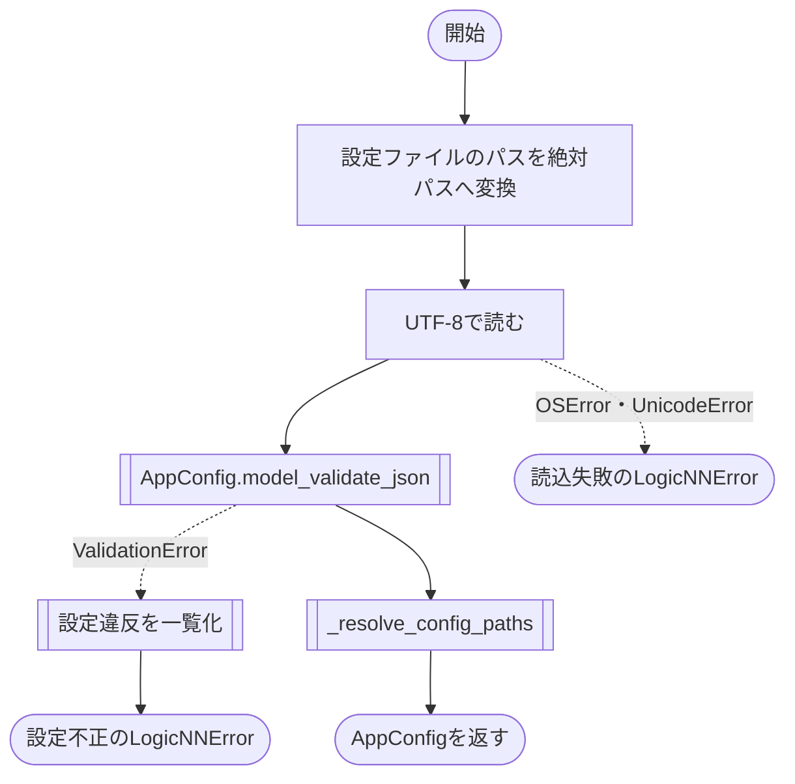
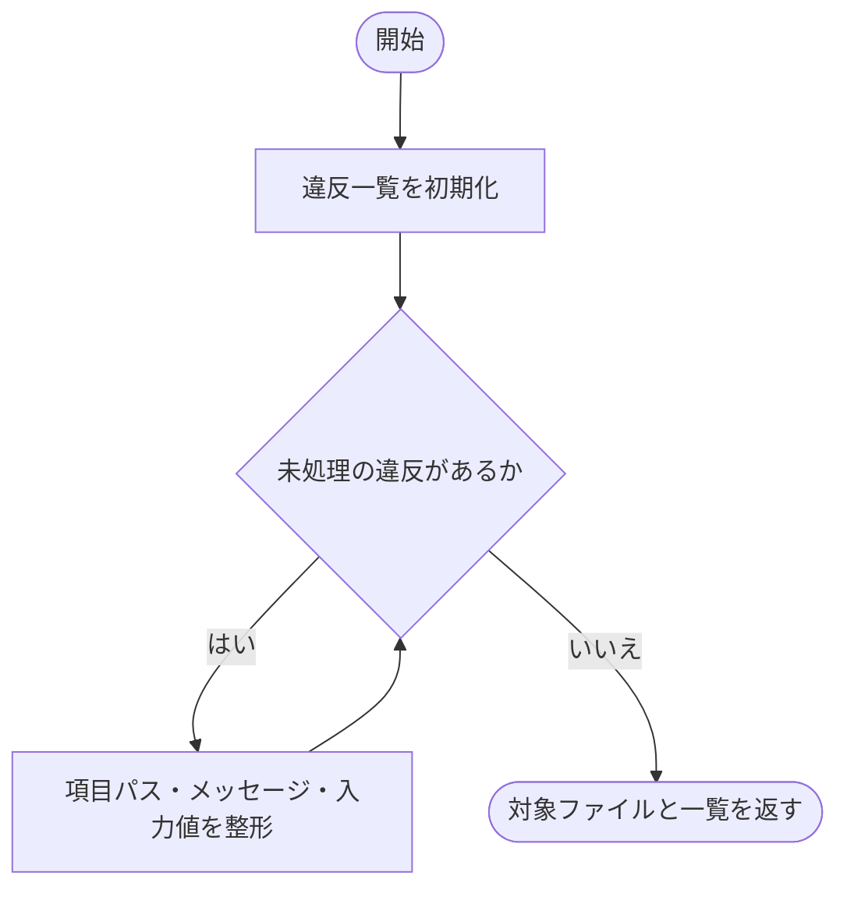
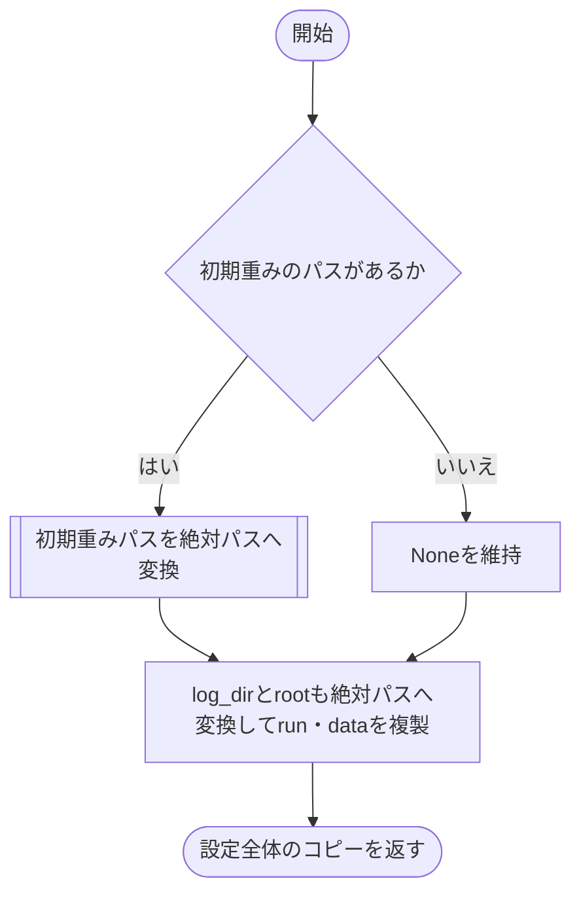
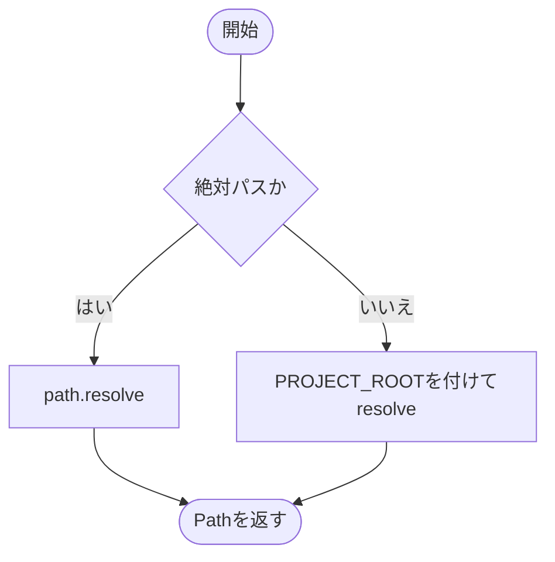

# loader.py

`utils/config/loader.py`

UTF-8の設定JSONを読み込み、Pydanticで検証し、設定中のパスを絶対パスに変換します。

{/* source-sha256: e3fdc883b51a6b778215a2e128bf618b83d2572cc07d5042165f22bd7d9f5897 */}

{/* function: load_config@16 */}

## load\_config() {/* #load-config */}

```python
def load_config(path: str | Path) -> AppConfig:
```

### 機能概要

設定ファイルの読み込み、設定スキーマの検証、パスの変換を順に行います。ファイルの問題と設定値の問題を分け、`LogicNNError` に原因を含めます。

### 引数

| 引数 | 型 | 既定値 | 説明 |
|---|---|---|---|
| `path` | `str \| Path` | `必須` | 設定JSONのパス。相対パスは現在の作業ディレクトリ基準。`~` は展開します。 |

### 処理の流れ



### 戻り値

型：`AppConfig`

パスの変換が完了した `AppConfig`。

### ソースコード

<details>
<summary>load\_config() の実装を開く</summary>

```python
def load_config(path: str | Path) -> AppConfig:
    """設定JSONを厳格に検証し、設定内のパスをプロジェクトルート基準で解決する。"""
    config_path = Path(path).expanduser().resolve()
    try:
        source = config_path.read_text(encoding="utf-8")
    except (OSError, UnicodeError) as error:
        raise LogicNNError(
            "設定ファイルを読み込めません",
            detail=f"対象: {config_path}\n原因: {error}",
            hint="存在するUTF-8形式の設定JSONを--configで指定してください",
        ) from error

    try:
        config = AppConfig.model_validate_json(source)
    except ValidationError as error:
        raise LogicNNError(
            "設定ファイルの内容が不正です",
            detail=_format_validation_error(config_path, error),
            hint="表示された設定項目を修正し、もう一度実行してください",
        ) from error
    return _resolve_config_paths(config)
```

</details>

{/* function: _format_validation_error@39 */}

## \_format\_validation\_error() {/* #format-validation-error */}

```python
def _format_validation_error(config_path: Path, error: ValidationError) -> str:
```

### 機能概要

Pydanticが報告したすべての違反を、項目のパス・メッセージ・入力値の形式で並べます。項目パスが空の場合は `JSON` と表示します。

### 引数

| 引数 | 型 | 既定値 | 説明 |
|---|---|---|---|
| `config_path` | `Path` | `必須` | 表示する設定ファイルのパス。 |
| `error` | `ValidationError` | `必須` | Pydanticから受け取った検証エラー。 |

### 処理の流れ



### 戻り値

型：`str`

ファイルパスと各違反を改行で連結した文字列。

### ソースコード

<details>
<summary>\_format\_validation\_error() の実装を開く</summary>

```python
def _format_validation_error(config_path: Path, error: ValidationError) -> str:
    """Pydanticの全違反を設定パスと入力値を含む読みやすい文字列へ変換する。"""
    violations = []
    for item in error.errors(include_url=False):
        location = ".".join(str(part) for part in item["loc"]) or "JSON"
        violations.append(f"{location}: {item['msg']} (入力値: {item.get('input')!r})")
    return f"対象: {config_path}\n" + "\n".join(violations)
```

</details>

{/* function: _resolve_config_paths@48 */}

## \_resolve\_config\_paths() {/* #resolve-config-paths */}

```python
def _resolve_config_paths(config: AppConfig) -> AppConfig:
```

### 機能概要

出力先、データの保存先、任意の初期重みパスを絶対パスに変換します。不変のPydanticモデルを直接変更せず、`model_copy()` で更新した設定を返します。

### 引数

| 引数 | 型 | 既定値 | 説明 |
|---|---|---|---|
| `config` | `AppConfig` | `必須` | 検証済みの設定全体。 |

### 処理の流れ



### 戻り値

型：`AppConfig`

`run` と `data` のパスを更新した新しい `AppConfig`。

### ソースコード

<details>
<summary>\_resolve\_config\_paths() の実装を開く</summary>

```python
def _resolve_config_paths(config: AppConfig) -> AppConfig:
    """設定に含まれる相対パスをプロジェクトルート基準の絶対パスへ変換する。"""
    initial_checkpoint_path = _resolve_path(config.run.initial_checkpoint_path) if config.run.initial_checkpoint_path is not None else None
    run  = config.run.model_copy(update={"log_dir": _resolve_path(config.run.log_dir), "initial_checkpoint_path": initial_checkpoint_path})
    data = config.data.model_copy(update={"root": _resolve_path(config.data.root)})
    return config.model_copy(update={"run": run, "data": data})
```

</details>

{/* function: _resolve_path@56 */}

## \_resolve\_path() {/* #resolve-path */}

```python
def _resolve_path(path: Path) -> Path:
```

### 機能概要

絶対パスを正規化し、相対パスには `PROJECT_ROOT` を付けて絶対パスへ変換します。設定ファイルの置き場所は基準にしません。

### 引数

| 引数 | 型 | 既定値 | 説明 |
|---|---|---|---|
| `path` | `Path` | `必須` | 設定項目に指定されたPath。 |

### 処理の流れ



### 戻り値

型：`Path`

解決した絶対パス。

### ソースコード

<details>
<summary>\_resolve\_path() の実装を開く</summary>

```python
def _resolve_path(path: Path) -> Path:
    """絶対パスは維持し、相対パスだけをプロジェクトルートから解決する。"""
    return path.resolve() if path.is_absolute() else (PROJECT_ROOT / path).resolve()
```

</details>

## 関連ファイル

- [utils/config/schema.py](/code-reference/utils/config/schema)
- [utils/exceptions.py](/code-reference/utils/exceptions)
