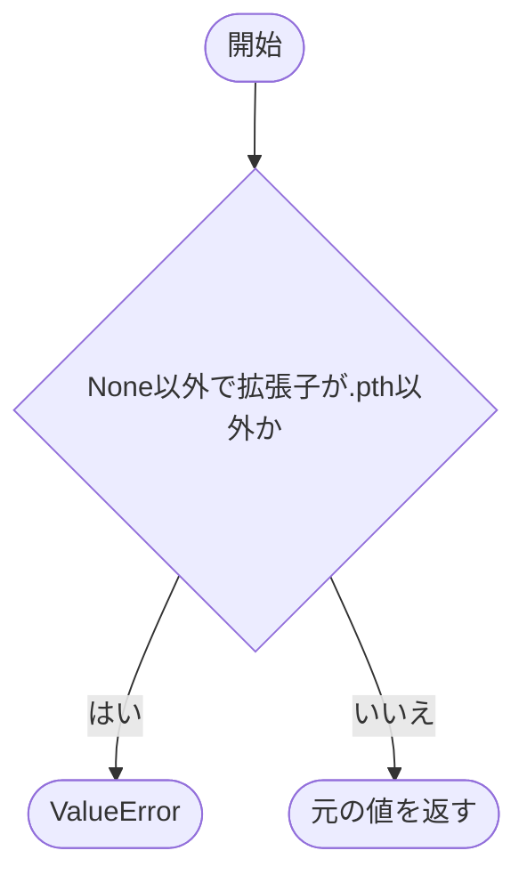
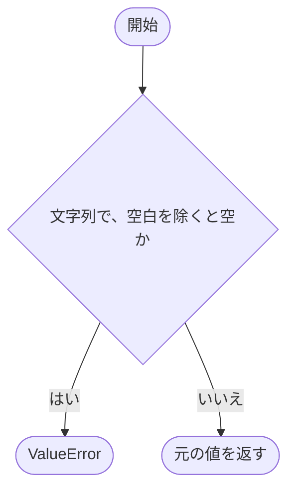
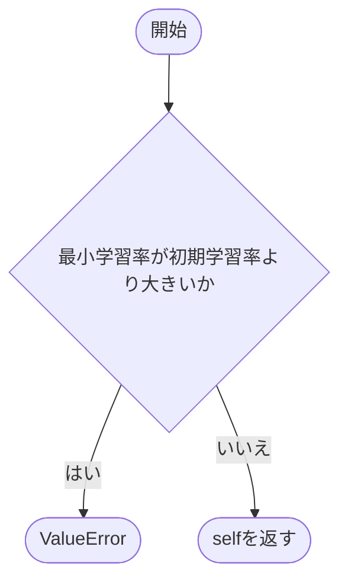

# schema.py

`utils/config/schema.py`

設定JSONの各区分をPydanticモデルで定義します。未知キーを禁止し、型を厳格に扱い、生成後の属性変更を禁止します。全フィールドは必須で、初期重みを使わない場合も `null` を指定します。

{/* source-sha256: 79cf89fb7b99261a24b958fc4abc44ae0070049fc1f8654e2bb2b33afb548d26 */}

- 数値の型別名に値域を定義しています。例えば `Seed` は0～4294967295、`PositiveInteger` は1以上、`Probability` は0～1です。
- Pydanticが提供する初期化や検証メソッドは本プロジェクトの関数実装ではありません。以下には独自に実装した検証メソッドを掲載します。

## \_StrictConfig {/* #strictconfig-class */}

全設定区分の共通基底です。`extra='forbid'`、`frozen=True`、`strict=True` を設定します。

継承元：`BaseModel`

このクラスには独自の関数実装はありません。

<details>
<summary>\_StrictConfig の定義を開く</summary>

```python
class _StrictConfig(BaseModel):
    """全設定区分に共通する厳格で不変な検証規則を定義する。"""

    model_config = ConfigDict(extra="forbid", frozen=True, strict=True)
```

</details>

## RunConfig {/* #runconfig-class */}

実行環境と保存先の設定。

継承元：`_StrictConfig`

| 属性 | 型 | 既定値 | 説明 |
|---|---|---|---|
| `seed` | `Seed` | `必須` | 共通の乱数seed。0～4294967295。 |
| `device` | `Literal['auto', 'cpu', 'cuda']` | `必須` | auto、cpu、cudaのいずれか。 |
| `log_dir` | `Path` | `必須` | 実行ディレクトリを作成する親ディレクトリ。 |
| `initial_checkpoint_path` | `Path \| None` | `必須` | 重みだけを読み込む.pthファイル。使用しない場合はNone。 |

{/* function: RunConfig.validate_non_empty_path@35 */}

## RunConfig.validate\_non\_empty\_path() {/* #runconfig-validate-non-empty-path */}

```python
def validate_non_empty_path(cls, value: object) -> object:
```

### 機能概要

log_dirとinitial_checkpoint_pathについて、文字列なら空文字や空白だけの指定を拒否します。Pydanticによる型変換より前に実行されます。

### 引数

| 引数 | 型 | 既定値 | 説明 |
|---|---|---|---|
| `value` | `object` | `必須` | 検証前のパス値。NoneやPathを含む可能性があります。 |

### 処理の流れ


### 戻り値

型：`object`

変更していない入力値。

### ソースコード

<details>
<summary>RunConfig.validate\_non\_empty\_path() の実装を開く</summary>

```python
@field_validator("log_dir", "initial_checkpoint_path", mode="before")
@classmethod
def validate_non_empty_path(cls, value: object) -> object:
    """空文字列や空白だけのパスを拒否する。"""
    if isinstance(value, str) and not value.strip():
        raise ValueError("空でないパスを指定してください")
    return value
```

</details>

{/* function: RunConfig.validate_checkpoint_extension@43 */}

## RunConfig.validate\_checkpoint\_extension() {/* #runconfig-validate-checkpoint-extension */}

```python
def validate_checkpoint_extension(cls, value: Path | None) -> Path | None:
```

### 機能概要

初期重みを指定した場合に、拡張子が.pthであることを確認します。拡張子の大文字・小文字は区別しません。ファイルの存在確認は行いません。

### 引数

| 引数 | 型 | 既定値 | 説明 |
|---|---|---|---|
| `value` | `Path \| None` | `必須` | 型検証済みのPath、またはNone。 |

### 処理の流れ



### 戻り値

型：`Path \| None`

元のPathまたはNone。

### ソースコード

<details>
<summary>RunConfig.validate\_checkpoint\_extension() の実装を開く</summary>

```python
@field_validator("initial_checkpoint_path")
@classmethod
def validate_checkpoint_extension(cls, value: Path | None) -> Path | None:
    """初期チェックポイントの拡張子をpthに限定する。"""
    if value is not None and value.suffix.lower() != ".pth":
        raise ValueError("初期チェックポイントには.pthファイルを指定してください")
    return value
```

</details>

## DataConfig {/* #dataconfig-class */}

データセットの選択とDataLoaderの設定。

継承元：`_StrictConfig`

| 属性 | 型 | 既定値 | 説明 |
|---|---|---|---|
| `name` | `NonEmptyName` | `必須` | データセットの登録名。 |
| `root` | `Path` | `必須` | データ保存先。 |
| `batch_size` | `PositiveInteger` | `必須` | バッチあたりの標本数。1以上。 |
| `num_workers` | `NonNegativeInteger` | `必須` | DataLoaderのworker数。0以上。 |

{/* function: DataConfig.validate_non_empty_root@60 */}

## DataConfig.validate\_non\_empty\_root() {/* #dataconfig-validate-non-empty-root */}

```python
def validate_non_empty_root(cls, value: object) -> object:
```

### 機能概要

データ保存先が文字列で指定された場合に、空文字や空白だけの値を拒否します。

### 引数

| 引数 | 型 | 既定値 | 説明 |
|---|---|---|---|
| `value` | `object` | `必須` | 型変換前のデータ保存先。 |

### 処理の流れ



### 戻り値

型：`object`

変更していない入力値。

### ソースコード

<details>
<summary>DataConfig.validate\_non\_empty\_root() の実装を開く</summary>

```python
@field_validator("root", mode="before")
@classmethod
def validate_non_empty_root(cls, value: object) -> object:
    """空文字列や空白だけのデータルートを拒否する。"""
    if isinstance(value, str) and not value.strip():
        raise ValueError("空でないパスを指定してください")
    return value
```

</details>

## ModelConfig {/* #modelconfig-class */}

モデル登録名だけを指定します。モデル構造の値は含めません。

継承元：`_StrictConfig`

| 属性 | 型 | 既定値 | 説明 |
|---|---|---|---|
| `name` | `NonEmptyName` | `必須` | model builderに渡す登録名。 |

このクラスには独自の関数実装はありません。

<details>
<summary>ModelConfig の定義を開く</summary>

```python
class ModelConfig(_StrictConfig):
    """model builderへ渡す登録名を定義する。"""

    name: NonEmptyName
```

</details>

## LossConfig {/* #lossconfig-class */}

損失関数と学習時のlabel smoothingの設定。

継承元：`_StrictConfig`

| 属性 | 型 | 既定値 | 説明 |
|---|---|---|---|
| `name` | `NonEmptyName` | `必須` | 損失関数の登録名。 |
| `label_smoothing` | `Probability` | `必須` | 学習時の平滑化係数。0～1。 |

このクラスには独自の関数実装はありません。

<details>
<summary>LossConfig の定義を開く</summary>

```python
class LossConfig(_StrictConfig):
    """損失関数の登録名と固有設定を定義する。"""

    name: NonEmptyName
    label_smoothing: Probability
```

</details>

## OptimizerConfig {/* #optimizerconfig-class */}

optimizerの種類と学習率・weight decayの設定。

継承元：`_StrictConfig`

| 属性 | 型 | 既定値 | 説明 |
|---|---|---|---|
| `name` | `NonEmptyName` | `必須` | optimizerの登録名。 |
| `learning_rate` | `PositiveFloat` | `必須` | 初期学習率。0より大きい値。 |
| `weight_decay` | `NonNegativeFloat` | `必須` | weight decay係数。0以上。 |

このクラスには独自の関数実装はありません。

<details>
<summary>OptimizerConfig の定義を開く</summary>

```python
class OptimizerConfig(_StrictConfig):
    """optimizerの登録名と固有設定を定義する。"""

    name: NonEmptyName
    learning_rate: PositiveFloat
    weight_decay: NonNegativeFloat
```

</details>

## SchedulerConfig {/* #schedulerconfig-class */}

学習率schedulerの設定。

継承元：`_StrictConfig`

| 属性 | 型 | 既定値 | 説明 |
|---|---|---|---|
| `name` | `NonEmptyName` | `必須` | schedulerの登録名。 |
| `minimum_learning_rate` | `NonNegativeFloat` | `必須` | 到達する最小学習率。0以上。 |

このクラスには独自の関数実装はありません。

<details>
<summary>SchedulerConfig の定義を開く</summary>

```python
class SchedulerConfig(_StrictConfig):
    """learning-rate schedulerの登録名と固有設定を定義する。"""

    name: NonEmptyName
    minimum_learning_rate: NonNegativeFloat
```

</details>

## TrainConfig {/* #trainconfig-class */}

学習回数と最適化設定をまとめます。

継承元：`_StrictConfig`

| 属性 | 型 | 既定値 | 説明 |
|---|---|---|---|
| `epochs` | `PositiveInteger` | `必須` | 学習epoch数。1以上。 |
| `loss` | `LossConfig` | `必須` | 学習用損失関数の設定。 |
| `optimizer` | `OptimizerConfig` | `必須` | optimizerの設定。 |
| `scheduler` | `SchedulerConfig` | `必須` | schedulerの設定。 |

{/* function: TrainConfig.validate_learning_rate_range@104 */}

## TrainConfig.validate\_learning\_rate\_range() {/* #trainconfig-validate-learning-rate-range */}

```python
def validate_learning_rate_range(self) -> "TrainConfig":
```

### 機能概要

設定全体の型検証後に、schedulerの最小学習率がoptimizerの初期学習率以下であることを確認します。

### 引数

`self` 以外に指定する引数はありません。

### 処理の流れ



### 戻り値

型：`'TrainConfig'`

検証済みの同じ `TrainConfig` インスタンス。

### ソースコード

<details>
<summary>TrainConfig.validate\_learning\_rate\_range() の実装を開く</summary>

```python
@model_validator(mode="after")
def validate_learning_rate_range(self) -> "TrainConfig":
    """schedulerの最小学習率が初期学習率を超えないことを確認する。"""
    if self.scheduler.minimum_learning_rate > self.optimizer.learning_rate:
        raise ValueError("train.scheduler.minimum_learning_rateはtrain.optimizer.learning_rate以下にしてください")
    return self
```

</details>

## CircuitConfig {/* #circuitconfig-class */}

学習後の回路出力の設定。

継承元：`_StrictConfig`

| 属性 | 型 | 既定値 | 説明 |
|---|---|---|---|
| `enabled` | `bool` | `必須` | TrueならJSON・C・Verilogを一括生成。 |

このクラスには独自の関数実装はありません。

<details>
<summary>CircuitConfig の定義を開く</summary>

```python
class CircuitConfig(_StrictConfig):
    """学習後の回路成果物生成スイッチを定義する。"""

    enabled: bool
```

</details>

## AppConfig {/* #appconfig-class */}

設定JSON全体を表す最上位モデルです。

継承元：`_StrictConfig`

| 属性 | 型 | 既定値 | 説明 |
|---|---|---|---|
| `run` | `RunConfig` | `必須` | 実行環境・保存先。 |
| `data` | `DataConfig` | `必須` | データセット・DataLoader。 |
| `model` | `ModelConfig` | `必須` | モデル選択。 |
| `train` | `TrainConfig` | `必須` | 学習回数・最適化。 |
| `circuit` | `CircuitConfig` | `必須` | 回路出力の有効・無効。 |

このクラスには独自の関数実装はありません。

<details>
<summary>AppConfig の定義を開く</summary>

```python
class AppConfig(_StrictConfig):
    """logicNNの設定JSON全体を表す。"""

    run: RunConfig
    data: DataConfig
    model: ModelConfig
    train: TrainConfig
    circuit: CircuitConfig
```

</details>
