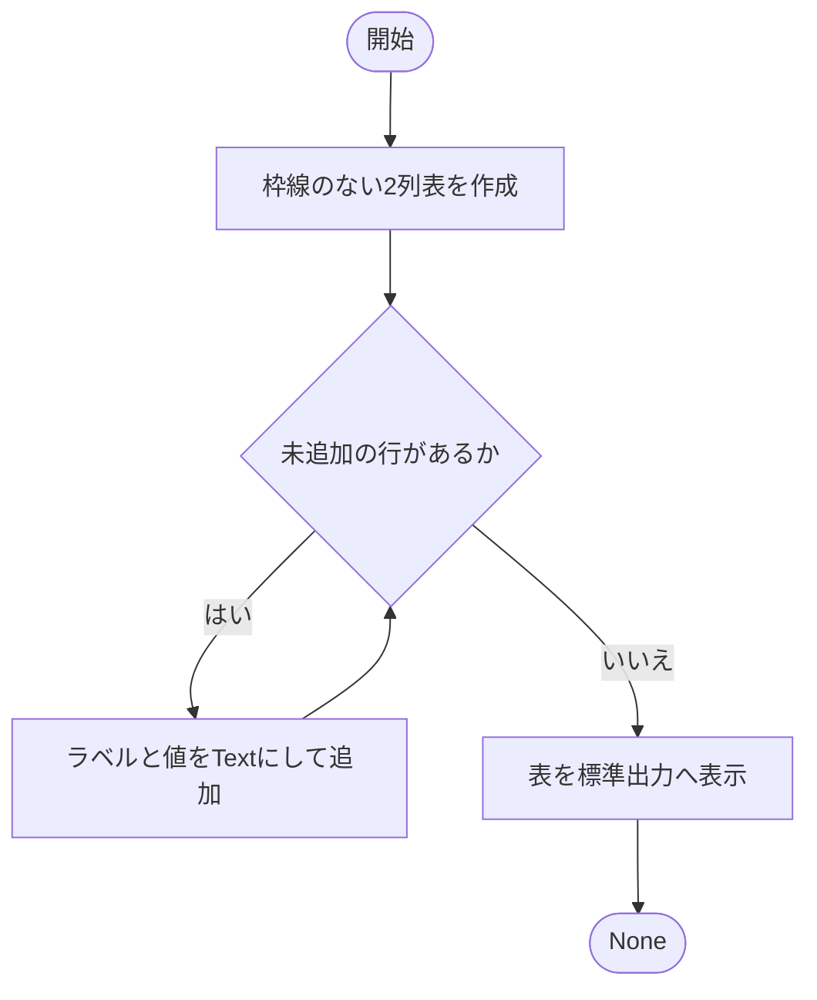
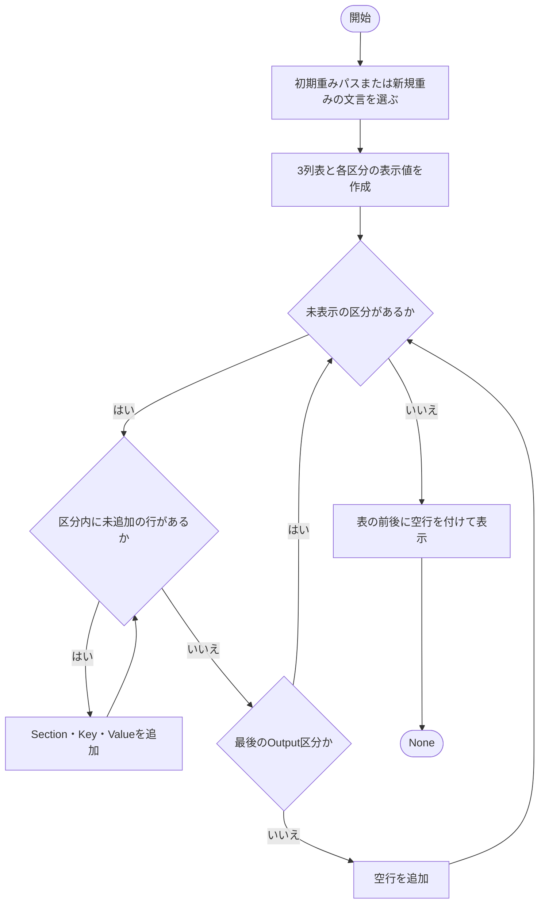
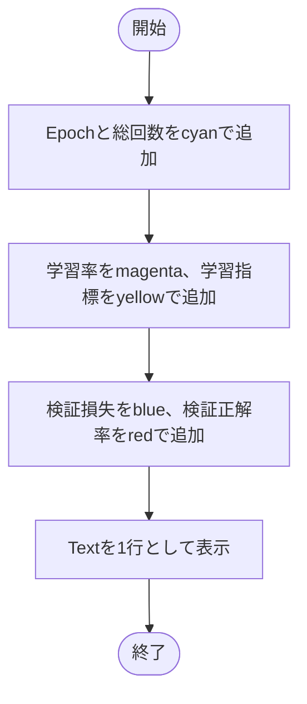
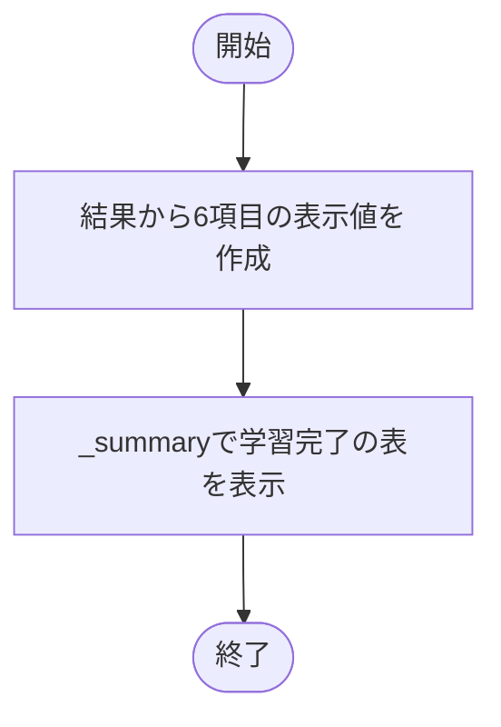
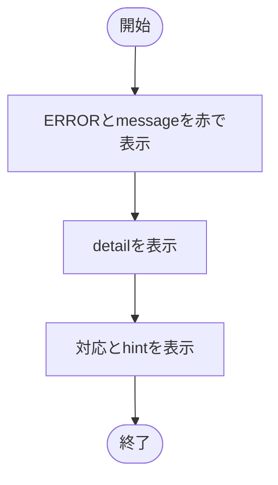
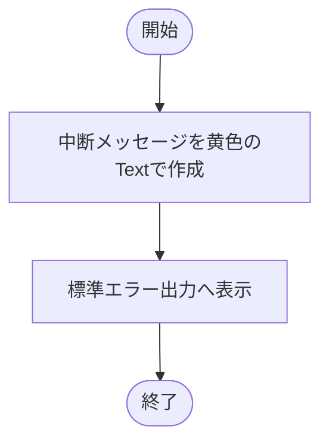

# rich_display.py

`utils/console/rich_display.py`

Richで開始条件・epoch進捗・結果・エラーを表示します。保存ログの数値や学習状態は変更しません。

{/* source-sha256: a742155bfdad26531ba02c240a59d64e6c098f26d77268c8ec4f1d84ea522f68 */}

{/* function: _summary@24 */}

## \_summary() {/* #summary */}

```python
def _summary(title: str, rows: list[tuple[str, str]]) -> None:
```

### 機能概要

見出しと値の2列表を枠線なしで組み立て、一度に表示する内部関数です。文字列をTextに変換するため、値に含まれる角括弧をRichの装飾指定として解釈しません。

### 引数

| 引数 | 型 | 既定値 | 説明 |
|---|---|---|---|
| `title` | `str` | `必須` | 表のタイトル。 |
| `rows` | `list[tuple[str, str]]` | `必須` | 表示順に並べた `(項目名, 表示値)` のリスト。 |

### 処理の流れ



### 戻り値

型：`None`

`None`。

### ソースコード

<details>
<summary>\_summary() の実装を開く</summary>

```python
def _summary(title: str, rows: list[tuple[str, str]]) -> None:
    """値をRich記法として解釈しない2列表を一度だけ表示する。"""
    table = Table(title=title, show_header=False, box=None, padding=(0, 1))
    table.add_column(style="cyan", no_wrap=True)
    table.add_column(overflow="fold")
    for label, value in rows:
        table.add_row(Text(label), Text(value))
    _console.print(table)
```

</details>

{/* function: show_start@34 */}

## show\_start() {/* #show-start */}

```python
def show_start(config: AppConfig, run_dir: Path, device: torch.device) -> None:
```

### 機能概要

学習開始条件を旧版と同じSection・Key・Valueの3列表で表示します。Environment、Model、Data、Training、Outputに分け、12項目を掲載します。

### 引数

| 引数 | 型 | 既定値 | 説明 |
|---|---|---|---|
| `config` | `AppConfig` | `必須` | 今回の設定全体。 |
| `run_dir` | `Path` | `必須` | 成果物の保存先。 |
| `device` | `torch.device` | `必須` | 実際に選択されたデバイス。 |

### 処理の流れ



### 戻り値

型：`None`

`None`。

### ソースコード

<details>
<summary>show\_start() の実装を開く</summary>

```python
def show_start(config: AppConfig, run_dir: Path, device: torch.device) -> None:
    """現在の表示項目を、旧版と同じ区分付きの枠線表で学習開始時に表示する。"""
    checkpoint = str(config.run.initial_checkpoint_path) if config.run.initial_checkpoint_path is not None else "なし（新規重み）"
    table      = Table(title="学習開始", show_header=True, header_style="bold")
    table.add_column("Section", style="bold cyan", no_wrap=True)
    table.add_column("Key", style="green", no_wrap=True)
    table.add_column("Value", style="white", overflow="fold")
    sections = (
        ("Environment", [("device", str(device)), ("seed", str(config.run.seed))]),
        ("Model", [("モデル", config.model.name), ("初期重み", checkpoint)]),
        ("Data", [("データセット", config.data.name)]),
        ("Training", [
            ("batch size", str(config.data.batch_size)),
            ("epochs", str(config.train.epochs)),
            ("loss", f"{config.train.loss.name} (label_smoothing={config.train.loss.label_smoothing:g})"),
            ("optimizer", f"{config.train.optimizer.name} (lr={config.train.optimizer.learning_rate:g})"),
            ("scheduler", config.train.scheduler.name),
        ]),
        ("Output", [("回路出力", "有効" if config.circuit.enabled else "無効"), ("実行ディレクトリ", str(run_dir))]),
    )
    for section, rows in sections:
        for label, value in rows:
            table.add_row(Text(section), Text(label), Text(value))
        if section != "Output":
            table.add_row("", "", "")
    _console.print()
    _console.print(table)
    _console.print()
```

</details>

{/* function: show_epoch@64 */}

## show\_epoch() {/* #show-epoch */}

```python
def show_epoch(record: EpochRecord, epochs: int) -> None:
```

### 機能概要

epoch、学習率、学習損失・正解率、検証損失・正解率を1行に並べ、項目ごとに色を付けます。学習率と損失は小数点以下3桁、正解率は百分率で小数点以下2桁に揃えます。

### 引数

| 引数 | 型 | 既定値 | 説明 |
|---|---|---|---|
| `record` | `EpochRecord` | `必須` | 1 epochの記録。正解率は0～1。 |
| `epochs` | `int` | `必須` | 総epoch数。 |

### 処理の流れ



### 戻り値

型：`None`

`None`。

### 例外・注意事項

- 丸めるのは表示だけです。record内の値や保存する数値精度は変えません。

### ソースコード

<details>
<summary>show\_epoch() の実装を開く</summary>

```python
def show_epoch(record: EpochRecord, epochs: int) -> None:
    """学習率と損失を小数点以下3桁に揃え、旧版と同じ項目別の色で表示する。"""
    message = Text()
    message.append("Epoch", style="bold cyan")
    message.append(f" {record.epoch}/{epochs}", style="cyan")
    message.append(" | ")
    message.append("lr", style="bold magenta")
    message.append(f"={record.learning_rate:.3f}", style="magenta")
    message.append(" | ")
    message.append("train loss", style="bold yellow")
    message.append(f"={record.train_loss:.3f} ", style="yellow")
    message.append("accuracy", style="bold yellow")
    message.append(f"={record.train_accuracy:.2%}", style="yellow")
    message.append(" | ")
    message.append("validation loss", style="bold blue")
    message.append(f"={record.validation_loss:.3f} ", style="blue")
    message.append("accuracy", style="bold red")
    message.append(f"={record.validation_accuracy:.2%}", style="red")
    _console.print(message)
```

</details>

{/* function: show_complete@85 */}

## show\_complete() {/* #show-complete */}

```python
def show_complete(result: TrainingResult) -> None:
```

### 機能概要

best epoch、最良検証精度、テストの損失・正解率・件数、保存先を `_summary()` で表示します。

### 引数

| 引数 | 型 | 既定値 | 説明 |
|---|---|---|---|
| `result` | `TrainingResult` | `必須` | 学習処理から返されたTrainingResult。 |

### 処理の流れ



### 戻り値

型：`None`

`None`。

### ソースコード

<details>
<summary>show\_complete() の実装を開く</summary>

```python
def show_complete(result: TrainingResult) -> None:
    """best epoch、検証精度、公式テスト指標と保存先を完了時にまとめて表示する。"""
    _summary("学習完了", [
        ("best epoch", str(result.best_epoch)),
        ("best validation accuracy", f"{result.best_validation_accuracy:.2%}"),
        ("test loss", f"{result.test_metrics.loss:.6g}"),
        ("test accuracy", f"{result.test_metrics.accuracy:.2%}"),
        ("test samples", str(result.test_metrics.samples)),
        ("保存先", str(result.run_dir)),
    ])
```

</details>

{/* function: show_error@97 */}

## show\_error() {/* #show-error */}

```python
def show_error(error: LogicNNError) -> None:
```

### 機能概要

LogicNNErrorが保持する短いメッセージ、詳細、対処方法を標準エラー出力へ表示します。この関数は例外の送出やプロセスの終了は行いません。

### 引数

| 引数 | 型 | 既定値 | 説明 |
|---|---|---|---|
| `error` | `LogicNNError` | `必須` | 表示対象のLogicNNError。 |

### 処理の流れ



### 戻り値

型：`None`

`None`。

### ソースコード

<details>
<summary>show\_error() の実装を開く</summary>

```python
def show_error(error: LogicNNError) -> None:
    """想定済みエラーのmessage、detailとhintをtracebackなしで標準エラーへ表示する。"""
    _error_console.print(Text(f"[ERROR] {error.message}", style="bold red"))
    _error_console.print(Text(error.detail))
    _error_console.print(Text(f"対応: {error.hint}"))
```

</details>

{/* function: show_interrupted@104 */}

## show\_interrupted() {/* #show-interrupted */}

```python
def show_interrupted() -> None:
```

### 機能概要

利用者の操作により処理が中断されたことを黄色の1行で標準エラー出力へ表示します。中断そのものを発生させる関数ではありません。

### 引数

指定する引数はありません。

### 処理の流れ



### 戻り値

型：`None`

`None`。

### ソースコード

<details>
<summary>show\_interrupted() の実装を開く</summary>

```python
def show_interrupted() -> None:
    """利用者による中断を一行で標準エラーへ通知する。"""
    _error_console.print(Text("[中断] 利用者の操作により実行を中断しました。", style="yellow"))
```

</details>

## 関連ファイル

- [utils/config/schema.py](/code-reference/utils/config/schema)
- [utils/exceptions.py](/code-reference/utils/exceptions)
- [utils/results/metrics.py](/code-reference/utils/results/metrics)
- [utils/trainer/workflow.py](/code-reference/utils/trainer/workflow)
