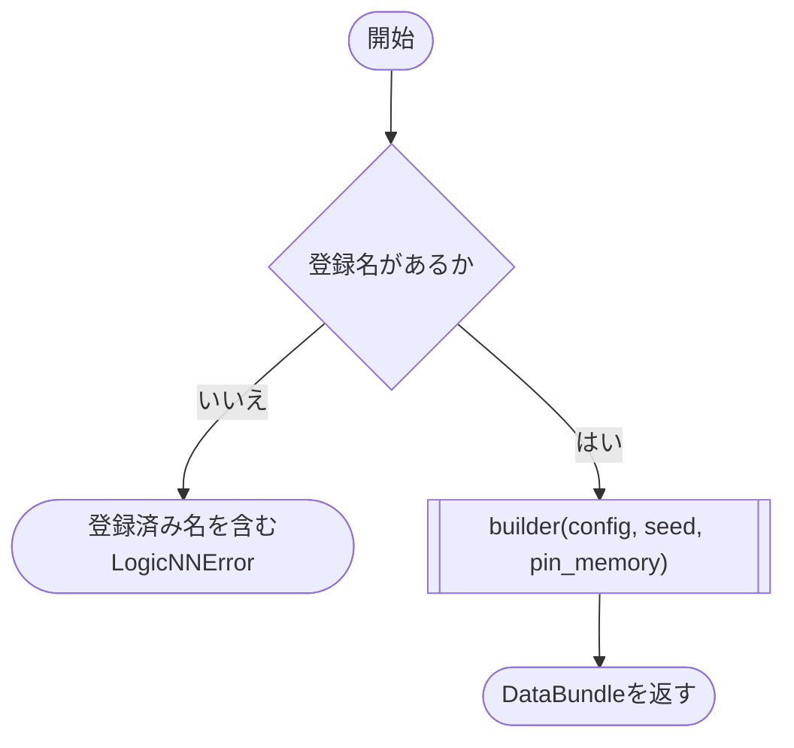

# loader.py

`utils/data/loader.py`

登録名からデータセット専用の生成処理を選択します。新しいデータセットは、同じDataBundleを返す関数を `DATASET_REGISTRY` に登録して切り替えます。

{/* source-sha256: b0ae8384ebafbbf6f91be2f329477994afe8837ba90c62aea97acc2690e1418a */}

{/* function: build_data_bundle@20 */}

## build\_data\_bundle() {/* #build-data-bundle */}

```python
def build_data_bundle(config: DataConfig, seed: int, pin_memory: bool) -> DataBundle:
```

### 機能概要

`config.name` からbuilderを検索し、データ設定、seed、pin_memoryをそのまま渡します。現在の登録先は `mnist` です。

### 引数

| 引数 | 型 | 既定値 | 説明 |
|---|---|---|---|
| `config` | `DataConfig` | `必須` | データセット名とDataLoader設定。 |
| `seed` | `int` | `必須` | データ分割やシャッフルに使用するseed。 |
| `pin_memory` | `bool` | `必須` | DataLoaderで固定メモリを使用するか。 |

### 処理の流れ



### 戻り値

型：`DataBundle`

専用builderが生成したDataBundle。

### ソースコード

<details>
<summary>build\_data\_bundle() の実装を開く</summary>

```python
def build_data_bundle(config: DataConfig, seed: int, pin_memory: bool) -> DataBundle:
    """登録名に対応するデータセット専用処理を呼び出す。"""
    try:
        builder = DATASET_REGISTRY[config.name]
    except KeyError as error:
        available = ", ".join(sorted(DATASET_REGISTRY))
        raise LogicNNError(
            "未登録のデータセットです",
            detail=f"data.name: {config.name!r}\n登録済み: {available}",
            hint="data.nameを登録済みの名前へ変更するか、専用データセット処理を登録してください",
        ) from error
    return builder(config, seed, pin_memory)
```

</details>

## 関連ファイル

- [utils/config/\_\_init\_\_.py](/code-reference/utils/config/__init__)
- [utils/data/mnist.py](/code-reference/utils/data/mnist)
- [utils/data/types.py](/code-reference/utils/data/types)
- [utils/exceptions.py](/code-reference/utils/exceptions)
