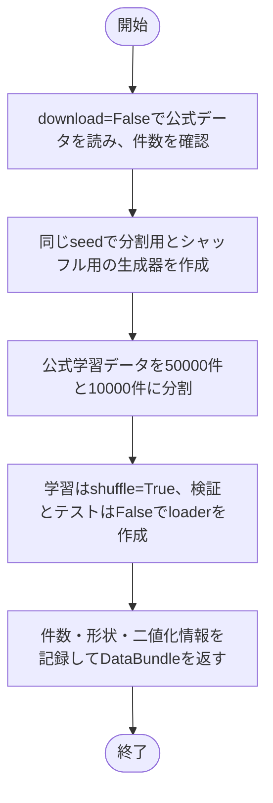
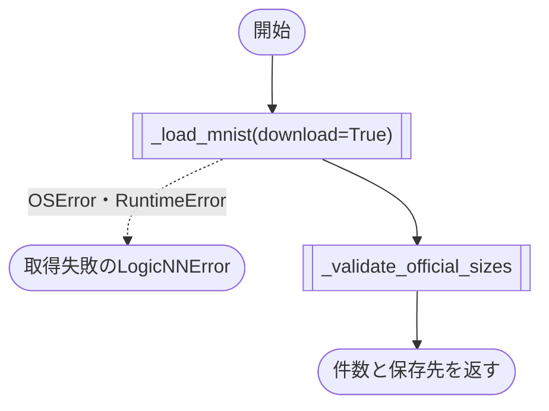
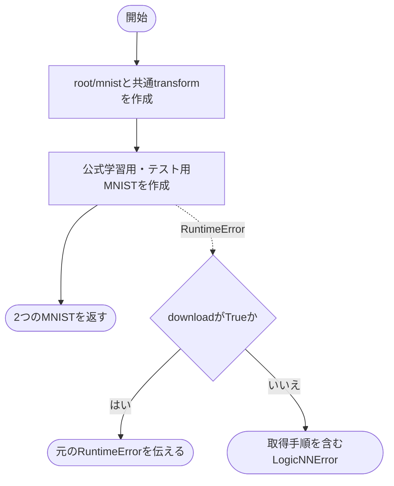
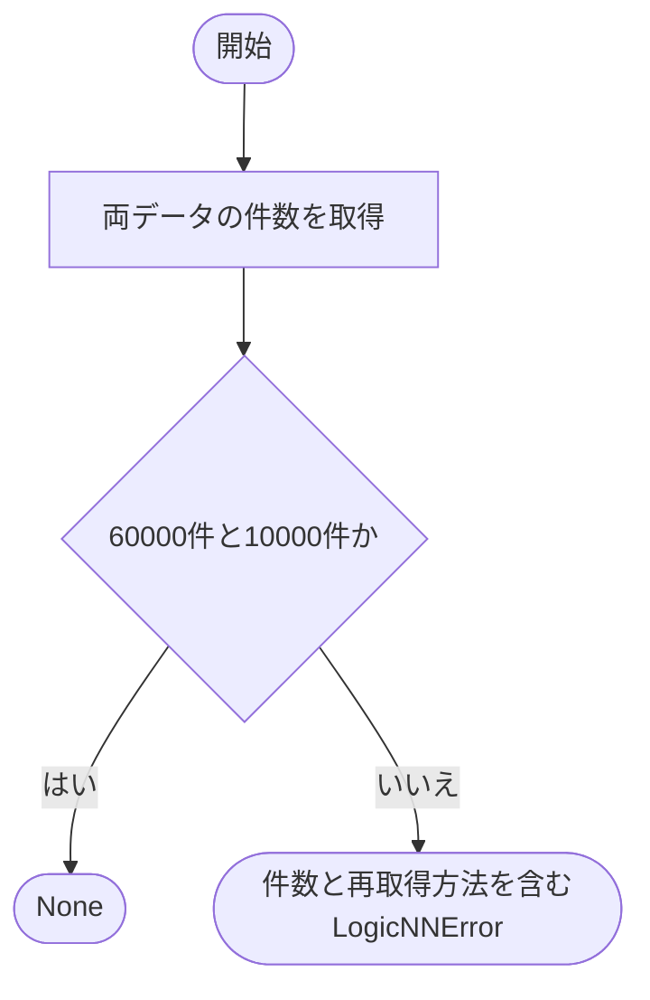
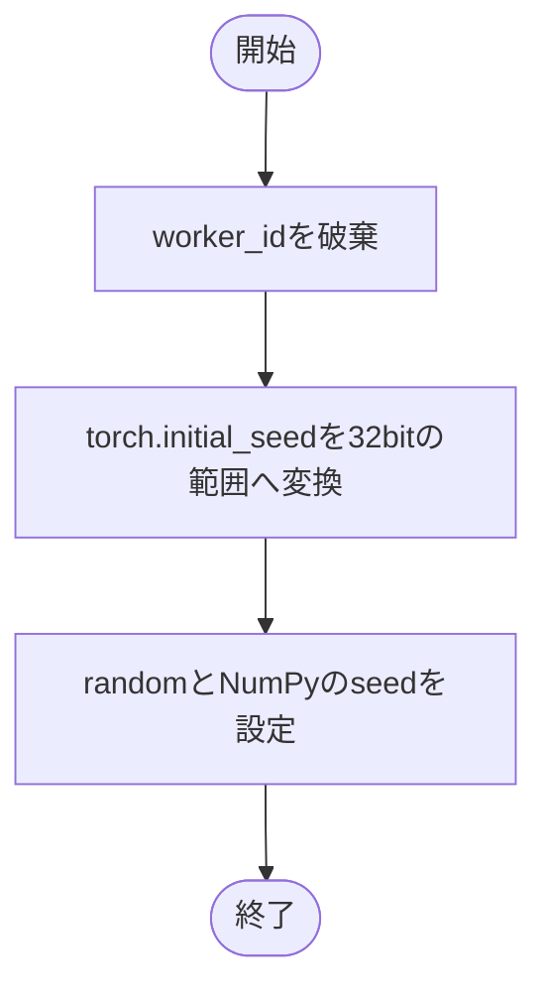

# mnist.py

`utils/data/mnist.py`

MNISTの取得、共通前処理、50000/10000件への分割と3つのDataLoader生成を実装します。公式テスト10000件は分割せず使用します。

{/* source-sha256: 41e83b57dcae9a139edb12c73676bd0149be7909787be2e401320d819008533d */}

{/* function: build_mnist_bundle@29 */}

## build\_mnist\_bundle() {/* #build-mnist-bundle */}

```python
def build_mnist_bundle(config: DataConfig, seed: int, pin_memory: bool) -> DataBundle:
```

### 機能概要

取得済みの公式学習60000件をseed付きで学習50000件・検証10000件へ分割します。分割用と学習シャッフル用に別々の乱数生成器を作り、3つのDataLoaderと前処理情報を返します。

### 引数

| 引数 | 型 | 既定値 | 説明 |
|---|---|---|---|
| `config` | `DataConfig` | `必須` | データ保存先、batch_size、num_workers。 |
| `seed` | `int` | `必須` | 分割用と学習シャッフル用の乱数生成器に設定する値。 |
| `pin_memory` | `bool` | `必須` | 各DataLoaderで固定メモリを使用するか。 |

### 処理の流れ



### 戻り値

型：`DataBundle`

学習・検証・公式テストのDataLoaderとDatasetMetadataを持つDataBundle。

### 例外・注意事項

- すべて `drop_last=False` で最後の端数バッチも使用します。`num_workers > 0` の場合は `persistent_workers=True` です。
- 通常学習で自動ダウンロードは行いません。欠落時は取得ツールの実行を案内します。

### ソースコード

<details>
<summary>build\_mnist\_bundle() の実装を開く</summary>

```python
def build_mnist_bundle(config: DataConfig, seed: int, pin_memory: bool) -> DataBundle:
    """取得済みMNISTを固定件数で分割し、3つのDataLoaderとメタデータを返す。"""
    official_train, official_test = _load_mnist(config.root, download=False)
    _validate_official_sizes(official_train, official_test, config.root)

    split_generator                   = torch.Generator().manual_seed(seed)
    train_generator                   = torch.Generator().manual_seed(seed)
    train_dataset, validation_dataset = random_split(official_train, (MNIST_TRAIN_SIZE, MNIST_VALIDATION_SIZE), generator=split_generator)
    loader_options                    = {
        "batch_size": config.batch_size,
        "num_workers": config.num_workers,
        "pin_memory": pin_memory,
        "drop_last": False,
        "persistent_workers": config.num_workers > 0,
        "worker_init_fn": _seed_worker,
    }
    train_loader      = DataLoader(train_dataset, shuffle=True, generator=train_generator, **loader_options)
    validation_loader = DataLoader(validation_dataset, shuffle=False, **loader_options)
    test_loader       = DataLoader(official_test, shuffle=False, **loader_options)
    metadata          = DatasetMetadata(
        name="mnist",
        input_shape=MNIST_INPUT_SHAPE,
        num_classes=len(MNIST_CLASS_NAMES),
        class_names=MNIST_CLASS_NAMES,
        train_size=len(train_dataset),
        validation_size=len(validation_dataset),
        test_size=len(official_test),
        split_seed=seed,
        preprocessing=PreprocessingMetadata(
            name="binary_threshold",
            parameters={"threshold": 0.0, "comparison": "greater_than"},
            output_dtype="float32",
        ),
    )
    return DataBundle(train_loader=train_loader, validation_loader=validation_loader, test_loader=test_loader, metadata=metadata)
```

</details>

{/* function: download_mnist@66 */}

## download\_mnist() {/* #download-mnist */}

```python
def download_mnist(root: Path) -> tuple[int, int, Path]:
```

### 機能概要

公式学習用・テスト用のデータを取得し、件数を確認します。取得時のOSError・RuntimeErrorは保存先と対処方法を含むLogicNNErrorに変換します。

### 引数

| 引数 | 型 | 既定値 | 説明 |
|---|---|---|---|
| `root` | `Path` | `必須` | データセット共通の保存先。MNISTはこの下のmnistに配置。 |

### 処理の流れ



### 戻り値

型：`tuple[int, int, Path]`

`(公式学習件数, 公式テスト件数, MNIST保存先の絶対Path)`。通常は `(60000, 10000, ...)`。

### 状態の変更・ファイル出力

- 必要なMNISTデータをダウンロードし、root/mnist以下に保存します。

### ソースコード

<details>
<summary>download\_mnist() の実装を開く</summary>

```python
def download_mnist(root: Path) -> tuple[int, int, Path]:
    """MNISTの公式学習用・テスト用データをroot/mnistへ取得して件数と保存先を返す。"""
    try:
        official_train, official_test = _load_mnist(root, download=True)
    except (OSError, RuntimeError) as error:
        raise LogicNNError(
            "MNISTを取得できません",
            detail=f"保存先: {(root / 'mnist').resolve()}\n原因: {error}",
            hint="ネットワーク接続、保存先の権限および空き容量を確認してください",
        ) from error
    _validate_official_sizes(official_train, official_test, root)
    return len(official_train), len(official_test), (root / "mnist").resolve()
```

</details>

{/* function: _load_mnist@80 */}

## \_load\_mnist() {/* #load-mnist */}

```python
def _load_mnist(root: Path, *, download: bool) -> tuple[MNIST, MNIST]:
```

### 機能概要

ToTensorの後に閾値0.0の二値化を行う共通transformを作り、公式学習用とテスト用のMNISTオブジェクトに設定します。transformは各標本の取得時に適用されます。

### 引数

| 引数 | 型 | 既定値 | 説明 |
|---|---|---|---|
| `root` | `Path` | `必須` | 共通データ保存先。 |
| `download` | `bool` | `必須` | 不足するデータを取得する場合はTrue。 |

### 処理の流れ



### 戻り値

型：`tuple[MNIST, MNIST]`

同じ前処理を設定した `(official_train, official_test)`。

### ソースコード

<details>
<summary>\_load\_mnist() の実装を開く</summary>

```python
def _load_mnist(root: Path, *, download: bool) -> tuple[MNIST, MNIST]:
    """共通の前処理を設定してMNISTの公式2分割を生成する。"""
    dataset_root = (root / "mnist").resolve()
    transform    = Compose([ToTensor(), partial(binarize_greater_than, threshold=0.0)])
    try:
        official_train = MNIST(root=dataset_root, train=True, download=download, transform=transform)
        official_test  = MNIST(root=dataset_root, train=False, download=download, transform=transform)
    except RuntimeError as error:
        if download:
            raise
        raise LogicNNError(
            "MNISTデータが見つかりません",
            detail=f"確認先: {dataset_root}\n原因: {error}",
            hint="python tools/download_dataset.py --dataset mnist --root data を実行してください",
        ) from error
    return official_train, official_test
```

</details>

{/* function: _validate_official_sizes@98 */}

## \_validate\_official\_sizes() {/* #validate-official-sizes */}

```python
def _validate_official_sizes(official_train: Sized, official_test: Sized, root: Path) -> None:
```

### 機能概要

公式学習60000件、公式テスト10000件であることを確認します。分割前の公式データを対象にする内部関数です。

### 引数

| 引数 | 型 | 既定値 | 説明 |
|---|---|---|---|
| `official_train` | `Sized` | `必須` | len()で件数を取得できる公式学習データ。 |
| `official_test` | `Sized` | `必須` | len()で件数を取得できる公式テストデータ。 |
| `root` | `Path` | `必須` | エラーに表示するデータ保存先。 |

### 処理の流れ



### 戻り値

型：`None`

`None`。

### ソースコード

<details>
<summary>\_validate\_official\_sizes() の実装を開く</summary>

```python
def _validate_official_sizes(official_train: Sized, official_test: Sized, root: Path) -> None:
    """MNISTの公式学習用・テスト用件数が期待値どおりであることを確認する。"""
    train_size = len(official_train)
    test_size  = len(official_test)
    if train_size != MNIST_TRAIN_SIZE + MNIST_VALIDATION_SIZE or test_size != MNIST_TEST_SIZE:
        raise LogicNNError(
            "MNISTのデータ件数が不正です",
            detail=f"確認先: {(root / 'mnist').resolve()}\n期待値: train=60000, test=10000\n実際値: train={train_size}, test={test_size}",
            hint="MNISTデータを削除してから、データ取得ツールで再取得してください",
        )
```

</details>

{/* function: _seed_worker@110 */}

## \_seed\_worker() {/* #seed-worker */}

```python
def _seed_worker(worker_id: int) -> None:
```

### 機能概要

PyTorchがworkerへ割り当てたseedの下位32bitをPythonとNumPyの乱数生成器へ設定します。worker_id自体からseedを計算するわけではありません。

### 引数

| 引数 | 型 | 既定値 | 説明 |
|---|---|---|---|
| `worker_id` | `int` | `必須` | DataLoaderから渡されるworker番号。この実装では使用しません。 |

### 処理の流れ



### 戻り値

型：`None`

`None`。

### 状態の変更・ファイル出力

- 呼び出されたworker内のPython・NumPyの乱数状態を変更します。

### ソースコード

<details>
<summary>\_seed\_worker() の実装を開く</summary>

```python
def _seed_worker(worker_id: int) -> None:
    """PyTorchが割り当てたworker seedをPythonとNumPyへ反映する。"""
    del worker_id
    worker_seed = torch.initial_seed() % 2**32
    random.seed(worker_seed)
    np.random.seed(worker_seed)
```

</details>

## 関連ファイル

- [utils/config/\_\_init\_\_.py](/code-reference/utils/config/__init__)
- [utils/data/preprocessing.py](/code-reference/utils/data/preprocessing)
- [utils/data/types.py](/code-reference/utils/data/types)
- [utils/exceptions.py](/code-reference/utils/exceptions)
