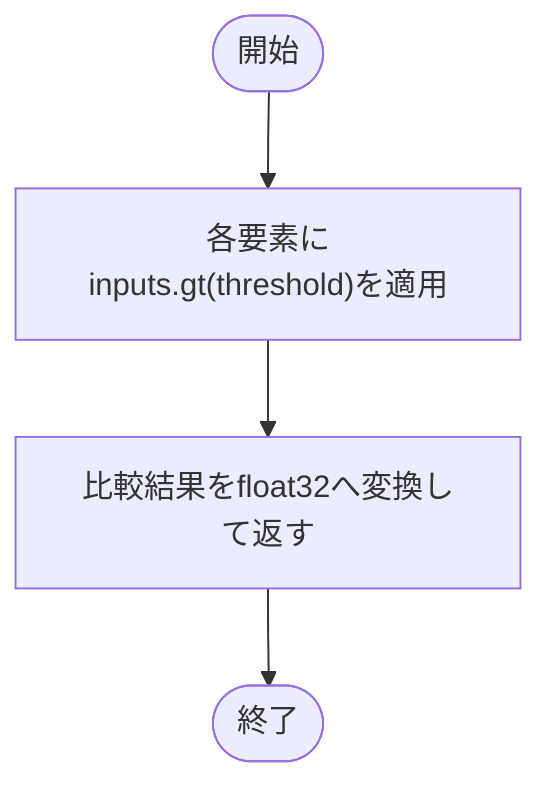

# preprocessing.py

`utils/data/preprocessing.py`

特定のモデルやデータセットから独立したTensorの二値化処理です。

{/* source-sha256: 40bf4c8c1416bcad1f784bd9327689d79f0f679e4ad7ec1b6e05fe4f40712449 */}

{/* function: binarize_greater_than@8 */}

## binarize\_greater\_than() {/* #binarize-greater-than */}

```python
def binarize_greater_than(inputs: torch.Tensor, threshold: float = 0.0) -> torch.Tensor:
```

### 機能概要

各要素を閾値と比較し、閾値より大きければ1.0、それ以外は0.0に変換します。閾値と等しい要素は0になります。

### 引数

| 引数 | 型 | 既定値 | 説明 |
|---|---|---|---|
| `inputs` | `torch.Tensor` | `必須` | 二値化するTensor。形状は任意。 |
| `threshold` | `float` | `0.0` | 0と1を分ける閾値。比較は厳密な `>`。 |

### 処理の流れ



### 戻り値

型：`torch.Tensor`

入力と同じ形状・デバイスのfloat32 Tensor。値は0.0または1.0。

### 例外・注意事項

- 元のTensorは変更しません。比較演算による二値化なので、この関数を通る微分は提供しません。

### 呼び出し例

```python
import torch
from utils.data import binarize_greater_than

binary = binarize_greater_than(torch.tensor([0.0, 0.5, 1.0]), threshold=0.5)
# tensor([0., 0., 1.])
```

### ソースコード

<details>
<summary>binarize\_greater\_than() の実装を開く</summary>

```python
def binarize_greater_than(inputs: torch.Tensor, threshold: float = 0.0) -> torch.Tensor:
    """閾値より大きい要素を1.0、それ以外を0.0のfloat32 Tensorへ変換する。"""
    return inputs.gt(threshold).to(dtype=torch.float32)
```

</details>
