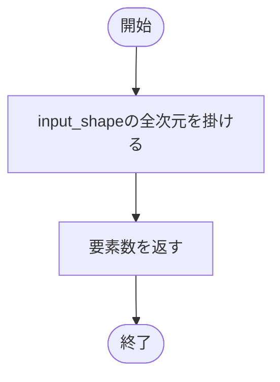

# types.py

`utils/data/types.py`

データセット固有処理から共通の学習処理へ渡すデータ型です。MNIST固有の形状や件数は型に固定していません。

{/* source-sha256: 2175ede55b0ec43d04263c840ef0bcb0a1cb46c899d239c097b47051d7c3482b */}

## PreprocessingMetadata {/* #preprocessingmetadata-class */}

前処理名、設定、出力データ型を記録します。

| 属性 | 型 | 既定値 | 説明 |
|---|---|---|---|
| `name` | `str` | `必須` | 前処理の識別名。 |
| `parameters` | `dict[str, JSONValue]` | `必須` | JSON互換の前処理設定。 |
| `output_dtype` | `str` | `必須` | 前処理後のデータ型の名前。 |

`@dataclass` により、初期化などのメソッドが自動生成されます。表の属性は初期化時に指定します。

このクラスには独自の関数実装はありません。

<details>
<summary>PreprocessingMetadata の定義を開く</summary>

```python
@dataclass(frozen=True)
class PreprocessingMetadata:
    """データセット固有の前処理名、設定値および出力型を保持する。"""

    name: str
    parameters: dict[str, JSONValue]
    output_dtype: str
```

</details>

## DatasetMetadata {/* #datasetmetadata-class */}

モデルとの適合性確認と成果物への記録に用いるデータセット情報です。

| 属性 | 型 | 既定値 | 説明 |
|---|---|---|---|
| `name` | `str` | `必須` | データセット名。 |
| `input_shape` | `tuple[int, ...]` | `必須` | バッチ次元を除く入力1件の形状。 |
| `num_classes` | `int` | `必須` | 分類先のクラス数。 |
| `class_names` | `tuple[str, ...]` | `必須` | クラス番号順のクラス名。 |
| `train_size` | `int` | `必須` | 学習用の標本数。 |
| `validation_size` | `int` | `必須` | 検証用の標本数。 |
| `test_size` | `int` | `必須` | テスト用の標本数。 |
| `split_seed` | `int \| None` | `必須` | 分割に使用したseed。分割しない場合などはNone。 |
| `preprocessing` | `PreprocessingMetadata` | `必須` | 前処理情報。 |

`@dataclass` により、初期化などのメソッドが自動生成されます。表の属性は初期化時に指定します。

{/* function: DatasetMetadata.input_size@39 */}

## DatasetMetadata.input\_size()（プロパティ） {/* #datasetmetadata-input-size */}

```python
def input_size(self) -> int:
```

### 機能概要

バッチを含まない入力形状の各次元を掛け合わせます。形状とは別に値を保存しない読み取り専用プロパティです。

### 引数

`self` 以外に指定する引数はありません。

### 処理の流れ



### 戻り値

型：`int`

入力1件の要素数。

### ソースコード

<details>
<summary>DatasetMetadata.input\_size() の実装を開く</summary>

```python
@property
def input_size(self) -> int:
    """バッチ次元を除いた入力形状の全要素数を返す。"""
    return prod(self.input_shape)
```

</details>

## DataBundle {/* #databundle-class */}

学習・検証・テスト用DataLoaderとデータセット情報をまとめます。

| 属性 | 型 | 既定値 | 説明 |
|---|---|---|---|
| `train_loader` | `DataLoader[Any]` | `必須` | 学習用DataLoader。 |
| `validation_loader` | `DataLoader[Any]` | `必須` | 検証用DataLoader。 |
| `test_loader` | `DataLoader[Any]` | `必須` | テスト用DataLoader。 |
| `metadata` | `DatasetMetadata` | `必須` | 共通データセット情報。 |

`@dataclass` により、初期化などのメソッドが自動生成されます。表の属性は初期化時に指定します。

このクラスには独自の関数実装はありません。

<details>
<summary>DataBundle の定義を開く</summary>

```python
@dataclass(frozen=True)
class DataBundle:
    """学習、検証、公式テストのDataLoaderと共通メタデータをまとめる。"""

    train_loader: DataLoader[Any]
    validation_loader: DataLoader[Any]
    test_loader: DataLoader[Any]
    metadata: DatasetMetadata
```

</details>
