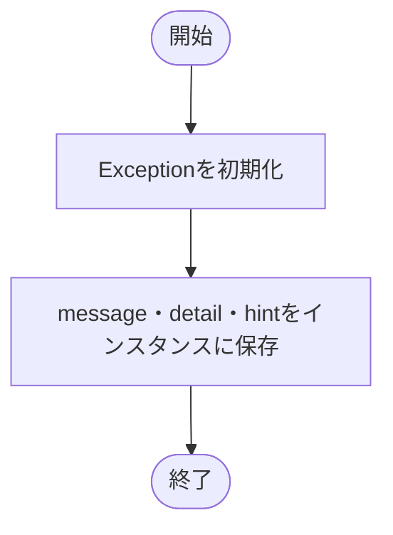

# exceptions.py

`utils/exceptions.py`

利用者へ原因と対処方法を表示するための共通例外を定義します。

{/* source-sha256: 5b122c617ac24d3262fbc7cf4561b0f1f37a8826b3737ed32c1115bf6d04635d */}

## LogicNNError {/* #logicnnerror-class */}

短いエラーメッセージ `message`、詳細 `detail`、対処方法 `hint` を保持する例外です。

継承元：`Exception`

{/* function: LogicNNError.__init__@9 */}

## LogicNNError.\_\_init\_\_() {/* #logicnnerror-init */}

```python
def __init__(self, message: str, *, detail: str, hint: str) -> None:
```

### 機能概要

例外のメッセージを親クラスへ渡し、表示に使う3つの文字列を保持します。例外を生成するだけで、この関数自身がその例外を送出するわけではありません。

### 引数

| 引数 | 型 | 既定値 | 説明 |
|---|---|---|---|
| `message` | `str` | `必須` | 失敗内容を表す短いメッセージ。 |
| `detail` | `str` | `必須` | 対象や原因などの詳細。 |
| `hint` | `str` | `必須` | 利用者に提示する対処方法。 |

### 処理の流れ



### 戻り値

型：`None`

`None`。

### ソースコード

<details>
<summary>LogicNNError.\_\_init\_\_() の実装を開く</summary>

```python
def __init__(self, message: str, *, detail: str, hint: str) -> None:
    """失敗内容、詳細および修正方法を保持する。"""
    super().__init__(message)
    self.message = message
    self.detail  = detail
    self.hint    = hint
```

</details>
