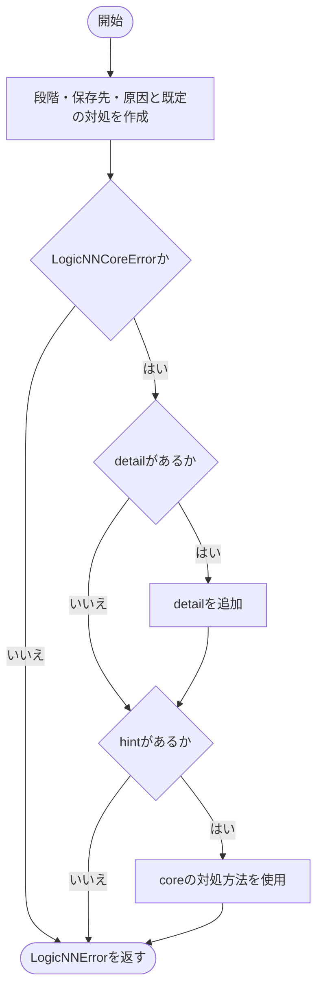
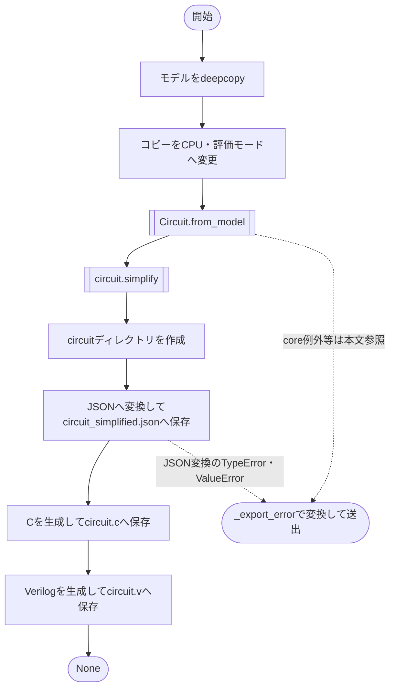

# circuit_exporter.py

`utils/export/circuit_exporter.py`

学習側とlogicNN_coreの回路生成処理を接続します。元のモデルを変更せず、コピーから簡略化したJSON・C・Verilogを生成します。

{/* source-sha256: c51cd4ea4dbf7ce02e9b65e812b94ef057374301cb268bacab21a4f6a5d46fee */}

{/* function: _export_error@19 */}

## \_export\_error() {/* #export-error */}

```python
def _export_error(stage: str, path: Path, error: Exception) -> LogicNNError:
```

### 機能概要

失敗した段階、保存対象、例外の種類と内容をまとめ、アプリ側のLogicNNErrorを作ります。core例外が持つdetail・hintも引き継ぎます。

### 引数

| 引数 | 型 | 既定値 | 説明 |
|---|---|---|---|
| `stage` | `str` | `必須` | 失敗した処理段階の名前。 |
| `path` | `Path` | `必須` | その段階で処理していた保存先。 |
| `error` | `Exception` | `必須` | 元の例外。 |

### 処理の流れ



### 戻り値

型：`LogicNNError`

表示用情報を持つ新しいLogicNNError。生成するだけで送出はしません。

### ソースコード

<details>
<summary>\_export\_error() の実装を開く</summary>

```python
def _export_error(stage: str, path: Path, error: Exception) -> LogicNNError:
    """失敗段階と保存先にcore固有の原因・対処方法を付けて境界の診断へ変換する。"""
    detail = f"段階: {stage}\n保存先: {path}\n原因: {type(error).__name__}: {error}"
    hint   = "モデルの対応演算と保存先・書込権限を確認してください。完了済みの学習・回路成果物は残しています。"
    if isinstance(error, logicnn_core.LogicNNCoreError):
        if error.detail:
            detail += f"\n{error.detail}"
        if error.hint:
            hint = f"{error.hint}\n完了済みの学習・回路成果物は残しています。"
    return LogicNNError("学習後の回路出力に失敗しました", detail=detail, hint=hint)
```

</details>

{/* function: export_circuit@31 */}

## export\_circuit() {/* #export-circuit */}

```python
def export_circuit(model: nn.Module, input_shape: Sequence[int], run_dir: Path) -> None:
```

### 機能概要

モデルをdeepcopyしてCPUの評価モードへ切り替え、回路へ変換・簡略化します。その後、JSON、C、Verilogの順に直接保存します。Cは集約後のスコア、Verilogは集約前の生の論理出力を対象とします。

### 引数

| 引数 | 型 | 既定値 | 説明 |
|---|---|---|---|
| `model` | `nn.Module` | `必須` | 回路化する学習済みモデル。元のモデルは変更しません。 |
| `input_shape` | `Sequence[int]` | `必須` | バッチ次元を除いたモデル入力形状。 |
| `run_dir` | `Path` | `必須` | 作成済みの実行ディレクトリ。 |

### 処理の流れ



外側のtryブロックはモデル複製からVerilog保存までを囲みます。この範囲のLogicNNCoreError・OSError・UnicodeErrorは、処理段階を付けたLogicNNErrorとして送出します。JSON変換時のTypeError・ValueErrorは内側で変換します。

### 戻り値

型：`None`

`None`。

### 状態の変更・ファイル出力

- circuit/circuit_simplified.json、circuit/circuit.c、circuit/circuit.vを順に書き込みます。同名ファイルがあれば上書きします。

### 例外・注意事項

- 一括確定や巻き戻しは行いません。失敗時も、それまでに書き込んだファイルは残ります。書き込み途中のファイルがある可能性もあります。
- CのコンパイルやVerilogシミュレーションはこの関数では実行しません。

### ソースコード

<details>
<summary>export\_circuit() の実装を開く</summary>

```python
def export_circuit(model: nn.Module, input_shape: Sequence[int], run_dir: Path) -> None:
    """CPU評価コピーから3形式を順次保存し、失敗しても完成済み成果物を保持する。"""
    directory = Path(run_dir) / "circuit"
    target    = directory
    stage     = "モデルコピー"
    try:
        copied = deepcopy(model)
        stage  = "CPU転送"
        copied.cpu()
        stage = "評価モード切替"
        copied.eval()
        stage   = "回路変換"
        circuit = logicnn_core.Circuit.from_model(copied, input_shape=list(input_shape))
        stage   = "回路簡略化"
        circuit.simplify()
        stage = "保存ディレクトリ作成"
        directory.mkdir(exist_ok=True)

        stage   = "JSON生成・保存"
        target  = directory / "circuit_simplified.json"
        payload = circuit.to_dict()
        try:
            text = json.dumps(payload, ensure_ascii=False, allow_nan=False, indent=2) + "\n"
        except (TypeError, ValueError) as error:
            raise _export_error(stage, target, error) from error
        target.write_text(text, encoding="utf-8", newline="\n")

        stage  = "C生成・保存"
        target = directory / "circuit.c"
        target.write_text(circuit.c_source(), encoding="utf-8", newline="\n")
        stage  = "Verilog生成・保存"
        target = directory / "circuit.v"
        target.write_text(circuit.verilog_source(), encoding="utf-8", newline="\n")
    except (logicnn_core.LogicNNCoreError, OSError, UnicodeError) as error:
        raise _export_error(stage, target, error) from error
```

</details>

## 関連ファイル

- [utils/exceptions.py](/code-reference/utils/exceptions)
- [utils/logicNN_core/src/logicnn_core/\_\_init\_\_.py](/code-reference/utils/logicNN_core/src/logicnn_core/__init__)
