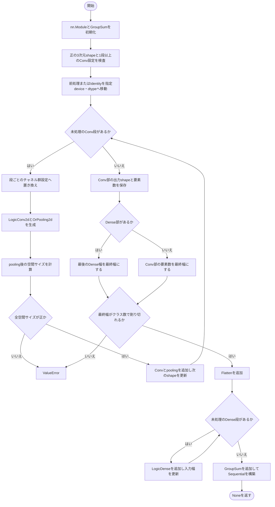
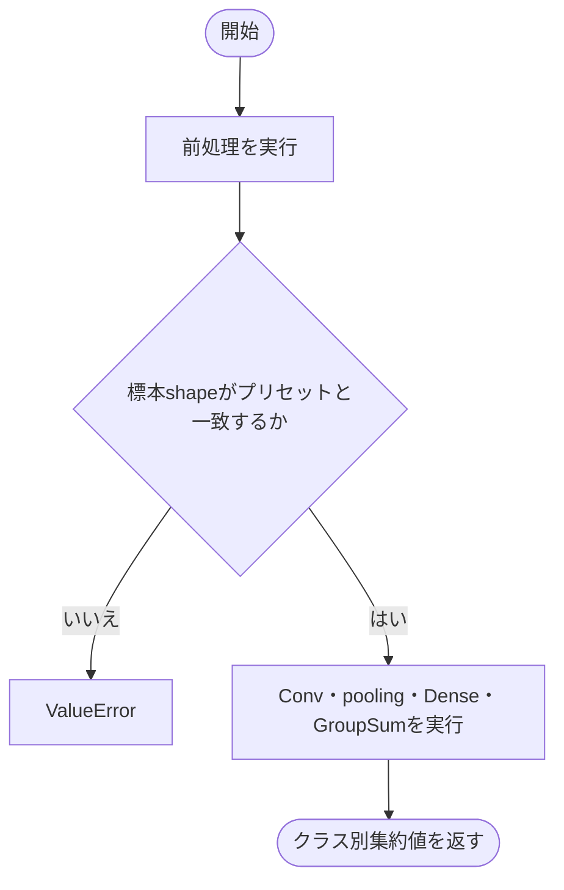
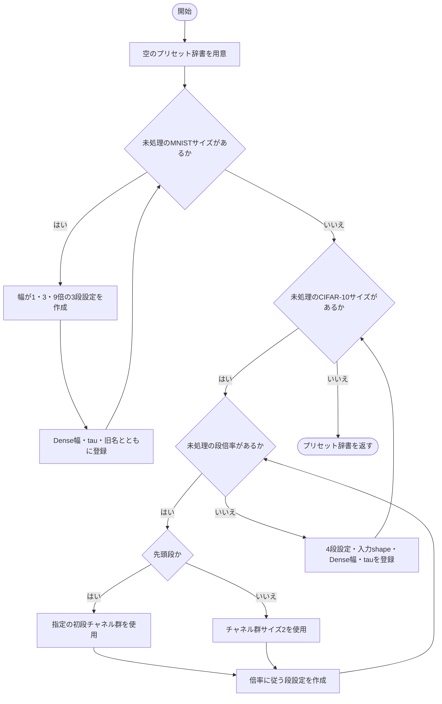

# convolution.py

`utils/logicNN_core/examples/reference_models/convolution.py`

旧MNIST・CIFAR-10のConv構成をプリセットとして記録し、汎用の論理Convモデルを組み立てる例です。前処理後の形状から各Conv・poolingの出力サイズを計算し、Dense部へ接続します。

{/* source-sha256: a6c2b1055696a653d8d8b84b22617e410d96a7c26c40b3636372c8193ff3c7d1 */}

## ConvolutionStage {/* #convolutionstage-class */}

1つの論理Convと直後のOR poolingの設定を保持する不変データクラス。

| 属性 | 型 | 既定値 | 説明 |
|---|---|---|---|
| `out_channels` | `int` | `必須` | Convの出力チャネル数。 |
| `kernel_size` | `int` | `3` | Convの受容野サイズ。 |
| `tree_depth` | `int` | `3` | Convの論理木の深さ。 |
| `stride` | `int` | `1` | Convの移動幅。 |
| `padding` | `int` | `0` | Convのパディング幅。 |
| `pool_size` | `int` | `2` | poolingの窓サイズ。 |
| `pool_stride` | `int` | `2` | poolingの移動幅。 |
| `pool_padding` | `int` | `0` | poolingのパディング幅。 |
| `channel_group_size` | `int \| None` | `None` | この段の固定Conv接続に使うチャネル群のサイズ。 |

`@dataclass` により、初期化などのメソッドが自動生成されます。表の属性は初期化時に指定します。

このクラスには独自の関数実装はありません。

<details>
<summary>ConvolutionStage の定義を開く</summary>

```python
@dataclass(frozen=True, slots=True)
class ConvolutionStage:
    """一つの論理Convと直後のpoolingを決める空間・接続設定を保持する。"""

    out_channels: int
    kernel_size: int = 3
    tree_depth: int = 3
    stride: int = 1
    padding: int = 0
    pool_size: int = 2
    pool_stride: int = 2
    pool_padding: int = 0
    channel_group_size: int | None = None
```

</details>

## ConvolutionPreset {/* #convolutionpreset-class */}

前処理後のshape、Conv段列、Dense層幅、出力集約を記録する不変データクラス。

| 属性 | 型 | 既定値 | 説明 |
|---|---|---|---|
| `input_shape` | `tuple[int, int, int]` | `必須` | 前処理後の[channels, height, width]。 |
| `stages` | `tuple[ConvolutionStage, ...]` | `必須` | Convとpoolingの段を実行順に並べたタプル。 |
| `hidden_features` | `tuple[int, ...]` | `必須` | Conv部後に追加するDense層の出力幅。空ならDense部なし。 |
| `num_classes` | `int` | `必須` | GroupSumのグループ数。 |
| `tau` | `float` | `必須` | GroupSumの除数。 |
| `source_names` | `tuple[str, ...]` | `()` | 対応する旧モデル名。 |

`@dataclass` により、初期化などのメソッドが自動生成されます。表の属性は初期化時に指定します。

このクラスには独自の関数実装はありません。

<details>
<summary>ConvolutionPreset の定義を開く</summary>

```python
@dataclass(frozen=True, slots=True)
class ConvolutionPreset:
    """二値化後の[C,H,W]、Conv段列、Dense幅列とクラス集約を記録する。"""

    input_shape: tuple[int, int, int]
    stages: tuple[ConvolutionStage, ...]
    hidden_features: tuple[int, ...]
    num_classes: int
    tau: float
    source_names: tuple[str, ...] = ()
```

</details>

## ConvolutionReferenceModel {/* #convolutionreferencemodel-class */}

前処理、Conv/pooling列、Flatten、任意のDense列、GroupSumを組み合わせる参考モデル。

継承元：`nn.Module`

{/* function: ConvolutionReferenceModel.__init__@50 */}

## ConvolutionReferenceModel.\_\_init\_\_() {/* #convolutionreferencemodel-init */}

```python
def __init__(
    self, preset: ConvolutionPreset, *, lut: LUTConfig, preprocessing: nn.Module | None = None,
    conv_connections: ConnectionConfig = ConnectionConfig(), dense_connections: ConnectionConfig = ConnectionConfig(),
    gradient_scale: float = 1.0, device: torch.device | str | None = None, dtype: torch.dtype | None = None,
) -> None:
```

### 機能概要

Convとpoolingを段ごとに作り、実際の出力サイズ式から次段の入力shapeを更新します。最後の特徴数がクラス数で割り切れることを確認し、Flatten、任意のDense列、GroupSumを接続します。

### 引数

| 引数 | 型 | 既定値 | 説明 |
|---|---|---|---|
| `preset` | `ConvolutionPreset` | `必須` | 前処理後のshapeと各段の設定を持つConvolutionPreset。 |
| `lut` | `LUTConfig` | `必須` | 全論理層に使用するLUTConfig。 |
| `preprocessing` | `nn.Module \| None` | `None` | 利用者が指定する前処理。NoneはIdentity。 |
| `conv_connections` | `ConnectionConfig` | `ConnectionConfig()` | Convの接続設定。channel_group_sizeは段ごとの値で置き換えます。 |
| `dense_connections` | `ConnectionConfig` | `ConnectionConfig()` | Dense部の接続設定。 |
| `gradient_scale` | `float` | `1.0` | 入力へ伝わる逆伝播の勾配倍率。順伝播の値は変えません。 |
| `device` | `torch.device \| str \| None` | `None` | 重みと接続を生成するデバイス。NoneはPyTorchの既定デバイス。 |
| `dtype` | `torch.dtype \| None` | `None` | LUT重みの浮動小数点型。NoneはPyTorchの既定dtype。 |

### 処理の流れ



### 戻り値

型：`None`

None。

### 状態の変更・ファイル出力

- 前処理は複製せず移動します。各論理層の重み・接続を生成し、乱数を消費します。

### ソースコード

<details>
<summary>ConvolutionReferenceModel.\_\_init\_\_() の実装を開く</summary>

```python
def __init__(
    self, preset: ConvolutionPreset, *, lut: LUTConfig, preprocessing: nn.Module | None = None,
    conv_connections: ConnectionConfig = ConnectionConfig(), dense_connections: ConnectionConfig = ConnectionConfig(),
    gradient_scale: float = 1.0, device: torch.device | str | None = None, dtype: torch.dtype | None = None,
) -> None:
    """各層の実geometryから次の入力shapeを求め、Conv列とDense列を組み立てる。"""
    super().__init__()
    output = GroupSum(preset.num_classes, tau=preset.tau)
    if len(preset.input_shape) != 3 or any(size <= 0 for size in preset.input_shape) or not preset.stages:
        raise ValueError("input_shapeは正の[C,H,W]、stagesは1段以上で指定してください")
    self.preset      = preset
    self.input_shape = preset.input_shape
    self.input_size  = math.prod(preset.input_shape)
    self.num_classes = preset.num_classes
    self.preprocessing = nn.Identity() if preprocessing is None else preprocessing
    self.preprocessing.to(device=device, dtype=dtype)
    channels, *spatial = preset.input_shape
    layers: list[nn.Module] = []
    for stage in preset.stages:
        connections = replace(conv_connections, channel_group_size=stage.channel_group_size)
        conv = LogicConv2d(tuple(spatial), channels, stage.out_channels, stage.tree_depth, stage.kernel_size, stride=stage.stride,
                           padding=stage.padding, lut=lut, connections=connections, gradient_scale=gradient_scale, device=device, dtype=dtype)
        pool = OrPooling2d(stage.pool_size, stride=stage.pool_stride, padding=stage.pool_padding)
        spatial = tuple((size + 2 * pad - width) // step + 1 for size, width, step, pad in
                        zip(conv.output_size, pool.kernel_size, pool.stride, pool.padding))
        if any(size <= 0 for size in spatial):
            raise ValueError("Conv/pooling後の空間サイズは正である必要があります")
        layers.extend((conv, pool))
        channels = stage.out_channels
    self.encoded_output_shape = (channels, *spatial)
    in_features = math.prod(self.encoded_output_shape)
    final_width = preset.hidden_features[-1] if preset.hidden_features else in_features
    if final_width % preset.num_classes:
        raise ValueError("最終特徴数はnum_classesで割り切れる必要があります")
    layers.append(nn.Flatten())
    for out_features in preset.hidden_features:
        layers.append(LogicDense(in_features, out_features, lut=lut, connections=dense_connections, gradient_scale=gradient_scale,
                                 device=device, dtype=dtype))
        in_features = out_features
    self.network = nn.Sequential(*layers, output)
```

</details>

{/* function: ConvolutionReferenceModel.forward@91 */}

## ConvolutionReferenceModel.forward() {/* #convolutionreferencemodel-forward */}

```python
def forward(self, inputs: Tensor) -> Tensor:
```

### 機能概要

前処理結果のチャネル数と空間shapeを確認し、Conv/pooling・Dense・GroupSumからなるネットワークでクラス別の値を計算します。

### 引数

| 引数 | 型 | 既定値 | 説明 |
|---|---|---|---|
| `inputs` | `Tensor` | `必須` | 前処理モジュールが受け付ける[batch, ...]の入力Tensor。 |

### 処理の流れ



### 戻り値

型：`Tensor`

[batch, num_classes]のクラス別集約値。確率化やargmaxは行いません。

### ソースコード

<details>
<summary>ConvolutionReferenceModel.forward() の実装を開く</summary>

```python
def forward(self, inputs: Tensor) -> Tensor:
    """前処理後の[C,H,W]を確認し、論理ConvとDenseを通したクラス集約値を返す。"""
    values = self.preprocessing(inputs)
    if values.shape[1:] != self.input_shape:
        raise ValueError(f"前処理後の入力は[batch, {self.input_shape}]で指定してください")
    return self.network(values)
```

</details>

{/* function: _build_presets@99 */}

## \_build\_presets() {/* #build-presets */}

```python
def _build_presets() -> dict[str, ConvolutionPreset]:
```

### 機能概要

MNIST用の3段Conv構成とCIFAR-10用の4段Conv構成を、チャネル幅・bit数・tau・初段のチャネル群設定を変えて登録します。モデル自体は作りません。

### 引数

指定する引数はありません。

### 処理の流れ



### 戻り値

型：`dict[str, ConvolutionPreset]`

名前をキーとするConvolutionPreset辞書。

### 例外・注意事項

- import時に実行され、CONVOLUTION_PRESETSへ代入されます。データ取得や前処理を自動で行う一覧ではありません。

### ソースコード

<details>
<summary>\_build\_presets() の実装を開く</summary>

```python
def _build_presets() -> dict[str, ConvolutionPreset]:
    """旧Convモデルのchannel倍率・padding・tauを、重みを確保しないpresetへ写す。"""
    presets: dict[str, ConvolutionPreset] = {}
    for size, width, tau in (("base", 16, 1.0), ("tiny", 4, 1.0), ("small", 16, 6.5), ("medium", 64, 28.0), ("large", 1024, 35.0)):
        stages = (ConvolutionStage(width, kernel_size=5), ConvolutionStage(3 * width, pool_padding=1),
                  ConvolutionStage(9 * width, pool_padding=1))
        source = "ClgnMnist" + ("" if size == "base" else size.title())
        presets[f"mnist_{size}"] = ConvolutionPreset((1, 28, 28), stages, (1280 * width, 640 * width, 320 * width), 10, tau, (source,))
    for size, width, bits, tau, first_group in (("small", 32, 2, 20.0, 2), ("medium", 256, 2, 40.0, 2), ("large", 512, 5, 280.0, 2),
                                               ("small2", 32, 2, 20.0, 1), ("medium2", 256, 2, 40.0, 1)):
        stages = tuple(ConvolutionStage(factor * width, padding=1, channel_group_size=first_group if index == 0 else 2)
                       for index, factor in enumerate((1, 4, 16, 32)))
        presets[f"cifar10_{size}"] = ConvolutionPreset((3 * bits, 32, 32), stages, (1280 * width, 640 * width, 320 * width), 10, tau,
                                                      (f"ClgnCifar10{size.title()}",))
    return presets
```

</details>

## 関連ファイル

- [utils/logicNN_core/src/logicnn_core/layer_settings.py](/code-reference/utils/logicNN_core/src/logicnn_core/layer_settings)
- [utils/logicNN_core/src/logicnn_core/layers/\_\_init\_\_.py](/code-reference/utils/logicNN_core/src/logicnn_core/layers/__init__)
