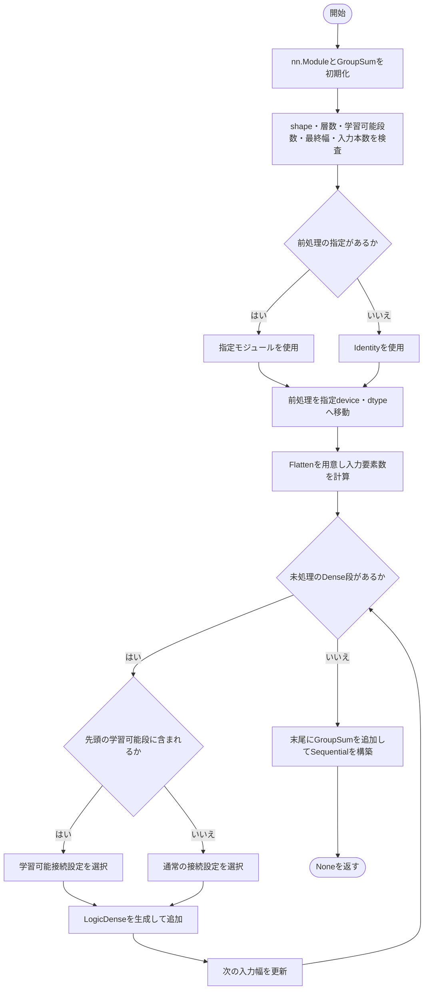
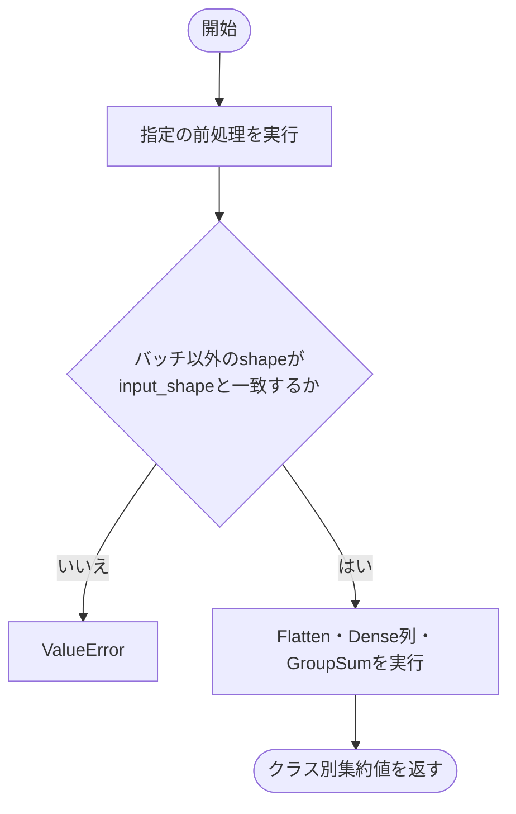
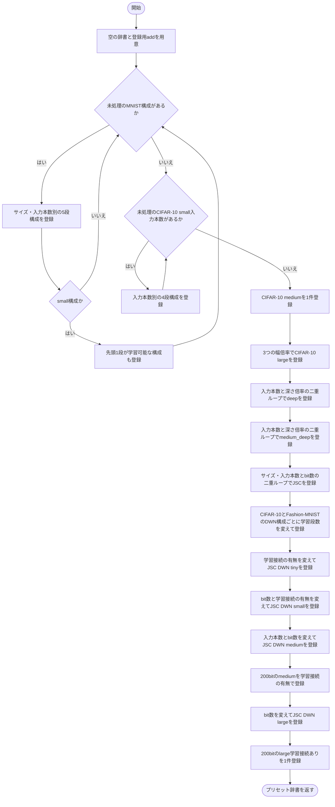
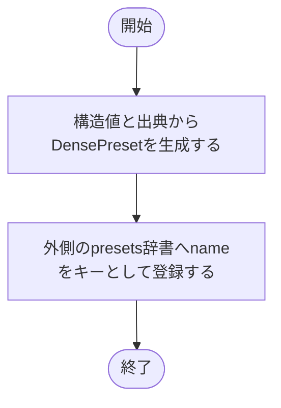

# dense.py

`utils/logicNN_core/examples/reference_models/dense.py`

旧モデルのDense構成を不変のプリセットとして整理し、共通のモデルクラスで組み立てる例です。二値化後の形状をプリセットに記録し、データの取得や前処理の選択は呼び出し元に任せます。

{/* source-sha256: f983e5336b664b373c564d42c16111d1a3718934dc446896dcbbf3451a79d3c8 */}

## DensePreset {/* #densepreset-class */}

論理Denseモデルの構造だけを記録する、変更不可のデータクラス。

| 属性 | 型 | 既定値 | 説明 |
|---|---|---|---|
| `input_shape` | `tuple[int, ...]` | `必須` | 前処理後の1標本の形状。 |
| `hidden_features` | `tuple[int, ...]` | `必須` | 各Dense層の出力幅。順序が層の順序です。 |
| `num_classes` | `int` | `必須` | 末尾GroupSumのグループ数。 |
| `tau` | `float` | `必須` | GroupSumに渡す除数。 |
| `num_inputs` | `int` | `2` | 各LUTの入力本数。 |
| `learnable_layers` | `int` | `0` | 先頭から何段を学習可能接続にするか。 |
| `source_names` | `tuple[str, ...]` | `()` | 対応する旧モデル名。出典の追跡用です。 |

`@dataclass` により、初期化などのメソッドが自動生成されます。表の属性は初期化時に指定します。

このクラスには独自の関数実装はありません。

<details>
<summary>DensePreset の定義を開く</summary>

```python
@dataclass(frozen=True, slots=True)
class DensePreset:
    """二値化後の入力shape、各層幅、集約と接続方式の構造情報だけを保持する。"""

    input_shape: tuple[int, ...]
    hidden_features: tuple[int, ...]
    num_classes: int
    tau: float
    num_inputs: int = 2
    learnable_layers: int = 0
    source_names: tuple[str, ...] = ()
```

</details>

## DenseReferenceModel {/* #densereferencemodel-class */}

明示した前処理、Flatten、論理Dense列、GroupSumを順に実行する参考モデル。

継承元：`nn.Module`

{/* function: DenseReferenceModel.__init__@36 */}

## DenseReferenceModel.\_\_init\_\_() {/* #densereferencemodel-init */}

```python
def __init__(
    self, preset: DensePreset, *, lut: LUTConfig, preprocessing: nn.Module | None = None,
    connections: ConnectionConfig = ConnectionConfig(), learnable_connections: ConnectionConfig = ConnectionConfig(kind="learnable"),
    gradient_scale: float = 1.0, device: torch.device | str | None = None, dtype: torch.dtype | None = None,
) -> None:
```

### 機能概要

入力shape・層幅・クラス集約の条件を確認し、Flatten後に指定幅のLogicDenseを順に作ります。先頭のlearnable_layers段だけ学習可能接続を使い、最後にGroupSumを追加します。

### 引数

| 引数 | 型 | 既定値 | 説明 |
|---|---|---|---|
| `preset` | `DensePreset` | `必須` | 前処理後の形状、層幅、出力集約を定めるDensePreset。 |
| `lut` | `LUTConfig` | `必須` | プリセットとnum_inputsが一致するLUTConfig。 |
| `preprocessing` | `nn.Module \| None` | `None` | 利用者が指定する前処理モジュール。NoneならIdentity。 |
| `connections` | `ConnectionConfig` | `ConnectionConfig()` | 先頭の学習可能段以外に使用する接続設定。 |
| `learnable_connections` | `ConnectionConfig` | `ConnectionConfig(kind='learnable')` | 先頭の指定段で使う学習可能接続の設定。 |
| `gradient_scale` | `float` | `1.0` | 入力へ伝わる逆伝播の勾配倍率。順伝播の値は変えません。 |
| `device` | `torch.device \| str \| None` | `None` | 重みと接続を生成するデバイス。NoneはPyTorchの既定デバイス。 |
| `dtype` | `torch.dtype \| None` | `None` | LUT重みの浮動小数点型。NoneはPyTorchの既定dtype。 |

### 処理の流れ



### 戻り値

型：`None`

None。

### 状態の変更・ファイル出力

- 前処理モジュールを複製せず指定device・dtypeへ移動します。各Denseの初期化で乱数を消費します。

### 例外・注意事項

- データセットのダウンロードや二値化方式の自動選択は行いません。

### ソースコード

<details>
<summary>DenseReferenceModel.\_\_init\_\_() の実装を開く</summary>

```python
def __init__(
    self, preset: DensePreset, *, lut: LUTConfig, preprocessing: nn.Module | None = None,
    connections: ConnectionConfig = ConnectionConfig(), learnable_connections: ConnectionConfig = ConnectionConfig(kind="learnable"),
    gradient_scale: float = 1.0, device: torch.device | str | None = None, dtype: torch.dtype | None = None,
) -> None:
    """presetの形状を確認し、先頭の指定段だけ学習可能接続を使って新APIの層を作る。"""
    super().__init__()
    output = GroupSum(preset.num_classes, tau=preset.tau)
    if not preset.input_shape or any(size <= 0 for size in preset.input_shape) or not preset.hidden_features:
        raise ValueError("input_shapeは正の空でないshape、hidden_featuresは1段以上で指定してください")
    if not 0 <= preset.learnable_layers <= len(preset.hidden_features):
        raise ValueError("learnable_layersは0以上Dense段数以下で指定してください")
    if preset.hidden_features[-1] % preset.num_classes:
        raise ValueError("最終Dense幅はnum_classesで割り切れる必要があります")
    if lut.num_inputs != preset.num_inputs:
        raise ValueError("LUTConfig.num_inputsはpresetのnum_inputsと一致させてください")
    if preset.learnable_layers and learnable_connections.kind != "learnable":
        raise ValueError("先頭の学習可能接続にはkind='learnable'を指定してください")
    self.preset      = preset
    self.input_shape = preset.input_shape
    self.input_size  = math.prod(preset.input_shape)
    self.num_classes = preset.num_classes
    self.preprocessing = nn.Identity() if preprocessing is None else preprocessing
    self.preprocessing.to(device=device, dtype=dtype)
    layers: list[nn.Module] = [nn.Flatten()]
    in_features = self.input_size
    for index, out_features in enumerate(preset.hidden_features):
        selected = learnable_connections if index < preset.learnable_layers else connections
        layers.append(LogicDense(in_features, out_features, lut=lut, connections=selected, gradient_scale=gradient_scale, device=device, dtype=dtype))
        in_features = out_features
    self.network = nn.Sequential(*layers, output)
```

</details>

{/* function: DenseReferenceModel.forward@68 */}

## DenseReferenceModel.forward() {/* #densereferencemodel-forward */}

```python
def forward(self, inputs: Tensor) -> Tensor:
```

### 機能概要

前処理を実行し、結果の標本形状がプリセットと一致した場合にDenseネットワークへ渡します。

### 引数

| 引数 | 型 | 既定値 | 説明 |
|---|---|---|---|
| `inputs` | `Tensor` | `必須` | 前処理モジュールが受け付ける[batch, ...]の入力Tensor。 |

### 処理の流れ



### 戻り値

型：`Tensor`

[batch, num_classes]のクラス別集約値。確率化やargmaxは行いません。

### ソースコード

<details>
<summary>DenseReferenceModel.forward() の実装を開く</summary>

```python
def forward(self, inputs: Tensor) -> Tensor:
    """前処理後のshapeを保護し、二値化済み入力からクラス別集約値を返す。"""
    values = self.preprocessing(inputs)
    if values.shape[1:] != self.input_shape:
        raise ValueError(f"前処理後の入力は[batch, {self.input_shape}]で指定してください")
    return self.network(values)
```

</details>

{/* function: _build_presets@76 */}

## \_build\_presets() {/* #build-presets */}

```python
def _build_presets() -> dict[str, DensePreset]:
```

### 機能概要

MNIST、CIFAR-10、JSC、Fashion-MNISTの旧構成値から、名前をキーとするDensePreset辞書を作ります。幅・段数・入力本数・bit数・接続学習段数の組み合わせを登録し、旧クラス名も記録します。

### 引数

指定する引数はありません。

### 処理の流れ



後半の各登録ブロックは、ソース内の構成系列ごとのループをまとめています。smallとlargeの200bit構成では、旧モデルの別名もsource_namesへ保存します。形状や層幅の具体的な値はDensePresetとソースコードで確認できます。

### 戻り値

型：`dict[str, DensePreset]`

名前からDensePresetへ対応する辞書。モデル重みやデータは生成しません。

### 例外・注意事項

- モジュールのimport時に実行され、結果がDENSE_PRESETSへ代入されます。二値化の具体的な実装はプリセットに含みません。

### ソースコード

<details>
<summary>\_build\_presets() の実装を開く</summary>

```python
def _build_presets() -> dict[str, DensePreset]:
    """旧presetの数値をまとめ、重みやデータを生成せず構成一覧だけを作る。"""
    presets: dict[str, DensePreset] = {}

    def add(name: str, shape: tuple[int, ...], widths: tuple[int, ...], classes: int, tau: float, rank: int, learn: int, *sources: str) -> None:
        """解釈済みの一構成を旧名の出典とともに登録する。"""
        presets[name] = DensePreset(shape, widths, classes, tau, rank, learn, sources)

    for size, rank, width, tau in (("tiny", 2, 1000, 10.0), ("small", 2, 8000, 10.0), ("small", 4, 4000, 10.0),
                                   ("small", 6, 2330, 10.0), ("medium", 2, 64000, 1 / 0.03)):
        suffix = "" if rank == 2 else f"_rank{rank}"
        source = f"DlgnMnist{size.title()}" + ("" if rank == 2 else f"Rank{rank}")
        add(f"mnist_{size}{suffix}", (1, 28, 28), (width,) * 5, 10, tau, rank, 0, source)
        if size == "small":
            add(f"mnist_{size}{suffix}_learn1", (1, 28, 28), (width,) * 5, 10, tau, rank, 1, source + "Learn1")

    for rank, width in ((2, 12000), (4, 6000), (6, 3000)):
        suffix = "" if rank == 2 else f"_rank{rank}"
        source = "DlgnCifar10Small" + ("" if rank == 2 else f"Rank{rank}")
        add(f"cifar10_small{suffix}", (9, 32, 32), (width,) * 4, 10, 1 / 0.03, rank, 0, source)
    add("cifar10_medium", (9, 32, 32), (128000,) * 4, 10, 100.0, 2, 0, "DlgnCifar10Medium")
    for factor in (1, 2, 4):
        suffix = "" if factor == 1 else str(factor)
        add(f"cifar10_large{suffix}", (15, 32, 32), (256000 * factor,) * 5, 10, 100.0, 2, 0, f"DlgnCifar10Large{suffix}")
    for rank, width, tau in ((2, 12000, 1 / 0.03), (4, 6000, 100.0), (6, 4000, 100.0)):
        for factor in (1, 2, 3, 4, 5, 10, 20):
            depth  = "" if factor == 1 else str(factor)
            suffix = "" if rank == 2 else f"_rank{rank}"
            source = f"DlgnCifar10Deep{depth}" + ("" if rank == 2 else f"Rank{rank}")
            add(f"cifar10_deep{depth}{suffix}", (9, 32, 32), (width,) * (4 * factor), 10, tau, rank, 0, source)
    for rank, width in ((2, 128000), (4, 56000), (6, 42000)):
        for factor in (1, 3):
            depth  = "" if factor == 1 else str(factor)
            suffix = "" if rank == 2 else f"_rank{rank}"
            source = f"DlgnCifar10MediumDeep{depth}" + ("" if rank == 2 else f"Rank{rank}")
            add(f"cifar10_medium_deep{depth}{suffix}", (9, 32, 32), (width,) * (4 * factor), 10, 100.0, rank, 0, source)

    for size, depth, rank, width in (("small", 2, 2, 32000), ("small", 2, 4, 16000), ("medium", 4, 2, 128000),
                                     ("medium", 4, 4, 64000), ("medium", 4, 6, 42330)):
        for bits in (10, 20, 50, 100):
            suffix = "" if rank == 2 else f"_rank{rank}"
            source = f"DlgnJsc{size.title()}{bits}Bits" + ("" if rank == 2 else f"Rank{rank}")
            add(f"jsc_{size}_{bits}bit{suffix}", (16 * bits,), (width,) * depth, 5, 50.0, rank, 0, source)

    for dataset, bits, rank, widths, tau, learning in (
        ("cifar10", 10, 2, (24000, 24000), 1 / 0.03, (0, 2)), ("cifar10", 10, 6, (8000,), 1 / 0.03, (0,)),
        ("fashion_mnist", 7, 2, (8000, 8000), 1 / 0.061, (0, 2)), ("fashion_mnist", 7, 6, (2000, 2000), 1 / 0.122, (0, 2)),
    ):
        shape = (3 * bits, 32, 32) if dataset == "cifar10" else (1, 28, 28 * bits)
        base  = "DlgnCifar10Dwn" if dataset == "cifar10" else "DlgnFashionMnistDwn"
        for learn in learning:
            suffix = "" if learn == 0 else f"_learn{learn}"
            source = f"{base}Rank{rank}" + ("" if learn == 0 else f"Learn{learn}")
            add(f"{dataset}_dwn_rank{rank}{suffix}", shape, widths, 10, tau, rank, learn, source)

    for learn in (0, 1):
        add(f"jsc_dwn_tiny_rank6_learn{learn}", (3200,), (10,), 5, 1 / 0.7, 6, learn, f"DlgnJscDwnTinyRank6Learn{learn}")
    for bits in (1, 2, 5, 10, 20, 50, 100, 200):
        for learn in (0, 1):
            source  = f"DlgnJscDwnSmallRank6Bits{bits}" + ("Learn1" if learn else "")
            aliases = (f"DlgnJscDwnSmallRank6Learn{learn}",) if bits == 200 else ()
            add(f"jsc_dwn_small_{bits}bit_rank6_learn{learn}", (16 * bits,), (50,), 5, 1 / 0.3, 6, learn, source, *aliases)
    for rank, width in ((2, 1080), (4, 540), (6, 360)):
        for bits in (2, 5, 10, 20, 50, 100):
            add(f"jsc_dwn_medium_{bits}bit_rank{rank}", (16 * bits,), (width,), 5, 10.0, rank, 0, f"DlgnJscDwnMediumRank{rank}Bits{bits}")
    for learn in (0, 1):
        add(f"jsc_dwn_medium_200bit_rank6_learn{learn}", (3200,), (360,), 5, 10.0, 6, learn, f"DlgnJscDwnMediumRank6Learn{learn}")
    for bits in (2, 5, 10, 20, 50, 100, 200):
        aliases = ("DlgnJscDwnLargeRank6Learn0",) if bits == 200 else ()
        add(f"jsc_dwn_large_{bits}bit_rank6", (16 * bits,), (2400,), 5, 1 / 0.03, 6, 0, f"DlgnJscDwnLargeRank6Bits{bits}", *aliases)
    add("jsc_dwn_large_200bit_rank6_learn1", (3200,), (2400,), 5, 1 / 0.03, 6, 1, "DlgnJscDwnLargeRank6Learn1")
    return presets
```

</details>

{/* function: _build_presets.add@80 */}

## \_build\_presets.add() {/* #build-presets-add */}

```python
def add(name: str, shape: tuple[int, ...], widths: tuple[int, ...], classes: int, tau: float, rank: int, learn: int, *sources: str) -> None:
```

### 機能概要

受け取った構造値からDensePresetを1件作り、外側のpresets辞書へ指定名で登録します。

### 引数

| 引数 | 型 | 既定値 | 説明 |
|---|---|---|---|
| `name` | `str` | `必須` | プリセット辞書のキー。 |
| `shape` | `tuple[int, ...]` | `必須` | 前処理後の標本形状。 |
| `widths` | `tuple[int, ...]` | `必須` | Dense層の出力幅を順に並べたタプル。 |
| `classes` | `int` | `必須` | クラス数、すなわちGroupSumのグループ数。 |
| `tau` | `float` | `必須` | GroupSumの除数。 |
| `rank` | `int` | `必須` | 1ゲートの入力本数。 |
| `learn` | `int` | `必須` | 先頭から学習可能接続を使う段数。 |
| `*sources` | `str` | `省略可` | 対応する旧モデル名。複数指定できます。 |

### 処理の流れ



### 戻り値

型：`None`

None。

### 状態の変更・ファイル出力

- 外側の関数が持つpresets辞書を更新します。

### ソースコード

<details>
<summary>\_build\_presets.add() の実装を開く</summary>

```python
def add(name: str, shape: tuple[int, ...], widths: tuple[int, ...], classes: int, tau: float, rank: int, learn: int, *sources: str) -> None:
    """解釈済みの一構成を旧名の出典とともに登録する。"""
    presets[name] = DensePreset(shape, widths, classes, tau, rank, learn, sources)
```

</details>

## 関連ファイル

- [utils/logicNN_core/src/logicnn_core/layer_settings.py](/code-reference/utils/logicNN_core/src/logicnn_core/layer_settings)
- [utils/logicNN_core/src/logicnn_core/layers/\_\_init\_\_.py](/code-reference/utils/logicNN_core/src/logicnn_core/layers/__init__)
