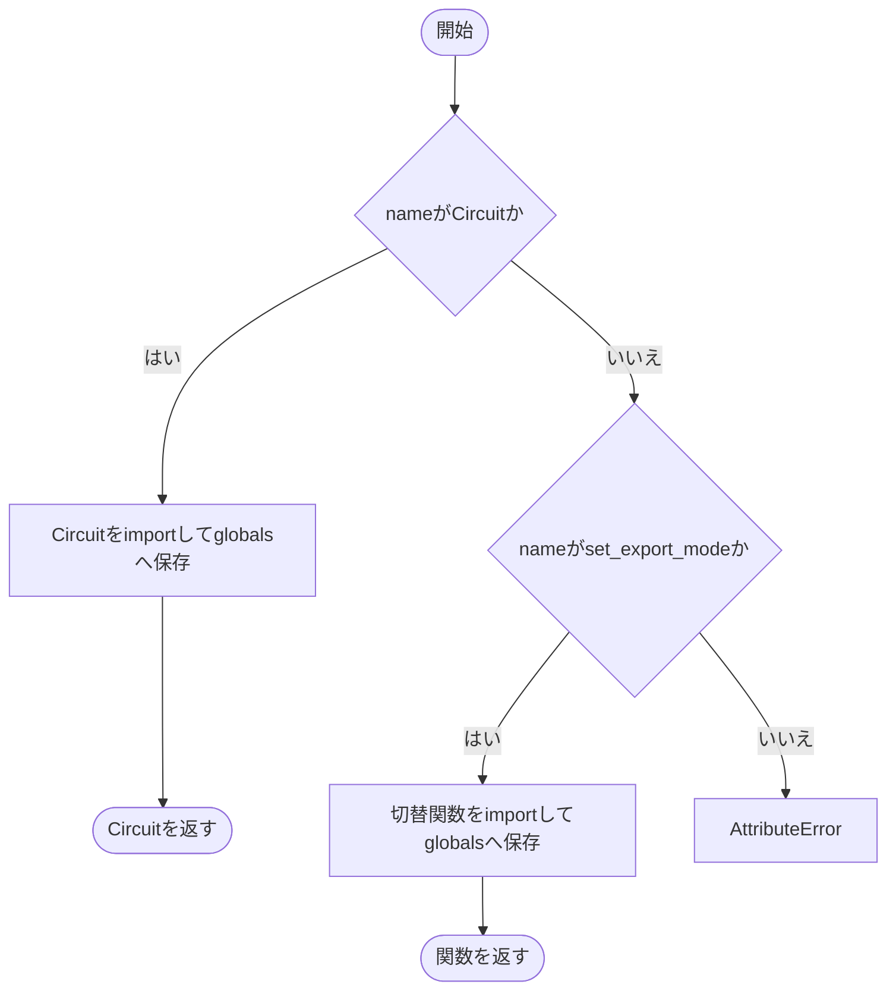

# __init__.py

`utils/logicNN_core/src/logicnn_core/__init__.py`

logicnn_coreの公開APIとバージョンを定義します。LogicNNCoreErrorは通常のimportで公開し、Circuitとset_export_modeは初回参照時に読み込みます。

{/* source-sha256: c7a7fda5824933d4e1340660711b1a2b3365fc1c6a7a809fa073643af844b38d */}

{/* function: __getattr__@15 */}

## \_\_getattr\_\_() {/* #getattr */}

```python
def __getattr__(name: str) -> Any:
```

### 機能概要

未定義のモジュール属性が参照されたときに、公開対象だけを遅延importします。読み込んだ属性をglobalsへ保存し、以後の参照では再びこの関数を通らないようにします。

### 引数

| 引数 | 型 | 既定値 | 説明 |
|---|---|---|---|
| `name` | `str` | `必須` | 参照された属性名。対応する名前はCircuitとset_export_mode。 |

### 処理の流れ



### 戻り値

型：`Any`

Circuitクラスまたはset_export_mode関数。その他の名前はAttributeError。

### 状態の変更・ファイル出力

- 初回参照で関連モジュールをimportし、公開属性をキャッシュします。

### ソースコード

<details>
<summary>\_\_getattr\_\_() の実装を開く</summary>

```python
def __getattr__(name: str) -> Any:
    """回路と共通切替を遅延公開し、設定のみのimportを軽量に保つ。"""
    if name == "Circuit":
        from .circuit import Circuit

        globals()[name] = Circuit
        return Circuit
    if name == "set_export_mode":
        from .export_mode import set_export_mode

        globals()[name] = set_export_mode
        return set_export_mode
    raise AttributeError(f"module {__name__!r} has no attribute {name!r}")
```

</details>

## 関連ファイル

- [utils/logicNN_core/src/logicnn_core/circuit/\_\_init\_\_.py](/code-reference/utils/logicNN_core/src/logicnn_core/circuit/__init__)
- [utils/logicNN_core/src/logicnn_core/exceptions.py](/code-reference/utils/logicNN_core/src/logicnn_core/exceptions)
- [utils/logicNN_core/src/logicnn_core/export_mode.py](/code-reference/utils/logicNN_core/src/logicnn_core/export_mode)
