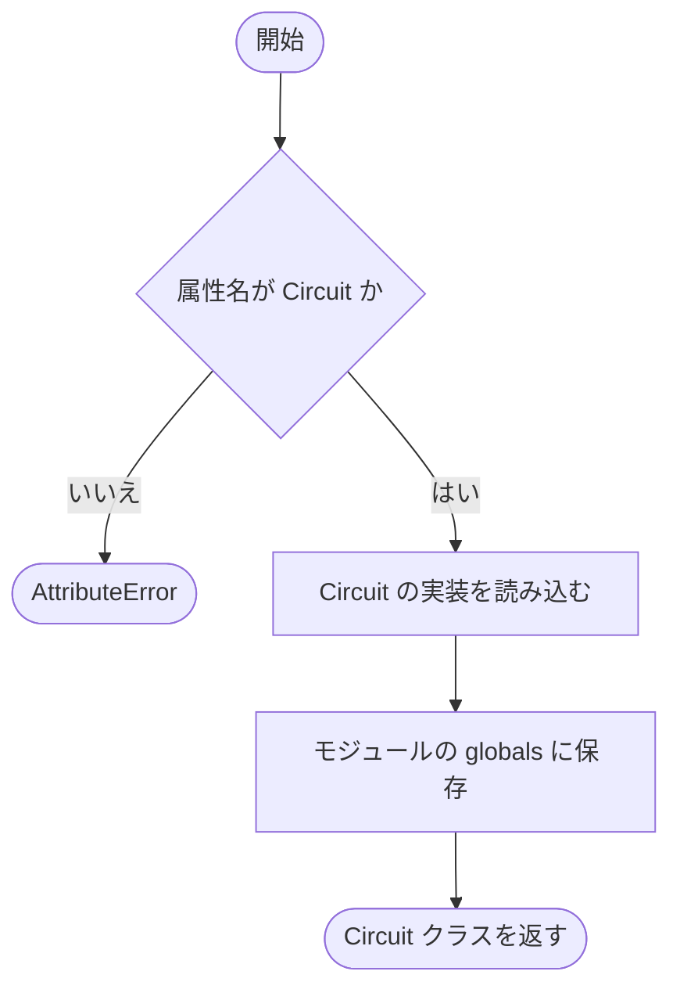

# __init__.py

`utils/logicNN_core/src/logicnn_core/circuit/__init__.py`

回路の公開入口である Circuit と、外部 FX の出力参照を表す FxSignalReference を公開します。Circuit は実際に参照された時点で読み込むため、型定義だけの利用で重い実行処理を読み込むことを避けられます。

{/* source-sha256: ee9d678014a2d9efd323d30e1e13c4fdcbf827252b04127324a5623821b1f540 */}

{/* function: __getattr__@13 */}

## \_\_getattr\_\_() {/* #getattr */}

```python
def __getattr__(name: str) -> Any:
```

### 機能概要

モジュールに未登録の属性が参照されたとき、Circuit の場合だけ実装を読み込んで公開します。読み込み後はモジュールの辞書へ保存し、次回からは同じ属性を直接参照できるようにします。

### 引数

| 引数 | 型 | 既定値 | 説明 |
|---|---|---|---|
| `name` | `str` | `必須` | モジュールで参照された未登録の属性名。 |

### 処理の流れ



### 戻り値

型：`Any`

name が Circuit なら Circuit クラス。それ以外は AttributeError。

### 状態の変更・ファイル出力

- 初回の Circuit 参照時に実装モジュールを読み込み、globals の Circuit 属性へクラスを登録します。

### ソースコード

<details>
<summary>\_\_getattr\_\_() の実装を開く</summary>

```python
def __getattr__(name: str) -> Any:
    """型だけのimportにPyTorchを要求せず、必要になった回路入口を返す。"""
    if name == "Circuit":
        from .circuit import Circuit

        globals()[name] = Circuit
        return Circuit
    raise AttributeError(f"module {__name__!r} has no attribute {name!r}")
```

</details>

## 関連ファイル

- [utils/logicNN_core/src/logicnn_core/circuit/circuit.py](/code-reference/utils/logicNN_core/src/logicnn_core/circuit/circuit)
- [utils/logicNN_core/src/logicnn_core/circuit/types.py](/code-reference/utils/logicNN_core/src/logicnn_core/circuit/types)
