# builder.py

`utils/logicNN_core/src/logicnn_core/circuit/builder.py`

PyTorch FX の処理グラフを、論理ゲート・加算・加算後の数値演算からなる回路の中間表現（IR）へ変換します。Tensor の各要素を信号 ID へ対応付け、形状変更や添字操作でも配線順を維持します。加算前のビット列は別に記録するため、C の数値出力と Verilog の生ビット出力を同じ回路から生成できます。

{/* source-sha256: dc8c1f49adeb9307257f4b5fea4ce2dfcf2cc90fe3ae195073b16c85fd5a88f4 */}

{/* function: _aten@31 */}

## \_aten() {/* #aten */}

```python
def _aten(names: str) -> set[Callable[..., Any]]:
```

### 機能概要

空白区切りの ATen 演算名を、torch.ops.aten に登録された呼び出し可能なオブジェクトへ変換します。変換可能な演算の集合をモジュール読み込み時に作るための内部関数です。

### 引数

| 引数 | 型 | 既定値 | 説明 |
|---|---|---|---|
| `names` | `str` | `必須` | operation.overload 形式の演算名を空白で区切った文字列。 |

### 処理の流れ

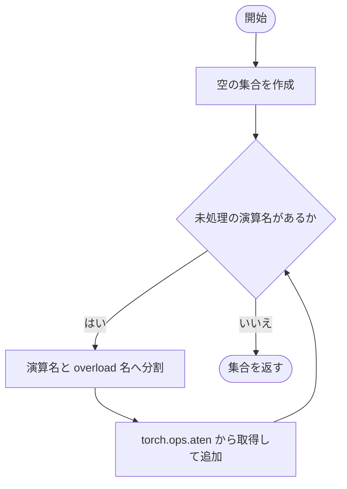
```mermaid
flowchart TD
start([開始]) --> prepare[空の集合を作成]
prepare --> more{未処理の演算名があるか}
more -->|はい| split[演算名と overload 名へ分割]
split --> lookup[torch.ops.aten から取得して追加]
lookup --> more
more -->|いいえ| finish([集合を返す])
```

### 戻り値

型：`set[Callable[..., Any]]`

指定された ATen 演算の集合。

### 例外・注意事項

- 演算名の形式や登録の有無が不正な場合は、分割または属性取得時の例外がそのまま伝わります。

### ソースコード

<details>
<summary>\_aten() の実装を開く</summary>

```python
def _aten(names: str) -> set[Callable[..., Any]]:
    """コード内で列挙したATen演算だけを、実際の登録済みcallableへ解決する。"""
    result = set()
    for name in names.split():
        operation, overload = name.split(".")
        result.add(getattr(getattr(torch.ops.aten, operation), overload))
    return result
```

</details>

## \_Signals {/* #signals-class */}

FX 上の Tensor を、値そのものではなく各要素の信号 ID と演算上のデータ型で表します。

| 属性 | 型 | 既定値 | 説明 |
|---|---|---|---|
| `ids` | `Tensor` | `必須` | 元の Tensor と同じ形状の CPU int64 Tensor。各要素は入力、ゲート、または加算結果の ID です。 |
| `dtype` | `torch.dtype` | `必須` | FX 上での値のデータ型。ID を格納する int64 とは別に保持します。 |

`@dataclass` により、初期化などのメソッドが自動生成されます。表の属性は初期化時に指定します。

このクラスには独自の関数実装はありません。

<details>
<summary>\_Signals の定義を開く</summary>

```python
@dataclass(frozen=True, slots=True)
class _Signals:
    """元Tensorのshapeで並んだ回路IDと、FX上の演算dtypeを分けて保持する。"""

    ids: Tensor
    dtype: torch.dtype
```

</details>

{/* function: _contains_signals@69 */}

## \_contains\_signals() {/* #contains-signals */}

```python
def _contains_signals(value: Any) -> bool:
```

### 機能概要

値の中に、モデル入力に依存する _Signals が含まれているかを再帰的に調べます。辞書は値のみを調べ、キーは対象にしません。

### 引数

| 引数 | 型 | 既定値 | 説明 |
|---|---|---|---|
| `value` | `Any` | `必須` | 単独の値、tuple、list、または dict。 |

### 処理の流れ

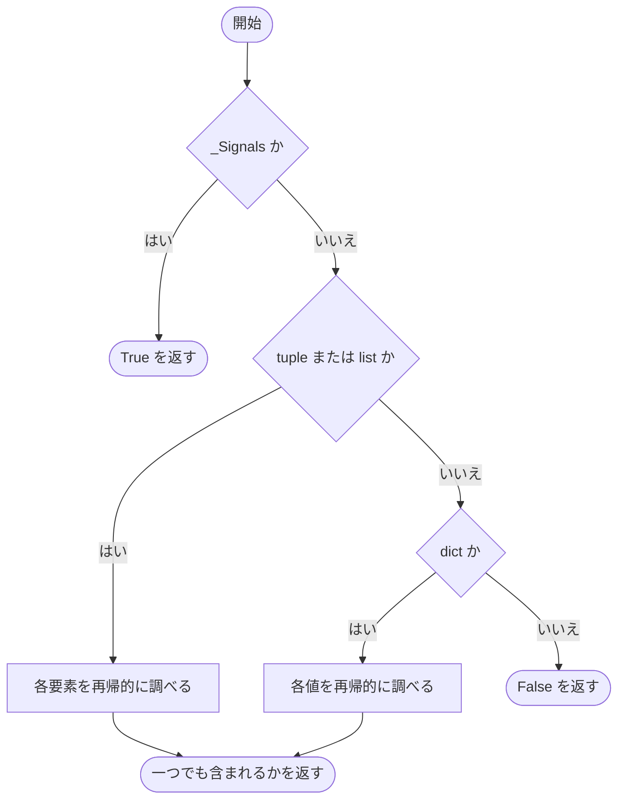
```mermaid
flowchart TD
start([開始]) --> signal{_Signals か}
signal -->|はい| yes([True を返す])
signal -->|いいえ| sequence{tuple または list か}
sequence -->|はい| items[各要素を再帰的に調べる]
sequence -->|いいえ| mapping{dict か}
mapping -->|はい| values[各値を再帰的に調べる]
mapping -->|いいえ| no([False を返す])
items --> anyResult([一つでも含まれるかを返す])
values --> anyResult
```

### 戻り値

型：`bool`

_Signals が見つかれば True、それ以外は False。

### ソースコード

<details>
<summary>\_contains\_signals() の実装を開く</summary>

```python
def _contains_signals(value: Any) -> bool:
    """引数のcontainer内に入力依存のTensor参照があるか確認する。"""
    if isinstance(value, _Signals):
        return True
    if isinstance(value, (tuple, list)):
        return any(_contains_signals(item) for item in value)
    if isinstance(value, dict):
        return any(_contains_signals(item) for item in value.values())
    return False
```

</details>

{/* function: _metadata@80 */}

## \_metadata() {/* #metadata */}

```python
def _metadata(node: Node) -> Any:
```

### 機能概要

FX ノードに記録された形状とデータ型の情報を取得します。make_fx の val を優先し、利用できなければ ShapeProp の tensor_meta を参照します。

### 引数

| 引数 | 型 | 既定値 | 説明 |
|---|---|---|---|
| `node` | `Node` | `必須` | メタデータを取得する FX ノード。 |

### 処理の流れ

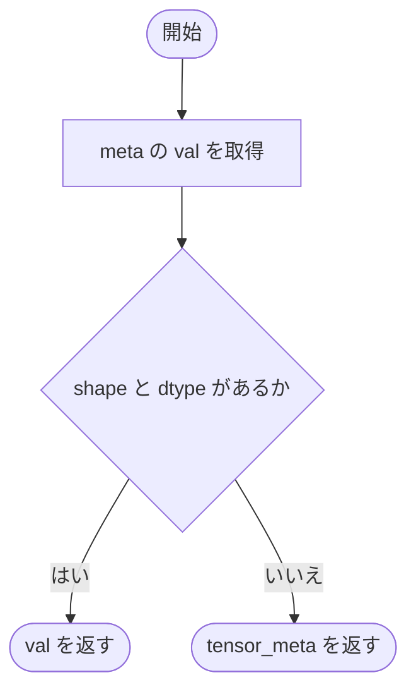
```mermaid
flowchart TD
start([開始]) --> read[meta の val を取得]
read --> usable{shape と dtype があるか}
usable -->|はい| value([val を返す])
usable -->|いいえ| fallback([tensor_meta を返す])
```

### 戻り値

型：`Any`

shape と dtype を持つ val、または tensor_meta。どちらも利用できない場合は None。

### ソースコード

<details>
<summary>\_metadata() の実装を開く</summary>

```python
def _metadata(node: Node) -> Any:
    """make_fxまたはShapePropが保存したTensorのshape・dtype情報を取得する。"""
    value = node.meta.get("val")
    return value if hasattr(value, "shape") and hasattr(value, "dtype") else node.meta.get("tensor_meta")
```

</details>

## \_Builder {/* #builder-class */}

FX ノードを先頭から解釈し、入力・定数・論理ゲート・加算結果を一つの ID 空間で管理します。

{/* function: _Builder.__init__@89 */}

## \_Builder.\_\_init\_\_() {/* #builder-init */}

```python
def __init__(self, graph_module: GraphModule, input_shape: Sequence[int]) -> None:
```

### 機能概要

GraphModule と入力形状を確認し、回路を構築するための管理表を初期化します。入力 ID は 0 から入力要素数未満までを予約します。

### 引数

| 引数 | 型 | 既定値 | 説明 |
|---|---|---|---|
| `graph_module` | `GraphModule` | `必須` | 変換対象の torch.fx.GraphModule。 |
| `input_shape` | `Sequence[int]` | `必須` | バッチ次元を除く入力形状。各次元は正の整数です。 |

### 処理の流れ

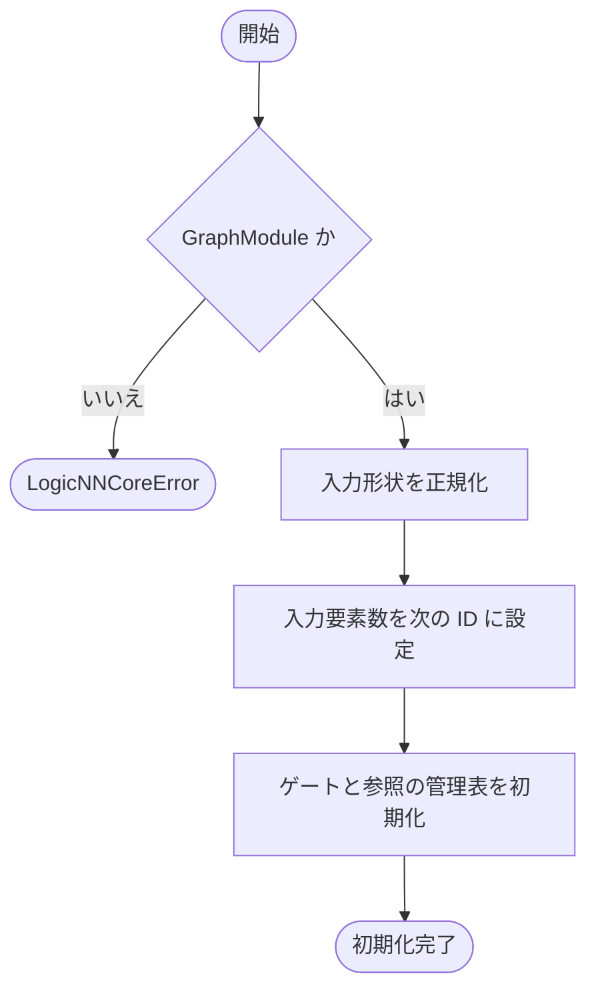
```mermaid
flowchart TD
start([開始]) --> valid{GraphModule か}
valid -->|いいえ| error([LogicNNCoreError])
valid -->|はい| shape[入力形状を正規化]
shape --> count[入力要素数を次の ID に設定]
count --> tables[ゲートと参照の管理表を初期化]
tables --> finish([初期化完了])
```

### 戻り値

型：`None`

None。

### 状態の変更・ファイル出力

- 新しい _Builder のグラフ参照、ID カウンター、各管理表を設定します。

### ソースコード

<details>
<summary>\_Builder.\_\_init\_\_() の実装を開く</summary>

```python
def __init__(self, graph_module: GraphModule, input_shape: Sequence[int]) -> None:
    """graph型とshapeを検証し、CPU専用の配線管理を初期化する。"""
    if not isinstance(graph_module, GraphModule):
        raise LogicNNCoreError("graph_moduleはtorch.fx.GraphModuleで指定してください", hint="make_fx等で得たGraphModuleを指定してください")
    self.graph       = graph_module
    self.input_shape = normalize_input_shape(input_shape)
    self.next_id     = math.prod(self.input_shape)
    self.gates: list[Gate] = []
    self.reductions: list[SumReduction] = []
    self.reduction_ids: dict[int, SumReduction] = {}
    self.constants: dict[bool, int] = {}
    self.values: dict[Node, Any] = {}
    self.by_name: dict[str, Any] = {}
    self.node: Node | None = None
```

</details>

{/* function: _Builder._fail@104 */}

## \_Builder.\_fail() {/* #builder-fail */}

```python
def _fail(self, reason: str, *, stage: str = "FX→IR変換") -> NoReturn:
```

### 機能概要

変換できない理由に、現在のノード名・呼び出し先・形状・処理段階を添えて LogicNNCoreError を送出します。

### 引数

| 引数 | 型 | 既定値 | 説明 |
|---|---|---|---|
| `reason` | `str` | `必須` | 変換できない理由。 |
| `stage` | `str` | `'FX→IR変換'` | 失敗した処理段階の名称。 |

### 処理の流れ

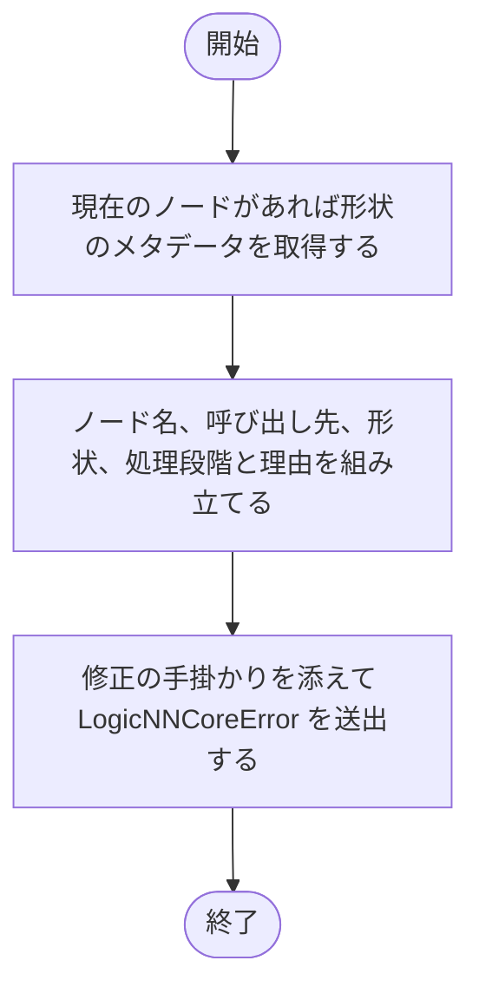
```mermaid
flowchart TD
    startNode(["開始"])
    startNode --> step0["現在のノードがあれば形状のメタデータを取得する"]
    step0 --> step1["ノード名、呼び出し先、形状、処理段階と理由を組み立てる"]
    step1 --> step2["修正の手掛かりを添えて LogicNNCoreError を送出する"]
    step2 --> finishNode(["終了"])
```

### 戻り値

型：`NoReturn`

正常には戻りません。LogicNNCoreError を送出します。

### ソースコード

<details>
<summary>\_Builder.\_fail() の実装を開く</summary>

```python
def _fail(self, reason: str, *, stage: str = "FX→IR変換") -> NoReturn:
    """対象node・target・shape・stageと対応方法を含む例外を送出する。"""
    metadata = _metadata(self.node) if self.node is not None else None
    detail   = f"node={getattr(self.node, 'name', None)}, target={getattr(self.node, 'target', None)}, "
    detail  += f"shape={getattr(metadata, 'shape', None)}, stage={stage}: {reason}"
    raise LogicNNCoreError(f"回路へ変換できません: {reason}", detail=detail,
                           hint="二値入力・対応済みの純粋演算・正しいFX metadataと元の論理出力対応情報を指定してください")
```

</details>

{/* function: _Builder._resolve@112 */}

## \_Builder.\_resolve() {/* #builder-resolve */}

```python
def _resolve(self, value: Any) -> Any:
```

### 機能概要

FX の引数に含まれるノード参照を、すでに解析した値へ置き換えます。tuple、list、dict、slice の構造を保って再帰的に処理します。

### 引数

| 引数 | 型 | 既定値 | 説明 |
|---|---|---|---|
| `value` | `Any` | `必須` | FX ノード参照を含み得る引数の値。 |

### 処理の流れ

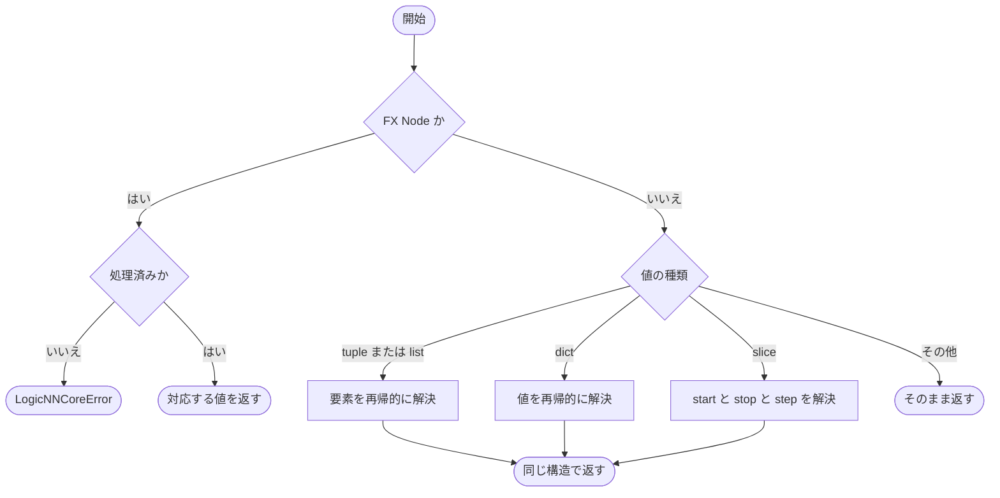
```mermaid
flowchart TD
start([開始]) --> node{FX Node か}
node -->|はい| known{処理済みか}
known -->|いいえ| error([LogicNNCoreError])
known -->|はい| found([対応する値を返す])
node -->|いいえ| kind{値の種類}
kind -->|tuple または list| sequence[要素を再帰的に解決]
kind -->|dict| mapping[値を再帰的に解決]
kind -->|slice| slicing[start と stop と step を解決]
kind -->|その他| unchanged([そのまま返す])
sequence --> finish([同じ構造で返す])
mapping --> finish
slicing --> finish
```

### 戻り値

型：`Any`

処理済みノードの値へ置き換えた引数。同種のコンテナーと slice の構造を維持します。

### 例外・注意事項

- まだ処理していないノードを参照すると変換を中断します。

### ソースコード

<details>
<summary>\_Builder.\_resolve() の実装を開く</summary>

```python
def _resolve(self, value: Any) -> Any:
    """先行FX nodeだけを解決し、tuple・list・dictの引数構造を維持する。"""
    if isinstance(value, Node):
        if value not in self.values:
            self._fail(f"先行していないFX参照です: {value.name}")
        return self.values[value]
    if isinstance(value, (tuple, list)):
        return type(value)(self._resolve(item) for item in value)
    if isinstance(value, dict):
        return {key: self._resolve(item) for key, item in value.items()}
    if isinstance(value, slice):
        return slice(self._resolve(value.start), self._resolve(value.stop), self._resolve(value.step))
    return value
```

</details>

{/* function: _Builder._attribute@126 */}

## \_Builder.\_attribute() {/* #builder-attribute */}

```python
def _attribute(self, target: str) -> Any:
```

### 機能概要

get_attr が指すモデル内の定数を読み出します。Module の登録属性を直接たどるため、property や任意の関数は実行しません。Tensor は元のモデルから切り離した CPU コピーにします。

### 引数

| 引数 | 型 | 既定値 | 説明 |
|---|---|---|---|
| `target` | `str` | `必須` | ドット区切りの属性パス。例: layer.weight。 |

### 処理の流れ

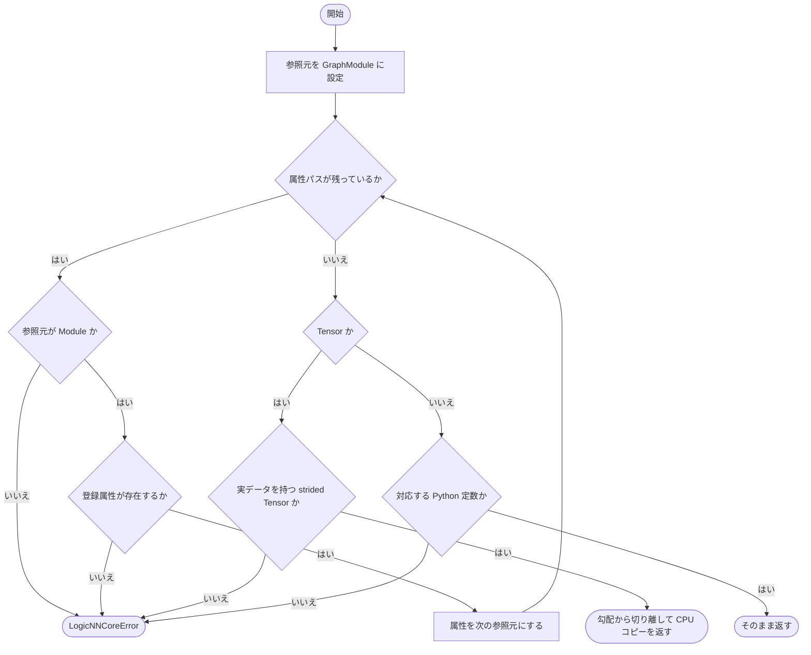
```mermaid
flowchart TD
start([開始]) --> root[参照元を GraphModule に設定]
root --> more{属性パスが残っているか}
more -->|はい| module{参照元が Module か}
module -->|いいえ| error([LogicNNCoreError])
module -->|はい| exists{登録属性が存在するか}
exists -->|いいえ| error
exists -->|はい| next[属性を次の参照元にする]
next --> more
more -->|いいえ| tensor{Tensor か}
tensor -->|はい| data{実データを持つ strided Tensor か}
data -->|いいえ| error
data -->|はい| copy([勾配から切り離して CPU コピーを返す])
tensor -->|いいえ| supported{対応する Python 定数か}
supported -->|はい| constant([そのまま返す])
supported -->|いいえ| error
```

### 戻り値

型：`Any`

独立した CPU Tensor、対応する Python 定数、または None。

### 例外・注意事項

- Python 定数として bool、int、float、str、tuple、list、None を認めます。

### ソースコード

<details>
<summary>\_Builder.\_attribute() の実装を開く</summary>

```python
def _attribute(self, target: str) -> Any:
    """登録buffer等を直接取得して独立CPUコピーし、propertyや任意関数を実行しない。"""
    value: Any = self.graph
    for part in target.split("."):
        if not isinstance(value, torch.nn.Module):
            self._fail(f"get_attrの途中参照はmoduleである必要があります: {target}")
        fields = {**vars(value), **value._parameters, **value._buffers, **value._modules}
        if part not in fields:
            self._fail(f"get_attrの値が存在しません: {target}")
        value = fields[part]
    if isinstance(value, Tensor):
        if value.layout != torch.strided or value.device.type == "meta":
            self._fail("get_attrは値を持つstrided Tensorである必要があります")
        return value.detach().to(device="cpu").clone()
    if type(value) in (bool, int, float, str, tuple, list) or value is None:
        return value
    self._fail(f"get_attrの定数型は未対応です: {type(value).__name__}")
```

</details>

{/* function: _Builder._constant@144 */}

## \_Builder.\_constant() {/* #builder-constant */}

```python
def _constant(self, value: bool) -> int:
```

### 機能概要

False または True を表す定数ゲートを取得します。同じ論理値がすでに登録されていれば、その ID を再利用します。

### 引数

| 引数 | 型 | 既定値 | 説明 |
|---|---|---|---|
| `value` | `bool` | `必須` | 定数ゲートが表す論理値。 |

### 処理の流れ

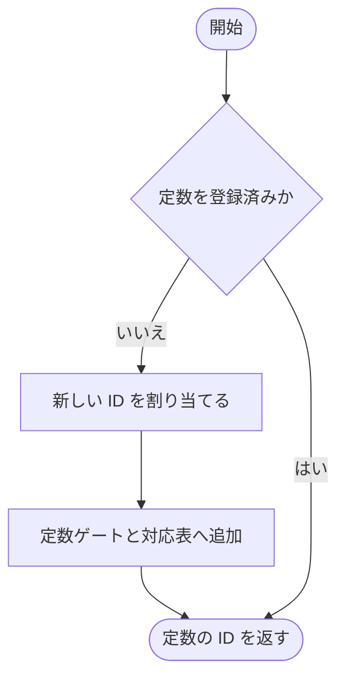
```mermaid
flowchart TD
start([開始]) --> exists{定数を登録済みか}
exists -->|いいえ| allocate[新しい ID を割り当てる]
allocate --> append[定数ゲートと対応表へ追加]
append --> finish([定数の ID を返す])
exists -->|はい| finish
```

### 戻り値

型：`int`

指定した論理定数の信号 ID。

### 状態の変更・ファイル出力

- 未登録の場合だけ next_id、gates、constants を更新します。

### ソースコード

<details>
<summary>\_Builder.\_constant() の実装を開く</summary>

```python
def _constant(self, value: bool) -> int:
    """必要な論理定数gateを一度だけ生成し、出力位置から参照可能にする。"""
    if value not in self.constants:
        output_id = self.next_id
        self.next_id += 1
        self.gates.append(Gate(output_id, GateOp.CONST_TRUE if value else GateOp.CONST_FALSE, ()))
        self.constants[value] = output_id
    return self.constants[value]
```

</details>

{/* function: _Builder._signals@153 */}

## \_Builder.\_signals() {/* #builder-signals */}

```python
def _signals(self, value: Any) -> _Signals:
```

### 機能概要

解析済みの信号はそのまま返し、定数の場合は各要素を 0 または 1 の定数ゲートへ対応付けます。値を閾値で二値化する処理ではありません。

### 引数

| 引数 | 型 | 既定値 | 説明 |
|---|---|---|---|
| `value` | `Any` | `必須` | _Signals、または厳密に 0 と 1 だけを含む定数 Tensor・Python 値。 |

### 処理の流れ

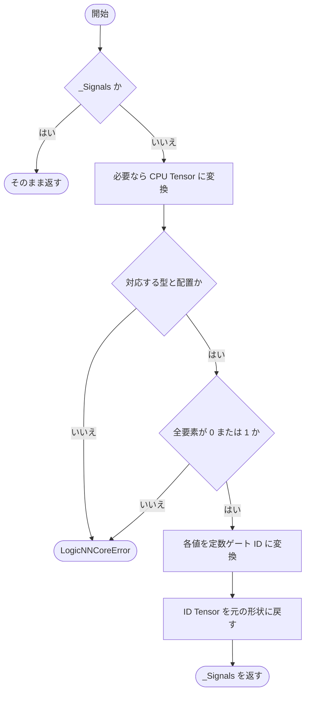
```mermaid
flowchart TD
start([開始]) --> signal{_Signals か}
signal -->|はい| original([そのまま返す])
signal -->|いいえ| tensor[必要なら CPU Tensor に変換]
tensor --> supported{対応する型と配置か}
supported -->|いいえ| error([LogicNNCoreError])
supported -->|はい| binary{全要素が 0 または 1 か}
binary -->|いいえ| error
binary -->|はい| ids[各値を定数ゲート ID に変換]
ids --> shape[ID Tensor を元の形状に戻す]
shape --> finish([_Signals を返す])
```

### 戻り値

型：`_Signals`

元の形状とデータ型を保持し、各要素を信号 ID に置き換えた _Signals。

### 状態の変更・ファイル出力

- 必要に応じて False と True の定数ゲートを追加します。

### ソースコード

<details>
<summary>\_Builder.\_signals() の実装を開く</summary>

```python
def _signals(self, value: Any) -> _Signals:
    """入力依存Tensorを維持し、0／1の定数だけを論理gate参照へ変換する。"""
    if isinstance(value, _Signals):
        return value
    if not isinstance(value, Tensor):
        value = torch.as_tensor(value, device="cpu")
    if value.layout != torch.strided or value.dtype not in (torch.bool, *_INTS, *_FLOATS):
        self._fail("論理信号にできない定数dtype・layoutです")
    if not bool(((value == 0) | (value == 1)).all()):
        self._fail("論理信号の定数は0または1に限定されます")
    ids = [self._constant(bool(item)) for item in value.reshape(-1).tolist()]
    return _Signals(torch.tensor(ids, dtype=torch.int64, device="cpu").reshape(value.shape), value.dtype)
```

</details>

{/* function: _Builder._require_bits@166 */}

## \_Builder.\_require\_bits() {/* #builder-require-bits */}

```python
def _require_bits(self, value: _Signals) -> None:
```

### 機能概要

参照先に加算結果が含まれていないことを確認します。数値の加算結果を、通常の 1 ビット信号として再びゲートや加算へ入力することを防ぎます。

### 引数

| 引数 | 型 | 既定値 | 説明 |
|---|---|---|---|
| `value` | `_Signals` | `必須` | 論理ビットとして利用する _Signals。 |

### 処理の流れ

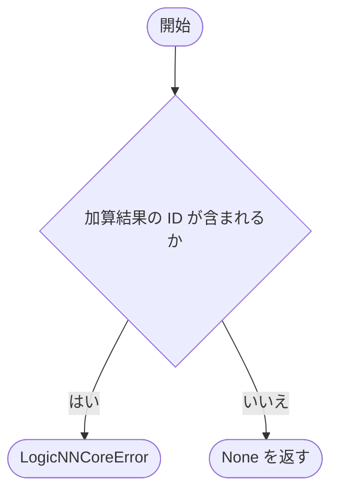
```mermaid
flowchart TD
start([開始]) --> reduction{加算結果の ID が含まれるか}
reduction -->|はい| error([LogicNNCoreError])
reduction -->|いいえ| finish([None を返す])
```

### 戻り値

型：`None`

問題がなければ None。加算結果を含む場合は LogicNNCoreError。

### ソースコード

<details>
<summary>\_Builder.\_require\_bits() の実装を開く</summary>

```python
def _require_bits(self, value: _Signals) -> None:
    """SRの数値結果を通常の論理bitとして再利用していないか検証する。"""
    if any(int(index) in self.reduction_ids for index in value.ids.reshape(-1).tolist()):
        self._fail("reduction結果を論理gate入力やsumの入力として扱うことは未対応です")
```

</details>

{/* function: _Builder._wrap@171 */}

## \_Builder.\_wrap() {/* #builder-wrap */}

```python
def _wrap(self, value: Any, dtype: torch.dtype) -> Any:
```

### 機能概要

信号 ID だけに対して行った配線操作の結果へ、演算上のデータ型を付け直します。複数の Tensor を返す操作ではコンテナーの各要素を処理します。

### 引数

| 引数 | 型 | 既定値 | 説明 |
|---|---|---|---|
| `value` | `Any` | `必須` | 配線操作が返した ID Tensor、tuple、list、またはその他の値。 |
| `dtype` | `torch.dtype` | `必須` | 配線操作前から引き継ぐ値のデータ型。 |

### 処理の流れ

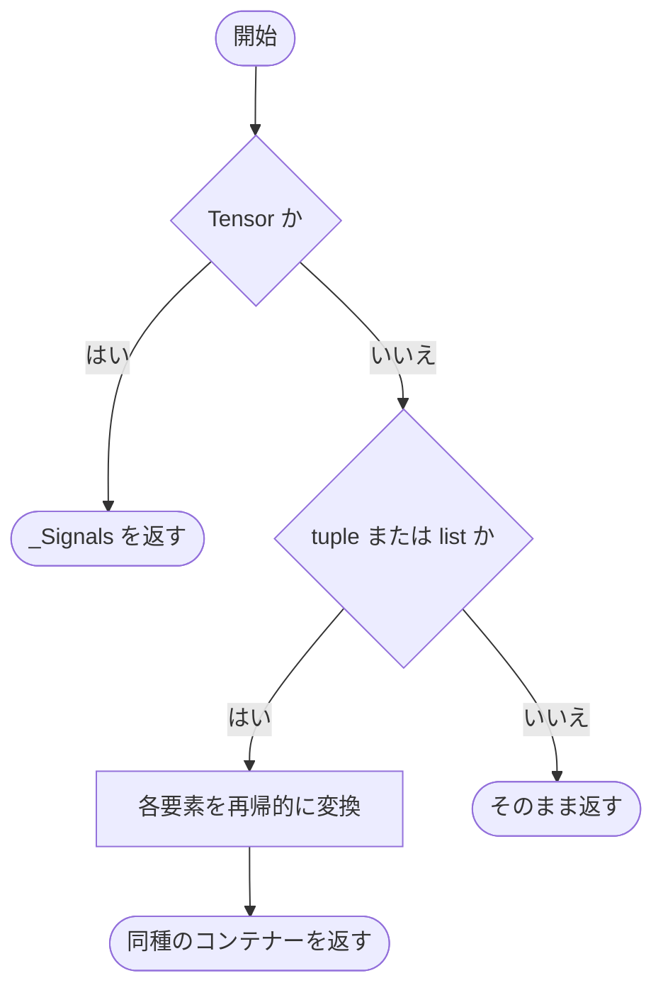
```mermaid
flowchart TD
start([開始]) --> tensor{Tensor か}
tensor -->|はい| wrapped([_Signals を返す])
tensor -->|いいえ| sequence{tuple または list か}
sequence -->|はい| recurse[各要素を再帰的に変換]
recurse --> finish([同種のコンテナーを返す])
sequence -->|いいえ| original([そのまま返す])
```

### 戻り値

型：`Any`

Tensor を _Signals で包んだ結果。それ以外の単独の値はそのまま返します。

### ソースコード

<details>
<summary>\_Builder.\_wrap() の実装を開く</summary>

```python
def _wrap(self, value: Any, dtype: torch.dtype) -> Any:
    """配線操作のTensorまたはtuple結果へ、元の演算dtypeを戻す。"""
    if isinstance(value, Tensor):
        return _Signals(value, dtype)
    if isinstance(value, (tuple, list)):
        return type(value)(self._wrap(item, dtype) for item in value)
    return value
```

</details>

{/* function: _Builder._check_metadata@179 */}

## \_Builder.\_check\_metadata() {/* #builder-check-metadata */}

```python
def _check_metadata(self, value: Any) -> None:
```

### 機能概要

解析結果の形状とデータ型が FX に記録された情報と一致するかを確認します。メタデータがない場合や、解析結果が Tensor でない場合は確認を省略します。

### 引数

| 引数 | 型 | 既定値 | 説明 |
|---|---|---|---|
| `value` | `Any` | `必須` | 現在のノードから得た _Signals、Tensor、またはその他の解析結果。 |

### 処理の流れ

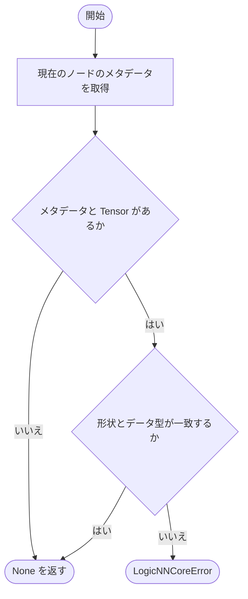
```mermaid
flowchart TD
start([開始]) --> get[現在のノードのメタデータを取得]
get --> available{メタデータと Tensor があるか}
available -->|いいえ| finish([None を返す])
available -->|はい| same{形状とデータ型が一致するか}
same -->|はい| finish
same -->|いいえ| error([LogicNNCoreError])
```

### 戻り値

型：`None`

一致するか確認対象外なら None。不一致なら LogicNNCoreError。

### ソースコード

<details>
<summary>\_Builder.\_check\_metadata() の実装を開く</summary>

```python
def _check_metadata(self, value: Any) -> None:
    """利用できるFX shape・dtypeと解析結果を照合し、元traceの数値型を黙って変更しない。"""
    metadata = _metadata(self.node)
    tensor   = value.ids if isinstance(value, _Signals) else value
    if metadata is None or not isinstance(tensor, Tensor):
        return
    if tuple(metadata.shape) != tuple(tensor.shape) or metadata.dtype != value.dtype:
        self._fail(f"FX metadataのshape・dtypeと解析結果が一致しません: parsed_shape={tuple(tensor.shape)}, parsed_dtype={value.dtype}")
```

</details>

{/* function: _Builder._append_operation@188 */}

## \_Builder.\_append\_operation() {/* #builder-append-operation */}

```python
def _append_operation(self, source: _Signals, operation: ScalarOperation, shape: torch.Size | tuple[int, ...]) -> _Signals:
```

### 機能概要

各加算結果に数値演算を 1 段追加した新しい SumReduction を作成します。元の加算や別の分岐で使われる演算列を変更せず、加算前のビット対応も引き継ぎます。

### 引数

| 引数 | 型 | 既定値 | 説明 |
|---|---|---|---|
| `source` | `_Signals` | `必須` | 加算結果、または CAST の対象となる論理ビットの参照。 |
| `operation` | `ScalarOperation` | `必須` | 追加する型変換またはスカラー数値演算。 |
| `shape` | `torch.Size \| tuple[int, ...]` | `必須` | ブロードキャスト後の出力形状。 |

### 処理の流れ

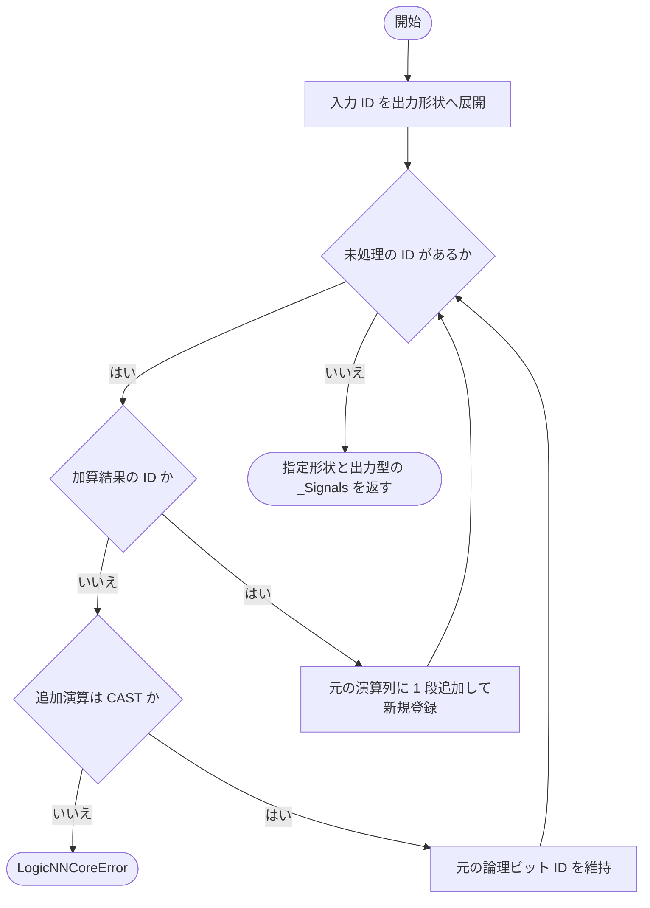
```mermaid
flowchart TD
start([開始]) --> expand[入力 ID を出力形状へ展開]
expand --> more{未処理の ID があるか}
more -->|はい| reduction{加算結果の ID か}
reduction -->|いいえ| cast{追加演算は CAST か}
cast -->|いいえ| error([LogicNNCoreError])
cast -->|はい| keep[元の論理ビット ID を維持]
keep --> more
reduction -->|はい| clone[元の演算列に 1 段追加して新規登録]
clone --> more
more -->|いいえ| finish([指定形状と出力型の _Signals を返す])
```

### 戻り値

型：`_Signals`

追加した演算の出力型と shape を持つ _Signals。

### 状態の変更・ファイル出力

- 数値集約に対して next_id、reductions、reduction_ids を更新します。論理ビットだけの CAST は ID を増やしません。

### ソースコード

<details>
<summary>\_Builder.\_append\_operation() の実装を開く</summary>

```python
def _append_operation(self, source: _Signals, operation: ScalarOperation, shape: torch.Size | tuple[int, ...]) -> _Signals:
    """各集約の不変の計算列へ1演算を追記し、先行branchと元のbit対応を保持する。"""
    ids = []
    for index in source.ids.expand(shape).reshape(-1).tolist():
        original = self.reduction_ids.get(index)
        if original is None:
            if operation.op is ScalarOp.CAST:
                ids.append(index)
                continue
            self._fail("論理bitとreductionが混在するTensorへの四則演算は未対応です")
        output_id = self.next_id
        self.next_id += 1
        reduction = SumReduction(output_id, original.input_ids, original.dtype, (*original.operations, operation))
        self.reductions.append(reduction)
        self.reduction_ids[output_id] = reduction
        ids.append(output_id)
    dtype = getattr(torch, operation.output_dtype.value)
    return _Signals(torch.tensor(ids, dtype=torch.int64, device="cpu").reshape(shape), dtype)
```

</details>

{/* function: _Builder._cast_signals@207 */}

## \_Builder.\_cast\_signals() {/* #builder-cast-signals */}

```python
def _cast_signals(self, source: _Signals, dtype: torch.dtype) -> _Signals:
```

### 機能概要

対応する型への変換を ScalarOperation として記録します。加算結果では CAST を演算列へ追加し、0 と 1 の配線では ID を保ったままデータ型だけを変更します。

### 引数

| 引数 | 型 | 既定値 | 説明 |
|---|---|---|---|
| `source` | `_Signals` | `必須` | 型変換する信号または加算結果。 |
| `dtype` | `torch.dtype` | `必須` | 変換後の bool、対応する整数型、または浮動小数点型。 |

### 処理の流れ

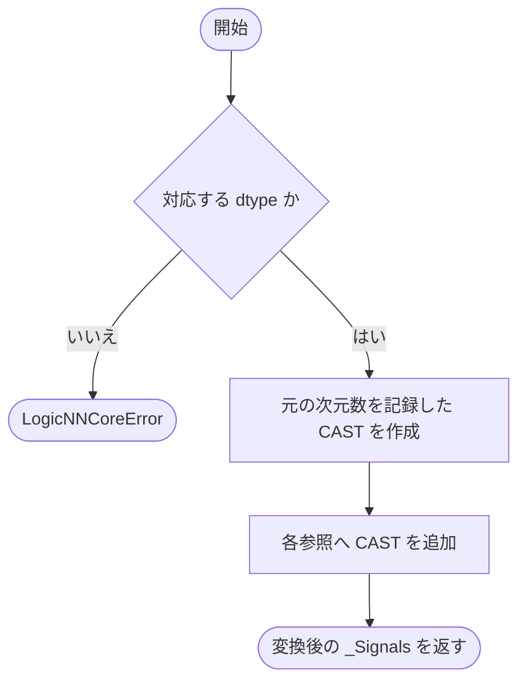
```mermaid
flowchart TD
start([開始]) --> supported{対応する dtype か}
supported -->|いいえ| error([LogicNNCoreError])
supported -->|はい| make[元の次元数を記録した CAST を作成]
make --> append[各参照へ CAST を追加]
append --> finish([変換後の _Signals を返す])
```

### 戻り値

型：`_Signals`

元と同じ形状で、指定した dtype を持つ _Signals。

### ソースコード

<details>
<summary>\_Builder.\_cast\_signals() の実装を開く</summary>

```python
def _cast_signals(self, source: _Signals, dtype: torch.dtype) -> _Signals:
    """数値集約のcastを演算列へ残し、0／1だけの配線では値の対応を維持する。"""
    if dtype not in (torch.bool, *_INTS, *_FLOATS):
        self._fail("このdtype変換は回路の対応範囲外です")
    operation = ScalarOperation(ScalarOp.CAST, TensorDType(str(dtype).removeprefix("torch.")), input_ndim=source.ids.ndim)
    return self._append_operation(source, operation, source.ids.shape)
```

</details>

{/* function: _Builder._wire@214 */}

## \_Builder.\_wire() {/* #builder-wire */}

```python
def _wire(self, target: Callable[..., Any], args: tuple[Any, ...], kwargs: dict[str, Any]) -> Any:
```

### 機能概要

要素の値ではなく信号 ID に対して、形状変更・添字操作・結合・型変換・定数パディングを適用します。結合時にはデータ型をそろえ、パディングの 0 と 1 は定数ゲートとして追加します。

### 引数

| 引数 | 型 | 既定値 | 説明 |
|---|---|---|---|
| `target` | `Callable[..., Any]` | `必須` | 対応表に登録された配線操作、または operator.getitem。 |
| `args` | `tuple[Any, ...]` | `必須` | 解決済みの位置引数。通常は先頭要素が _Signals です。 |
| `kwargs` | `dict[str, Any]` | `必須` | 解決済みのキーワード引数。dim、dtype、value などを含みます。 |

### 処理の流れ

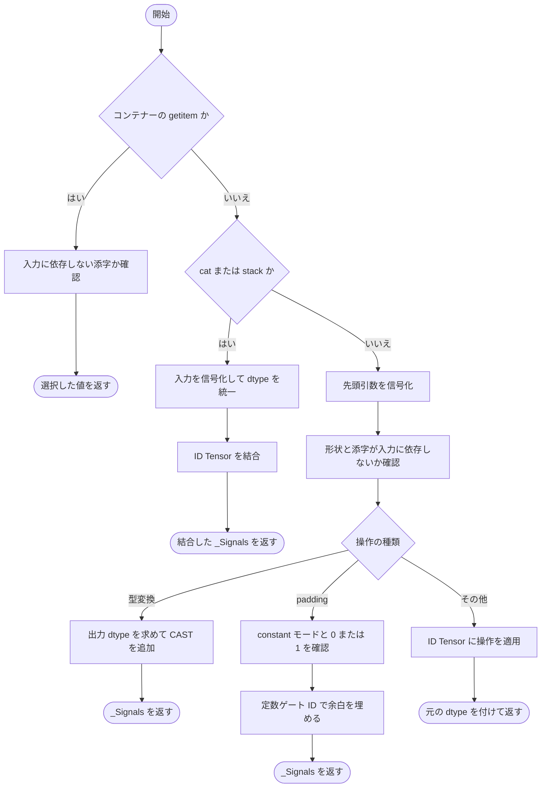
```mermaid
flowchart TD
start([開始]) --> container{コンテナーの getitem か}
container -->|はい| indexCheck[入力に依存しない添字か確認]
indexCheck --> selected([選択した値を返す])
container -->|いいえ| join{cat または stack か}
join -->|はい| promote[入力を信号化して dtype を統一]
promote --> joinIds[ID Tensor を結合]
joinIds --> joined([結合した _Signals を返す])
join -->|いいえ| source[先頭引数を信号化]
source --> fixed[形状と添字が入力に依存しないか確認]
fixed --> kind{操作の種類}
kind -->|型変換| cast[出力 dtype を求めて CAST を追加]
cast --> castResult([_Signals を返す])
kind -->|padding| padding[constant モードと 0 または 1 を確認]
padding --> padIds[定数ゲート ID で余白を埋める]
padIds --> padded([_Signals を返す])
kind -->|その他| wire[ID Tensor に操作を適用]
wire --> wrap([元の dtype を付けて返す])
```

### 戻り値

型：`Any`

配線変更後の _Signals、複数の _Signals を含むコンテナー、またはコンテナーから選んだ値。

### 例外・注意事項

- 入力データによって変わる添字や形状、constant 以外のパディング、0 と 1 以外のパディング値は LogicNNCoreError になります。

### ソースコード

<details>
<summary>\_Builder.\_wire() の実装を開く</summary>

```python
def _wire(self, target: Callable[..., Any], args: tuple[Any, ...], kwargs: dict[str, Any]) -> Any:
    """登録済みの配線操作だけをID Tensorに適用し、値をTensorのshapeから推測しない。"""
    if target is operator.getitem and isinstance(args[0], (tuple, list)):
        if _contains_signals(args[1]):
            self._fail("入力依存のcontainer indexは未対応です")
        return operator.getitem(*args)
    if target in _JOIN:
        operands = [self._signals(value) for value in args[0]]
        dtype    = operands[0].dtype
        for value in operands[1:]:
            dtype = torch.promote_types(dtype, value.dtype)
        operands = [self._cast_signals(value, dtype) if value.dtype != dtype else value for value in operands]
        result = target([value.ids for value in operands], *args[1:], **kwargs)
        return _Signals(result, dtype)
    source = self._signals(args[0])
    if _contains_signals(args[1:]) or _contains_signals(kwargs):
        self._fail("入力依存のindexやshapeによる配線は未対応です")
    if target in _CAST:
        dtype = kwargs.get("dtype")
        if dtype is None:
            dtype = next((value for value in args[1:] if isinstance(value, torch.dtype)), source.dtype)
        return self._cast_signals(source, dtype)
    if target in _PAD:
        if str(target) == "aten.pad.default" and (len(args) > 2 and args[2] != "constant" or kwargs.get("mode", "constant") != "constant"):
            self._fail("constant以外のpaddingは未対応です")
        position = 3 if str(target) == "aten.pad.default" else 2
        fill     = kwargs.get("value", args[position] if len(args) > position else 0)
        fill     = 0 if fill is None else fill
        if fill not in (0, 1):
            self._fail("padding値は0または1で指定してください")
        result = torch.ops.aten.constant_pad_nd.default(source.ids, args[1], self._constant(bool(fill)))
        return _Signals(result, source.dtype)
    result = target(source.ids, *args[1:], **kwargs)
    return self._wrap(result, source.dtype)
```

</details>

{/* function: _Builder._truth_gate@249 */}

## \_Builder.\_truth\_gate() {/* #builder-truth-gate */}

```python
def _truth_gate(self, truth: int, first: int | None, second: int | None) -> int:
```

### 機能概要

4 ビットの真理値表を GateOp に対応付けます。常に 0 または 1 となる場合は定数を再利用し、片方の入力をそのまま返す場合はゲートを作りません。

### 引数

| 引数 | 型 | 既定値 | 説明 |
|---|---|---|---|
| `truth` | `int` | `必須` | 入力の組が 00、01、10、11 の順の出力を上位ビットから格納した整数。範囲は 0〜15。 |
| `first` | `int \| None` | `必須` | 第 1 入力の信号 ID。入力が定数の場合は None になり得ます。 |
| `second` | `int \| None` | `必須` | 第 2 入力の信号 ID。単項演算や定数の場合は None になり得ます。 |

### 処理の流れ

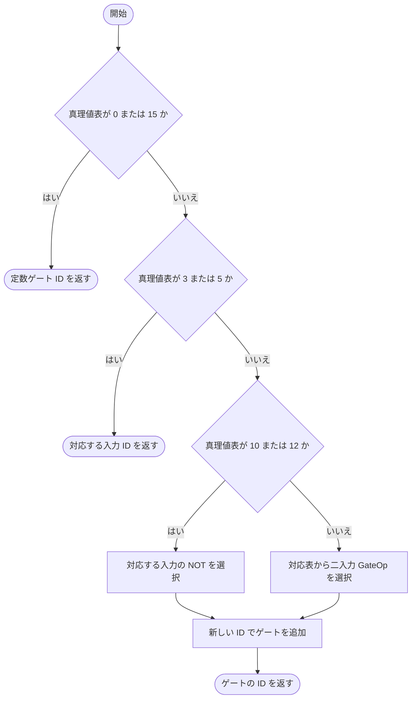
```mermaid
flowchart TD
start([開始]) --> constant{真理値表が 0 または 15 か}
constant -->|はい| fixed([定数ゲート ID を返す])
constant -->|いいえ| wire{真理値表が 3 または 5 か}
wire -->|はい| input([対応する入力 ID を返す])
wire -->|いいえ| inverse{真理値表が 10 または 12 か}
inverse -->|はい| unary[対応する入力の NOT を選択]
inverse -->|いいえ| binary[対応表から二入力 GateOp を選択]
unary --> append[新しい ID でゲートを追加]
binary --> append
append --> finish([ゲートの ID を返す])
```

### 戻り値

型：`int`

真理値表の結果を表す信号 ID。

### 状態の変更・ファイル出力

- 必要な場合だけ定数ゲートまたは演算ゲートを追加します。

### ソースコード

<details>
<summary>\_Builder.\_truth\_gate() の実装を開く</summary>

```python
def _truth_gate(self, truth: int, first: int | None, second: int | None) -> int:
    """二入力真理値表を正式GateOpへ正規化し、wireと定数を直接参照する。"""
    if truth in (0, 15):
        return self._constant(truth == 15)
    if truth in (3, 5):
        return first if truth == 3 else second
    if truth in (10, 12):
        op       = GateOp.NOT
        operands = (second if truth == 10 else first,)
    else:
        op       = _TABLE_OPS[truth]
        operands = (first, second)
    output_id = self.next_id
    self.next_id += 1
    self.gates.append(Gate(output_id, op, operands))
    return output_id
```

</details>

{/* function: _Builder._logic@266 */}

## \_Builder.\_logic() {/* #builder-logic */}

```python
def _logic(self, target: Callable[..., Any], args: tuple[Any, ...], kwargs: dict[str, Any]) -> _Signals:
```

### 機能概要

論理演算や比較を 0 と 1 の組み合わせで実行し、要素ごとの真理値表から回路ゲートを作ります。Tensor 定数との比較も同じ手順で処理し、要素のブロードキャストを反映します。

### 引数

| 引数 | 型 | 既定値 | 説明 |
|---|---|---|---|
| `target` | `Callable[..., Any]` | `必須` | 登録済みの単項・二項の論理演算または比較演算。 |
| `args` | `tuple[Any, ...]` | `必須` | 信号参照や定数を含む位置引数。対象にするのは単項なら先頭 1 個、二項なら先頭 2 個です。 |
| `kwargs` | `dict[str, Any]` | `必須` | 元の演算へ渡すキーワード引数。 |

### 処理の流れ

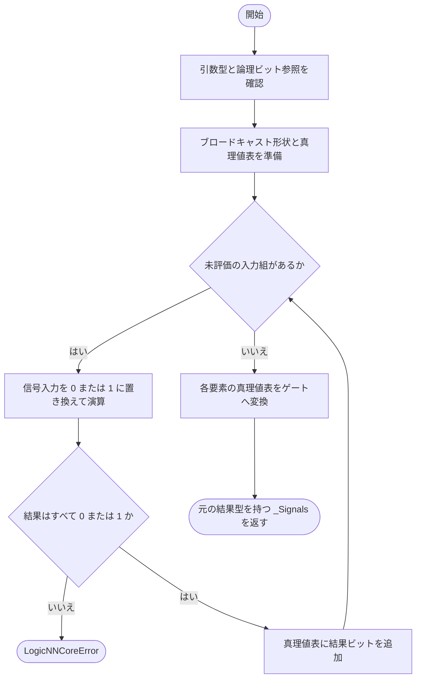
```mermaid
flowchart TD
start([開始]) --> validate[引数型と論理ビット参照を確認]
validate --> shape[ブロードキャスト形状と真理値表を準備]
shape --> more{未評価の入力組があるか}
more -->|はい| execute[信号入力を 0 または 1 に置き換えて演算]
execute --> binary{結果はすべて 0 または 1 か}
binary -->|いいえ| error([LogicNNCoreError])
binary -->|はい| accumulate[真理値表に結果ビットを追加]
accumulate --> more
more -->|いいえ| ids[各要素の真理値表をゲートへ変換]
ids --> finish([元の結果型を持つ _Signals を返す])
```

### 戻り値

型：`_Signals`

ブロードキャスト後の形状と、元の演算の結果型を持つ _Signals。

### 例外・注意事項

- 加算結果は論理入力として使用できません。元の学習モデルの重みを評価する処理ではなく、FX に現れた確定済み演算の真理値表を調べる処理です。

### ソースコード

<details>
<summary>\_Builder.\_logic() の実装を開く</summary>

```python
def _logic(self, target: Callable[..., Any], args: tuple[Any, ...], kwargs: dict[str, Any]) -> _Signals:
    """0と1で演算を評価して真理値表を作り、比較・論理演算を同じIRへ変換する。"""
    operands = args[:1] if target in _UNARY else args[:2]
    if len(operands) > 2 or any(not isinstance(value, (_Signals, Tensor, bool, int, float)) for value in operands):
        self._fail("論理演算の引数型は未対応です")
    for value in operands:
        if isinstance(value, _Signals):
            self._require_bits(value)
    shapes = [value.ids.shape if isinstance(value, _Signals) else torch.as_tensor(value, device="cpu").shape for value in operands]
    shape  = torch.broadcast_shapes(*shapes)
    truth  = torch.zeros(shape, dtype=torch.int64, device="cpu")
    dtype  = torch.bool
    for first, second in ((0, 0), (0, 1), (1, 0), (1, 1)):
        choices = (first, second)
        actual  = [torch.full(shape, choices[index], dtype=value.dtype, device="cpu") if isinstance(value, _Signals) else value
                   for index, value in enumerate(operands)]
        result = target(*actual, **kwargs)
        result = torch.as_tensor(result, device="cpu").expand(shape)
        if not bool(((result == 0) | (result == 1)).all()):
            self._fail("演算の結果が0／1にならず、論理gateとして表現できません")
        truth = truth * 2 + result.to(torch.int64)
        dtype = result.dtype
    references = [value.ids.expand(shape).reshape(-1).tolist() if isinstance(value, _Signals) else [None] * math.prod(shape) for value in operands]
    if len(references) == 1:
        references.append([None] * math.prod(shape))
    ids = [self._truth_gate(code, first, second) for code, first, second in zip(truth.reshape(-1).tolist(), *references)]
    return _Signals(torch.tensor(ids, dtype=torch.int64, device="cpu").reshape(shape), dtype)
```

</details>

{/* function: _Builder._sum@294 */}

## \_Builder.\_sum() {/* #builder-sum */}

```python
def _sum(self, args: tuple[Any, ...], kwargs: dict[str, Any]) -> _Signals:
```

### 機能概要

論理ビットの和を SumReduction へ変換します。加算対象の軸を正規化して残りの軸を前へ並べ、各グループの入力 ID を元の行優先順で保存します。定数や重複したビットも取り除きません。

### 引数

| 引数 | 型 | 既定値 | 説明 |
|---|---|---|---|
| `args` | `tuple[Any, ...]` | `必須` | 位置引数。先頭に入力、必要に応じて dim と keepdim を含みます。 |
| `kwargs` | `dict[str, Any]` | `必須` | dim、keepdim、dtype などの加算指定。 |

### 処理の流れ

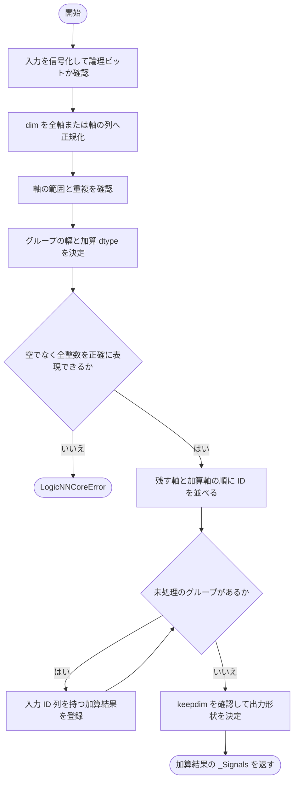
```mermaid
flowchart TD
start([開始]) --> bits[入力を信号化して論理ビットか確認]
bits --> axes[dim を全軸または軸の列へ正規化]
axes --> valid[軸の範囲と重複を確認]
valid --> width[グループの幅と加算 dtype を決定]
width --> exact{空でなく全整数を正確に表現できるか}
exact -->|いいえ| error([LogicNNCoreError])
exact -->|はい| rows[残す軸と加算軸の順に ID を並べる]
rows --> more{未処理のグループがあるか}
more -->|はい| append[入力 ID 列を持つ加算結果を登録]
append --> more
more -->|いいえ| shape[keepdim を確認して出力形状を決定]
shape --> finish([加算結果の _Signals を返す])
```

### 戻り値

型：`_Signals`

加算後の形状と dtype を持ち、各要素が SumReduction の ID を参照する _Signals。

### 状態の変更・ファイル出力

- グループごとに next_id、reductions、reduction_ids を更新します。

### 例外・注意事項

- dim が None、空 list、空 tuple の場合は全軸を対象にします。bool と整数の入力は、dtype を指定しなければ int64 で加算します。
- 加算幅が dtype で正確に表現できる整数の範囲を超える場合は変換を中断します。

### ソースコード

<details>
<summary>\_Builder.\_sum() の実装を開く</summary>

```python
def _sum(self, args: tuple[Any, ...], kwargs: dict[str, Any]) -> _Signals:
    """元のrow-major bit順を保存し、定数も除かず各groupのSRを作る。"""
    source = self._signals(args[0])
    self._require_bits(source)
    dimensions = kwargs.get("dim", args[1] if len(args) > 1 else None)
    if dimensions is None or dimensions == [] or dimensions == ():
        dimensions = tuple(range(source.ids.ndim))
    elif type(dimensions) is int:
        dimensions = (dimensions,)
    if not isinstance(dimensions, (tuple, list)) or any(type(dim) is not int or not -source.ids.ndim <= dim < source.ids.ndim for dim in dimensions):
        self._fail("sumの軸指定が不正です")
    axes = tuple(sorted(dim % source.ids.ndim for dim in dimensions))
    if len(set(axes)) != len(axes):
        self._fail("sumの軸指定に重複があります")
    remaining = tuple(dim for dim in range(source.ids.ndim) if dim not in axes)
    width     = math.prod(source.ids.shape[dim] for dim in axes)
    if width == 0:
        self._fail("元の論理出力対応を持たない空groupのsumは未対応です")
    dtype = kwargs.get("dtype") or (torch.int64 if source.dtype in (torch.bool, *_INTS) else source.dtype)
    if dtype not in (*_INTS, *_FLOATS):
        self._fail("sumのdtypeは数値の合計を表現できる必要があります")
    limit = torch.iinfo(dtype).max if dtype in _INTS else _EXACT_INTEGER_LIMIT[dtype]
    if width > limit:
        self._fail(f"sumのdtype={dtype}は0〜{width}の全整数を正確に表現できません。dtype付きoverflow・丸めのIR化は未対応です")
    rows = source.ids.permute(*remaining, *axes).reshape(-1, width)
    ids  = []
    for row in rows:
        output_id = self.next_id
        self.next_id += 1
        reduction = SumReduction(output_id, tuple(row.tolist()), TensorDType(str(dtype).removeprefix("torch.")))
        self.reductions.append(reduction)
        self.reduction_ids[output_id] = reduction
        ids.append(output_id)
    keepdim = kwargs.get("keepdim", args[2] if len(args) > 2 else False)
    if type(keepdim) is not bool:
        self._fail("sumのkeepdimはboolで指定してください")
    shape = tuple(1 if dim in axes else size for dim, size in enumerate(source.ids.shape)) if keepdim else tuple(source.ids.shape[dim] for dim in remaining)
    return _Signals(torch.tensor(ids, dtype=torch.int64, device="cpu").reshape(shape), dtype)
```

</details>

{/* function: _Builder._affine@333 */}

## \_Builder.\_affine() {/* #builder-affine */}

```python
def _affine(self, target: Callable[..., Any], args: tuple[Any, ...], kwargs: dict[str, Any]) -> _Signals:
```

### 機能概要

加算結果と 1 個の定数との加減乗除を、独立した ScalarOperation として追加します。左右の順序、alpha、定数 Tensor の型と次元数を保存し、複数段の式を一つの係数へまとめません。

### 引数

| 引数 | 型 | 既定値 | 説明 |
|---|---|---|---|
| `target` | `Callable[..., Any]` | `必須` | 登録済みの加算・減算・逆減算・乗算・除算。 |
| `args` | `tuple[Any, ...]` | `必須` | 先頭 2 引数のうち片方だけが _Signals、もう片方が有限の数値または 1 要素 Tensor である位置引数。 |
| `kwargs` | `dict[str, Any]` | `必須` | alpha など、元の数値演算に渡すキーワード引数。 |

### 処理の流れ

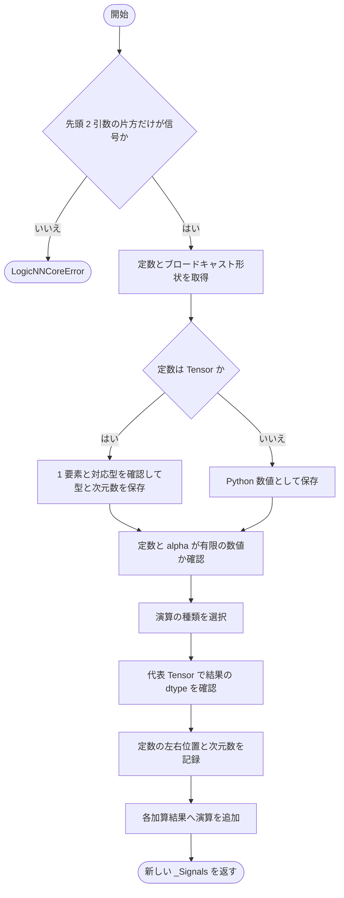
```mermaid
flowchart TD
start([開始]) --> one{先頭 2 引数の片方だけが信号か}
one -->|いいえ| error([LogicNNCoreError])
one -->|はい| operand[定数とブロードキャスト形状を取得]
operand --> tensor{定数は Tensor か}
tensor -->|はい| metadata[1 要素と対応型を確認して型と次元数を保存]
tensor -->|いいえ| scalar[Python 数値として保存]
metadata --> finite[定数と alpha が有限の数値か確認]
scalar --> finite
finite --> kind[演算の種類を選択]
kind --> sample[代表 Tensor で結果の dtype を確認]
sample --> order[定数の左右位置と次元数を記録]
order --> append[各加算結果へ演算を追加]
append --> finish([新しい _Signals を返す])
```

### 戻り値

型：`_Signals`

数値演算を追加した加算結果を参照する _Signals。

### 例外・注意事項

- 加算結果同士の演算、複数要素の Tensor 定数、非有限の数値は対応していません。

### ソースコード

<details>
<summary>\_Builder.\_affine() の実装を開く</summary>

```python
def _affine(self, target: Callable[..., Any], args: tuple[Any, ...], kwargs: dict[str, Any]) -> _Signals:
    """scalar四則演算の型・左右関係・順序を保存し、途中丸めを係数へ統合しない。"""
    positions = [index for index, value in enumerate(args[:2]) if isinstance(value, _Signals)]
    if len(positions) != 1:
        self._fail("reduction間の四則演算は未対応です")
    position = positions[0]
    source   = args[position]
    scalar   = args[1 - position]
    shape    = torch.broadcast_shapes(source.ids.shape, scalar.shape if isinstance(scalar, Tensor) else ())
    if isinstance(scalar, Tensor):
        if scalar.numel() != 1 or scalar.dtype not in (torch.bool, *_INTS, *_FLOATS):
            self._fail("reductionの定数は対応dtypeの1要素Tensorで指定してください")
        value   = int(scalar.item()) if scalar.dtype is torch.bool else scalar.item()
        operand = ScalarConstant(value, TensorDType(str(scalar.dtype).removeprefix("torch.")), scalar.ndim)
    else:
        value   = scalar
        operand = ScalarConstant(value)
    if type(value) not in (int, float) or type(value) is float and not math.isfinite(value):
        self._fail("reductionの定数は有限のintまたはfloatで指定してください")
    name  = str(target)
    alpha = kwargs.get("alpha", 1)
    if type(alpha) not in (int, float) or type(alpha) is float and not math.isfinite(alpha):
        self._fail("alphaは有限の数値で指定してください")
    if target is operator.add or "aten.add." in name:
        op = ScalarOp.ADD
    elif target is operator.sub or "aten.sub." in name or "aten.rsub." in name:
        op = ScalarOp.SUB
    elif target is operator.mul or "aten.mul." in name:
        op = ScalarOp.MUL
    else:
        op = ScalarOp.DIV
    sample = [torch.ones((1,) * value.ids.ndim, dtype=value.dtype, device="cpu") if isinstance(value, _Signals) else value for value in args]
    dtype  = target(*sample, **kwargs).dtype
    if dtype not in (torch.bool, *_INTS, *_FLOATS):
        self._fail("scalar演算結果のdtypeは回路の対応範囲外です")
    scalar_first = position == (0 if "aten.rsub." in name else 1)
    operation    = ScalarOperation(op, TensorDType(str(dtype).removeprefix("torch.")), operand, scalar_first, alpha, source.ids.ndim)
    return self._append_operation(source, operation, shape)
```

</details>

{/* function: _Builder._constant_call@372 */}

## \_Builder.\_constant\_call() {/* #builder-constant-call */}

```python
def _constant_call(self, target: Callable[..., Any], args: tuple[Any, ...], kwargs: dict[str, Any]) -> Any:
```

### 機能概要

モデル入力に依存しない登録済みの演算を CPU 上で実行します。Tensor の生成やデバイス移動では CPU を明示し、元のキーワード引数の辞書は変更しません。

### 引数

| 引数 | 型 | 既定値 | 説明 |
|---|---|---|---|
| `target` | `Callable[..., Any]` | `必須` | 副作用がないものとして登録済みの演算。 |
| `args` | `tuple[Any, ...]` | `必須` | 定数だけを含む解決済みの位置引数。 |
| `kwargs` | `dict[str, Any]` | `必須` | 元のキーワード引数。 |

### 処理の流れ

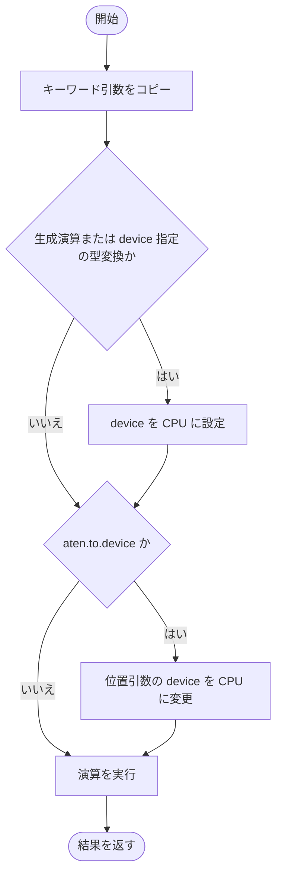
```mermaid
flowchart TD
start([開始]) --> copy[キーワード引数をコピー]
copy --> create{生成演算または device 指定の型変換か}
create -->|はい| cpu[device を CPU に設定]
create -->|いいえ| device{aten.to.device か}
cpu --> device
device -->|はい| positional[位置引数の device を CPU に変更]
device -->|いいえ| execute[演算を実行]
positional --> execute
execute --> finish([結果を返す])
```

### 戻り値

型：`Any`

CPU に実行先を調整した演算の結果。

### ソースコード

<details>
<summary>\_Builder.\_constant\_call() の実装を開く</summary>

```python
def _constant_call(self, target: Callable[..., Any], args: tuple[Any, ...], kwargs: dict[str, Any]) -> Any:
    """副作用のない登録済み演算だけを、元graphと独立したCPU値に適用する。"""
    options = dict(kwargs)
    if target in _CREATE | _LIKE or target in _CAST and "device" in options:
        options["device"] = torch.device("cpu")
    if target is torch.ops.aten.to.device and len(args) > 1:
        args = (args[0], torch.device("cpu"), *args[2:])
        options.pop("device", None)
    return target(*args, **options)
```

</details>

{/* function: _Builder._call@382 */}

## \_Builder.\_call() {/* #builder-call */}

```python
def _call(self, target: Callable[..., Any], args: tuple[Any, ...], kwargs: dict[str, Any]) -> Any:
```

### 機能概要

FX の call_function を種類別の変換処理へ振り分けます。未登録の演算や値を書き換える演算は実行せず、定数演算・配線・論理演算・数値演算を区別します。

### 引数

| 引数 | 型 | 既定値 | 説明 |
|---|---|---|---|
| `target` | `Callable[..., Any]` | `必須` | FX ノードの呼び出し先。 |
| `args` | `tuple[Any, ...]` | `必須` | ノード参照を解決した位置引数。 |
| `kwargs` | `dict[str, Any]` | `必須` | ノード参照を解決したキーワード引数。 |

### 処理の流れ

```mermaid
flowchart TD
start([開始]) --> supported{登録済みで値を書き換えない演算か}
supported -->|いいえ| error([LogicNNCoreError])
supported -->|はい| sum{sum か}
sum -->|はい| reduction([_sum の結果を返す])
sum -->|いいえ| dependent{入力に依存する信号を含むか}
dependent -->|いいえ| constant([定数として実行して返す])
dependent -->|はい| kind{演算の種類}
kind -->|配線と結合と型変換| wiring([_wire の結果を返す])
kind -->|zeros_like など| dummy[同じ形状と dtype のゼロ Tensor を作成]
dummy --> constant
kind -->|論理演算と比較| logic([_logic の結果を返す])
kind -->|加減乗除| affine([_affine の結果を返す])
kind -->|その他| error
```

### 戻り値

型：`Any`

各変換処理が返す _Signals、コンテナー、または定数値。

### ソースコード

<details>
<summary>\_Builder.\_call() の実装を開く</summary>

```python
def _call(self, target: Callable[..., Any], args: tuple[Any, ...], kwargs: dict[str, Any]) -> Any:
    """対応演算を分類し、未知またはin-place処理を実行前に拒否する。"""
    if target not in _PURE or getattr(getattr(target, "_schema", None), "is_mutable", False):
        self._fail("未対応または副作用のある演算です")
    if target in _SUM:
        return self._sum(args, kwargs)
    if not _contains_signals((args, kwargs)):
        return self._constant_call(target, args, kwargs)
    if target in _WIRING | _JOIN | _CAST | _PAD or target is operator.getitem:
        return self._wire(target, args, kwargs)
    if target in _LIKE:
        source = self._signals(args[0])
        dummy  = torch.zeros(source.ids.shape, dtype=source.dtype, device="cpu")
        return self._constant_call(target, (dummy, *args[1:]), kwargs)
    if target in _BINARY | _UNARY:
        return self._logic(target, args, kwargs)
    if target in _MATH:
        return self._affine(target, args, kwargs)
    self._fail("この演算の入力依存引数は未対応です")
```

</details>

{/* function: _Builder._logical_outputs@402 */}

## \_Builder.\_logical\_outputs() {/* #builder-logical-outputs */}

```python
def _logical_outputs(self, metadata: Sequence[Sequence[FxSignalReference | bool]] | None, outputs: _Signals) -> list[LogicalOutput]:
```

### 機能概要

加算前の出力ビットを、グループ順・グループ内の順序を保って記録します。自前の未加工 FX は加算の入力 ID から復元し、外部 FX は利用者が渡したノード参照と論理定数を使います。

### 引数

| 引数 | 型 | 既定値 | 説明 |
|---|---|---|---|
| `metadata` | `Sequence[Sequence[FxSignalReference \| bool]] \| None` | `必須` | 各出力グループの FxSignalReference または bool の列。内部トレースのみ None を認めます。 |
| `outputs` | `_Signals` | `必須` | 最終出力 Tensor の信号参照。 |

### 処理の流れ

```mermaid
flowchart TD
start([開始]) --> external{対応情報が指定されているか}
external -->|いいえ| infer[各出力の加算入力または単独 ID を取得]
infer --> inferred([LogicalOutput の列を返す])
external -->|はい| count[グループ数が最終出力数と一致するか確認]
count --> group{未処理のグループがあるか}
group -->|いいえ| finish([LogicalOutput の列を返す])
group -->|はい| sequence[空でない参照列か確認]
sequence --> item{未処理の参照があるか}
item -->|いいえ| append[グループを追加]
append --> group
item -->|はい| boolean{bool 定数か}
boolean -->|はい| fixed[定数ゲート ID を追加]
fixed --> item
boolean -->|いいえ| resolve[ノード名と flat_index を確認して ID を取得]
resolve --> reduction{加算結果の ID か}
reduction -->|はい| error([LogicNNCoreError])
reduction -->|いいえ| preserve[生ビットの ID を追加]
preserve --> item
```

### 戻り値

型：`list[LogicalOutput]`

元の出力境界を表す LogicalOutput のリスト。定数と重複した ID を維持します。

### 例外・注意事項

- 外部から指定する参照は、存在する Tensor ノードの有効な要素を指す必要があります。加算で失われた元のビット列を推測して補うことはしません。

### ソースコード

<details>
<summary>\_Builder.\_logical\_outputs() の実装を開く</summary>

```python
def _logical_outputs(self, metadata: Sequence[Sequence[FxSignalReference | bool]] | None, outputs: _Signals) -> list[LogicalOutput]:
    """内部graphの未簡約SRか、外部から指定された元の対応情報を順序どおり保存する。"""
    if metadata is None:
        return [LogicalOutput(self.reduction_ids[index].input_ids if index in self.reduction_ids else (index,))
                for index in outputs.ids.reshape(-1).tolist()]
    if isinstance(metadata, (str, bytes)) or not isinstance(metadata, Sequence) or len(metadata) != outputs.ids.numel():
        self._fail("logical_outputsのgroup数は最終出力数に一致する必要があります", stage="論理出力対応の解決")
    result = []
    for group in metadata:
        if isinstance(group, (str, bytes)) or not isinstance(group, Sequence) or not group:
            self._fail("logical_outputsの各groupは空でないSequenceで指定してください", stage="論理出力対応の解決")
        ids = []
        for reference in group:
            if type(reference) is bool:
                ids.append(self._constant(reference))
                continue
            if not isinstance(reference, FxSignalReference) or type(reference.node_name) is not str or type(reference.flat_index) is not int:
                self._fail("各信号はboolまたは正しいFxSignalReferenceで指定してください", stage="論理出力対応の解決")
            if reference.node_name not in self.by_name:
                self._fail(f"参照されたFX nodeがgraphに存在しません: {reference.node_name}", stage="論理出力対応の解決")
            value = self.by_name[reference.node_name]
            if not isinstance(value, (Tensor, _Signals)):
                self._fail("FxSignalReferenceはTensorの1要素を参照する必要があります", stage="論理出力対応の解決")
            size = value.ids.numel() if isinstance(value, _Signals) else value.numel()
            if not 0 <= reference.flat_index < size:
                self._fail("FxSignalReferenceのflat_indexが範囲外です", stage="論理出力対応の解決")
            if isinstance(value, _Signals):
                index = int(value.ids.reshape(-1)[reference.flat_index])
            else:
                selected = self._signals(value.reshape(-1)[reference.flat_index])
                index    = int(selected.ids)
            if index in self.reduction_ids:
                self._fail("logical_outputsはreduction結果ではなく元の論理bitを参照してください", stage="論理出力対応の解決")
            ids.append(index)
        result.append(LogicalOutput(tuple(ids)))
    return result
```

</details>

{/* function: _Builder.build@439 */}

## \_Builder.build() {/* #builder-build */}

```python
def build(self, logical_outputs: Sequence[Sequence[FxSignalReference | bool]] | None) -> CircuitData:
```

### 機能概要

単一入力の FX グラフを先頭から解析して CircuitData を作成します。入力はバッチ 1 の bool または二値浮動小数点 Tensor を想定し、ノードごとの形状と型、最終出力、加算前の対応情報を検証します。

### 引数

| 引数 | 型 | 既定値 | 説明 |
|---|---|---|---|
| `logical_outputs` | `Sequence[Sequence[FxSignalReference \| bool]] \| None` | `必須` | 外部 FX の元出力対応情報。自前の未加工グラフでは None にして自動記録します。 |

### 処理の流れ

```mermaid
flowchart TD
start([開始]) --> input[入力ノードが 1 個でメタデータが正しいか確認]
input --> more{未処理の FX ノードがあるか}
more -->|はい| after{出力ノードより後か}
after -->|はい| error([LogicNNCoreError])
after -->|いいえ| kind{ノードの種類}
kind -->|placeholder| ids[入力形状の連番 ID を作成]
kind -->|get_attr| attr[モデルの定数を読み出す]
kind -->|call_function| callFunction[引数を解決して対応演算へ変換]
kind -->|output| output[単一 Tensor の出力参照を記録]
kind -->|その他| error
ids --> metadata[形状と dtype を照合して参照表へ保存]
attr --> metadata
callFunction --> metadata
metadata --> more
output --> more
more -->|いいえ| shape[バッチ 1 と非空の出力形状を確認]
shape --> logical[加算前の出力対応を解決]
logical --> assemble[CircuitData を作成して構造を検証]
assemble --> finish([CircuitData を返す])
```

### 戻り値

型：`CircuitData`

入力形状・出力形状・論理ゲート・加算・元出力対応を持つ検証済み CircuitData。

### 状態の変更・ファイル出力

- Builder の ID カウンター、ゲート・加算の列、処理済みノードの対応表を更新します。

### 例外・注意事項

- 登録演算で発生した型・形状・添字などの例外は、現在のノード情報を付けた LogicNNCoreError になります。LogicNNCoreError と torch.OutOfMemoryError はそのまま伝わります。
- FX グラフ自体は変更しません。

### ソースコード

<details>
<summary>\_Builder.build() の実装を開く</summary>

```python
def build(self, logical_outputs: Sequence[Sequence[FxSignalReference | bool]] | None) -> CircuitData:
    """FXを先行順に解析し、batchを除いた出力shapeと全論理対応を検証して返す。"""
    placeholders = [node for node in self.graph.graph.nodes if node.op == "placeholder"]
    if len(placeholders) != 1:
        self._fail("FX placeholderは1個だけ必要です", stage="入力検証")
    self.node = placeholders[0]
    metadata  = _metadata(self.node)
    if metadata is None or not hasattr(metadata, "shape") or not hasattr(metadata, "dtype"):
        self._fail("placeholderのshapeとdtype metadataが不足しています", stage="入力検証")
    if tuple(metadata.shape) != (1, *self.input_shape) or metadata.dtype not in (torch.bool, *_FLOATS):
        self._fail("placeholderはbatch=1とinput_shapeに一致するboolまたは0／1浮動小数点Tensorが必要です", stage="入力検証")
    outputs = None
    for node in self.graph.graph.nodes:
        self.node = node
        if outputs is not None:
            self._fail("outputより後のnodeは参照できません")
        try:
            if node.op == "placeholder":
                ids   = torch.arange(math.prod(self.input_shape), dtype=torch.int64, device="cpu").reshape(1, *self.input_shape)
                value = _Signals(ids, metadata.dtype)
            elif node.op == "get_attr":
                value = self._attribute(node.target)
            elif node.op == "call_function":
                value = self._call(node.target, self._resolve(node.args), self._resolve(node.kwargs))
            elif node.op == "output":
                value = self._resolve(node.args[0])
                if not isinstance(value, (_Signals, Tensor)):
                    self._fail("最終出力は単一のTensorである必要があります")
                outputs = self._signals(value)
                self._check_metadata(outputs)
                continue
            else:
                self._fail(f"未対応のFX node種別です: {node.op}")
            self._check_metadata(value)
            self.values[node]       = value
            self.by_name[node.name] = value
        except LogicNNCoreError:
            raise
        except torch.OutOfMemoryError:
            raise
        except (TypeError, ValueError, RuntimeError, IndexError, KeyError, OverflowError) as error:
            self._fail(f"登録演算の引数・shapeを処理できません: {error}")
    if outputs is None or outputs.ids.ndim < 2 or outputs.ids.shape[0] != 1 or any(size <= 0 for size in outputs.ids.shape[1:]):
        self._fail("最終出力はbatch=1と、非空の正整数output_shapeを持つTensorである必要があります", stage="出力検証")
    logical = self._logical_outputs(logical_outputs, outputs)
    dtype   = TensorDType(str(outputs.dtype).removeprefix("torch."))
    data    = CircuitData(self.input_shape, tuple(outputs.ids.shape[1:]), self.gates, self.reductions, outputs.ids.reshape(-1).tolist(), logical, dtype)
    validate_circuit(data)
    return data
```

</details>

{/* function: build_from_fx_graph@490 */}

## build\_from\_fx\_graph() {/* #build-from-fx-graph */}

```python
def build_from_fx_graph(
    graph_module: GraphModule,
    input_shape: Sequence[int],
    *,
    logical_outputs: Sequence[Sequence[FxSignalReference | bool]],
) -> CircuitData:
```

### 機能概要

利用者が用意した外部 FX と、明示的な加算前の出力対応から回路の中間表現を作ります。すでに変形されたグラフだけから元のビット列を推測することはしません。

### 引数

| 引数 | 型 | 既定値 | 説明 |
|---|---|---|---|
| `graph_module` | `GraphModule` | `必須` | 変換する外部 torch.fx.GraphModule。 |
| `input_shape` | `Sequence[int]` | `必須` | バッチを除く入力形状。 |
| `logical_outputs` | `Sequence[Sequence[FxSignalReference \| bool]]` | `必須` | 最終出力ごとの元ビット参照列。各参照は FxSignalReference または bool です。None は指定できません。 |

### 処理の流れ

```mermaid
flowchart TD
start([開始]) --> builder[Builder を初期化]
builder --> metadata{元出力対応が指定されているか}
metadata -->|いいえ| error([LogicNNCoreError])
metadata -->|はい| build[FX グラフを回路へ変換]
build --> finish([CircuitData を返す])
```

### 戻り値

型：`CircuitData`

外部 FX の処理を表す検証済み CircuitData。

### ソースコード

<details>
<summary>build\_from\_fx\_graph() の実装を開く</summary>

```python
def build_from_fx_graph(
    graph_module: GraphModule,
    input_shape: Sequence[int],
    *,
    logical_outputs: Sequence[Sequence[FxSignalReference | bool]],
) -> CircuitData:
    """外部FXを変更せずIRへ変換し、必須の元出力対応情報から論理出力境界を保存する。"""
    builder = _Builder(graph_module, input_shape)
    if logical_outputs is None:
        builder._fail("外部FXには元のlogical_outputsを明示してください", stage="論理出力対応の検証")
    return builder.build(logical_outputs)
```

</details>

{/* function: _build_traced_graph@503 */}

## \_build\_traced\_graph() {/* #build-traced-graph */}

```python
def _build_traced_graph(graph_module: GraphModule, input_shape: Sequence[int]) -> CircuitData:
```

### 機能概要

このライブラリで直前に追跡した未加工の FX を回路へ変換し、加算に含まれる定数が整理される前に元のビット列を自動記録します。

### 引数

| 引数 | 型 | 既定値 | 説明 |
|---|---|---|---|
| `graph_module` | `GraphModule` | `必須` | 内部で取得した未加工の GraphModule。 |
| `input_shape` | `Sequence[int]` | `必須` | バッチ次元を除く入力形状。 |

### 処理の流れ

```mermaid
flowchart TD
    startNode(["開始"])
    startNode --> step0["グラフと入力形状から Builder を作成する"]
    step0 --> step1["出力対応の自動記録を指定して build を実行する"]
    step1 --> step2["完成した CircuitData を返す"]
    step2 --> finishNode(["終了"])
```

### 戻り値

型：`CircuitData`

元出力対応を自動記録した CircuitData。

### 例外・注意事項

- 外部で変更した FX には公開関数 build_from_fx_graph を使用し、元出力対応を明示します。

### ソースコード

<details>
<summary>\_build\_traced\_graph() の実装を開く</summary>

```python
def _build_traced_graph(graph_module: GraphModule, input_shape: Sequence[int]) -> CircuitData:
    """未加工の自前FXから、sumの定数吸収前の論理出力対応を自動記録する。"""
    return _Builder(graph_module, input_shape).build(None)
```

</details>

## 関連ファイル

- [utils/logicNN_core/src/logicnn_core/circuit/types.py](/code-reference/utils/logicNN_core/src/logicnn_core/circuit/types)
- [utils/logicNN_core/src/logicnn_core/circuit/validation.py](/code-reference/utils/logicNN_core/src/logicnn_core/circuit/validation)
- [utils/logicNN_core/src/logicnn_core/exceptions.py](/code-reference/utils/logicNN_core/src/logicnn_core/exceptions)
