# circuit.py

`utils/logicNN_core/src/logicnn_core/circuit/circuit.py`

Circuit の公開インターフェースを定義します。モデル・FX・JSON から回路を作成し、Python とコンパイル済み C での評価、簡略化、JSON・C・Verilog の生成と保存を提供します。元のモデルや入力 IR を独立コピーで保護し、簡略化とコンパイルは成功した結果だけを採用します。

{/* source-sha256: 645635d48989e7e972d5245435e8de0b288fb1994e361d96aaf92637264c5a3a */}

{/* function: _trace_model@28 */}

## \_trace\_model() {/* #trace-model */}

```python
def _trace_model(model: nn.Module, input_shape: tuple[int, ...]) -> GraphModule:
```

### 機能概要

モデルを独立コピーして CPU の評価モード・回路出力モードに切り替え、バッチ 1 の bool 入力で FX グラフを取得します。元のモデルの重み、データ型、実行モード、CPU の乱数状態は変更しません。

### 引数

| 引数 | 型 | 既定値 | 説明 |
|---|---|---|---|
| `model` | `nn.Module` | `必須` | 独立コピーと CPU 上の回路出力モードに対応する nn.Module。 |
| `input_shape` | `tuple[int, ...]` | `必須` | バッチ次元を除く入力形状。 |

### 処理の流れ

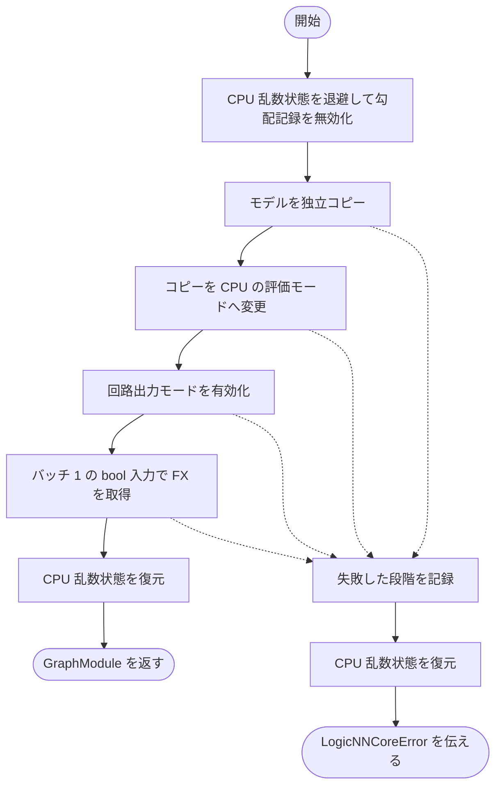

### 戻り値

型：`GraphModule`

make_fx が作成した GraphModule。

### 例外・注意事項

- 既存の LogicNNCoreError はそのまま伝わり、それ以外の Exception には model copy、CPU export preparation、FX trace のいずれかの段階を添えます。例外時も乱数状態は復元されます。

### ソースコード

<details>
<summary>\_trace\_model() の実装を開く</summary>

```python
def _trace_model(model: nn.Module, input_shape: tuple[int, ...]) -> GraphModule:
    """独立したCPUコピーをexport追跡し、元のdtype・モデル状態・CPU乱数状態を守る。"""
    stage = "model copy"
    try:
        with torch.random.fork_rng(devices=[]), torch.no_grad():
            copied = deepcopy(model)
            stage  = "CPU export preparation"
            copied.cpu().eval()
            set_export_mode(copied)
            stage = "FX trace"
            return make_fx(copied)(torch.zeros((1, *input_shape), dtype=torch.bool, device="cpu"))
    except LogicNNCoreError:
        raise
    except Exception as error:
        raise LogicNNCoreError(
            "モデルから回路用の処理グラフを作成できません",
            detail=f"stage={stage}: {type(error).__name__}: {error}",
            hint="モデルが独立コピー・CPU移動・bool入力のexport追跡に対応しているか確認してください",
        ) from error
```

</details>

## Circuit {/* #circuit-class */}

独立した CircuitData と、必要に応じて生成した C の実行状態を保持する回路オブジェクトです。

{/* function: Circuit.__init__@52 */}

## Circuit.\_\_init\_\_() {/* #circuit-init */}

```python
def __init__(self, data: CircuitData) -> None:
```

### 機能概要

回路の構造と数値演算のデータ型を検証し、外部の CircuitData と共有しないコピーを保存します。

### 引数

| 引数 | 型 | 既定値 | 説明 |
|---|---|---|---|
| `data` | `CircuitData` | `必須` | 論理ゲート、加算、元出力対応などを持つ CircuitData。 |

### 処理の流れ

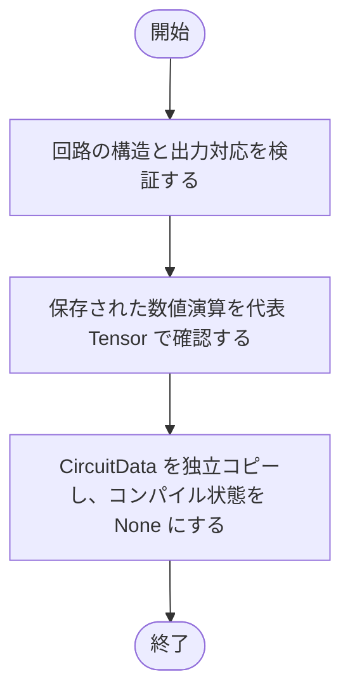

### 戻り値

型：`None`

None。

### 状態の変更・ファイル出力

- _data と _compiled を初期化します。

### ソースコード

<details>
<summary>Circuit.\_\_init\_\_() の実装を開く</summary>

```python
def __init__(self, data: CircuitData) -> None:
    """構造と数値型の意味を検証したIRを独立コピーして所有する。"""
    validate_circuit(data)
    runtime.validate_numeric_operations(data)
    self._data     = deepcopy(data)
    self._compiled: CompiledCircuit | None = None
```

</details>

{/* function: Circuit.from_model@60 */}

## Circuit.from\_model() {/* #circuit-from-model */}

```python
def from_model(cls, model: nn.Module, input_shape: Sequence[int]) -> Circuit:
```

### 機能概要

学習済みモデルなどの nn.Module から回路を構築します。モデルのコピーを二値入力で追跡し、加算前のビット対応を自動記録します。

### 引数

| 引数 | 型 | 既定値 | 説明 |
|---|---|---|---|
| `model` | `nn.Module` | `必須` | 回路へ変換する nn.Module。元のオブジェクトは変更しません。 |
| `input_shape` | `Sequence[int]` | `必須` | モデル入力のバッチを除く形状。例: 1 チャネル画像なら (1, 28, 28)。 |

### 処理の流れ

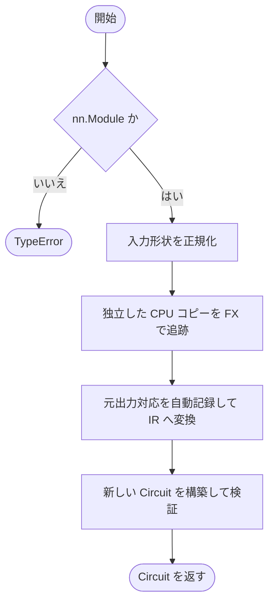

### 戻り値

型：`Circuit`

モデルから構築した新しい Circuit。

### 例外・注意事項

- 入力の二値化処理は追加しません。モデルは回路出力モードの bool 入力に対応している必要があります。

### 呼び出し例

モデル変数 `model` を用意済みの場合の例です。`input_shape` は、そのモデルが受け取る形状に合わせます。

```python
from logicnn_core import Circuit

circuit = Circuit.from_model(model, input_shape=(16,))
```

### ソースコード

<details>
<summary>Circuit.from\_model() の実装を開く</summary>

```python
@classmethod
def from_model(cls, model: nn.Module, input_shape: Sequence[int]) -> Circuit:
    """0／1入力のモデルをコピーして追跡し、元の論理出力対応を自動記録する。"""
    if not isinstance(model, nn.Module):
        raise TypeError("model はtorch.nn.Moduleで指定してください")
    shape = normalize_input_shape(input_shape)
    graph = _trace_model(model, shape)
    return cls(_build_traced_graph(graph, shape))
```

</details>

{/* function: Circuit.from_fx_graph@69 */}

## Circuit.from\_fx\_graph() {/* #circuit-from-fx-graph */}

```python
def from_fx_graph(
    cls,
    graph_module: GraphModule,
    input_shape: Sequence[int],
    *,
    logical_outputs: Sequence[Sequence[FxSignalReference | bool]],
) -> Circuit:
```

### 機能概要

外部 FX と元の出力ビットの対応情報から、新しい Circuit を作成します。

### 引数

| 引数 | 型 | 既定値 | 説明 |
|---|---|---|---|
| `graph_module` | `GraphModule` | `必須` | 対応する純粋演算と shape・dtype メタデータを持つ GraphModule。 |
| `input_shape` | `Sequence[int]` | `必須` | バッチ次元を除く入力形状。 |
| `logical_outputs` | `Sequence[Sequence[FxSignalReference \| bool]]` | `必須` | 最終出力ごとの加算前のビット列。FxSignalReference または bool の列を指定します。 |

### 処理の流れ

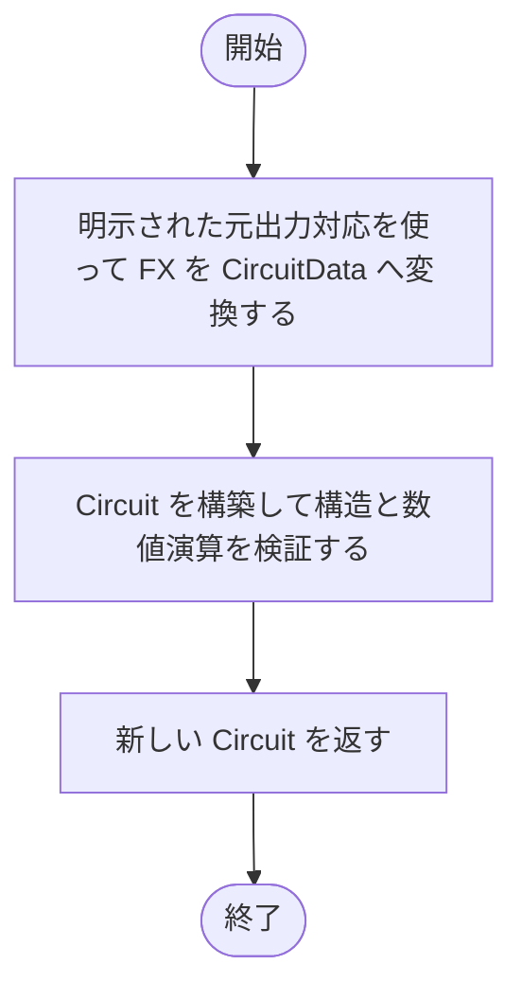

### 戻り値

型：`Circuit`

外部 FX から構築した新しい Circuit。

### ソースコード

<details>
<summary>Circuit.from\_fx\_graph() の実装を開く</summary>

```python
@classmethod
def from_fx_graph(
    cls,
    graph_module: GraphModule,
    input_shape: Sequence[int],
    *,
    logical_outputs: Sequence[Sequence[FxSignalReference | bool]],
) -> Circuit:
    """元出力対応を伴う外部FXから、失われた信号を推測せず回路を構築する。"""
    data = build_from_fx_graph(graph_module, input_shape, logical_outputs=logical_outputs)
    return cls(data)
```

</details>

{/* function: Circuit.from_dict@81 */}

## Circuit.from\_dict() {/* #circuit-from-dict */}

```python
def from_dict(cls, data: Mapping[str, object]) -> Circuit:
```

### 機能概要

回路の JSON スキーマと同じ構造の辞書を読み、型と参照を検証した Circuit を作成します。

### 引数

| 引数 | 型 | 既定値 | 説明 |
|---|---|---|---|
| `data` | `Mapping[str, object]` | `必須` | 保存形式に従うキーと値を持つ Mapping。 |

### 処理の流れ

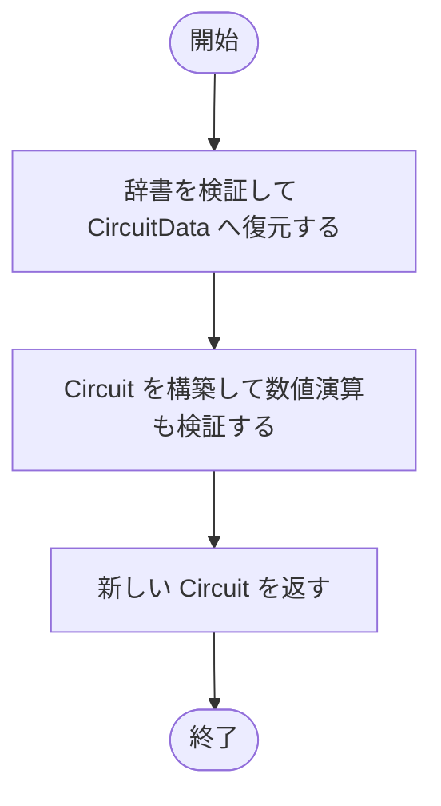

### 戻り値

型：`Circuit`

辞書の内容を復元した独立した Circuit。

### ソースコード

<details>
<summary>Circuit.from\_dict() の実装を開く</summary>

```python
@classmethod
def from_dict(cls, data: Mapping[str, object]) -> Circuit:
    """厳密な回路schemaのdictから、数値型も検証した独立した回路を生成する。"""
    return cls(serialization.from_dict(data))
```

</details>

{/* function: Circuit.from_json@86 */}

## Circuit.from\_json() {/* #circuit-from-json */}

```python
def from_json(cls, path: str | Path) -> Circuit:
```

### 機能概要

UTF-8 の回路 JSON を読み込み、数値演算の順序と元の出力ビット対応を復元します。

### 引数

| 引数 | 型 | 既定値 | 説明 |
|---|---|---|---|
| `path` | `str \| Path` | `必須` | 読み込む回路 JSON のパス。 |

### 処理の流れ

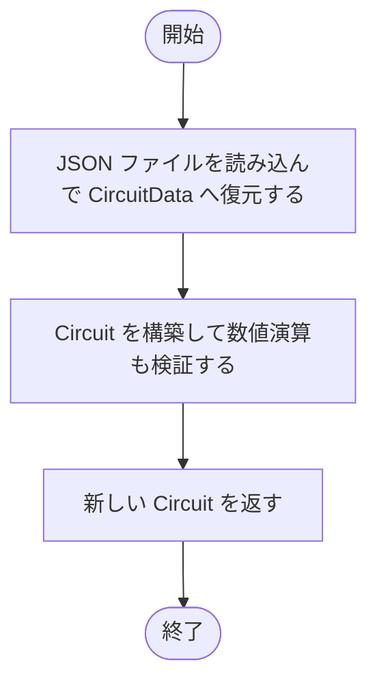

### 戻り値

型：`Circuit`

JSON から復元した新しい Circuit。

### 呼び出し例

```python
from logicnn_core import Circuit

circuit = Circuit.from_json("circuit.json")
```

### ソースコード

<details>
<summary>Circuit.from\_json() の実装を開く</summary>

```python
@classmethod
def from_json(cls, path: str | Path) -> Circuit:
    """UTF-8の回路JSONを読み、保存された数値演算と元出力対応を復元する。"""
    return cls(serialization.read_json(path))
```

</details>

{/* function: Circuit.validate@90 */}

## Circuit.validate() {/* #circuit-validate */}

```python
def validate(self) -> None:
```

### 機能概要

現在保持している回路について、構造・信号参照・出力対応・数値演算のデータ型を再確認します。

### 引数

`self` 以外に指定する引数はありません。

### 処理の流れ

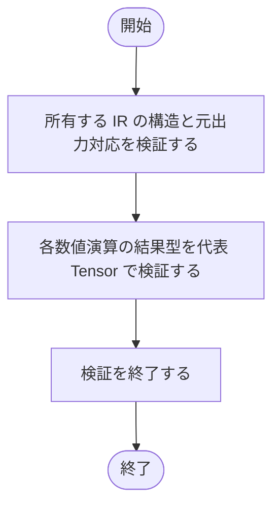

### 戻り値

型：`None`

問題がなければ None。不正な構造や演算では例外が発生します。

### ソースコード

<details>
<summary>Circuit.validate() の実装を開く</summary>

```python
def validate(self) -> None:
    """保持するIRの構造・論理出力対応・数値演算の型を検証する。"""
    validate_circuit(self._data)
    runtime.validate_numeric_operations(self._data)
```

</details>

{/* function: Circuit.simplify@95 */}

## Circuit.simplify() {/* #circuit-simplify */}

```python
def simplify(self, *, max_passes: int = 1000) -> None:
```

### 機能概要

回路を独立コピーして簡略化し、簡略化後の数値演算が有効な場合だけ所有する回路を置き換えます。元の出力数・順序・定数・重複は元出力対応で維持します。

### 引数

| 引数 | 型 | 既定値 | 説明 |
|---|---|---|---|
| `max_passes` | `int` | `1000` | 簡略化を繰り返す回数の上限。既定値は 1000。 |

### 処理の流れ

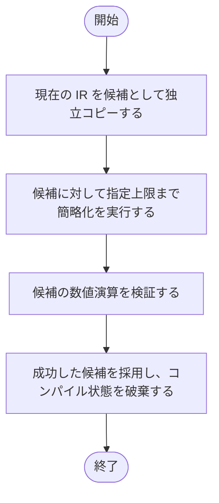

### 戻り値

型：`None`

None。

### 状態の変更・ファイル出力

- 成功時に _data を置き換え、_compiled を None にします。コンパイル済み評価には再コンパイルが必要です。

### 例外・注意事項

- 簡略化や検証に失敗した場合、既存の IR とコンパイル状態は置き換えません。

### ソースコード

<details>
<summary>Circuit.simplify() の実装を開く</summary>

```python
def simplify(self, *, max_passes: int = 1000) -> None:
    """候補の構造・数値型が簡略化後も有効な場合だけ、所有IRを置き換える。"""
    candidate = deepcopy(self._data)
    simplification.simplify(candidate, max_passes=max_passes)
    runtime.validate_numeric_operations(candidate)
    self._data     = candidate
    self._compiled = None
```

</details>

{/* function: Circuit.compile@103 */}

## Circuit.compile() {/* #circuit-compile */}

```python
def compile(self, *, optimization_level: int = 1, pack_bits: int | None = None) -> None:
```

### 機能概要

現在の回路を C ソースへ変換して共有ライブラリへコンパイルします。ライブラリの読み込みまで成功してから実行状態を更新します。

### 引数

| 引数 | 型 | 既定値 | 説明 |
|---|---|---|---|
| `optimization_level` | `int` | `1` | C コンパイラの最適化レベル。0〜3 の整数です。 |
| `pack_bits` | `int \| None` | `None` | サンプルを同じ整数ワードへまとめるビット数。None または 8、16、32、64。 |

### 処理の流れ

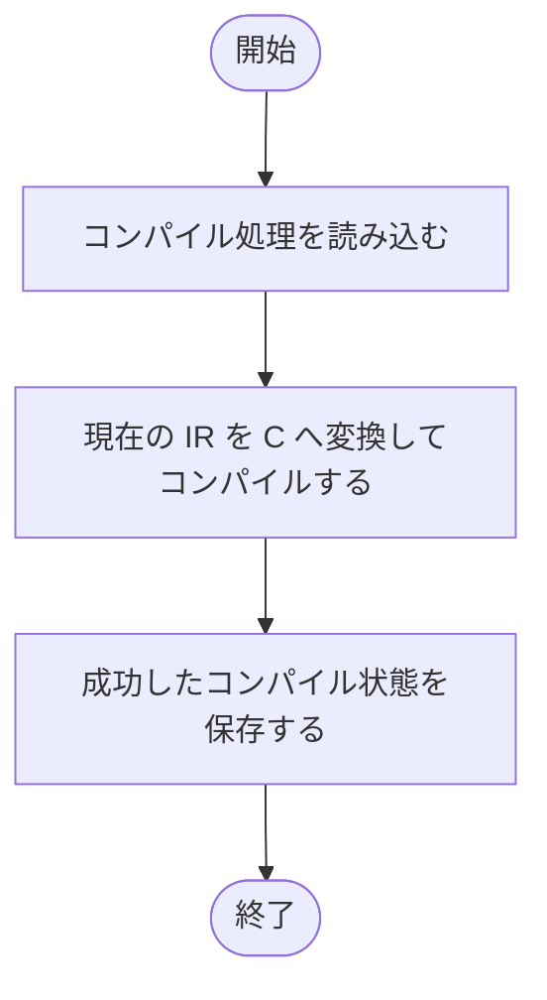

### 戻り値

型：`None`

None。

### 状態の変更・ファイル出力

- 一時ディレクトリに C ソースと共有ライブラリを作成し、_compiled を更新します。

### 例外・注意事項

- 失敗時は既存のコンパイル状態を維持します。コンパイラの自動導入や Python 実行への自動切り替えは行いません。

### 呼び出し例

C コンパイラを利用できる環境で、8 サンプルを一つのワードへまとめる例です。`inputs` は通常どおりバッチ付きの二値 Tensor を渡せます。

```python
circuit.compile(optimization_level=1, pack_bits=8)
scores = circuit.evaluate(inputs, compiled=True)
```

### ソースコード

<details>
<summary>Circuit.compile() の実装を開く</summary>

```python
def compile(self, *, optimization_level: int = 1, pack_bits: int | None = None) -> None:
    """現在のIRをnative Cへcompileし、成功した場合だけ旧compiled状態を置き換える。"""
    from .compiled_runtime import compile_circuit

    candidate      = compile_circuit(self._data, optimization_level=optimization_level, pack_bits=pack_bits)
    self._compiled = candidate
```

</details>

{/* function: Circuit.evaluate@110 */}

## Circuit.evaluate() {/* #circuit-evaluate */}

```python
def evaluate(self, inputs: Tensor | ndarray, *, compiled: bool = False) -> Tensor:
```

### 機能概要

二値入力を現在の回路で評価し、加算とその後の数値演算を含む最終出力を返します。Python 実行と、事前にコンパイルした C 実行を選択できます。

### 引数

| 引数 | 型 | 既定値 | 説明 |
|---|---|---|---|
| `inputs` | `Tensor \| ndarray` | `必須` | 形状 [batch, *input_shape] の Tensor または NumPy 配列。全要素は厳密な 0 または 1 です。 |
| `compiled` | `bool` | `False` | False なら Python の CPU 実行、True なら現在の回路のコンパイル済み C 実行。 |

### 処理の流れ

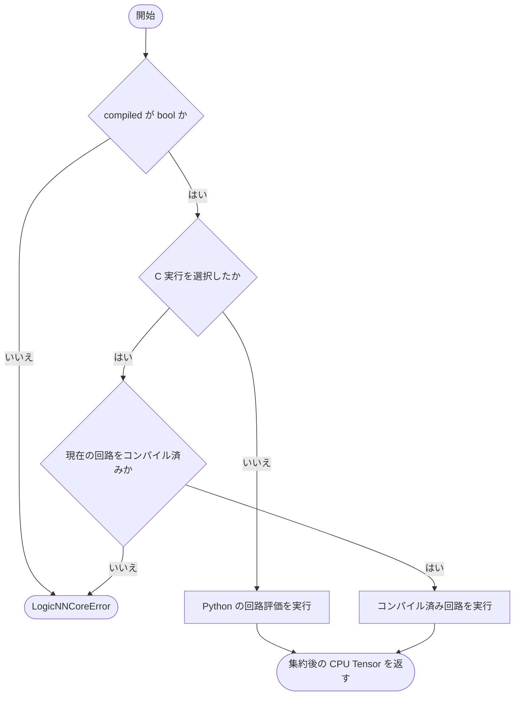

### 戻り値

型：`Tensor`

形状 [batch, *output_shape] の CPU Tensor。dtype は回路の output_dtype です。

### 例外・注意事項

- この処理は学習ではありません。重み更新も入力の閾値による二値化も行いません。

### 呼び出し例

入力幅 16 の回路に、3 サンプルの二値入力を与える例です。

```python
import torch

inputs = torch.randint(0, 2, (3, 16), dtype=torch.int64)
scores = circuit.evaluate(inputs)
```

### ソースコード

<details>
<summary>Circuit.evaluate() の実装を開く</summary>

```python
def evaluate(self, inputs: Tensor | ndarray, *, compiled: bool = False) -> Tensor:
    """二値入力を評価し、保存した出力dtypeとshapeの集約後CPU Tensorを返す。"""
    if type(compiled) is not bool:
        raise LogicNNCoreError("compiledはboolが必要です", detail=f"compiled={compiled!r}", hint="Python実行にはcompiled=Falseを指定してください")
    if compiled:
        if self._compiled is None:
            raise LogicNNCoreError(
                "compiled実行は現在の回路のcompile成功前には利用できません", detail="現在のIRに対応するnative実行状態がありません",
                hint="compileを実行してください。簡略化後は再compileが必要です。Python評価にはcompiled=Falseを指定してください",
            )
        return self._compiled.evaluate(inputs)
    return runtime.evaluate(self._data, inputs)
```

</details>

{/* function: Circuit.c_source@123 */}

## Circuit.c\_source() {/* #circuit-c-source */}

```python
def c_source(self, *, inline_single_use: bool = False, pack_bits: int | None = None) -> str:
```

### 機能概要

二値入力から最終的な数値出力まで計算する、独立した C ソースを取得します。ファイルへの保存やコンパイルは行いません。

### 引数

| 引数 | 型 | 既定値 | 説明 |
|---|---|---|---|
| `inline_single_use` | `bool` | `False` | 一度だけ参照されるゲートを変数にせず、利用先の式へ展開するか。 |
| `pack_bits` | `int \| None` | `None` | サンプル間のビット詰め幅。None または 8、16、32、64。出力はビット詰めしません。 |

### 処理の流れ

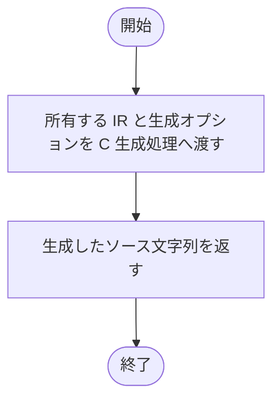

### 戻り値

型：`str`

logicnn_evaluate 関数を含む C ソース文字列。

### ソースコード

<details>
<summary>Circuit.c\_source() の実装を開く</summary>

```python
def c_source(self, *, inline_single_use: bool = False, pack_bits: int | None = None) -> str:
    """二値入力から集約後出力までを計算する独立C sourceを返す。"""
    return c.c_source(self._data, inline_single_use=inline_single_use, pack_bits=pack_bits)
```

</details>

{/* function: Circuit.verilog_source@127 */}

## Circuit.verilog\_source() {/* #circuit-verilog-source */}

```python
def verilog_source(self, *, inline_single_use: bool = False) -> str:
```

### 機能概要

元の加算前ビット列を出力する組合せ回路の Verilog ソースを取得します。加算、スコア計算、レジスタの挿入は行いません。

### 引数

| 引数 | 型 | 既定値 | 説明 |
|---|---|---|---|
| `inline_single_use` | `bool` | `False` | 一度だけ参照されるゲートを利用先の式へ展開するか。 |

### 処理の流れ

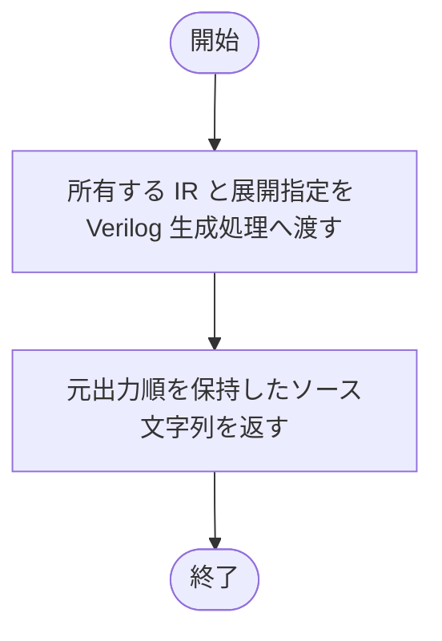

### 戻り値

型：`str`

logicnn_circuit モジュールを含む Verilog ソース文字列。

### ソースコード

<details>
<summary>Circuit.verilog\_source() の実装を開く</summary>

```python
def verilog_source(self, *, inline_single_use: bool = False) -> str:
    """加算を含めず、保存された元の順序で生bitを出力するVerilog sourceを返す。"""
    return verilog.verilog_source(self._data, inline_single_use=inline_single_use)
```

</details>

{/* function: Circuit.write_c@131 */}

## Circuit.write\_c() {/* #circuit-write-c */}

```python
def write_c(self, path: str | Path, *, inline_single_use: bool = False, pack_bits: int | None = None) -> None:
```

### 機能概要

C ソースの生成に成功してから保存先を置き換えます。生成途中のエラーで既存のファイルを書き換えないよう、生成と保存を分離しています。

### 引数

| 引数 | 型 | 既定値 | 説明 |
|---|---|---|---|
| `path` | `str \| Path` | `必須` | C ソースの保存先。親ディレクトリは事前に存在する必要があります。 |
| `inline_single_use` | `bool` | `False` | 単一利用ゲートを式へ展開するか。 |
| `pack_bits` | `int \| None` | `None` | サンプル間のビット詰め幅。None または 8、16、32、64。 |

### 処理の流れ

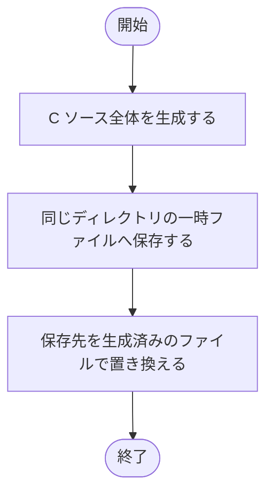

### 戻り値

型：`None`

None。

### 状態の変更・ファイル出力

- path の C ファイルを作成または置換します。

### ソースコード

<details>
<summary>Circuit.write\_c() の実装を開く</summary>

```python
def write_c(self, path: str | Path, *, inline_single_use: bool = False, pack_bits: int | None = None) -> None:
    """検証とC生成の完了後に原子的に保存し、生成失敗時に既存fileを保護する。"""
    writing.write_source(self.c_source(inline_single_use=inline_single_use, pack_bits=pack_bits), path)
```

</details>

{/* function: Circuit.write_verilog@135 */}

## Circuit.write\_verilog() {/* #circuit-write-verilog */}

```python
def write_verilog(self, path: str | Path, *, inline_single_use: bool = False) -> None:
```

### 機能概要

加算前の生ビット出力を持つ Verilog を生成して保存します。生成が完了してからファイルを置き換えます。

### 引数

| 引数 | 型 | 既定値 | 説明 |
|---|---|---|---|
| `path` | `str \| Path` | `必須` | Verilog ソースの保存先。親ディレクトリは事前に存在する必要があります。 |
| `inline_single_use` | `bool` | `False` | 単一利用ゲートを式へ展開するか。 |

### 処理の流れ

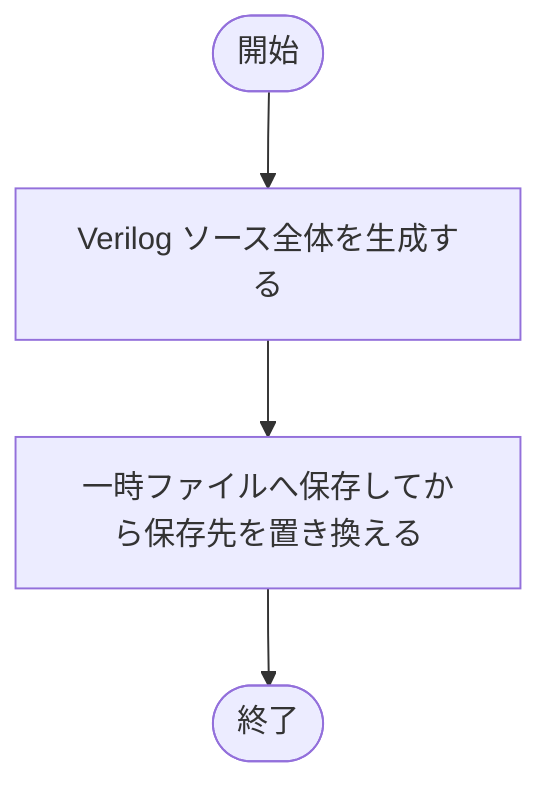

### 戻り値

型：`None`

None。

### 状態の変更・ファイル出力

- path の Verilog ファイルを作成または置換します。

### 呼び出し例

保存先の親ディレクトリが存在する場合の例です。

```python
circuit.write_verilog("circuit.v", inline_single_use=True)
```

### ソースコード

<details>
<summary>Circuit.write\_verilog() の実装を開く</summary>

```python
def write_verilog(self, path: str | Path, *, inline_single_use: bool = False) -> None:
    """元の生出力境界を持つVerilogを、生成と検証の完了後に原子的に保存する。"""
    writing.write_source(self.verilog_source(inline_single_use=inline_single_use), path)
```

</details>

{/* function: Circuit.to_dict@139 */}

## Circuit.to\_dict() {/* #circuit-to-dict */}

```python
def to_dict(self) -> dict[str, object]:
```

### 機能概要

回路を保存スキーマに従う辞書へ変換します。返す辞書やリストは所有する IR と共有しません。

### 引数

`self` 以外に指定する引数はありません。

### 処理の流れ

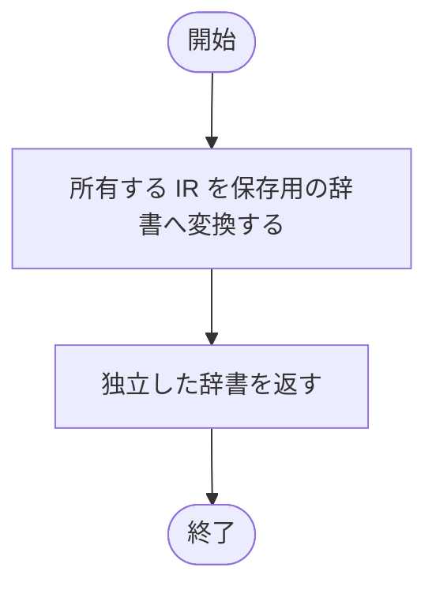

### 戻り値

型：`dict[str, object]`

JSON 化できる回路情報の辞書。

### ソースコード

<details>
<summary>Circuit.to\_dict() の実装を開く</summary>

```python
def to_dict(self) -> dict[str, object]:
    """構築時に検証した回路を、所有IRとcontainerを共有しないdictへ変換する。"""
    return serialization.to_dict(self._data)
```

</details>

{/* function: Circuit.write_json@143 */}

## Circuit.write\_json() {/* #circuit-write-json */}

```python
def write_json(self, path: str | Path) -> None:
```

### 機能概要

回路の構造、演算順序、データ型、元出力対応を JSON に保存します。

### 引数

| 引数 | 型 | 既定値 | 説明 |
|---|---|---|---|
| `path` | `str \| Path` | `必須` | 回路 JSON の保存先。 |

### 処理の流れ

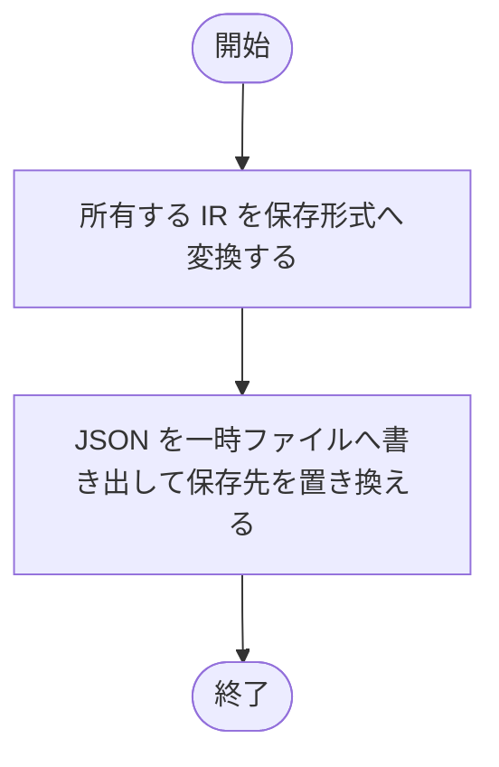

### 戻り値

型：`None`

None。

### 状態の変更・ファイル出力

- path の JSON ファイルを作成または置換します。

### ソースコード

<details>
<summary>Circuit.write\_json() の実装を開く</summary>

```python
def write_json(self, path: str | Path) -> None:
    """構築時に検証した回路をJSONへ原子的に保存し、失敗時は既存fileを保つ。"""
    serialization.write_json(self._data, path)
```

</details>

{/* function: Circuit.logical_output_ids@147 */}

## Circuit.logical\_output\_ids() {/* #circuit-logical-output-ids */}

```python
def logical_output_ids(self) -> tuple[int, ...]:
```

### 機能概要

加算前の出力 ID を、グループ順とグループ内の順序を保った一次元の列として取得します。定数と重複した出力も含めます。

### 引数

`self` 以外に指定する引数はありません。

### 処理の流れ

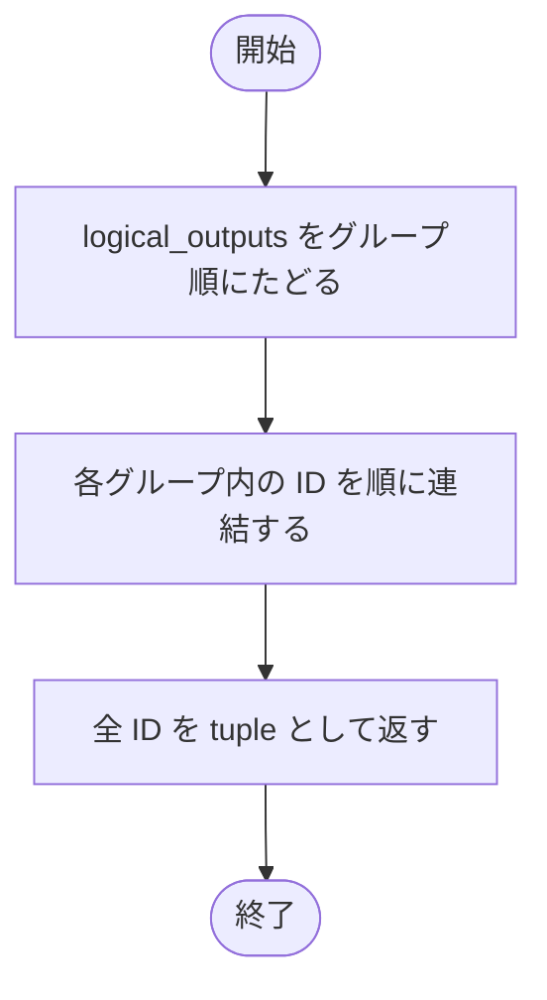

### 戻り値

型：`tuple[int, ...]`

元出力順の信号 ID を持つ tuple。

### ソースコード

<details>
<summary>Circuit.logical\_output\_ids() の実装を開く</summary>

```python
def logical_output_ids(self) -> tuple[int, ...]:
    """集約前の出力IDを元group順・bit順にflattenし、定数と重複を維持する。"""
    return tuple(node_id for group in self._data.logical_outputs for node_id in group.node_ids)
```

</details>

{/* function: Circuit.evaluate_logical_outputs@151 */}

## Circuit.evaluate\_logical\_outputs() {/* #circuit-evaluate-logical-outputs */}

```python
def evaluate_logical_outputs(self, inputs: Tensor | ndarray) -> Tensor:
```

### 機能概要

加算前の元ビット列だけを Python の CPU 実行で評価します。Verilog の出力と比較する際に使う入口です。

### 引数

| 引数 | 型 | 既定値 | 説明 |
|---|---|---|---|
| `inputs` | `Tensor \| ndarray` | `必須` | 形状 [batch, *input_shape] の Tensor または NumPy 配列。値は厳密な 0 または 1。 |

### 処理の流れ

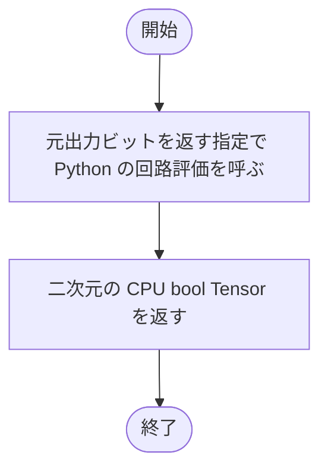

### 戻り値

型：`Tensor`

形状 [batch, 元の生出力数] の CPU bool Tensor。順序は logical_output_ids と一致します。

### 例外・注意事項

- SumReduction と加算後の数値演算は実行しません。

### ソースコード

<details>
<summary>Circuit.evaluate\_logical\_outputs() の実装を開く</summary>

```python
def evaluate_logical_outputs(self, inputs: Tensor | ndarray) -> Tensor:
    """保存済みの元出力順に集約前bitを評価し、二次元のCPU bool Tensorを返す。"""
    return runtime.evaluate(self._data, inputs, logical=True)
```

</details>

## 関連ファイル

- [utils/logicNN_core/src/logicnn_core/circuit/\_\_init\_\_.py](/code-reference/utils/logicNN_core/src/logicnn_core/circuit/__init__)
- [utils/logicNN_core/src/logicnn_core/circuit/builder.py](/code-reference/utils/logicNN_core/src/logicnn_core/circuit/builder)
- [utils/logicNN_core/src/logicnn_core/circuit/compiled_runtime.py](/code-reference/utils/logicNN_core/src/logicnn_core/circuit/compiled_runtime)
- [utils/logicNN_core/src/logicnn_core/circuit/exporters/\_\_init\_\_.py](/code-reference/utils/logicNN_core/src/logicnn_core/circuit/exporters/__init__)
- [utils/logicNN_core/src/logicnn_core/circuit/exporters/c.py](/code-reference/utils/logicNN_core/src/logicnn_core/circuit/exporters/c)
- [utils/logicNN_core/src/logicnn_core/circuit/exporters/verilog.py](/code-reference/utils/logicNN_core/src/logicnn_core/circuit/exporters/verilog)
- [utils/logicNN_core/src/logicnn_core/circuit/exporters/writing.py](/code-reference/utils/logicNN_core/src/logicnn_core/circuit/exporters/writing)
- [utils/logicNN_core/src/logicnn_core/circuit/runtime.py](/code-reference/utils/logicNN_core/src/logicnn_core/circuit/runtime)
- [utils/logicNN_core/src/logicnn_core/circuit/serialization.py](/code-reference/utils/logicNN_core/src/logicnn_core/circuit/serialization)
- [utils/logicNN_core/src/logicnn_core/circuit/simplification.py](/code-reference/utils/logicNN_core/src/logicnn_core/circuit/simplification)
- [utils/logicNN_core/src/logicnn_core/circuit/types.py](/code-reference/utils/logicNN_core/src/logicnn_core/circuit/types)
- [utils/logicNN_core/src/logicnn_core/circuit/validation.py](/code-reference/utils/logicNN_core/src/logicnn_core/circuit/validation)
- [utils/logicNN_core/src/logicnn_core/exceptions.py](/code-reference/utils/logicNN_core/src/logicnn_core/exceptions)
- [utils/logicNN_core/src/logicnn_core/export_mode.py](/code-reference/utils/logicNN_core/src/logicnn_core/export_mode)
