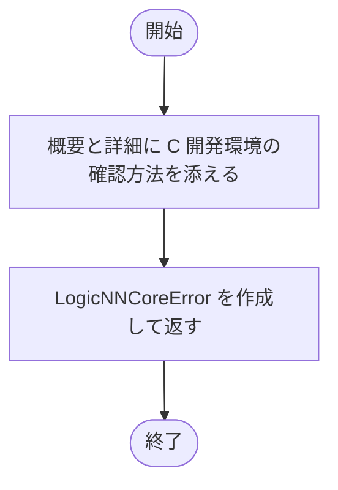
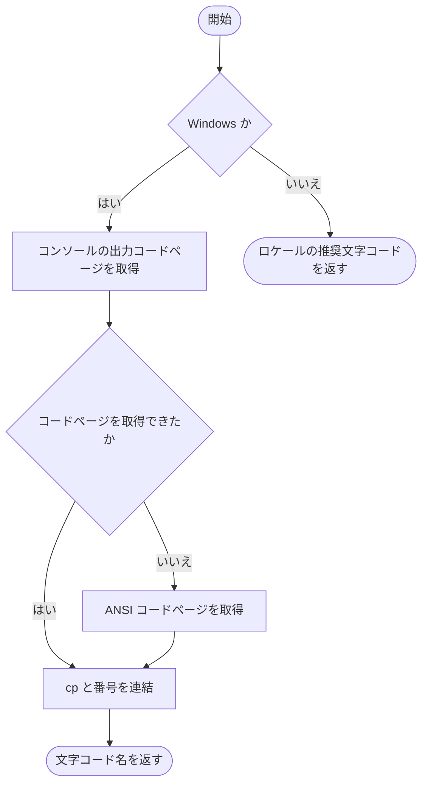
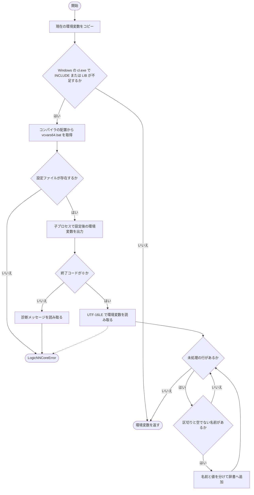
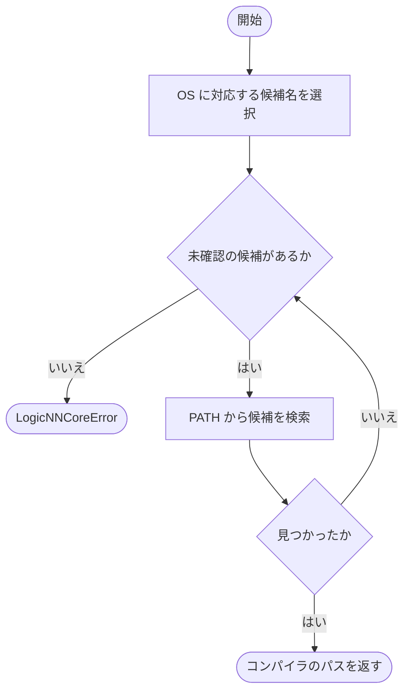
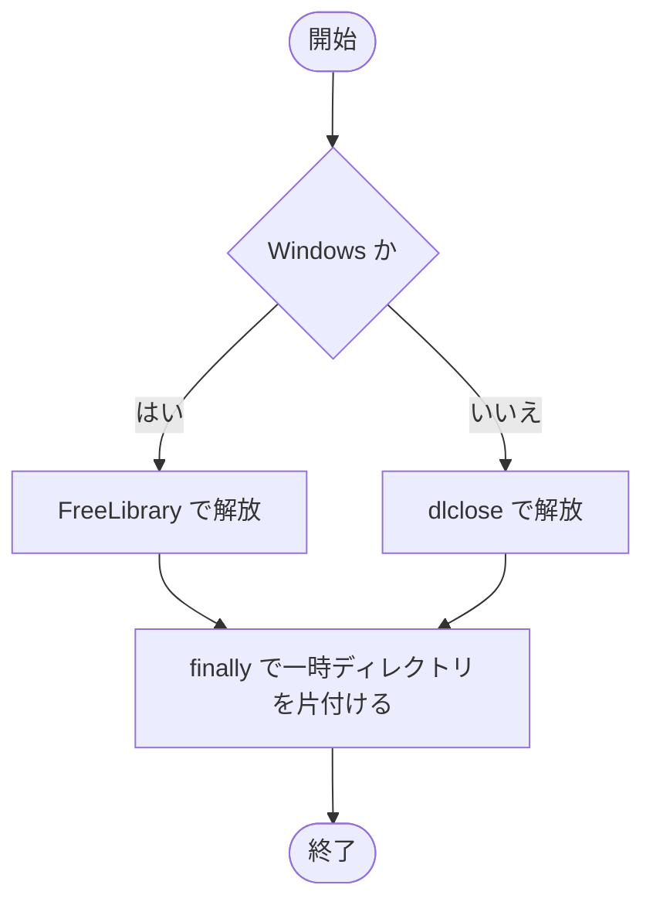
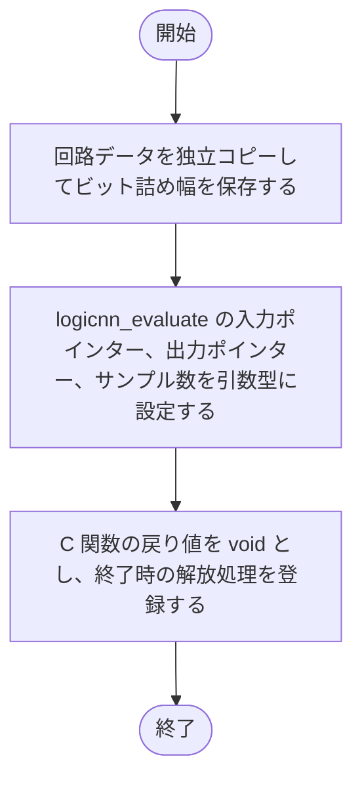
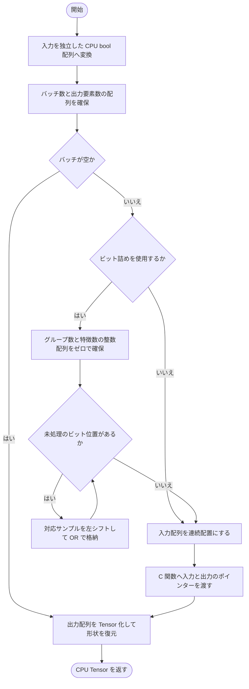
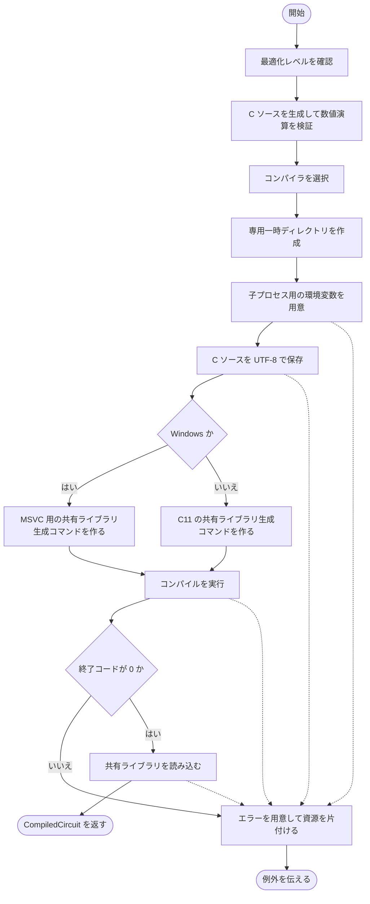

# compiled_runtime.py

`utils/logicNN_core/src/logicnn_core/circuit/compiled_runtime.py`

回路から生成した C をネイティブの共有ライブラリへコンパイルし、Python から実行できるようにします。コンパイラ選択、Windows の開発環境、入出力配列、ビット詰め、一時ファイルと共有ライブラリの解放を管理します。

{/* source-sha256: e5e91f8cfe91323868d9fb8f1141643392bb66e466ede8de0dd2be1a710924ae */}

{/* function: _compiler_error@27 */}

## \_compiler\_error() {/* #compiler-error */}

```python
def _compiler_error(message: str, detail: str) -> LogicNNCoreError:
```

### 機能概要

コンパイラの選択・実行・共有ライブラリの読み込みに関するエラーを作成します。この関数自体は例外を送出しません。

### 引数

| 引数 | 型 | 既定値 | 説明 |
|---|---|---|---|
| `message` | `str` | `必須` | 利用者へ示すエラーの概要。 |
| `detail` | `str` | `必須` | 処理段階、コンパイラ、終了コードなどの詳細。 |

### 処理の流れ



### 戻り値

型：`LogicNNCoreError`

説明と対処方法を持つ LogicNNCoreError オブジェクト。

### 例外・注意事項

- コンパイルに失敗しても Python 実行へ自動で切り替えない方針を、エラーのヒントに記載します。

### ソースコード

<details>
<summary>\_compiler\_error() の実装を開く</summary>

```python
def _compiler_error(message: str, detail: str) -> LogicNNCoreError:
    """compiler選択・実行・library読込の失敗を、実行段階付きで生成する。"""
    return LogicNNCoreError(message, detail=detail, hint="対応するnative C compilerと開発環境を用意してください。Python実行へは自動fallbackしません")
```

</details>

{/* function: _compiler_encoding@32 */}

## \_compiler\_encoding() {/* #compiler-encoding */}

```python
def _compiler_encoding() -> str:
```

### 機能概要

コンパイラの診断メッセージを読み取るための文字コードを選択します。Windows ではコンソールの出力コードページを使い、コンソールがなければシステムの ANSI コードページを使います。

### 引数

指定する引数はありません。

### 処理の流れ



### 戻り値

型：`str`

cp932 などの Python で利用できる文字コード名。Windows 以外はロケールの推奨文字コード。

### ソースコード

<details>
<summary>\_compiler\_encoding() の実装を開く</summary>

```python
def _compiler_encoding() -> str:
    """MSVCのconsole code pageを使い、consoleがないWindowsではANSI code pageへ従う。"""
    if os.name == "nt":
        kernel   = ctypes.windll.kernel32
        codepage = kernel.GetConsoleOutputCP() or kernel.GetACP()
        return f"cp{codepage}"
    return locale.getpreferredencoding(False)
```

</details>

{/* function: _compiler_environment@41 */}

## \_compiler\_environment() {/* #compiler-environment */}

```python
def _compiler_environment(compiler: str) -> dict[str, str]:
```

### 機能概要

子プロセスへ渡す環境変数を用意します。Windows の cl.exe で INCLUDE または LIB のどちらかが未設定の場合、コンパイラの配置から vcvars64.bat を見つけて開発環境を読み込みます。親プロセスの環境変数は書き換えません。

### 引数

| 引数 | 型 | 既定値 | 説明 |
|---|---|---|---|
| `compiler` | `str` | `必須` | 選択済みのコンパイラのパス。 |

### 処理の流れ



### 戻り値

型：`dict[str, str]`

コンパイル用の環境変数の辞書。

### 状態の変更・ファイル出力

- 必要な場合に限り、開発環境設定用の子プロセスを実行します。

### 例外・注意事項

- 設定プロセスのタイムアウトは 90 秒です。環境変数の値は UTF-16LE として厳密に読み取り、診断メッセージだけに文字コードの推定を使います。

### ソースコード

<details>
<summary>\_compiler\_environment() の実装を開く</summary>

```python
def _compiler_environment(compiler: str) -> dict[str, str]:
    """MSVCが必要な場合だけ子process用の開発環境を読み、親の環境変数は変更しない。"""
    environment = os.environ.copy()
    if os.name != "nt" or Path(compiler).name.lower() != "cl.exe" or (environment.get("INCLUDE") and environment.get("LIB")):
        return environment
    parents = Path(compiler).resolve().parents
    if len(parents) < 7:
        raise _compiler_error("MSVC環境を初期化できません", f"compiler={compiler}")
    setup = parents[6] / "Auxiliary" / "Build" / "vcvars64.bat"
    if not setup.is_file():
        raise _compiler_error("MSVC環境設定が見つかりません", f"setup={setup}")
    command = f'cmd.exe /u /d /s /c ""{setup}" >nul && set"'
    result  = subprocess.run(command, capture_output=True, timeout=90, check=False)
    if result.returncode:
        # cmd /uの内部診断はUTF-16、呼び出した外部toolの診断はconsole code page。環境値にはこの推定を使わない。
        encoding = "utf-16-le" if b"\0" in result.stderr else _compiler_encoding()
        detail   = result.stderr.decode(encoding, errors="replace")
        raise _compiler_error("MSVC環境の初期化に失敗しました", f"stage=environment, returncode={result.returncode}: {detail[-4000:]}")
    try:
        output = result.stdout.decode("utf-16-le")
    except UnicodeDecodeError as error:
        raise _compiler_error("MSVC環境の文字列を読み取れません", f"stage=environment, expected=UTF-16LE, byte_offset={error.start}") from error
    for line in output.splitlines():
        name, separator, value = line.partition("=")
        if separator and name:
            environment[name] = value
    return environment
```

</details>

{/* function: _compiler@70 */}

## \_compiler() {/* #compiler */}

```python
def _compiler() -> str:
```

### 機能概要

現在のプラットフォームに対応するコンパイラを PATH から順に探します。Windows は cl のみ、その他は cc、gcc、clang の順で選択します。

### 引数

指定する引数はありません。

### 処理の流れ



### 戻り値

型：`str`

最初に見つかった対応コンパイラのパス。

### 例外・注意事項

- コンパイラは自動でインストールしません。

### ソースコード

<details>
<summary>\_compiler() の実装を開く</summary>

```python
def _compiler() -> str:
    """現在のplatformに対応する既存compilerを選び、自動導入や異種DLLへの代替をしない。"""
    names = ("cl",) if os.name == "nt" else ("cc", "gcc", "clang")
    for name in names:
        path = shutil.which(name)
        if path:
            return path
    raise _compiler_error("対応するC compilerが見つかりません", f"platform={sys.platform}, candidates={names}")
```

</details>

{/* function: _release_library@80 */}

## \_release\_library() {/* #release-library */}

```python
def _release_library(library: ctypes.CDLL, directory: TemporaryDirectory[str]) -> None:
```

### 機能概要

使用を終えた共有ライブラリを OS に応じた方法で解放し、そのライブラリ専用の一時ディレクトリを片付けます。

### 引数

| 引数 | 型 | 既定値 | 説明 |
|---|---|---|---|
| `library` | `ctypes.CDLL` | `必須` | 解放する ctypes.CDLL。 |
| `directory` | `TemporaryDirectory[str]` | `必須` | C ソースと共有ライブラリを置いた TemporaryDirectory。 |

### 処理の流れ



### 戻り値

型：`None`

正常に完了すれば None。

### 状態の変更・ファイル出力

- 共有ライブラリのハンドルを解放し、専用一時ディレクトリを削除します。

### 例外・注意事項

- ライブラリの解放に失敗した場合も finally でディレクトリの後片付けを試みます。

### ソースコード

<details>
<summary>\_release\_library() の実装を開く</summary>

```python
def _release_library(library: ctypes.CDLL, directory: TemporaryDirectory[str]) -> None:
    """所有する共有libraryを解放した後、専用の一時成果物だけを片付ける。"""
    import _ctypes

    try:
        if os.name == "nt":
            _ctypes.FreeLibrary(library._handle)
        else:
            _ctypes.dlclose(library._handle)
    finally:
        directory.cleanup()
```

</details>

## CompiledCircuit {/* #compiledcircuit-class */}

コンパイル成功時点の回路のコピーと C 関数を保持し、同じ回路へ複数回の入力を与えられるようにします。

{/* function: CompiledCircuit.__init__@96 */}

## CompiledCircuit.\_\_init\_\_() {/* #compiledcircuit-init */}

```python
def __init__(self, data: CircuitData, pack_bits: int | None, library: ctypes.CDLL, directory: TemporaryDirectory[str]) -> None:
```

### 機能概要

回路を独立コピーし、C 関数の引数・戻り値の型を ctypes に設定します。オブジェクトの寿命に合わせて共有ライブラリと一時ファイルを解放する処理も登録します。

### 引数

| 引数 | 型 | 既定値 | 説明 |
|---|---|---|---|
| `data` | `CircuitData` | `必須` | コンパイル成功時点の CircuitData。 |
| `pack_bits` | `int \| None` | `必須` | 生成した C 入力のビット詰め幅。詰めない場合は None。 |
| `library` | `ctypes.CDLL` | `必須` | logicnn_evaluate を公開する読み込み済み共有ライブラリ。 |
| `directory` | `TemporaryDirectory[str]` | `必須` | 共有ライブラリと C ソースを保持する専用一時ディレクトリ。 |

### 処理の流れ



### 戻り値

型：`None`

None。

### 状態の変更・ファイル出力

- 共有ライブラリと一時ディレクトリを、このインスタンスが使用できる間保持します。

### ソースコード

<details>
<summary>CompiledCircuit.\_\_init\_\_() の実装を開く</summary>

```python
def __init__(self, data: CircuitData, pack_bits: int | None, library: ctypes.CDLL, directory: TemporaryDirectory[str]) -> None:
    """libraryの関数signatureと所有期間を固定し、入力IRを独立コピーする。"""
    self._data      = deepcopy(data)
    self._pack_bits = pack_bits
    self._function = library.logicnn_evaluate
    self._function.argtypes = [ctypes.c_void_p, ctypes.c_void_p, ctypes.c_size_t]
    self._function.restype  = None
    self._finalizer = weakref.finalize(self, _release_library, library, directory)
```

</details>

{/* function: CompiledCircuit.evaluate@105 */}

## CompiledCircuit.evaluate() {/* #compiledcircuit-evaluate */}

```python
def evaluate(self, inputs: Tensor | np.ndarray) -> Tensor:
```

### 機能概要

二値入力を C 関数の配列へ整え、コンパイル済み回路を評価します。pack_bits を指定した回路では、特徴位置を保ったまま複数サンプルを整数ワードの各ビットへ格納します。

### 引数

| 引数 | 型 | 既定値 | 説明 |
|---|---|---|---|
| `inputs` | `Tensor \| np.ndarray` | `必須` | 形状 [batch, *input_shape] の二値 Tensor または NumPy 配列。 |

### 処理の流れ



### 戻り値

型：`Tensor`

形状 [batch, *output_shape]、回路の output_dtype を持つ CPU Tensor。

### 例外・注意事項

- ビット 0 が各グループの最初のサンプルです。末尾のグループが幅に満たない場合は未使用ビットを 0 のままにします。出力はビット詰めせず、サンプル順に並びます。

### ソースコード

<details>
<summary>CompiledCircuit.evaluate() の実装を開く</summary>

```python
def evaluate(self, inputs: Tensor | np.ndarray) -> Tensor:
    """binary入力を必要に応じpackingし、native結果を保存dtypeのCPU Tensorで返す。"""
    binary = _binary_inputs(inputs, self._data.input_shape).numpy()
    batch  = binary.shape[0]
    output = np.empty((batch, math.prod(self._data.output_shape)), dtype=np.dtype(self._data.output_dtype.value))
    if batch:
        prepared = binary
        if self._pack_bits is not None:
            width    = self._pack_bits
            dtype    = np.dtype(f"uint{width}")
            prepared = np.zeros(((batch + width - 1) // width, binary.shape[1]), dtype=dtype)
            for bit_index in range(min(width, batch)):
                rows = binary[bit_index::width].astype(dtype)
                prepared[:len(rows)] |= rows << bit_index
        prepared = np.ascontiguousarray(prepared)
        self._function(prepared.ctypes.data, output.ctypes.data, batch)
    return torch.from_numpy(output).reshape(batch, *self._data.output_shape)
```

</details>

{/* function: compile_circuit@124 */}

## compile\_circuit() {/* #compile-circuit */}

```python
def compile_circuit(data: CircuitData, *, optimization_level: int = 1, pack_bits: int | None = None) -> CompiledCircuit:
```

### 機能概要

回路を C へ変換し、専用の一時ディレクトリでコンパイルして共有ライブラリを読み込みます。コンパイルから読み込みまで成功した場合だけ CompiledCircuit を返し、失敗した場合は作成途中の資源を片付けます。

### 引数

| 引数 | 型 | 既定値 | 説明 |
|---|---|---|---|
| `data` | `CircuitData` | `必須` | コンパイルする CircuitData。 |
| `optimization_level` | `int` | `1` | 0〜3 の最適化レベル。Windows では 0 が /Od、1 が /O1、2 と 3 が /O2 に対応します。 |
| `pack_bits` | `int \| None` | `None` | サンプル間のビット詰め幅。None または 8、16、32、64。 |

### 処理の流れ



### 戻り値

型：`CompiledCircuit`

読み込み済み C 関数と専用一時ディレクトリを保持する CompiledCircuit。

### 状態の変更・ファイル出力

- 一時ディレクトリ、circuit.c、circuit.dll または circuit.so を作成し、コンパイラの子プロセスを実行します。

### 例外・注意事項

- コンパイルのタイムアウトは 90 秒です。高速化のために数値演算を自由に再配置する fast-math は有効にしません。
- OS・子プロセス・共有関数取得の失敗には処理段階を添えた LogicNNCoreError を送出します。その他の例外は後片付けの後でそのまま伝えます。

### ソースコード

<details>
<summary>compile\_circuit() の実装を開く</summary>

```python
def compile_circuit(data: CircuitData, *, optimization_level: int = 1, pack_bits: int | None = None) -> CompiledCircuit:
    """独立directoryでCをcompileし、library読込まで成功した状態だけを返す。"""
    if type(optimization_level) is not int or optimization_level not in range(4):
        raise _compiler_error("optimization_levelは0〜3の整数が必要です", f"optimization_level={optimization_level!r}")
    source   = c_source(data, pack_bits=pack_bits)
    validate_numeric_operations(data)
    compiler = _compiler()
    temporary: TemporaryDirectory[str] = TemporaryDirectory(prefix="logicnn-core-")
    folder   = Path(temporary.name)
    library: ctypes.CDLL | None = None
    try:
        environment = _compiler_environment(compiler)
        source_path = folder / "circuit.c"
        output_path = folder / ("circuit.dll" if os.name == "nt" else "circuit.so")
        source_path.write_text(source, encoding="utf-8")
        if os.name == "nt":
            optimization = "/Od" if optimization_level == 0 else "/O1" if optimization_level == 1 else "/O2"
            command = [compiler, "/nologo", "/std:c11", "/LD", optimization, "/fp:strict", str(source_path), f"/Fe:{output_path}"]
        else:
            command = [
                compiler, "-std=c11", "-shared", "-fPIC", "-fno-fast-math", "-ffp-contract=off", f"-O{optimization_level}",
                str(source_path), "-o", str(output_path),
            ]
        result = subprocess.run(command, cwd=folder, env=environment, capture_output=True, text=True, encoding=_compiler_encoding(), errors="replace",
                                timeout=90, check=False)
        if result.returncode:
            details = f"stage=compile, compiler={compiler}, returncode={result.returncode}\n{result.stdout[-4000:]}\n{result.stderr[-4000:]}"
            raise _compiler_error("回路のC compileに失敗しました", details)
        library = ctypes.CDLL(str(output_path))
        return CompiledCircuit(data, pack_bits, library, temporary)
    except (OSError, subprocess.SubprocessError, AttributeError) as error:
        if library is not None:
            _release_library(library, temporary)
        else:
            temporary.cleanup()
        raise _compiler_error("C実行環境を準備できません", f"stage=compile/load: {type(error).__name__}: {error}") from error
    except Exception:
        if library is not None:
            _release_library(library, temporary)
        else:
            temporary.cleanup()
        raise
```

</details>

## 関連ファイル

- [utils/logicNN_core/src/logicnn_core/circuit/exporters/c.py](/code-reference/utils/logicNN_core/src/logicnn_core/circuit/exporters/c)
- [utils/logicNN_core/src/logicnn_core/circuit/runtime.py](/code-reference/utils/logicNN_core/src/logicnn_core/circuit/runtime)
- [utils/logicNN_core/src/logicnn_core/circuit/types.py](/code-reference/utils/logicNN_core/src/logicnn_core/circuit/types)
- [utils/logicNN_core/src/logicnn_core/exceptions.py](/code-reference/utils/logicNN_core/src/logicnn_core/exceptions)
