# c.py

`utils/logicNN_core/src/logicnn_core/circuit/exporters/c.py`

回路の中間表現から、二値入力を受け取り集約後の数値を返す C11 ソースを生成します。ゲート式の展開、サンプル間のビット詰め、整数の下位ビット、数値演算各段のデータ型と順序を扱います。低精度浮動小数点など再現を確認していない条件では生成を中断します。

{/* source-sha256: 73afdc00eeed3c1b109b36ffdf5c5e3188185b91d3b8af81ce8c06d3eb722db6 */}

{/* function: _fail@22 */}

## \_fail() {/* #fail */}

```python
def _fail(message: str) -> NoReturn:
```

### 機能概要

対応していない C 変換条件を LogicNNCoreError として報告します。別の数値型へ置き換えて生成を続けることはしません。

### 引数

| 引数 | 型 | 既定値 | 説明 |
|---|---|---|---|
| `message` | `str` | `必須` | C で生成できない条件の説明。 |

### 処理の流れ

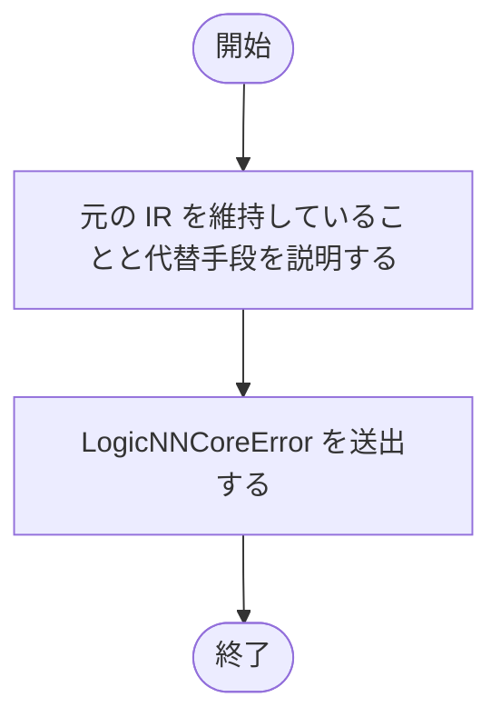

### 戻り値

型：`NoReturn`

正常には戻りません。

### ソースコード

<details>
<summary>\_fail() の実装を開く</summary>

```python
def _fail(message: str) -> NoReturn:
    """再現未確認のC変換条件を、黙って別の数値型へ変更せず報告する。"""
    raise LogicNNCoreError(message, detail="C source lowering", hint="元のIRは維持されています。対応する型・演算を使用するかPython評価を利用してください")
```

</details>

{/* function: _ctype@27 */}

## \_ctype() {/* #ctype */}

```python
def _ctype(dtype: TensorDType) -> str:
```

### 機能概要

TensorDType を生成先の C 型名へ対応付けます。対応するのは bool、標準整数型、float32、float64 です。

### 引数

| 引数 | 型 | 既定値 | 説明 |
|---|---|---|---|
| `dtype` | `TensorDType` | `必須` | C の型名を取得する TensorDType。 |

### 処理の流れ

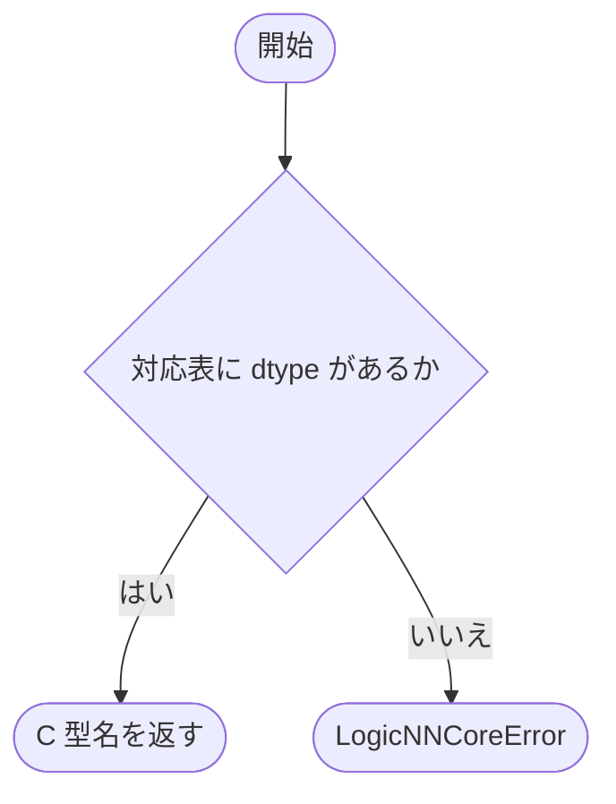

### 戻り値

型：`str`

bool、int64_t、float、double などの C 型名。

### 例外・注意事項

- float16 と bfloat16 を暗黙に float32 に置き換えることはしません。

### ソースコード

<details>
<summary>\_ctype() の実装を開く</summary>

```python
def _ctype(dtype: TensorDType) -> str:
    """対応するC型名を返し、低精度型を暗黙にfloatへ置き換えない。"""
    if dtype not in _C_TYPES:
        _fail(f"C出力で数値型 {dtype.value} の再現は未対応です")
    return _C_TYPES[dtype]
```

</details>

{/* function: _literal@34 */}

## \_literal() {/* #literal */}

```python
def _literal(value: int | float, dtype: TensorDType) -> str:
```

### 機能概要

保存された有限の定数を、指定した型の C 式へ変換します。整数は 64 ビットの下位ビットを保った unsigned 定数を経由し、目的の整数型へ戻します。

### 引数

| 引数 | 型 | 既定値 | 説明 |
|---|---|---|---|
| `value` | `int \| float` | `必須` | 保存された有限の整数または浮動小数点数。 |
| `dtype` | `TensorDType` | `必須` | 生成する定数式の結果型。 |

### 処理の流れ

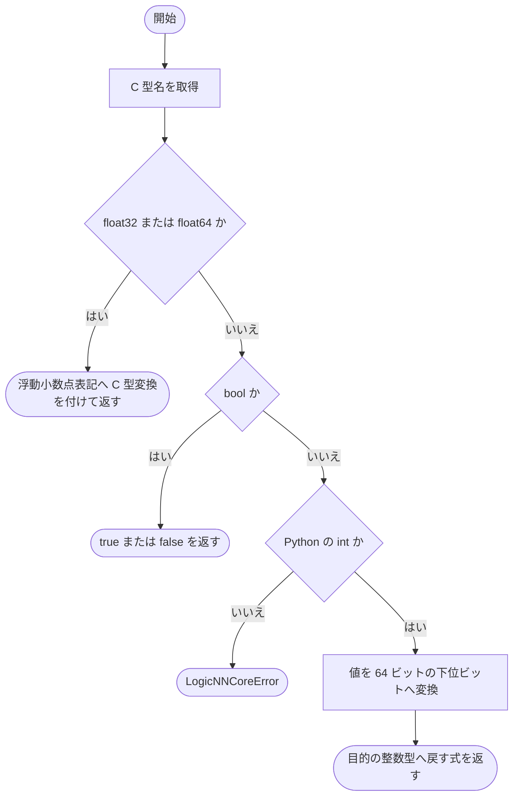

### 戻り値

型：`str`

型変換を含む C 定数式の文字列。

### ソースコード

<details>
<summary>\_literal() の実装を開く</summary>

```python
def _literal(value: int | float, dtype: TensorDType) -> str:
    """有限の保存定数を型付きC式にし、整数の下位bitと浮動小数点の精度を維持する。"""
    name = _ctype(dtype)
    if dtype in _FLOATS:
        literal = repr(float(value))
        return f"(({name})({literal}))"
    if dtype is TensorDType.BOOL:
        return "true" if value else "false"
    if type(value) is not int:
        _fail("整数結果へ小数定数を暗黙に変換するC演算は未対応です")
    return _wrap_integer(f"UINT64_C({value % (1 << 64)})", dtype)
```

</details>

{/* function: _wrap_integer@47 */}

## \_wrap\_integer() {/* #wrap-integer */}

```python
def _wrap_integer(expression: str, dtype: TensorDType) -> str:
```

### 機能概要

unsigned 算術の結果を目的の整数型へ戻す C 式を作ります。符号付き型は専用補助関数で下位ビットを解釈し、C の符号付きオーバーフローを避けます。

### 引数

| 引数 | 型 | 既定値 | 説明 |
|---|---|---|---|
| `expression` | `str` | `必須` | 整数値を計算する C 式。 |
| `dtype` | `TensorDType` | `必須` | 結果の bool、uint8、または符号付き整数型。 |

### 処理の流れ

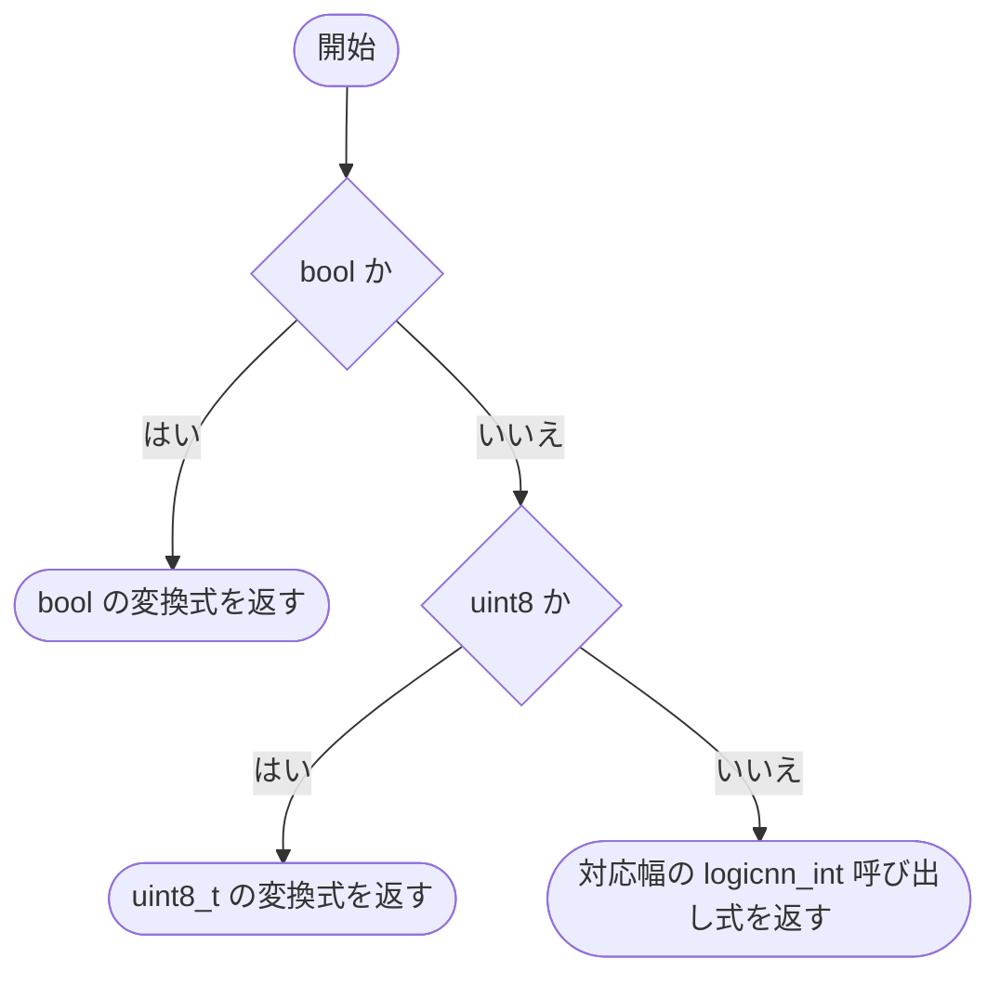

### 戻り値

型：`str`

指定型への変換または logicnn_int 補助関数の呼び出し式。

### ソースコード

<details>
<summary>\_wrap\_integer() の実装を開く</summary>

```python
def _wrap_integer(expression: str, dtype: TensorDType) -> str:
    """unsigned算術の下位bitを、符号付きoverflowなしで保存整数型へ戻す。"""
    if dtype is TensorDType.BOOL:
        return f"((bool)({expression}))"
    if dtype is TensorDType.UINT8:
        return f"((uint8_t)({expression}))"
    return f"logicnn_int{_WIDTHS[dtype]}((uint64_t)({expression}))"
```

</details>

{/* function: _integer_helpers@56 */}

## \_integer\_helpers() {/* #integer-helpers */}

```python
def _integer_helpers() -> list[str]:
```

### 機能概要

uint64_t の下位ビットを 8、16、32、64 ビットの符号付き整数へ安全に変換する C 補助関数を生成します。符号付き範囲を超える直接キャストに頼らず、負数側の値を計算します。

### 引数

指定する引数はありません。

### 処理の流れ

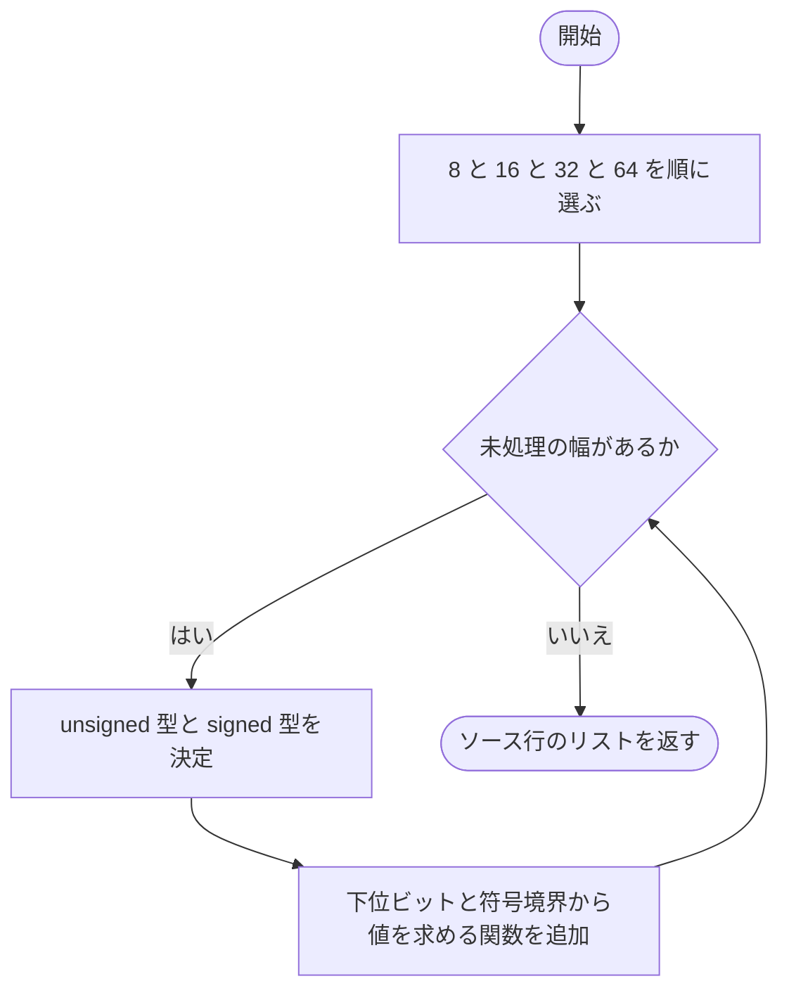

### 戻り値

型：`list[str]`

4 個の logicnn_int 関数定義を構成する C ソース行のリスト。

### ソースコード

<details>
<summary>\_integer\_helpers() の実装を開く</summary>

```python
def _integer_helpers() -> list[str]:
    """unsignedからsignedへの変換を、範囲外のsigned castに依存せず定義する。"""
    lines = []
    for width in (8, 16, 32, 64):
        unsigned = f"uint{width}_t"
        signed   = f"int{width}_t"
        lines.extend([
            f"static {signed} logicnn_int{width}(uint64_t value) {{",
            f"    {unsigned} bits = ({unsigned})value;",
            f"    return bits <= INT{width}_MAX ? ({signed})bits : ({signed})(-1 - ({signed})(({unsigned})~bits));",
            "}",
        ])
    return lines
```

</details>

{/* function: _needed_gates@71 */}

## \_needed\_gates() {/* #needed-gates */}

```python
def _needed_gates(data: CircuitData) -> tuple[dict[int, Gate], Counter[int]]:
```

### 機能概要

通常出力と全 SumReduction の加算入力から依存関係を逆にたどり、C で必要なゲートと参照回数を求めます。加算前の Verilog 出力だけのために残っているゲートは対象にしません。

### 引数

| 引数 | 型 | 既定値 | 説明 |
|---|---|---|---|
| `data` | `CircuitData` | `必須` | C へ変換する CircuitData。 |

### 処理の流れ

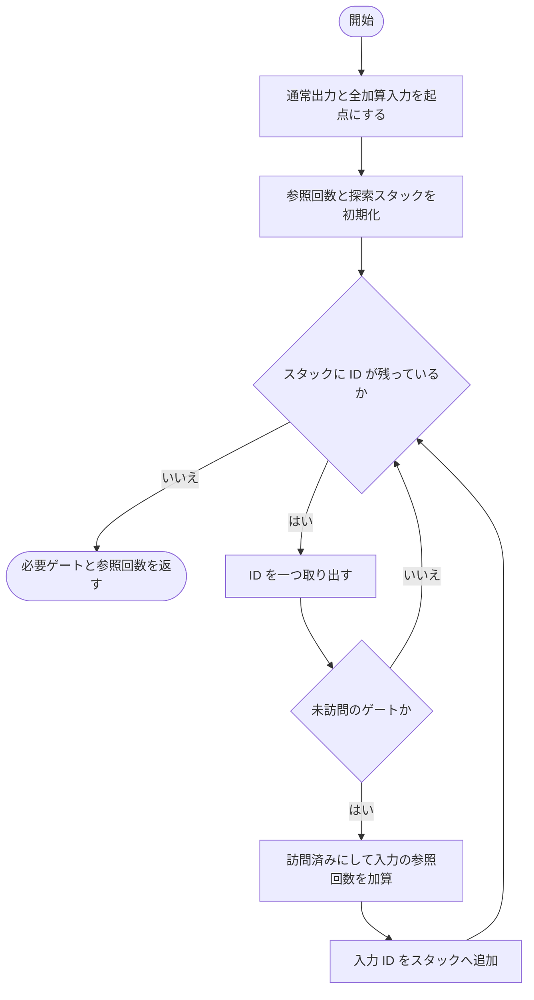

### 戻り値

型：`tuple[dict[int, Gate], Counter[int]]`

必要なゲートの ID 辞書と、出力・加算入力・ゲート入力からの参照回数を持つ Counter。

### 例外・注意事項

- 全 reduction の入力を起点にするため、最終出力に直接使われない reduction が IR に残っている場合も、その入力ゲートを含みます。

### ソースコード

<details>
<summary>\_needed\_gates() の実装を開く</summary>

```python
def _needed_gates(data: CircuitData) -> tuple[dict[int, Gate], Counter[int]]:
    """集約後の出力へ到達するgateと、その実際の利用回数を取得する。"""
    nodes = {gate.output_id: gate for gate in data.gates}
    roots = [*data.output_ids, *(node_id for reduction in data.reductions for node_id in reduction.input_ids)]
    uses  = Counter(roots)
    seen: set[int] = set()
    stack = list(roots)
    while stack:
        node_id = stack.pop()
        if node_id not in nodes or node_id in seen:
            continue
        seen.add(node_id)
        uses.update(nodes[node_id].input_ids)
        stack.extend(nodes[node_id].input_ids)
    return {node_id: gate for node_id, gate in nodes.items() if node_id in seen}, uses
```

</details>

{/* function: _gate_tokens@88 */}

## \_gate\_tokens() {/* #gate-tokens */}

```python
def _gate_tokens(gate: Gate, packed: bool) -> tuple[str | int, ...]:
```

### 機能概要

論理ゲートを、演算記号の文字列と入力 ID の短い列へ分解します。通常の bool 入力では否定に !、ビット詰め入力ではワード全体を反転する ~ を使います。

### 引数

| 引数 | 型 | 既定値 | 説明 |
|---|---|---|---|
| `gate` | `Gate` | `必須` | 式に変換する論理ゲート。 |
| `packed` | `bool` | `必須` | サンプル間のビット詰めを使用するか。 |

### 処理の流れ

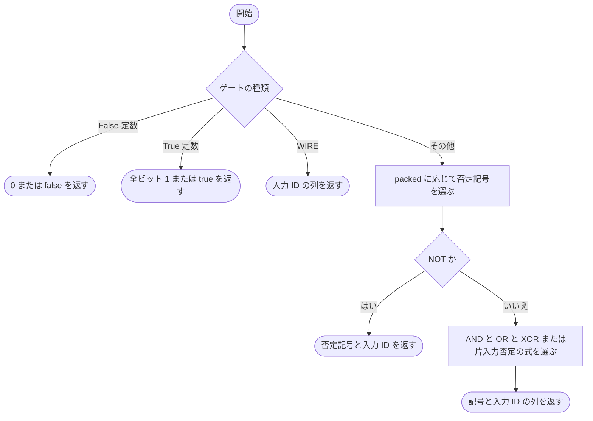

### 戻り値

型：`tuple[str \| int, ...]`

C 式の文字列部分と子の信号 ID を混在させた tuple。

### ソースコード

<details>
<summary>\_gate\_tokens() の実装を開く</summary>

```python
def _gate_tokens(gate: Gate, packed: bool) -> tuple[str | int, ...]:
    """論理gateを子参照と記号の短いtoken列へ分解する。"""
    op = gate.op
    if op is GateOp.CONST_FALSE:
        return ("0" if packed else "false",)
    if op is GateOp.CONST_TRUE:
        return ("~((uint64_t)0)" if packed else "true",)
    a = gate.input_ids[0]
    if op is GateOp.WIRE:
        return (a,)
    inverse = "~" if packed else "!"
    if op is GateOp.NOT:
        return (f"({inverse}(", a, "))")
    b = gate.input_ids[1]
    if op in (GateOp.AND, GateOp.NAND, GateOp.OR, GateOp.NOR, GateOp.XOR, GateOp.XNOR):
        symbol = "&" if op in (GateOp.AND, GateOp.NAND) else "|" if op in (GateOp.OR, GateOp.NOR) else "^"
        prefix = inverse if op in (GateOp.NAND, GateOp.NOR, GateOp.XNOR) else ""
        return (f"({prefix}(", a, f" {symbol} ", b, "))")
    symbol = "&" if op in (GateOp.AND_NOT_A, GateOp.AND_NOT_B) else "|"
    if op in (GateOp.AND_NOT_A, GateOp.OR_NOT_A):
        return (f"(({inverse}(", a, f")) {symbol} ", b, ")")
    return ("(", a, f" {symbol} ({inverse}(", b, ")))")
```

</details>

{/* function: _expression@112 */}

## \_expression() {/* #expression */}

```python
def _expression(node_id: int, nodes: dict[int, Gate], inline: set[int], reference: Callable[[int], str], packed: bool) -> str:
```

### 機能概要

指定した信号の C 式を生成します。展開対象のゲートだけを明示的なスタックでたどり、深いゲート列でも Python の再帰呼び出しや長い中間文字列の繰り返しを避けます。

### 引数

| 引数 | 型 | 既定値 | 説明 |
|---|---|---|---|
| `node_id` | `int` | `必須` | 式を取得する信号 ID。 |
| `nodes` | `dict[int, Gate]` | `必須` | 必要なゲートの ID と Gate の辞書。 |
| `inline` | `set[int]` | `必須` | 利用先の式へ展開するゲート ID の集合。 |
| `reference` | `Callable[[int], str]` | `必須` | 展開しない信号 ID を、入力配列やゲート変数の C 式へ変換する関数。 |
| `packed` | `bool` | `必須` | ビット詰め用の論理記号を使用するか。 |

### 処理の流れ

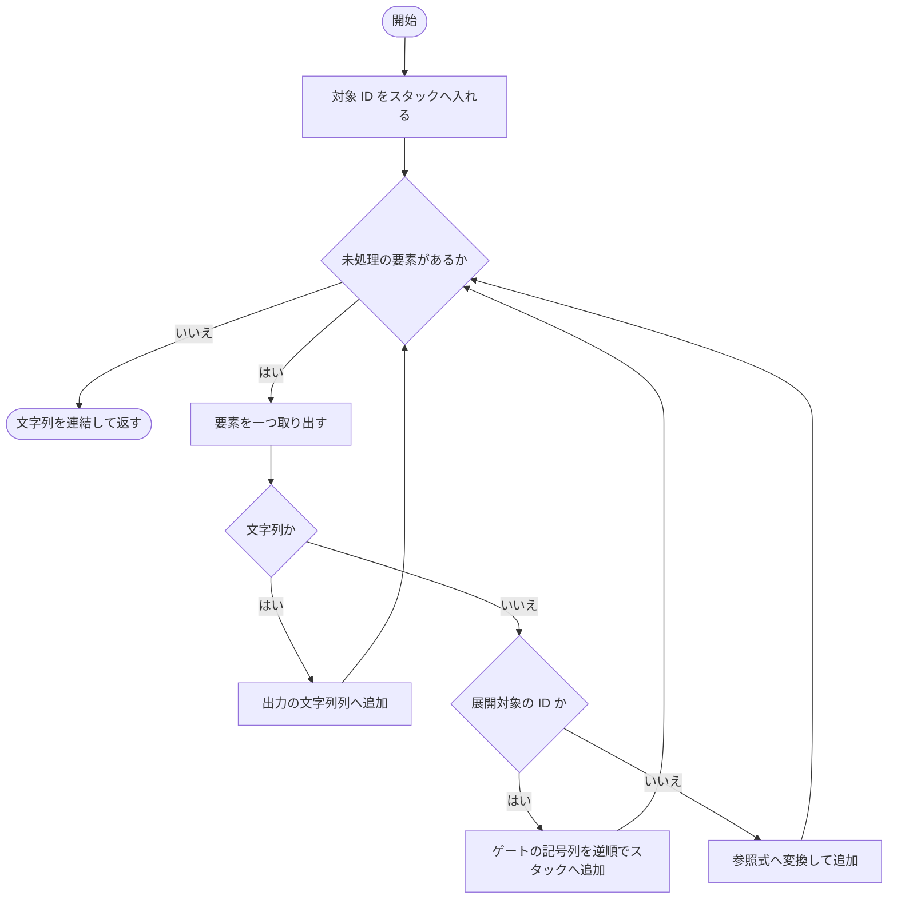

### 戻り値

型：`str`

指定信号を表す C 式の文字列。

### ソースコード

<details>
<summary>\_expression() の実装を開く</summary>

```python
def _expression(node_id: int, nodes: dict[int, Gate], inline: set[int], reference: Callable[[int], str], packed: bool) -> str:
    """inline対象だけを非再帰で展開し、長い単一利用chainの文字列複製を避ける。"""
    tokens: list[str] = []
    pending: list[str | int] = [node_id]
    while pending:
        token = pending.pop()
        if isinstance(token, str):
            tokens.append(token)
        elif token in inline:
            pending.extend(reversed(_gate_tokens(nodes[token], packed)))
        else:
            tokens.append(reference(token))
    return "".join(tokens)
```

</details>

{/* function: _operation_lines@127 */}

## \_operation\_lines() {/* #operation-lines */}

```python
def _operation_lines(source: str, source_dtype: TensorDType, operation: ScalarOperation, target: str) -> list[str]:
```

### 機能概要

数値演算 1 段を、独立した volatile 型付き変数の定義へ変換します。保存された左右の順序と alpha を使い、整数演算は unsigned を経由して結果型へ戻します。

### 引数

| 引数 | 型 | 既定値 | 説明 |
|---|---|---|---|
| `source` | `str` | `必須` | 前段の値を参照する C 式または変数名。 |
| `source_dtype` | `TensorDType` | `必須` | 前段の値の TensorDType。 |
| `operation` | `ScalarOperation` | `必須` | 生成する 1 段の数値演算。 |
| `target` | `str` | `必須` | この段の結果を格納する C 変数名。 |

### 処理の流れ

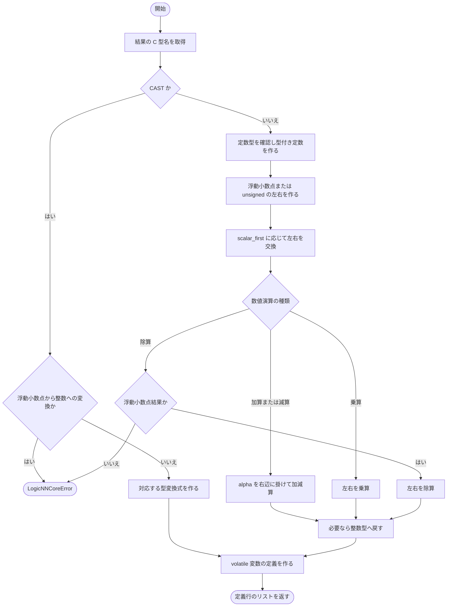

### 戻り値

型：`list[str]`

volatile 変数の定義 1 行を含む文字列リスト。

### 例外・注意事項

- C の対応範囲外の低精度型、浮動小数点から整数への CAST、整数結果の除算などでは LogicNNCoreError になります。

### ソースコード

<details>
<summary>\_operation\_lines() の実装を開く</summary>

```python
def _operation_lines(source: str, source_dtype: TensorDType, operation: ScalarOperation, target: str) -> list[str]:
    """元の数値演算1段を独立したtyped変数へ生成し、式を他段とまとめない。"""
    dtype = operation.output_dtype
    ctype = _ctype(dtype)
    if operation.op is ScalarOp.CAST:
        if source_dtype in _FLOATS and dtype in _WIDTHS:
            _fail("浮動小数点から整数へのcastは、範囲外・NaNの再現が未確認のためCでは未対応です")
        expression = f"(({ctype})({source}))" if dtype in (*_FLOATS, TensorDType.BOOL) else _wrap_integer(source, dtype)
    else:
        constant = operation.operand
        assert constant is not None
        if constant.tensor_dtype is not None:
            _ctype(constant.tensor_dtype)
        if dtype in _FLOATS:
            scalar = _literal(constant.value, constant.tensor_dtype or dtype)
            left   = f"(({ctype})({source}))"
            right  = f"(({ctype})({scalar}))"
            alpha  = _literal(operation.alpha, dtype)
        else:
            scalar = _literal(constant.value, dtype)
            left   = f"((uint64_t)({source}))"
            right  = f"((uint64_t)({scalar}))"
            alpha  = _literal(operation.alpha, dtype)
        if operation.scalar_first:
            left, right = right, left
        if operation.op in (ScalarOp.ADD, ScalarOp.SUB):
            sign = "+" if operation.op is ScalarOp.ADD else "-"
            expression = f"({left} {sign} ({alpha} * {right}))"
        elif operation.op is ScalarOp.MUL:
            expression = f"({left} * {right})"
        else:
            if dtype not in _FLOATS:
                _fail("整数dtypeを結果に指定した除算はCでは未対応です")
            expression = f"({left} / {right})"
        if dtype not in _FLOATS:
            expression = _wrap_integer(expression, dtype)
    return [f"volatile {ctype} {target} = {expression};"]
```

</details>

{/* function: c_source@166 */}

## c\_source() {/* #c-source */}

```python
def c_source(data: CircuitData, *, inline_single_use: bool = False, pack_bits: int | None = None) -> str:
```

### 機能概要

logicnn_evaluate を持つ C11 ソース全体を生成します。必要な論理ゲートを依存順に計算し、各グループのビット和と数値演算を実行して、通常出力をサンプル順に格納します。

### 引数

| 引数 | 型 | 既定値 | 説明 |
|---|---|---|---|
| `data` | `CircuitData` | `必須` | 変換対象の CircuitData。生成開始時に構造を検証します。 |
| `inline_single_use` | `bool` | `False` | 一度だけ参照されるゲートを独立変数にせず、利用先の式へ展開するか。 |
| `pack_bits` | `int \| None` | `None` | None なら bool 配列入力。8、16、32、64 なら対応する uint 型へ複数サンプルをビット詰めした入力。 |

### 処理の流れ

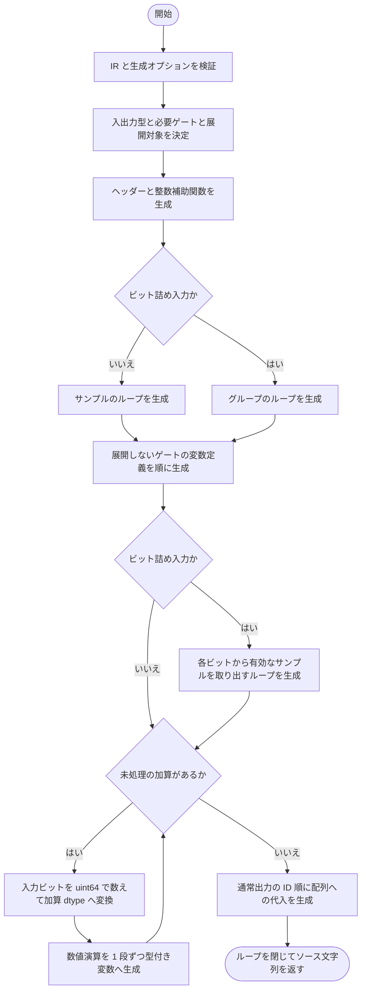

### 戻り値

型：`str`

C のヘッダー、整数補助関数、公開関数 logicnn_evaluate を含むソース文字列。

### 例外・注意事項

- 生成した C は入力の二値性を検証・変換しません。利用者が二値化済みの配列を渡します。
- ビット詰め入力はグループ順・特徴順で、ビット 0 が先頭サンプルです。出力は常に非ビット詰めのサンプル順です。
- 型付きの演算段を維持しますが、異なる処理系の浮動小数点結果の厳密なビット一致を保証するものではありません。

### ソースコード

<details>
<summary>c\_source() の実装を開く</summary>

```python
def c_source(data: CircuitData, *, inline_single_use: bool = False, pack_bits: int | None = None) -> str:
    """boolまたはsample間packed入力と、非packedの集約後出力を持つC関数を生成する。"""
    validate_circuit(data)
    if type(inline_single_use) is not bool:
        _fail("inline_single_useはboolで指定してください")
    if pack_bits is not None and (type(pack_bits) is not int or pack_bits not in (8, 16, 32, 64)):
        _fail("pack_bitsはNoneまたは8／16／32／64で指定してください")
    output_type = _ctype(data.output_dtype)
    input_count = math.prod(data.input_shape)
    output_count = math.prod(data.output_shape)
    word_type   = "bool" if pack_bits is None else f"uint{pack_bits}_t"
    nodes, uses = _needed_gates(data)
    inline      = {node_id for node_id in nodes if inline_single_use and uses[node_id] == 1}

    def reference(node_id: int) -> str:
        """入力とgateを、生成関数の局所的で衝突しない識別子へ対応付ける。"""
        return f"inputs[input_offset + {node_id}]" if node_id < input_count else f"gate_{node_id}"

    def signal(node_id: int) -> str:
        """必要なinlineだけを展開した論理値式を返す。"""
        return _expression(node_id, nodes, inline, reference, pack_bits is not None)

    def bit(node_id: int) -> str:
        """論理wordから現在sampleの1bitを取り出す。"""
        expression = signal(node_id)
        return expression if pack_bits is None else f"(((uint64_t)({expression}) >> bit_index) & UINT64_C(1))"

    lines = [
        "/* Generated by logicNN-core. Input values must already be binary. */",
        f"/* Input features: {input_count}; output values per sample: {output_count}. */",
        "/* Outputs are unpacked, sample-major. Packed inputs are group-major then feature-major; bit 0 is the first sample. */",
        "#include <stdbool.h>", "#include <stddef.h>", "#include <stdint.h>",
        "#if defined(_WIN32)", "#define LOGICNN_API __declspec(dllexport)", "#else", "#define LOGICNN_API", "#endif",
        *_integer_helpers(),
        f"LOGICNN_API void logicnn_evaluate(const {word_type} *inputs, {output_type} *outputs, size_t samples) {{",
    ]
    if pack_bits is None:
        lines.extend(["    for (size_t sample = 0; sample < samples; ++sample) {", f"        size_t input_offset = sample * {input_count};"])
    else:
        lines.extend([
            f"    for (size_t group = 0; group < samples / {pack_bits} + (samples % {pack_bits} != 0); ++group) {{",
            f"        size_t input_offset = group * {input_count};",
        ])
    for node_id, gate in nodes.items():
        if node_id not in inline:
            expression = _expression(node_id, nodes, inline | {node_id}, reference, pack_bits is not None)
            lines.append(f"        {word_type} gate_{node_id} = ({word_type})({expression});")
    indent = "        "
    if pack_bits is not None:
        lines.extend([
            f"        for (size_t bit_index = 0; bit_index < {pack_bits}; ++bit_index) {{",
            f"            size_t sample = group * {pack_bits} + bit_index;",
            "            if (sample >= samples) break;",
        ])
        indent = "            "
    scores: dict[int, str] = {}
    for reduction in data.reductions:
        dtype = reduction.dtype
        ctype = _ctype(dtype)
        count = f"count_{reduction.output_id}"
        lines.append(f"{indent}uint64_t {count} = 0;")
        for node_id in reduction.input_ids:
            lines.append(f"{indent}{count} += (uint64_t)({bit(node_id)});")
        source = f"value_{reduction.output_id}_0"
        lines.append(f"{indent}{ctype} {source} = ({ctype}){count};")
        for index, operation in enumerate(reduction.operations, start=1):
            target = f"value_{reduction.output_id}_{index}"
            lines.extend(indent + line for line in _operation_lines(source, dtype, operation, target))
            source, dtype = target, operation.output_dtype
        scores[reduction.output_id] = source
    for index, node_id in enumerate(data.output_ids):
        expression = scores[node_id] if node_id in scores else bit(node_id)
        lines.append(f"{indent}outputs[sample * {output_count} + {index}] = ({output_type})({expression});")
    if pack_bits is not None:
        lines.append("        }")
    lines.extend(["    }", "}", ""])
    return "\n".join(lines)
```

</details>

{/* function: c_source.reference@180 */}

## c\_source.reference() {/* #c-source-reference */}

```python
def reference(node_id: int) -> str:
```

### 機能概要

生成中の C 関数内で信号 ID を参照する名前を作ります。入力 ID には input_offset 付きの配列参照、ゲート ID には gate_ で始まる変数名を使います。

### 引数

| 引数 | 型 | 既定値 | 説明 |
|---|---|---|---|
| `node_id` | `int` | `必須` | 参照する入力またはゲートの ID。 |

### 処理の流れ

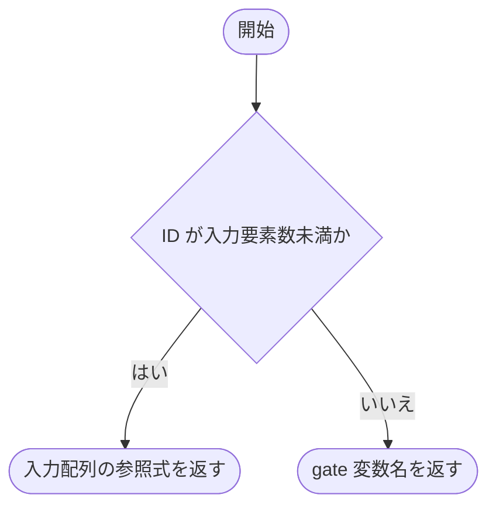

### 戻り値

型：`str`

入力配列の要素式、またはゲート変数名。

### 例外・注意事項

- c_source 内の input_count を参照するネスト関数です。

### ソースコード

<details>
<summary>c\_source.reference() の実装を開く</summary>

```python
def reference(node_id: int) -> str:
    """入力とgateを、生成関数の局所的で衝突しない識別子へ対応付ける。"""
    return f"inputs[input_offset + {node_id}]" if node_id < input_count else f"gate_{node_id}"
```

</details>

{/* function: c_source.signal@184 */}

## c\_source.signal() {/* #c-source-signal */}

```python
def signal(node_id: int) -> str:
```

### 機能概要

現在の C 生成設定に従い、必要な単一利用ゲートだけを展開した信号式を作ります。

### 引数

| 引数 | 型 | 既定値 | 説明 |
|---|---|---|---|
| `node_id` | `int` | `必須` | C 式を取得する信号 ID。 |

### 処理の流れ

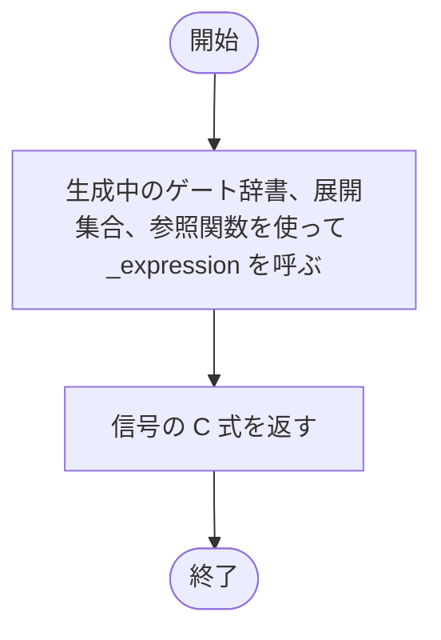

### 戻り値

型：`str`

通常の bool、またはビット詰めワードを表す C 式。

### 例外・注意事項

- c_source の生成状態を参照するネスト関数です。

### ソースコード

<details>
<summary>c\_source.signal() の実装を開く</summary>

```python
def signal(node_id: int) -> str:
    """必要なinlineだけを展開した論理値式を返す。"""
    return _expression(node_id, nodes, inline, reference, pack_bits is not None)
```

</details>

{/* function: c_source.bit@188 */}

## c\_source.bit() {/* #c-source-bit */}

```python
def bit(node_id: int) -> str:
```

### 機能概要

信号式から、現在評価しているサンプルの 1 ビットを取り出す C 式を作ります。ビット詰めをしない場合は信号式をそのまま返します。

### 引数

| 引数 | 型 | 既定値 | 説明 |
|---|---|---|---|
| `node_id` | `int` | `必須` | 対象ビットを持つ信号 ID。 |

### 処理の流れ

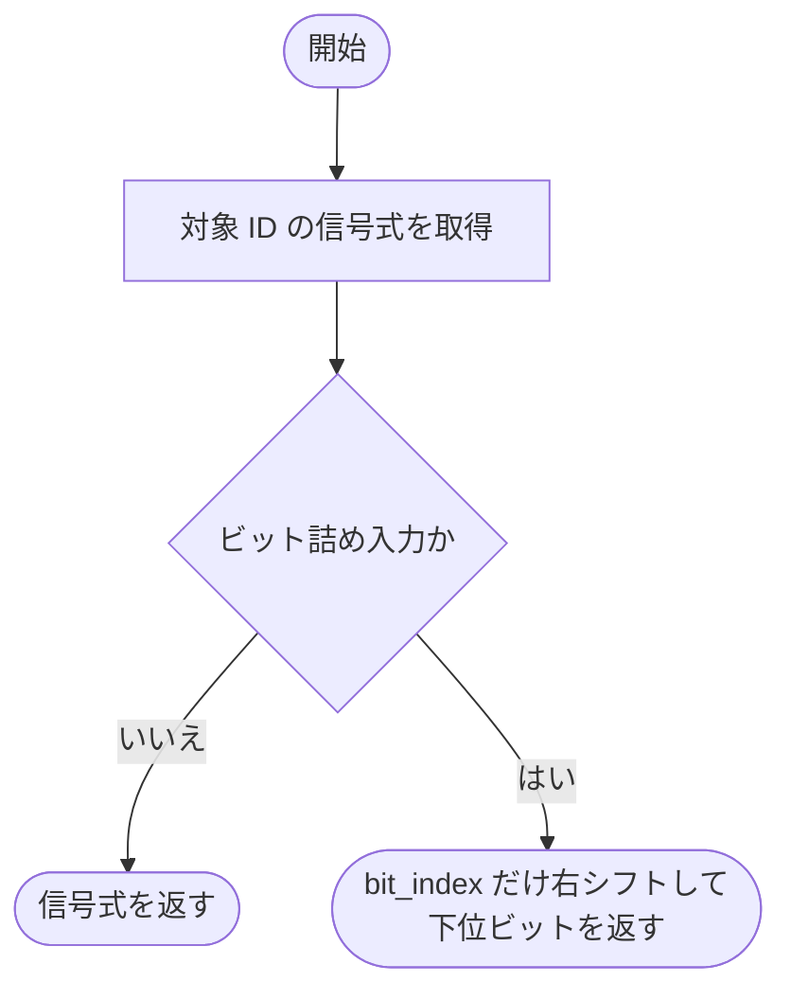

### 戻り値

型：`str`

現在のサンプルに対応する 0 または 1 の C 式。

### 例外・注意事項

- bit_index は生成される C 関数内のループ変数であり、Python 関数の引数ではありません。

### ソースコード

<details>
<summary>c\_source.bit() の実装を開く</summary>

```python
def bit(node_id: int) -> str:
    """論理wordから現在sampleの1bitを取り出す。"""
    expression = signal(node_id)
    return expression if pack_bits is None else f"(((uint64_t)({expression}) >> bit_index) & UINT64_C(1))"
```

</details>

## 関連ファイル

- [utils/logicNN_core/src/logicnn_core/circuit/types.py](/code-reference/utils/logicNN_core/src/logicnn_core/circuit/types)
- [utils/logicNN_core/src/logicnn_core/circuit/validation.py](/code-reference/utils/logicNN_core/src/logicnn_core/circuit/validation)
- [utils/logicNN_core/src/logicnn_core/exceptions.py](/code-reference/utils/logicNN_core/src/logicnn_core/exceptions)
