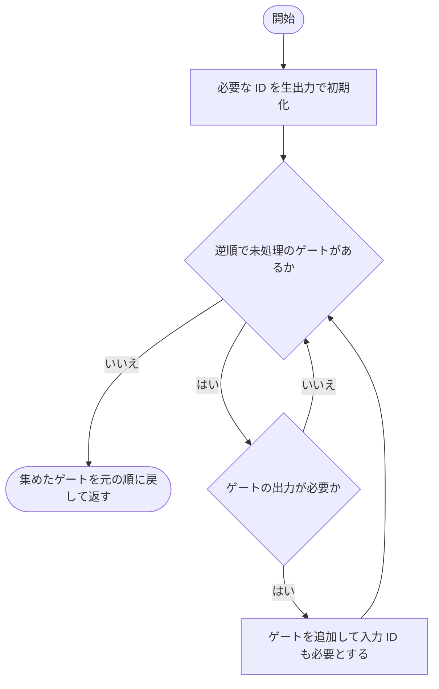
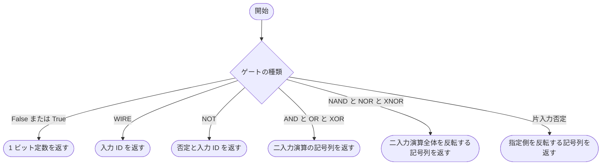
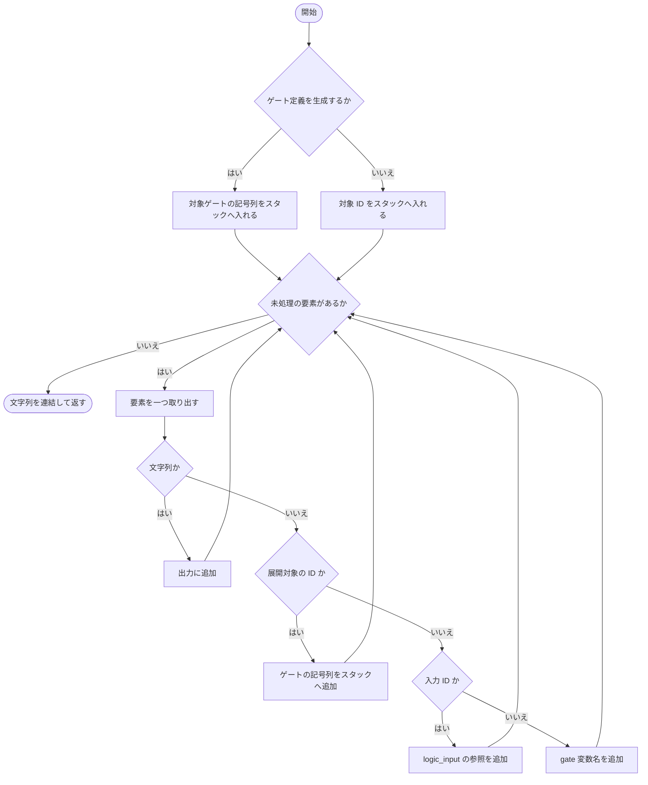
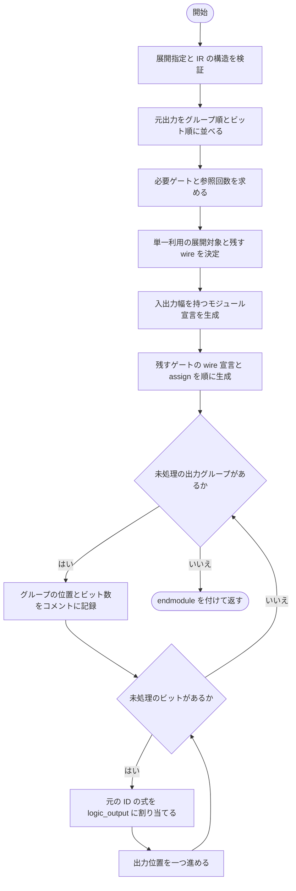

# verilog.py

`utils/logicNN_core/src/logicnn_core/circuit/exporters/verilog.py`

回路から加算前の元ビット列だけを取り出し、組合せ回路の Verilog を生成します。二値化は入力前に行う前提です。加算器・数値スコア・クロック・レジスタは生成せず、元の出力順、定数、重複を維持します。

{/* source-sha256: ffe650d722c20f7d2e0bc3f734b95f89fc0abc9b5a5167f000163695eb556e84 */}

{/* function: _needed_gates@13 */}

## \_needed\_gates() {/* #needed-gates */}

```python
def _needed_gates(data: CircuitData, outputs: list[int]) -> list[Gate]:
```

### 機能概要

指定された生出力からゲートを逆順にたどり、必要な依存ゲートだけを集めます。結果は元の依存順に戻して返します。

### 引数

| 引数 | 型 | 既定値 | 説明 |
|---|---|---|---|
| `data` | `CircuitData` | `必須` | 依存順に並んだゲートを持つ CircuitData。 |
| `outputs` | `list[int]` | `必須` | Verilog へ出力する元ビットの信号 ID の列。 |

### 処理の流れ



### 戻り値

型：`list[Gate]`

生出力の計算に必要な Gate のリスト。入力が先、利用先が後の順です。

### 例外・注意事項

- 集約後の数値出力や数値演算は探索の起点にしません。

### ソースコード

<details>
<summary>\_needed\_gates() の実装を開く</summary>

```python
def _needed_gates(data: CircuitData, outputs: list[int]) -> list[Gate]:
    """生出力だけをrootとして依存gateを収集し、元の依存順で返す。"""
    needed = set(outputs)
    gates  = []
    for gate in reversed(data.gates):
        if gate.output_id in needed:
            gates.append(gate)
            needed.update(gate.input_ids)
    return list(reversed(gates))
```

</details>

{/* function: _parts@24 */}

## \_parts() {/* #parts */}

```python
def _parts(gate: Gate) -> tuple[str | int, ...]:
```

### 機能概要

一つの論理ゲートを、Verilog の演算記号と子の信号 ID の列へ変換します。定数は 1 ビットリテラル、反転は ~、二入力演算は &、|、^ を使います。

### 引数

| 引数 | 型 | 既定値 | 説明 |
|---|---|---|---|
| `gate` | `Gate` | `必須` | Verilog 式へ変換する Gate。 |

### 処理の流れ



### 戻り値

型：`tuple[str \| int, ...]`

記号の文字列と入力 ID が混在する tuple。

### ソースコード

<details>
<summary>\_parts() の実装を開く</summary>

```python
def _parts(gate: Gate) -> tuple[str | int, ...]:
    """1個のgateをbitwise演算記号と入力IDの短い列へ変換する。"""
    op = gate.op
    if op is GateOp.CONST_FALSE:
        return ("1'b0",)
    if op is GateOp.CONST_TRUE:
        return ("1'b1",)
    a = gate.input_ids[0]
    if op is GateOp.WIRE:
        return (a,)
    if op is GateOp.NOT:
        return "~(", a, ")"
    b = gate.input_ids[1]
    if op in (GateOp.AND, GateOp.OR, GateOp.XOR):
        operator = {GateOp.AND: " & ", GateOp.OR: " | ", GateOp.XOR: " ^ "}[op]
        return "(", a, operator, b, ")"
    if op in (GateOp.NAND, GateOp.NOR, GateOp.XNOR):
        operator = {GateOp.NAND: " & ", GateOp.NOR: " | ", GateOp.XNOR: " ^ "}[op]
        return "~(", a, operator, b, ")"
    if op is GateOp.AND_NOT_B:
        return "(", a, " & ~(", b, "))"
    if op is GateOp.AND_NOT_A:
        return "(~(", a, ") & ", b, ")"
    if op is GateOp.OR_NOT_B:
        return "(", a, " | ~(", b, "))"
    return "(~(", a, ") | ", b, ")"
```

</details>

{/* function: _expression@52 */}

## \_expression() {/* #expression */}

```python
def _expression(root: int, gates: dict[int, Gate], inline: set[int], input_count: int, *, definition: bool = False) -> str:
```

### 機能概要

信号 ID を Verilog 式へ変換します。単一利用ゲートの展開をスタックで処理し、定義を生成するときは対象ゲート自身の演算から書き始めます。

### 引数

| 引数 | 型 | 既定値 | 説明 |
|---|---|---|---|
| `root` | `int` | `必須` | 参照または定義を生成する信号 ID。 |
| `gates` | `dict[int, Gate]` | `必須` | 必要ゲートの ID と Gate の辞書。 |
| `inline` | `set[int]` | `必須` | 利用先へ展開するゲート ID の集合。 |
| `input_count` | `int` | `必須` | 回路の入力ビット数。入力 ID とゲート ID の区別に使います。 |
| `definition` | `bool` | `False` | True なら root 自身のゲート定義を展開し、False なら root の参照式から始めます。 |

### 処理の流れ



### 戻り値

型：`str`

logic_input の参照、gate 変数、または展開した論理式の文字列。

### ソースコード

<details>
<summary>\_expression() の実装を開く</summary>

```python
def _expression(root: int, gates: dict[int, Gate], inline: set[int], input_count: int, *, definition: bool = False) -> str:
    """単一利用gateだけを明示stackで展開し、深い鎖でも再帰と中間文字列複製を避ける。"""
    stack: list[str | int] = list(reversed(_parts(gates[root]))) if definition else [root]
    text: list[str] = []
    while stack:
        part = stack.pop()
        if isinstance(part, str):
            text.append(part)
        elif part in inline:
            stack.extend(reversed(_parts(gates[part])))
        elif part < input_count:
            text.append(f"logic_input[{part}]")
        else:
            text.append(f"gate_{part}")
    return "".join(text)
```

</details>

{/* function: verilog_source@69 */}

## verilog\_source() {/* #verilog-source */}

```python
def verilog_source(data: CircuitData, *, inline_single_use: bool = False) -> str:
```

### 機能概要

保存された元出力対応に従い、logicnn_circuit モジュール全体を生成します。必要なゲートの wire と assign を作り、最後に各グループの生ビットを元の順序で logic_output へ割り当てます。

### 引数

| 引数 | 型 | 既定値 | 説明 |
|---|---|---|---|
| `data` | `CircuitData` | `必須` | 元出力対応を持つ CircuitData。 |
| `inline_single_use` | `bool` | `False` | 一度だけ使うゲートを wire にせず、利用先の式へ展開するか。 |

### 処理の流れ



### 戻り値

型：`str`

二値入力と生ビット出力を持つ組合せ Verilog のソース文字列。

### 例外・注意事項

- 入力と生出力の添字は行優先で一次元化した位置に対応します。出力の定数や重複は削除しません。
- 回路は加算前の AI モデル部分のみです。クラスごとの加算器やパイプラインレジスタは含みません。

### ソースコード

<details>
<summary>verilog\_source() の実装を開く</summary>

```python
def verilog_source(data: CircuitData, *, inline_single_use: bool = False) -> str:
    """検証済みの元出力対応から、位置と重複を維持した組合せVerilog sourceを返す。"""
    if type(inline_single_use) is not bool:
        raise LogicNNCoreError(
            "inline_single_useはboolで指定してください", detail=f"Verilog生成: inline_single_use={inline_single_use!r}",
            hint="単一利用gateの展開にはTrue、明示wireによる出力にはFalseを指定してください",
        )
    validate_circuit(data)
    input_count = math.prod(data.input_shape)
    outputs     = [node_id for group in data.logical_outputs for node_id in group.node_ids]
    gates       = _needed_gates(data, outputs)
    uses        = Counter(outputs)
    for gate in gates:
        uses.update(gate.input_ids)
    inline = {gate.output_id for gate in gates if inline_single_use and uses[gate.output_id] == 1}
    lookup = {gate.output_id: gate for gate in gates}
    wires  = [gate for gate in gates if gate.output_id not in inline]
    lines  = [
        "// logicNN_core: combinational logic with already-binarized inputs.",
        "// Input and raw output index i refer to row-major flattened position i.",
        f"// input_shape={data.input_shape}; raw_output_count={len(outputs)}",
        "module logicnn_circuit (", f"    input wire [{input_count - 1}:0] logic_input,",
        f"    output wire [{len(outputs) - 1}:0] logic_output", ");", "",
    ]
    lines.extend(f"    wire gate_{gate.output_id};" for gate in wires)
    if wires:
        lines.append("")
    for gate in wires:
        expression = _expression(gate.output_id, lookup, inline, input_count, definition=True)
        lines.append(f"    assign gate_{gate.output_id} = {expression};")
    if wires:
        lines.append("")
    offset = 0
    for index, group in enumerate(data.logical_outputs):
        lines.append(f"    // group {index}: offset={offset}, count={len(group.node_ids)}")
        for node_id in group.node_ids:
            expression = _expression(node_id, lookup, inline, input_count)
            lines.append(f"    assign logic_output[{offset}] = {expression};")
            offset += 1
    lines.extend(["endmodule", ""])
    return "\n".join(lines)
```

</details>

## 関連ファイル

- [utils/logicNN_core/src/logicnn_core/circuit/types.py](/code-reference/utils/logicNN_core/src/logicnn_core/circuit/types)
- [utils/logicNN_core/src/logicnn_core/circuit/validation.py](/code-reference/utils/logicNN_core/src/logicnn_core/circuit/validation)
- [utils/logicNN_core/src/logicnn_core/exceptions.py](/code-reference/utils/logicNN_core/src/logicnn_core/exceptions)
