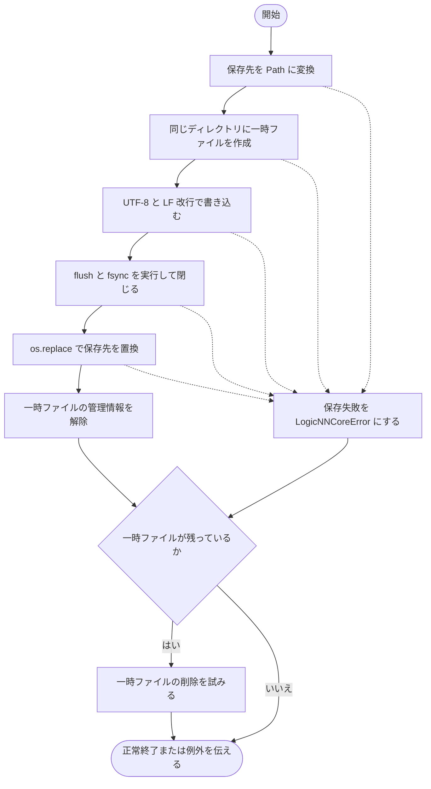

# writing.py

`utils/logicNN_core/src/logicnn_core/circuit/exporters/writing.py`

生成が完了した C・Verilog のソースを保存する共通処理です。保存先と同じディレクトリに一時ファイルを作成し、内容の書き込み後に保存先を置き換えます。

{/* source-sha256: 68ccb7998d05336de530a5b9a7565f374b372f0ac312fe2b9c3a834740380875 */}

{/* function: write_source@12 */}

## write\_source() {/* #write-source */}

```python
def write_source(source: str, path: str | Path) -> None:
```

### 機能概要

ソース全体を UTF-8・LF 改行で一時ファイルへ保存し、flush と fsync が終わってから保存先へ置き換えます。置換前に失敗した場合は既存の保存先を変更せず、一時ファイルを片付けます。

### 引数

| 引数 | 型 | 既定値 | 説明 |
|---|---|---|---|
| `source` | `str` | `必須` | 生成が完了したソース文字列。 |
| `path` | `str \| Path` | `必須` | 保存先のパス。親ディレクトリは事前に存在する必要があります。 |

### 処理の流れ



### 戻り値

型：`None`

成功時は None。保存できない場合は LogicNNCoreError。

### 状態の変更・ファイル出力

- 保存先のファイルを新規作成または置換します。同じディレクトリに一時ファイルを作成し、失敗時は削除を試みます。

### 例外・注意事項

- OSError、UnicodeError、ValueError、TypeError を保存先情報付きの LogicNNCoreError にします。一時ファイルの削除で発生した OSError は追加で送出しません。
- 保存先の親ディレクトリは自動作成しません。

### ソースコード

<details>
<summary>write\_source() の実装を開く</summary>

```python
def write_source(source: str, path: str | Path) -> None:
    """同じdirectoryの一時fileを置換し、失敗時は既存sourceを変更しない。"""
    temporary = None
    try:
        destination = Path(path)
        with tempfile.NamedTemporaryFile(
            "w", encoding="utf-8", newline="\n", dir=destination.parent, prefix=f".{destination.name}.", suffix=".tmp", delete=False,
        ) as file:
            temporary = file.name
            file.write(source)
            file.flush()
            os.fsync(file.fileno())
        os.replace(temporary, destination)
        temporary = None
    except (OSError, UnicodeError, ValueError, TypeError) as error:
        raise LogicNNCoreError(
            f"回路sourceの保存に失敗しました: {path}", detail=f"{type(error).__name__}: {error}",
            hint="親directoryと書込み権限を確認してください。既存fileは置換成功前には変更されません",
        ) from error
    finally:
        if temporary is not None:
            try:
                os.unlink(temporary)
            except OSError:
                pass
```

</details>

## 関連ファイル

- [utils/logicNN_core/src/logicnn_core/exceptions.py](/code-reference/utils/logicNN_core/src/logicnn_core/exceptions)
