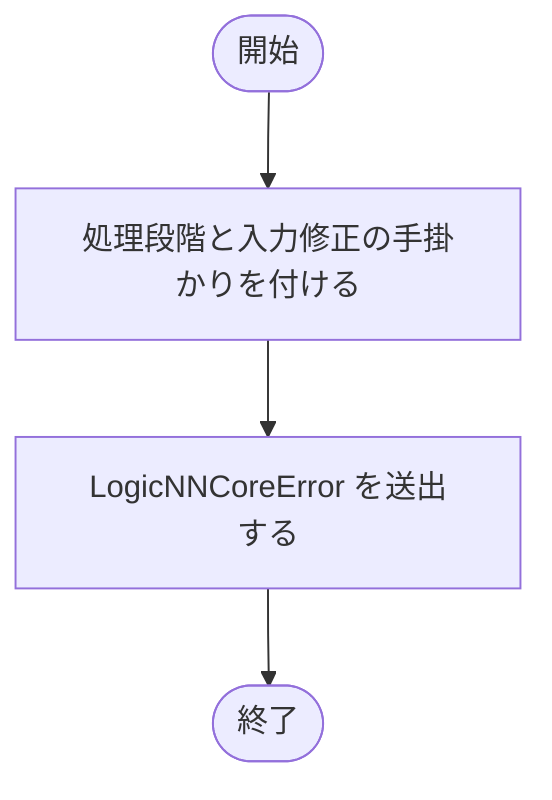
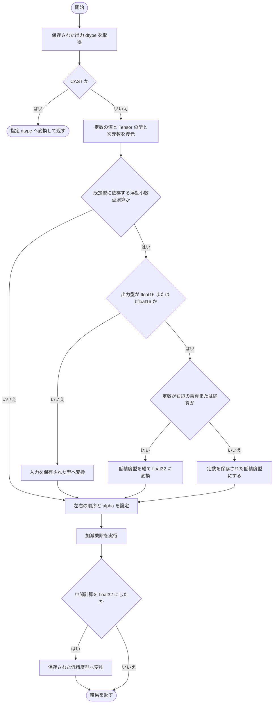
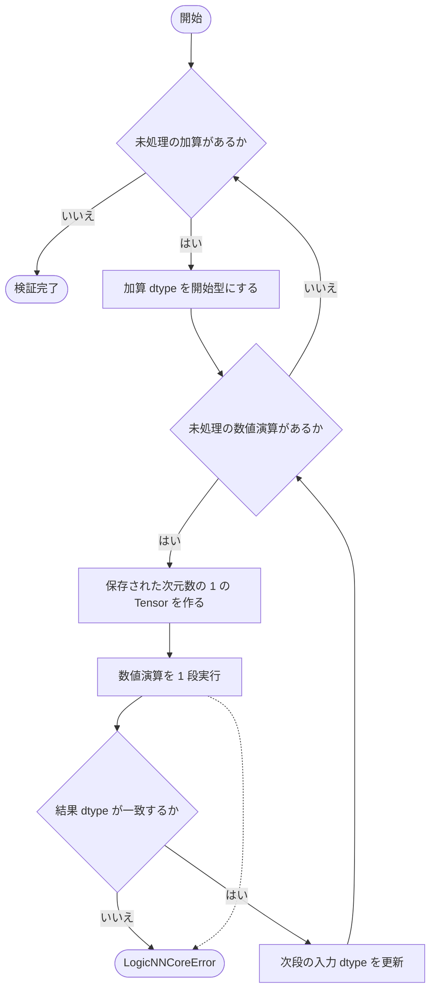
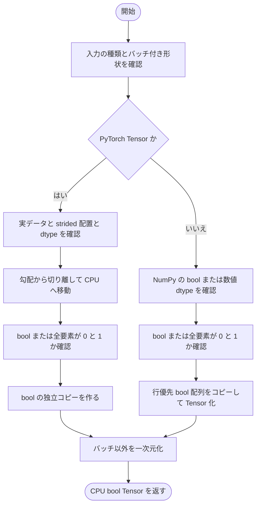
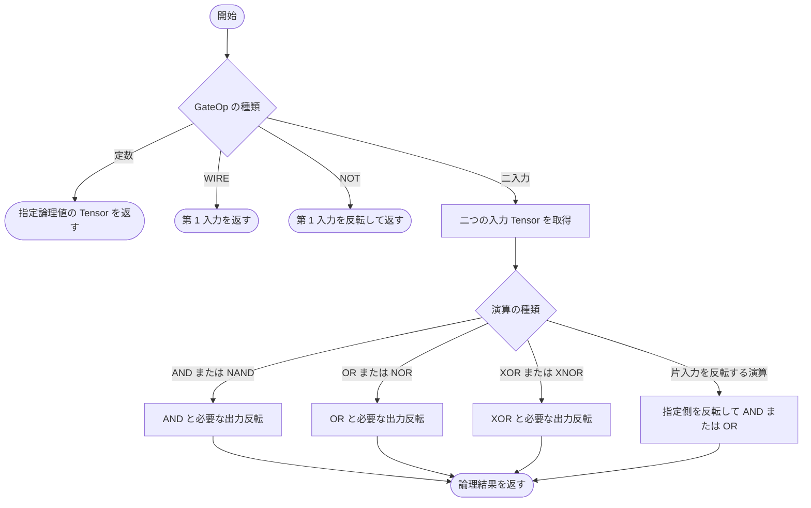
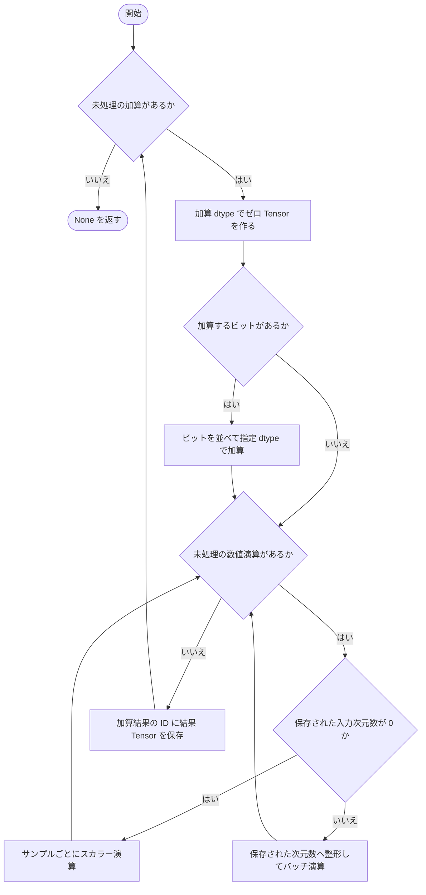
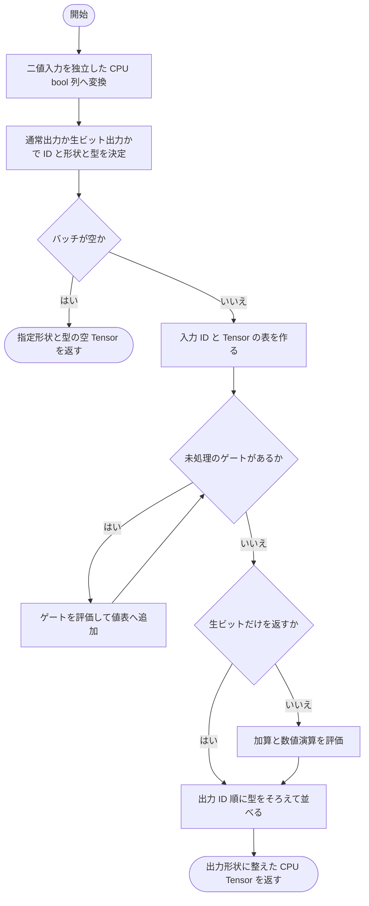

# runtime.py

`utils/logicNN_core/src/logicnn_core/circuit/runtime.py`

回路の中間表現を CPU 上の PyTorch 演算で評価します。二値入力を論理ゲートへ流した後、必要ならビットの加算と保存済みの数値演算を実行します。通常の出力と、Verilog に対応する加算前のビット列を選択できます。

{/* source-sha256: a84e46b36236a2d3cbd1b2fd42a9e33c453290ef34f7766b3ca9157b5743dece */}

{/* function: _fail@19 */}

## \_fail() {/* #fail */}

```python
def _fail(stage: str, message: str) -> NoReturn:
```

### 機能概要

回路実行で失敗した処理段階と、入力・数値型を確認するための説明を添えて LogicNNCoreError を送出します。

### 引数

| 引数 | 型 | 既定値 | 説明 |
|---|---|---|---|
| `stage` | `str` | `必須` | 入力検証や数値演算など、失敗した段階。 |
| `message` | `str` | `必須` | 利用者へ示すエラー内容。 |

### 処理の流れ



### 戻り値

型：`NoReturn`

正常には戻りません。

### ソースコード

<details>
<summary>\_fail() の実装を開く</summary>

```python
def _fail(stage: str, message: str) -> NoReturn:
    """失敗した回路処理と入力・IRの修正方針を共通例外で報告する。"""
    raise LogicNNCoreError(message, detail=f"回路実行: {stage}", hint="保存した演算のdtypeと、batch付きの厳密な0／1入力を確認してください")
```

</details>

{/* function: _apply_operation@24 */}

## \_apply\_operation() {/* #apply-operation */}

```python
def _apply_operation(source: Tensor, operation: ScalarOperation) -> Tensor:
```

### 機能概要

保存済みの型変換またはスカラー演算を 1 段実行します。定数の型と次元数、演算の左右、alpha を復元し、PyTorch の既定浮動小数点型に依存する場合は保存された結果型に合わせます。

### 引数

| 引数 | 型 | 既定値 | 説明 |
|---|---|---|---|
| `source` | `Tensor` | `必須` | 加算結果または前段の数値演算結果の CPU Tensor。 |
| `operation` | `ScalarOperation` | `必須` | 実行する ScalarOperation。 |

### 処理の流れ



### 戻り値

型：`Tensor`

その 1 段の演算結果の Tensor。

### 例外・注意事項

- CAST 以外の演算には operand が存在することを前提とします。各段を順番に実行し、演算列を係数へ統合しません。

### ソースコード

<details>
<summary>\_apply\_operation() の実装を開く</summary>

```python
def _apply_operation(source: Tensor, operation: ScalarOperation) -> Tensor:
    """1段の型・左右・alphaを保ち、既定dtype依存だけ明示型へ置き換えて計算する。"""
    dtype = _DTYPES[operation.output_dtype]
    if operation.op is ScalarOp.CAST:
        return source.to(dtype=dtype)
    constant = operation.operand
    assert constant is not None
    scalar: Tensor | int | float = constant.value
    if constant.tensor_dtype is not None:
        scalar = torch.tensor(scalar, dtype=_DTYPES[constant.tensor_dtype], device="cpu").reshape((1,) * constant.tensor_ndim)
    scalar_float = scalar.is_floating_point() if isinstance(scalar, Tensor) else isinstance(scalar, float)
    default_dependent = not source.is_floating_point() and (
        (constant.tensor_dtype is None and scalar_float) or (operation.op is ScalarOp.DIV and not scalar_float)
    )
    cast_result = False
    if default_dependent and dtype.is_floating_point:
        if dtype in (torch.float16, torch.bfloat16):
            if not operation.scalar_first and operation.op in (ScalarOp.MUL, ScalarOp.DIV):
                source      = source.to(dtype=dtype).to(dtype=torch.float32)
                cast_result = True
            else:
                scalar = torch.tensor(constant.value, dtype=dtype, device="cpu").reshape((1,) * constant.tensor_ndim)
        else:
            source = source.to(dtype=dtype)
    left, right = (scalar, source) if operation.scalar_first else (source, scalar)
    kwargs      = {"alpha": operation.alpha} if operation.op in (ScalarOp.ADD, ScalarOp.SUB) else {}
    result      = _ARITHMETIC[operation.op](left, right, **kwargs)
    if cast_result:
        result = result.to(dtype=dtype)
    return result
```

</details>

{/* function: validate_numeric_operations@56 */}

## validate\_numeric\_operations() {/* #validate-numeric-operations */}

```python
def validate_numeric_operations(data: CircuitData) -> None:
```

### 機能概要

各 SumReduction の数値演算を小さな代表 Tensor で実行し、結果の dtype が保存済みの dtype と一致するかを確認します。実際の入力データや IR は変更しません。

### 引数

| 引数 | 型 | 既定値 | 説明 |
|---|---|---|---|
| `data` | `CircuitData` | `必須` | 構造を検証済みの CircuitData。 |

### 処理の流れ



### 戻り値

型：`None`

検証が成功すれば None。実行不可または dtype の不一致では LogicNNCoreError。

### 例外・注意事項

- 代表値による検証であり、すべての入力値に対する数値結果の検証ではありません。

### ソースコード

<details>
<summary>validate\_numeric\_operations() の実装を開く</summary>

```python
def validate_numeric_operations(data: CircuitData) -> None:
    """構造検証済みIRの各数値型が実行可能か、値を変えず代表Tensorで確認する。"""
    for reduction in data.reductions:
        dtype = _DTYPES[reduction.dtype]
        for index, operation in enumerate(reduction.operations):
            try:
                sample   = torch.ones((1,) * operation.input_ndim, dtype=dtype, device="cpu")
                result   = _apply_operation(sample, operation)
                expected = _DTYPES[operation.output_dtype]
                if result.dtype != expected:
                    _fail(operation.op.value, f"保存dtype={expected}と演算結果dtype={result.dtype}が一致しません")
            except LogicNNCoreError:
                raise
            except (RuntimeError, TypeError, ValueError, OverflowError) as error:
                _fail(f"node={reduction.output_id}, operation={index}", f"数値演算を実行できません: {error}")
            dtype = _DTYPES[operation.output_dtype]
```

</details>

{/* function: _binary_inputs@74 */}

## \_binary\_inputs() {/* #binary-inputs */}

```python
def _binary_inputs(inputs: Tensor | np.ndarray, shape: tuple[int, ...]) -> Tensor:
```

### 機能概要

バッチ付き入力の形状・実データ・厳密な二値性を確認し、元データと共有しない CPU bool Tensor に変換します。Tensor と NumPy 配列の両方を受け付けます。

### 引数

| 引数 | 型 | 既定値 | 説明 |
|---|---|---|---|
| `inputs` | `Tensor \| np.ndarray` | `必須` | 形状 [batch, *shape] の Tensor または NumPy 配列。 |
| `shape` | `tuple[int, ...]` | `必須` | 回路のバッチ次元を除く入力形状。 |

### 処理の流れ



### 戻り値

型：`Tensor`

形状 [batch, prod(shape)] の独立した CPU bool Tensor。

### 例外・注意事項

- 小数の閾値処理はしません。0 と 1 以外の値、NaN、Inf、複素数、meta Tensor などは LogicNNCoreError になります。空のバッチは許可します。

### ソースコード

<details>
<summary>\_binary\_inputs() の実装を開く</summary>

```python
def _binary_inputs(inputs: Tensor | np.ndarray, shape: tuple[int, ...]) -> Tensor:
    """入力shapeと厳密な二値性を確認して、元データから独立したCPU bool列へ変換する。"""
    if not isinstance(inputs, (Tensor, np.ndarray)):
        _fail("inputs", "入力はTensorまたはNumPy配列で指定してください")
    if inputs.ndim != len(shape) + 1 or tuple(inputs.shape[1:]) != shape:
        _fail("inputs.shape", f"入力shapeは[batch, {', '.join(map(str, shape))}]が必要です: {tuple(inputs.shape)}")
    if isinstance(inputs, Tensor):
        if inputs.layout is not torch.strided or inputs.device.type == "meta" or inputs.dtype not in _DTYPES.values():
            _fail("inputs", "入力は実データを持つstridedのbool・標準整数・浮動小数点Tensorが必要です")
        source = inputs.detach().to(device="cpu")
        if source.dtype is not torch.bool and not ((source == 0) | (source == 1)).all():
            _fail("inputs.values", "入力には厳密な0／1以外の値が含まれています")
        binary = source.to(dtype=torch.bool, copy=True)
    else:
        if inputs.dtype.kind not in "biuf":
            _fail("inputs.dtype", "NumPy入力はbool・整数・浮動小数点配列が必要です")
        if inputs.dtype.kind != "b" and not np.all((inputs == 0) | (inputs == 1)):
            _fail("inputs.values", "入力には厳密な0／1以外の値が含まれています")
        binary = torch.from_numpy(np.array(inputs, dtype=np.bool_, order="C", copy=True))
    return binary.reshape(inputs.shape[0], math.prod(shape))
```

</details>

{/* function: _gate_value@96 */}

## \_gate\_value() {/* #gate-value */}

```python
def _gate_value(gate: Gate, values: dict[int, Tensor], batch: int) -> Tensor:
```

### 機能概要

一つの GateOp を、バッチ内の全サンプルへ bool 演算で適用します。定数、配線、NOT、二入力論理演算を扱います。

### 引数

| 引数 | 型 | 既定値 | 説明 |
|---|---|---|---|
| `gate` | `Gate` | `必須` | 評価する論理ゲート。 |
| `values` | `dict[int, Tensor]` | `必須` | 入力と処理済みゲートの ID を、形状 [batch] の CPU bool Tensor へ対応付けた辞書。 |
| `batch` | `int` | `必須` | サンプル数。定数ゲートの Tensor 作成に使います。 |

### 処理の流れ



### 戻り値

型：`Tensor`

形状 [batch] の CPU bool Tensor。WIRE の場合は入力 Tensor そのものです。

### 例外・注意事項

- 呼び出し前にゲートの構造と GateOp が検証されていることを前提とします。

### ソースコード

<details>
<summary>\_gate\_value() の実装を開く</summary>

```python
def _gate_value(gate: Gate, values: dict[int, Tensor], batch: int) -> Tensor:
    """1個の論理gateをbool演算だけで全sampleへ適用する。"""
    op = gate.op
    if op in (GateOp.CONST_FALSE, GateOp.CONST_TRUE):
        return torch.full((batch,), op is GateOp.CONST_TRUE, dtype=torch.bool, device="cpu")
    a = values[gate.input_ids[0]]
    if op is GateOp.WIRE:
        return a
    if op is GateOp.NOT:
        return ~a
    b = values[gate.input_ids[1]]
    if op in (GateOp.AND, GateOp.NAND):
        return a & b if op is GateOp.AND else ~(a & b)
    if op in (GateOp.OR, GateOp.NOR):
        return a | b if op is GateOp.OR else ~(a | b)
    if op in (GateOp.XOR, GateOp.XNOR):
        return a ^ b if op is GateOp.XOR else ~(a ^ b)
    if op is GateOp.AND_NOT_B:
        return a & ~b
    if op is GateOp.AND_NOT_A:
        return ~a & b
    if op is GateOp.OR_NOT_B:
        return a | ~b
    return ~a | b
```

</details>

{/* function: _evaluate_reductions@122 */}

## \_evaluate\_reductions() {/* #evaluate-reductions */}

```python
def _evaluate_reductions(data: CircuitData, values: dict[int, Tensor], batch: int) -> None:
```

### 機能概要

各グループのビットを指定 dtype で加算し、保存された数値演算を順に実行して値の対応表へ追加します。0 次元演算は各サンプルを個別に計算し、それ以外は保存された次元数へ整形してバッチ計算します。

### 引数

| 引数 | 型 | 既定値 | 説明 |
|---|---|---|---|
| `data` | `CircuitData` | `必須` | 加算と演算列を持つ CircuitData。 |
| `values` | `dict[int, Tensor]` | `必須` | 論理ゲートまで評価済みの ID と Tensor の対応表。結果も同じ辞書へ追加します。 |
| `batch` | `int` | `必須` | 空でない評価バッチのサンプル数。 |

### 処理の流れ



### 戻り値

型：`None`

None。各加算結果は values へ保存します。

### 状態の変更・ファイル出力

- values に reduction.output_id の結果を追加します。

### 例外・注意事項

- 数値演算で失敗した場合は加算 ID と演算の位置を付けた LogicNNCoreError になります。

### ソースコード

<details>
<summary>\_evaluate\_reductions() の実装を開く</summary>

```python
def _evaluate_reductions(data: CircuitData, values: dict[int, Tensor], batch: int) -> None:
    """論理bitを指定型で集約し、各数値演算の順序とrankを保って値表へ追加する。"""
    for reduction in data.reductions:
        dtype  = _DTYPES[reduction.dtype]
        result = torch.zeros((batch,), dtype=dtype, device="cpu")
        if reduction.input_ids:
            result = torch.stack([values[node_id] for node_id in reduction.input_ids], dim=1).sum(dim=1, dtype=dtype)
        for index, operation in enumerate(reduction.operations):
            try:
                if operation.input_ndim == 0:
                    result = torch.stack([_apply_operation(value.reshape(()), operation).reshape(()) for value in result])
                else:
                    result = _apply_operation(result.reshape(batch, *((1,) * (operation.input_ndim - 1))), operation).reshape(batch)
            except LogicNNCoreError:
                raise
            except (RuntimeError, TypeError, ValueError, OverflowError) as error:
                _fail(f"node={reduction.output_id}, operation={index}", f"数値演算を実行できません: {error}")
        values[reduction.output_id] = result
```

</details>

{/* function: evaluate@143 */}

## evaluate() {/* #evaluate */}

```python
def evaluate(data: CircuitData, inputs: Tensor | np.ndarray, *, logical: bool = False) -> Tensor:
```

### 機能概要

二値入力に対して論理ゲートを順に評価し、通常は加算後のモデル出力を返します。logical=True では加算せず、保存された元出力ビットを返します。勾配は記録しません。

### 引数

| 引数 | 型 | 既定値 | 説明 |
|---|---|---|---|
| `data` | `CircuitData` | `必須` | 構造と数値演算を検証済みの CircuitData。 |
| `inputs` | `Tensor \| np.ndarray` | `必須` | 形状 [batch, *input_shape] の二値 Tensor または NumPy 配列。 |
| `logical` | `bool` | `False` | True なら加算前の元出力ビット列、False なら加算後の通常出力を返します。 |

### 処理の流れ



### 戻り値

型：`Tensor`

通常は [batch, *output_shape]・output_dtype の CPU Tensor。logical=True は [batch, 生出力数] の CPU bool Tensor。

### 例外・注意事項

- 入力に関する検証は行いますが、IR 全体の構造・数値演算の検証は呼び出し側で済ませる前提です。

### ソースコード

<details>
<summary>evaluate() の実装を開く</summary>

```python
@torch.no_grad()
def evaluate(data: CircuitData, inputs: Tensor | np.ndarray, *, logical: bool = False) -> Tensor:
    """構造・数値型を検証済みのIRで二値入力を評価し、独立したCPU Tensorを返す。"""
    binary = _binary_inputs(inputs, data.input_shape)
    batch  = binary.shape[0]
    ids    = [node_id for group in data.logical_outputs for node_id in group.node_ids] if logical else data.output_ids
    shape  = (batch, len(ids)) if logical else (batch, *data.output_shape)
    dtype  = torch.bool if logical else _DTYPES[data.output_dtype]
    if batch == 0:
        return torch.empty(shape, dtype=dtype, device="cpu")
    values = {index: binary[:, index] for index in range(binary.shape[1])}
    for gate in data.gates:
        values[gate.output_id] = _gate_value(gate, values, batch)
    if not logical:
        _evaluate_reductions(data, values, batch)
    return torch.stack([values[node_id].to(dtype=dtype) for node_id in ids], dim=1).reshape(shape)
```

</details>

## 関連ファイル

- [utils/logicNN_core/src/logicnn_core/circuit/types.py](/code-reference/utils/logicNN_core/src/logicnn_core/circuit/types)
- [utils/logicNN_core/src/logicnn_core/exceptions.py](/code-reference/utils/logicNN_core/src/logicnn_core/exceptions)
