# serialization.py

`utils/logicNN_core/src/logicnn_core/circuit/serialization.py`

CircuitDataとJSONの相互変換を実装します。形式名とスキーマバージョン1、全必須項目を厳密に扱い、型・演算順・生出力の対応を保存します。ファイル保存は同じフォルダの一時ファイルへ書いてから置き換えます。

{/* source-sha256: 134eb7f594c3bef78e6bfe8fb5d025d1a543b6dbf4188909452b4b9c1cda2dd6 */}

{/* function: _fail@28 */}

## \_fail() {/* #fail */}

```python
def _fail(target: str, message: str, hint: str) -> NoReturn:
```

### 機能概要

JSONのどの項目で何が不正だったかと修正の手掛かりをまとめ、LogicNNCoreErrorを送出します。

### 引数

| 引数 | 型 | 既定値 | 説明 |
|---|---|---|---|
| `target` | `str` | `必須` | エラー時に位置を示す項目名。例: gates[0].input_ids。 |
| `message` | `str` | `必須` | 問題の内容。 |
| `hint` | `str` | `必須` | 修正の手掛かり。 |

### 処理の流れ

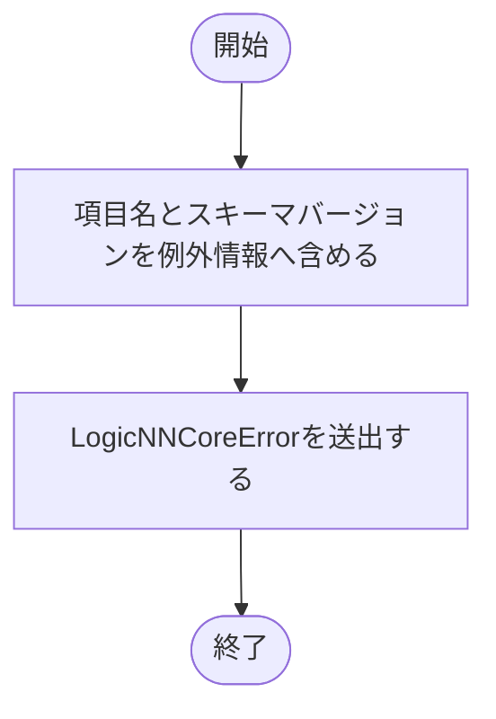

### 戻り値

型：`NoReturn`

返りません。必ずLogicNNCoreErrorを送出します。

### ソースコード

<details>
<summary>\_fail() の実装を開く</summary>

```python
def _fail(target: str, message: str, hint: str) -> NoReturn:
    """JSON変換の失敗箇所と対処方針を共通例外で通知する。"""
    raise LogicNNCoreError(f"{target}: {message}", detail=f"回路JSON schema version {_SCHEMA_VERSION}: {target}", hint=hint)
```

</details>

{/* function: _object@33 */}

## \_object() {/* #object */}

```python
def _object(value: object, fields: set[str], target: str) -> Mapping[str, object]:
```

### 機能概要

JSONオブジェクトが必要な項目を過不足なく持つかを確認します。既定値による補完や未知の項目の無視は行いません。

### 引数

| 引数 | 型 | 既定値 | 説明 |
|---|---|---|---|
| `value` | `object` | `必須` | 検証するオブジェクト。 |
| `fields` | `set[str]` | `必須` | 必須かつ許可される項目名の集合。 |
| `target` | `str` | `必須` | エラー時に位置を示す項目名。例: gates[0].input_ids。 |

### 処理の流れ

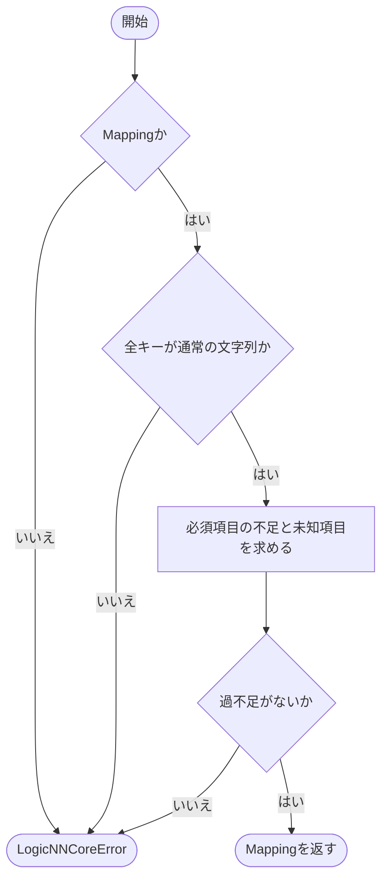

### 戻り値

型：`Mapping[str, object]`

検証済みのMapping。元のオブジェクトを返します。

### ソースコード

<details>
<summary>\_object() の実装を開く</summary>

```python
def _object(value: object, fields: set[str], target: str) -> Mapping[str, object]:
    """JSON objectの全必須fieldと未知fieldを、default補完せず検査する。"""
    if not isinstance(value, Mapping):
        _fail(target, "JSON objectが必要です", "schemaのfield名をkeyに持つMappingを指定してください")
    if any(type(key) is not str for key in value):
        _fail(target, "JSON objectのkeyは文字列が必要です", "全てのkeyにschemaで定めた文字列を使用してください")
    missing = fields - value.keys()
    unknown = value.keys() - fields
    if missing or unknown:
        _fail(target, f"必須field欠落={sorted(missing)}, 未知field={sorted(unknown)}", "schema version 1の全fieldを省略せず指定し、未知fieldを除いてください")
    return value
```

</details>

{/* function: _array@46 */}

## \_array() {/* #array */}

```python
def _array(value: object, target: str) -> list[object]:
```

### 機能概要

JSON配列をPythonのlistとして受け取ります。tupleや文字列を暗黙に変換せず、要素の順序と重複をそのまま残します。

### 引数

| 引数 | 型 | 既定値 | 説明 |
|---|---|---|---|
| `value` | `object` | `必須` | 検証するJSON配列。 |
| `target` | `str` | `必須` | エラー時に位置を示す項目名。例: gates[0].input_ids。 |

### 処理の流れ

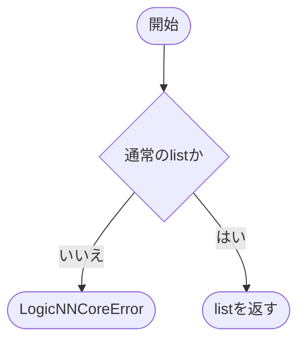

### 戻り値

型：`list[object]`

検証済みの元のlist。

### ソースコード

<details>
<summary>\_array() の実装を開く</summary>

```python
def _array(value: object, target: str) -> list[object]:
    """順序と重複を持つJSON arrayをPython listだけに限定する。"""
    if type(value) is not list:
        _fail(target, "JSON arrayが必要です", "tupleや文字列ではなく、順序を保持したlistを指定してください")
    return value
```

</details>

{/* function: _enum@53 */}

## \_enum() {/* #enum */}

```python
def _enum(value: object, enum_type: type[_EnumType], target: str) -> _EnumType:
```

### 機能概要

正式な文字列からGateOp・ScalarOp・TensorDTypeなどのEnumを復元します。未対応の文字列の場合は、指定可能な値の一覧を含む例外へ変換します。

### 引数

| 引数 | 型 | 既定値 | 説明 |
|---|---|---|---|
| `value` | `object` | `必須` | Enumの値に対応する通常の文字列。 |
| `enum_type` | `type[_EnumType]` | `必須` | 復元するEnumクラス。 |
| `target` | `str` | `必須` | エラー時に位置を示す項目名。例: gates[0].input_ids。 |

### 処理の流れ

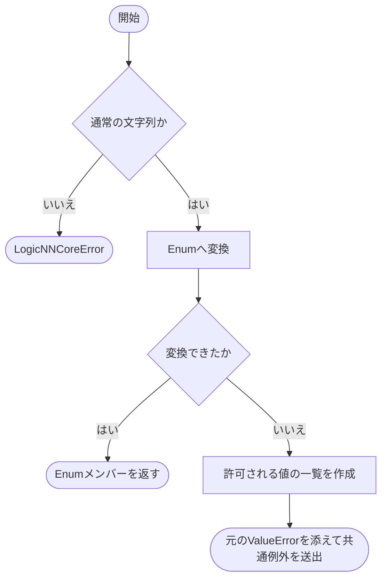

### 戻り値

型：`_EnumType`

enum_typeの対応するメンバー。

### ソースコード

<details>
<summary>\_enum() の実装を開く</summary>

```python
def _enum(value: object, enum_type: type[_EnumType], target: str) -> _EnumType:
    """正式なJSON文字列からだけenumを復元し、未知の演算やdtypeを拒否する。"""
    if type(value) is not str:
        _fail(target, "enum値はJSON文字列が必要です", "schemaで定めた演算名またはdtype名を通常の文字列として指定してください")
    try:
        return enum_type(value)
    except ValueError as error:
        choices = ", ".join(item.value for item in enum_type)
        raise LogicNNCoreError(f"{target}: 未対応の値です: {value!r}", detail=str(error), hint=f"次の正式な値を使用してください: {choices}") from error
```

</details>

{/* function: _constant_from_dict@64 */}

## \_constant\_from\_dict() {/* #constant-from-dict */}

```python
def _constant_from_dict(value: object, target: str) -> ScalarConstant | None:
```

### 機能概要

定数のJSON表現から値・Tensorのdtype・次元数を復元します。JSONのnullは定数なしのNoneとして扱います。

### 引数

| 引数 | 型 | 既定値 | 説明 |
|---|---|---|---|
| `value` | `object` | `必須` | 定数項目を持つJSONオブジェクト、またはNone。 |
| `target` | `str` | `必須` | エラー時に位置を示す項目名。例: gates[0].input_ids。 |

### 処理の流れ

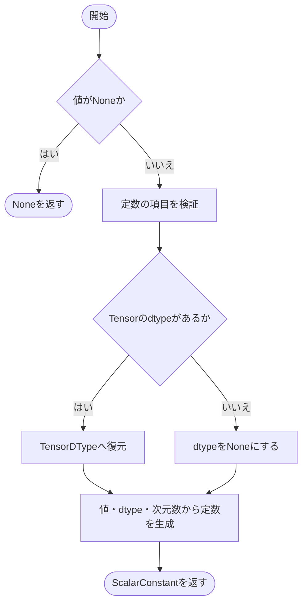

### 戻り値

型：`ScalarConstant \| None`

ScalarConstant、またはNone。

### ソースコード

<details>
<summary>\_constant\_from\_dict() の実装を開く</summary>

```python
def _constant_from_dict(value: object, target: str) -> ScalarConstant | None:
    """型付き定数の値・Tensor dtype・rankを変えずに読み取る。"""
    if value is None:
        return None
    fields = _object(value, _CONSTANT_FIELDS, target)
    dtype  = None if fields["tensor_dtype"] is None else _enum(fields["tensor_dtype"], TensorDType, f"{target}.tensor_dtype")
    return ScalarConstant(fields["value"], dtype, fields["tensor_ndim"])
```

</details>

{/* function: _operation_from_dict@73 */}

## \_operation\_from\_dict() {/* #operation-from-dict */}

```python
def _operation_from_dict(value: object, target: str) -> ScalarOperation:
```

### 機能概要

数値演算の種類と出力型をEnumへ戻し、定数、左右関係、alpha、入力の次元数をそのまま読み取ります。

### 引数

| 引数 | 型 | 既定値 | 説明 |
|---|---|---|---|
| `value` | `object` | `必須` | ScalarOperationに対応するJSONオブジェクト。 |
| `target` | `str` | `必須` | エラー時に位置を示す項目名。例: gates[0].input_ids。 |

### 処理の流れ

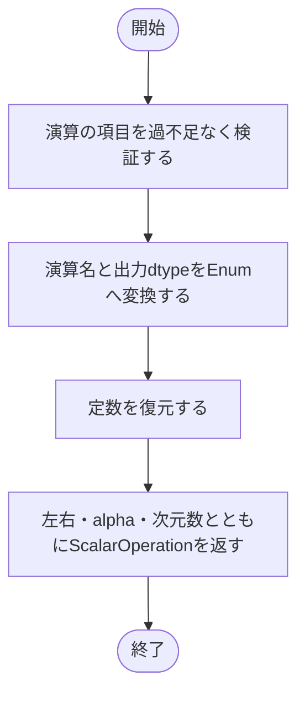

### 戻り値

型：`ScalarOperation`

復元したScalarOperation。

### ソースコード

<details>
<summary>\_operation\_from\_dict() の実装を開く</summary>

```python
def _operation_from_dict(value: object, target: str) -> ScalarOperation:
    """各演算の順序・左右・alpha・入出力数値情報を全て復元する。"""
    fields  = _object(value, _OPERATION_FIELDS, target)
    op      = _enum(fields["op"], ScalarOp, f"{target}.op")
    dtype   = _enum(fields["output_dtype"], TensorDType, f"{target}.output_dtype")
    operand = _constant_from_dict(fields["operand"], f"{target}.operand")
    return ScalarOperation(op, dtype, operand, fields["scalar_first"], fields["alpha"], fields["input_ndim"])
```

</details>

{/* function: _reduction_from_dict@82 */}

## \_reduction\_from\_dict() {/* #reduction-from-dict */}

```python
def _reduction_from_dict(value: object, target: str) -> SumReduction:
```

### 機能概要

集約入力の並びとsumのdtypeを復元し、保存された順番で各数値演算を読み取ります。

### 引数

| 引数 | 型 | 既定値 | 説明 |
|---|---|---|---|
| `value` | `object` | `必須` | SumReductionに対応するJSONオブジェクト。 |
| `target` | `str` | `必須` | エラー時に位置を示す項目名。例: gates[0].input_ids。 |

### 処理の流れ

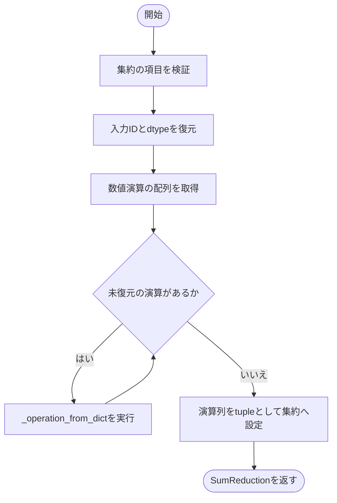

### 戻り値

型：`SumReduction`

復元したSumReduction。

### ソースコード

<details>
<summary>\_reduction\_from\_dict() の実装を開く</summary>

```python
def _reduction_from_dict(value: object, target: str) -> SumReduction:
    """sumの入力とdtype、全ての数値演算をJSONに保存された順に復元する。"""
    fields     = _object(value, _REDUCTION_FIELDS, target)
    input_ids  = tuple(_array(fields["input_ids"], f"{target}.input_ids"))
    dtype      = _enum(fields["dtype"], TensorDType, f"{target}.dtype")
    operations = _array(fields["operations"], f"{target}.operations")
    steps      = tuple(_operation_from_dict(item, f"{target}.operations[{index}]") for index, item in enumerate(operations))
    return SumReduction(fields["output_id"], input_ids, dtype, steps)
```

</details>

{/* function: _gate_from_dict@92 */}

## \_gate\_from\_dict() {/* #gate-from-dict */}

```python
def _gate_from_dict(value: object, target: str) -> Gate:
```

### 機能概要

論理ゲートの演算名をEnumへ変換し、出力IDと入力IDの順序を保ってGateを作ります。

### 引数

| 引数 | 型 | 既定値 | 説明 |
|---|---|---|---|
| `value` | `object` | `必須` | Gateに対応するJSONオブジェクト。 |
| `target` | `str` | `必須` | エラー時に位置を示す項目名。例: gates[0].input_ids。 |

### 処理の流れ

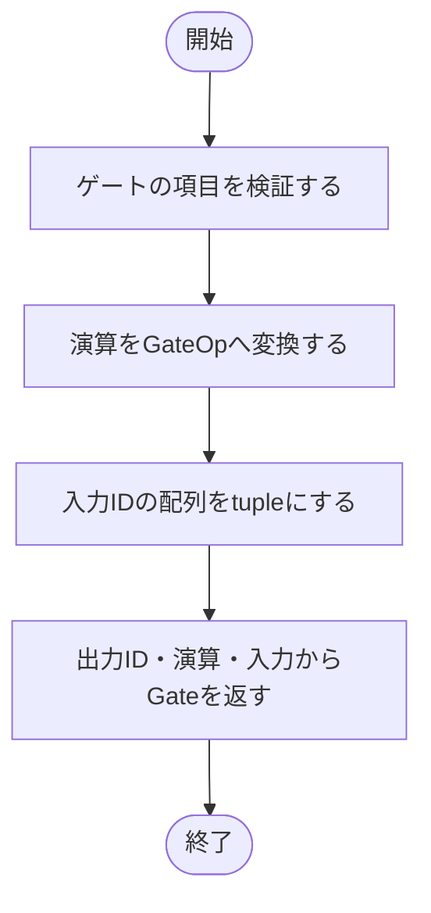

### 戻り値

型：`Gate`

復元したGate。

### ソースコード

<details>
<summary>\_gate\_from\_dict() の実装を開く</summary>

```python
def _gate_from_dict(value: object, target: str) -> Gate:
    """gateの演算と入力位置を変更せずにJSON objectから復元する。"""
    fields = _object(value, _GATE_FIELDS, target)
    op     = _enum(fields["op"], GateOp, f"{target}.op")
    inputs = tuple(_array(fields["input_ids"], f"{target}.input_ids"))
    return Gate(fields["output_id"], op, inputs)
```

</details>

{/* function: _logical_from_dict@100 */}

## \_logical\_from\_dict() {/* #logical-from-dict */}

```python
def _logical_from_dict(value: object, target: str) -> LogicalOutput:
```

### 機能概要

集約前の生ビットの対応を読み取ります。同じ信号の重複や定数信号を削除せず、そのままtupleへ変換します。

### 引数

| 引数 | 型 | 既定値 | 説明 |
|---|---|---|---|
| `value` | `object` | `必須` | LogicalOutputに対応するJSONオブジェクト。 |
| `target` | `str` | `必須` | エラー時に位置を示す項目名。例: gates[0].input_ids。 |

### 処理の流れ

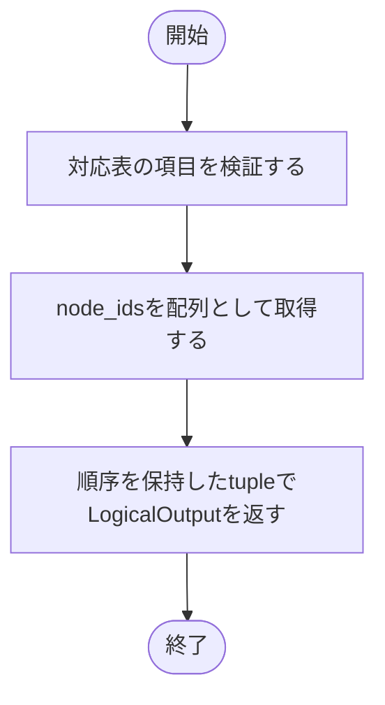

### 戻り値

型：`LogicalOutput`

復元したLogicalOutput。

### ソースコード

<details>
<summary>\_logical\_from\_dict() の実装を開く</summary>

```python
def _logical_from_dict(value: object, target: str) -> LogicalOutput:
    """元の論理出力対応を重複や定数参照を含めそのまま復元する。"""
    fields = _object(value, _LOGICAL_FIELDS, target)
    return LogicalOutput(tuple(_array(fields["node_ids"], f"{target}.node_ids")))
```

</details>

{/* function: from_dict@106 */}

## from\_dict() {/* #from-dict */}

```python
def from_dict(value: Mapping[str, object]) -> CircuitData:
```

### 機能概要

形式名logicnn_core.circuitとスキーマバージョン1を確認し、各項目を回路IRへ復元します。構造の復元後にvalidate_circuitを実行し、参照関係や数値型の整合性も確認します。

### 引数

| 引数 | 型 | 既定値 | 説明 |
|---|---|---|---|
| `value` | `Mapping[str, object]` | `必須` | to_dictが出力する形式のMapping。必須項目はすべて必要です。 |

### 処理の流れ

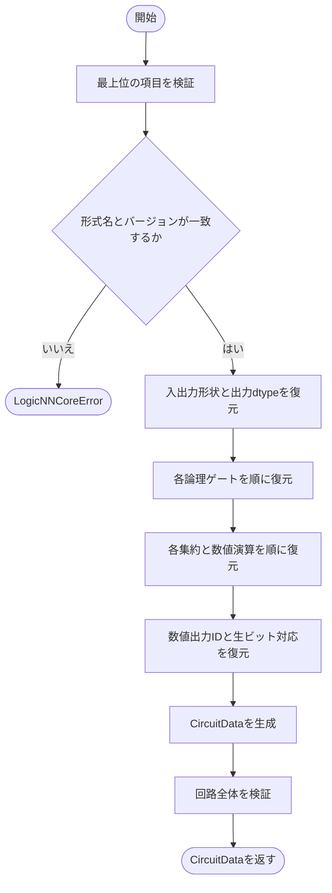

### 戻り値

型：`CircuitData`

元のMappingとコンテナを共有しないCircuitData。

### 例外・注意事項

- 旧形式の互換読み込み、未知項目の無視、既定値の補完は行いません。

### ソースコード

<details>
<summary>from\_dict() の実装を開く</summary>

```python
def from_dict(value: Mapping[str, object]) -> CircuitData:
    """厳密なschema version 1のMappingを検証し、独立した回路IRを返す。"""
    fields = _object(value, _ROOT_FIELDS, "JSON")
    if type(fields["format"]) is not str or fields["format"] != _FORMAT:
        _fail("format", f"未対応の回路形式です: {fields['format']!r}", f"format={_FORMAT!r}の回路JSONを指定してください")
    if type(fields["schema_version"]) is not int or fields["schema_version"] != _SCHEMA_VERSION:
        _fail("schema_version", f"未対応のschema versionです: {fields['schema_version']!r}", "正式な整数1を指定してください。旧草案の互換読込は行いません")
    input_shape  = tuple(_array(fields["input_shape"], "input_shape"))
    output_shape = tuple(_array(fields["output_shape"], "output_shape"))
    output_dtype = _enum(fields["output_dtype"], TensorDType, "output_dtype")
    gates        = [_gate_from_dict(item, f"gates[{index}]") for index, item in enumerate(_array(fields["gates"], "gates"))]
    reductions   = [_reduction_from_dict(item, f"reductions[{index}]") for index, item in enumerate(_array(fields["reductions"], "reductions"))]
    output_ids   = list(_array(fields["output_ids"], "output_ids"))
    logical      = [_logical_from_dict(item, f"logical_outputs[{index}]") for index, item in enumerate(_array(fields["logical_outputs"], "logical_outputs"))]
    data         = CircuitData(input_shape, output_shape, gates, reductions, output_ids, logical, output_dtype)
    validate_circuit(data)
    return data
```

</details>

{/* function: _constant_to_dict@125 */}

## \_constant\_to\_dict() {/* #constant-to-dict */}

```python
def _constant_to_dict(value: ScalarConstant | None) -> dict[str, object] | None:
```

### 機能概要

定数を値・Tensorのdtype・次元数の3項目へ変換します。NoneはそのままNoneとし、数値の型や符号付き0を算術演算で変更しません。

### 引数

| 引数 | 型 | 既定値 | 説明 |
|---|---|---|---|
| `value` | `ScalarConstant \| None` | `必須` | 出力するScalarConstant、またはNone。 |

### 処理の流れ

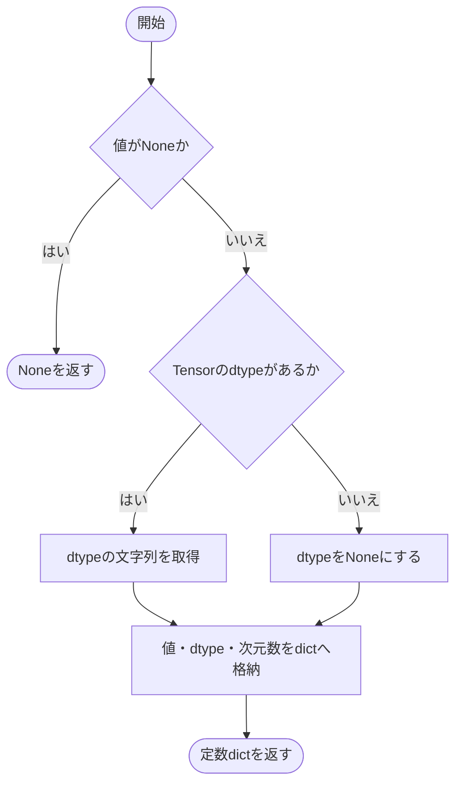

### 戻り値

型：`dict[str, object] \| None`

定数のdict、またはNone。

### ソースコード

<details>
<summary>\_constant\_to\_dict() の実装を開く</summary>

```python
def _constant_to_dict(value: ScalarConstant | None) -> dict[str, object] | None:
    """Python数値の型と符号付き0を保って、型付き定数の全fieldを出力する。"""
    if value is None:
        return None
    return {"value": value.value, "tensor_dtype": value.tensor_dtype.value if value.tensor_dtype is not None else None, "tensor_ndim": value.tensor_ndim}
```

</details>

{/* function: _operation_to_dict@132 */}

## \_operation\_to\_dict() {/* #operation-to-dict */}

```python
def _operation_to_dict(value: ScalarOperation) -> dict[str, object]:
```

### 機能概要

数値演算を1段分のdictへ変換します。演算名、出力型、定数、左右関係、alpha、入力の次元数をすべて出力します。

### 引数

| 引数 | 型 | 既定値 | 説明 |
|---|---|---|---|
| `value` | `ScalarOperation` | `必須` | 出力するScalarOperation。 |

### 処理の流れ

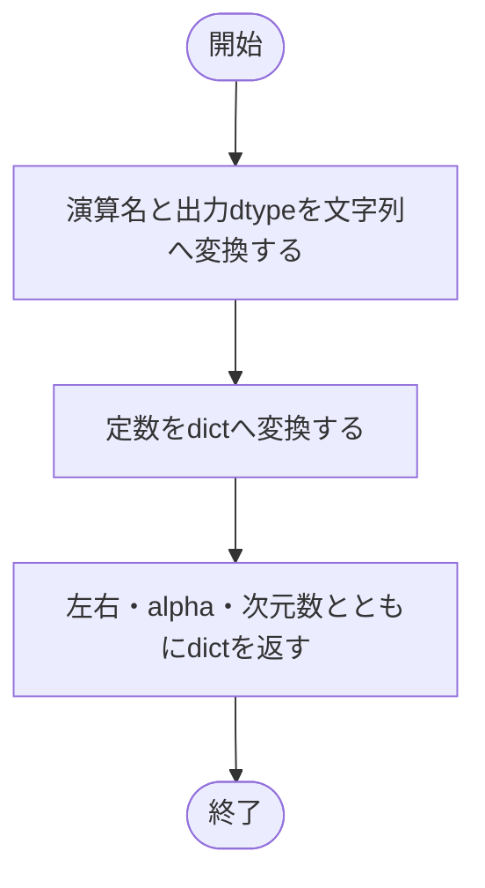

### 戻り値

型：`dict[str, object]`

数値演算の全項目を持つdict。

### ソースコード

<details>
<summary>\_operation\_to\_dict() の実装を開く</summary>

```python
def _operation_to_dict(value: ScalarOperation) -> dict[str, object]:
    """数値演算を簡約せず、計算順序の再現に必要な全fieldを出力する。"""
    return {
        "op": value.op.value, "output_dtype": value.output_dtype.value, "operand": _constant_to_dict(value.operand),
        "scalar_first": value.scalar_first, "alpha": value.alpha, "input_ndim": value.input_ndim,
    }
```

</details>

{/* function: to_dict@140 */}

## to\_dict() {/* #to-dict */}

```python
def to_dict(data: CircuitData) -> dict[str, object]:
```

### 機能概要

回路を検証してから、JSONで表現できるdictとlistへ変換します。IDの順序、入力の重複、数値演算の順序、生ビットの出力対応を保持します。

### 引数

| 引数 | 型 | 既定値 | 説明 |
|---|---|---|---|
| `data` | `CircuitData` | `必須` | JSONへ変換するCircuitData。 |

### 処理の流れ

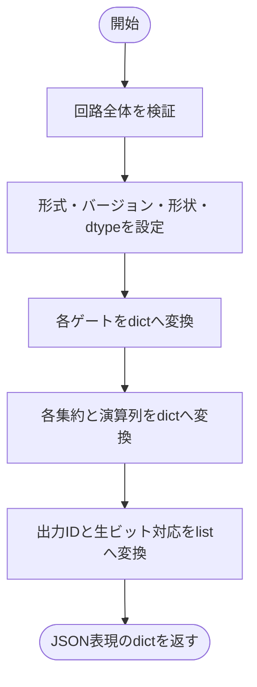

### 戻り値

型：`dict[str, object]`

形式名とバージョンを含むdict。元のIRのlistやtupleとは共有しないコンテナを使います。

### ソースコード

<details>
<summary>to\_dict() の実装を開く</summary>

```python
def to_dict(data: CircuitData) -> dict[str, object]:
    """回路IRを検証し、共有されないcontainerだけからなるJSON表現を返す。"""
    validate_circuit(data)
    return {
        "format": _FORMAT, "schema_version": _SCHEMA_VERSION, "input_shape": list(data.input_shape), "output_shape": list(data.output_shape),
        "output_dtype": data.output_dtype.value,
        "gates": [{"output_id": gate.output_id, "op": gate.op.value, "input_ids": list(gate.input_ids)} for gate in data.gates],
        "reductions": [{
            "output_id": reduction.output_id, "input_ids": list(reduction.input_ids), "dtype": reduction.dtype.value,
            "operations": [_operation_to_dict(operation) for operation in reduction.operations],
        } for reduction in data.reductions],
        "output_ids": list(data.output_ids), "logical_outputs": [{"node_ids": list(output.node_ids)} for output in data.logical_outputs],
    }
```

</details>

{/* function: _unique_object@155 */}

## \_unique\_object() {/* #unique-object */}

```python
def _unique_object(pairs: list[tuple[str, object]]) -> dict[str, object]:
```

### 機能概要

JSONパーサーから受け取ったキーと値の組を順にdictへ入れ、同じオブジェクト内でキーが重複していたら拒否します。後の値で上書きされることによる情報の消失を防ぎます。

### 引数

| 引数 | 型 | 既定値 | 説明 |
|---|---|---|---|
| `pairs` | `list[tuple[str, object]]` | `必須` | JSONオブジェクト内のキーと値を出現順に持つlist。 |

### 処理の流れ

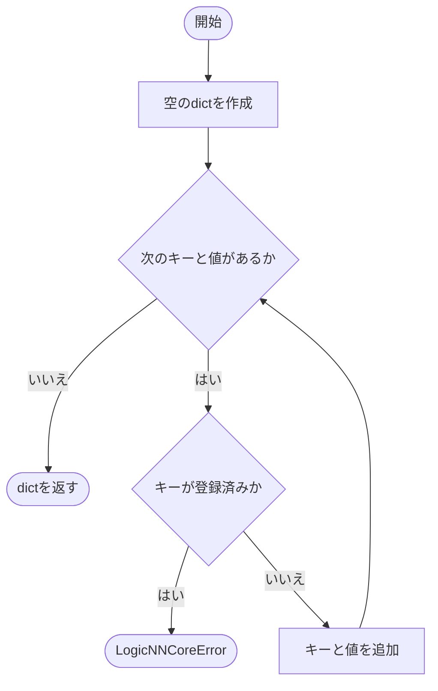

### 戻り値

型：`dict[str, object]`

キーの重複がないdict。

### ソースコード

<details>
<summary>\_unique\_object() の実装を開く</summary>

```python
def _unique_object(pairs: list[tuple[str, object]]) -> dict[str, object]:
    """JSONの全階層で重複keyを検出し、後勝ちによる情報の消失を防ぐ。"""
    value: dict[str, object] = {}
    for key, item in pairs:
        if key in value:
            _fail("JSON", f"重複するkeyがあります: {key!r}", "同一object内では各fieldを一度だけ指定してください")
        value[key] = item
    return value
```

</details>

{/* function: _reject_constant@165 */}

## \_reject\_constant() {/* #reject-constant */}

```python
def _reject_constant(value: str) -> NoReturn:
```

### 機能概要

PythonのJSONパーサーが拡張として扱うNaN・Infinity・−Infinityを拒否します。回路JSONには有限の標準JSON数値だけを保存します。

### 引数

| 引数 | 型 | 既定値 | 説明 |
|---|---|---|---|
| `value` | `str` | `必須` | JSONパーサーから渡される非有限値のトークン文字列。 |

### 処理の流れ

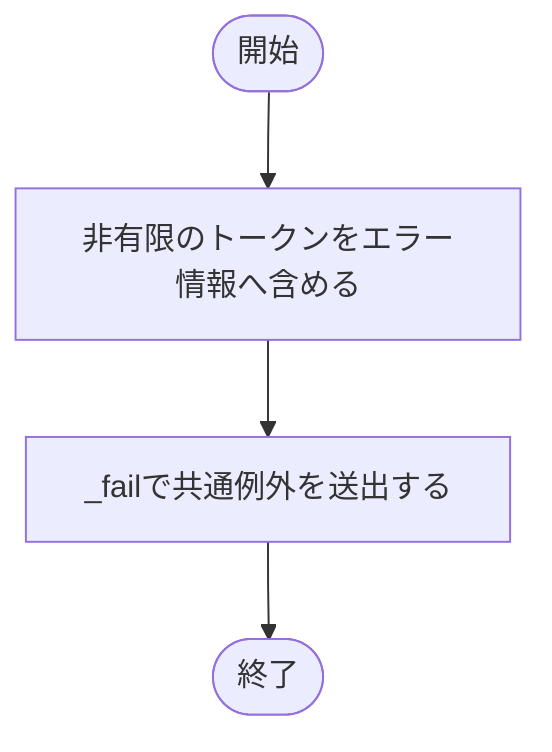

### 戻り値

型：`NoReturn`

返りません。必ずLogicNNCoreErrorを送出します。

### ソースコード

<details>
<summary>\_reject\_constant() の実装を開く</summary>

```python
def _reject_constant(value: str) -> NoReturn:
    """標準JSONではないNaNとInfinityの拡張tokenを拒否する。"""
    _fail("JSON", f"非有限の数値tokenは使用できません: {value}", "NaNやInfinityを含まない有限の数値を使用してください")
```

</details>

{/* function: _file_error@170 */}

## \_file\_error() {/* #file-error */}

```python
def _file_error(path: object, action: str, error: Exception) -> LogicNNCoreError:
```

### 機能概要

ファイル操作やJSON解析の失敗を、対象パス・操作名・元の例外情報を持つLogicNNCoreErrorへまとめます。この関数自身は例外を送出せず、作成した例外を返します。

### 引数

| 引数 | 型 | 既定値 | 説明 |
|---|---|---|---|
| `path` | `object` | `必須` | 操作対象のパス。 |
| `action` | `str` | `必須` | 表示する操作名。読込または保存など。 |
| `error` | `Exception` | `必須` | 元の例外。 |

### 処理の流れ

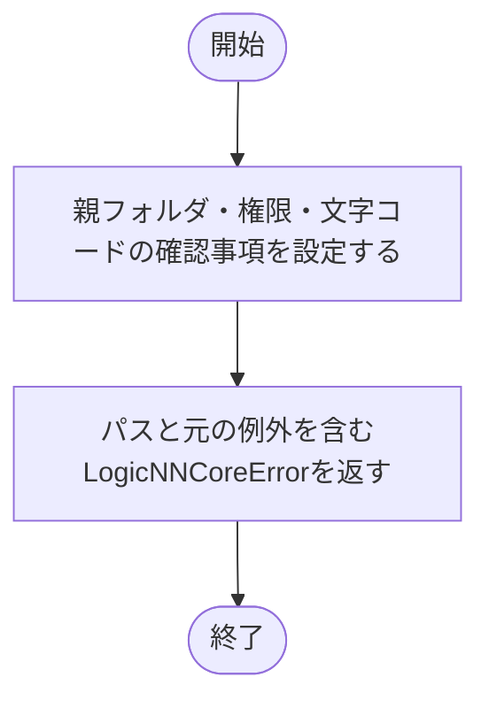

### 戻り値

型：`LogicNNCoreError`

呼び出し側で送出するLogicNNCoreError。

### ソースコード

<details>
<summary>\_file\_error() の実装を開く</summary>

```python
def _file_error(path: object, action: str, error: Exception) -> LogicNNCoreError:
    """file操作の失敗を対象pathと原因を持つ共通例外へ変換する。"""
    hint = "既存の親directory、fileの権限、UTF-8 JSON形式を確認してください"
    return LogicNNCoreError(f"回路JSONの{action}に失敗しました: {path}", detail=f"{type(error).__name__}: {error}", hint=hint)
```

</details>

{/* function: read_json@176 */}

## read\_json() {/* #read-json */}

```python
def read_json(path: str | os.PathLike[str]) -> CircuitData:
```

### 機能概要

UTF-8のJSONファイルを読み、キー重複と非有限値を拒否してからCircuitDataへ復元します。ファイル・文字コード・解析に関する指定の例外は、対象パスを付けた共通例外へ変換します。

### 引数

| 引数 | 型 | 既定値 | 説明 |
|---|---|---|---|
| `path` | `str \| os.PathLike[str]` | `必須` | 読み込むUTF-8 JSONファイルのパス。 |

### 処理の流れ

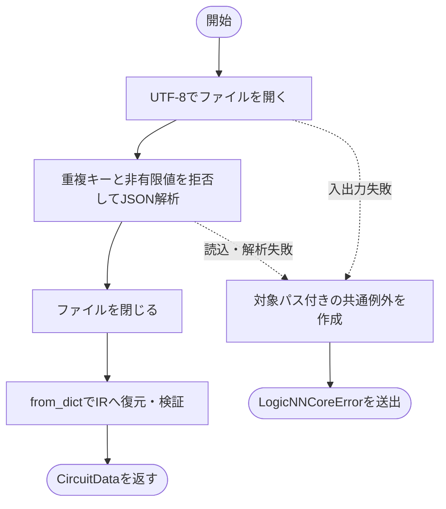

### 戻り値

型：`CircuitData`

検証済みのCircuitData。

### 例外・注意事項

- from_dictのスキーマエラーや、重複キー・非有限トークンのLogicNNCoreErrorはそのまま呼び出し元へ伝わります。

### ソースコード

<details>
<summary>read\_json() の実装を開く</summary>

```python
def read_json(path: str | os.PathLike[str]) -> CircuitData:
    """UTF-8 JSONを厳密に読み、元の数値情報を保った回路IRを復元する。"""
    try:
        with Path(path).open("r", encoding="utf-8") as file:
            value = json.load(file, object_pairs_hook=_unique_object, parse_constant=_reject_constant)
    except (OSError, UnicodeError, ValueError, TypeError, RecursionError) as error:
        raise _file_error(path, "読込", error) from error
    return from_dict(value)
```

</details>

{/* function: write_json@186 */}

## write\_json() {/* #write-json */}

```python
def write_json(data: CircuitData, path: str | os.PathLike[str]) -> None:
```

### 機能概要

検証済みの回路JSONを保存先と同じフォルダの一時ファイルへ書き込み、flushとfsyncの後にos.replaceで保存先を置き換えます。保存途中で失敗した場合は、残った一時ファイルの削除を試みます。

### 引数

| 引数 | 型 | 既定値 | 説明 |
|---|---|---|---|
| `data` | `CircuitData` | `必須` | 保存するCircuitData。 |
| `path` | `str \| os.PathLike[str]` | `必須` | 保存先のJSONファイル。親フォルダは事前に存在している必要があります。 |

### 処理の流れ

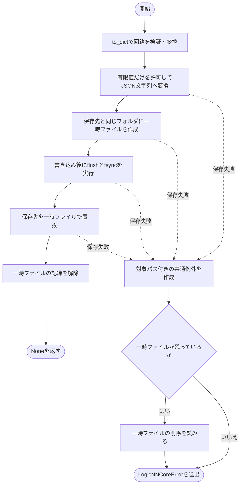

### 戻り値

型：`None`

None。

### 状態の変更・ファイル出力

- 指定ファイルを新規作成または置換します。一時ファイルも同じフォルダに作成します。

### 例外・注意事項

- 回路の検証はファイル操作前に行います。元データの不正では保存先を書き換えません。
- 一時ファイル削除時のOSErrorは追加で送出せず、元の失敗を優先します。

### ソースコード

<details>
<summary>write\_json() の実装を開く</summary>

```python
def write_json(data: CircuitData, path: str | os.PathLike[str]) -> None:
    """検証済みIRを同じdirectoryの一時fileへ書き、既存fileを原子的に置換する。"""
    encoded   = to_dict(data)
    temporary = None
    try:
        payload     = json.dumps(encoded, ensure_ascii=False, allow_nan=False, indent=2) + "\n"
        destination = Path(path)
        with tempfile.NamedTemporaryFile(
            "w", encoding="utf-8", newline="\n", dir=destination.parent, prefix=f".{destination.name}.", suffix=".tmp", delete=False,
        ) as file:
            temporary = file.name
            file.write(payload)
            file.flush()
            os.fsync(file.fileno())
        os.replace(temporary, destination)
        temporary = None
    except (OSError, UnicodeError, ValueError, TypeError, RecursionError) as error:
        raise _file_error(path, "保存", error) from error
    finally:
        if temporary is not None:
            try:
                os.unlink(temporary)
            except OSError:
                pass
```

</details>

## 関連ファイル

- [utils/logicNN_core/src/logicnn_core/circuit/types.py](/code-reference/utils/logicNN_core/src/logicnn_core/circuit/types)
- [utils/logicNN_core/src/logicnn_core/circuit/validation.py](/code-reference/utils/logicNN_core/src/logicnn_core/circuit/validation)
- [utils/logicNN_core/src/logicnn_core/exceptions.py](/code-reference/utils/logicNN_core/src/logicnn_core/exceptions)
