# simplification.py

`utils/logicNN_core/src/logicnn_core/circuit/simplification.py`

論理回路にNOTの融合、未使用ノードの削除、定数の畳み込み、配線の除去、共通ゲートの共有、整数和の定数整理を固定順で適用します。最終数値出力だけでなく集約前の生ビット対応も保護し、数値演算の順序を維持します。

{/* source-sha256: 3b9af19d7a39f83f67f2f3c108ce3abc479cebf33b6681d5d4e976505045025f */}

- このファイルの関数はCircuitDataを直接更新します。公開Circuitクラスからの簡略化では、呼び出し側が候補IRを用意して元の回路を保護します。

{/* function: _bit@22 */}

## \_bit() {/* #bit */}

```python
def _bit(op: GateOp, left: bool, right: bool = False) -> bool:
```

### 機能概要

演算ごとに保持した4ビットの真理値表から、指定した入力の出力を取り出します。この内部表は最下位ビットから00、01、10、11の順で、LUT IDの外部表現とはビット順が異なります。

### 引数

| 引数 | 型 | 既定値 | 説明 |
|---|---|---|---|
| `op` | `GateOp` | `必須` | 評価するGateOp。 |
| `left` | `bool` | `必須` | 第1入力のbool値。 |
| `right` | `bool` | `False` | 第2入力のbool値。単入力演算では既定値Falseで構いません。 |

### 処理の流れ

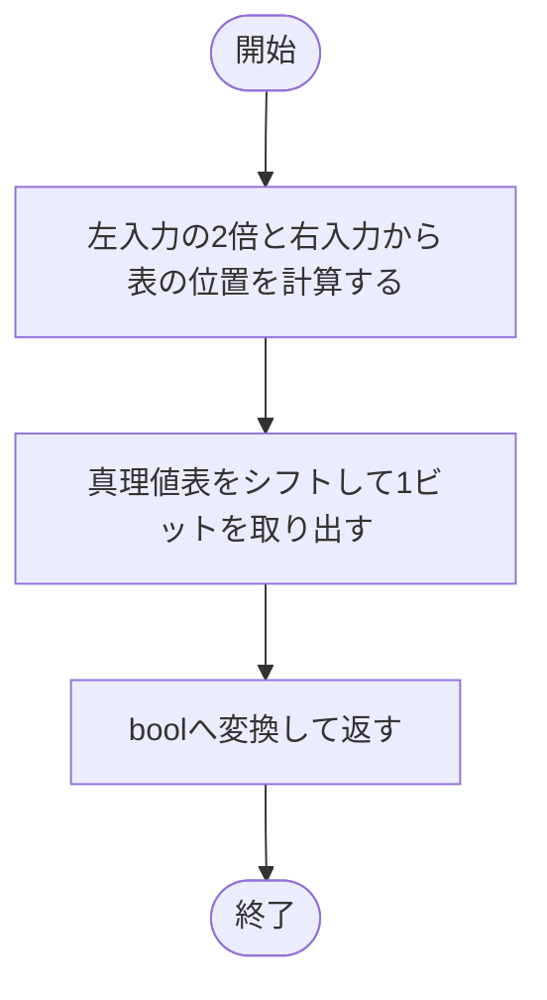

### 戻り値

型：`bool`

指定入力に対するbool出力。

### ソースコード

<details>
<summary>\_bit() の実装を開く</summary>

```python
def _bit(op: GateOp, left: bool, right: bool = False) -> bool:
    """00・01・10・11の真理値表から指定した入力組合せの出力を返す。"""
    return bool((_TRUTH[op] >> (2 * int(left) + int(right))) & 1)
```

</details>

{/* function: _unary@27 */}

## \_unary() {/* #unary */}

```python
def _unary(output_id: int, input_id: int, false_value: bool, true_value: bool) -> Gate:
```

### 機能概要

入力0・1に対する2つの出力から、同値な定数、WIRE、NOTのゲートを作ります。出力IDは変更しません。

### 引数

| 引数 | 型 | 既定値 | 説明 |
|---|---|---|---|
| `output_id` | `int` | `必須` | 生成するゲートの出力ID。 |
| `input_id` | `int` | `必須` | 残す単入力信号のID。 |
| `false_value` | `bool` | `必須` | 入力0の場合の出力。 |
| `true_value` | `bool` | `必須` | 入力1の場合の出力。 |

### 処理の流れ

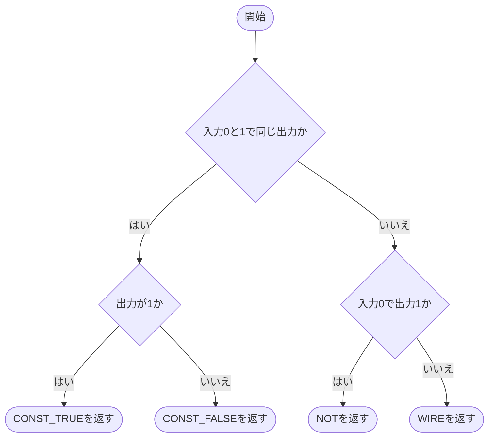

### 戻り値

型：`Gate`

0入力の定数Gate、または1入力のWIRE・NOT Gate。

### ソースコード

<details>
<summary>\_unary() の実装を開く</summary>

```python
def _unary(output_id: int, input_id: int, false_value: bool, true_value: bool) -> Gate:
    """1入力の真理値を定数・WIRE・NOTのいずれかへ正規化する。"""
    if false_value == true_value:
        return Gate(output_id, GateOp.CONST_TRUE if true_value else GateOp.CONST_FALSE, ())
    return Gate(output_id, GateOp.NOT if false_value else GateOp.WIRE, (input_id,))
```

</details>

{/* function: _from_truth@34 */}

## \_from\_truth() {/* #from-truth */}

```python
def _from_truth(output_id: int, input_ids: tuple[int, int], truth: int) -> Gate:
```

### 機能概要

4ビットの真理値表を、定数・単入力・2入力のいずれかのGateOpへ変換します。片方の入力だけで決まる関数では、必要な側の入力IDを正しく残します。

### 引数

| 引数 | 型 | 既定値 | 説明 |
|---|---|---|---|
| `output_id` | `int` | `必須` | 作成するゲートの出力ID。 |
| `input_ids` | `tuple[int, int]` | `必須` | 第1・第2入力のID。 |
| `truth` | `int` | `必須` | 最下位ビットから00・01・10・11を並べた0〜15の内部真理値表。 |

### 処理の流れ

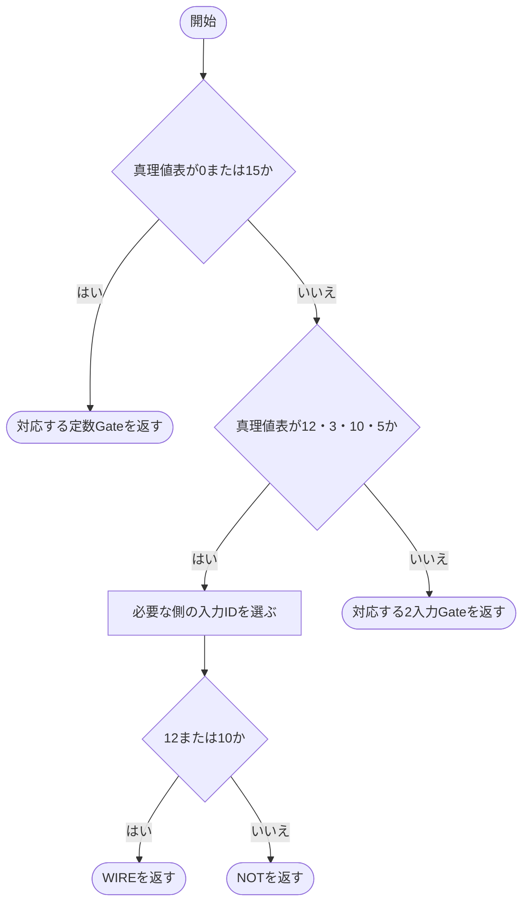

### 戻り値

型：`Gate`

同じ真理値を持つGate。

### ソースコード

<details>
<summary>\_from\_truth() の実装を開く</summary>

```python
def _from_truth(output_id: int, input_ids: tuple[int, int], truth: int) -> Gate:
    """2入力の真理値を入力位置の意味を失わず正式なGateOpへ変換する。"""
    if truth in (0, 15):
        return Gate(output_id, GateOp.CONST_TRUE if truth else GateOp.CONST_FALSE, ())
    if truth in (12, 3, 10, 5):
        input_id = input_ids[0 if truth in (12, 3) else 1]
        return Gate(output_id, GateOp.WIRE if truth in (12, 10) else GateOp.NOT, (input_id,))
    return Gate(output_id, _BINARY_OPS[truth], input_ids)
```

</details>

{/* function: _replace_references@44 */}

## \_replace\_references() {/* #replace-references */}

```python
def _replace_references(data: CircuitData, replacements: dict[int, int]) -> int:
```

### 機能概要

削除するゲートの出力IDを代わりの信号へ置き換えます。論理ゲートの入力、集約の入力、最終数値出力、生ビット対応のすべてを更新し、置換元のゲートを削除します。

### 引数

| 引数 | 型 | 既定値 | 説明 |
|---|---|---|---|
| `data` | `CircuitData` | `必須` | 簡略化対象のCircuitData。この関数は同じオブジェクトの一覧を更新します。 |
| `replacements` | `dict[int, int]` | `必須` | 削除対象IDから残す信号IDへの辞書。多段の置換は呼び出し側で最終参照へ解決して渡します。 |

### 処理の流れ

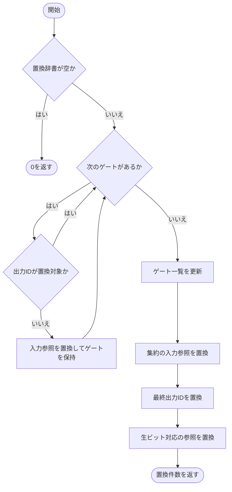

### 戻り値

型：`int`

置換辞書の件数。空の場合は0。

### 状態の変更・ファイル出力

- data.gates、reductions、output_ids、logical_outputsを更新します。各出力位置の順序と重複は保持します。

### ソースコード

<details>
<summary>\_replace\_references() の実装を開く</summary>

```python
def _replace_references(data: CircuitData, replacements: dict[int, int]) -> int:
    """削除する同値gateの参照を、生出力を含むすべての使用箇所で置き換える。"""
    if not replacements:
        return 0
    gates = []
    for gate in data.gates:
        if gate.output_id in replacements:
            continue
        input_ids = tuple(replacements.get(value, value) for value in gate.input_ids)
        gates.append(replace(gate, input_ids=input_ids) if input_ids != gate.input_ids else gate)
    data.gates = gates
    data.reductions = [replace(item, input_ids=tuple(replacements.get(value, value) for value in item.input_ids)) for item in data.reductions]
    data.output_ids = [replacements.get(value, value) for value in data.output_ids]
    data.logical_outputs = [LogicalOutput(tuple(replacements.get(value, value) for value in item.node_ids)) for item in data.logical_outputs]
    return len(replacements)
```

</details>

{/* function: _fuse_not_inputs@61 */}

## \_fuse\_not\_inputs() {/* #fuse-not-inputs */}

```python
def _fuse_not_inputs(data: CircuitData) -> int:
```

### 機能概要

入力側のNOTを後段ゲートの真理値へ取り込みます。二重NOTはWIREにし、2入力ゲートでは否定された入力を元の信号へ戻して演算を置き換えます。元のNOTゲート自体はこの処理では削除しません。

### 引数

| 引数 | 型 | 既定値 | 説明 |
|---|---|---|---|
| `data` | `CircuitData` | `必須` | 簡略化対象のCircuitData。この関数は同じオブジェクトの一覧を更新します。 |

### 処理の流れ

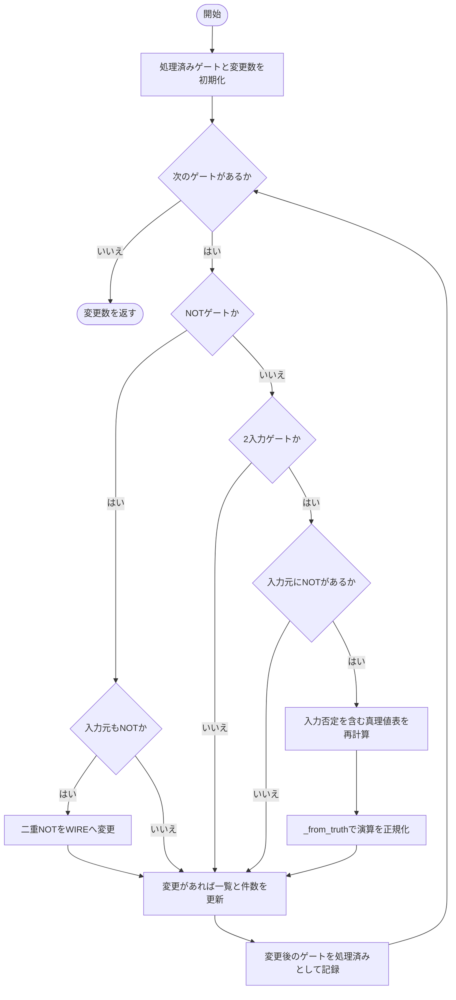

### 戻り値

型：`int`

演算または接続を変更したゲート数。

### 状態の変更・ファイル出力

- data.gates内の該当Gateを置き換えます。

### 例外・注意事項

- 生ビット出力として必要なNOTは、後段に融合できても参照先として残ります。不要なゲートの削除は別の処理で判断します。

### ソースコード

<details>
<summary>\_fuse\_not\_inputs() の実装を開く</summary>

```python
def _fuse_not_inputs(data: CircuitData) -> int:
    """入力側NOTを後続gateの真理値へ融合し、必要な元NOT出力は残す。"""
    changed = 0
    known: dict[int, Gate] = {}
    for index, gate in enumerate(data.gates):
        new_gate = gate
        if gate.op is GateOp.NOT:
            previous = known.get(gate.input_ids[0])
            if previous is not None and previous.op is GateOp.NOT:
                new_gate = Gate(gate.output_id, GateOp.WIRE, previous.input_ids)
        elif len(gate.input_ids) == 2:
            left, right = gate.input_ids
            first       = known.get(left)
            second      = known.get(right)
            invert_left = first is not None and first.op is GateOp.NOT
            invert_right = second is not None and second.op is GateOp.NOT
            if invert_left or invert_right:
                left  = first.input_ids[0] if invert_left else left
                right = second.input_ids[0] if invert_right else right
                truth = sum(int(_bit(gate.op, bool(a) ^ invert_left, bool(b) ^ invert_right)) << (2 * a + b) for a in (0, 1) for b in (0, 1))
                new_gate = _from_truth(gate.output_id, (left, right), truth)
        if new_gate != gate:
            data.gates[index] = new_gate
            changed += 1
        known[new_gate.output_id] = new_gate
    return changed
```

</details>

{/* function: _remove_unused@89 */}

## \_remove\_unused() {/* #remove-unused */}

```python
def _remove_unused(data: CircuitData) -> int:
```

### 機能概要

最終数値出力と生ビット出力の両方を起点として必要な信号を集めます。必要な集約の入力を追加した後、ゲートを逆順にたどって依存先を残し、使われないノードを削除します。

### 引数

| 引数 | 型 | 既定値 | 説明 |
|---|---|---|---|
| `data` | `CircuitData` | `必須` | 簡略化対象のCircuitData。この関数は同じオブジェクトの一覧を更新します。 |

### 処理の流れ

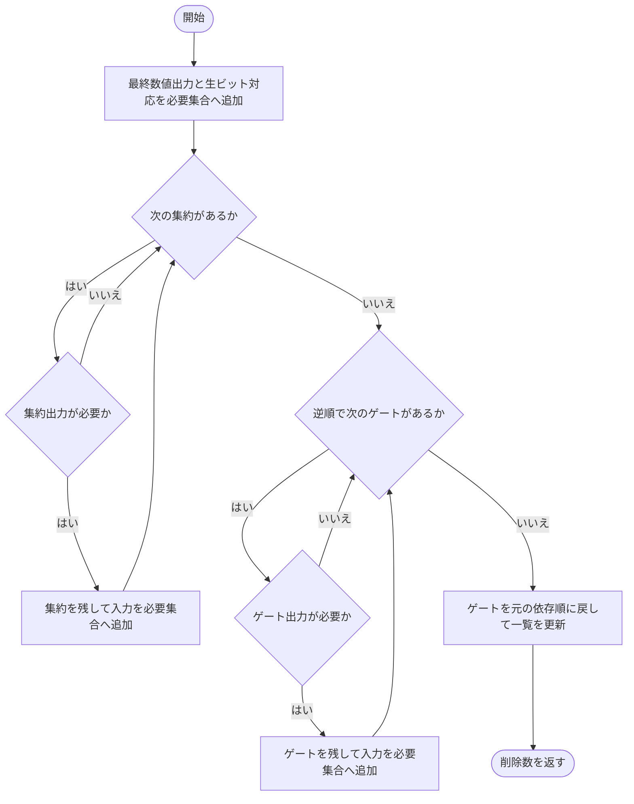

### 戻り値

型：`int`

削除した論理ゲート数と集約数の合計。

### 状態の変更・ファイル出力

- data.gatesとdata.reductionsを、必要なノードだけの一覧へ更新します。

### 例外・注意事項

- 集約結果が別の集約の入力になる構造はIRで許可されていないため、集約は保存順で確認します。

### ソースコード

<details>
<summary>\_remove\_unused() の実装を開く</summary>

```python
def _remove_unused(data: CircuitData) -> int:
    """最終数値出力と保存済み生出力の両方から必要なnodeだけを残す。"""
    needed = set(data.output_ids)
    needed.update(value for output in data.logical_outputs for value in output.node_ids)
    reductions = []
    for reduction in data.reductions:
        if reduction.output_id in needed:
            reductions.append(reduction)
            needed.update(reduction.input_ids)
    gates = []
    for gate in reversed(data.gates):
        if gate.output_id in needed:
            gates.append(gate)
            needed.update(gate.input_ids)
    changed         = len(data.gates) - len(gates) + len(data.reductions) - len(reductions)
    data.gates      = list(reversed(gates))
    data.reductions = reductions
    return changed
```

</details>

{/* function: _fold_constants@109 */}

## \_fold\_constants() {/* #fold-constants */}

```python
def _fold_constants(data: CircuitData) -> int:
```

### 機能概要

既知の定数入力と同じ信号を重ねた入力を使い、論理式を同値な定数・WIRE・NOTへ整理します。依存順に処理するため、その巡回中に新しく定数となった信号も後続ゲートへ伝わります。

### 引数

| 引数 | 型 | 既定値 | 説明 |
|---|---|---|---|
| `data` | `CircuitData` | `必須` | 簡略化対象のCircuitData。この関数は同じオブジェクトの一覧を更新します。 |

### 処理の流れ

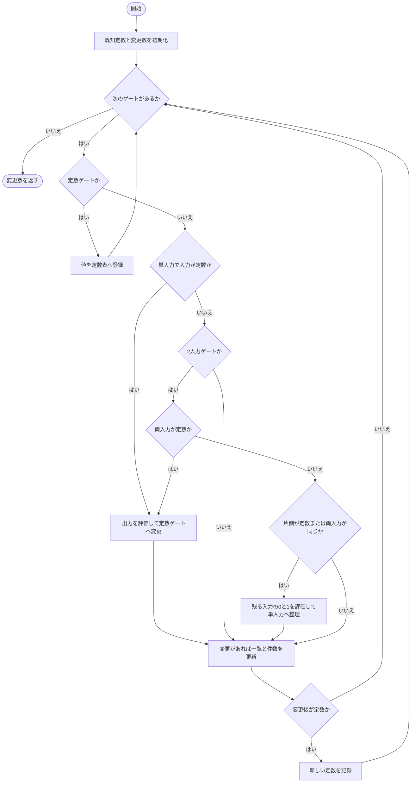

### 戻り値

型：`int`

変更したゲート数。

### 状態の変更・ファイル出力

- data.gatesの演算と入力を変更します。出力IDは保持します。

### ソースコード

<details>
<summary>\_fold\_constants() の実装を開く</summary>

```python
def _fold_constants(data: CircuitData) -> int:
    """既知の定数入力と同一入力の論理式だけを定数・配線・NOTへ畳み込む。"""
    constants: dict[int, bool] = {}
    changed = 0
    for index, gate in enumerate(data.gates):
        new_gate = gate
        if gate.op in _CONSTANTS:
            constants[gate.output_id] = _CONSTANTS[gate.op]
            continue
        if len(gate.input_ids) == 1 and gate.input_ids[0] in constants:
            value    = _bit(gate.op, constants[gate.input_ids[0]])
            new_gate = Gate(gate.output_id, GateOp.CONST_TRUE if value else GateOp.CONST_FALSE, ())
        elif len(gate.input_ids) == 2:
            left, right = gate.input_ids
            if left in constants and right in constants:
                value    = _bit(gate.op, constants[left], constants[right])
                new_gate = Gate(gate.output_id, GateOp.CONST_TRUE if value else GateOp.CONST_FALSE, ())
            elif left in constants:
                new_gate = _unary(gate.output_id, right, _bit(gate.op, constants[left], False), _bit(gate.op, constants[left], True))
            elif right in constants:
                new_gate = _unary(gate.output_id, left, _bit(gate.op, False, constants[right]), _bit(gate.op, True, constants[right]))
            elif left == right:
                new_gate = _unary(gate.output_id, left, _bit(gate.op, False, False), _bit(gate.op, True, True))
        if new_gate != gate:
            data.gates[index] = new_gate
            changed += 1
        if new_gate.op in _CONSTANTS:
            constants[new_gate.output_id] = _CONSTANTS[new_gate.op]
    return changed
```

</details>

{/* function: _bypass_wires@140 */}

## \_bypass\_wires() {/* #bypass-wires */}

```python
def _bypass_wires(data: CircuitData) -> int:
```

### 機能概要

WIREの出力参照を入力信号へ直接つなぎ替えます。依存順に置換辞書を作ることで、WIREが連続する場合も元の信号まで解決してから削除します。

### 引数

| 引数 | 型 | 既定値 | 説明 |
|---|---|---|---|
| `data` | `CircuitData` | `必須` | 簡略化対象のCircuitData。この関数は同じオブジェクトの一覧を更新します。 |

### 処理の流れ

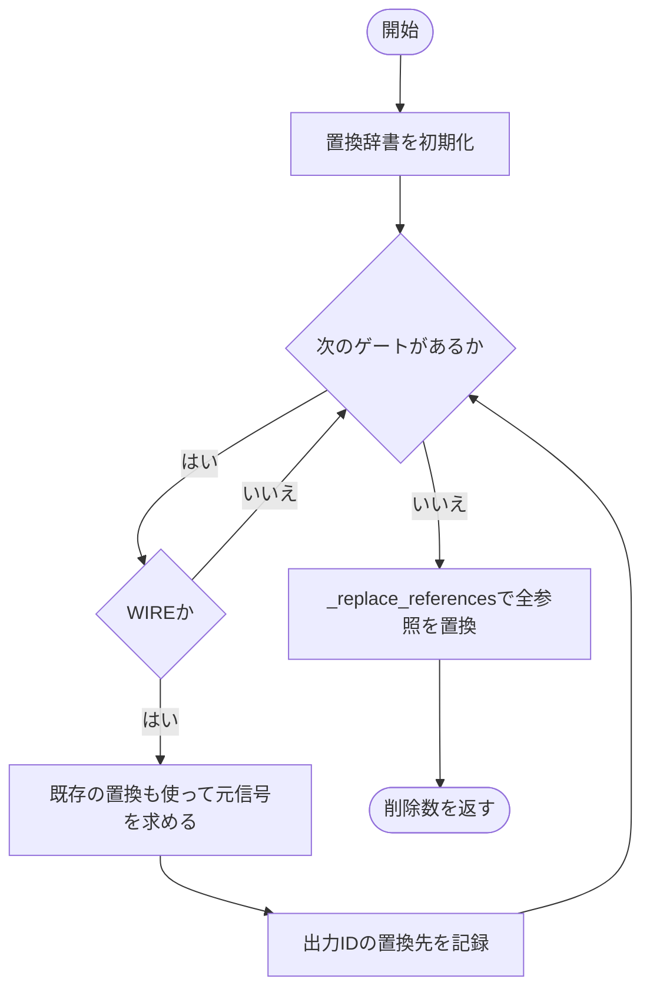

### 戻り値

型：`int`

削除したWIREの件数。

### 状態の変更・ファイル出力

- WIREを削除し、論理入力・集約入力・数値出力・生ビット対応を更新します。

### ソースコード

<details>
<summary>\_bypass\_wires() の実装を開く</summary>

```python
def _bypass_wires(data: CircuitData) -> int:
    """依存順のWIRE鎖を元の信号へ解決し、出力位置を維持して削除する。"""
    replacements = {}
    for gate in data.gates:
        if gate.op is GateOp.WIRE:
            replacements[gate.output_id] = replacements.get(gate.input_ids[0], gate.input_ids[0])
    return _replace_references(data, replacements)
```

</details>

{/* function: _remove_duplicates@149 */}

## \_remove\_duplicates() {/* #remove-duplicates */}

```python
def _remove_duplicates(data: CircuitData) -> int:
```

### 機能概要

同じ演算と入力を持つゲートを最初のゲートへ共有化します。AND・OR・XORとそれらの出力反転は入力順を正規化しますが、片側だけを否定する演算では左右を入れ替えません。

### 引数

| 引数 | 型 | 既定値 | 説明 |
|---|---|---|---|
| `data` | `CircuitData` | `必須` | 簡略化対象のCircuitData。この関数は同じオブジェクトの一覧を更新します。 |

### 処理の流れ

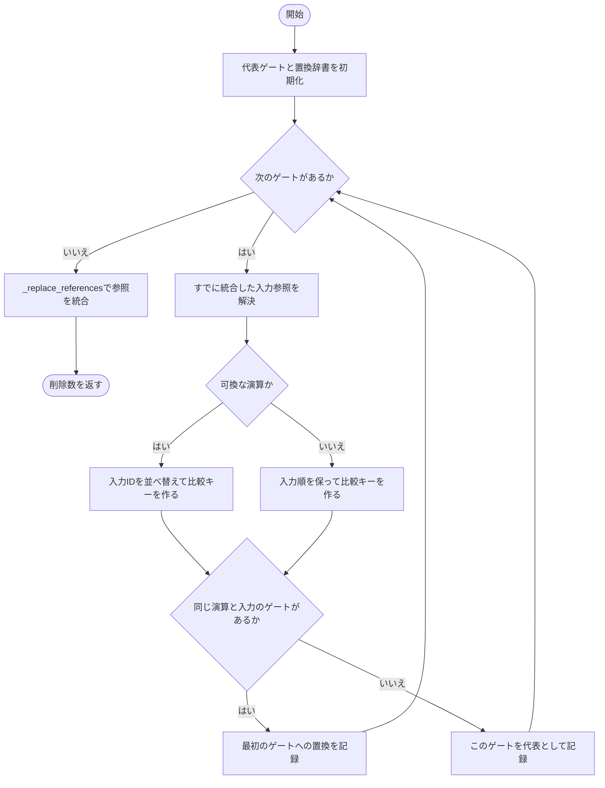

### 戻り値

型：`int`

共有化して削除したゲート数。

### 状態の変更・ファイル出力

- 同値ゲートを削除し、すべての出力対応を含めて参照を更新します。

### ソースコード

<details>
<summary>\_remove\_duplicates() の実装を開く</summary>

```python
def _remove_duplicates(data: CircuitData) -> int:
    """同じ演算と接続のgateを共有し、可換でない入力の左右は入れ替えない。"""
    canonical: dict[tuple[GateOp, tuple[int, ...]], int] = {}
    replacements = {}
    for gate in data.gates:
        input_ids = tuple(replacements.get(value, value) for value in gate.input_ids)
        key_ids   = tuple(sorted(input_ids)) if gate.op in _COMMUTATIVE else input_ids
        key       = (gate.op, key_ids)
        if key in canonical:
            replacements[gate.output_id] = canonical[key]
        else:
            canonical[key] = gate.output_id
    return _replace_references(data, replacements)
```

</details>

{/* function: _fold_sum_constants@164 */}

## \_fold\_sum\_constants() {/* #fold-sum-constants */}

```python
def _fold_sum_constants(data: CircuitData) -> int:
```

### 機能概要

整数dtypeの集約から定数ビットを取り除き、1の出現数だけを同じdtypeの先頭ADDへ移します。元の数値演算列はその後ろに保ち、浮動小数点のsumは変更しません。

### 引数

| 引数 | 型 | 既定値 | 説明 |
|---|---|---|---|
| `data` | `CircuitData` | `必須` | 簡略化対象のCircuitData。この関数は同じオブジェクトの一覧を更新します。 |

### 処理の流れ

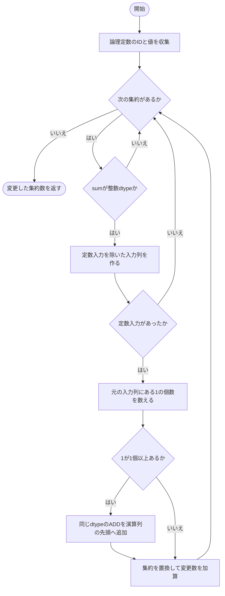

### 戻り値

型：`int`

入力や演算列を変更した集約数。

### 状態の変更・ファイル出力

- data.reductionsの入力列と数値演算列を更新します。

### 例外・注意事項

- logical_outputsは変更しないため、集約から取り除いた定数ビットもVerilogの生出力として保持できます。
- 同じ定数IDの重複も元の加算回数として数えます。定数0だけの場合はADDを追加しません。

### ソースコード

<details>
<summary>\_fold\_sum\_constants() の実装を開く</summary>

```python
def _fold_sum_constants(data: CircuitData) -> int:
    """整数sum内の定数を同dtypeの先頭ADDへ移し、元の数値演算列を保つ。"""
    constants = {gate.output_id: _CONSTANTS[gate.op] for gate in data.gates if gate.op in _CONSTANTS}
    changed   = 0
    for index, reduction in enumerate(data.reductions):
        if reduction.dtype not in _INTEGER_DTYPES:
            continue
        input_ids = tuple(value for value in reduction.input_ids if value not in constants)
        if len(input_ids) == len(reduction.input_ids):
            continue
        true_count = sum(constants.get(value, False) for value in reduction.input_ids)
        operations = reduction.operations
        if true_count:
            addition   = ScalarOperation(ScalarOp.ADD, reduction.dtype, ScalarConstant(true_count))
            operations = (addition,) + operations
        data.reductions[index] = replace(reduction, input_ids=input_ids, operations=operations)
        changed += 1
    return changed
```

</details>

{/* function: simplify@187 */}

## simplify() {/* #simplify */}

```python
def simplify(data: CircuitData, *, max_passes: int = 1000) -> None:
```

### 機能概要

6種類の簡略化処理を固定順で繰り返し、1巡で変更がなくなるまで続けます。開始時と収束時に回路を検証し、巡回上限までに収束しなければ例外を送出します。

### 引数

| 引数 | 型 | 既定値 | 説明 |
|---|---|---|---|
| `data` | `CircuitData` | `必須` | 簡略化対象のCircuitData。この関数は同じオブジェクトの一覧を更新します。 |
| `max_passes` | `int` | `1000` | 全6処理を実行する巡回回数の上限。boolではない正のPython整数。 |

### 処理の流れ

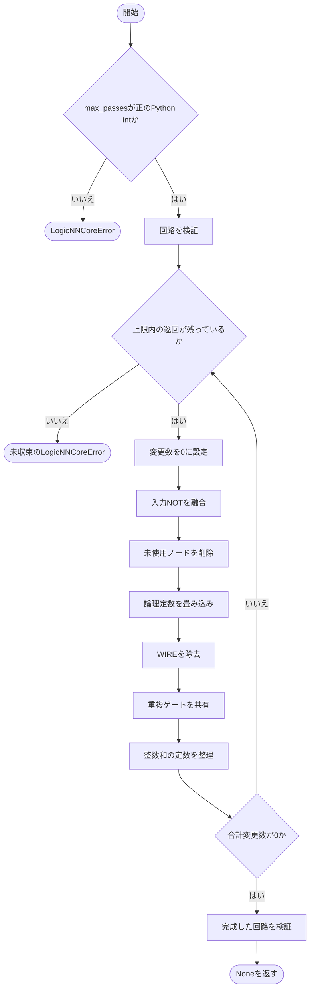

### 戻り値

型：`None`

収束して検証を通過するとNone。無効な上限や未収束の場合はLogicNNCoreError。

### 状態の変更・ファイル出力

- dataを直接簡略化します。失敗した場合も、この関数内では変更を巻き戻しません。

### 例外・注意事項

- 数値演算の一括結合や浮動小数点sumの定数吸収は行いません。
- 最終巡回で変更があった場合は、結果が実際には安定していても次の確認巡回ができないため未収束として報告します。

### ソースコード

<details>
<summary>simplify() の実装を開く</summary>

```python
def simplify(data: CircuitData, *, max_passes: int = 1000) -> None:
    """候補IRの開始時と完了時だけ検証し、変更がなくなるまで固定順で簡略化する。"""
    if type(max_passes) is not int or max_passes <= 0:
        raise LogicNNCoreError("simplify: max_passesは正のPython intが必要です", detail=f"max_passes={max_passes!r}", hint="bool以外の正整数を指定してください")
    validate_circuit(data)
    for _ in range(max_passes):
        changed = 0
        for run_pass in _PASSES:
            changed += run_pass(data)
        if not changed:
            validate_circuit(data)
            return
    raise LogicNNCoreError(
        "simplify: max_passes以内に簡略化が収束しませんでした", detail=f"max_passes={max_passes}",
        hint="巡回上限を増やしてください。元のCircuitを保持したまま、簡略化処理を確認してください",
    )
```

</details>

## 関連ファイル

- [utils/logicNN_core/src/logicnn_core/circuit/types.py](/code-reference/utils/logicNN_core/src/logicnn_core/circuit/types)
- [utils/logicNN_core/src/logicnn_core/circuit/validation.py](/code-reference/utils/logicNN_core/src/logicnn_core/circuit/validation)
- [utils/logicNN_core/src/logicnn_core/exceptions.py](/code-reference/utils/logicNN_core/src/logicnn_core/exceptions)
