# validation.py

`utils/logicNN_core/src/logicnn_core/circuit/validation.py`

外部から読み込んだ回路や変換した回路の構造を検証します。型、信号IDの一意性、依存順、数値演算、最終出力と生ビット対応を確認します。誤りを自動修正せず、順序と重複を維持したまま不正箇所を報告します。

{/* source-sha256: eba38897fca2a56f19896882adbcd240894eab4345f837618c8f47c42a8ef787 */}

{/* function: _fail@22 */}

## \_fail() {/* #fail */}

```python
def _fail(target: str, message: str, hint: str) -> NoReturn:
```

### 機能概要

検証項目、問題の内容、修正方法を含むLogicNNCoreErrorを送出します。

### 引数

| 引数 | 型 | 既定値 | 説明 |
|---|---|---|---|
| `target` | `str` | `必須` | 不正な場合に位置を示す項目名。 |
| `message` | `str` | `必須` | 検出した問題。 |
| `hint` | `str` | `必須` | 修正の手掛かり。 |

### 処理の流れ

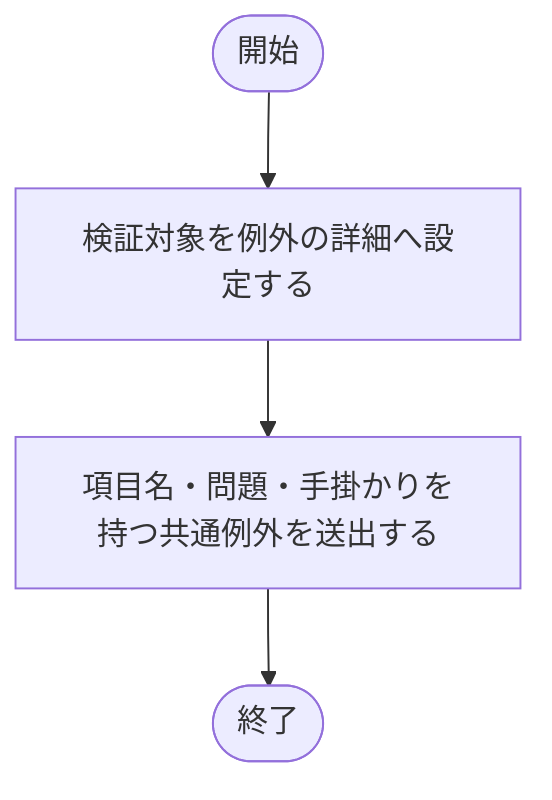

### 戻り値

型：`NoReturn`

返りません。必ずLogicNNCoreErrorを送出します。

### ソースコード

<details>
<summary>\_fail() の実装を開く</summary>

```python
def _fail(target: str, message: str, hint: str) -> NoReturn:
    """不正箇所と修正方針を含む回路検証用の共通例外を送出する。"""
    raise LogicNNCoreError(f"{target}: {message}", detail=f"回路IR検証対象: {target}", hint=hint)
```

</details>

{/* function: _validate_id@27 */}

## \_validate\_id() {/* #validate-id */}

```python
def _validate_id(value: object, target: str) -> int:
```

### 機能概要

信号IDが0以上のPython整数かを確認します。boolやfloatを整数へ暗黙変換することはありません。

### 引数

| 引数 | 型 | 既定値 | 説明 |
|---|---|---|---|
| `value` | `object` | `必須` | 検証する信号ID。 |
| `target` | `str` | `必須` | 不正な場合に位置を示す項目名。 |

### 処理の流れ

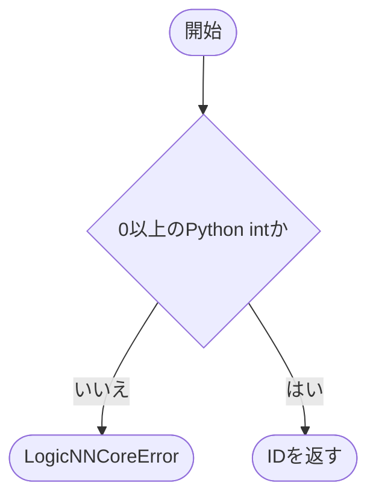

### 戻り値

型：`int`

検証済みのPython int。元の値を返します。

### ソースコード

<details>
<summary>\_validate\_id() の実装を開く</summary>

```python
def _validate_id(value: object, target: str) -> int:
    """node IDをboolではない0以上のPython整数に限定する。"""
    if type(value) is not int or value < 0:
        _fail(target, f"IDは0以上の整数が必要です: {value!r}", "boolやfloatへ変換せず、0以上のPython intを指定してください")
    return value
```

</details>

{/* function: _validate_shape@34 */}

## \_validate\_shape() {/* #validate-shape */}

```python
def _validate_shape(value: object, target: str) -> int:
```

### 機能概要

形状が非空のtupleで、各軸が正のPython整数かを確認します。形状からバッチ軸を除く処理はしないため、呼び出し側でバッチを除いて渡します。

### 引数

| 引数 | 型 | 既定値 | 説明 |
|---|---|---|---|
| `value` | `object` | `必須` | バッチ軸を除いた形状。 |
| `target` | `str` | `必須` | 不正な場合に位置を示す項目名。 |

### 処理の流れ

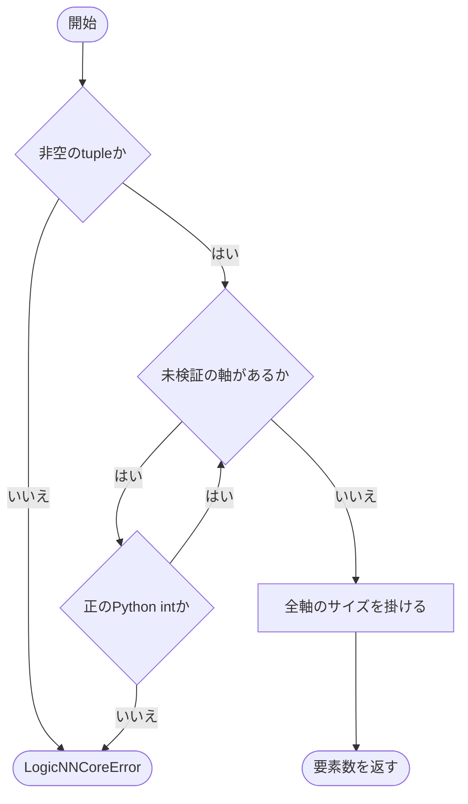

### 戻り値

型：`int`

全軸の積、すなわち1標本の要素数。

### ソースコード

<details>
<summary>\_validate\_shape() の実装を開く</summary>

```python
def _validate_shape(value: object, target: str) -> int:
    """batchを含まない正整数tupleを検証し、要素数の積を返す。"""
    if not isinstance(value, tuple) or not value:
        _fail(target, "shapeは非空tupleが必要です", "batchを除いた正整数のtupleを指定してください")
    for index, size in enumerate(value):
        if type(size) is not int or size <= 0:
            _fail(f"{target}[{index}]", f"各軸には正の整数が必要です: {size!r}", "boolや0を含めず、正のPython intでshapeを指定してください")
    return math.prod(value)
```

</details>

{/* function: normalize_input_shape@44 */}

## normalize\_input\_shape() {/* #normalize-input-shape */}

```python
def normalize_input_shape(input_shape: Sequence[int]) -> tuple[int, ...]:
```

### 機能概要

生成APIが受け取るlistやtupleなどの形状を、IRで共通使用するtupleへ変換します。文字列・bytesは受け付けず、変換後の各軸も検証します。

### 引数

| 引数 | 型 | 既定値 | 説明 |
|---|---|---|---|
| `input_shape` | `Sequence[int]` | `必須` | バッチを除いた正整数のSequence。 |

### 処理の流れ

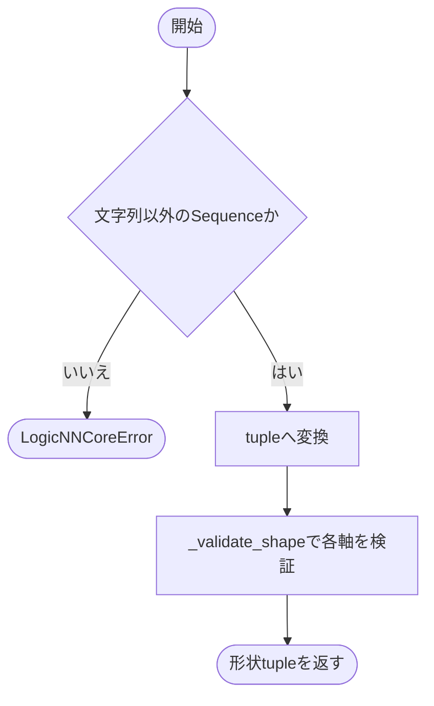

### 戻り値

型：`tuple[int, ...]`

非空の正整数tuple。

### ソースコード

<details>
<summary>normalize\_input\_shape() の実装を開く</summary>

```python
def normalize_input_shape(input_shape: Sequence[int]) -> tuple[int, ...]:
    """生成APIの正整数Sequenceを検証し、IRで使用する非空tupleへそろえる。"""
    if isinstance(input_shape, (str, bytes)) or not isinstance(input_shape, Sequence):
        _fail("input_shape", "shapeは文字列ではないSequenceが必要です", "batchを除いた正整数のlistやtupleを指定してください")
    shape = tuple(input_shape)
    _validate_shape(shape, "input_shape")
    return shape
```

</details>

{/* function: _validate_ids@53 */}

## \_validate\_ids() {/* #validate-ids */}

```python
def _validate_ids(values: object, target: str) -> tuple[int, ...]:
```

### 機能概要

信号参照の一覧がtupleで、すべての要素が有効な非負IDかを確認します。順序と重複をそのまま保持し、空tupleもこの段階では許可します。

### 引数

| 引数 | 型 | 既定値 | 説明 |
|---|---|---|---|
| `values` | `object` | `必須` | 検証する信号IDのtuple。 |
| `target` | `str` | `必須` | 不正な場合に位置を示す項目名。 |

### 処理の流れ

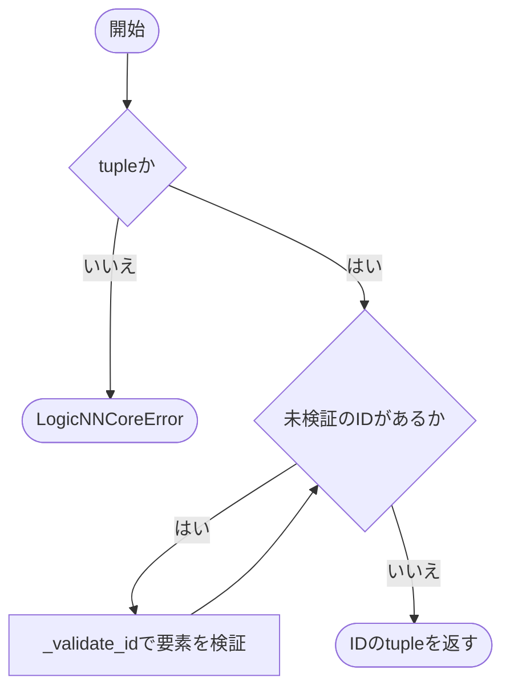

### 戻り値

型：`tuple[int, ...]`

検証済みの元のtuple。

### ソースコード

<details>
<summary>\_validate\_ids() の実装を開く</summary>

```python
def _validate_ids(values: object, target: str) -> tuple[int, ...]:
    """node内の参照一覧が整数IDだけを含むtupleであることを確認する。"""
    if not isinstance(values, tuple):
        _fail(target, "参照一覧はtupleが必要です", "順序と重複を保持したtupleでnode IDを指定してください")
    for index, value in enumerate(values):
        _validate_id(value, f"{target}[{index}]")
    return values
```

</details>

{/* function: _validate_new_id@62 */}

## \_validate\_new\_id() {/* #validate-new-id */}

```python
def _validate_new_id(value: object, target: str, input_count: int, defined: set[int]) -> int:
```

### 機能概要

新しいノードの出力IDが入力信号の予約領域や既存ノードと重複しないかを確認します。集合への登録は呼び出し側で行います。

### 引数

| 引数 | 型 | 既定値 | 説明 |
|---|---|---|---|
| `value` | `object` | `必須` | 新しいノードの出力ID。 |
| `target` | `str` | `必須` | 不正な場合に位置を示す項目名。 |
| `input_count` | `int` | `必須` | 入力形状の要素数。0以上input_count未満のIDは入力信号を表します。 |
| `defined` | `set[int]` | `必須` | すでに定義済みのノードID集合。 |

### 処理の流れ

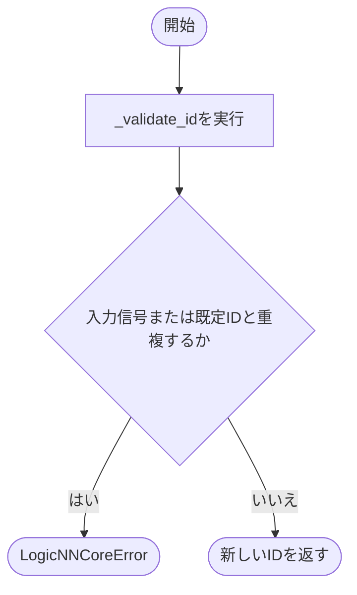

### 戻り値

型：`int`

検証済みの新しいID。

### ソースコード

<details>
<summary>\_validate\_new\_id() の実装を開く</summary>

```python
def _validate_new_id(value: object, target: str, input_count: int, defined: set[int]) -> int:
    """新しいoutput IDが入力wireや既定nodeと衝突しないことを確認する。"""
    output_id = _validate_id(value, target)
    if output_id < input_count or output_id in defined:
        _fail(target, f"ID {output_id} は既に定義されています", "入力wire・gate・reductionで重複しないoutput IDを割り当ててください")
    return output_id
```

</details>

{/* function: _validate_bit_references@70 */}

## \_validate\_bit\_references() {/* #validate-bit-references */}

```python
def _validate_bit_references(values: tuple[int, ...], target: str, input_count: int, gate_ids: set[int]) -> None:
```

### 機能概要

各IDが入力信号、またはすでに処理した論理ゲートを参照しているか確認します。未定義・前方・循環参照や、加算結果を論理ビットとして使う参照を拒否します。

### 引数

| 引数 | 型 | 既定値 | 説明 |
|---|---|---|---|
| `values` | `tuple[int, ...]` | `必須` | 型と非負性を検証済みの参照ID tuple。 |
| `target` | `str` | `必須` | 不正な場合に位置を示す項目名。 |
| `input_count` | `int` | `必須` | 入力形状の要素数。0以上input_count未満のIDは入力信号を表します。 |
| `gate_ids` | `set[int]` | `必須` | 参照可能な先行論理ゲートの出力ID集合。 |

### 処理の流れ

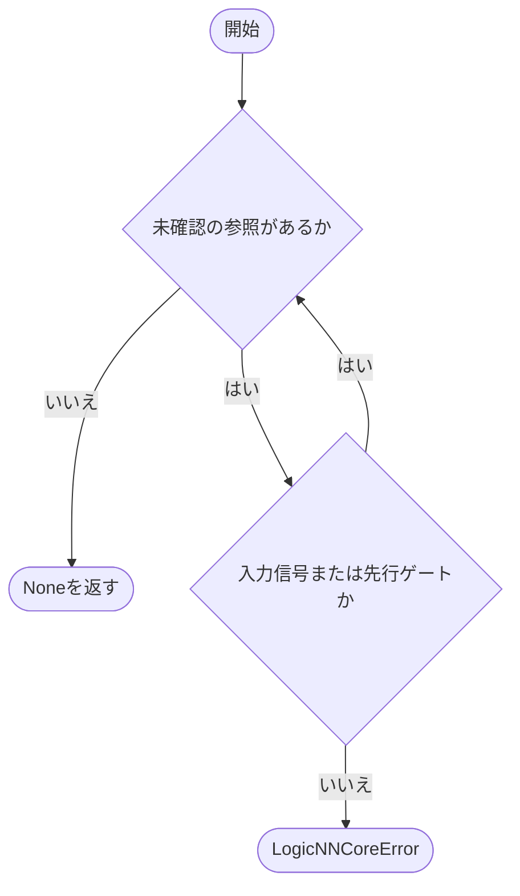

### 戻り値

型：`None`

None。

### ソースコード

<details>
<summary>\_validate\_bit\_references() の実装を開く</summary>

```python
def _validate_bit_references(values: tuple[int, ...], target: str, input_count: int, gate_ids: set[int]) -> None:
    """各参照を入力wireまたは既に定義済みの論理gateへ限定する。"""
    for index, value in enumerate(values):
        if value >= input_count and value not in gate_ids:
            _fail(
                f"{target}[{index}]", f"ID {value} は参照可能な論理bitではありません",
                "入力wireか先行gateを参照してください。未定義・前方・循環参照やreduction結果は指定できません",
            )
```

</details>

{/* function: _validate_gate@80 */}

## \_validate\_gate() {/* #validate-gate */}

```python
def _validate_gate(gate: Gate, index: int, input_count: int, gate_ids: set[int]) -> None:
```

### 機能概要

論理ゲートの型、出力ID、演算の入力本数、参照先の依存順を確認します。検証をすべて通過してからgate_idsへ出力IDを追加します。

### 引数

| 引数 | 型 | 既定値 | 説明 |
|---|---|---|---|
| `gate` | `Gate` | `必須` | 検証するGate。 |
| `index` | `int` | `必須` | gates一覧内の位置。エラーの表示に使います。 |
| `input_count` | `int` | `必須` | 入力形状の要素数。0以上input_count未満のIDは入力信号を表します。 |
| `gate_ids` | `set[int]` | `必須` | 検証済みの論理ゲートID集合。成功時にこのゲートのIDを追加します。 |

### 処理の流れ

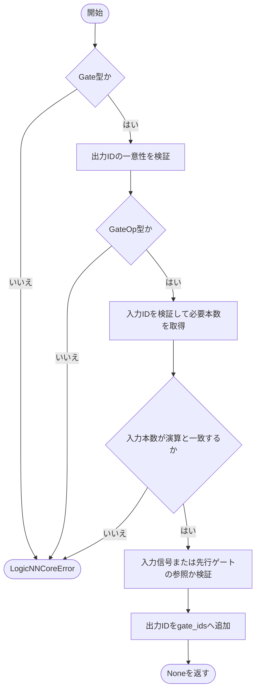

### 戻り値

型：`None`

None。

### 状態の変更・ファイル出力

- 検証成功時にgate_idsを更新します。

### ソースコード

<details>
<summary>\_validate\_gate() の実装を開く</summary>

```python
def _validate_gate(gate: Gate, index: int, input_count: int, gate_ids: set[int]) -> None:
    """gateの型・演算・入力本数と依存順を検証し、出力IDを登録する。"""
    target = f"gates[{index}]"
    if not isinstance(gate, Gate):
        _fail(target, "nodeはGate型が必要です", "JSON等の外部データをGateへ変換してから検証してください")
    output_id = _validate_new_id(gate.output_id, f"{target}.output_id", input_count, gate_ids)
    if not isinstance(gate.op, GateOp):
        _fail(f"{target}.op", f"未対応の演算です: {gate.op!r}", "正式なGateOpを指定し、NOT_A/NOT_Bは入力位置を正規化してください")
    input_ids = _validate_ids(gate.input_ids, f"{target}.input_ids")
    arity     = _ARITIES[gate.op]
    if len(input_ids) != arity:
        _fail(f"{target}.input_ids", f"{gate.op.value} の入力本数は {arity} 本です: {len(input_ids)}", "演算に対応する本数の入力IDを指定してください")
    _validate_bit_references(input_ids, f"{target}.input_ids", input_count, gate_ids)
    gate_ids.add(output_id)
```

</details>

{/* function: _validate_number@96 */}

## \_validate\_number() {/* #validate-number */}

```python
def _validate_number(value: object, target: str) -> None:
```

### 機能概要

定数がPythonのintまたはfloatで、有限値として扱えるかを確認します。非常に大きな整数によってmath.isfiniteがOverflowErrorとなる場合も、不正な数値として報告します。

### 引数

| 引数 | 型 | 既定値 | 説明 |
|---|---|---|---|
| `value` | `object` | `必須` | 検証する数値。 |
| `target` | `str` | `必須` | 不正な場合に位置を示す項目名。 |

### 処理の流れ

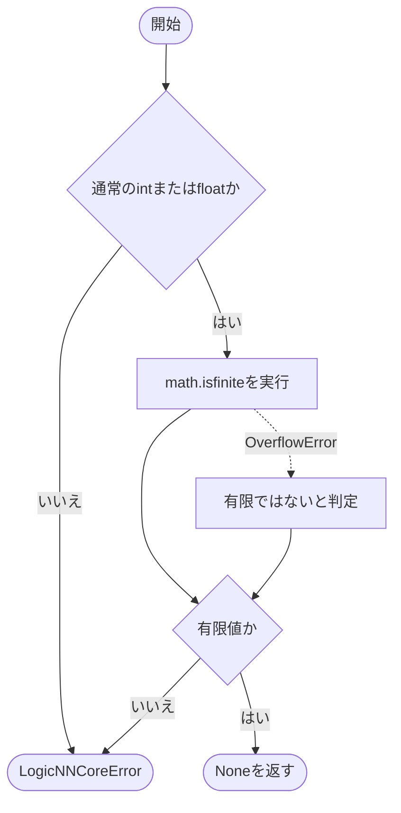

### 戻り値

型：`None`

None。元の値の型や符号付き0は変更しません。

### ソースコード

<details>
<summary>\_validate\_number() の実装を開く</summary>

```python
def _validate_number(value: object, target: str) -> None:
    """数値定数を有限なPython int/floatに限定し、型や符号付き0を変えない。"""
    if type(value) not in (int, float):
        _fail(target, f"有限の実数が必要です: {value!r}", "boolではない有限のintまたはfloatを指定してください")
    try:
        finite = math.isfinite(value)
    except OverflowError:
        finite = False
    if not finite:
        _fail(target, f"有限値が必要です: {value!r}", "有限のPython intまたはfloatを指定してください")
```

</details>

{/* function: _validate_dtype@108 */}

## \_validate\_dtype() {/* #validate-dtype */}

```python
def _validate_dtype(value: object, target: str) -> None:
```

### 機能概要

型情報が正式なTensorDTypeのメンバーかを確認します。文字列からEnumへの変換はこの関数では行いません。

### 引数

| 引数 | 型 | 既定値 | 説明 |
|---|---|---|---|
| `value` | `object` | `必須` | 検証するdtype。 |
| `target` | `str` | `必須` | 不正な場合に位置を示す項目名。 |

### 処理の流れ

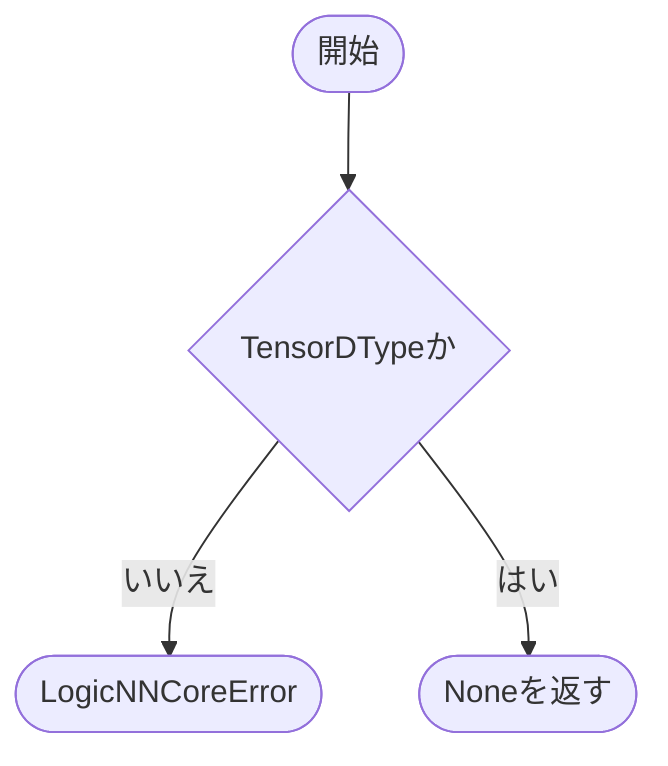

### 戻り値

型：`None`

None。

### ソースコード

<details>
<summary>\_validate\_dtype() の実装を開く</summary>

```python
def _validate_dtype(value: object, target: str) -> None:
    """dtypeを文字列から暗黙変換せず正式なTensorDTypeとして検証する。"""
    if not isinstance(value, TensorDType):
        _fail(target, f"TensorDTypeが必要です: {value!r}", "対応するbool・整数・浮動小数点型をTensorDTypeで指定してください")
```

</details>

{/* function: _validate_rank@114 */}

## \_validate\_rank() {/* #validate-rank */}

```python
def _validate_rank(value: object, target: str) -> None:
```

### 機能概要

Tensorの次元数が0以上のPython整数かを確認します。0はscalar Tensorの次元数として有効です。

### 引数

| 引数 | 型 | 既定値 | 説明 |
|---|---|---|---|
| `value` | `object` | `必須` | 検証するTensorの次元数。 |
| `target` | `str` | `必須` | 不正な場合に位置を示す項目名。 |

### 処理の流れ

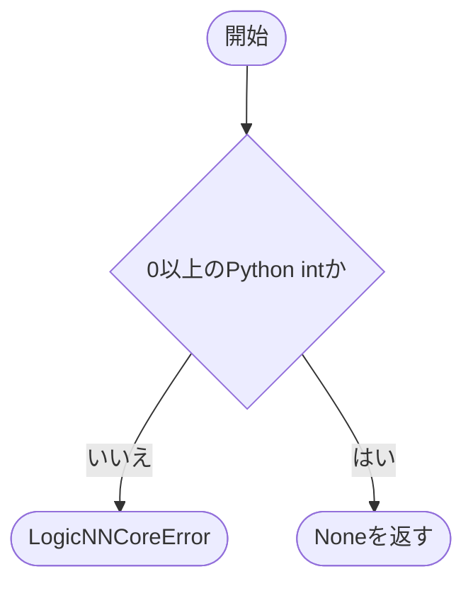

### 戻り値

型：`None`

None。

### ソースコード

<details>
<summary>\_validate\_rank() の実装を開く</summary>

```python
def _validate_rank(value: object, target: str) -> None:
    """型昇格に必要なTensor rankを0以上のPython整数として検証する。"""
    if type(value) is not int or value < 0:
        _fail(target, f"rankは0以上の整数が必要です: {value!r}", "boolやfloatではなく、元TensorのrankをPython intで指定してください")
```

</details>

{/* function: _validate_scalar@120 */}

## \_validate\_scalar() {/* #validate-scalar */}

```python
def _validate_scalar(operand: object, target: str) -> None:
```

### 機能概要

ScalarConstantの値、次元数、元Tensorのdtypeの組合せを確認します。Python数値はtensor_dtype=Noneかつ次元数0とし、整数・bool Tensorの定数値は元の型の表現範囲内であることを要求します。

### 引数

| 引数 | 型 | 既定値 | 説明 |
|---|---|---|---|
| `operand` | `object` | `必須` | 検証するScalarConstant。 |
| `target` | `str` | `必須` | 不正な場合に位置を示す項目名。 |

### 処理の流れ

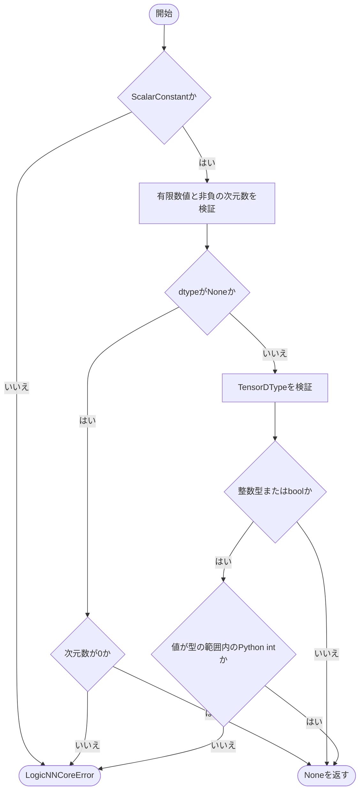

### 戻り値

型：`None`

None。

### ソースコード

<details>
<summary>\_validate\_scalar() の実装を開く</summary>

```python
def _validate_scalar(operand: object, target: str) -> None:
    """scalar定数の型・有限性・Tensor dtypeとrankの組合せを検証する。"""
    if not isinstance(operand, ScalarConstant):
        _fail(target, "operandはScalarConstant型が必要です", "Python数値か1要素Tensorの値と元dtype・rankを保存してください")
    _validate_number(operand.value, f"{target}.value")
    _validate_rank(operand.tensor_ndim, f"{target}.tensor_ndim")
    if operand.tensor_dtype is None:
        if operand.tensor_ndim != 0:
            _fail(f"{target}.tensor_ndim", "Python scalarのtensor_ndimは0が必要です", "Tensorの場合は元のtensor_dtypeも指定してください")
        return
    _validate_dtype(operand.tensor_dtype, f"{target}.tensor_dtype")
    if operand.tensor_dtype in _INTEGER_RANGES:
        lower, upper = _INTEGER_RANGES[operand.tensor_dtype]
        if type(operand.value) is not int or not lower <= operand.value <= upper:
            _fail(f"{target}.value", f"{operand.tensor_dtype.value}の整数範囲を満たしません", "元Tensorの値を、dtype範囲内のPython intとして保存してください")
```

</details>

{/* function: _validate_operation@137 */}

## \_validate\_operation() {/* #validate-operation */}

```python
def _validate_operation(operation: object, target: str) -> None:
```

### 機能概要

数値演算の種類、結果のdtype、入力次元数、alpha、左右指定を検証します。CASTは定数や左右指定を持たず、alphaを1以外にできるのはADD・SUBだけです。

### 引数

| 引数 | 型 | 既定値 | 説明 |
|---|---|---|---|
| `operation` | `object` | `必須` | 検証するScalarOperation。 |
| `target` | `str` | `必須` | 不正な場合に位置を示す項目名。 |

### 処理の流れ

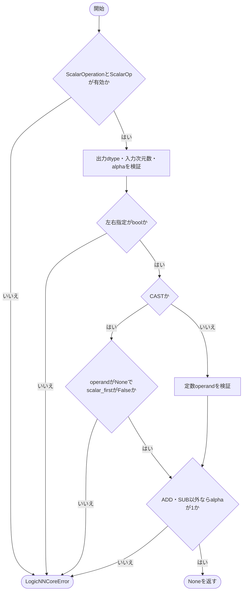

### 戻り値

型：`None`

None。

### ソースコード

<details>
<summary>\_validate\_operation() の実装を開く</summary>

```python
def _validate_operation(operation: object, target: str) -> None:
    """1段の数値演算を検証し、左右関係や中間型を省略・統合しない。"""
    if not isinstance(operation, ScalarOperation):
        _fail(target, "演算はScalarOperation型が必要です", "元の演算順にScalarOperationを保存してください")
    if not isinstance(operation.op, ScalarOp):
        _fail(f"{target}.op", f"未対応のscalar演算です: {operation.op!r}", "正式なScalarOpでadd・sub・mul・div・castを指定してください")
    _validate_dtype(operation.output_dtype, f"{target}.output_dtype")
    _validate_rank(operation.input_ndim, f"{target}.input_ndim")
    _validate_number(operation.alpha, f"{target}.alpha")
    if type(operation.scalar_first) is not bool:
        _fail(f"{target}.scalar_first", "左右指定はboolが必要です", "元の演算でscalarが左辺ならTrue、右辺ならFalseを指定してください")
    if operation.op is ScalarOp.CAST:
        if operation.operand is not None:
            _fail(f"{target}.operand", "castはoperandを持ちません", "型変換だけをoperand=Noneで保存してください")
        if operation.scalar_first:
            _fail(f"{target}.scalar_first", "castにoperandの左右指定はありません", "castではscalar_first=Falseを指定してください")
    else:
        _validate_scalar(operation.operand, f"{target}.operand")
    if operation.op not in (ScalarOp.ADD, ScalarOp.SUB) and operation.alpha != 1:
        _fail(f"{target}.alpha", "add/sub以外のalphaは1が必要です", "mul・div・castではalpha=1を指定してください")
```

</details>

{/* function: _validate_reduction@159 */}

## \_validate\_reduction() {/* #validate-reduction */}

```python
def _validate_reduction(reduction: SumReduction, index: int, input_count: int, gate_ids: set[int], defined: set[int]) -> None:
```

### 機能概要

集約が論理ビットだけを入力に持ち、指定dtypeで入力本数までの整数を正確に表現できるかを確認します。数値演算列も順に検証し、成功した場合に出力IDを登録します。

### 引数

| 引数 | 型 | 既定値 | 説明 |
|---|---|---|---|
| `reduction` | `SumReduction` | `必須` | 検証するSumReduction。 |
| `index` | `int` | `必須` | reductions一覧内の位置。 |
| `input_count` | `int` | `必須` | 入力形状の要素数。0以上input_count未満のIDは入力信号を表します。 |
| `gate_ids` | `set[int]` | `必須` | 参照可能な論理ゲートIDの集合。 |
| `defined` | `set[int]` | `必須` | すべての定義済みノードID集合。成功時に更新します。 |

### 処理の流れ

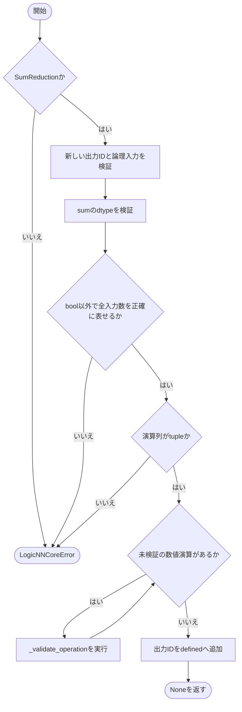

### 戻り値

型：`None`

None。

### 状態の変更・ファイル出力

- 検証成功時にdefinedを更新します。

### 例外・注意事項

- 浮動小数点型も、0から入力本数までの整数を誤差なく表せる範囲に制限します。入力が空の集約は許可され、0を表します。

### ソースコード

<details>
<summary>\_validate\_reduction() の実装を開く</summary>

```python
def _validate_reduction(reduction: SumReduction, index: int, input_count: int, gate_ids: set[int], defined: set[int]) -> None:
    """集約の論理入力・sum dtype・順序付き演算を検証し、出力IDを登録する。"""
    target = f"reductions[{index}]"
    if not isinstance(reduction, SumReduction):
        _fail(target, "nodeはSumReduction型が必要です", "集約nodeをSumReductionとして定義してください")
    output_id = _validate_new_id(reduction.output_id, f"{target}.output_id", input_count, defined)
    input_ids = _validate_ids(reduction.input_ids, f"{target}.input_ids")
    _validate_bit_references(input_ids, f"{target}.input_ids", input_count, gate_ids)
    _validate_dtype(reduction.dtype, f"{target}.dtype")
    if reduction.dtype is TensorDType.BOOL:
        _fail(f"{target}.dtype", "boolは0/1の個数を表すsum dtypeとして未対応です", "全入力の個数を正確に表現できる整数または浮動小数点型を指定してください")
    if len(input_ids) > _EXACT_COUNT_LIMITS[reduction.dtype]:
        _fail(f"{target}.input_ids", f"{reduction.dtype.value}では全入力の個数を正確に表現できません", "overflowや丸めなしで0から入力本数を表せるsum dtypeを使用してください")
    if not isinstance(reduction.operations, tuple):
        _fail(f"{target}.operations", "演算一覧はtupleが必要です", "元の実行順を保ったScalarOperationのtupleを指定してください")
    for operation_index, operation in enumerate(reduction.operations):
        _validate_operation(operation, f"{target}.operations[{operation_index}]")
    defined.add(output_id)
```

</details>

{/* function: validate_circuit@179 */}

## validate\_circuit() {/* #validate-circuit */}

```python
def validate_circuit(data: CircuitData) -> None:
```

### 機能概要

CircuitData全体を読み取り、形状・一覧の型・出力件数・ゲートの依存順・集約・最終型・生ビットの対応を検証します。logical_outputsは最終数値出力ごとに1個必要で、それぞれ少なくとも1本の論理ビットを参照します。

### 引数

| 引数 | 型 | 既定値 | 説明 |
|---|---|---|---|
| `data` | `CircuitData` | `必須` | 検証するCircuitData。 |

### 処理の流れ

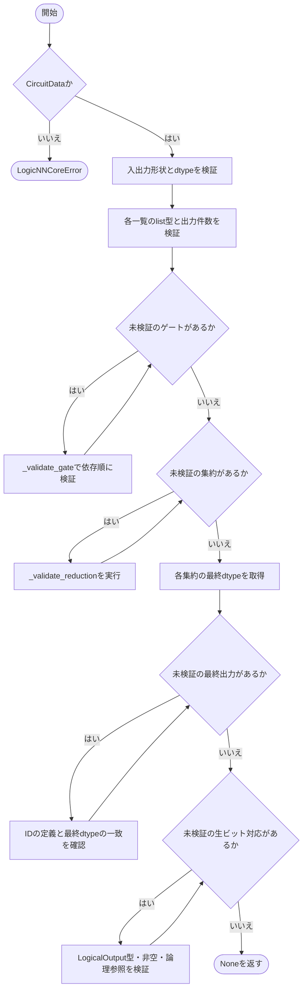

### 戻り値

型：`None`

None。最初に見つけた不正箇所でLogicNNCoreErrorを送出します。

### 例外・注意事項

- 図中の各検証処理は、不正な場合にLogicNNCoreErrorを送出します。
- 順序の並べ替え、重複の除去、値の補正はしません。型と参照が正しくても、実際の入力値に依存する数値演算の安全性を証明する検証ではありません。

### ソースコード

<details>
<summary>validate\_circuit() の実装を開く</summary>

```python
def validate_circuit(data: CircuitData) -> None:
    """IRの型・参照・出力対応を検証し、順序や重複を一切変更しない。"""
    if not isinstance(data, CircuitData):
        _fail("CircuitData", "検証対象はCircuitData型が必要です", "正式な回路IRへ変換してからvalidate_circuitを呼んでください")
    input_count  = _validate_shape(data.input_shape, "input_shape")
    output_count = _validate_shape(data.output_shape, "output_shape")
    _validate_dtype(data.output_dtype, "output_dtype")
    for name in ("gates", "reductions", "output_ids", "logical_outputs"):
        if not isinstance(getattr(data, name), list):
            _fail(name, "一覧はlistが必要です", "順序と重複を保持したlistで指定してください")
    for name in ("output_ids", "logical_outputs"):
        if len(getattr(data, name)) != output_count:
            _fail(name, f"件数はoutput_shapeの積 {output_count} と一致する必要があります", "各最終出力位置に出力IDと元の論理出力対応を1個ずつ保存してください")

    gate_ids: set[int] = set()
    for index, gate in enumerate(data.gates):
        _validate_gate(gate, index, input_count, gate_ids)
    defined = gate_ids.copy()
    for index, reduction in enumerate(data.reductions):
        _validate_reduction(reduction, index, input_count, gate_ids, defined)
    numeric_outputs = {reduction.output_id: reduction.operations[-1].output_dtype if reduction.operations else reduction.dtype for reduction in data.reductions}
    for index, value in enumerate(data.output_ids):
        output_id = _validate_id(value, f"output_ids[{index}]")
        if output_id >= input_count and output_id not in defined:
            _fail(f"output_ids[{index}]", f"ID {output_id} は未定義です", "入力wire・gate・reductionのいずれかの既定IDを指定してください")
        if output_id in numeric_outputs and numeric_outputs[output_id] is not data.output_dtype:
            _fail(f"output_ids[{index}]", "reductionの最終dtypeとoutput_dtypeが一致しません", "元の型変換をcast演算として保存し、最終Tensorのdtypeを一致させてください")
    for index, output in enumerate(data.logical_outputs):
        target = f"logical_outputs[{index}]"
        if not isinstance(output, LogicalOutput):
            _fail(target, "対応表の要素はLogicalOutput型が必要です", "元の最終出力ごとにLogicalOutputを作成してください")
        node_ids = _validate_ids(output.node_ids, f"{target}.node_ids")
        if not node_ids:
            _fail(f"{target}.node_ids", "元の論理出力対応は空にできません", "定数や重複を除去せず、集約前のbit対応を保存してください")
        _validate_bit_references(node_ids, f"{target}.node_ids", input_count, gate_ids)
```

</details>

## 関連ファイル

- [utils/logicNN_core/src/logicnn_core/circuit/types.py](/code-reference/utils/logicNN_core/src/logicnn_core/circuit/types)
- [utils/logicNN_core/src/logicnn_core/exceptions.py](/code-reference/utils/logicNN_core/src/logicnn_core/exceptions)
