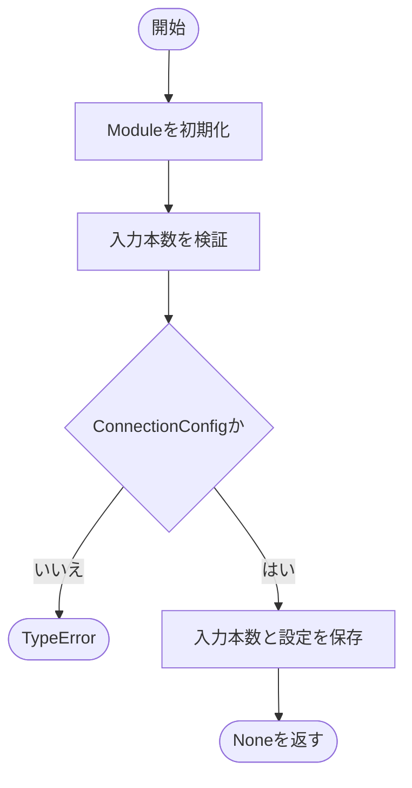
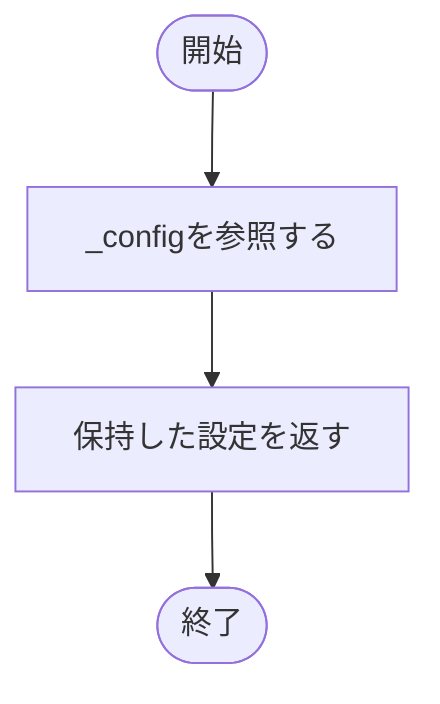
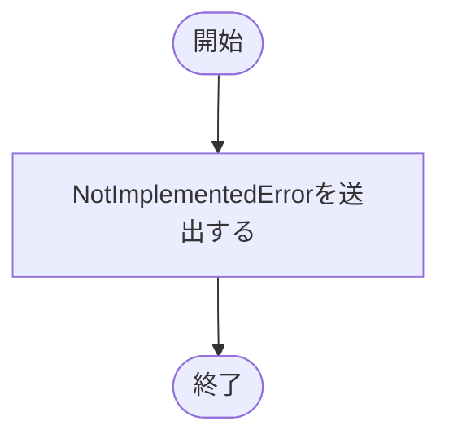

# base.py

`utils/logicNN_core/src/logicnn_core/connections/base.py`

接続クラスの共通基底を定義します。ゲートの入力本数と生成時の設定を保持し、具体的な入力選択方法は派生クラスに定義します。

{/* source-sha256: 6d9a85f6ea639f64be402e65b1cbd6b949a7a8c7c61c0716f67ead930cb8c9e0 */}

## Connections {/* #connections-class */}

PyTorchのModuleを継承する抽象基底クラスです。固定・学習可能接続の共通設定を保持します。forwardは抽象メソッドのため、このクラス単独ではインスタンス化できません。

継承元：`nn.Module, ABC`

{/* function: Connections.__init__@15 */}

## Connections.\_\_init\_\_() {/* #connections-init */}

```python
def __init__(self, num_inputs: int, config: ConnectionConfig) -> None:
```

### 機能概要

Moduleを初期化し、正の入力本数とConnectionConfigを保存します。接続位置を示すTensorは、派生クラスの初期化処理で生成します。

### 引数

| 引数 | 型 | 既定値 | 説明 |
|---|---|---|---|
| `num_inputs` | `int` | `必須` | 各ゲートの入力本数。正のPython整数。 |
| `config` | `ConnectionConfig` | `必須` | 接続方式・初期化方法などを指定するConnectionConfig。 |

### 処理の流れ



### 戻り値

型：`None`

None。

### 状態の変更・ファイル出力

- num_inputsと_configをインスタンスに設定します。

### 例外・注意事項

- 入力本数が不正な場合は、_validate_positive_integerが例外を送出します。

### ソースコード

<details>
<summary>Connections.\_\_init\_\_() の実装を開く</summary>

```python
def __init__(self, num_inputs: int, config: ConnectionConfig) -> None:
    """入力本数と設定型を検証し、生成時のconfigを保持する。"""
    super().__init__()
    _validate_positive_integer("num_inputs", num_inputs)
    if not isinstance(config, ConnectionConfig):
        raise TypeError("config はConnectionConfigで指定してください")
    self.num_inputs = num_inputs
    self._config    = config
```

</details>

{/* function: Connections.config@25 */}

## Connections.config()（プロパティ） {/* #connections-config */}

```python
def config(self) -> ConnectionConfig:
```

### 機能概要

生成時に保持した設定を返す読み取り専用プロパティです。接続の温度を別途更新しても、この設定オブジェクトは変えません。

### 引数

`self` 以外に指定する引数はありません。

### 処理の流れ



### 戻り値

型：`ConnectionConfig`

生成時のConnectionConfig。コピーは作りません。

### ソースコード

<details>
<summary>Connections.config() の実装を開く</summary>

```python
@property
def config(self) -> ConnectionConfig:
    """生成時の不変設定を返し、別設定への差替えを禁止する。"""
    return self._config
```

</details>

{/* function: Connections.forward@30 */}

## Connections.forward() {/* #connections-forward */}

```python
def forward(self, inputs: Tensor) -> Tensor:
```

### 機能概要

各ゲートへの入力選択処理を派生クラスに要求する抽象メソッドです。この定義には入力を選択する実装はありません。

### 引数

| 引数 | 型 | 既定値 | 説明 |
|---|---|---|---|
| `inputs` | `Tensor` | `必須` | 接続前の入力Tensor。具体的な形状は派生クラスで定義します。 |

### 処理の流れ



### 戻り値

型：`Tensor`

この定義を直接実行するとNotImplementedErrorとなり、Tensorは返しません。

### 例外・注意事項

- FixedDenseConnections、LearnableDenseConnections、FixedConvConnectionsが実際の選択処理を実装します。

### ソースコード

<details>
<summary>Connections.forward() の実装を開く</summary>

```python
@abstractmethod
def forward(self, inputs: Tensor) -> Tensor:
    """入力から各論理ゲートへ渡す値を選択する。"""
    raise NotImplementedError
```

</details>

## 関連ファイル

- [utils/logicNN_core/src/logicnn_core/layer_settings.py](/code-reference/utils/logicNN_core/src/logicnn_core/layer_settings)
