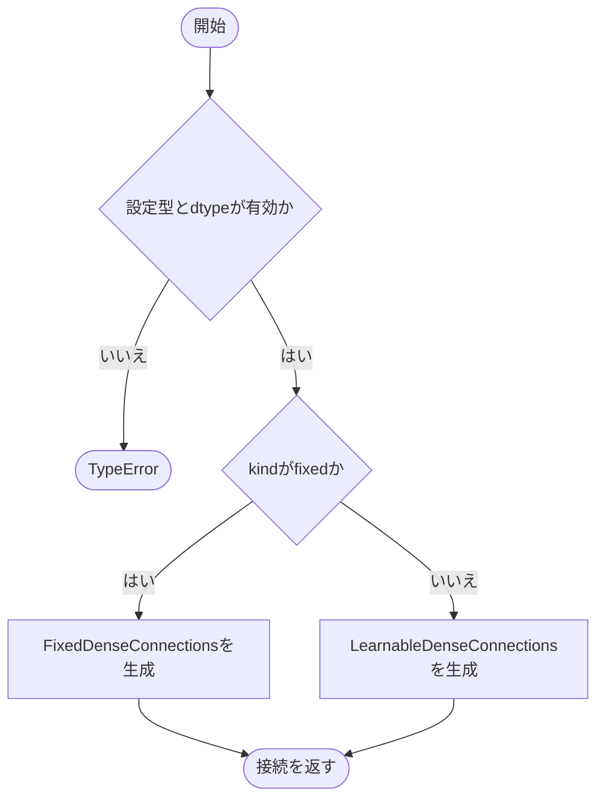
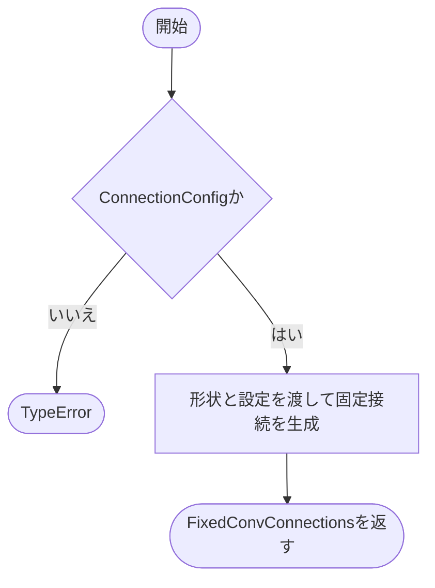

# builder.py

`utils/logicNN_core/src/logicnn_core/connections/builder.py`

接続クラスを生成する窓口です。全結合では設定に応じて固定接続または学習可能接続を選び、畳み込みでは固定接続を生成します。

{/* source-sha256: 9b3a86c41c87210c0d6832c3aef48640bca135be7168c4a98a317269a5b30141 */}

{/* function: build_dense_connections@14 */}

## build\_dense\_connections() {/* #build-dense-connections */}

```python
def build_dense_connections(
    in_features: int,
    out_features: int,
    *,
    num_inputs: int = 2,
    config: ConnectionConfig = ConnectionConfig(),
    device: torch.device | str | None = None,
    dtype: torch.dtype | None = None,
) -> FixedDenseConnections | LearnableDenseConnections:
```

### 機能概要

設定のkindに基づいて全結合接続を生成します。dtypeは学習可能接続の重みに適用され、固定接続の整数インデックスには適用されません。

### 引数

| 引数 | 型 | 既定値 | 説明 |
|---|---|---|---|
| `in_features` | `int` | `必須` | 接続前の特徴数。 |
| `out_features` | `int` | `必須` | 接続先のゲート数。 |
| `num_inputs` | `int` | `2` | ゲート1個あたりの入力本数。 |
| `config` | `ConnectionConfig` | `ConnectionConfig()` | 接続方式と候補選択の設定。 |
| `device` | `torch.device \| str \| None` | `None` | 接続インデックスと重みを配置するデバイス。Noneの場合はPyTorchの既定設定を使います。 |
| `dtype` | `torch.dtype \| None` | `None` | 学習可能接続の重みの浮動小数点型。Noneの場合はPyTorchの既定型。 |

### 処理の流れ



### 戻り値

型：`FixedDenseConnections \| LearnableDenseConnections`

config.kindがfixedならFixedDenseConnections、それ以外の有効な方式ならLearnableDenseConnections。

### 状態の変更・ファイル出力

- 生成するクラスに応じて乱数を消費し、接続インデックスと学習用重みを初期化します。

### ソースコード

<details>
<summary>build\_dense\_connections() の実装を開く</summary>

```python
def build_dense_connections(
    in_features: int,
    out_features: int,
    *,
    num_inputs: int = 2,
    config: ConnectionConfig = ConnectionConfig(),
    device: torch.device | str | None = None,
    dtype: torch.dtype | None = None,
) -> FixedDenseConnections | LearnableDenseConnections:
    """Denseの固定・学習可能接続を生成し、dtypeは接続logitの初期化だけに適用する。"""
    if not isinstance(config, ConnectionConfig):
        raise TypeError("config はConnectionConfigで指定してください")
    if dtype is not None and dtype not in (torch.float16, torch.bfloat16, torch.float32, torch.float64):
        raise TypeError("dtype はfloat16／bfloat16／float32／float64で指定してください")
    if config.kind == "fixed":
        return FixedDenseConnections(in_features, out_features, num_inputs=num_inputs, config=config, device=device)
    return LearnableDenseConnections(in_features, out_features, num_inputs=num_inputs, config=config, device=device, dtype=dtype)
```

</details>

{/* function: build_conv_connections@33 */}

## build\_conv\_connections() {/* #build-conv-connections */}

```python
def build_conv_connections(
    input_size: int | tuple[int, ...],
    in_channels: int,
    out_channels: int,
    tree_depth: int,
    kernel_size: int | tuple[int, ...],
    *,
    num_inputs: int = 2,
    stride: int | tuple[int, ...] = 1,
    padding: int | tuple[int, ...] = 0,
    conv_dimension: int = 2,
    config: ConnectionConfig = ConnectionConfig(),
    device: torch.device | str | None = None,
) -> FixedConvConnections:
```

### 機能概要

空間形状、受容野、論理木の深さをFixedConvConnectionsへ渡します。学習可能な畳み込み接続を選択する処理はありません。

### 引数

| 引数 | 型 | 既定値 | 説明 |
|---|---|---|---|
| `input_size` | `int \| tuple[int, ...]` | `必須` | バッチ・チャネルを除いた入力空間の大きさ。整数は各空間軸へ展開されます。 |
| `in_channels` | `int` | `必須` | 入力チャネル数。 |
| `out_channels` | `int` | `必須` | 出力チャネル数。 |
| `tree_depth` | `int` | `必須` | 各受容野に適用する論理木の深さ。 |
| `kernel_size` | `int \| tuple[int, ...]` | `必須` | 受容野の空間サイズ。 |
| `num_inputs` | `int` | `2` | 論理木の各ゲートの入力本数。 |
| `stride` | `int \| tuple[int, ...]` | `1` | 受容野を移動する間隔。 |
| `padding` | `int \| tuple[int, ...]` | `0` | 入力の各空間軸の両側へ追加する0の幅。 |
| `conv_dimension` | `int` | `2` | 空間次元数。2または3。 |
| `config` | `ConnectionConfig` | `ConnectionConfig()` | 固定接続の初期化方法とチャネルグループの設定。 |
| `device` | `torch.device \| str \| None` | `None` | 接続インデックスを配置するデバイス。 |

### 処理の流れ



### 戻り値

型：`FixedConvConnections`

初期化済みのFixedConvConnections。

### 例外・注意事項

- kindや空間形状の有効性はFixedConvConnectionsの初期化時に検証します。

### ソースコード

<details>
<summary>build\_conv\_connections() の実装を開く</summary>

```python
def build_conv_connections(
    input_size: int | tuple[int, ...],
    in_channels: int,
    out_channels: int,
    tree_depth: int,
    kernel_size: int | tuple[int, ...],
    *,
    num_inputs: int = 2,
    stride: int | tuple[int, ...] = 1,
    padding: int | tuple[int, ...] = 0,
    conv_dimension: int = 2,
    config: ConnectionConfig = ConnectionConfig(),
    device: torch.device | str | None = None,
) -> FixedConvConnections:
    """2D／3Dの固定Conv接続へ空間形状と方式設定を明示的に渡す。"""
    if not isinstance(config, ConnectionConfig):
        raise TypeError("config はConnectionConfigで指定してください")
    return FixedConvConnections(input_size, in_channels, out_channels, tree_depth, kernel_size, num_inputs=num_inputs, stride=stride,
                                padding=padding, conv_dimension=conv_dimension, config=config, device=device)
```

</details>

## 関連ファイル

- [utils/logicNN_core/src/logicnn_core/connections/convolution.py](/code-reference/utils/logicNN_core/src/logicnn_core/connections/convolution)
- [utils/logicNN_core/src/logicnn_core/connections/dense.py](/code-reference/utils/logicNN_core/src/logicnn_core/connections/dense)
- [utils/logicNN_core/src/logicnn_core/layer_settings.py](/code-reference/utils/logicNN_core/src/logicnn_core/layer_settings)
