# convolution.py

`utils/logicNN_core/src/logicnn_core/connections/convolution.py`

2次元・3次元の入力から論理木へ渡す局所接続を作ります。受容野内の接続位置は生成時に固定し、受容野を移動する各位置で同じ局所接続を使用します。論理演算自体は行わず、各段に必要な入力値を取り出します。

{/* source-sha256: 57acb83c7de43a77372ff7c2bd4d5d38e718aa512ddd57b8ce1c8f9a8fd59213 */}

{/* function: _positive_integer@23 */}

## \_positive\_integer() {/* #positive-integer */}

```python
def _positive_integer(name: str, value: int) -> None:
```

### 機能概要

値が正のPython整数であることに加え、接続インデックスに使うint64の上限以下であることを確認します。

### 引数

| 引数 | 型 | 既定値 | 説明 |
|---|---|---|---|
| `name` | `str` | `必須` | エラーメッセージに表示する設定名。 |
| `value` | `int` | `必須` | 検証対象の整数。 |

### 処理の流れ

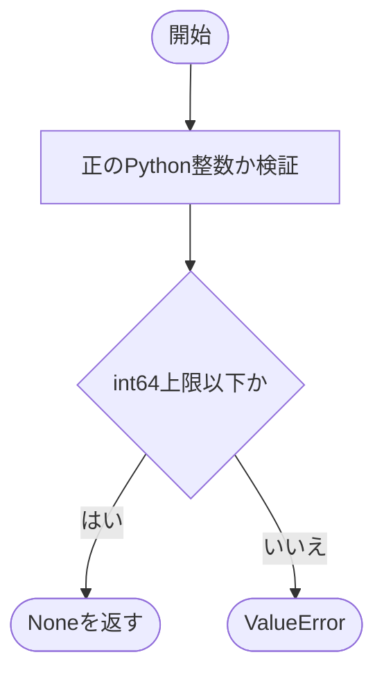

### 戻り値

型：`None`

None。

### ソースコード

<details>
<summary>\_positive\_integer() の実装を開く</summary>

```python
def _positive_integer(name: str, value: int) -> None:
    """正のPython整数を要求し、indexのint64範囲を超える値を拒否する。"""
    _validate_positive_integer(name, value)
    if value > _INT64_MAX:
        raise ValueError(f"{name} はint64の上限以下で指定してください")
```

</details>

{/* function: _spatial_tuple@30 */}

## \_spatial\_tuple() {/* #spatial-tuple */}

```python
def _spatial_tuple(name: str, value: int | tuple[int, ...], dimensions: int, *, allow_zero: bool = False) -> tuple[int, ...]:
```

### 機能概要

整数を空間次元数ぶん繰り返したtupleへ変換します。tuple指定はそのまま使い、軸数と各要素の範囲を検証します。paddingの場合だけ0を許可できます。

### 引数

| 引数 | 型 | 既定値 | 説明 |
|---|---|---|---|
| `name` | `str` | `必須` | 検証対象の名前。 |
| `value` | `int \| tuple[int, ...]` | `必須` | 各軸共通の整数、または各軸を指定するtuple。 |
| `dimensions` | `int` | `必須` | 必要な空間軸数。 |
| `allow_zero` | `bool` | `False` | Trueなら0以上、Falseなら1以上を許可します。 |

### 処理の流れ

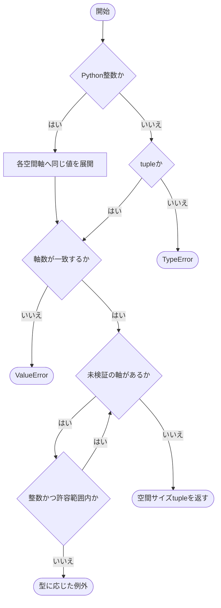

### 戻り値

型：`tuple[int, ...]`

dimensions個のPython整数からなるtuple。

### ソースコード

<details>
<summary>\_spatial\_tuple() の実装を開く</summary>

```python
def _spatial_tuple(name: str, value: int | tuple[int, ...], dimensions: int, *, allow_zero: bool = False) -> tuple[int, ...]:
    """intまたは次元数と一致する整数tupleを検証して空間値へ正規化する。"""
    if type(value) is int:
        values = (value,) * dimensions
    elif isinstance(value, tuple):
        values = value
    else:
        raise TypeError(f"{name} はintまたは{dimensions}要素のtupleで指定してください")
    if len(values) != dimensions:
        raise ValueError(f"{name} は{dimensions}要素で指定してください")
    minimum = 0 if allow_zero else 1
    for size in values:
        if type(size) is not int:
            raise TypeError(f"{name} の各要素はboolではないPython整数で指定してください")
        if not minimum <= size <= _INT64_MAX:
            raise ValueError(f"{name} の各要素は{minimum}以上int64上限以下で指定してください")
    return values
```

</details>

{/* function: _bounded_product@49 */}

## \_bounded\_product() {/* #bounded-product */}

```python
def _bounded_product(name: str, *factors: int) -> int:
```

### 機能概要

複数の整数の積を順に計算します。正の因子を掛ける前にint64の上限を超えないかを確認し、巨大な接続Tensorの生成前に不正なサイズを検出します。

### 引数

| 引数 | 型 | 既定値 | 説明 |
|---|---|---|---|
| `name` | `str` | `必須` | 積が表すサイズの名前。 |
| `*factors` | `int` | `省略可` | 順番に掛け合わせる整数の可変長引数。 |

### 処理の流れ

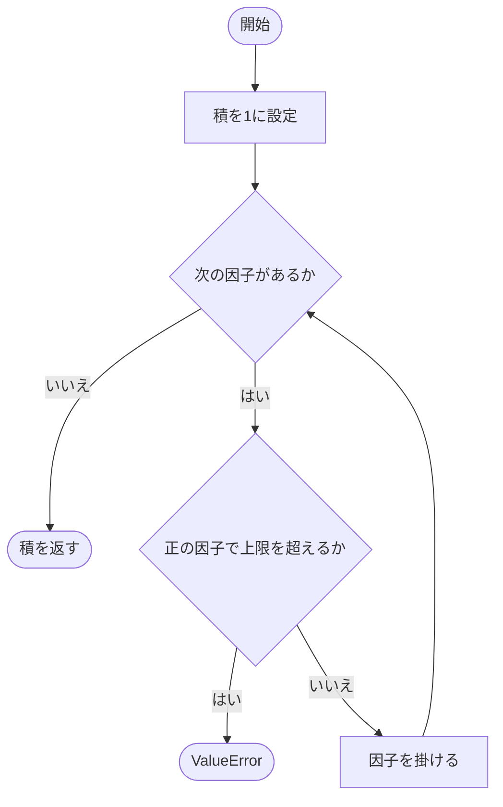

### 戻り値

型：`int`

factorsの積。因子がない場合は1。

### 例外・注意事項

- 呼び出し側で検証済みのサイズを渡す内部関数です。負の因子を含む一般的な整数計算の検証は行いません。

### ソースコード

<details>
<summary>\_bounded\_product() の実装を開く</summary>

```python
def _bounded_product(name: str, *factors: int) -> int:
    """導出サイズの積がint64上限を超えないか、巨大Tensorの生成前に検証する。"""
    result = 1
    for factor in factors:
        if factor > 0 and result > _INT64_MAX // factor:
            raise ValueError(f"{name} の要素数がint64上限を超えます")
        result *= factor
    return result
```

</details>

{/* function: _bounded_power@59 */}

## \_bounded\_power() {/* #bounded-power */}

```python
def _bounded_power(base: int, exponent: int) -> int:
```

### 機能概要

論理木の葉数に使うbaseのexponent乗を、上限付きの乗算で求めます。base=1は直ちに1を返し、それ以外は指数が63以上なら計算前に拒否します。

### 引数

| 引数 | 型 | 既定値 | 説明 |
|---|---|---|---|
| `base` | `int` | `必須` | 各ゲートの入力本数。呼び出し側で検証済みの正整数。 |
| `exponent` | `int` | `必須` | 論理木の深さに対応する指数。 |

### 処理の流れ

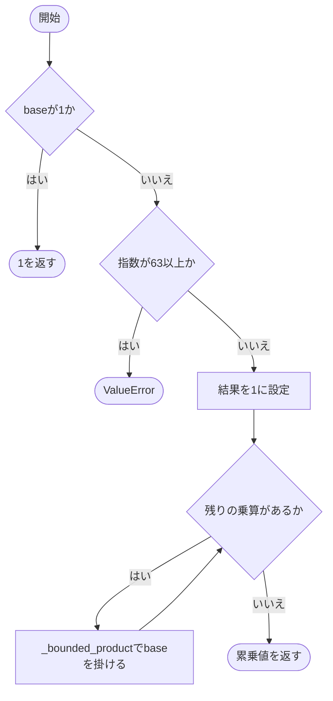

### 戻り値

型：`int`

int64の範囲に収まるbase**exponent。

### ソースコード

<details>
<summary>\_bounded\_power() の実装を開く</summary>

```python
def _bounded_power(base: int, exponent: int) -> int:
    """treeの巨大累乗を展開せず、int64内に収まるleaf数だけを計算する。"""
    if base == 1:
        return 1
    if exponent >= 63:
        raise ValueError("treeのleaf数がint64上限を超えます")
    result = 1
    for _ in range(exponent):
        result = _bounded_product("tree", result, base)
    return result
```

</details>

## FixedConvConnections {/* #fixedconvconnections-class */}

畳み込みの受容野と論理木の接続を保持する固定接続Moduleです。第0段は画像などの入力から葉に対応する値を選び、後続段は直前のゲート出力を入力本数ごとにまとめます。

継承元：`Connections`

{/* function: FixedConvConnections.__init__@74 */}

## FixedConvConnections.\_\_init\_\_() {/* #fixedconvconnections-init */}

```python
def __init__(
    self,
    input_size: int | tuple[int, ...],
    in_channels: int,
    out_channels: int,
    tree_depth: int,
    kernel_size: int | tuple[int, ...],
    *,
    num_inputs: int = 2,
    stride: int | tuple[int, ...] = 1,
    padding: int | tuple[int, ...] = 0,
    conv_dimension: int = 2,
    config: ConnectionConfig = ConnectionConfig(),
    device: torch.device | str | None = None,
) -> None:
```

### 機能概要

固定接続の設定と空間サイズを検証し、受容野の接続座標・移動位置・論理木の各段の接続を初期化します。第0段のゲート数はnum_inputs**(tree_depth−1)、葉の総数はnum_inputs**tree_depthです。

### 引数

| 引数 | 型 | 既定値 | 説明 |
|---|---|---|---|
| `input_size` | `int \| tuple[int, ...]` | `必須` | バッチ・チャネルを除いた入力空間サイズ。整数なら各軸共通。 |
| `in_channels` | `int` | `必須` | 入力チャネル数。 |
| `out_channels` | `int` | `必須` | 出力チャネル数。 |
| `tree_depth` | `int` | `必須` | 論理木の段数。正整数。 |
| `kernel_size` | `int \| tuple[int, ...]` | `必須` | 受容野の各空間軸の大きさ。 |
| `num_inputs` | `int` | `2` | 各ゲートの入力本数。 |
| `stride` | `int \| tuple[int, ...]` | `1` | 受容野の移動間隔。 |
| `padding` | `int \| tuple[int, ...]` | `0` | 空間軸の両側に追加する0の幅。 |
| `conv_dimension` | `int` | `2` | 2次元または3次元を指定する2または3。 |
| `config` | `ConnectionConfig` | `ConnectionConfig()` | kind=fixedの接続設定。 |
| `device` | `torch.device \| str \| None` | `None` | 生成する接続Tensorのデバイス。 |

### 処理の流れ

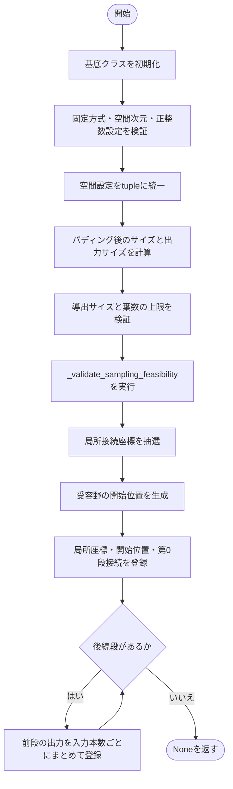

### 戻り値

型：`None`

None。

### 状態の変更・ファイル出力

- 局所座標、開始位置、indices_0以降の接続をbufferとして登録します。接続抽選で乱数を消費します。

### 例外・注意事項

- kernel_sizeはパディング前のinput_size以下に制限されます。出力サイズは各軸で(padded_size−kernel_size)//stride+1です。
- 設定・サイズが不正な場合は初期化を中断して例外を送出します。

### ソースコード

<details>
<summary>FixedConvConnections.\_\_init\_\_() の実装を開く</summary>

```python
def __init__(
    self,
    input_size: int | tuple[int, ...],
    in_channels: int,
    out_channels: int,
    tree_depth: int,
    kernel_size: int | tuple[int, ...],
    *,
    num_inputs: int = 2,
    stride: int | tuple[int, ...] = 1,
    padding: int | tuple[int, ...] = 0,
    conv_dimension: int = 2,
    config: ConnectionConfig = ConnectionConfig(),
    device: torch.device | str | None = None,
) -> None:
    """空間shapeと抽選条件を検証し、局所座標・開始位置・全levelのindexを保存する。"""
    super().__init__(num_inputs, config)
    if config.kind != "fixed":
        raise ValueError("FixedConvConnections はkind='fixed'だけに対応しています")
    if type(conv_dimension) is not int:
        raise TypeError("conv_dimension はboolではないPython整数で指定してください")
    if conv_dimension not in (2, 3):
        raise ValueError("conv_dimension は2または3で指定してください")
    for name, value in (("num_inputs", num_inputs), ("in_channels", in_channels), ("out_channels", out_channels), ("tree_depth", tree_depth)):
        _positive_integer(name, value)

    self.conv_dimension = conv_dimension
    self.in_channels    = in_channels
    self.out_channels   = out_channels
    self.tree_depth     = tree_depth
    self.input_size     = _spatial_tuple("input_size", input_size, conv_dimension)
    self.kernel_size    = _spatial_tuple("kernel_size", kernel_size, conv_dimension)
    self.stride         = _spatial_tuple("stride", stride, conv_dimension)
    self.padding        = _spatial_tuple("padding", padding, conv_dimension, allow_zero=True)
    if any(kernel > size for kernel, size in zip(self.kernel_size, self.input_size)):
        raise ValueError("kernel_size はpadding前のinput_size以下で指定してください")
    self.padded_size = tuple(size + 2 * pad for size, pad in zip(self.input_size, self.padding))
    self.output_size = tuple((size - kernel) // step + 1 for size, kernel, step in zip(self.padded_size, self.kernel_size, self.stride))
    if any(size > _INT64_MAX for size in self.padded_size) or any(size < 1 for size in self.output_size):
        raise ValueError("padding後の空間sizeはint64内、出力sizeは1以上である必要があります")
    self.num_positions  = _bounded_product("kernel_positions", *self.output_size)
    self._spatial_count = _bounded_product("受容野", *self.kernel_size)
    self._leaf_count    = _bounded_power(num_inputs, tree_depth)
    self._candidate_count = _bounded_product("受容野の候補", self._spatial_count, in_channels)
    _bounded_product("padding後の入力", in_channels, *self.padded_size)
    _bounded_product("indices_0", self._leaf_count, out_channels, self.num_positions, conv_dimension + 1)
    _bounded_product("kernel_positions", self.num_positions, conv_dimension)
    lower_elements = tree_depth - 1 if num_inputs == 1 else (self._leaf_count - num_inputs) // (num_inputs - 1)
    _bounded_product("後続tree indexのbytes", lower_elements, 8)
    self.node_counts = tuple(_bounded_power(num_inputs, tree_depth - level - 1) for level in range(tree_depth))
    self._validate_sampling_feasibility()

    chosen_device = torch.empty(0, dtype=torch.int64, device=device).device
    coordinates = self._sample_kernel_coordinates(chosen_device)
    positions   = self._make_kernel_positions(chosen_device)
    self.register_buffer("kernel_coordinates", coordinates)
    self.register_buffer("kernel_positions", positions)
    self.register_buffer("indices_0", self._make_first_indices(coordinates, positions))
    for level in range(1, tree_depth):
        indices = torch.arange(self.node_counts[level - 1], device=chosen_device).reshape(-1, num_inputs).T.contiguous()
        self.register_buffer(f"indices_{level}", indices)
```

</details>

{/* function: FixedConvConnections.indices@137 */}

## FixedConvConnections.indices()（プロパティ） {/* #fixedconvconnections-indices */}

```python
def indices(self) -> tuple[Tensor, ...]:
```

### 機能概要

各段のbufferをindices_0、indices_1の順に取得します。インデックスTensorを再計算したり複製したりはしません。

### 引数

`self` 以外に指定する引数はありません。

### 処理の流れ

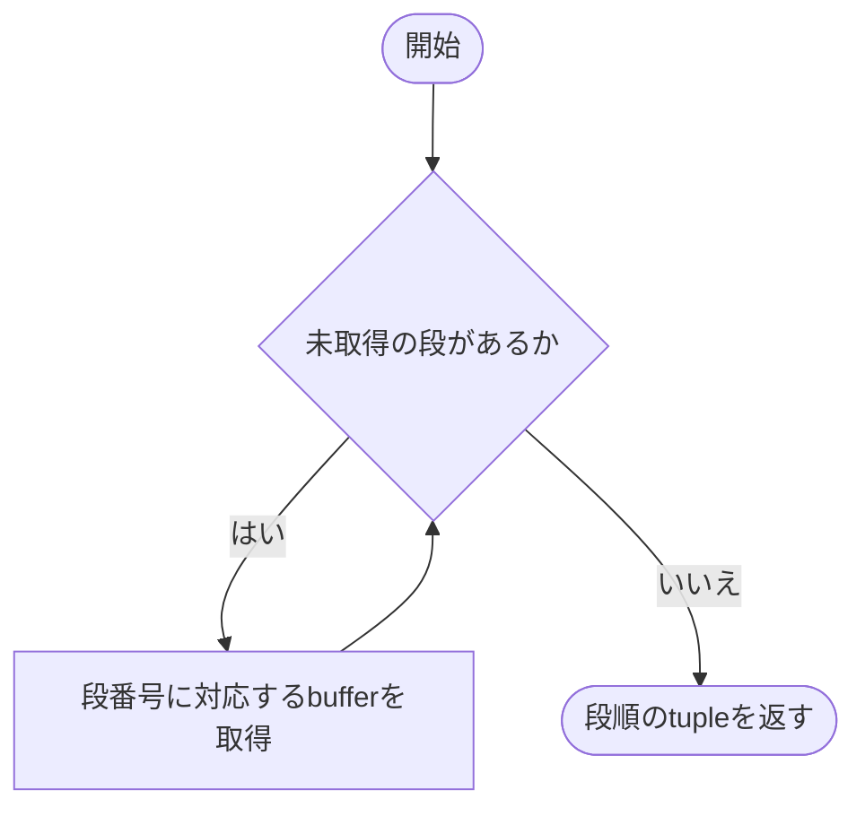

### 戻り値

型：`tuple[Tensor, ...]`

tree_depth個のインデックスTensorを持つtuple。

### ソースコード

<details>
<summary>FixedConvConnections.indices() の実装を開く</summary>

```python
@property
def indices(self) -> tuple[Tensor, ...]:
    """persistent bufferとして保存した各tree levelのindexを順序付きtupleで返す。"""
    return tuple(getattr(self, f"indices_{level}") for level in range(self.tree_depth))
```

</details>

{/* function: FixedConvConnections._validate_sampling_feasibility@141 */}

## FixedConvConnections.\_validate\_sampling\_feasibility() {/* #fixedconvconnections-validate-sampling-feasibility */}

```python
def _validate_sampling_feasibility(self) -> None:
```

### 機能概要

チャネルグループへの葉の均等配分と、重複しない接続を選ぶための候補数を確認します。グループ未指定のrandom_uniqueでは、受容野内の入力組合せ総数が第0段のゲート数以上である必要があります。

### 引数

`self` 以外に指定する引数はありません。

### 処理の流れ

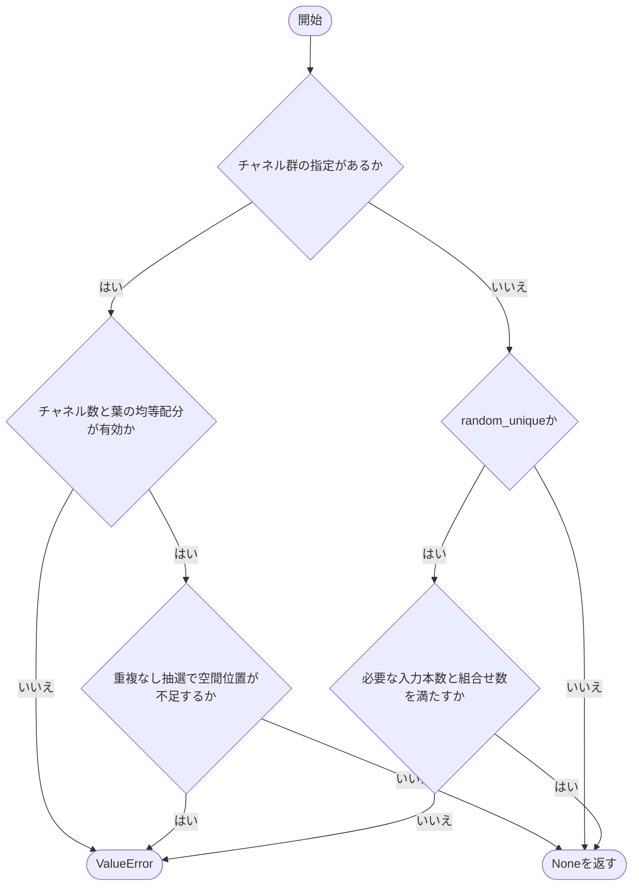

### 戻り値

型：`None`

None。不可能な抽選条件ではValueError。

### ソースコード

<details>
<summary>FixedConvConnections.\_validate\_sampling\_feasibility() の実装を開く</summary>

```python
def _validate_sampling_feasibility(self) -> None:
    """channel群への均等配分と、重複なし抽選に必要な候補数を確認する。"""
    group = self.config.channel_group_size
    if group is not None:
        if group > self.in_channels:
            raise ValueError("channel_group_size はin_channels以下で指定してください")
        if self._leaf_count % group:
            raise ValueError("treeの全leaf数はchannel_group_sizeで割り切れる必要があります")
        if self.config.init == "random_unique" and self._leaf_count // group > self._spatial_count:
            raise ValueError("channelごとの重複なしleaf数が受容野の空間位置数を超えます")
    elif self.config.init == "random_unique":
        if self.num_inputs > self._candidate_count or _bounded_binomial(self._candidate_count, self.num_inputs) < self.node_counts[0]:
            raise ValueError("受容野に必要な数の重複しない入力tupleがありません")
```

</details>

{/* function: FixedConvConnections._sample_kernel_coordinates@155 */}

## FixedConvConnections.\_sample\_kernel\_coordinates() {/* #fixedconvconnections-sample-kernel-coordinates */}

```python
def _sample_kernel_coordinates(self, device: torch.device) -> Tensor:
```

### 機能概要

受容野内の入力位置を抽選し、平坦な候補番号を空間座標とチャネル番号へ変換します。チャネルグループを指定した場合は、出力チャネルごとに連続する入力チャネル群を選び、各チャネルへ同数の葉を割り当ててから順序を混ぜます。

### 引数

| 引数 | 型 | 既定値 | 説明 |
|---|---|---|---|
| `device` | `torch.device` | `必須` | 抽選と座標Tensor生成を行うデバイス。 |

### 処理の流れ

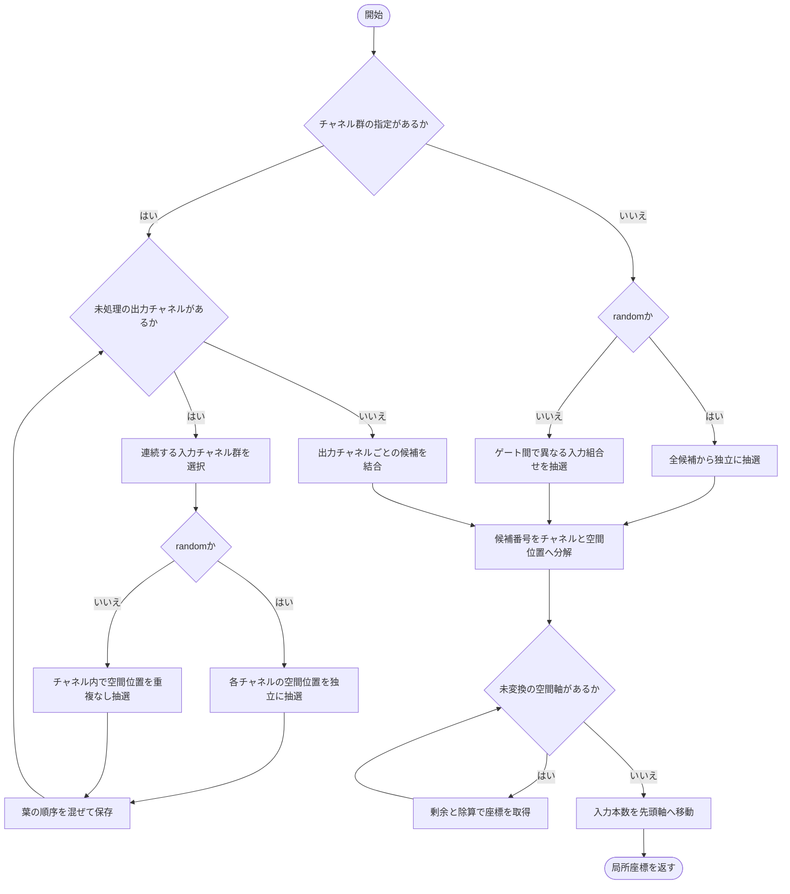

### 戻り値

型：`Tensor`

形状[num_inputs, out_channels, node_counts[0], conv_dimension+1]の整数Tensor。末尾は空間座標に続いてチャネル番号です。

### 状態の変更・ファイル出力

- 指定デバイスの乱数状態を消費します。

### 例外・注意事項

- グループ未指定のrandom_uniqueは入力tuple全体の重複を防ぐ方式です。異なるtupleが一部の入力位置を共有することはあります。

### ソースコード

<details>
<summary>FixedConvConnections.\_sample\_kernel\_coordinates() の実装を開く</summary>

```python
def _sample_kernel_coordinates(self, device: torch.device) -> Tensor:
    """全候補を列挙せず局所位置を抽選し、末尾をspatial座標・channelの順にする。"""
    group = self.config.channel_group_size
    if group is None:
        shape = (self.out_channels, self.node_counts[0], self.num_inputs)
        if self.config.init == "random":
            flat = torch.randint(self._candidate_count, shape, device=device)
        else:
            flat = sample_unique_combinations(self._candidate_count, self.num_inputs, self.node_counts[0], self.out_channels, device=device)
    else:
        per_channel = self._leaf_count // group
        selected    = []
        for kernel in range(self.out_channels):
            start = kernel % (self.in_channels - group + 1)
            if self.config.init == "random":
                spatial = torch.randint(self._spatial_count, (group, per_channel), device=device)
            else:
                spatial = sample_unique_combinations(self._spatial_count, 1, per_channel, group, device=device).squeeze(-1)
            channels = torch.arange(start, start + group, device=device).unsqueeze(-1)
            values   = (spatial * self.in_channels + channels).reshape(-1)
            order    = torch.randperm(self._leaf_count, device=device)
            selected.append(values[order].reshape(self.node_counts[0], self.num_inputs))
        flat = torch.stack(selected)
    parts   = [flat % self.in_channels]
    spatial = flat // self.in_channels
    for size in reversed(self.kernel_size):
        parts.insert(0, spatial % size)
        spatial = spatial // size
    return torch.stack(parts, dim=-1).permute(2, 0, 1, 3).contiguous()
```

</details>

{/* function: FixedConvConnections._make_kernel_positions@185 */}

## FixedConvConnections.\_make\_kernel\_positions() {/* #fixedconvconnections-make-kernel-positions */}

```python
def _make_kernel_positions(self, device: torch.device) -> Tensor:
```

### 機能概要

各空間軸で出力位置番号にstrideを掛け、meshgridで受容野の開始座標を組み合わせます。最終空間軸が最も速く変化する順序で平坦化します。

### 引数

| 引数 | 型 | 既定値 | 説明 |
|---|---|---|---|
| `device` | `torch.device` | `必須` | 開始座標Tensorを配置するデバイス。 |

### 処理の流れ

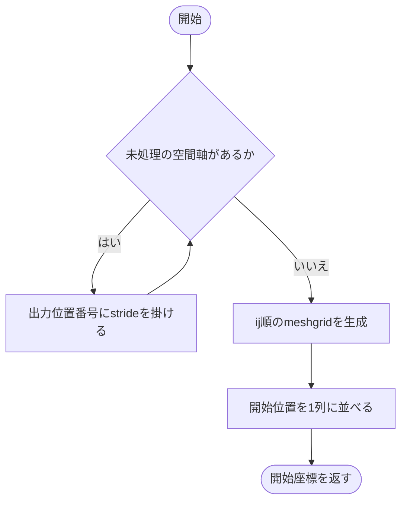

### 戻り値

型：`Tensor`

形状[num_positions, conv_dimension]のint64 Tensor。パディング後の座標系を使用します。

### ソースコード

<details>
<summary>FixedConvConnections.\_make\_kernel\_positions() の実装を開く</summary>

```python
def _make_kernel_positions(self, device: torch.device) -> Tensor:
    """padding済み空間での滑走開始位置を、最終空間軸が最速で進む順に作る。"""
    axes = [torch.arange(size, device=device) * step for size, step in zip(self.output_size, self.stride)]
    grid = torch.meshgrid(*axes, indexing="ij")
    return torch.stack(grid, dim=-1).reshape(self.num_positions, self.conv_dimension)
```

</details>

{/* function: FixedConvConnections._make_first_indices@191 */}

## FixedConvConnections.\_make\_first\_indices() {/* #fixedconvconnections-make-first-indices */}

```python
def _make_first_indices(self, coordinates: Tensor, positions: Tensor) -> Tensor:
```

### 機能概要

各局所空間座標に受容野の開始座標を加え、第0段で参照する絶対位置を作ります。チャネル番号は移動位置ごとに繰り返し、空間座標の後ろへ結合します。

### 引数

| 引数 | 型 | 既定値 | 説明 |
|---|---|---|---|
| `coordinates` | `Tensor` | `必須` | 形状[num_inputs, out_channels, node_counts[0], conv_dimension+1]の局所座標。 |
| `positions` | `Tensor` | `必須` | 形状[num_positions, conv_dimension]の受容野の開始座標。 |

### 処理の流れ

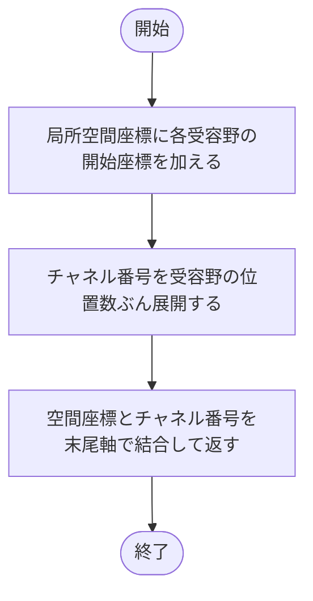

### 戻り値

型：`Tensor`

形状[num_inputs, out_channels, num_positions, node_counts[0], conv_dimension+1]の接続インデックスTensor。

### ソースコード

<details>
<summary>FixedConvConnections.\_make\_first\_indices() の実装を開く</summary>

```python
def _make_first_indices(self, coordinates: Tensor, positions: Tensor) -> Tensor:
    """局所座標へ滑走開始位置を加算し、level 0の絶対padding座標を作る。"""
    spatial  = coordinates[..., :-1].unsqueeze(2) + positions.reshape(1, 1, self.num_positions, 1, self.conv_dimension)
    channels = coordinates[..., -1:].unsqueeze(2).expand(self.num_inputs, self.out_channels, self.num_positions, self.node_counts[0], 1)
    return torch.cat((spatial, channels), dim=-1)
```

</details>

{/* function: FixedConvConnections.forward@197 */}

## FixedConvConnections.forward() {/* #fixedconvconnections-forward */}

```python
def forward(self, inputs: Tensor, tree_level: int = 0) -> Tensor:
```

### 機能概要

第0段では必要に応じて0パディングを行い、保存済みの絶対座標から葉の入力値を取得します。後続段では直前の段の出力を接続インデックスで選び、ゲートの入力本数の軸を第1軸へ移します。

### 引数

| 引数 | 型 | 既定値 | 説明 |
|---|---|---|---|
| `inputs` | `Tensor` | `必須` | 第0段は[batch, in_channels, *input_size]、後続段は[batch, out_channels, num_positions, node_counts[tree_level−1]]のTensor。 |
| `tree_level` | `int` | `0` | 処理する論理木の段番号。0始まり。 |

### 処理の流れ

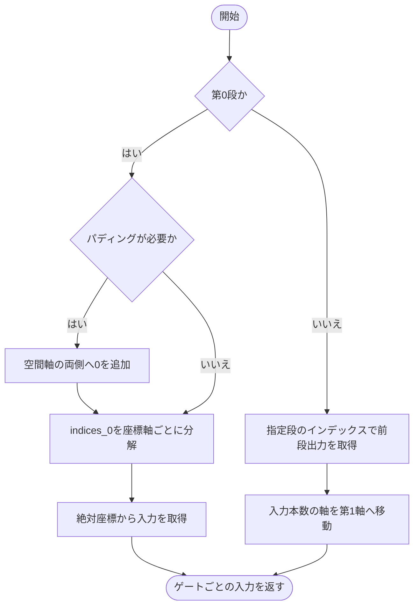

### 戻り値

型：`Tensor`

形状[batch, num_inputs, out_channels, num_positions, node_counts[tree_level]]のTensor。

### 例外・注意事項

- tree_levelは0以上tree_depth未満を指定します。無効な段番号や形状は、この関数では独自に補正しません。

### ソースコード

<details>
<summary>FixedConvConnections.forward() の実装を開く</summary>

```python
def forward(self, inputs: Tensor, tree_level: int = 0) -> Tensor:
    """level 0は一度だけpaddingして局所入力を取得し、後段はrank軸をindex 1へ揃える。"""
    if tree_level == 0:
        if any(self.padding):
            padding = tuple(value for pad in reversed(self.padding) for value in (pad, pad))
            inputs  = F.pad(inputs, padding, mode="constant", value=0)
        coordinates = self.indices_0.unbind(-1)
        return inputs[(slice(None), coordinates[-1], *coordinates[:-1])]
    return inputs[..., self.indices[tree_level]].movedim(-2, 1)
```

</details>

## 関連ファイル

- [utils/logicNN_core/src/logicnn_core/connections/base.py](/code-reference/utils/logicNN_core/src/logicnn_core/connections/base)
- [utils/logicNN_core/src/logicnn_core/functional/combinatorics.py](/code-reference/utils/logicNN_core/src/logicnn_core/functional/combinatorics)
- [utils/logicNN_core/src/logicnn_core/layer_settings.py](/code-reference/utils/logicNN_core/src/logicnn_core/layer_settings)
