# dense.py

`utils/logicNN_core/src/logicnn_core/connections/dense.py`

全結合の固定接続と学習可能接続を実装します。どちらも入力位置を整数インデックスで保持します。学習可能接続は、順伝播では候補を1本選び、逆伝播ではtorchlogix由来の代替勾配を使います。

{/* source-sha256: 7b49790c9d4f65caefdeec88b50a14727e94abeecf9c9ae09bae25a5bafbd718 */}

{/* function: _validate_dense_config@26 */}

## \_validate\_dense\_config() {/* #validate-dense-config */}

```python
def _validate_dense_config(config: ConnectionConfig, kind: str, in_features: int, out_features: int, num_inputs: int, candidates: int = 1) -> None:
```

### 機能概要

接続方式と全結合の次元を確認し、生成する整数インデックスが扱える範囲かを調べます。random_uniqueでは、同じゲート内の全端子・全候補を重複なく選べる特徴数が必要です。

### 引数

| 引数 | 型 | 既定値 | 説明 |
|---|---|---|---|
| `config` | `ConnectionConfig` | `必須` | 検証する接続設定。 |
| `kind` | `str` | `必須` | このクラスが要求する接続方式。fixedまたはlearnable。 |
| `in_features` | `int` | `必須` | 入力特徴数。 |
| `out_features` | `int` | `必須` | ゲート数。 |
| `num_inputs` | `int` | `必須` | ゲートの入力本数。 |
| `candidates` | `int` | `1` | 端子1個あたりの候補数。固定接続では1。 |

### 処理の流れ

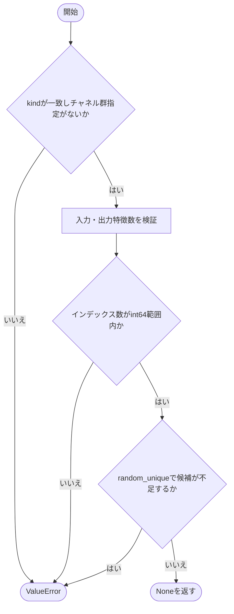

### 戻り値

型：`None`

None。条件を満たさない場合はValueErrorなどを送出します。

### ソースコード

<details>
<summary>\_validate\_dense\_config() の実装を開く</summary>

```python
def _validate_dense_config(config: ConnectionConfig, kind: str, in_features: int, out_features: int, num_inputs: int, candidates: int = 1) -> None:
    """Denseの方式・次元・適用できる設定とindex総数を検証する。"""
    if config.kind != kind:
        raise ValueError(f"このDense接続のconfig.kindは{kind!r}で指定してください。")
    if config.channel_group_size is not None:
        raise ValueError("channel_group_sizeはDense接続には指定できません。")
    _validate_positive_integer("in_features", in_features)
    _validate_positive_integer("out_features", out_features)
    if in_features > _INT64_MAX or out_features * num_inputs * candidates > _INT64_MAX:
        raise ValueError("Denseの特徴数またはindex要素数がint64上限を超えます。")
    if config.init == "random_unique" and candidates * num_inputs > in_features:
        raise ValueError("random_uniqueではin_features >= num_inputs * num_candidatesが必要です。")
```

</details>

{/* function: _unique_indices@40 */}

## \_unique\_indices() {/* #unique-indices */}

```python
def _unique_indices(in_features: int, selections: int, out_features: int, device: torch.device) -> Tensor:
```

### 機能概要

ゲートごとに入力特徴のランダム順列を作り、先頭から指定本数を取り出します。同じゲート内では重複しませんが、異なるゲートが同じ入力を使うことは許します。

### 引数

| 引数 | 型 | 既定値 | 説明 |
|---|---|---|---|
| `in_features` | `int` | `必須` | 抽選元の特徴数。 |
| `selections` | `int` | `必須` | ゲートごとに選ぶ入力位置の数。 |
| `out_features` | `int` | `必須` | 抽選するゲート数。 |
| `device` | `torch.device` | `必須` | 順列と出力Tensorのデバイス。 |

### 処理の流れ

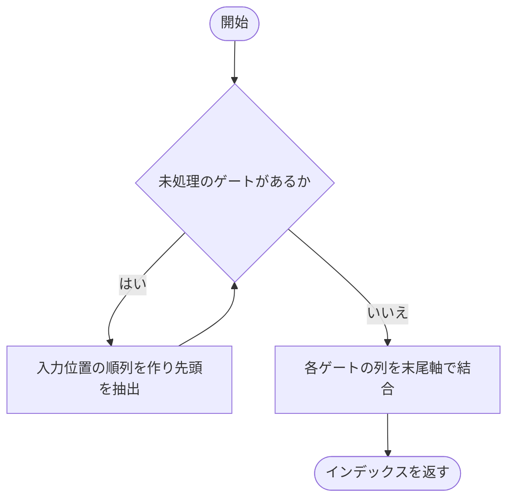

### 戻り値

型：`Tensor`

形状[selections, out_features]のint64 Tensor。

### 状態の変更・ファイル出力

- 指定デバイスのPyTorch乱数状態を消費します。

### ソースコード

<details>
<summary>\_unique\_indices() の実装を開く</summary>

```python
def _unique_indices(in_features: int, selections: int, out_features: int, device: torch.device) -> Tensor:
    """各ゲート内だけで重複しない順序付き候補を選び、ゲート間の共有は許す。"""
    columns = [torch.randperm(in_features, device=device)[:selections].clone() for _ in range(out_features)]
    return torch.stack(columns, dim=-1)
```

</details>

## \_LearnableConnectionFunction {/* #learnableconnectionfunction-class */}

離散的な接続選択に独自の勾配を与える内部用autograd関数です。順伝播のargmaxそのものを微分するのではなく、重みと入力に別々の式で勾配を返します。

継承元：`torch.autograd.Function`

{/* function: _LearnableConnectionFunction.forward@50 */}

## \_LearnableConnectionFunction.forward() {/* #learnableconnectionfunction-forward */}

```python
def forward(ctx: Any, inputs: Tensor, weights: Tensor, temperature: float, use_gumbel: bool, indices: Tensor) -> Tensor:
```

### 機能概要

必要に応じてGumbelノイズを接続重みに加え、候補軸のargmaxで各端子の接続先を1本選びます。順伝播では温度を使いません。温度は逆伝播のために保存します。

### 引数

| 引数 | 型 | 既定値 | 説明 |
|---|---|---|---|
| `ctx` | `Any` | `必須` | PyTorchが渡す逆伝播用の保存領域。 |
| `inputs` | `Tensor` | `必須` | 形状[batch, in_features]の入力Tensor。 |
| `weights` | `Tensor` | `必須` | 形状[candidates, num_inputs, out_features]の接続重み。 |
| `temperature` | `float` | `必須` | 逆伝播で候補の確率を計算する温度。 |
| `use_gumbel` | `bool` | `必須` | Trueなら候補選択にGumbelノイズを加えます。 |
| `indices` | `Tensor` | `必須` | weightsと同じ形状の候補インデックス。 |

### 処理の流れ

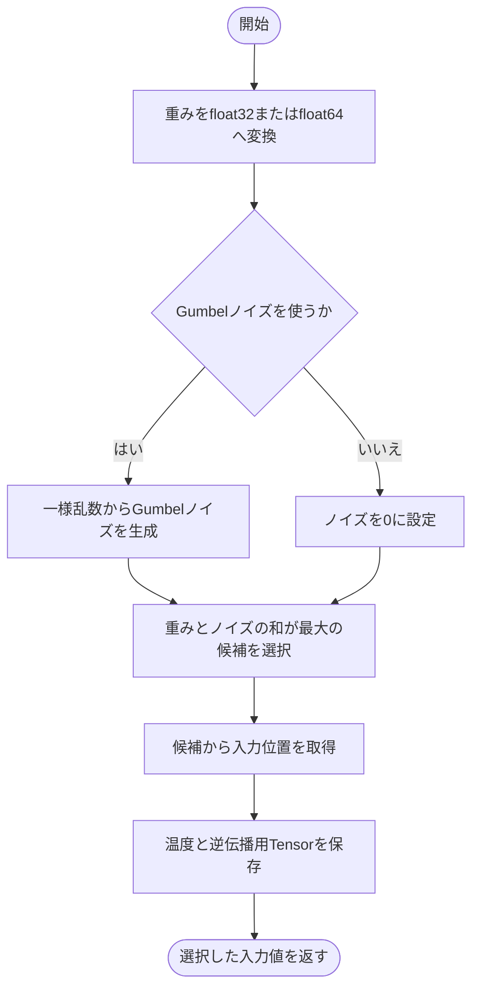

### 戻り値

型：`Tensor`

選択した入力値。形状[batch, num_inputs, out_features]で、inputsのdtypeを保持します。

### 状態の変更・ファイル出力

- ctxに入力・重み・ノイズ・候補と温度を保存します。use_gumbel=Trueでは乱数を消費します。

### 例外・注意事項

- 最大値が並ぶ場合はargmaxが先頭の候補を選びます。

### ソースコード

<details>
<summary>\_LearnableConnectionFunction.forward() の実装を開く</summary>

```python
@staticmethod
def forward(ctx: Any, inputs: Tensor, weights: Tensor, temperature: float, use_gumbel: bool, indices: Tensor) -> Tensor:
    """任意Gumbelノイズ付きargmaxで各端子の接続先を選択する。"""
    dtype  = torch.float64 if weights.dtype == torch.float64 else torch.float32
    values = weights.to(dtype=dtype)
    if use_gumbel:
        uniform = torch.rand_like(values)
        noise   = -torch.log(-torch.log(uniform + 1e-20) + 1e-20)
    else:
        noise = torch.zeros_like(values)
    choices  = (values + noise).argmax(dim=0, keepdim=True)
    selected = indices.gather(0, choices).squeeze(0)
    ctx.temperature = temperature
    ctx.save_for_backward(inputs, weights, noise, indices)
    return inputs[:, selected]
```

</details>

{/* function: _LearnableConnectionFunction.backward@66 */}

## \_LearnableConnectionFunction.backward() {/* #learnableconnectionfunction-backward */}

```python
def backward(ctx: Any, output_gradient: Tensor) -> tuple[Tensor | None, Tensor | None, None, None, None]:
```

### 機能概要

重みの勾配には、候補入力を2x−1へ変換した値と出力勾配のバッチ和を使います。入力の勾配には、温度付きsoftmaxで候補ごとに分配した出力勾配を使い、同じ入力位置への寄与をscatter_add_で合算します。

### 引数

| 引数 | 型 | 既定値 | 説明 |
|---|---|---|---|
| `ctx` | `Any` | `必須` | 順伝播時のTensor、温度、各入力の勾配要否を保持する領域。 |
| `output_gradient` | `Tensor` | `必須` | 形状[batch, num_inputs, out_features]の出力勾配。 |

### 処理の流れ

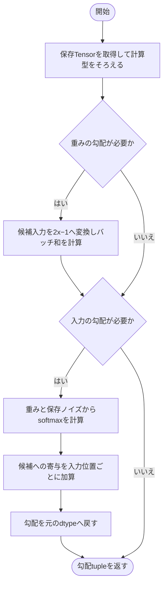

### 戻り値

型：`tuple[Tensor \| None, Tensor \| None, None, None, None]`

inputs、weights、temperature、use_gumbel、indicesに対応する勾配の5要素tuple。最初の2要素は必要時のみTensorで、残りはNone。

### 例外・注意事項

- 重みの勾配には温度付きsoftmaxの微分を掛けません。torchlogix由来の独自の代替勾配です。

### ソースコード

<details>
<summary>\_LearnableConnectionFunction.backward() の実装を開く</summary>

```python
@staticmethod
def backward(ctx: Any, output_gradient: Tensor) -> tuple[Tensor | None, Tensor | None, None, None, None]:
    """旧代替勾配を広い演算dtypeで集計し、入力と重みそれぞれのdtypeへ戻す。"""
    inputs, weights, noise, indices = ctx.saved_tensors
    dtype          = torch.float64 if torch.float64 in (inputs.dtype, weights.dtype) else torch.float32
    values         = inputs.to(dtype=dtype)
    gradient       = output_gradient.to(dtype=dtype)
    input_gradient = weight_gradient = None
    if ctx.needs_input_grad[1]:
        candidate_values = 2 * values[:, indices] - 1
        weight_gradient  = torch.einsum("bkro,bro->kro", candidate_values, gradient).to(dtype=weights.dtype)
    if ctx.needs_input_grad[0]:
        logits        = weights.to(dtype=dtype) + noise.to(dtype=dtype)
        probabilities = temperature_softmax(logits, temperature=ctx.temperature, dim=0)
        contribution  = probabilities.unsqueeze(0) * gradient.unsqueeze(1)
        positions     = indices.reshape(1, -1).expand(values.shape[0], -1)
        input_gradient = torch.zeros_like(values)
        input_gradient.scatter_add_(1, positions, contribution.reshape(values.shape[0], indices.numel()))
        input_gradient = input_gradient.to(dtype=inputs.dtype)
    return input_gradient, weight_gradient, None, None, None
```

</details>

## FixedDenseConnections {/* #fixeddenseconnections-class */}

各ゲートの接続位置を一度だけ抽選し、学習中も固定するModuleです。indicesはbufferとしてstate_dictへ保存されます。

継承元：`Connections`

{/* function: FixedDenseConnections.__init__@90 */}

## FixedDenseConnections.\_\_init\_\_() {/* #fixeddenseconnections-init */}

```python
def __init__(
    self,
    in_features: int,
    out_features: int,
    *,
    num_inputs: int = 2,
    config: ConnectionConfig = ConnectionConfig(),
    device: torch.device | str | None = None,
) -> None:
```

### 機能概要

設定を検証し、各ゲートの固定入力位置を生成します。random_uniqueではゲート内の重複を避け、それ以外では各位置を独立に抽選します。

### 引数

| 引数 | 型 | 既定値 | 説明 |
|---|---|---|---|
| `in_features` | `int` | `必須` | 入力特徴数。 |
| `out_features` | `int` | `必須` | 接続先のゲート数。 |
| `num_inputs` | `int` | `2` | ゲートの入力本数。 |
| `config` | `ConnectionConfig` | `ConnectionConfig()` | kind=fixedの接続設定。 |
| `device` | `torch.device \| str \| None` | `None` | 接続インデックスのデバイス。 |

### 処理の流れ

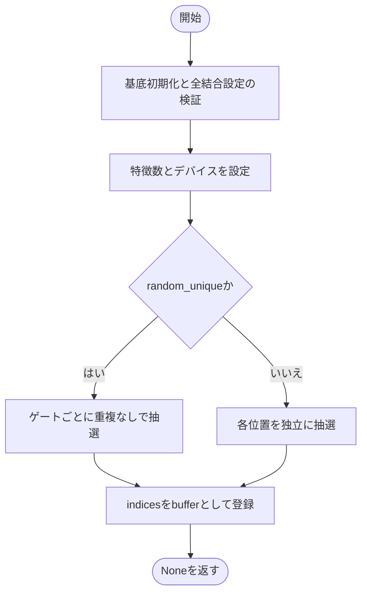

### 戻り値

型：`None`

None。

### 状態の変更・ファイル出力

- indicesをstate_dictに含まれるbufferとして登録し、乱数を消費します。

### ソースコード

<details>
<summary>FixedDenseConnections.\_\_init\_\_() の実装を開く</summary>

```python
def __init__(
    self,
    in_features: int,
    out_features: int,
    *,
    num_inputs: int = 2,
    config: ConnectionConfig = ConnectionConfig(),
    device: torch.device | str | None = None,
) -> None:
    """固定接続の設定を検証し、各LUTの入力indexを初期化する。"""
    super().__init__(num_inputs, config)
    _validate_dense_config(config, "fixed", in_features, out_features, num_inputs)
    self.in_features  = in_features
    self.out_features = out_features
    chosen_device     = torch.empty(0, device=device).device
    if config.init == "random_unique":
        indices = _unique_indices(in_features, num_inputs, out_features, chosen_device)
    else:
        indices = torch.randint(in_features, (num_inputs, out_features), device=chosen_device)
    self.register_buffer("indices", indices)
```

</details>

{/* function: FixedDenseConnections.get_indices@111 */}

## FixedDenseConnections.get\_indices() {/* #fixeddenseconnections-get-indices */}

```python
def get_indices(self) -> Tensor:
```

### 機能概要

現在保持している固定接続のインデックスをそのまま返します。

### 引数

`self` 以外に指定する引数はありません。

### 処理の流れ

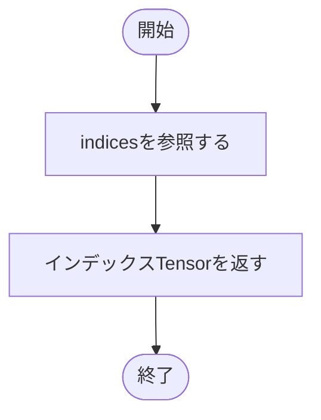

### 戻り値

型：`Tensor`

形状[num_inputs, out_features]のindices Tensor。コピーではありません。

### ソースコード

<details>
<summary>FixedDenseConnections.get\_indices() の実装を開く</summary>

```python
def get_indices(self) -> Tensor:
    """固定接続indexを[num_inputs, out_features]で返す。"""
    return self.indices
```

</details>

{/* function: FixedDenseConnections.forward@115 */}

## FixedDenseConnections.forward() {/* #fixeddenseconnections-forward */}

```python
def forward(self, inputs: Tensor) -> Tensor:
```

### 機能概要

入力の最終軸以外をひとつのバッチ軸にまとめ、固定インデックスに対応する特徴値を取り出します。先行軸の形状を元に戻す処理は行いません。

### 引数

| 引数 | 型 | 既定値 | 説明 |
|---|---|---|---|
| `inputs` | `Tensor` | `必須` | 最終軸がin_featuresのTensor。先行軸は任意で、その要素数の積をbatchとします。 |

### 処理の流れ

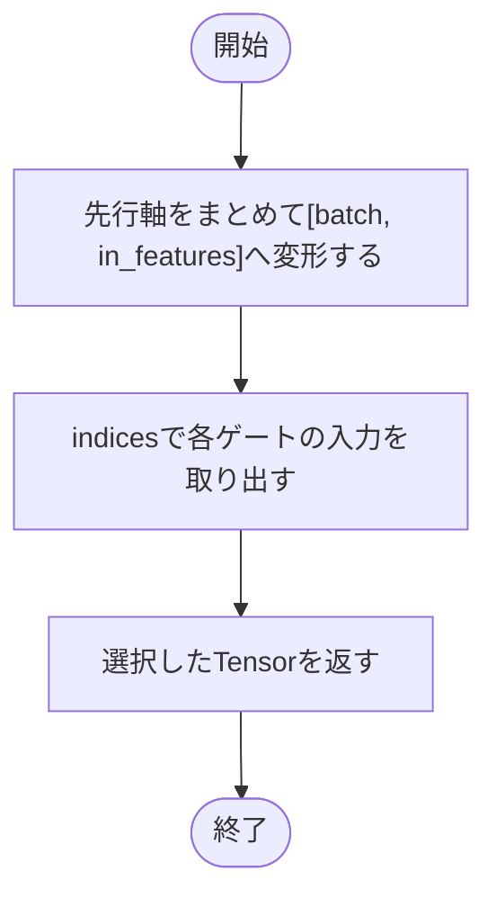

### 戻り値

型：`Tensor`

形状[batch, num_inputs, out_features]の選択済みTensor。入力のdtypeを保持します。

### ソースコード

<details>
<summary>FixedDenseConnections.forward() の実装を開く</summary>

```python
def forward(self, inputs: Tensor) -> Tensor:
    """任意の先行軸をflattenし、入力dtypeを保って各LUTの入力を取り出す。"""
    values = inputs.reshape(math.prod(inputs.shape[:-1]), self.in_features)
    return values[:, self.indices]
```

</details>

## LearnableDenseConnections {/* #learnabledenseconnections-class */}

固定された候補集合のうち、どの入力を接続するかを重みで学習するModuleです。評価時は乱数を使わず、候補重みが最大の接続を選択します。

継承元：`Connections`

{/* function: LearnableDenseConnections.__init__@124 */}

## LearnableDenseConnections.\_\_init\_\_() {/* #learnabledenseconnections-init */}

```python
def __init__(
    self,
    in_features: int,
    out_features: int,
    *,
    num_inputs: int = 2,
    config: ConnectionConfig = ConnectionConfig(kind="learnable"),
    device: torch.device | str | None = None,
    dtype: torch.dtype | None = None,
) -> None:
```

### 機能概要

候補インデックスをbufferとして保存し、候補を選択する重みを一様乱数[0,1)で初期化します。num_candidates=Noneなら全入力特徴を候補とし、指定がある場合だけ候補位置を抽選します。

### 引数

| 引数 | 型 | 既定値 | 説明 |
|---|---|---|---|
| `in_features` | `int` | `必須` | 入力特徴数。 |
| `out_features` | `int` | `必須` | ゲート数。 |
| `num_inputs` | `int` | `2` | ゲートの入力本数。 |
| `config` | `ConnectionConfig` | `ConnectionConfig(kind='learnable')` | kind=learnableの接続設定。num_candidates=Noneは全特徴を候補とする指定。 |
| `device` | `torch.device \| str \| None` | `None` | 候補と重みを配置するデバイス。 |
| `dtype` | `torch.dtype \| None` | `None` | 接続重みの浮動小数点型。NoneならPyTorchの既定型。 |

### 処理の流れ

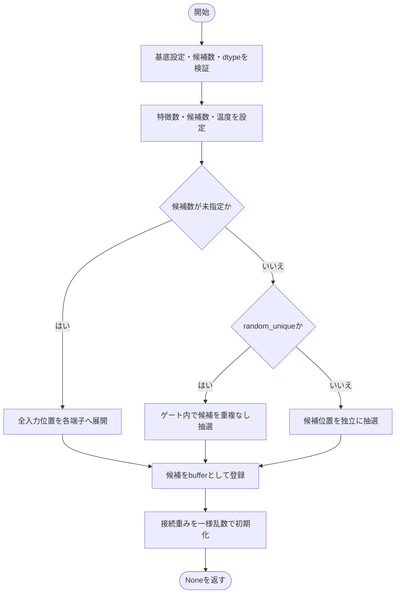

### 戻り値

型：`None`

None。

### 状態の変更・ファイル出力

- indices、weights、temperatureなどをインスタンスに設定し、乱数を消費します。

### ソースコード

<details>
<summary>LearnableDenseConnections.\_\_init\_\_() の実装を開く</summary>

```python
def __init__(
    self,
    in_features: int,
    out_features: int,
    *,
    num_inputs: int = 2,
    config: ConnectionConfig = ConnectionConfig(kind="learnable"),
    device: torch.device | str | None = None,
    dtype: torch.dtype | None = None,
) -> None:
    """候補bufferと[0,1)の接続logitを指定device・dtypeへ生成する。"""
    super().__init__(num_inputs, config)
    _validate_positive_integer("in_features", in_features)
    candidates = in_features if config.num_candidates is None else config.num_candidates
    _validate_dense_config(config, "learnable", in_features, out_features, num_inputs, candidates)
    chosen_dtype = torch.get_default_dtype() if dtype is None else dtype
    if chosen_dtype not in _FLOAT_DTYPES:
        raise TypeError("dtypeはfloat16／bfloat16／float32／float64で指定してください。")
    chosen_device       = torch.empty(0, device=device).device
    self.in_features    = in_features
    self.out_features   = out_features
    self.num_candidates = candidates
    self.temperature    = float(config.temperature)
    shape               = (candidates, num_inputs, out_features)
    if config.num_candidates is None:
        indices = torch.arange(in_features, device=chosen_device).view(in_features, 1, 1).expand(shape).contiguous()
    elif config.init == "random_unique":
        indices = _unique_indices(in_features, candidates * num_inputs, out_features, chosen_device).reshape(shape)
    else:
        indices = torch.randint(in_features, shape, device=chosen_device)
    self.register_buffer("indices", indices)
    self.weights = torch.nn.Parameter(torch.rand(shape, device=chosen_device, dtype=chosen_dtype))
```

</details>

{/* function: LearnableDenseConnections.set_temperature@157 */}

## LearnableDenseConnections.set\_temperature() {/* #learnabledenseconnections-set-temperature */}

```python
def set_temperature(self, temperature: float) -> None:
```

### 機能概要

入力勾配を候補へ分配する際の温度を変更します。元のConnectionConfigは変更せず、インスタンスのtemperatureだけを更新します。

### 引数

| 引数 | 型 | 既定値 | 説明 |
|---|---|---|---|
| `temperature` | `float` | `必須` | 正の有限値で指定する新しい温度。 |

### 処理の流れ

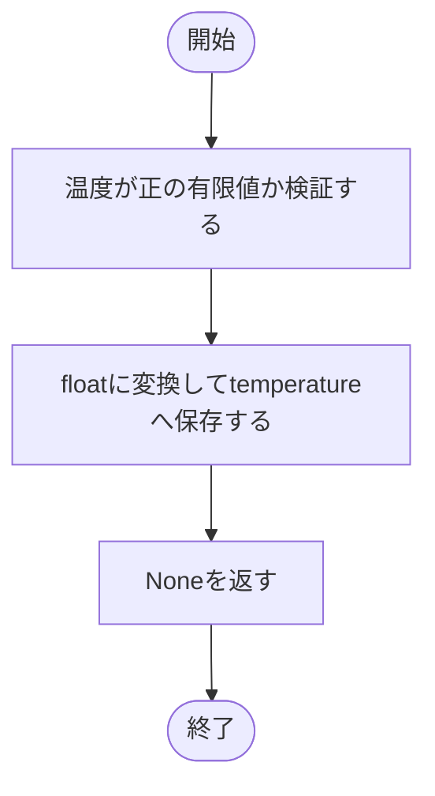

### 戻り値

型：`None`

None。

### 状態の変更・ファイル出力

- temperatureを更新します。

### ソースコード

<details>
<summary>LearnableDenseConnections.set\_temperature() の実装を開く</summary>

```python
def set_temperature(self, temperature: float) -> None:
    """正の有限temperatureへ更新し、元の不変configを変更しない。"""
    _validate_positive_number("temperature", temperature)
    self.temperature = float(temperature)
```

</details>

{/* function: LearnableDenseConnections.get_indices@162 */}

## LearnableDenseConnections.get\_indices() {/* #learnabledenseconnections-get-indices */}

```python
def get_indices(self) -> Tensor:
```

### 機能概要

ノイズを加えず接続重みが最大の候補を選び、現在の決定的な接続位置を返します。学習・評価モードにかかわらず同じ選択規則を使います。

### 引数

`self` 以外に指定する引数はありません。

### 処理の流れ

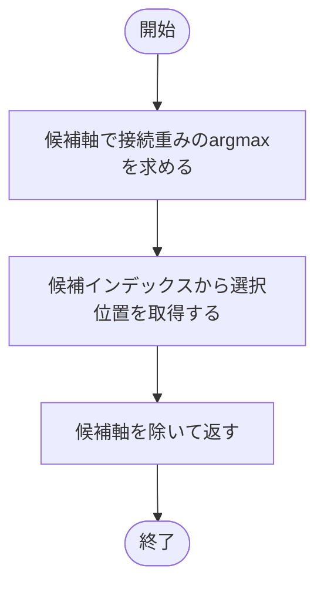

### 戻り値

型：`Tensor`

形状[num_inputs, out_features]の入力インデックスTensor。

### 例外・注意事項

- 最大値が同じ候補が複数ある場合は先頭を選びます。

### ソースコード

<details>
<summary>LearnableDenseConnections.get\_indices() の実装を開く</summary>

```python
def get_indices(self) -> Tensor:
    """乱数なしの先頭最大候補を[num_inputs, out_features]で返す。"""
    choices = self.weights.argmax(dim=0, keepdim=True)
    return self.indices.gather(0, choices).squeeze(0)
```

</details>

{/* function: LearnableDenseConnections.forward@167 */}

## LearnableDenseConnections.forward() {/* #learnabledenseconnections-forward */}

```python
def forward(self, inputs: Tensor) -> Tensor:
```

### 機能概要

学習時は独自のautograd関数を使い、評価時は最大重みの接続先から値を直接取得します。いずれも入力値の混合ではなく、選ばれた入力値そのものを返します。

### 引数

| 引数 | 型 | 既定値 | 説明 |
|---|---|---|---|
| `inputs` | `Tensor` | `必須` | 最終軸がin_featuresのTensor。先行軸をまとめてbatchとして扱います。 |

### 処理の流れ

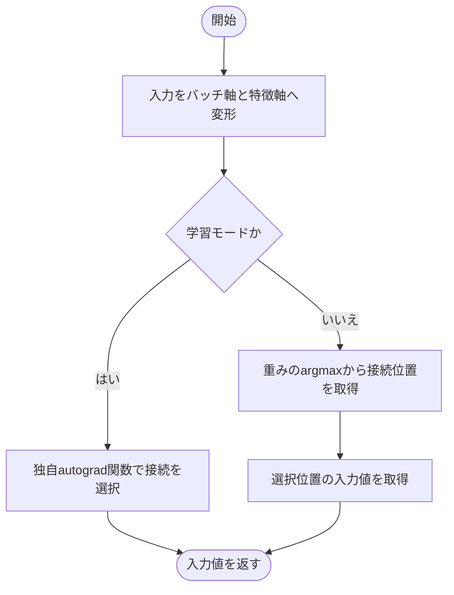

### 戻り値

型：`Tensor`

形状[batch, num_inputs, out_features]のTensor。

### 例外・注意事項

- 学習モードではconfig.use_gumbelに応じてノイズを使用します。評価モードでは使用しません。

### ソースコード

<details>
<summary>LearnableDenseConnections.forward() の実装を開く</summary>

```python
def forward(self, inputs: Tensor) -> Tensor:
    """学習時は旧独自勾配、評価時は通常gatherで入力値とdtypeを保持する。"""
    values = inputs.reshape(math.prod(inputs.shape[:-1]), self.in_features)
    if self.training:
        return _LearnableConnectionFunction.apply(values, self.weights, self.temperature, self.config.use_gumbel, self.indices)
    choices = self.weights.argmax(dim=0, keepdim=True)
    indices = self.indices.gather(0, choices).squeeze(0)
    return values[:, indices]
```

</details>

## 関連ファイル

- [utils/logicNN_core/src/logicnn_core/connections/base.py](/code-reference/utils/logicNN_core/src/logicnn_core/connections/base)
- [utils/logicNN_core/src/logicnn_core/functional/sampling.py](/code-reference/utils/logicNN_core/src/logicnn_core/functional/sampling)
- [utils/logicNN_core/src/logicnn_core/layer_settings.py](/code-reference/utils/logicNN_core/src/logicnn_core/layer_settings)
