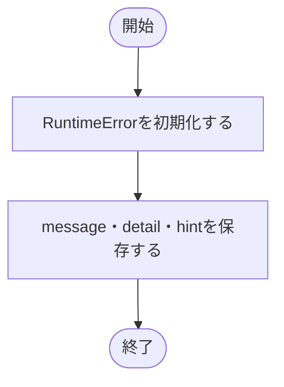

# exceptions.py

`utils/logicNN_core/src/logicnn_core/exceptions.py`

ライブラリの処理失敗を、メッセージ・詳細・対処方法とともに表す例外を定義します。

{/* source-sha256: bb015b4627b4d31828e4774e00b25f98f05b55881e1144bb418e4e19ea6f5ed6 */}

## LogicNNCoreError {/* #logicnncoreerror-class */}

RuntimeErrorを継承し、表示側で利用する診断情報を保持する例外。

継承元：`RuntimeError`

{/* function: LogicNNCoreError.__init__@9 */}

## LogicNNCoreError.\_\_init\_\_() {/* #logicnncoreerror-init */}

```python
def __init__(self, message: str, *, detail: str | None = None, hint: str | None = None) -> None:
```

### 機能概要

RuntimeErrorへメッセージを渡し、診断情報を同じ例外オブジェクトの属性として保存します。

### 引数

| 引数 | 型 | 既定値 | 説明 |
|---|---|---|---|
| `message` | `str` | `必須` | 主なエラーメッセージ。 |
| `detail` | `str \| None` | `None` | 任意の詳細情報。 |
| `hint` | `str \| None` | `None` | 任意の対処方法。 |

### 処理の流れ



### 戻り値

型：`None`

None。

### 状態の変更・ファイル出力

- 例外オブジェクトの属性を設定します。コンストラクタ自体はこの例外を送出しません。

### ソースコード

<details>
<summary>LogicNNCoreError.\_\_init\_\_() の実装を開く</summary>

```python
def __init__(self, message: str, *, detail: str | None = None, hint: str | None = None) -> None:
    """標準の例外メッセージと任意の診断情報を保存する。"""
    super().__init__(message)
    self.message = message
    self.detail  = detail
    self.hint    = hint
```

</details>
