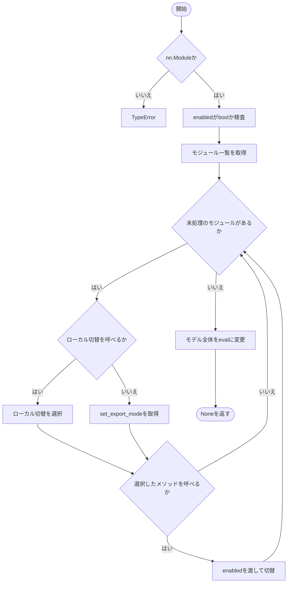

# export_mode.py

`utils/logicNN_core/src/logicnn_core/export_mode.py`

PyTorchのモジュール木を走査し、回路出力に対応する各層のモードを切り替えます。Residualのローカル切替を優先することで再帰呼び出しの重複を避けます。

{/* source-sha256: 7112fb3ebda55ed033a41bf4fc36afe57f5d0f005cdbfaf6f8d0b1234d007f07 */}

{/* function: set_export_mode@10 */}

## set\_export\_mode() {/* #set-export-mode */}

```python
def set_export_mode(module: nn.Module, enabled: bool = True) -> None:
```

### 機能概要

module.modules()で得た各モジュールを一度ずつ処理します。ローカル切替メソッドがあれば優先し、それ以外はset_export_modeを呼びます。最後にモデル全体を評価状態へ移します。

### 引数

| 引数 | 型 | 既定値 | 説明 |
|---|---|---|---|
| `module` | `nn.Module` | `必須` | 切替対象のnn.Module。モデル全体でも単独の層でも指定できます。 |
| `enabled` | `bool` | `True` | Trueで回路出力を有効にし、Falseで解除します。 |

### 処理の流れ



### 戻り値

型：`None`

None。

### 状態の変更・ファイル出力

- 対応する層の回路用バッファ・export_mode・trainingを変更します。解除後も評価状態のままです。

### 例外・注意事項

- 途中の切替で例外が発生した場合、既に変更した層を元に戻す処理はありません。

### ソースコード

<details>
<summary>set\_export\_mode() の実装を開く</summary>

```python
def set_export_mode(module: nn.Module, enabled: bool = True) -> None:
    """model全体を評価状態へ移し、対応する各moduleを一度だけ明示的に切り替える。"""
    if not isinstance(module, nn.Module):
        raise TypeError("module はtorch.nn.Moduleで指定してください")
    _validate_boolean("enabled", enabled)
    modules = tuple(module.modules())
    for child in modules:
        local  = getattr(child, "_set_export_mode_local", None)
        setter = local if callable(local) else getattr(child, "set_export_mode", None)
        if callable(setter):
            setter(enabled)
    module.eval()
```

</details>

## 関連ファイル

- [utils/logicNN_core/src/logicnn_core/layer_settings.py](/code-reference/utils/logicNN_core/src/logicnn_core/layer_settings)
