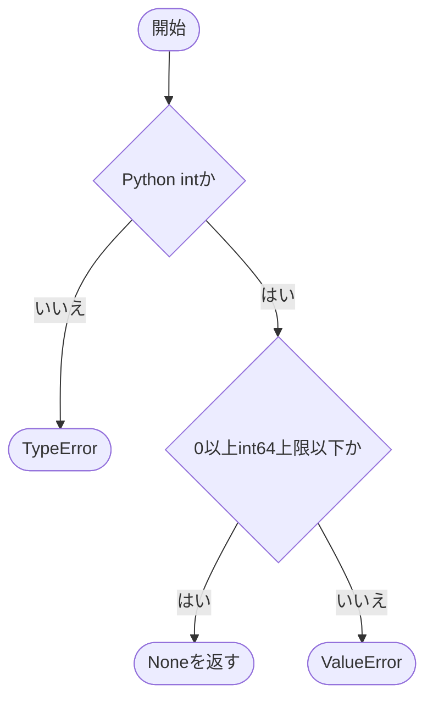
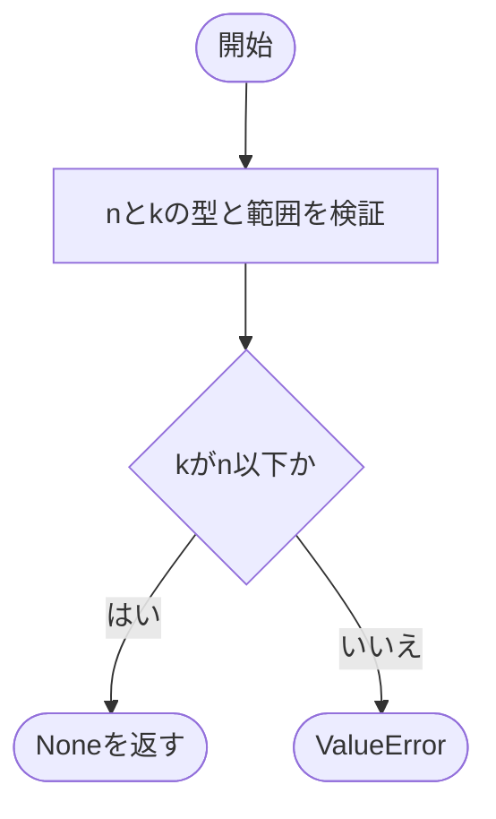
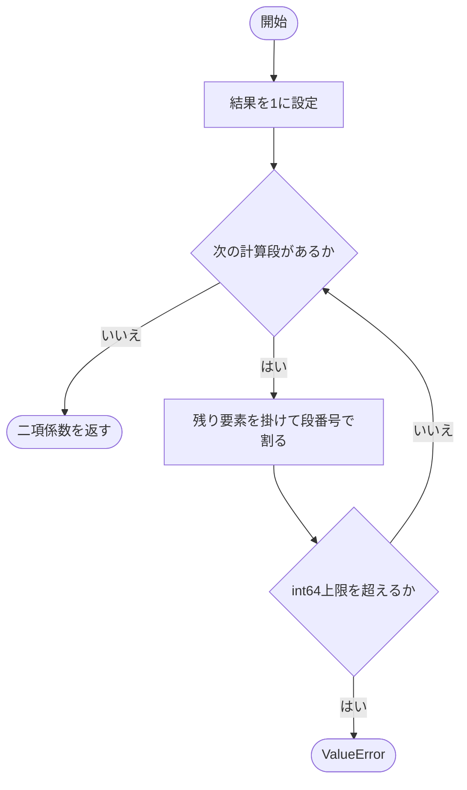
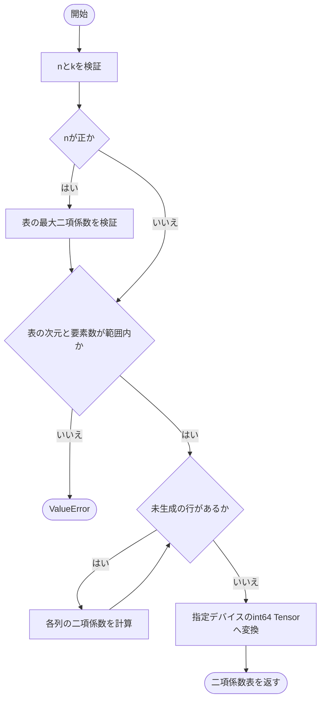
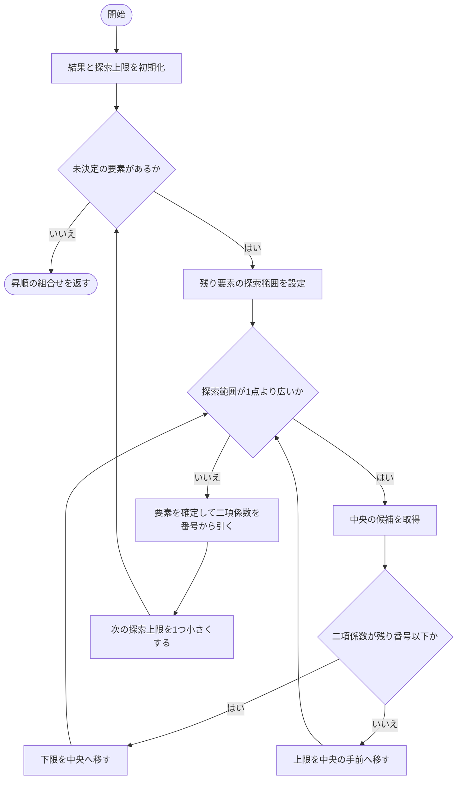
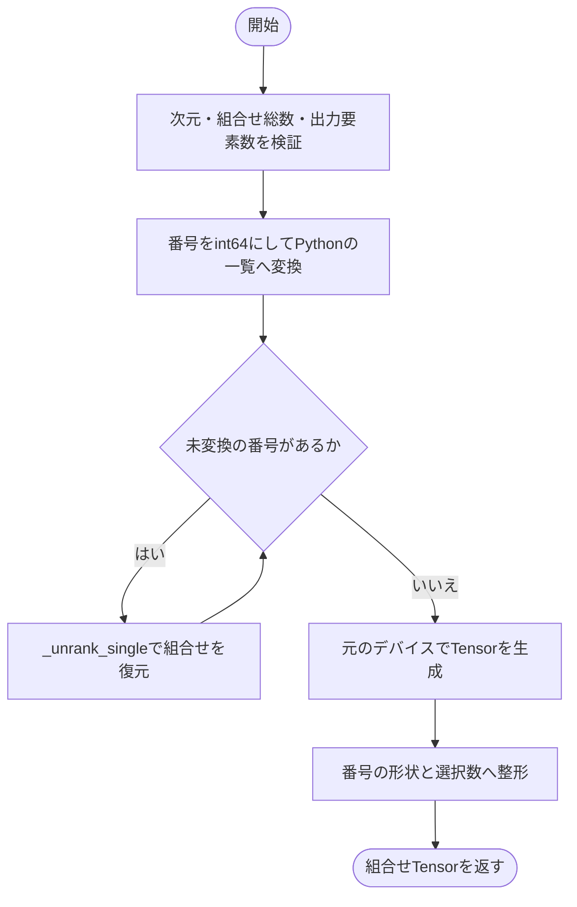
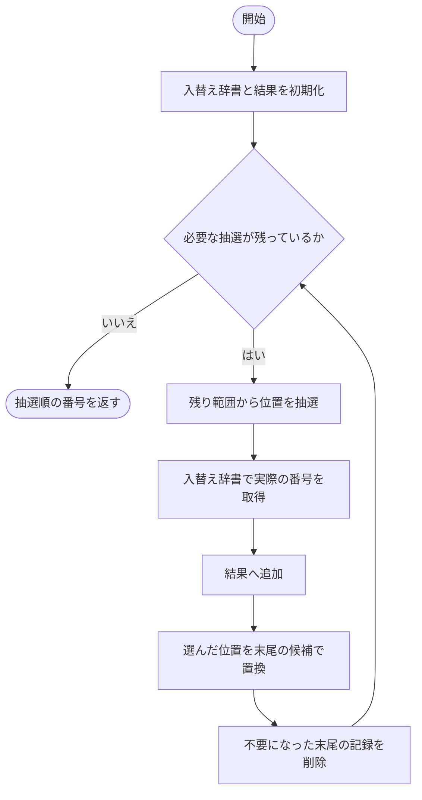
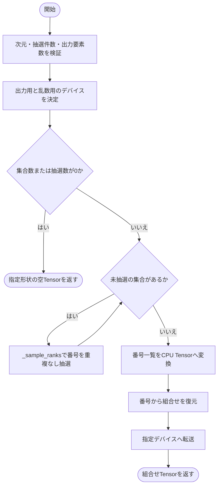
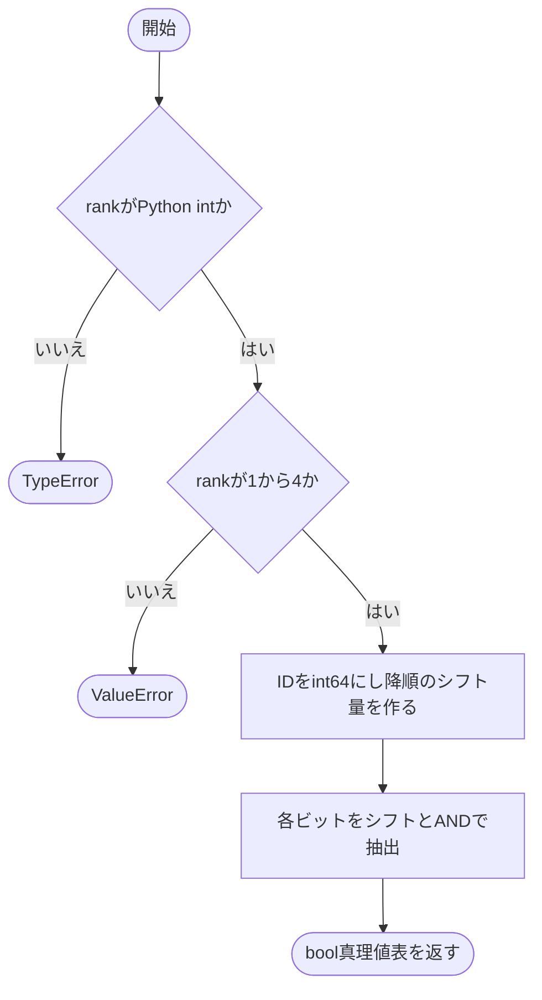

# combinatorics.py

`utils/logicNN_core/src/logicnn_core/functional/combinatorics.py`

整数の組合せと真理値表を扱います。接続候補の総数に比例する一覧を作らずに、重複のない組合せを抽選できます。組合せ番号はcolex順で、真理値表の列は第1入力を最上位とする2進昇順で扱います。

{/* source-sha256: dc6340e009303465ae7143763cc4525eddc7266c6b03f4c593d98f8c9c6b9085 */}

{/* function: _validate_nonnegative_integer@20 */}

## \_validate\_nonnegative\_integer() {/* #validate-nonnegative-integer */}

```python
def _validate_nonnegative_integer(name: str, value: int) -> None:
```

### 機能概要

値がboolではないPython整数で、0以上int64の上限以下にあるかを確認します。

### 引数

| 引数 | 型 | 既定値 | 説明 |
|---|---|---|---|
| `name` | `str` | `必須` | エラーに表示する項目名。 |
| `value` | `int` | `必須` | 検証する整数。 |

### 処理の流れ



### 戻り値

型：`None`

None。型違いはTypeError、範囲外はValueError。

### ソースコード

<details>
<summary>\_validate\_nonnegative\_integer() の実装を開く</summary>

```python
def _validate_nonnegative_integer(name: str, value: int) -> None:
    """非boolの非負Python整数とTensor indexで扱える上限を検証する。"""
    if type(value) is not int:
        raise TypeError(f"{name}はboolではないPython整数で指定してください。")
    if not 0 <= value <= _INT64_MAX:
        raise ValueError(f"{name}は0以上int64上限以下で指定してください。")
```

</details>

{/* function: _validate_dimensions@28 */}

## \_validate\_dimensions() {/* #validate-dimensions */}

```python
def _validate_dimensions(n: int, k: int) -> None:
```

### 機能概要

集合サイズnと選択数kを非負整数として検証し、重複なしでk個を選べる条件k≤nを確認します。

### 引数

| 引数 | 型 | 既定値 | 説明 |
|---|---|---|---|
| `n` | `int` | `必須` | 抽選元の要素数。 |
| `k` | `int` | `必須` | 1つの組合せに含める要素数。 |

### 処理の流れ



### 戻り値

型：`None`

None。

### ソースコード

<details>
<summary>\_validate\_dimensions() の実装を開く</summary>

```python
def _validate_dimensions(n: int, k: int) -> None:
    """集合サイズと選択数が重複なし組合せの範囲内か検証する。"""
    _validate_nonnegative_integer("n", n)
    _validate_nonnegative_integer("k", k)
    if k > n:
        raise ValueError("kはn以下で指定してください。")
```

</details>

{/* function: _bounded_binomial@36 */}

## \_bounded\_binomial() {/* #bounded-binomial */}

```python
def _bounded_binomial(n: int, k: int) -> int:
```

### 機能概要

二項係数C(n,k)を整数の積と除算で求めます。対称性を使って反復回数をmin(k,n−k)に抑え、計算途中でint64の上限を超えたら中断します。

### 引数

| 引数 | 型 | 既定値 | 説明 |
|---|---|---|---|
| `n` | `int` | `必須` | 集合の要素数。 |
| `k` | `int` | `必須` | 選択数。呼び出し側で0≤k≤nを検証します。 |

### 処理の流れ



### 戻り値

型：`int`

int64範囲内の正確な二項係数をPython intで返します。

### ソースコード

<details>
<summary>\_bounded\_binomial() の実装を開く</summary>

```python
def _bounded_binomial(n: int, k: int) -> int:
    """二項係数を正確な整数で求め、int64上限超過時は早期に拒否する。"""
    value = 1
    for index in range(1, min(k, n - k) + 1):
        value = value * (n - index + 1) // index
        if value > _INT64_MAX:
            raise ValueError("二項係数または組合せ総数がint64上限を超えます。")
    return value
```

</details>

{/* function: build_binomial_table@46 */}

## build\_binomial\_table() {/* #build-binomial-table */}

```python
def build_binomial_table(n: int, k: int, *, device: torch.device | str | None = None) -> Tensor:
```

### 機能概要

各行row・列columnにC(row,column)を格納した二項係数表を作ります。表内の最大値と要素数の上限を確認してから、Python整数で値を生成します。

### 引数

| 引数 | 型 | 既定値 | 説明 |
|---|---|---|---|
| `n` | `int` | `必須` | 表の行数。行番号は0〜n−1。 |
| `k` | `int` | `必須` | 列番号の最大値。列数はk+1。 |
| `device` | `torch.device \| str \| None` | `None` | 出力Tensorのデバイス。 |

### 処理の流れ



### 戻り値

型：`Tensor`

形状[n, k+1]のint64 Tensor。column>rowの要素は0。

### ソースコード

<details>
<summary>build\_binomial\_table() の実装を開く</summary>

```python
def build_binomial_table(n: int, k: int, *, device: torch.device | str | None = None) -> Tensor:
    """shape(n, k+1)のint64表へC(row, column)を並べ、表全体のoverflowを事前検証する。"""
    _validate_dimensions(n, k)
    if n > 0:
        _bounded_binomial(n - 1, min(k, (n - 1) // 2))
    if k == _INT64_MAX or n * (k + 1) > _INT64_MAX:
        raise ValueError("二項係数表の要素数または次元がint64上限を超えます。")
    values = [[math.comb(row, column) for column in range(k + 1)] for row in range(n)]
    return torch.tensor(values, dtype=torch.int64, device=device).reshape(n, k + 1)
```

</details>

{/* function: _unrank_single@57 */}

## \_unrank\_single() {/* #unrank-single */}

```python
def _unrank_single(n: int, k: int, rank: int) -> list[int]:
```

### 機能概要

colex順の組合せ番号を、昇順の選択要素へ変換します。大きい要素から順に、C(要素,残り選択数)が残り番号以下となる最大要素を二分探索します。

### 引数

| 引数 | 型 | 既定値 | 説明 |
|---|---|---|---|
| `n` | `int` | `必須` | 集合の要素数。選択対象は0〜n−1。 |
| `k` | `int` | `必須` | 選択する要素数。 |
| `rank` | `int` | `必須` | 0以上C(n,k)未満の組合せ番号。 |

### 処理の流れ



### 戻り値

型：`list[int]`

k要素の昇順のPython整数list。

### ソースコード

<details>
<summary>\_unrank\_single() の実装を開く</summary>

```python
def _unrank_single(n: int, k: int, rank: int) -> list[int]:
    """二分探索のcombinadicで一つのrankを昇順tupleへ変換する。"""
    combination = [0] * k
    maximum     = n - 1
    for order in range(k, 0, -1):
        low, high = order - 1, maximum
        while low < high:
            middle = (low + high + 1) // 2
            if math.comb(middle, order) <= rank:
                low = middle
            else:
                high = middle - 1
        combination[order - 1] = low
        rank                  = rank - math.comb(low, order)
        maximum               = low - 1
    return combination
```

</details>

{/* function: unrank_combinations@75 */}

## unrank\_combinations() {/* #unrank-combinations */}

```python
def unrank_combinations(n: int, k: int, ranks: Tensor) -> Tensor:
```

### 機能概要

Tensor内の組合せ番号をCPU上のPython整数として順に変換し、結果を元のデバイスへ戻します。候補総数に比例する二項係数表は作りません。

### 引数

| 引数 | 型 | 既定値 | 説明 |
|---|---|---|---|
| `n` | `int` | `必須` | 集合の要素数。 |
| `k` | `int` | `必須` | 各組合せの要素数。 |
| `ranks` | `Tensor` | `必須` | colex順の組合せ番号Tensor。各値は0以上C(n,k)未満を想定します。 |

### 処理の流れ



### 戻り値

型：`Tensor`

形状ranks.shape+(k,)のint64 Tensor。各組合せは昇順で、ranksと同じデバイスに配置します。

### 例外・注意事項

- ranksの各値の範囲や整数性を個別に検証する処理はありません。int64変換前に有効な番号を渡します。
- GPU上のranksを渡す場合も、番号の探索はCPUで実行します。

### ソースコード

<details>
<summary>unrank\_combinations() の実装を開く</summary>

```python
def unrank_combinations(n: int, k: int, ranks: Tensor) -> Tensor:
    """colex順のrankをranks.shape+(k,)の昇順index列へ変換し、入力deviceへ戻す。"""
    _validate_dimensions(n, k)
    _bounded_binomial(n, k)
    values = ranks.to(dtype=torch.int64)
    if values.numel() * k > _INT64_MAX:
        raise ValueError("組合せ出力の要素数がint64上限を超えます。")
    # 初期接続用の整数処理としてCPUで探索し、候補総数に比例する表は作らない。
    combinations = [_unrank_single(n, k, rank) for rank in values.reshape(-1).tolist()]
    return torch.tensor(combinations, dtype=torch.int64, device=ranks.device).reshape(*ranks.shape, k)
```

</details>

{/* function: _sample_ranks@87 */}

## \_sample\_ranks() {/* #sample-ranks */}

```python
def _sample_ranks(total: int, sample_size: int, *, device: torch.device, generator: torch.Generator | None) -> list[int]:
```

### 機能概要

部分Fisher–Yates法で重複のない番号を選びます。全候補の配列を用意せず、入れ替えが発生した位置だけを辞書へ保存するため、使用メモリは抽選件数に比例します。

### 引数

| 引数 | 型 | 既定値 | 説明 |
|---|---|---|---|
| `total` | `int` | `必須` | 候補番号の総数。候補は0〜total−1。 |
| `sample_size` | `int` | `必須` | 選ぶ番号の数。total以下。 |
| `device` | `torch.device` | `必須` | 整数乱数を生成するデバイス。 |
| `generator` | `torch.Generator \| None` | `必須` | 抽選に使うGenerator。Noneなら既定の乱数状態。 |

### 処理の流れ



### 戻り値

型：`list[int]`

重複のない番号を抽選順に並べたPython整数list。

### 状態の変更・ファイル出力

- 指定したgeneratorまたは既定の乱数状態を消費します。

### ソースコード

<details>
<summary>\_sample\_ranks() の実装を開く</summary>

```python
def _sample_ranks(total: int, sample_size: int, *, device: torch.device, generator: torch.Generator | None) -> list[int]:
    """疎な部分Fisher-Yates法で順序付きの重複なしrankをO(sample_size)メモリで選ぶ。"""
    swaps: dict[int, int] = {}
    selected: list[int]   = []
    for index in range(sample_size):
        remaining = total - index
        position  = int(torch.randint(remaining, (), device=device, generator=generator).item())
        selected.append(swaps.get(position, position))
        swaps[position] = swaps.get(remaining - 1, remaining - 1)
        swaps.pop(remaining - 1, None)
    return selected
```

</details>

{/* function: sample_unique_combinations@100 */}

## sample\_unique\_combinations() {/* #sample-unique-combinations */}

```python
def sample_unique_combinations(
    n: int,
    k: int,
    sample_size: int,
    num_sets: int = 1,
    *,
    device: torch.device | str | None = None,
    generator: torch.Generator | None = None,
) -> Tensor:
```

### 機能概要

集合ごとに重複しない組合せ番号を抽選し、昇順の入力位置tupleへ変換します。異なる集合の間では同じ組合せを選んでも構いません。

### 引数

| 引数 | 型 | 既定値 | 説明 |
|---|---|---|---|
| `n` | `int` | `必須` | 抽選元の要素数。 |
| `k` | `int` | `必須` | 1つの組合せに含める要素数。 |
| `sample_size` | `int` | `必須` | 集合ごとに抽選する組合せの数。 |
| `num_sets` | `int` | `1` | 独立に抽選する集合の数。 |
| `device` | `torch.device \| str \| None` | `None` | 返すインデックスTensorのデバイス。 |
| `generator` | `torch.Generator \| None` | `None` | 専用の乱数生成器。指定した場合はそのデバイス上で乱数を生成します。 |

### 処理の流れ



### 戻り値

型：`Tensor`

形状[num_sets, sample_size, k]のint64 Tensor。各組合せの要素は昇順。

### 状態の変更・ファイル出力

- generator指定時はそのGeneratorだけを消費します。Noneでは乱数用デバイスの既定状態を消費します。

### 例外・注意事項

- 重複しないのは各組合せtupleです。異なるtupleが同じ要素を含むことはあります。

### ソースコード

<details>
<summary>sample\_unique\_combinations() の実装を開く</summary>

```python
def sample_unique_combinations(
    n: int,
    k: int,
    sample_size: int,
    num_sets: int = 1,
    *,
    device: torch.device | str | None = None,
    generator: torch.Generator | None = None,
) -> Tensor:
    """各set内でtupleを重複させず、shape(num_sets, sample_size, k)で指定deviceへ返す。"""
    _validate_dimensions(n, k)
    _validate_nonnegative_integer("sample_size", sample_size)
    _validate_nonnegative_integer("num_sets", num_sets)
    total = _bounded_binomial(n, k)
    if sample_size > total:
        raise ValueError(f"sample_sizeは組合せ総数{total}以下で指定してください。")
    if num_sets * sample_size * max(k, 1) > _INT64_MAX:
        raise ValueError("sampling出力の要素数がint64上限を超えます。")
    output_device = torch.empty(0, device=device).device
    random_device = output_device if generator is None else generator.device
    if num_sets == 0 or sample_size == 0:
        return torch.empty((num_sets, sample_size, k), dtype=torch.int64, device=output_device)
    # 専用generatorは自身のdevice上だけで消費し、global乱数状態を変更しない。
    rank_sets = [_sample_ranks(total, sample_size, device=random_device, generator=generator) for _ in range(num_sets)]
    ranks     = torch.tensor(rank_sets, dtype=torch.int64).reshape(num_sets, sample_size)
    return unrank_combinations(n, k, ranks).to(device=output_device)
```

</details>

{/* function: truth_table_from_id@128 */}

## truth\_table\_from\_id() {/* #truth-table-from-id */}

```python
def truth_table_from_id(lut_ids: Tensor, rank: int) -> Tensor:
```

### 機能概要

整数LUT IDをビット列へ展開し、入力の2進昇順に対応する真理値表を作ります。整数IDの扱える範囲に合わせ、この関数のrankは1〜4に限定します。

### 引数

| 引数 | 型 | 既定値 | 説明 |
|---|---|---|---|
| `lut_ids` | `Tensor` | `必須` | 整数LUT IDのTensor。rankに応じた有効範囲のIDを渡します。 |
| `rank` | `int` | `必須` | 入力本数。Python整数の1〜4。 |

### 処理の流れ



### 戻り値

型：`Tensor`

形状lut_ids.shape+(2**rank,)のbool Tensor。IDの最上位側のビットが全入力0の出力に対応します。

### 例外・注意事項

- rankが高いゲートでは整数IDではなく、真理値表を直接保持する方式を使います。

### ソースコード

<details>
<summary>truth\_table\_from\_id() の実装を開く</summary>

```python
def truth_table_from_id(lut_ids: Tensor, rank: int) -> Tensor:
    """rank 1〜4のIDを、入力の二進昇順に対応するMSB-firstのbool真理値表へ展開する。"""
    if type(rank) is not int:
        raise TypeError("rankはboolではないPython整数で指定してください。")
    if not 1 <= rank <= 4:
        raise ValueError("整数IDのrankは1〜4に限ります。高rankでは真理値表を直接使用してください。")
    entries = 2**rank
    values  = lut_ids.to(dtype=torch.int64)
    shifts  = torch.arange(entries - 1, -1, -1, device=lut_ids.device)
    return ((values.unsqueeze(-1) >> shifts) & 1).to(dtype=torch.bool)
```

</details>
