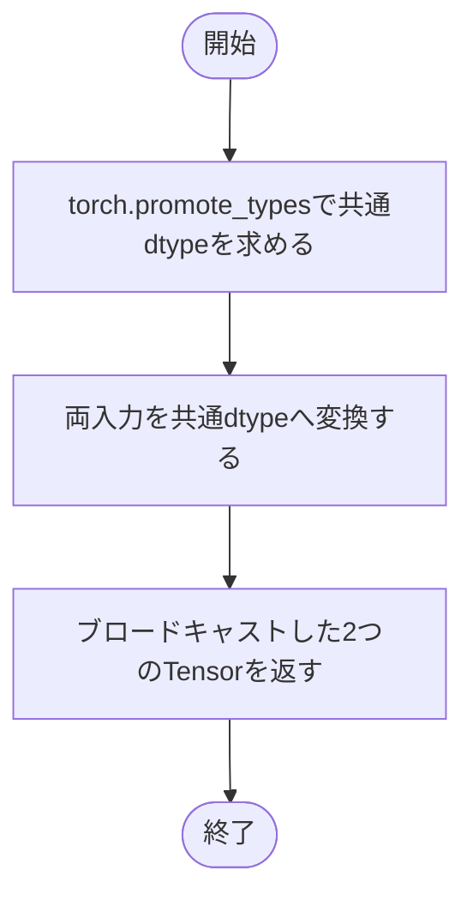
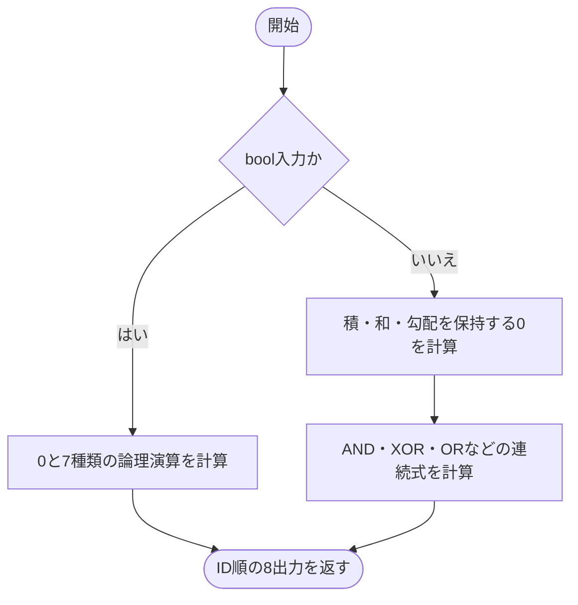
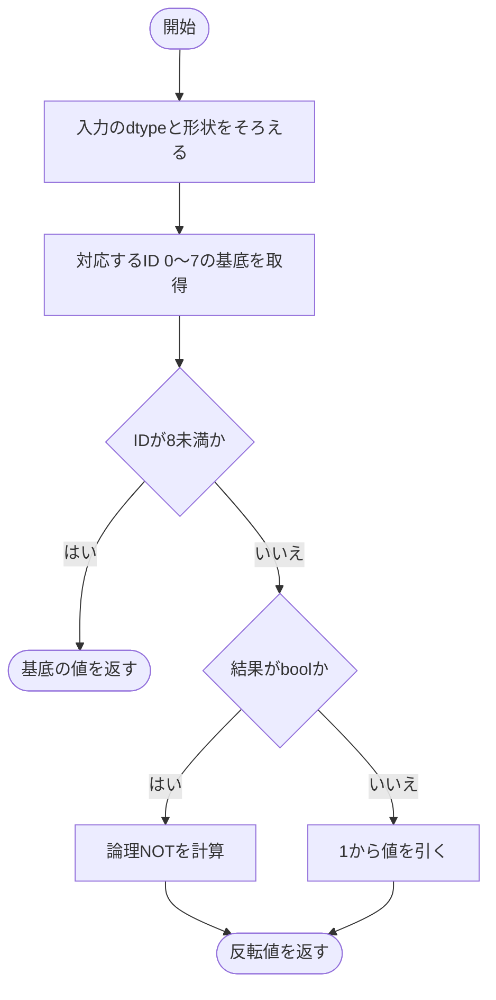
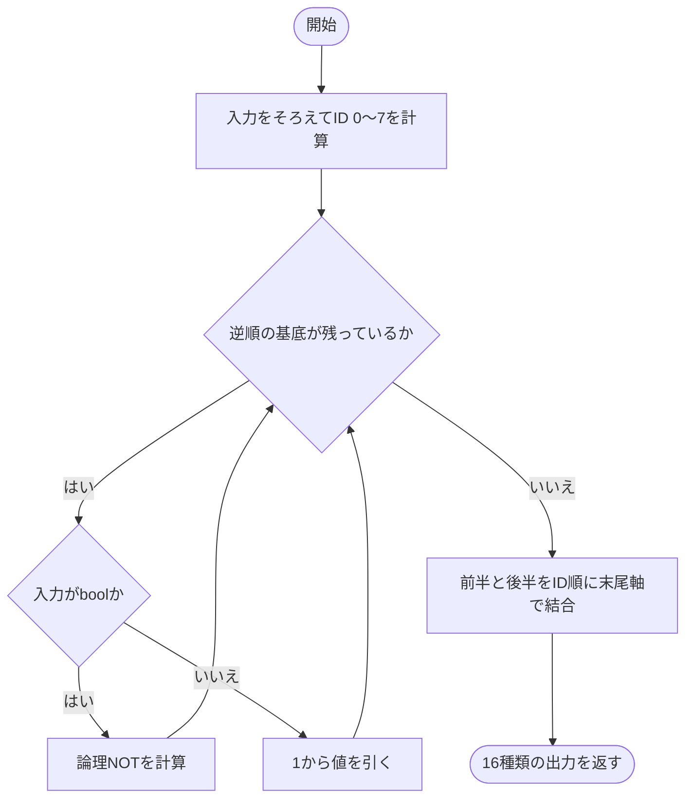
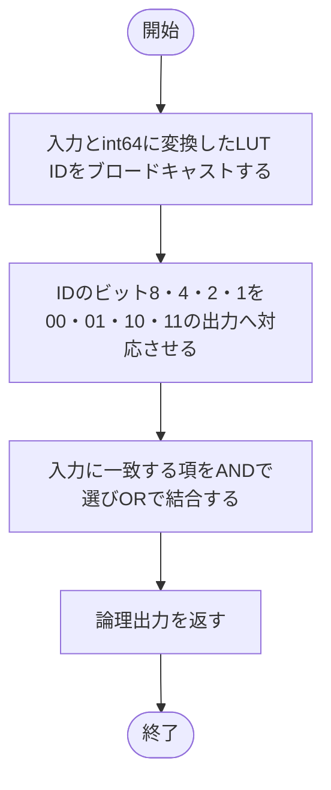
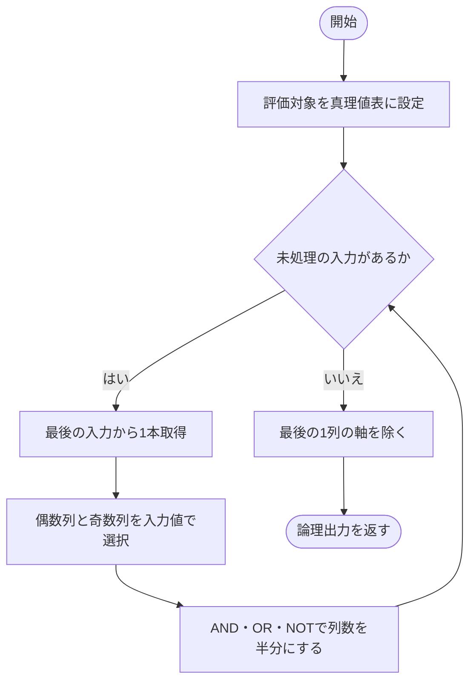

# logic.py

`utils/logicNN_core/src/logicnn_core/functional/logic.py`

2入力の16種類の論理関数と、多入力の真理値表の評価を実装します。浮動小数点入力には学習用の連続式を使い、回路出力用の関数ではboolのAND・OR・NOTだけで結果を計算します。

{/* source-sha256: d6859f3a48d7b9339b3e0450f2eecf2664c29d2f5454c00617e5662a0f7d90fb */}

{/* function: _broadcast_inputs@14 */}

## \_broadcast\_inputs() {/* #broadcast-inputs */}

```python
def _broadcast_inputs(a: Tensor, b: Tensor) -> tuple[Tensor, Tensor]:
```

### 機能概要

2つのTensorを共通のdtypeへ変換し、PyTorchのブロードキャスト規則で形状をそろえます。

### 引数

| 引数 | 型 | 既定値 | 説明 |
|---|---|---|---|
| `a` | `Tensor` | `必須` | 第1入力のTensor。 |
| `b` | `Tensor` | `必須` | 第2入力のTensor。aとブロードキャスト可能な形状。 |

### 処理の流れ



### 戻り値

型：`tuple[Tensor, Tensor]`

共通のdtypeと形状を持つa、bのtuple。

### ソースコード

<details>
<summary>\_broadcast\_inputs() の実装を開く</summary>

```python
def _broadcast_inputs(a: Tensor, b: Tensor) -> tuple[Tensor, Tensor]:
    """入力を共通dtypeへ揃え、PyTorchのbroadcastへ渡す。"""
    dtype = torch.promote_types(a.dtype, b.dtype)
    return torch.broadcast_tensors(a.to(dtype), b.to(dtype))
```

</details>

{/* function: _first_eight_outputs@20 */}

## \_first\_eight\_outputs() {/* #first-eight-outputs */}

```python
def _first_eight_outputs(a: Tensor, b: Tensor) -> tuple[Tensor, ...]:
```

### 機能概要

LUT ID 0〜7に対応する、0、AND、A AND NOT B、A、NOT A AND B、B、XOR、ORの出力を順に返します。boolでは論理演算、数値TensorではA×Bを共有する連続式を使います。

### 引数

| 引数 | 型 | 既定値 | 説明 |
|---|---|---|---|
| `a` | `Tensor` | `必須` | 形状とdtypeがbとそろっている第1入力。 |
| `b` | `Tensor` | `必須` | 形状とdtypeがaとそろっている第2入力。 |

### 処理の流れ



### 戻り値

型：`tuple[Tensor, ...]`

ID 0〜7の出力Tensorを順番に格納した8要素tuple。

### 例外・注意事項

- 数値入力のXORはA+B−2AB、ORはA+B−ABです。入力が0か1なら離散論理と一致します。

### ソースコード

<details>
<summary>\_first\_eight\_outputs() の実装を開く</summary>

```python
def _first_eight_outputs(a: Tensor, b: Tensor) -> tuple[Tensor, ...]:
    """共通計算を再利用してID 0〜7の論理値または連続基底を返す。"""
    if a.dtype == torch.bool:
        return torch.zeros_like(a), a & b, a & ~b, a, ~a & b, b, a ^ b, a | b
    ab     = a * b
    summed = a + b
    zero   = a * 0 + b * 0
    return zero, ab, a - ab, a, b - ab, b, summed - 2 * ab, summed - ab
```

</details>

{/* function: apply_binary_lut@30 */}

## apply\_binary\_lut() {/* #apply-binary-lut */}

```python
def apply_binary_lut(a: Tensor, b: Tensor, lut_id: int) -> Tensor:
```

### 機能概要

指定されたLUT IDに対応する2入力関数を計算します。ID 8〜15は、ID 15−lut_idの出力を反転することで求めます。

### 引数

| 引数 | 型 | 既定値 | 説明 |
|---|---|---|---|
| `a` | `Tensor` | `必須` | 第1入力。数値Tensorでは通常0〜1の学習用値を渡します。 |
| `b` | `Tensor` | `必須` | 第2入力。aとブロードキャスト可能なTensor。 |
| `lut_id` | `int` | `必須` | 0〜15のLUT ID。 |

### 処理の流れ



### 戻り値

型：`Tensor`

a、bをブロードキャストした形状の出力Tensor。

### ソースコード

<details>
<summary>apply\_binary\_lut() の実装を開く</summary>

```python
def apply_binary_lut(a: Tensor, b: Tensor, lut_id: int) -> Tensor:
    """固定IDの二入力論理関数をbroadcastし、浮動小数点には連続式を適用する。"""
    a, b   = _broadcast_inputs(a, b)
    index  = lut_id if lut_id < 8 else 15 - lut_id
    result = _first_eight_outputs(a, b)[index]
    if lut_id < 8:
        return result
    return ~result if result.dtype == torch.bool else 1 - result
```

</details>

{/* function: all_binary_logic_outputs@40 */}

## all\_binary\_logic\_outputs() {/* #all-binary-logic-outputs */}

```python
def all_binary_logic_outputs(a: Tensor, b: Tensor) -> Tensor:
```

### 機能概要

2つの入力に対して16種類のLUT出力をまとめて計算します。前半8種類と、その逆順の反転を結合してID順を保持します。

### 引数

| 引数 | 型 | 既定値 | 説明 |
|---|---|---|---|
| `a` | `Tensor` | `必須` | 第1入力Tensor。 |
| `b` | `Tensor` | `必須` | 第2入力Tensor。aとブロードキャスト可能な形状。 |

### 処理の流れ



### 戻り値

型：`Tensor`

ブロードキャスト後の形状の末尾に16要素のLUT軸を追加したTensor。

### ソースコード

<details>
<summary>all\_binary\_logic\_outputs() の実装を開く</summary>

```python
def all_binary_logic_outputs(a: Tensor, b: Tensor) -> Tensor:
    """broadcast後の末尾にID順で16論理関数の値を並べる。"""
    a, b  = _broadcast_inputs(a, b)
    first = _first_eight_outputs(a, b)
    last  = tuple(~value if a.dtype == torch.bool else 1 - value for value in reversed(first))
    return torch.stack(first + last, dim=-1)
```

</details>

{/* function: apply_export_luts@48 */}

## apply\_export\_luts() {/* #apply-export-luts */}

```python
def apply_export_luts(a: Tensor, b: Tensor, lut_ids: Tensor) -> Tensor:
```

### 機能概要

2入力のbool信号と整数LUT IDを使い、真理値表の4ビットをAND・OR・NOTに展開して評価します。入力値をPythonの数値へ取り出さないため、回路生成で演算を追跡できます。

### 引数

| 引数 | 型 | 既定値 | 説明 |
|---|---|---|---|
| `a` | `Tensor` | `必須` | 第1入力のbool Tensor。 |
| `b` | `Tensor` | `必須` | 第2入力のbool Tensor。 |
| `lut_ids` | `Tensor` | `必須` | 0〜15の整数LUT IDを持つTensor。a、bとブロードキャスト可能な形状。 |

### 処理の流れ



### 戻り値

型：`Tensor`

ブロードキャスト後の形状を持つbool Tensor。

### ソースコード

<details>
<summary>apply\_export\_luts() の実装を開く</summary>

```python
def apply_export_luts(a: Tensor, b: Tensor, lut_ids: Tensor) -> Tensor:
    """bool入力と整数IDをbroadcastし、値のPython抽出なしでLUTを適用する。"""
    a, b, ids = torch.broadcast_tensors(a, b, lut_ids.to(torch.int64))
    bit00 = (ids & 8) != 0
    bit01 = (ids & 4) != 0
    bit10 = (ids & 2) != 0
    bit11 = (ids & 1) != 0
    return (~a & ~b & bit00) | (~a & b & bit01) | (a & ~b & bit10) | (a & b & bit11)
```

</details>

{/* function: apply_export_truth_tables@58 */}

## apply\_export\_truth\_tables() {/* #apply-export-truth-tables */}

```python
def apply_export_truth_tables(inputs: tuple[Tensor, ...], tables: Tensor) -> Tensor:
```

### 機能概要

真理値表を2列ずつまとめ、最後の入力から順に選択を重ねて出力を求めます。データ依存のインデックス参照を使わず、各選択をAND・OR・NOTで表します。

### 引数

| 引数 | 型 | 既定値 | 説明 |
|---|---|---|---|
| `inputs` | `tuple[Tensor, ...]` | `必須` | 第1入力が最上位ビットとなる順のbool Tensorのtuple。入力本数をrankとします。 |
| `tables` | `Tensor` | `必須` | 末尾軸が2**rank要素のbool真理値表。列は入力の2進昇順に対応します。 |

### 処理の流れ



### 戻り値

型：`Tensor`

真理値表の列軸を除いたbool Tensor。先行形状は入力とのブロードキャストに従います。

### ソースコード

<details>
<summary>apply\_export\_truth\_tables() の実装を開く</summary>

```python
def apply_export_truth_tables(inputs: tuple[Tensor, ...], tables: Tensor) -> Tensor:
    """MSB-firstのbool真理値表をAND・OR・NOTへ分解し、入力依存の表引きなしで評価する。"""
    values = tables
    for signal in reversed(inputs):
        selected = signal.unsqueeze(-1)
        values   = (~selected & values[..., 0::2]) | (selected & values[..., 1::2])
    return values.squeeze(-1)
```

</details>
