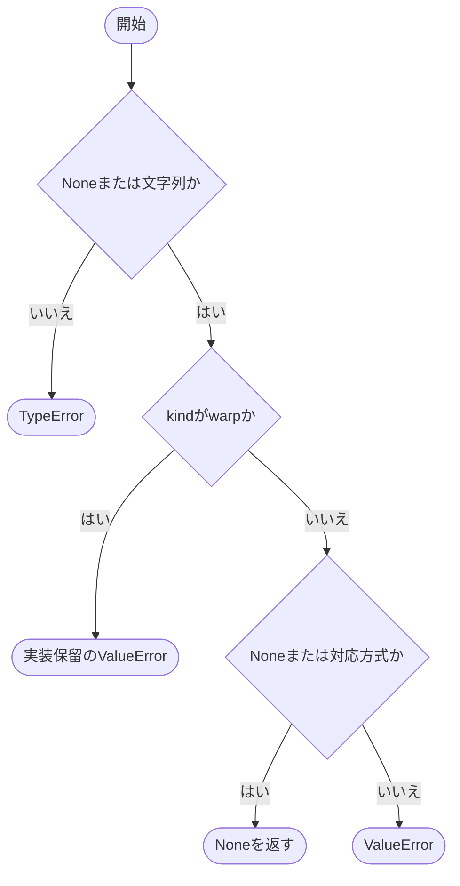
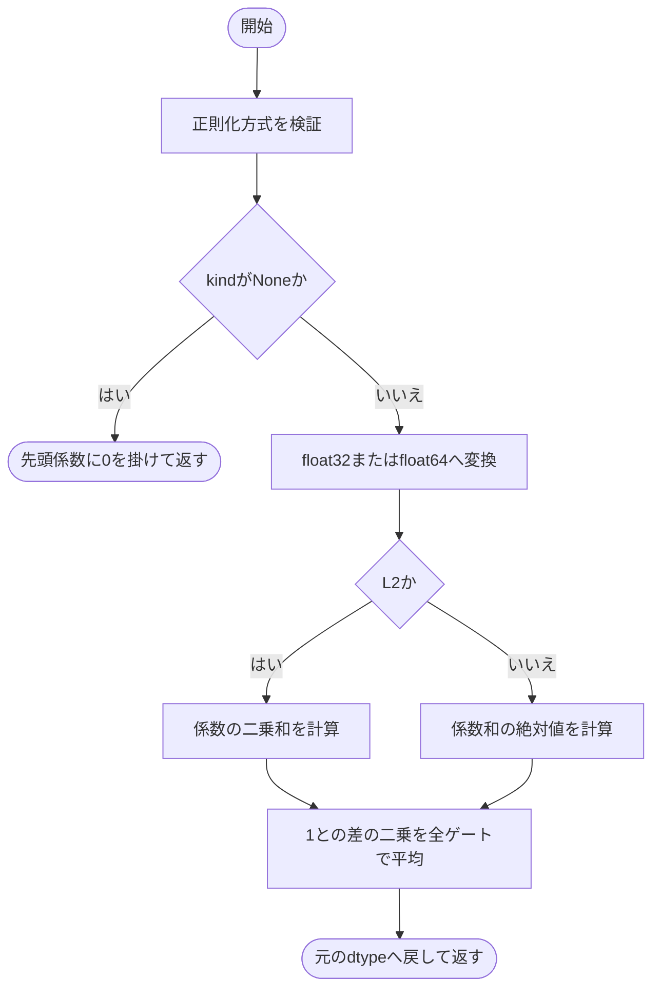
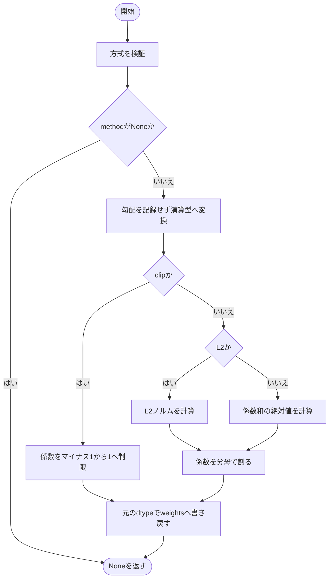

# regularization.py

`utils/logicNN_core/src/logicnn_core/functional/regularization.py`

ゲートの係数に対する正則化損失と、係数の直接的な再スケールを実装します。正則化は損失へ加える値を返し、再スケールは既存のParameterの値を直接更新します。Warp固有の正則化は実装保留です。

{/* source-sha256: 856f5c46885798c697d619ff17aab5b8b98e2372a3a78b448ef080a3fa47b308 */}

{/* function: _validate_choice@16 */}

## \_validate\_choice() {/* #validate-choice */}

```python
def _validate_choice(name: str, value: str | None, choices: tuple[str, ...]) -> None:
```

### 機能概要

方式名がNoneまたは許可された文字列かを確認します。kind='warp'は未実装機能として専用の理由を示し、Warpパラメータ化本体と区別します。

### 引数

| 引数 | 型 | 既定値 | 説明 |
|---|---|---|---|
| `name` | `str` | `必須` | 検証対象の設定名。kindまたはmethod。 |
| `value` | `str \| None` | `必須` | 検証する方式名。 |
| `choices` | `tuple[str, ...]` | `必須` | 許可する方式名のtuple。 |

### 処理の流れ



### 戻り値

型：`None`

None。不正な型ではTypeError、未対応方式ではValueError。

### ソースコード

<details>
<summary>\_validate\_choice() の実装を開く</summary>

```python
def _validate_choice(name: str, value: str | None, choices: tuple[str, ...]) -> None:
    """Noneまたは対応する方式名だけを受理し、保留warpは理由を付けて拒否する。"""
    if value is not None and not isinstance(value, str):
        raise TypeError(f"{name} は文字列またはNoneで指定してください")
    if name == "kind" and value == "warp":
        raise ValueError("warp 正則化は実装保留です。Warpパラメータ化本体とは別の機能です")
    if value is not None and value not in choices:
        raise ValueError(f"未対応の{name}: {value!r}。対応方式は {choices} またはNoneです")
```

</details>

{/* function: regularization_loss@26 */}

## regularization\_loss() {/* #regularization-loss */}

```python
def regularization_loss(weights: Tensor, kind: str | None = None) -> Tensor:
```

### 機能概要

ゲートごとに係数を集計し、目標値1からのずれの二乗を全ゲートで平均します。L2は係数の二乗和、abs_sumは係数の和の絶対値を使います。

### 引数

| 引数 | 型 | 既定値 | 説明 |
|---|---|---|---|
| `weights` | `Tensor` | `必須` | 末尾軸にゲートの係数を持つ浮動小数点Tensor。 |
| `kind` | `str \| None` | `None` | None、L2、abs_sumのいずれか。 |

### 処理の流れ



### 戻り値

型：`Tensor`

weightsと同じdtypeのscalar Tensor。Noneでは勾配経路を持つ0。

### 例外・注意事項

- abs_sumは絶対値の和ではなく、和の絶対値です。kind=Noneでもweightsは空でないTensorを想定します。

### ソースコード

<details>
<summary>regularization\_loss() の実装を開く</summary>

```python
def regularization_loss(weights: Tensor, kind: str | None = None) -> Tensor:
    """旧L2／abs_sumのゲート別ペナルティを全ゲートで平均したscalarを返す。"""
    _validate_choice("kind", kind, ("L2", "abs_sum"))
    if kind is None:
        return weights.reshape(-1)[0] * 0
    values    = weights.to(dtype=torch.float64 if weights.dtype == torch.float64 else torch.float32)
    statistic = values.square().sum(dim=-1) if kind == "L2" else values.sum(dim=-1).abs()
    return (1 - statistic).square().mean().to(dtype=weights.dtype)
```

</details>

{/* function: rescale_weights_@36 */}

## rescale\_weights\_() {/* #rescale-weights */}

```python
def rescale_weights_(weights: Tensor, method: str | None = None) -> None:
```

### 機能概要

勾配記録を無効にして係数を再スケールし、同じweightsへ書き戻します。clipは[-1,1]への制限、L2はゲートごとのL2ノルムによる除算、abs_sumは係数和の絶対値による除算です。

### 引数

| 引数 | 型 | 既定値 | 説明 |
|---|---|---|---|
| `weights` | `Tensor` | `必須` | 末尾軸がゲートの係数である、直接更新するTensorまたはParameter。 |
| `method` | `str \| None` | `None` | None、clip、L2、abs_sumのいずれか。 |

### 処理の流れ



### 戻り値

型：`None`

None。

### 状態の変更・ファイル出力

- weightsの値を直接更新します。Parameterオブジェクトと既存のgradは置き換えません。

### 例外・注意事項

- 除数が0の場合の補正はありません。L2・abs_sumでは分母が0にならない係数を渡す必要があります。

### ソースコード

<details>
<summary>rescale\_weights\_() の実装を開く</summary>

```python
def rescale_weights_(weights: Tensor, method: str | None = None) -> None:
    """ゲートごとの係数をin-place更新し、Parameterと既存勾配を保持する。"""
    _validate_choice("method", method, ("clip", "L2", "abs_sum"))
    if method is None:
        return
    with torch.no_grad():
        values = weights.to(dtype=torch.float64 if weights.dtype == torch.float64 else torch.float32)
        if method == "clip":
            candidate = values.clamp(-1, 1)
        else:
            denominator = values.norm(p=2, dim=-1, keepdim=True) if method == "L2" else values.sum(dim=-1, keepdim=True).abs()
            candidate = values / denominator
        candidate = candidate.to(dtype=weights.dtype)
        weights.copy_(candidate)
```

</details>
