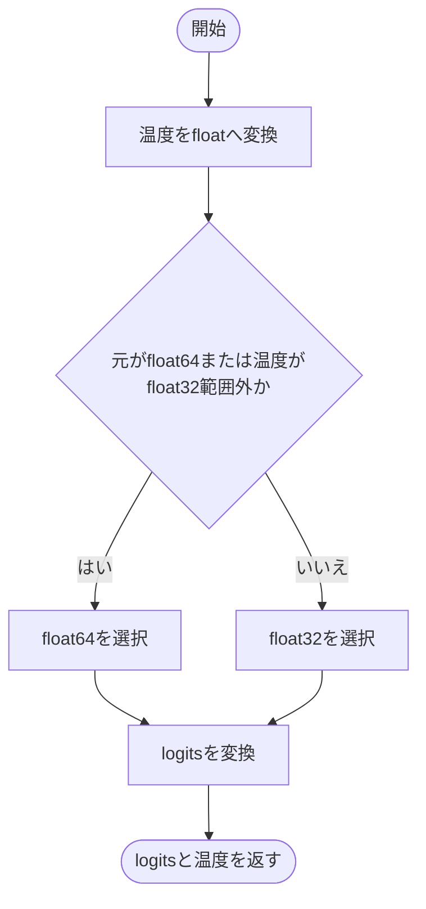
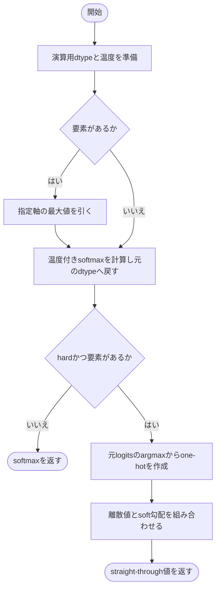
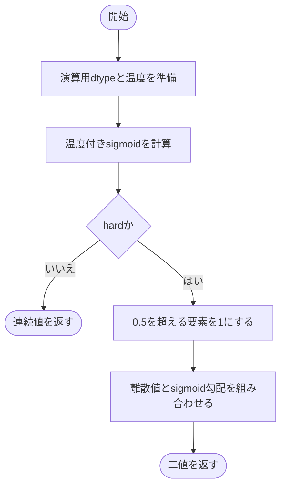
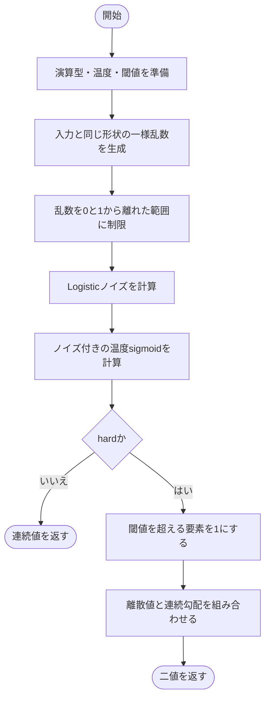
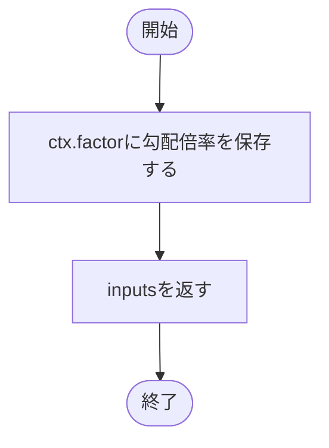
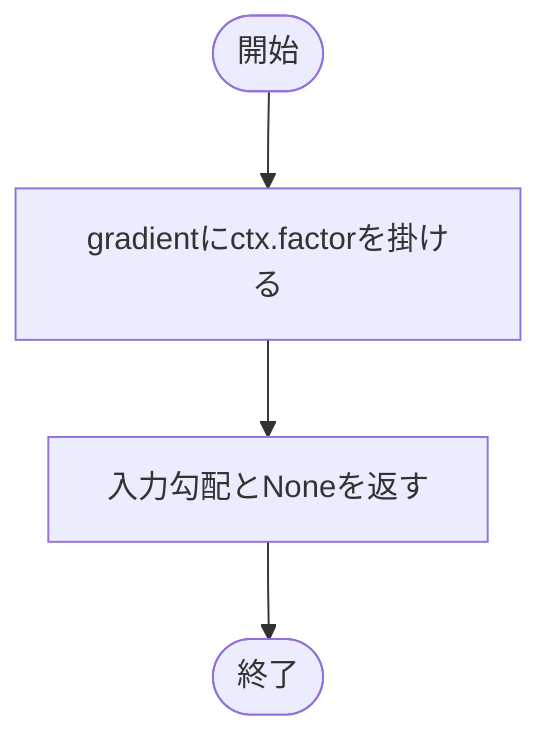
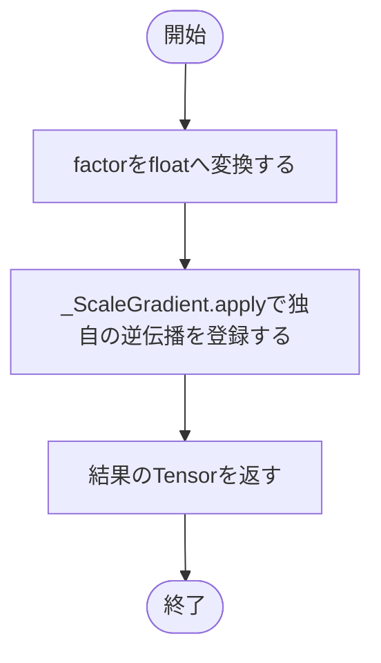

# sampling.py

`utils/logicNN_core/src/logicnn_core/functional/sampling.py`

温度付きsoftmax・sigmoid、乱数を使う二値化、勾配倍率の変更を実装します。hard=Trueの選択は順伝播を離散値にしながら、逆伝播には連続値の勾配を使うstraight-through方式です。

{/* source-sha256: b57231e87dfc925a34e360e9b2c36d8de7427217367433da35a5c152597050c9 */}

{/* function: _prepare_logits@18 */}

## \_prepare\_logits() {/* #prepare-logits */}

```python
def _prepare_logits(logits: Tensor, temperature: float) -> tuple[Tensor, float]:
```

### 機能概要

温度をfloatへ変換し、安定した計算のためにlogitsの演算型を選びます。元がfloat64、または温度がfloat32の通常の正規化範囲外ならfloat64、それ以外はfloat32を使います。

### 引数

| 引数 | 型 | 既定値 | 説明 |
|---|---|---|---|
| `logits` | `Tensor` | `必須` | 温度付き選択に使う浮動小数点Tensor。 |
| `temperature` | `float` | `必須` | logitsを割る温度。呼び出し側で正の有限値を指定します。 |

### 処理の流れ



### 戻り値

型：`tuple[Tensor, float]`

演算用dtypeへ変換したlogitsとfloatの温度のtuple。

### ソースコード

<details>
<summary>\_prepare\_logits() の実装を開く</summary>

```python
def _prepare_logits(logits: Tensor, temperature: float) -> tuple[Tensor, float]:
    """低precisionや極端な温度で必要な演算dtypeへ移す。"""
    temperature = float(temperature)
    bounds      = torch.finfo(torch.float32)
    dtype       = torch.float64 if logits.dtype == torch.float64 or not bounds.tiny <= temperature <= bounds.max else torch.float32
    return logits.to(dtype=dtype), temperature
```

</details>

{/* function: temperature_softmax@26 */}

## temperature\_softmax() {/* #temperature-softmax */}

```python
def temperature_softmax(logits: Tensor, *, temperature: float = 1.0, dim: int = -1, hard: bool = False) -> Tensor:
```

### 機能概要

指定軸の最大値を引いてから温度で割り、softmaxを計算します。hard=Trueでは最大logitの位置を1とするone-hot値を返し、勾配はsoftmaxの計算経路へ流します。

### 引数

| 引数 | 型 | 既定値 | 説明 |
|---|---|---|---|
| `logits` | `Tensor` | `必須` | 選択前の浮動小数点Tensor。 |
| `temperature` | `float` | `1.0` | 確率分布の鋭さを変える正の温度。 |
| `dim` | `int` | `-1` | 候補を並べた軸。 |
| `hard` | `bool` | `False` | Trueなら順伝播をone-hotへ離散化します。 |

### 処理の流れ



### 戻り値

型：`Tensor`

logitsと同じ形状・dtypeのTensor。hard=Falseは確率、hard=Trueは順伝播でone-hot。

### 例外・注意事項

- 最大logitが複数ある場合は先頭を選びます。空Tensorでは離散化を行いません。

### ソースコード

<details>
<summary>temperature\_softmax() の実装を開く</summary>

```python
def temperature_softmax(logits: Tensor, *, temperature: float = 1.0, dim: int = -1, hard: bool = False) -> Tensor:
    """温度付きsoftmaxを返し、hard時は先頭最大indexを選んでsoft勾配を保つ。"""
    values, temperature = _prepare_logits(logits, temperature)
    if values.numel() > 0:
        values = values - values.amax(dim=dim, keepdim=True)
    soft = torch.softmax(values / temperature, dim=dim).to(dtype=logits.dtype)
    if not hard:
        return soft
    if soft.numel() == 0:
        return soft
    index    = logits.argmax(dim=dim, keepdim=True)
    discrete = torch.zeros_like(soft).scatter_(dim, index, 1)
    return (discrete - soft).detach() + soft
```

</details>

{/* function: temperature_sigmoid@41 */}

## temperature\_sigmoid() {/* #temperature-sigmoid */}

```python
def temperature_sigmoid(logits: Tensor, *, temperature: float = 1.0, hard: bool = False) -> Tensor:
```

### 機能概要

logitsを温度で割ってsigmoidを計算します。hard=Trueでは結果が0.5を厳密に超える要素だけを1とし、sigmoidの勾配を保持します。

### 引数

| 引数 | 型 | 既定値 | 説明 |
|---|---|---|---|
| `logits` | `Tensor` | `必須` | 要素ごとに二値選択する浮動小数点Tensor。 |
| `temperature` | `float` | `1.0` | sigmoidの鋭さを変える正の温度。 |
| `hard` | `bool` | `False` | Trueなら順伝播を0または1にします。 |

### 処理の流れ



### 戻り値

型：`Tensor`

logitsと同じ形状・dtypeのTensor。hard=Falseは連続値、hard=Trueはstraight-throughの二値。

### 例外・注意事項

- 値がちょうど0.5の場合は0です。

### ソースコード

<details>
<summary>temperature\_sigmoid() の実装を開く</summary>

```python
def temperature_sigmoid(logits: Tensor, *, temperature: float = 1.0, hard: bool = False) -> Tensor:
    """温度付きsigmoidを返し、hard時は0.5を厳密に超えた要素を1にする。"""
    values, temperature = _prepare_logits(logits, temperature)
    soft                = torch.sigmoid(values / temperature).to(dtype=logits.dtype)
    if not hard:
        return soft
    discrete = (soft > 0.5).to(dtype=logits.dtype)
    return (discrete - soft).detach() + soft
```

</details>

{/* function: gumbel_sigmoid@51 */}

## gumbel\_sigmoid() {/* #gumbel-sigmoid */}

```python
def gumbel_sigmoid(
    logits: Tensor,
    *,
    temperature: float = 1.0,
    hard: bool = False,
    threshold: float = 0.5,
    generator: torch.Generator | None = None,
) -> Tensor:
```

### 機能概要

一様乱数のlog oddsをlogitsへ加えてから温度付きsigmoidを計算します。関数名はgumbel_sigmoidですが、実装で直接加えているノイズはlog(U)−log(1−U)のLogisticノイズです。

### 引数

| 引数 | 型 | 既定値 | 説明 |
|---|---|---|---|
| `logits` | `Tensor` | `必須` | 二値選択前の浮動小数点Tensor。 |
| `temperature` | `float` | `1.0` | ノイズを加えたlogitsを割る正の温度。 |
| `hard` | `bool` | `False` | Trueなら指定閾値で離散化し、連続計算の勾配を使います。 |
| `threshold` | `float` | `0.5` | hard=Trueで使う閾値。値が閾値を超えた場合だけ1。 |
| `generator` | `torch.Generator \| None` | `None` | 一様乱数に使うPyTorch Generator。Noneなら既定の乱数生成器。 |

### 処理の流れ



### 戻り値

型：`Tensor`

logitsと同じ形状・dtypeの確率またはstraight-throughの二値Tensor。

### 状態の変更・ファイル出力

- 指定したgenerator、または既定の乱数状態を消費します。

### 例外・注意事項

- generatorを指定する場合は、乱数を生成するlogitsのデバイスに対応したものを使用します。

### ソースコード

<details>
<summary>gumbel\_sigmoid() の実装を開く</summary>

```python
def gumbel_sigmoid(
    logits: Tensor,
    *,
    temperature: float = 1.0,
    hard: bool = False,
    threshold: float = 0.5,
    generator: torch.Generator | None = None,
) -> Tensor:
    """一様乱数のlog oddsを加えたsigmoidと、任意閾値のstraight-through二値化を返す。"""
    values, temperature = _prepare_logits(logits, temperature)
    threshold           = float(threshold)
    uniform = torch.rand(logits.shape, dtype=logits.dtype, device=logits.device, generator=generator).to(dtype=values.dtype)
    bounds  = torch.finfo(values.dtype)
    uniform = uniform.clamp(min=bounds.tiny, max=1.0 - bounds.eps)
    noise   = uniform.log() - torch.log1p(-uniform)
    soft    = torch.sigmoid((values + noise) / temperature).to(dtype=logits.dtype)
    if not hard:
        return soft
    discrete = (soft > threshold).to(dtype=logits.dtype)
    return (discrete - soft).detach() + soft
```

</details>

## \_ScaleGradient {/* #scalegradient-class */}

順伝播の値を変えず、逆伝播の入力勾配だけに倍率を掛ける内部用autograd関数です。

継承元：`torch.autograd.Function`

{/* function: _ScaleGradient.forward@77 */}

## \_ScaleGradient.forward() {/* #scalegradient-forward */}

```python
def forward(ctx: Any, inputs: Tensor, factor: float) -> Tensor:
```

### 機能概要

逆伝播で使う倍率を保存し、入力を算術演算せずそのまま返します。

### 引数

| 引数 | 型 | 既定値 | 説明 |
|---|---|---|---|
| `ctx` | `Any` | `必須` | 逆伝播用に倍率を保存するPyTorchの領域。 |
| `inputs` | `Tensor` | `必須` | 値を変更せず通過させるTensor。 |
| `factor` | `float` | `必須` | 逆伝播時の入力勾配に掛ける倍率。 |

### 処理の流れ



### 戻り値

型：`Tensor`

inputsの値をそのまま持つTensor。

### 状態の変更・ファイル出力

- ctx.factorを設定します。

### ソースコード

<details>
<summary>\_ScaleGradient.forward() の実装を開く</summary>

```python
@staticmethod
def forward(ctx: Any, inputs: Tensor, factor: float) -> Tensor:
    """入力をそのまま返し、逆伝播に使う係数だけを記録する。"""
    ctx.factor = factor
    return inputs
```

</details>

{/* function: _ScaleGradient.backward@83 */}

## \_ScaleGradient.backward() {/* #scalegradient-backward */}

```python
def backward(ctx: Any, gradient: Tensor) -> tuple[Tensor, None]:
```

### 機能概要

上流から受け取った勾配に保存済みの倍率を掛けます。倍率そのものはTensorではないため、倍率に対する勾配は返しません。

### 引数

| 引数 | 型 | 既定値 | 説明 |
|---|---|---|---|
| `ctx` | `Any` | `必須` | 順伝播で保存したfactorを持つ領域。 |
| `gradient` | `Tensor` | `必須` | 出力に対する勾配Tensor。 |

### 処理の流れ



### 戻り値

型：`tuple[Tensor, None]`

入力勾配gradient×factorと、factor用のNoneのtuple。

### ソースコード

<details>
<summary>\_ScaleGradient.backward() の実装を開く</summary>

```python
@staticmethod
def backward(ctx: Any, gradient: Tensor) -> tuple[Tensor, None]:
    """入力勾配を指定倍率にし、非Tensor係数の勾配は返さない。"""
    return gradient * ctx.factor, None
```

</details>

{/* function: scale_gradient@88 */}

## scale\_gradient() {/* #scale-gradient */}

```python
def scale_gradient(inputs: Tensor, factor: float) -> Tensor:
```

### 機能概要

値・形状・dtypeを変えずにTensorを通過させ、逆伝播でそのTensorへ流れる勾配だけを指定倍率にします。

### 引数

| 引数 | 型 | 既定値 | 説明 |
|---|---|---|---|
| `inputs` | `Tensor` | `必須` | 勾配倍率を変えたいTensor。 |
| `factor` | `float` | `必須` | 勾配に掛ける倍率。floatへ変換して使用します。 |

### 処理の流れ



### 戻り値

型：`Tensor`

入力と同じ値・形状・dtypeを持ち、勾配計算だけが異なるTensor。

### ソースコード

<details>
<summary>scale\_gradient() の実装を開く</summary>

```python
def scale_gradient(inputs: Tensor, factor: float) -> Tensor:
    """入力値・shape・dtypeを変更せず、逆伝播の勾配だけを係数倍する。"""
    return _ScaleGradient.apply(inputs, float(factor))
```

</details>
