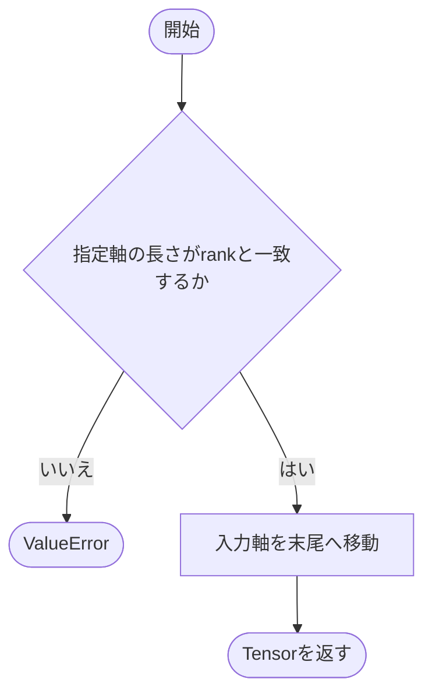
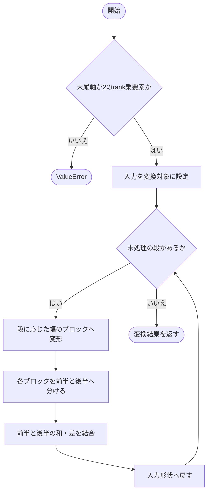
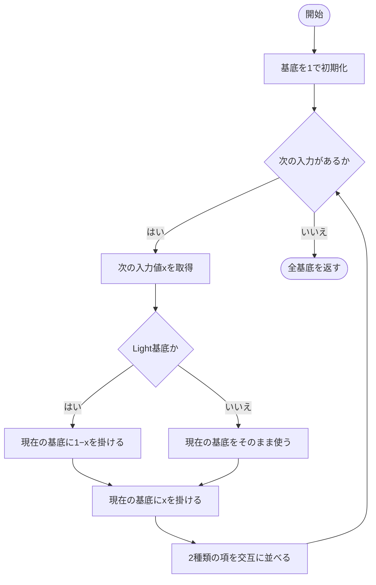
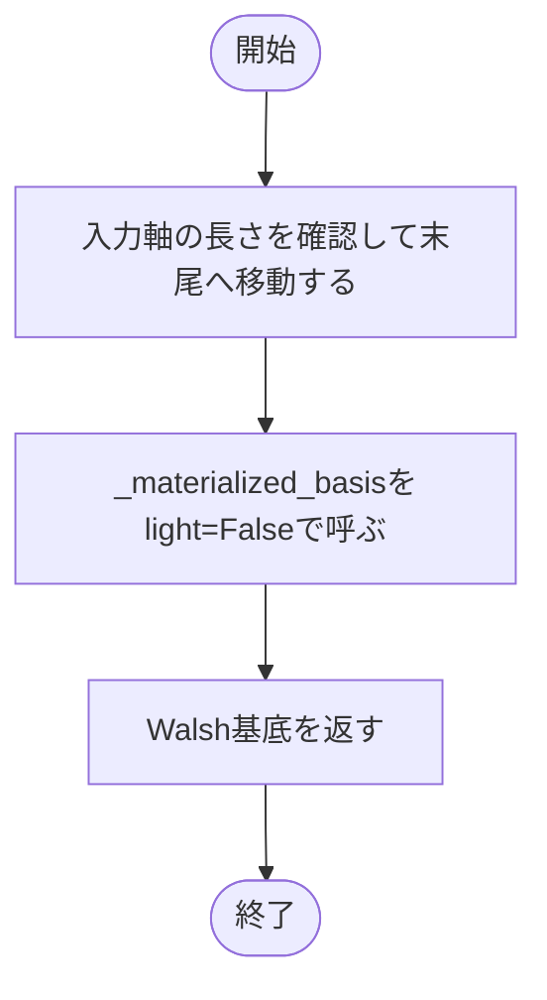
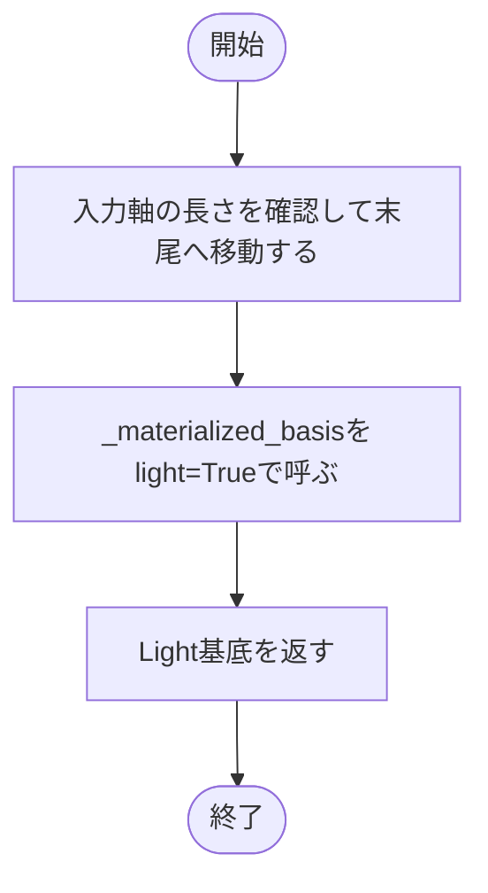
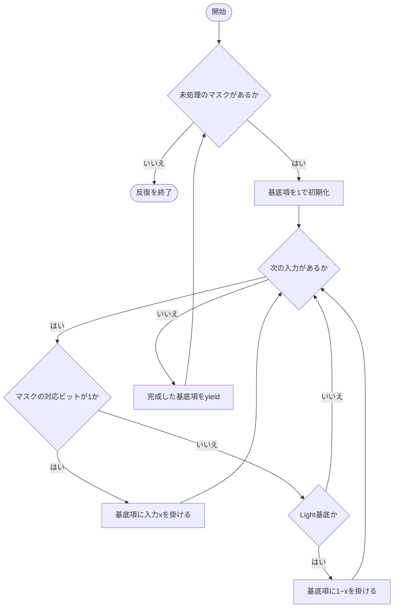
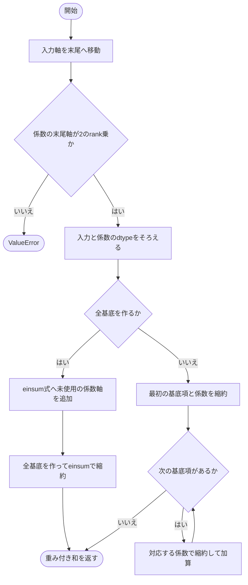
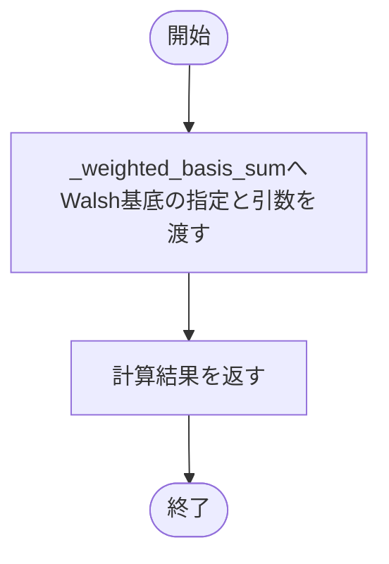
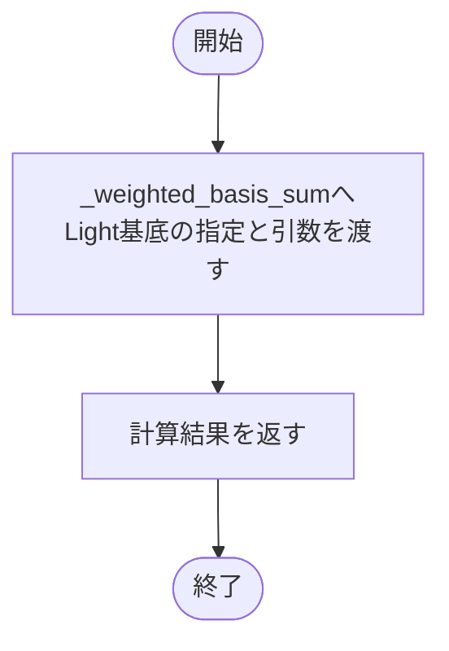

# walsh.py

`utils/logicNN_core/src/logicnn_core/functional/walsh.py`

Walsh-Hadamard変換、Walsh基底、Light基底を実装します。基底の列順は第1入力を最上位側とする真理値表順です。重み付き和は、全基底を一度に作る方式と、項ごとに計算する方式から選択できます。

{/* source-sha256: 5caddf971faa9ef703a8c393245bb574ef6e108f0b8b284cfbbd065d9932762a */}

{/* function: _prepare_inputs@19 */}

## \_prepare\_inputs() {/* #prepare-inputs */}

```python
def _prepare_inputs(inputs: Tensor, rank: int, input_dim: int) -> Tensor:
```

### 機能概要

入力本数の軸の長さがrankと一致するかを確認し、その軸だけを末尾へ移動します。ほかの軸の相対的な順序は変えません。

### 引数

| 引数 | 型 | 既定値 | 説明 |
|---|---|---|---|
| `inputs` | `Tensor` | `必須` | ゲート入力を含むTensor。 |
| `rank` | `int` | `必須` | 入力本数。 |
| `input_dim` | `int` | `必須` | 入力本数が並ぶ軸。 |

### 処理の流れ



### 戻り値

型：`Tensor`

末尾軸がrank要素のTensor。

### ソースコード

<details>
<summary>\_prepare\_inputs() の実装を開く</summary>

```python
def _prepare_inputs(inputs: Tensor, rank: int, input_dim: int) -> Tensor:
    """入力軸の長さを確認して末尾へ移し、他の次元の順序を維持する。"""
    if inputs.shape[input_dim] != rank:
        raise ValueError(f"inputs のinput_dim軸はrank={rank}と一致する必要があります")
    return inputs.movedim(input_dim, -1)
```

</details>

{/* function: fast_walsh_hadamard@26 */}

## fast\_walsh\_hadamard() {/* #fast-walsh-hadamard */}

```python
def fast_walsh_hadamard(inputs: Tensor, rank: int) -> Tensor:
```

### 機能概要

末尾2**rank要素を、要素対の和と差を繰り返す高速Walsh-Hadamard変換で変換します。正規化係数は掛けないため、同じ変換を2回行うと元の値の2**rank倍になります。

### 引数

| 引数 | 型 | 既定値 | 説明 |
|---|---|---|---|
| `inputs` | `Tensor` | `必須` | 末尾軸が2**rank要素の数値Tensor。 |
| `rank` | `int` | `必須` | 変換段数。末尾の要素数は2**rank。 |

### 処理の流れ



### 戻り値

型：`Tensor`

inputsと同じ形状・dtype・deviceの変換結果。

### ソースコード

<details>
<summary>fast\_walsh\_hadamard() の実装を開く</summary>

```python
def fast_walsh_hadamard(inputs: Tensor, rank: int) -> Tensor:
    """末尾2**rank要素を非正規化変換し、先行shape・dtype・deviceを維持する。"""
    entries = 1 << rank
    if inputs.ndim == 0 or inputs.shape[-1] != entries:
        raise ValueError(f"inputs の最終軸は2**rank={entries}要素で指定してください")
    values = inputs
    for stage in range(rank):
        half   = 1 << stage
        blocks = values.reshape(*inputs.shape[:-1], entries // (2 * half), 2 * half)
        first  = blocks[..., :half]
        second = blocks[..., half:]
        values = torch.cat((first + second, first - second), dim=-1).reshape(inputs.shape)
    return values
```

</details>

{/* function: _materialized_basis@41 */}

## \_materialized\_basis() {/* #materialized-basis */}

```python
def _materialized_basis(values: Tensor, rank: int, light: bool) -> Tensor:
```

### 機能概要

入力を先頭から1本ずつ追加し、各段で基底を2倍に展開します。Walshでは入力を含まない項と含む項、Lightでは1−xを掛ける項とxを掛ける項を並べます。

### 引数

| 引数 | 型 | 既定値 | 説明 |
|---|---|---|---|
| `values` | `Tensor` | `必須` | 末尾軸にrank本の入力を並べたTensor。 |
| `rank` | `int` | `必須` | 入力本数。 |
| `light` | `bool` | `必須` | TrueならLight基底、FalseならWalsh基底を作ります。 |

### 処理の流れ



### 戻り値

型：`Tensor`

valuesの末尾rank軸を2**rankの基底軸へ置き換えたTensor。

### ソースコード

<details>
<summary>\_materialized\_basis() の実装を開く</summary>

```python
def _materialized_basis(values: Tensor, rank: int, light: bool) -> Tensor:
    """入力を先頭からKronecker積で展開し、元の真理値表順を保つ。"""
    basis = torch.ones_like(values[..., :1])
    for index in range(rank):
        variable = values[..., index:index + 1]
        absent   = basis * (1 - variable) if light else basis
        present  = basis * variable
        basis    = torch.stack((absent, present), dim=-1).flatten(-2)
    return basis
```

</details>

{/* function: walsh_basis@52 */}

## walsh\_basis() {/* #walsh-basis */}

```python
def walsh_basis(inputs: Tensor, rank: int, *, input_dim: int = 1) -> Tensor:
```

### 機能概要

符号化済みの入力から、各入力を掛ける・掛けないの全組合せを作ります。2入力A、Bでは[1, B, A, AB]となります。この関数内では0〜1から−1〜1への変換を行いません。

### 引数

| 引数 | 型 | 既定値 | 説明 |
|---|---|---|---|
| `inputs` | `Tensor` | `必須` | rank本のゲート入力を指定軸に持つTensor。 |
| `rank` | `int` | `必須` | ゲートの入力本数。 |
| `input_dim` | `int` | `1` | 入力本数を並べた軸。既定値は1。 |

### 処理の流れ



### 戻り値

型：`Tensor`

入力軸を除いた形状の末尾に2**rank要素のWalsh基底軸を追加したTensor。

### ソースコード

<details>
<summary>walsh\_basis() の実装を開く</summary>

```python
def walsh_basis(inputs: Tensor, rank: int, *, input_dim: int = 1) -> Tensor:
    """符号化済み入力のWalsh基底を返し、rank 2では末尾を[1,B,A,AB]にする。"""
    values = _prepare_inputs(inputs, rank, input_dim)
    return _materialized_basis(values, rank, light=False)
```

</details>

{/* function: light_basis@58 */}

## light\_basis() {/* #light-basis */}

```python
def light_basis(inputs: Tensor, rank: int, *, input_dim: int = 1) -> Tensor:
```

### 機能概要

各入力xについてxまたは1−xを掛ける全組合せを作ります。2入力A、Bでは[(1−A)(1−B), (1−A)B, A(1−B), AB]となります。

### 引数

| 引数 | 型 | 既定値 | 説明 |
|---|---|---|---|
| `inputs` | `Tensor` | `必須` | rank本のゲート入力を指定軸に持つTensor。 |
| `rank` | `int` | `必須` | ゲートの入力本数。 |
| `input_dim` | `int` | `1` | 入力本数を並べた軸。既定値は1。 |

### 処理の流れ



### 戻り値

型：`Tensor`

入力軸を除いた形状の末尾に2**rank要素のLight基底軸を追加したTensor。

### ソースコード

<details>
<summary>light\_basis() の実装を開く</summary>

```python
def light_basis(inputs: Tensor, rank: int, *, input_dim: int = 1) -> Tensor:
    """各入力のxまたは1-xを真理値表順に掛けたLight基底を末尾軸へ返す。"""
    values = _prepare_inputs(inputs, rank, input_dim)
    return _materialized_basis(values, rank, light=True)
```

</details>

{/* function: _basis_terms@64 */}

## \_basis\_terms() {/* #basis-terms */}

```python
def _basis_terms(values: Tensor, rank: int, light: bool) -> Iterator[Tensor]:
```

### 機能概要

全基底のTensorを作らず、真理値表順のビットマスクに従って基底項を1つずつ生成します。Walshでは選んだ入力だけを掛け、Lightでは選ばない入力の1−xも掛けます。

### 引数

| 引数 | 型 | 既定値 | 説明 |
|---|---|---|---|
| `values` | `Tensor` | `必須` | 末尾軸にrank本の入力を並べたTensor。 |
| `rank` | `int` | `必須` | 入力本数。 |
| `light` | `bool` | `必須` | TrueならLight基底、FalseならWalsh基底。 |

### 処理の流れ



### 戻り値

型：`Iterator[Tensor]`

2**rank個の基底項Tensorを順にyieldするIterator。各項の形状はvaluesの末尾軸を除いた形状。

### ソースコード

<details>
<summary>\_basis\_terms() の実装を開く</summary>

```python
def _basis_terms(values: Tensor, rank: int, light: bool) -> Iterator[Tensor]:
    """全基底Tensorを確保せず、真理値表順の基底項を一つずつ生成する。"""
    for mask in range(1 << rank):
        term = torch.ones_like(values[..., 0])
        for index in range(rank):
            if mask & (1 << (rank - index - 1)):
                term = term * values[..., index]
            elif light:
                term = term * (1 - values[..., index])
        yield term
```

</details>

{/* function: _weighted_basis_sum@76 */}

## \_weighted\_basis\_sum() {/* #weighted-basis-sum */}

```python
def _weighted_basis_sum(inputs: Tensor, weights: Tensor, contraction: str, rank: int, input_dim: int, materialize_basis: bool, light: bool) -> Tensor:
```

### 機能概要

入力と係数のdtypeをそろえ、指定のeinsum式で重み付き基底和を計算します。全基底方式では式へ係数軸を追加して一度に縮約し、逐次方式では各係数と基底項の積和を順に加算します。

### 引数

| 引数 | 型 | 既定値 | 説明 |
|---|---|---|---|
| `inputs` | `Tensor` | `必須` | rank本のゲート入力をinput_dim軸に持つTensor。 |
| `weights` | `Tensor` | `必須` | 末尾軸が2**rankの係数Tensor。 |
| `contraction` | `str` | `必須` | 係数軸を除いたweightsと基底項に適用するeinsum式。例: 'o,bo->bo'。 |
| `rank` | `int` | `必須` | ゲートの入力本数。 |
| `input_dim` | `int` | `必須` | inputsのうち入力本数を並べた軸。 |
| `materialize_basis` | `bool` | `必須` | Trueなら全基底をまとめて計算し、Falseなら基底を1項ずつ計算して加算します。 |
| `light` | `bool` | `必須` | TrueならLight基底、FalseならWalsh基底を使います。 |

### 処理の流れ



### 戻り値

型：`Tensor`

contractionの出力軸に従うTensor。dtypeは入力と係数の共通型。

### 例外・注意事項

- contractionは2入力・明示的な出力を持ち、係数軸を含めない式を指定します。
- 全基底方式と逐次方式では浮動小数点の加算順が変わるため、丸め誤差の違いが生じる場合があります。

### ソースコード

<details>
<summary>\_weighted\_basis\_sum() の実装を開く</summary>

```python
def _weighted_basis_sum(inputs: Tensor, weights: Tensor, contraction: str, rank: int, input_dim: int, materialize_basis: bool, light: bool) -> Tensor:
    """係数軸を共有する重み付き基底計算を、指定した縮約順で実行する。"""
    values = _prepare_inputs(inputs, rank, input_dim)
    if weights.ndim == 0 or weights.shape[-1] != 1 << rank:
        raise ValueError(f"weights の最終軸は2**rank={1 << rank}要素で指定してください")
    dtype   = torch.promote_types(values.dtype, weights.dtype)
    values  = values.to(dtype=dtype)
    weights = weights.to(dtype=dtype)
    if materialize_basis:
        operands, output       = contraction.split("->")
        weight_axes, basis_axes = operands.split(",")
        coefficient_axis       = next(label for label in ascii_letters if label not in contraction)
        full_contraction       = f"{weight_axes}{coefficient_axis},{basis_axes}{coefficient_axis}->{output}"
        return torch.einsum(full_contraction, weights, _materialized_basis(values, rank, light))
    terms  = _basis_terms(values, rank, light)
    result = torch.einsum(contraction, weights[..., 0], next(terms))
    for index, term in enumerate(terms, start=1):
        result = result + torch.einsum(contraction, weights[..., index], term)
    return result
```

</details>

{/* function: weighted_walsh_basis_sum@97 */}

## weighted\_walsh\_basis\_sum() {/* #weighted-walsh-basis-sum */}

```python
def weighted_walsh_basis_sum(
    inputs: Tensor,
    weights: Tensor,
    contraction: str,
    rank: int,
    *,
    input_dim: int = 1,
    materialize_basis: bool = False,
) -> Tensor:
```

### 機能概要

Walsh基底と係数の重み付き和を計算する公開関数です。共通処理へlight=Falseを渡し、materialize_basisの指定に応じた計算方式を使います。

### 引数

| 引数 | 型 | 既定値 | 説明 |
|---|---|---|---|
| `inputs` | `Tensor` | `必須` | rank本のゲート入力をinput_dim軸に持つTensor。 |
| `weights` | `Tensor` | `必須` | 末尾軸が2**rankの係数Tensor。 |
| `contraction` | `str` | `必須` | 係数軸を除いたweightsと基底項に適用するeinsum式。例: 'o,bo->bo'。 |
| `rank` | `int` | `必須` | ゲートの入力本数。 |
| `input_dim` | `int` | `1` | inputsのうち入力本数を並べた軸。 |
| `materialize_basis` | `bool` | `False` | Trueなら全基底をまとめて計算し、Falseなら基底を1項ずつ計算して加算します。 |

### 処理の流れ



### 戻り値

型：`Tensor`

contractionで指定した出力形状のTensor。入力と係数の勾配を保持します。

### 例外・注意事項

- inputsはWalsh基底で使用する符号化済みの値を渡します。

### ソースコード

<details>
<summary>weighted\_walsh\_basis\_sum() の実装を開く</summary>

```python
def weighted_walsh_basis_sum(
    inputs: Tensor,
    weights: Tensor,
    contraction: str,
    rank: int,
    *,
    input_dim: int = 1,
    materialize_basis: bool = False,
) -> Tensor:
    """Walsh係数を縮約し、既定では全基底を保持せず入力・係数の勾配を保つ。"""
    return _weighted_basis_sum(inputs, weights, contraction, rank, input_dim, materialize_basis, light=False)
```

</details>

{/* function: weighted_light_basis_sum@110 */}

## weighted\_light\_basis\_sum() {/* #weighted-light-basis-sum */}

```python
def weighted_light_basis_sum(
    inputs: Tensor,
    weights: Tensor,
    contraction: str,
    rank: int,
    *,
    input_dim: int = 1,
    materialize_basis: bool = False,
) -> Tensor:
```

### 機能概要

Light基底と係数の重み付き和を計算する公開関数です。共通処理へlight=Trueを渡し、materialize_basisの指定に応じた計算方式を使います。

### 引数

| 引数 | 型 | 既定値 | 説明 |
|---|---|---|---|
| `inputs` | `Tensor` | `必須` | rank本のゲート入力をinput_dim軸に持つTensor。 |
| `weights` | `Tensor` | `必須` | 末尾軸が2**rankの係数Tensor。 |
| `contraction` | `str` | `必須` | 係数軸を除いたweightsと基底項に適用するeinsum式。例: 'o,bo->bo'。 |
| `rank` | `int` | `必須` | ゲートの入力本数。 |
| `input_dim` | `int` | `1` | inputsのうち入力本数を並べた軸。 |
| `materialize_basis` | `bool` | `False` | Trueなら全基底をまとめて計算し、Falseなら基底を1項ずつ計算して加算します。 |

### 処理の流れ



### 戻り値

型：`Tensor`

contractionで指定した出力形状のTensor。入力と係数の勾配を保持します。

### ソースコード

<details>
<summary>weighted\_light\_basis\_sum() の実装を開く</summary>

```python
def weighted_light_basis_sum(
    inputs: Tensor,
    weights: Tensor,
    contraction: str,
    rank: int,
    *,
    input_dim: int = 1,
    materialize_basis: bool = False,
) -> Tensor:
    """Light係数を縮約し、既定では全基底を保持せず入力・係数の勾配を保つ。"""
    return _weighted_basis_sum(inputs, weights, contraction, rank, input_dim, materialize_basis, light=True)
```

</details>
