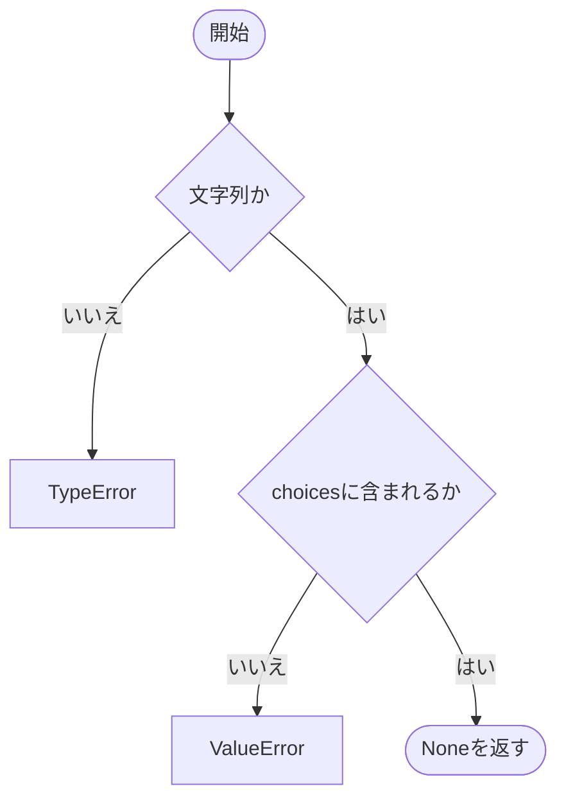
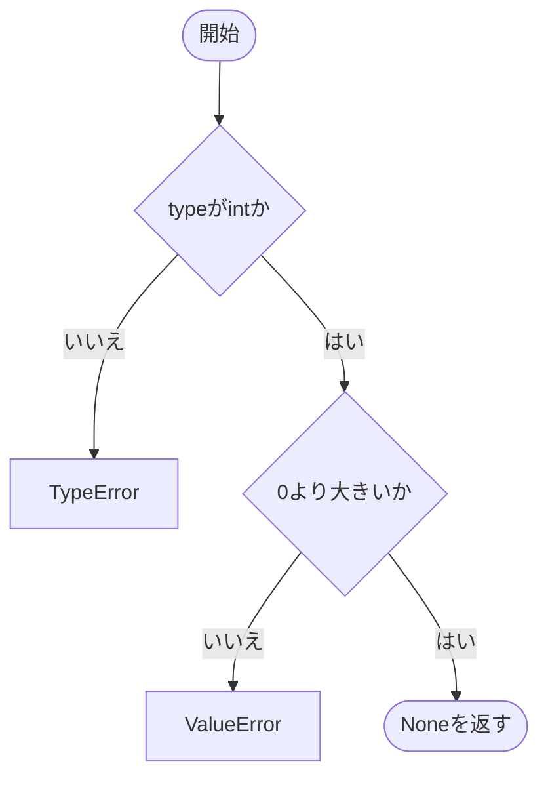
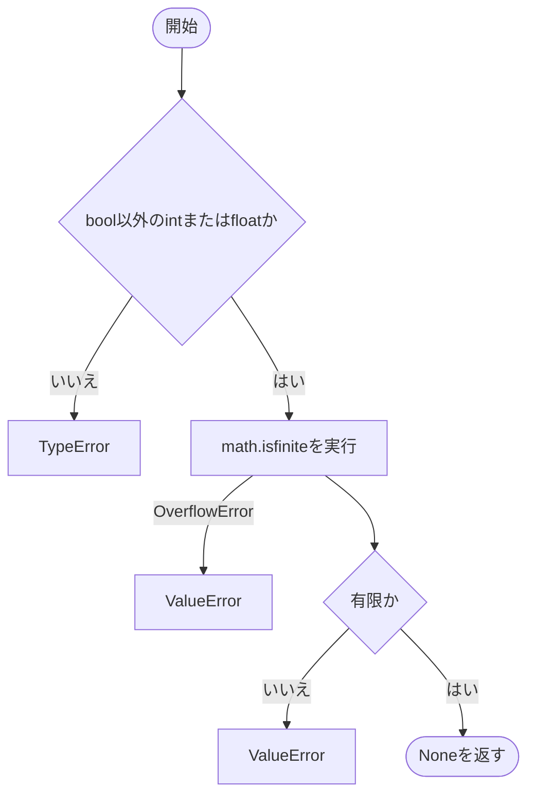
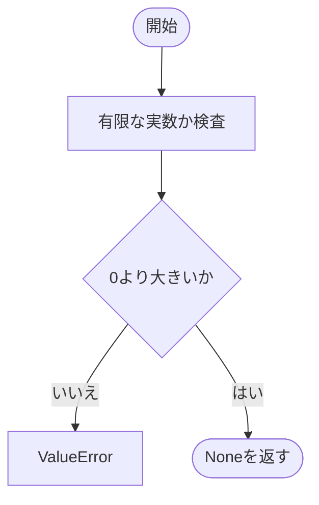
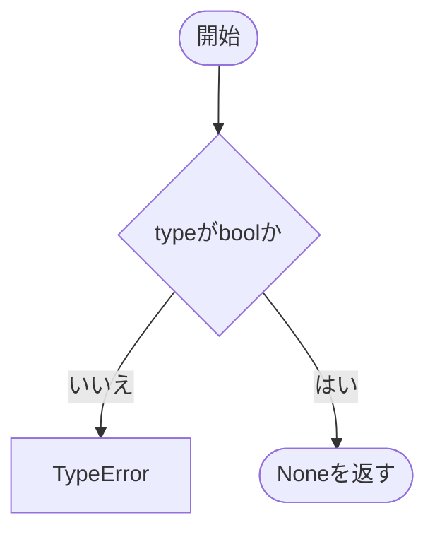
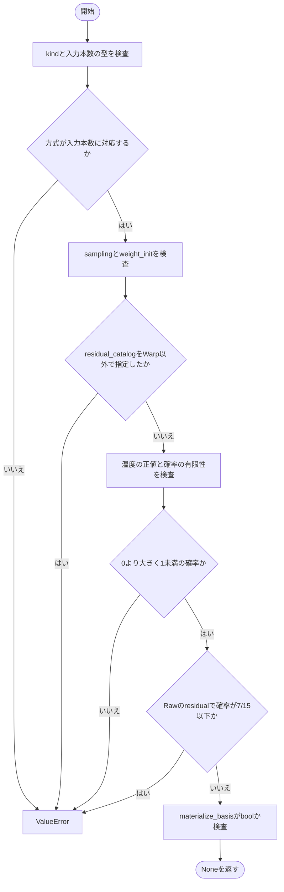
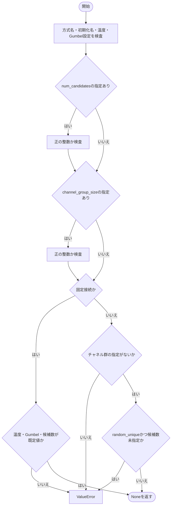

# layer_settings.py

`utils/logicNN_core/src/logicnn_core/layer_settings.py`

モデルコードから指定するLUT設定と接続設定を定義します。生成時に方式名・値の範囲・組み合わせを確認する、変更不可のデータクラスです。入力形状に依存する制約は各接続クラスで確認します。

{/* source-sha256: 33256d50506ebb5c9d9f351fd4e60e4a154410a7728b0b40dc473839a1b58a77 */}

{/* function: _validate_choice@15 */}

## \_validate\_choice() {/* #validate-choice */}

```python
def _validate_choice(name: str, value: object, choices: tuple[str, ...]) -> None:
```

### 機能概要

値が文字列で、許可された名前のいずれかであることを確認します。

### 引数

| 引数 | 型 | 既定値 | 説明 |
|---|---|---|---|
| `name` | `str` | `必須` | エラーメッセージに表示する設定項目名。 |
| `value` | `object` | `必須` | 検査する値。暗黙の型変換は行いません。 |
| `choices` | `tuple[str, ...]` | `必須` | 使用できる文字列のタプル。 |

### 処理の流れ



### 戻り値

型：`None`

正常時はNone。

### ソースコード

<details>
<summary>\_validate\_choice() の実装を開く</summary>

```python
def _validate_choice(name: str, value: object, choices: tuple[str, ...]) -> None:
    """登録名の型と許可された文字列を確認する。"""
    if not isinstance(value, str):
        raise TypeError(f"{name} は文字列で指定してください")
    if value not in choices:
        raise ValueError(f"{name} は {choices} から指定してください: {value!r}")
```

</details>

{/* function: _validate_positive_integer@23 */}

## \_validate\_positive\_integer() {/* #validate-positive-integer */}

```python
def _validate_positive_integer(name: str, value: object) -> None:
```

### 機能概要

boolを含まないPythonの整数型に限定し、正の値であることを確認します。

### 引数

| 引数 | 型 | 既定値 | 説明 |
|---|---|---|---|
| `name` | `str` | `必須` | エラーメッセージに表示する設定項目名。 |
| `value` | `object` | `必須` | 検査する値。暗黙の型変換は行いません。 |

### 処理の流れ



### 戻り値

型：`None`

正常時はNone。

### ソースコード

<details>
<summary>\_validate\_positive\_integer() の実装を開く</summary>

```python
def _validate_positive_integer(name: str, value: object) -> None:
    """boolや暗黙の型変換を許さず正の整数を確認する。"""
    if type(value) is not int:
        raise TypeError(f"{name} はboolではない整数で指定してください")
    if value <= 0:
        raise ValueError(f"{name} は0より大きい整数で指定してください")
```

</details>

{/* function: _validate_finite_number@31 */}

## \_validate\_finite\_number() {/* #validate-finite-number */}

```python
def _validate_finite_number(name: str, value: object) -> None:
```

### 機能概要

boolを除くintまたはfloatを受け取り、math.isfiniteで有限性を確認します。巨大整数の浮動小数点変換によるOverflowErrorもValueErrorに置き換えます。

### 引数

| 引数 | 型 | 既定値 | 説明 |
|---|---|---|---|
| `name` | `str` | `必須` | エラーメッセージに表示する設定項目名。 |
| `value` | `object` | `必須` | 検査する値。暗黙の型変換は行いません。 |

### 処理の流れ



### 戻り値

型：`None`

正常時はNone。

### ソースコード

<details>
<summary>\_validate\_finite\_number() の実装を開く</summary>

```python
def _validate_finite_number(name: str, value: object) -> None:
    """intまたはfloatで表現される有限の実数を確認する。"""
    if isinstance(value, bool) or not isinstance(value, (int, float)):
        raise TypeError(f"{name} はboolではないintまたはfloatで指定してください")
    try:
        finite = math.isfinite(value)
    except OverflowError:
        raise ValueError(f"{name} は浮動小数点で扱える有限値で指定してください") from None
    if not finite:
        raise ValueError(f"{name} は有限値で指定してください")
```

</details>

{/* function: _validate_positive_number@43 */}

## \_validate\_positive\_number() {/* #validate-positive-number */}

```python
def _validate_positive_number(name: str, value: object) -> None:
```

### 機能概要

有限な実数の検査に加え、0より大きいことを確認します。

### 引数

| 引数 | 型 | 既定値 | 説明 |
|---|---|---|---|
| `name` | `str` | `必須` | エラーメッセージに表示する設定項目名。 |
| `value` | `object` | `必須` | 検査する値。暗黙の型変換は行いません。 |

### 処理の流れ



### 戻り値

型：`None`

正常時はNone。

### ソースコード

<details>
<summary>\_validate\_positive\_number() の実装を開く</summary>

```python
def _validate_positive_number(name: str, value: object) -> None:
    """温度などの設定値が正の有限数であることを確認する。"""
    _validate_finite_number(name, value)
    if value <= 0:
        raise ValueError(f"{name} は0より大きい値で指定してください")
```

</details>

{/* function: _validate_boolean@50 */}

## \_validate\_boolean() {/* #validate-boolean */}

```python
def _validate_boolean(name: str, value: object) -> None:
```

### 機能概要

Pythonのbool型だけを受け入れ、0・1や文字列からの暗黙変換を防ぎます。

### 引数

| 引数 | 型 | 既定値 | 説明 |
|---|---|---|---|
| `name` | `str` | `必須` | エラーメッセージに表示する設定項目名。 |
| `value` | `object` | `必須` | 検査する値。暗黙の型変換は行いません。 |

### 処理の流れ



### 戻り値

型：`None`

正常時はNone。

### ソースコード

<details>
<summary>\_validate\_boolean() の実装を開く</summary>

```python
def _validate_boolean(name: str, value: object) -> None:
    """真偽値を数値や文字列から暗黙変換せず確認する。"""
    if type(value) is not bool:
        raise TypeError(f"{name} はboolで指定してください")
```

</details>

## LUTConfig {/* #lutconfig-class */}

論理関数の学習表現と初期化・サンプリングの設定。

| 属性 | 型 | 既定値 | 説明 |
|---|---|---|---|
| `kind` | `str` | `'raw'` | raw、warp、lightのいずれか。 |
| `num_inputs` | `int` | `2` | 1ゲートの入力本数。rawは2、warpは1・2・4・6、lightは2・4・6。 |
| `sampling` | `str` | `'soft'` | 学習時のsoft、hard、gumbel_soft、gumbel_hard。 |
| `temperature` | `float` | `1.0` | 初期サンプリング温度。実行中の温度はパラメータ化オブジェクトで別に管理します。 |
| `weight_init` | `str` | `'residual'` | random、residual、またはWarp専用のresidual_catalog。 |
| `residual_probability` | `float` | `0.951` | 残差初期化で使用する確率。方式ごとに利用方法が異なり、Lightの初期化式では使用しません。 |
| `materialize_basis` | `bool` | `False` | 基底をまとめて作るか、項ごとに縮約するかの選択。 |

`@dataclass` により、初期化などのメソッドが自動生成されます。表の属性は初期化時に指定します。

{/* function: LUTConfig.__post_init__@68 */}

## LUTConfig.\_\_post\_init\_\_() {/* #lutconfig-post-init */}

```python
def __post_init__(self) -> None:
```

### 機能概要

データクラスの生成後に、LUT方式と入力本数の対応、サンプリング・初期化方法、温度・確率の範囲を順に確認します。

### 引数

`self` 以外に指定する引数はありません。

### 処理の流れ



### 戻り値

型：`None`

正常時はNone。

### 例外・注意事項

- frozen=Trueのため、生成後にフィールドへ再代入する設定オブジェクトではありません。

### ソースコード

<details>
<summary>LUTConfig.\_\_post\_init\_\_() の実装を開く</summary>

```python
def __post_init__(self) -> None:
    """LUT方式別の対応範囲と設定値の型・数値制約を確認する。"""
    _validate_choice("kind", self.kind, tuple(_LUT_INPUT_COUNTS))
    _validate_positive_integer("num_inputs", self.num_inputs)
    if self.num_inputs not in _LUT_INPUT_COUNTS[self.kind]:
        raise ValueError(f"{self.kind} のnum_inputsは {_LUT_INPUT_COUNTS[self.kind]} に対応しています")

    _validate_choice("sampling", self.sampling, _SAMPLING_MODES)
    _validate_choice("weight_init", self.weight_init, _INITIALIZATIONS)
    if self.weight_init == "residual_catalog" and self.kind != "warp":
        raise ValueError("weight_init='residual_catalog' はkind='warp'でのみ使用できます")

    _validate_positive_number("temperature", self.temperature)
    _validate_finite_number("residual_probability", self.residual_probability)
    if not 0 < self.residual_probability < 1:
        raise ValueError("residual_probability は0より大きく1より小さい値で指定してください")
    if self.kind == "raw" and self.weight_init == "residual" and self.residual_probability <= 7 / 15:
        raise ValueError("Rawのresidual初期化では 7/15 < residual_probability < 1 が必要です")
    _validate_boolean("materialize_basis", self.materialize_basis)
```

</details>

## ConnectionConfig {/* #connectionconfig-class */}

固定接続または学習可能接続の初期設定。

| 属性 | 型 | 既定値 | 説明 |
|---|---|---|---|
| `kind` | `str` | `'fixed'` | fixedまたはlearnable。 |
| `init` | `str` | `'random'` | randomまたはrandom_unique。 |
| `temperature` | `float` | `1.0` | 学習可能接続の初期温度。 |
| `use_gumbel` | `bool` | `False` | 学習可能接続でGumbelノイズを使用するか。 |
| `num_candidates` | `int \| None` | `None` | 学習可能接続の候補数。NoneのDense接続では全入力が候補。 |
| `channel_group_size` | `int \| None` | `None` | 固定Conv接続で候補とする連続チャネル群の大きさ。 |

`@dataclass` により、初期化などのメソッドが自動生成されます。表の属性は初期化時に指定します。

{/* function: ConnectionConfig.__post_init__@100 */}

## ConnectionConfig.\_\_post\_init\_\_() {/* #connectionconfig-post-init */}

```python
def __post_init__(self) -> None:
```

### 機能概要

接続設定の型と値を確認し、固定接続専用・学習可能接続専用の指定が混在しないようにします。

### 引数

`self` 以外に指定する引数はありません。

### 処理の流れ



### 戻り値

型：`None`

正常時はNone。

### ソースコード

<details>
<summary>ConnectionConfig.\_\_post\_init\_\_() の実装を開く</summary>

```python
def __post_init__(self) -> None:
    """接続方式ごとの設定を検証し、shape依存の検証は接続構築へ委ねる。"""
    _validate_choice("kind", self.kind, ("fixed", "learnable"))
    _validate_choice("init", self.init, ("random", "random_unique"))
    _validate_positive_number("temperature", self.temperature)
    _validate_boolean("use_gumbel", self.use_gumbel)
    if self.num_candidates is not None:
        _validate_positive_integer("num_candidates", self.num_candidates)
    if self.channel_group_size is not None:
        _validate_positive_integer("channel_group_size", self.channel_group_size)

    if self.kind == "fixed":
        if self.temperature != 1.0 or self.use_gumbel or self.num_candidates is not None:
            raise ValueError("固定接続ではtemperature、use_gumbel、num_candidatesを既定値から変更できません")
    else:
        if self.channel_group_size is not None:
            raise ValueError("channel_group_size は固定Conv接続でのみ使用できます")
        if self.init == "random_unique" and self.num_candidates is None:
            raise ValueError("学習可能なrandom_unique接続ではnum_candidatesを正の整数で明示してください")
```

</details>
