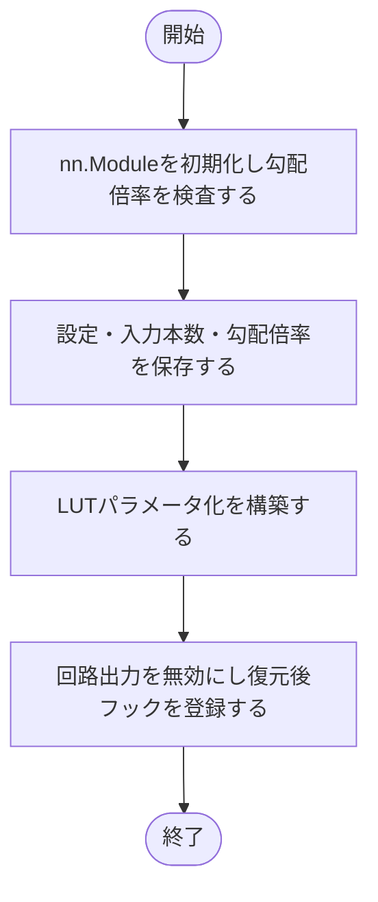
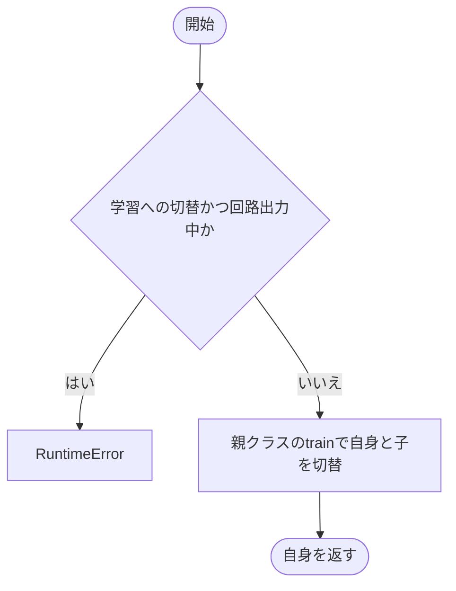
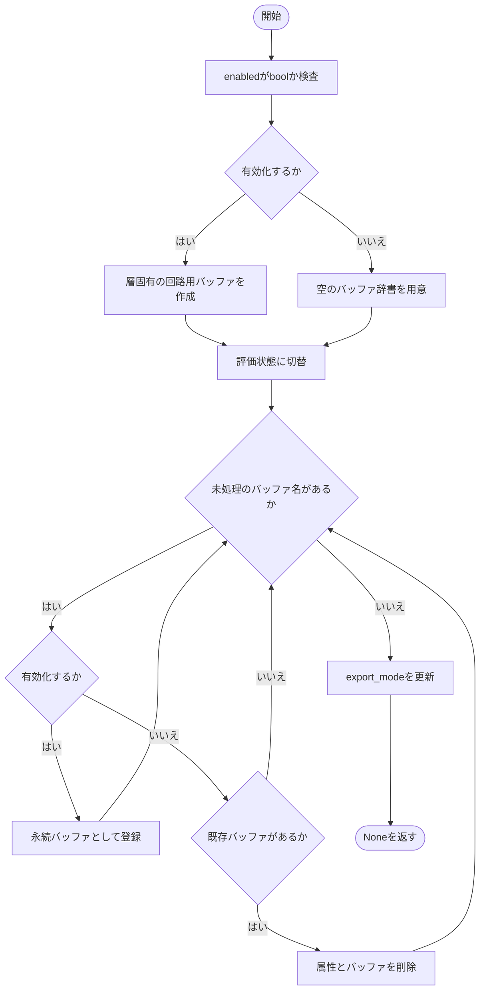
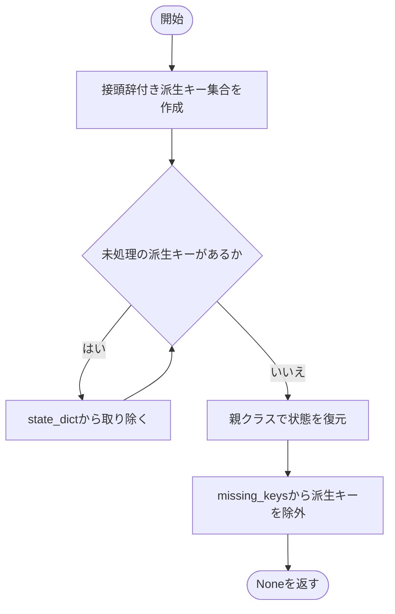
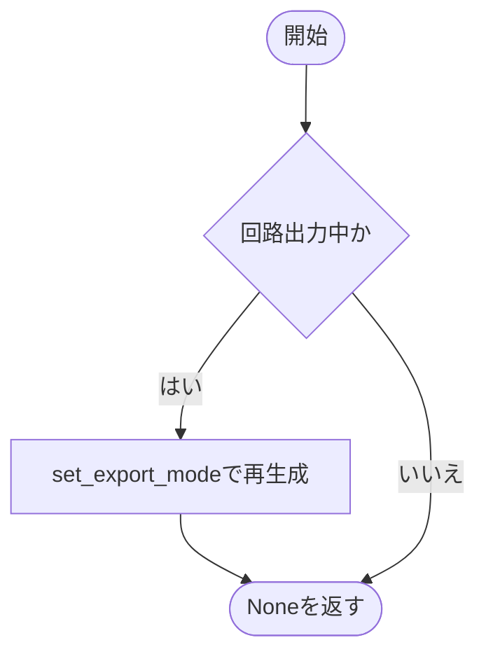
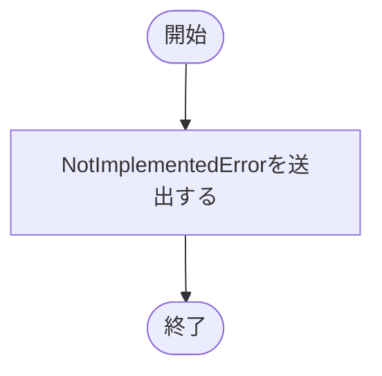

# base.py

`utils/logicNN_core/src/logicnn_core/layers/base.py`

論理層に共通するLUT設定・接続設定・入力勾配倍率を保持し、通常実行と回路出力用スナップショットの切替を管理します。具体的な計算と重みの所有はDense・Convの実装に委ねます。

{/* source-sha256: 6e2743c4129b9684893997194e4bbd3bb8366de70ec8405cc058c729e658fbba */}

## LogicLayer {/* #logiclayer-class */}

LogicDenseと論理Convの抽象基底クラス。

継承元：`nn.Module, ABC`

| 属性 | 型 | 既定値 | 説明 |
|---|---|---|---|
| `_export_buffer_names` | `tuple[str, ...]` | `()` | 派生クラスが指定する回路用バッファ名。 |

{/* function: LogicLayer.__init__@26 */}

## LogicLayer.\_\_init\_\_() {/* #logiclayer-init */}

```python
def __init__(self, *, lut: LUTConfig = LUTConfig(), connections: ConnectionConfig = ConnectionConfig(), gradient_scale: float = 1.0) -> None:
```

### 機能概要

入力勾配倍率を確認し、設定からLUTパラメータ化を作ります。回路出力は無効で開始し、状態復元後にスナップショットを再作成するフックを登録します。

### 引数

| 引数 | 型 | 既定値 | 説明 |
|---|---|---|---|
| `lut` | `LUTConfig` | `LUTConfig()` | ゲートの入力本数・LUT方式・初期化方法などを指定するLUTConfig。 |
| `connections` | `ConnectionConfig` | `ConnectionConfig()` | 入力接続の方式と初期化を指定するConnectionConfig。 |
| `gradient_scale` | `float` | `1.0` | 入力へ伝わる逆伝播の勾配倍率。順伝播の値は変えません。 |

### 処理の流れ



### 戻り値

型：`None`

None。

### 状態の変更・ファイル出力

- 子モジュール・属性・状態復元フックを登録します。LUT重み自体はここでは作りません。

### ソースコード

<details>
<summary>LogicLayer.\_\_init\_\_() の実装を開く</summary>

```python
def __init__(self, *, lut: LUTConfig = LUTConfig(), connections: ConnectionConfig = ConnectionConfig(), gradient_scale: float = 1.0) -> None:
    """不変の生成時設定と実行モードを分離し、状態復元後の再生成を登録する。"""
    super().__init__()
    _validate_finite_number("gradient_scale", gradient_scale)
    self.lut_config        = lut
    self.connection_config = connections
    self.num_inputs        = lut.num_inputs
    self.gradient_scale    = float(gradient_scale)
    self.parametrization   = build_parametrization(lut)
    self.export_mode       = False
    self.register_load_state_dict_post_hook(self._refresh_loaded_export_state)
```

</details>

{/* function: LogicLayer.train@38 */}

## LogicLayer.train() {/* #logiclayer-train */}

```python
def train(self, mode: bool = True) -> LogicLayer:
```

### 機能概要

回路出力を明示的に解除する前に学習へ戻す操作を拒否します。その他はPyTorch標準のtrainへ渡します。

### 引数

| 引数 | 型 | 既定値 | 説明 |
|---|---|---|---|
| `mode` | `bool` | `True` | Trueで学習状態、Falseで評価状態。 |

### 処理の流れ



### 戻り値

型：`LogicLayer`

この層自身。

### 状態の変更・ファイル出力

- 正常時は自身と子モジュールのtrainingを変更します。

### ソースコード

<details>
<summary>LogicLayer.train() の実装を開く</summary>

```python
def train(self, mode: bool = True) -> LogicLayer:
    """回路出力中の学習切替を拒否し、それ以外は子moduleへ標準の切替を伝える。"""
    if mode and self.export_mode:
        raise RuntimeError("export中は学習できません。先にset_export_mode(False)で明示解除してからtrain()を呼んでください")
    return super().train(mode)
```

</details>

{/* function: LogicLayer.set_export_mode@44 */}

## LogicLayer.set\_export\_mode() {/* #logiclayer-set-export-mode */}

```python
def set_export_mode(self, enabled: bool = True) -> None:
```

### 機能概要

有効化では先に最新の重みと接続からバッファを作り、評価状態へ切り替えて登録します。解除では派生バッファを削除します。

### 引数

| 引数 | 型 | 既定値 | 説明 |
|---|---|---|---|
| `enabled` | `bool` | `True` | Trueで回路出力を有効化、Falseで解除。 |

### 処理の流れ



### 戻り値

型：`None`

None。

### 状態の変更・ファイル出力

- 回路用バッファとモードを変更します。解除しても学習状態には戻しません。

### ソースコード

<details>
<summary>LogicLayer.set\_export\_mode() の実装を開く</summary>

```python
def set_export_mode(self, enabled: bool = True) -> None:
    """検証済みの回路用snapshotへ切り替え、解除後は通常評価へ戻す。"""
    _validate_boolean("enabled", enabled)
    buffers = self._make_export_buffers() if enabled else {}
    self.eval()
    for name in self._export_buffer_names:
        if enabled:
            self.register_buffer(name, buffers[name], persistent=True)
        elif name in self._buffers:
            delattr(self, name)
    self.export_mode = enabled
```

</details>

{/* function: LogicLayer._load_from_state_dict@56 */}

## LogicLayer.\_load\_from\_state\_dict() {/* #logiclayer-load-from-state-dict */}

```python
def _load_from_state_dict(
    self,
    state_dict: dict[str, Any],
    prefix: str,
    local_metadata: dict[str, Any],
    strict: bool,
    missing_keys: list[str],
    unexpected_keys: list[str],
    error_msgs: list[str],
) -> None:
```

### 機能概要

保存されていた回路用バッファを復元対象から除外し、元の重み・接続はPyTorch標準で復元します。派生バッファの不足はmissing_keysから除きます。

### 引数

| 引数 | 型 | 既定値 | 説明 |
|---|---|---|---|
| `state_dict` | `dict[str, Any]` | `必須` | 復元元のパラメータ・バッファ辞書。回路用の派生キーを取り除きます。 |
| `prefix` | `str` | `必須` | このモジュールの状態名に付く接頭辞。 |
| `local_metadata` | `dict[str, Any]` | `必須` | PyTorchが渡すモジュール固有の復元情報。 |
| `strict` | `bool` | `必須` | 標準の状態復元に渡す厳密検査フラグ。 |
| `missing_keys` | `list[str]` | `必須` | 未検出キーの共有リスト。派生バッファの不足を除外します。 |
| `unexpected_keys` | `list[str]` | `必須` | 余分なキーを標準処理が追記する共有リスト。 |
| `error_msgs` | `list[str]` | `必須` | 標準処理が復元失敗の説明を追記する共有リスト。 |

### 処理の流れ



### 戻り値

型：`None`

None。

### 状態の変更・ファイル出力

- state_dict・missing_keysと、この層の復元対象を変更します。回路用スナップショットは復元後フックで作り直します。

### ソースコード

<details>
<summary>LogicLayer.\_load\_from\_state\_dict() の実装を開く</summary>

```python
def _load_from_state_dict(
    self,
    state_dict: dict[str, Any],
    prefix: str,
    local_metadata: dict[str, Any],
    strict: bool,
    missing_keys: list[str],
    unexpected_keys: list[str],
    error_msgs: list[str],
) -> None:
    """既知の回路用派生bufferだけを無視し、重みと接続の標準復元を行う。"""
    derived_keys = {prefix + name for name in self._export_buffer_names}
    for key in derived_keys:
        state_dict.pop(key, None)
    super()._load_from_state_dict(state_dict, prefix, local_metadata, strict, missing_keys, unexpected_keys, error_msgs)
    missing_keys[:] = [key for key in missing_keys if key not in derived_keys]
```

</details>

{/* function: LogicLayer._refresh_loaded_export_state@73 */}

## LogicLayer.\_refresh\_loaded\_export\_state() {/* #logiclayer-refresh-loaded-export-state */}

```python
def _refresh_loaded_export_state(self, module: nn.Module, incompatible_keys: Any) -> None:
```

### 機能概要

子モジュールを含む復元が終わった後、回路出力中であれば復元した状態からスナップショットを再生成します。

### 引数

| 引数 | 型 | 既定値 | 説明 |
|---|---|---|---|
| `module` | `nn.Module` | `必須` | 復元処理から渡される対象モジュール。この実装では直接使用しません。 |
| `incompatible_keys` | `Any` | `必須` | 復元時の不足・余分なキー。このフックでは直接使用しません。 |

### 処理の流れ



### 戻り値

型：`None`

None。

### 状態の変更・ファイル出力

- 回路出力中のみ、回路用バッファを置き換えます。

### ソースコード

<details>
<summary>LogicLayer.\_refresh\_loaded\_export\_state() の実装を開く</summary>

```python
def _refresh_loaded_export_state(self, module: nn.Module, incompatible_keys: Any) -> None:
    """子接続の読込完了後に、復元した重みと接続から回路用snapshotを作り直す。"""
    if self.export_mode:
        self.set_export_mode(True)
```

</details>

{/* function: LogicLayer._make_export_buffers@79 */}

## LogicLayer.\_make\_export\_buffers() {/* #logiclayer-make-export-buffers */}

```python
def _make_export_buffers(self) -> dict[str, Tensor]:
```

### 機能概要

派生クラスに、回路用の真理値表と固定接続を独立コピーした辞書の作成を要求する抽象メソッドです。

### 引数

`self` 以外に指定する引数はありません。

### 処理の流れ


### 戻り値

型：`dict[str, Tensor]`

基底実装は戻らずNotImplementedErrorを送出します。

### ソースコード

<details>
<summary>LogicLayer.\_make\_export\_buffers() の実装を開く</summary>

```python
@abstractmethod
def _make_export_buffers(self) -> dict[str, Tensor]:
    """状態を変更する前に、層固有の回路用bufferを検証して独立コピーする。"""
    raise NotImplementedError
```

</details>

{/* function: LogicLayer.forward@84 */}

## LogicLayer.forward() {/* #logiclayer-forward */}

```python
def forward(self, inputs: Tensor) -> Tensor:
```

### 機能概要

派生クラスが実装する論理計算の入口です。DenseとConvは、それぞれの形状に従って通常計算または回路計算を行います。

### 引数

| 引数 | 型 | 既定値 | 説明 |
|---|---|---|---|
| `inputs` | `Tensor` | `必須` | 層固有の形状を持つ入力Tensor。回路計算ではbool。 |

### 処理の流れ


### 戻り値

型：`Tensor`

基底実装は戻らずNotImplementedErrorを送出します。

### ソースコード

<details>
<summary>LogicLayer.forward() の実装を開く</summary>

```python
@abstractmethod
def forward(self, inputs: Tensor) -> Tensor:
    """層固有の入力shapeで論理ゲートを学習・評価・回路実行する。"""
    raise NotImplementedError
```

</details>

{/* function: LogicLayer.truth_tables@89 */}

## LogicLayer.truth\_tables() {/* #logiclayer-truth-tables */}

```python
def truth_tables(self) -> Tensor | list[Tensor]:
```

### 機能概要

現在のLUT重みを離散化して真理値表へ変換するための抽象メソッドです。

### 引数

`self` 以外に指定する引数はありません。

### 処理の流れ



### 戻り値

型：`Tensor \| list[Tensor]`

基底実装は戻らずNotImplementedErrorを送出します。

### ソースコード

<details>
<summary>LogicLayer.truth\_tables() の実装を開く</summary>

```python
@abstractmethod
def truth_tables(self) -> Tensor | list[Tensor]:
    """最新のLUT重みから層内のbool真理値表を生成する。"""
    raise NotImplementedError
```

</details>

{/* function: LogicLayer.truth_tables_with_ids@94 */}

## LogicLayer.truth\_tables\_with\_ids() {/* #logiclayer-truth-tables-with-ids */}

```python
def truth_tables_with_ids(self) -> tuple[Tensor, Tensor | None] | tuple[list[Tensor], list[Tensor | None]]:
```

### 機能概要

真理値表と整数IDを組にして取得するための抽象メソッドです。表現できない入力本数では派生実装がIDをNoneにします。

### 引数

`self` 以外に指定する引数はありません。

### 処理の流れ


### 戻り値

型：`tuple[Tensor, Tensor \| None] \| tuple[list[Tensor], list[Tensor \| None]]`

基底実装は戻らずNotImplementedErrorを送出します。

### ソースコード

<details>
<summary>LogicLayer.truth\_tables\_with\_ids() の実装を開く</summary>

```python
@abstractmethod
def truth_tables_with_ids(self) -> tuple[Tensor, Tensor | None] | tuple[list[Tensor], list[Tensor | None]]:
    """最新の真理値表と、入力本数が対応する場合の整数IDを返す。"""
    raise NotImplementedError
```

</details>

{/* function: LogicLayer.regularization_loss@99 */}

## LogicLayer.regularization\_loss() {/* #logiclayer-regularization-loss */}

```python
def regularization_loss(self, kind: str | None = None) -> Tensor:
```

### 機能概要

LUT重みに対するゲート平均の正則化損失を取得するための抽象メソッドです。

### 引数

| 引数 | 型 | 既定値 | 説明 |
|---|---|---|---|
| `kind` | `str \| None` | `None` | 派生実装へ指定する正則化方式。 |

### 処理の流れ


### 戻り値

型：`Tensor`

基底実装は戻らずNotImplementedErrorを送出します。

### ソースコード

<details>
<summary>LogicLayer.regularization\_loss() の実装を開く</summary>

```python
@abstractmethod
def regularization_loss(self, kind: str | None = None) -> Tensor:
    """接続logitを含めず、層内の全LUTゲートの平均正則化を返す。"""
    raise NotImplementedError
```

</details>

{/* function: LogicLayer.rescale_weights_@104 */}

## LogicLayer.rescale\_weights\_() {/* #logiclayer-rescale-weights */}

```python
def rescale_weights_(self, method: str | None = None) -> None:
```

### 機能概要

LUT重みの再スケール処理を派生クラスに要求する抽象メソッドです。

### 引数

| 引数 | 型 | 既定値 | 説明 |
|---|---|---|---|
| `method` | `str \| None` | `None` | 派生実装へ指定する再スケール方式。 |

### 処理の流れ


### 戻り値

型：`None`

基底実装は戻らずNotImplementedErrorを送出します。

### ソースコード

<details>
<summary>LogicLayer.rescale\_weights\_() の実装を開く</summary>

```python
@abstractmethod
def rescale_weights_(self, method: str | None = None) -> None:
    """LUT重みだけを検証済みの再スケール方式で更新する。"""
    raise NotImplementedError
```

</details>

## 関連ファイル

- [utils/logicNN_core/src/logicnn_core/layer_settings.py](/code-reference/utils/logicNN_core/src/logicnn_core/layer_settings)
- [utils/logicNN_core/src/logicnn_core/parametrizations/\_\_init\_\_.py](/code-reference/utils/logicNN_core/src/logicnn_core/parametrizations/__init__)
