# binarization.py

`utils/logicNN_core/src/logicnn_core/layers/binarization.py`

連続値を複数の閾値と比較し、特徴をbit列へ展開する二値化層です。固定比較、学習中だけの連続近似、閾値自体の学習、型変換のみの通過を用意します。閾値を使う層では、通常評価と回路出力で厳密な比較を行います。

{/* source-sha256: 2870275143d07f07f5595f82e14c2b64b91dbeacdb9037fb45560721c2339759 */}

## Binarization {/* #binarization-class */}

初期閾値の算出と回路用スナップショットを管理する抽象基底。

継承元：`nn.Module, ABC`

{/* function: Binarization.__init__@25 */}

## Binarization.\_\_init\_\_() {/* #binarization-init */}

```python
def __init__(self, *, feature_dim: int = -2) -> None:
```

### 機能概要

bit軸の結合先が整数であることを確認し、通常実行で開始します。状態復元後に回路用閾値を再生成するフックを登録します。

### 引数

| 引数 | 型 | 既定値 | 説明 |
|---|---|---|---|
| `feature_dim` | `int` | `-2` | 二値化後に追加される末尾bit軸を結合する入力軸。負の番号はbit軸追加後の次元数を基準に解釈します。 |

### 処理の流れ

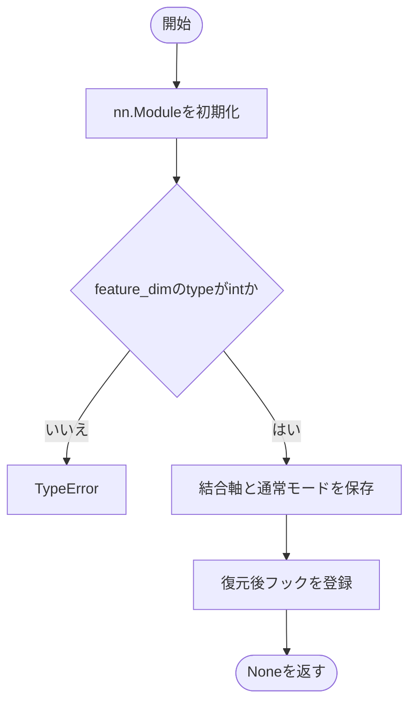

### 戻り値

型：`None`

None。

### ソースコード

<details>
<summary>Binarization.\_\_init\_\_() の実装を開く</summary>

```python
def __init__(self, *, feature_dim: int = -2) -> None:
    """結合軸の型を検証し、回路出力状態とstate復元処理を準備する。"""
    super().__init__()
    if type(feature_dim) is not int:
        raise TypeError("feature_dim はboolではない整数で指定してください")
    self.feature_dim = feature_dim
    self.export_mode = False
    self.register_load_state_dict_post_hook(self._refresh_loaded_state)
```

</details>

{/* function: Binarization.initial_thresholds@35 */}

## Binarization.initial\_thresholds() {/* #binarization-initial-thresholds */}

```python
def initial_thresholds(dataset: Tensor, bits: int, scope: str, method: str = "uniform") -> Tensor:
```

### 機能概要

データを勾配計算から切り離し、全体・特徴ごと・チャネルごとの標本列へ並べ替えます。uniformは最小値と最大値の間をbits+1等分し、quantileは昇順のfloor順位からbits個を選びます。

### 引数

| 引数 | 型 | 既定値 | 説明 |
|---|---|---|---|
| `dataset` | `Tensor` | `必須` | 先頭軸を標本とするデータTensor。channelでは第1軸をチャネルとして扱います。 |
| `bits` | `int` | `必須` | 各要素を展開するbit数、すなわち算出する閾値数。 |
| `scope` | `str` | `必須` | globalは全体共通、featureは標本以外の位置ごと、channelはチャネルごと。 |
| `method` | `str` | `'uniform'` | uniformまたはquantile。 |

### 処理の流れ

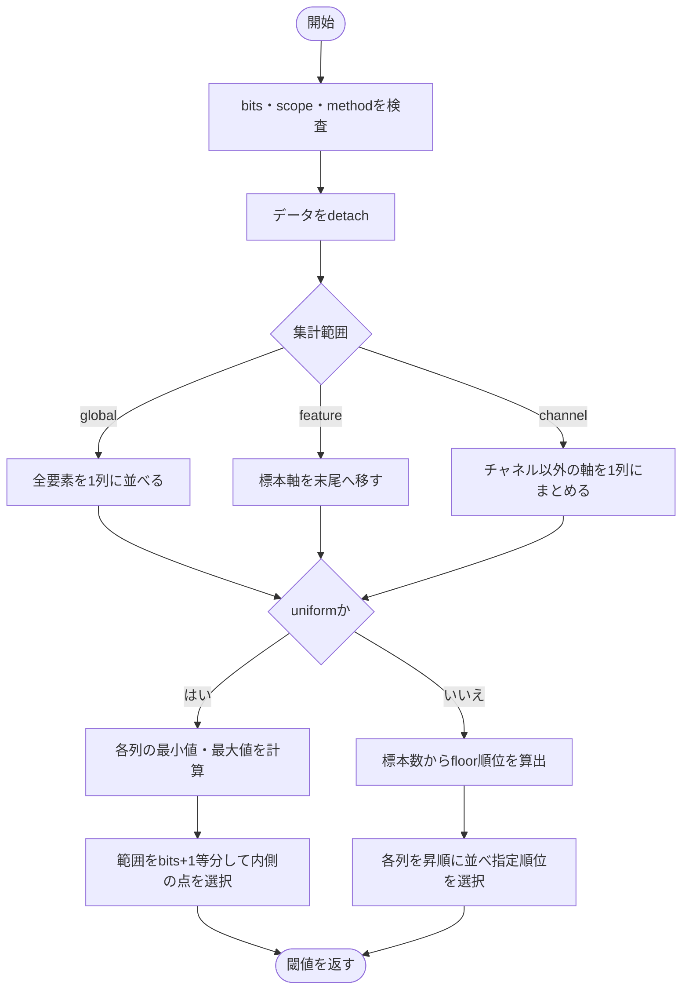

### 戻り値

型：`Tensor`

末尾軸がbitsのTensor。globalは[bits]、featureは[*dataset.shape[1:], bits]、channelは[channels, bits]。

### 例外・注意事項

- quantileは補間型のtorch.quantileではありません。閾値算出元のデータ取得や分割は行いません。

### ソースコード

<details>
<summary>Binarization.initial\_thresholds() の実装を開く</summary>

```python
@staticmethod
def initial_thresholds(dataset: Tensor, bits: int, scope: str, method: str = "uniform") -> Tensor:
    """データ範囲の等分点または旧floor順位の分位点から初期閾値を作る。"""
    _validate_positive_integer("bits", bits)
    _validate_choice("scope", scope, ("global", "feature", "channel"))
    _validate_choice("method", method, ("uniform", "quantile"))
    values = dataset.detach()
    if scope == "global":
        values = values.flatten()
    elif scope == "feature":
        values = values.movedim(0, -1)
    else:
        values = values.transpose(0, 1).reshape(values.shape[1], -1)
    if method == "uniform":
        minimum = values.amin(dim=-1, keepdim=True)
        maximum = values.amax(dim=-1, keepdim=True)
        steps   = torch.arange(1, bits + 1, device=values.device)
        result  = minimum + steps * ((maximum - minimum) / (bits + 1))
    else:
        count   = values.shape[-1]
        indices = torch.tensor([count * index // (bits + 1) for index in range(1, bits + 1)], device=values.device, dtype=torch.int64)
        result  = values.sort(dim=-1).values.index_select(-1, indices)
    return result
```

</details>

{/* function: Binarization.get_thresholds@58 */}

## Binarization.get\_thresholds() {/* #binarization-get-thresholds */}

```python
def get_thresholds(self) -> Tensor | None:
```

### 機能概要

現在のthresholds属性を返します。閾値を持たないDummyBinarizationなどではNoneを返します。

### 引数

`self` 以外に指定する引数はありません。

### 処理の流れ

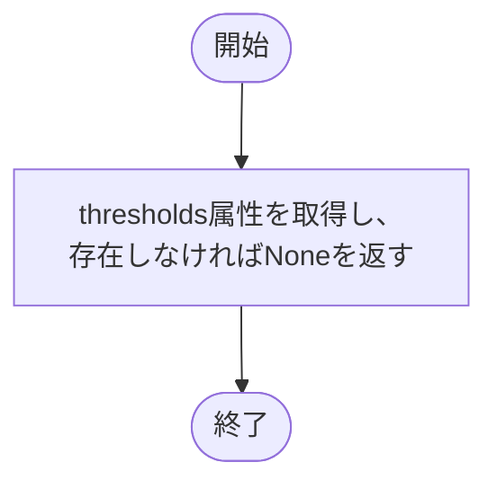

### 戻り値

型：`Tensor \| None`

保持中の閾値Tensor、またはNone。

### 例外・注意事項

- Tensorのコピーは行いません。

### ソースコード

<details>
<summary>Binarization.get\_thresholds() の実装を開く</summary>

```python
def get_thresholds(self) -> Tensor | None:
    """通常計算に使う現在の閾値を返し、DummyではNoneを返す。"""
    return getattr(self, "thresholds", None)
```

</details>

{/* function: Binarization._evaluation_thresholds@62 */}

## Binarization.\_evaluation\_thresholds() {/* #binarization-evaluation-thresholds */}

```python
def _evaluation_thresholds(self) -> Tensor | None:
```

### 機能概要

回路用スナップショットの元となる評価閾値を取得します。基底実装はget_thresholdsを呼び、学習可能な層は評価専用の式へ上書きします。

### 引数

`self` 以外に指定する引数はありません。

### 処理の流れ

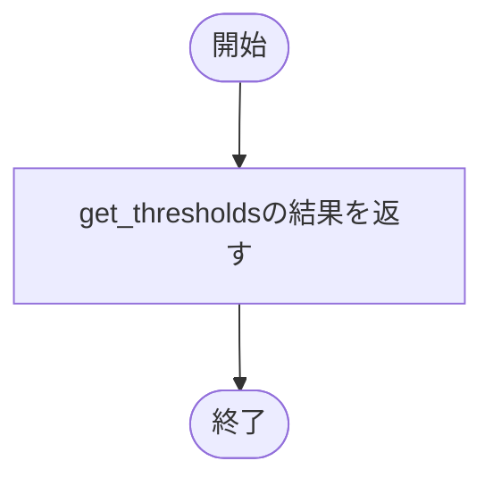

### 戻り値

型：`Tensor \| None`

評価に使う閾値Tensor、またはNone。

### ソースコード

<details>
<summary>Binarization.\_evaluation\_thresholds() の実装を開く</summary>

```python
def _evaluation_thresholds(self) -> Tensor | None:
    """学習状態によらない評価用閾値を返す。"""
    return self.get_thresholds()
```

</details>

{/* function: Binarization.set_export_mode@66 */}

## Binarization.set\_export\_mode() {/* #binarization-set-export-mode */}

```python
def set_export_mode(self, enabled: bool = True) -> None:
```

### 機能概要

有効化では評価用閾値を勾配から切り離して複製し、永続バッファへ登録します。解除または閾値なしの場合は既存のスナップショットを削除します。

### 引数

| 引数 | 型 | 既定値 | 説明 |
|---|---|---|---|
| `enabled` | `bool` | `True` | Trueで回路出力を有効化、Falseで解除。 |

### 処理の流れ

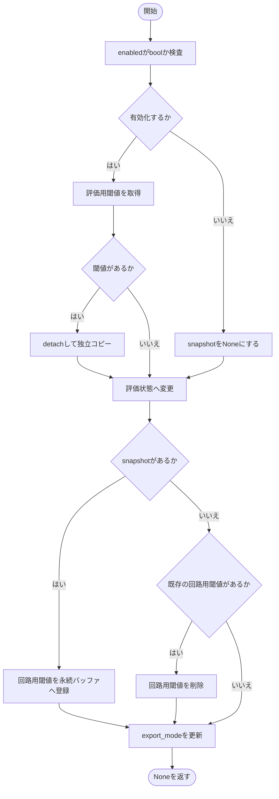

### 戻り値

型：`None`

None。

### 状態の変更・ファイル出力

- 閾値のスナップショットとモードを変更します。Falseにしても評価状態を維持します。

### ソースコード

<details>
<summary>Binarization.set\_export\_mode() の実装を開く</summary>

```python
def set_export_mode(self, enabled: bool = True) -> None:
    """評価用閾値の独立snapshotへ切り替え、解除後も評価状態を維持する。"""
    _validate_boolean("enabled", enabled)
    snapshot = self._evaluation_thresholds() if enabled else None
    if snapshot is not None:
        snapshot = snapshot.detach().clone()
    self.eval()
    if snapshot is not None:
        self.register_buffer("_export_thresholds", snapshot, persistent=True)
    elif "_export_thresholds" in self._buffers:
        delattr(self, "_export_thresholds")
    self.export_mode = enabled
```

</details>

{/* function: Binarization.train@79 */}

## Binarization.train() {/* #binarization-train */}

```python
def train(self, mode: bool = True) -> Binarization:
```

### 機能概要

回路出力を解除せずに学習へ戻そうとした場合だけRuntimeErrorとし、その他は標準のモード切替を行います。

### 引数

| 引数 | 型 | 既定値 | 説明 |
|---|---|---|---|
| `mode` | `bool` | `True` | Trueで学習状態、Falseで評価状態。 |

### 処理の流れ

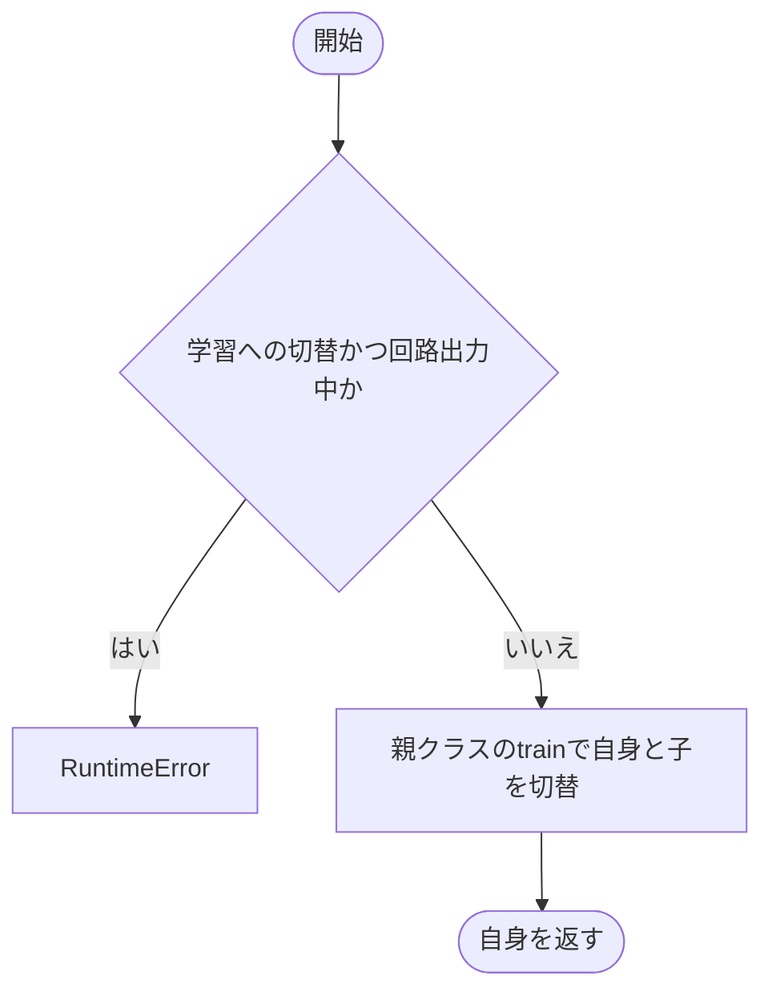

### 戻り値

型：`Binarization`

この層自身。

### 状態の変更・ファイル出力

- 正常時はtrainingを変更します。

### ソースコード

<details>
<summary>Binarization.train() の実装を開く</summary>

```python
def train(self, mode: bool = True) -> Binarization:
    """回路出力を明示解除するまで学習状態への切替を拒否する。"""
    if mode and self.export_mode:
        raise RuntimeError("回路出力中は学習できません。先にset_export_mode(False)で明示解除してからtrain()を呼んでください")
    return super().train(mode)
```

</details>

{/* function: Binarization._load_from_state_dict@85 */}

## Binarization.\_load\_from\_state\_dict() {/* #binarization-load-from-state-dict */}

```python
def _load_from_state_dict(
    self,
    state_dict: dict[str, Any],
    prefix: str,
    local_metadata: dict[str, Any],
    strict: bool,
    missing_keys: list[str],
    unexpected_keys: list[str],
    error_msgs: list[str],
) -> None:
```

### 機能概要

保存されていた派生閾値_export_thresholdsを読み捨て、元の閾値やParameterは標準処理で復元します。派生閾値の不足は検査結果から除外します。

### 引数

| 引数 | 型 | 既定値 | 説明 |
|---|---|---|---|
| `state_dict` | `dict[str, Any]` | `必須` | 復元元のパラメータ・バッファ辞書。回路用の派生キーを取り除きます。 |
| `prefix` | `str` | `必須` | このモジュールの状態名に付く接頭辞。 |
| `local_metadata` | `dict[str, Any]` | `必須` | PyTorchが渡すモジュール固有の復元情報。 |
| `strict` | `bool` | `必須` | 標準の状態復元に渡す厳密検査フラグ。 |
| `missing_keys` | `list[str]` | `必須` | 未検出キーの共有リスト。派生バッファの不足を除外します。 |
| `unexpected_keys` | `list[str]` | `必須` | 余分なキーを標準処理が追記する共有リスト。 |
| `error_msgs` | `list[str]` | `必須` | 標準処理が復元失敗の説明を追記する共有リスト。 |

### 処理の流れ

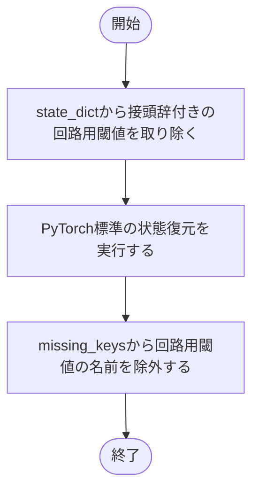

### 戻り値

型：`None`

None。

### 状態の変更・ファイル出力

- 復元辞書と不足キー一覧を更新します。

### ソースコード

<details>
<summary>Binarization.\_load\_from\_state\_dict() の実装を開く</summary>

```python
def _load_from_state_dict(
    self,
    state_dict: dict[str, Any],
    prefix: str,
    local_metadata: dict[str, Any],
    strict: bool,
    missing_keys: list[str],
    unexpected_keys: list[str],
    error_msgs: list[str],
) -> None:
    """派生snapshotを読み捨て、閾値の復元はPyTorchの標準処理へ渡す。"""
    derived_key = prefix + "_export_thresholds"
    state_dict.pop(derived_key, None)
    super()._load_from_state_dict(state_dict, prefix, local_metadata, strict, missing_keys, unexpected_keys, error_msgs)
    missing_keys[:] = [key for key in missing_keys if key != derived_key]
```

</details>

{/* function: Binarization._refresh_loaded_state@101 */}

## Binarization.\_refresh\_loaded\_state() {/* #binarization-refresh-loaded-state */}

```python
def _refresh_loaded_state(self, module: nn.Module, incompatible_keys: Any) -> None:
```

### 機能概要

復元後も回路出力中なら、最新の閾値からスナップショットを再生成します。

### 引数

| 引数 | 型 | 既定値 | 説明 |
|---|---|---|---|
| `module` | `nn.Module` | `必須` | 復元処理から渡される対象モジュール。この実装では直接使用しません。 |
| `incompatible_keys` | `Any` | `必須` | 復元時の不足・余分なキー。このフックでは直接使用しません。 |

### 処理の流れ

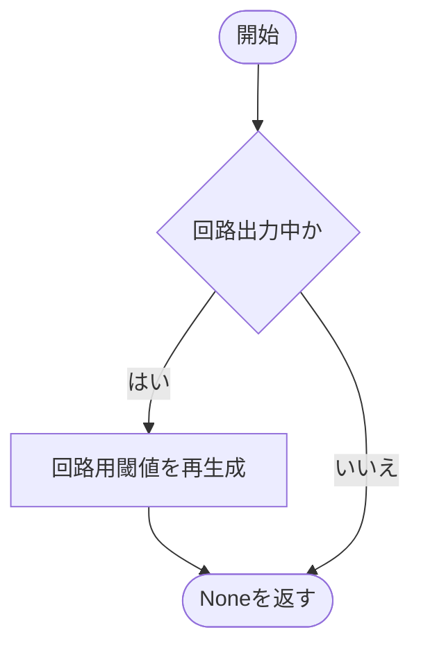

### 戻り値

型：`None`

None。

### ソースコード

<details>
<summary>Binarization.\_refresh\_loaded\_state() の実装を開く</summary>

```python
def _refresh_loaded_state(self, module: nn.Module, incompatible_keys: Any) -> None:
    """state復元後に現在の閾値から回路出力用snapshotを作り直す。"""
    if self.export_mode:
        self.set_export_mode()
```

</details>

{/* function: Binarization.forward@107 */}

## Binarization.forward() {/* #binarization-forward */}

```python
def forward(self, inputs: Tensor) -> Tensor:
```

### 機能概要

各二値化方式が連続値またはbit列を返すための抽象メソッドです。実際の比較と軸変換は派生クラスに実装します。

### 引数

| 引数 | 型 | 既定値 | 説明 |
|---|---|---|---|
| `inputs` | `Tensor` | `必須` | 二値化または型変換する入力Tensor。 |

### 処理の流れ

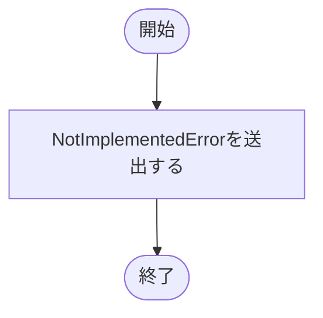

### 戻り値

型：`Tensor`

基底実装は戻らずNotImplementedErrorを送出します。

### ソースコード

<details>
<summary>Binarization.forward() の実装を開く</summary>

```python
@abstractmethod
def forward(self, inputs: Tensor) -> Tensor:
    """各二値化方式に応じた連続値または離散bitを返す。"""
    raise NotImplementedError
```

</details>

## FixedBinarization {/* #fixedbinarization-class */}

学習パラメータを持たない閾値比較層。Soft・Learnableも共通の軸変換を継承します。

継承元：`Binarization`

{/* function: FixedBinarization.__init__@115 */}

## FixedBinarization.\_\_init\_\_() {/* #fixedbinarization-init */}

```python
def __init__(self, thresholds: Tensor | list, *, feature_dim: int = -2) -> None:
```

### 機能概要

リストの閾値はfloat32 Tensorへ変換し、末尾に空でないbit軸があることを確認します。Tensorを独立コピーして、学習パラメータではなくバッファとして登録します。

### 引数

| 引数 | 型 | 既定値 | 説明 |
|---|---|---|---|
| `thresholds` | `Tensor \| list` | `必須` | 末尾軸がbit数の閾値Tensorまたはリスト。Tensorはdtypeを保持し、リストはfloat32へ変換します。 |
| `feature_dim` | `int` | `-2` | 二値化後に追加される末尾bit軸を結合する入力軸。負の番号はbit軸追加後の次元数を基準に解釈します。 |

### 処理の流れ

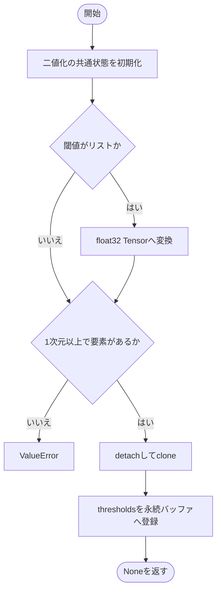

### 戻り値

型：`None`

None。

### ソースコード

<details>
<summary>FixedBinarization.\_\_init\_\_() の実装を開く</summary>

```python
def __init__(self, thresholds: Tensor | list, *, feature_dim: int = -2) -> None:
    """指定された閾値を独立した永続bufferとして保持する。"""
    super().__init__(feature_dim=feature_dim)
    if isinstance(thresholds, list):
        thresholds = torch.tensor(thresholds, dtype=torch.float32)
    if thresholds.ndim < 1 or thresholds.numel() == 0:
        raise ValueError("thresholds には非空の末尾bit軸が必要です")
    self.register_buffer("thresholds", thresholds.detach().clone(), persistent=True)
```

</details>

{/* function: FixedBinarization._sample_training@124 */}

## FixedBinarization.\_sample\_training() {/* #fixedbinarization-sample-training */}

```python
def _sample_training(self, inputs: Tensor, thresholds: Tensor) -> Tensor:
```

### 機能概要

入力が閾値を厳密に超えた位置だけを1にし、固定二値化の学習時出力を作ります。

### 引数

| 引数 | 型 | 既定値 | 説明 |
|---|---|---|---|
| `inputs` | `Tensor` | `必須` | 末尾に比較用の長さ1の軸を追加した入力Tensor。 |
| `thresholds` | `Tensor` | `必須` | 入力とbroadcast可能な閾値Tensor。末尾軸がbit数。 |

### 処理の流れ

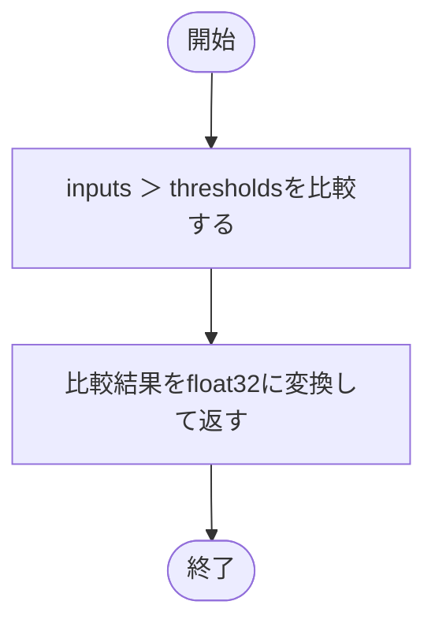

### 戻り値

型：`Tensor`

比較結果と同じ形状のfloat32 Tensor。要素は0または1。

### 例外・注意事項

- 閾値と等しい値は0です。この比較に連続近似や代替勾配はありません。

### ソースコード

<details>
<summary>FixedBinarization.\_sample\_training() の実装を開く</summary>

```python
def _sample_training(self, inputs: Tensor, thresholds: Tensor) -> Tensor:
    """固定閾値の学習経路も評価時と同じfloat32二値比較を用いる。"""
    return (inputs > thresholds).to(dtype=torch.float32)
```

</details>

{/* function: FixedBinarization.forward@128 */}

## FixedBinarization.forward() {/* #fixedbinarization-forward */}

```python
def forward(self, inputs: Tensor) -> Tensor:
```

### 機能概要

入力末尾へbit軸を追加して閾値と比較し、bit軸をfeature_dimの軸へ結合します。SoftとLearnableもこの処理を継承し、学習時の比較部分だけを置き換えます。

### 引数

| 引数 | 型 | 既定値 | 説明 |
|---|---|---|---|
| `inputs` | `Tensor` | `必須` | 二値化するTensor。チャネルごとの閾値[channels, bits]は3次元以上の入力に合わせて整形します。 |

### 処理の流れ

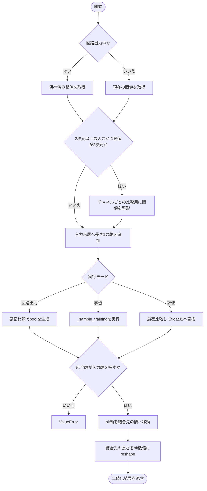

### 戻り値

型：`Tensor`

入力と同じ次元数のTensor。指定した軸の長さがbit数倍になります。回路出力はbool、通常評価はfloat32、学習時のdtypeはサンプリング方式に従います。

### 例外・注意事項

- この関数自体は入力値を0〜1へ正規化しません。回路出力でも入力はboolに限定せず、閾値と比較します。

### ソースコード

<details>
<summary>FixedBinarization.forward() の実装を開く</summary>

```python
def forward(self, inputs: Tensor) -> Tensor:
    """通常は方式別sampling、評価と回路出力では厳密な閾値比較を行う。"""
    thresholds = self._export_thresholds if self.export_mode else self.get_thresholds()
    if inputs.ndim >= 3 and thresholds.ndim == 2:
        thresholds = thresholds.reshape(1, thresholds.shape[0], *([1] * (inputs.ndim - 2)), thresholds.shape[-1])
    values = inputs.unsqueeze(-1)
    if self.export_mode:
        result = values > thresholds
    elif self.training:
        result = self._sample_training(values, thresholds)
    else:
        result = (values > thresholds).to(dtype=torch.float32)
    if not -result.ndim <= self.feature_dim < result.ndim - 1 or self.feature_dim == -1:
        raise ValueError("feature_dim は追加したbit軸以外の入力軸で指定してください")
    axis  = self.feature_dim % result.ndim
    order = [*range(axis + 1), result.ndim - 1, *range(axis + 1, result.ndim - 1)]
    shape = [*result.shape[:-1]]
    shape[axis] *= result.shape[-1]
    return result.permute(order).reshape(shape)
```

</details>

## DummyBinarization {/* #dummybinarization-class */}

通常はfloat32変換だけを行い、回路出力時はboolをそのまま返す層。0/1への閾値変換はしません。

継承元：`Binarization`

{/* function: DummyBinarization.__init__@152 */}

## DummyBinarization.\_\_init\_\_() {/* #dummybinarization-init */}

```python
def __init__(self) -> None:
```

### 機能概要

閾値や重みを持たず、二値化基底のモード管理だけを初期化します。

### 引数

`self` 以外に指定する引数はありません。

### 処理の流れ

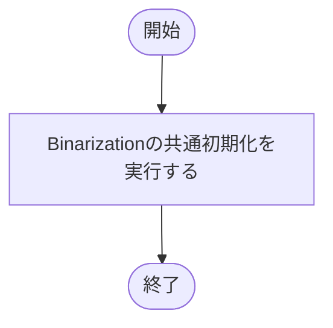

### 戻り値

型：`None`

None。

### ソースコード

<details>
<summary>DummyBinarization.\_\_init\_\_() の実装を開く</summary>

```python
def __init__(self) -> None:
    """閾値や学習Parameterを作らず共通のmode管理だけを用意する。"""
    super().__init__()
```

</details>

{/* function: DummyBinarization.forward@156 */}

## DummyBinarization.forward() {/* #dummybinarization-forward */}

```python
def forward(self, inputs: Tensor) -> Tensor:
```

### 機能概要

通常実行ではinputs.float()でfloat32に変換します。回路出力中はbool型を確認し、元のTensorをそのまま返します。

### 引数

| 引数 | 型 | 既定値 | 説明 |
|---|---|---|---|
| `inputs` | `Tensor` | `必須` | 通過させる入力Tensor。回路出力時はbool。 |

### 処理の流れ

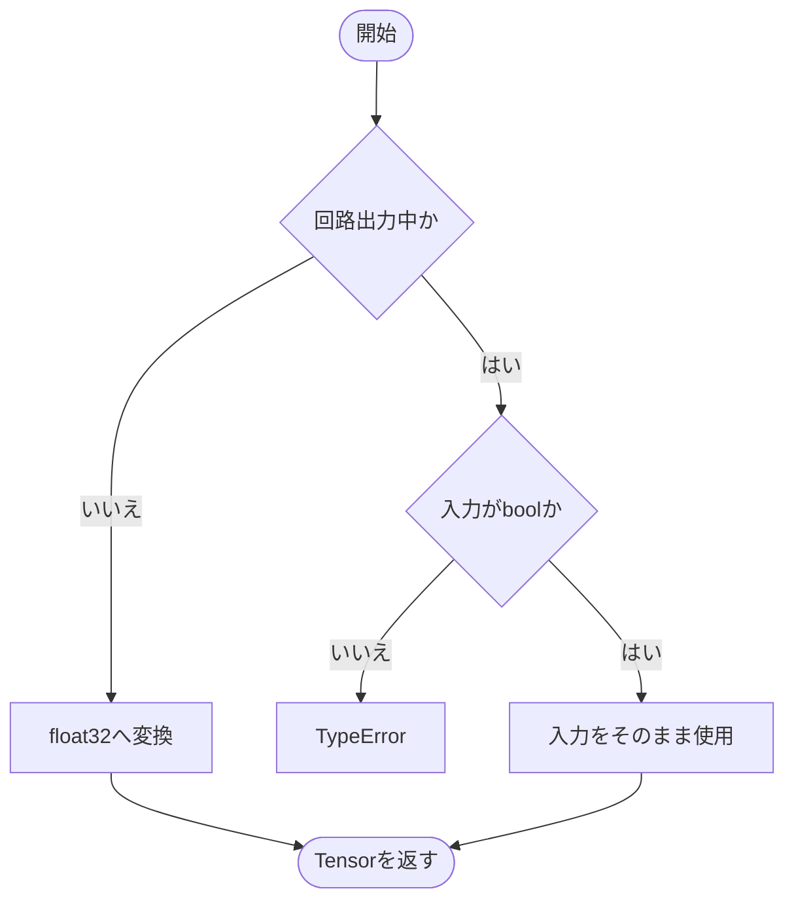

### 戻り値

型：`Tensor`

元と同じshapeのTensor。通常はfloat32、回路出力時は入力と同一のbool Tensor。

### 例外・注意事項

- 通常実行でも0/1以外の値はそのまま残ります。

### ソースコード

<details>
<summary>DummyBinarization.forward() の実装を開く</summary>

```python
def forward(self, inputs: Tensor) -> Tensor:
    """値とshapeを変えず、通常のfloat32変換またはbool通過を行う。"""
    if self.export_mode:
        if inputs.dtype != torch.bool:
            raise TypeError("DummyBinarizationの回路出力入力はbool Tensorで指定してください")
        return inputs
    return inputs.float()
```

</details>

## SoftBinarization {/* #softbinarization-class */}

固定閾値を使い、学習時のみ温度付きsigmoidで比較を近似する層。

継承元：`FixedBinarization`

{/* function: SoftBinarization.__init__@168 */}

## SoftBinarization.\_\_init\_\_() {/* #softbinarization-init */}

```python
def __init__(self, thresholds: Tensor | list, *, temperature: float = 0.1, feature_dim: int = -2) -> None:
```

### 機能概要

正で有限な温度を確認し、固定閾値の保持とbit軸の結合設定を初期化します。

### 引数

| 引数 | 型 | 既定値 | 説明 |
|---|---|---|---|
| `thresholds` | `Tensor \| list` | `必須` | 末尾軸がbit数の閾値Tensorまたはリスト。Tensorはdtypeを保持し、リストはfloat32へ変換します。 |
| `temperature` | `float` | `0.1` | 学習時のsigmoid温度。正の有限値。 |
| `feature_dim` | `int` | `-2` | 二値化後に追加される末尾bit軸を結合する入力軸。負の番号はbit軸追加後の次元数を基準に解釈します。 |

### 処理の流れ

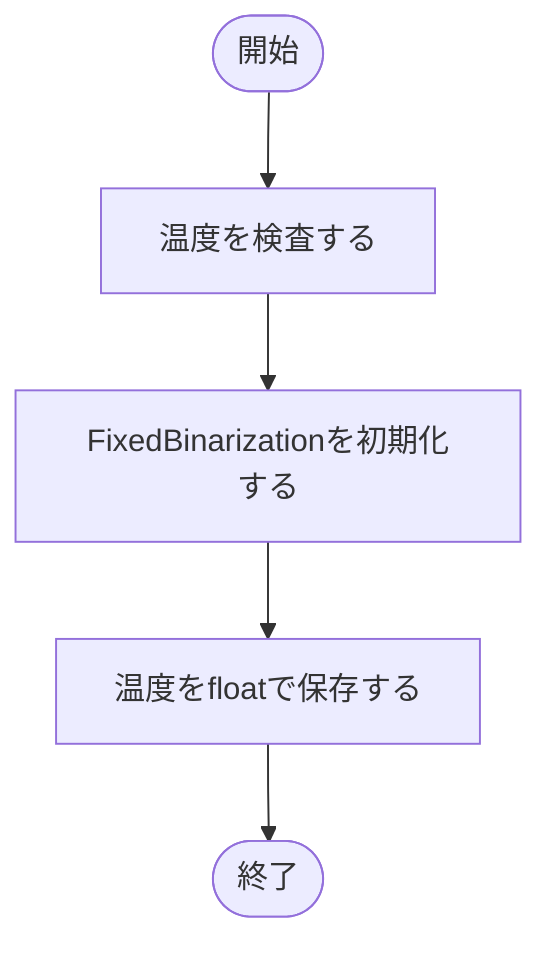

### 戻り値

型：`None`

None。

### ソースコード

<details>
<summary>SoftBinarization.\_\_init\_\_() の実装を開く</summary>

```python
def __init__(self, thresholds: Tensor | list, *, temperature: float = 0.1, feature_dim: int = -2) -> None:
    """固定閾値と正有限のsampling温度を保持する。"""
    _validate_positive_number("temperature", temperature)
    super().__init__(thresholds, feature_dim=feature_dim)
    self.temperature = float(temperature)
```

</details>

{/* function: SoftBinarization._sample_training@174 */}

## SoftBinarization.\_sample\_training() {/* #softbinarization-sample-training */}

```python
def _sample_training(self, inputs: Tensor, thresholds: Tensor) -> Tensor:
```

### 機能概要

入力と閾値の差に温度付きsigmoidを適用し、学習時の比較を微分可能な値へ置き換えます。

### 引数

| 引数 | 型 | 既定値 | 説明 |
|---|---|---|---|
| `inputs` | `Tensor` | `必須` | 末尾に比較用の長さ1の軸を追加した入力Tensor。 |
| `thresholds` | `Tensor` | `必須` | 入力とbroadcast可能な閾値Tensor。末尾軸がbit数。 |

### 処理の流れ

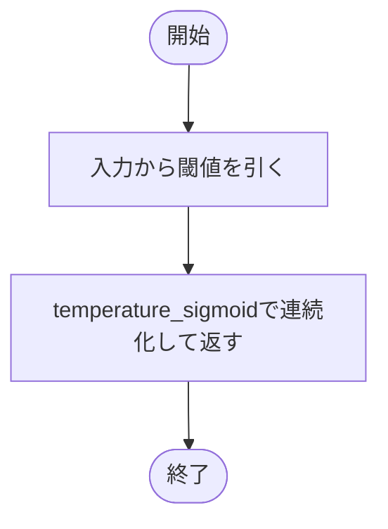

### 戻り値

型：`Tensor`

差分と同じshape・dtypeの連続値Tensor。

### ソースコード

<details>
<summary>SoftBinarization.\_sample\_training() の実装を開く</summary>

```python
def _sample_training(self, inputs: Tensor, thresholds: Tensor) -> Tensor:
    """元入力と閾値の差のdtypeを保って温度付きsigmoidを計算する。"""
    return temperature_sigmoid(inputs - thresholds, temperature=self.temperature)
```

</details>

## LearnableBinarization {/* #learnablebinarization-class */}

閾値間の差分を学習する層。学習時は2番目以降の差分を正に変換し、評価時は生の差分を累積します。

継承元：`FixedBinarization`

{/* function: LearnableBinarization.__init__@182 */}

## LearnableBinarization.\_\_init\_\_() {/* #learnablebinarization-init */}

```python
def __init__(
    self,
    thresholds: Tensor | list,
    *,
    feature_dim: int = -2,
    sampling_temperature: float = 0.1,
    ordering_temperature: float = 0.1,
    sampling: str = "soft",
    max_gradient_norm: float = 0.001,
) -> None:
```

### 機能概要

サンプリングと差分整列の温度、勾配上限、方式名を検査します。閾値の先頭に0を補って差分を取り、その差分をParameterとして登録し、勾配制限フックを付けます。

### 引数

| 引数 | 型 | 既定値 | 説明 |
|---|---|---|---|
| `thresholds` | `Tensor \| list` | `必須` | 末尾軸がbit数の閾値Tensorまたはリスト。Tensorはdtypeを保持し、リストはfloat32へ変換します。 |
| `feature_dim` | `int` | `-2` | 二値化後に追加される末尾bit軸を結合する入力軸。負の番号はbit軸追加後の次元数を基準に解釈します。 |
| `sampling_temperature` | `float` | `0.1` | 入力と閾値の比較を連続化する温度。 |
| `ordering_temperature` | `float` | `0.1` | 2番目以降の差分をsoftplusで正へ変換する温度。 |
| `sampling` | `str` | `'soft'` | soft、hard、gumbel_soft、gumbel_hard。 |
| `max_gradient_norm` | `float` | `0.001` | raw_diffs全体の勾配ノルム上限。0以上の有限値。 |

### 処理の流れ

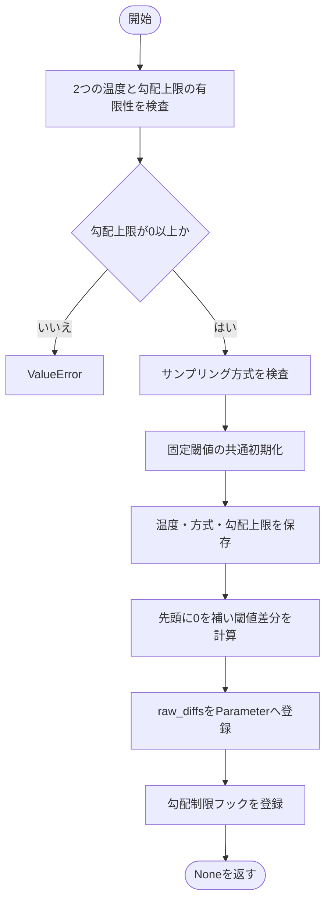

### 戻り値

型：`None`

None。

### ソースコード

<details>
<summary>LearnableBinarization.\_\_init\_\_() の実装を開く</summary>

```python
def __init__(
    self,
    thresholds: Tensor | list,
    *,
    feature_dim: int = -2,
    sampling_temperature: float = 0.1,
    ordering_temperature: float = 0.1,
    sampling: str = "soft",
    max_gradient_norm: float = 0.001,
) -> None:
    """元閾値の差分をParameterへ保存し、全勾配を制限するhookを登録する。"""
    _validate_positive_number("sampling_temperature", sampling_temperature)
    _validate_positive_number("ordering_temperature", ordering_temperature)
    _validate_finite_number("max_gradient_norm", max_gradient_norm)
    if max_gradient_norm < 0:
        raise ValueError("max_gradient_norm は0以上の値で指定してください")
    _validate_choice("sampling", sampling, ("soft", "hard", "gumbel_soft", "gumbel_hard"))
    super().__init__(thresholds, feature_dim=feature_dim)
    self.sampling_temperature = float(sampling_temperature)
    self.ordering_temperature = float(ordering_temperature)
    self.sampling             = sampling
    self.max_gradient_norm    = float(max_gradient_norm)
    leading = self.thresholds.new_zeros((*self.thresholds.shape[:-1], 1))
    diffs   = torch.diff(self.thresholds, prepend=leading, dim=-1)
    self.raw_diffs = nn.Parameter(diffs)
    self._ensure_gradient_hook()
```

</details>

{/* function: LearnableBinarization._ensure_gradient_hook@209 */}

## LearnableBinarization.\_ensure\_gradient\_hook() {/* #learnablebinarization-ensure-gradient-hook */}

```python
def _ensure_gradient_hook(self) -> None:
```

### 機能概要

raw_diffsが勾配を必要とし、現在のParameterにまだフックを登録していない場合だけ登録します。弱参照で対象を識別し、Parameterの差し替えにも対応します。

### 引数

`self` 以外に指定する引数はありません。

### 処理の流れ

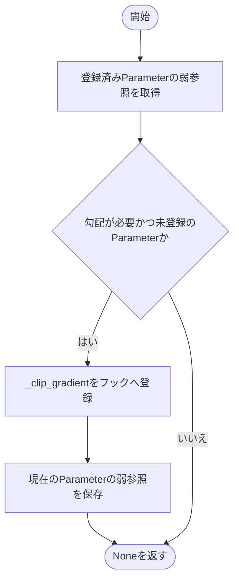

### 戻り値

型：`None`

None。

### 状態の変更・ファイル出力

- 必要な場合のみParameterへ逆伝播フックを追加します。

### ソースコード

<details>
<summary>LearnableBinarization.\_ensure\_gradient\_hook() の実装を開く</summary>

```python
def _ensure_gradient_hook(self) -> None:
    """現在のParameterへ一度だけhookを付け、差し替えやfreeze解除にも対応する。"""
    reference = getattr(self, "_gradient_hook_parameter", None)
    if self.raw_diffs.requires_grad and (reference is None or reference() is not self.raw_diffs):
        self.raw_diffs.register_hook(self._clip_gradient)
        self._gradient_hook_parameter = weakref.ref(self.raw_diffs)
```

</details>

{/* function: LearnableBinarization._clip_gradient@216 */}

## LearnableBinarization.\_clip\_gradient() {/* #learnablebinarization-clip-gradient */}

```python
def _clip_gradient(self, gradient: Tensor) -> Tensor:
```

### 機能概要

全差分の勾配ノルムを求め、上限を超えたときだけ全要素を同じ倍率で縮小します。分母へ1e-6を加える実装です。

### 引数

| 引数 | 型 | 既定値 | 説明 |
|---|---|---|---|
| `gradient` | `Tensor` | `必須` | raw_diffsに対する勾配Tensor。 |

### 処理の流れ

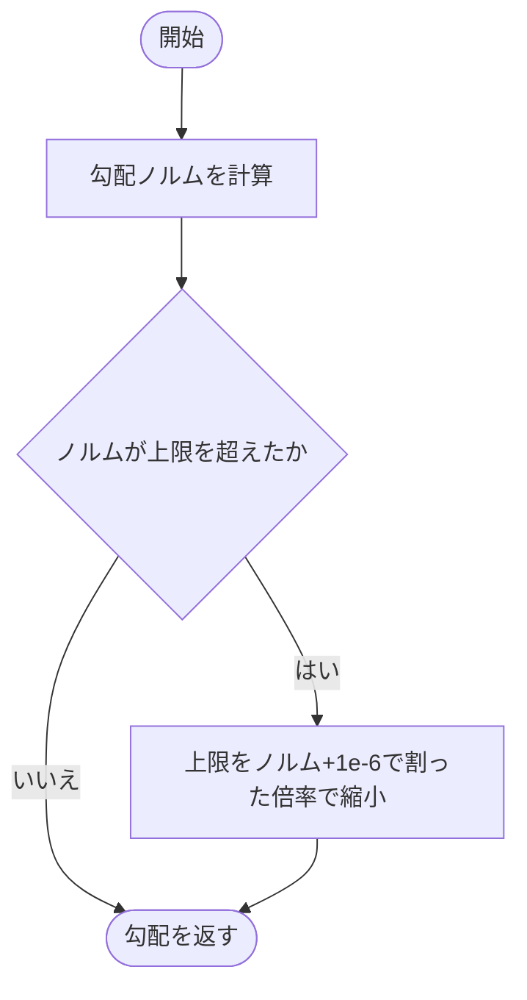

### 戻り値

型：`Tensor`

同じshapeの勾配Tensor。上限以下なら入力をそのまま返します。

### ソースコード

<details>
<summary>LearnableBinarization.\_clip\_gradient() の実装を開く</summary>

```python
def _clip_gradient(self, gradient: Tensor) -> Tensor:
    """全raw差分の勾配normへ旧上限と1e-6分母を適用する。"""
    norm = gradient.norm()
    if norm > self.max_gradient_norm:
        gradient = gradient * (self.max_gradient_norm / (norm + 1e-6))
    return gradient
```

</details>

{/* function: LearnableBinarization.get_thresholds@223 */}

## LearnableBinarization.get\_thresholds() {/* #learnablebinarization-get-thresholds */}

```python
def get_thresholds(self) -> Tensor:
```

### 機能概要

評価時は生の差分をそのまま累積して閾値を復元します。学習時は最初の差分を保持し、2番目以降を温度付きsoftplusで正に変換してから累積します。

### 引数

`self` 以外に指定する引数はありません。

### 処理の流れ

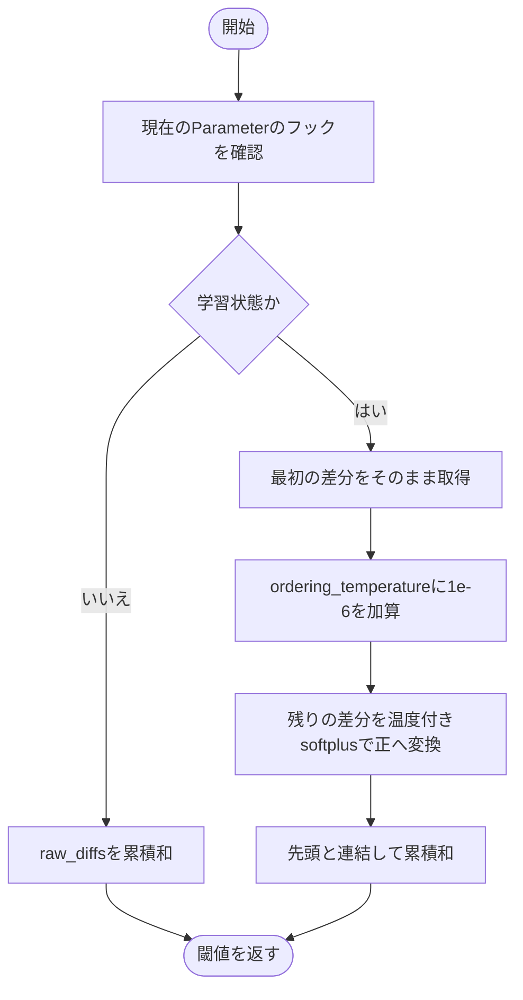

### 戻り値

型：`Tensor`

raw_diffsと同じshapeの閾値Tensor。

### 状態の変更・ファイル出力

- 必要なら勾配フックを登録します。

### 例外・注意事項

- 学習時と評価時で閾値の計算式が異なります。評価時には負の差分もそのまま使用します。

### ソースコード

<details>
<summary>LearnableBinarization.get\_thresholds() の実装を開く</summary>

```python
def get_thresholds(self) -> Tensor:
    """trainは正差分へ変換して累積し、evalはraw差分を直接累積する。"""
    self._ensure_gradient_hook()
    if not self.training:
        return self.raw_diffs.cumsum(-1)
    first = self.raw_diffs[..., :1]
    scale = self.ordering_temperature + 1e-6
    rest  = scale * torch_functional.softplus(self.raw_diffs[..., 1:] / scale)
    return torch.cat((first, rest), dim=-1).cumsum(-1)
```

</details>

{/* function: LearnableBinarization._evaluation_thresholds@233 */}

## LearnableBinarization.\_evaluation\_thresholds() {/* #learnablebinarization-evaluation-thresholds */}

```python
def _evaluation_thresholds(self) -> Tensor:
```

### 機能概要

trainingの状態によらず、生の差分を累積した評価用閾値を返します。回路用スナップショットでもこの式を使います。

### 引数

`self` 以外に指定する引数はありません。

### 処理の流れ

```mermaid
flowchart TD
    startNode(["開始"])
    startNode --> step0["勾配フックの登録を確認する"]
    step0 --> step1["raw_diffsの累積和を返す"]
    step1 --> finishNode(["終了"])
```

### 戻り値

型：`Tensor`

raw_diffsと同じshapeの評価用閾値Tensor。

### 状態の変更・ファイル出力

- 必要なら勾配フックを登録します。

### ソースコード

<details>
<summary>LearnableBinarization.\_evaluation\_thresholds() の実装を開く</summary>

```python
def _evaluation_thresholds(self) -> Tensor:
    """現在のmodeによらず、負差分も保持したraw cumsumを評価閾値とする。"""
    self._ensure_gradient_hook()
    return self.raw_diffs.cumsum(-1)
```

</details>

{/* function: LearnableBinarization._sample_training@238 */}

## LearnableBinarization.\_sample\_training() {/* #learnablebinarization-sample-training */}

```python
def _sample_training(self, inputs: Tensor, thresholds: Tensor) -> Tensor:
```

### 機能概要

入力と閾値の差に、指定された通常またはGumbelのsigmoidを適用します。hard方式ではサンプリング後にfloat32との型昇格を行います。

### 引数

| 引数 | 型 | 既定値 | 説明 |
|---|---|---|---|
| `inputs` | `Tensor` | `必須` | 末尾に比較用の長さ1の軸を追加した入力Tensor。 |
| `thresholds` | `Tensor` | `必須` | 入力とbroadcast可能な閾値Tensor。末尾軸がbit数。 |

### 処理の流れ

```mermaid
flowchart TD
start([開始]) --> logits["入力と閾値の差を計算"]
logits --> gumbel{"samplingがgumbelで始まるか"}
gumbel -->|はい| chooseGumbel["gumbel_sigmoidを選択"]
gumbel -->|いいえ| choosePlain["temperature_sigmoidを選択"]
chooseGumbel --> hard["名前の末尾からhardを判定"]
choosePlain --> hard
hard --> sample["温度とhardを指定してサンプリング"]
sample --> cast{"hard方式か"}
cast -->|はい| promote["float32との昇格型へ変換"]
cast -->|いいえ| finish([結果を返す])
promote --> finish
```

### 戻り値

型：`Tensor`

比較後のTensor。softはサンプラーの連続値、hardは0/1の値です。hardのdtypeは差分dtypeとfloat32の昇格結果。

### 状態の変更・ファイル出力

- Gumbel方式では乱数を消費します。

### ソースコード

<details>
<summary>LearnableBinarization.\_sample\_training() の実装を開く</summary>

```python
def _sample_training(self, inputs: Tensor, thresholds: Tensor) -> Tensor:
    """指定したsigmoid系samplingを適用し、旧hard出力のdtype昇格を維持する。"""
    logits  = inputs - thresholds
    sampler = gumbel_sigmoid if self.sampling.startswith("gumbel") else temperature_sigmoid
    hard    = self.sampling.endswith("hard")
    result  = sampler(logits, temperature=self.sampling_temperature, hard=hard)
    return result.to(dtype=torch.promote_types(logits.dtype, torch.float32)) if hard else result
```

</details>

{/* function: LearnableBinarization._refresh_loaded_state@246 */}

## LearnableBinarization.\_refresh\_loaded\_state() {/* #learnablebinarization-refresh-loaded-state */}

```python
def _refresh_loaded_state(self, module: nn.Module, incompatible_keys: Any) -> None:
```

### 機能概要

assignによってParameterが差し替わった場合にも勾配フックを登録し直し、基底の復元後処理で必要な回路用閾値を更新します。

### 引数

| 引数 | 型 | 既定値 | 説明 |
|---|---|---|---|
| `module` | `nn.Module` | `必須` | 復元処理から渡される対象モジュール。この実装では直接使用しません。 |
| `incompatible_keys` | `Any` | `必須` | 復元時の不足・余分なキー。このフックでは直接使用しません。 |

### 処理の流れ

```mermaid
flowchart TD
    startNode(["開始"])
    startNode --> step0["現在のParameterへ必要な勾配フックを登録する"]
    step0 --> step1["Binarizationの復元後処理を呼ぶ"]
    step1 --> finishNode(["終了"])
```

### 戻り値

型：`None`

None。

### ソースコード

<details>
<summary>LearnableBinarization.\_refresh\_loaded\_state() の実装を開く</summary>

```python
def _refresh_loaded_state(self, module: nn.Module, incompatible_keys: Any) -> None:
    """assign復元後のParameterへhookを付け直し、回路snapshotを再生成する。"""
    self._ensure_gradient_hook()
    super()._refresh_loaded_state(module, incompatible_keys)
```

</details>

{/* function: LearnableBinarization.__getstate__@251 */}

## LearnableBinarization.\_\_getstate\_\_() {/* #learnablebinarization-getstate */}

```python
def __getstate__(self) -> dict[str, Any]:
```

### 機能概要

PyTorch標準の保存状態からParameterへの弱参照を除き、複製やシリアライズに渡せる状態を返します。

### 引数

`self` 以外に指定する引数はありません。

### 処理の流れ

```mermaid
flowchart TD
    startNode(["開始"])
    startNode --> step0["親クラスから状態辞書を取得する"]
    step0 --> step1["フック対象への弱参照を取り除く"]
    step1 --> step2["状態辞書を返す"]
    step2 --> finishNode(["終了"])
```

### 戻り値

型：`dict[str, Any]`

_gradient_hook_parameterを含まない状態辞書。

### ソースコード

<details>
<summary>LearnableBinarization.\_\_getstate\_\_() の実装を開く</summary>

```python
def __getstate__(self) -> dict[str, Any]:
    """Parameterへのweakrefを保存せず、複製先でhookを再登録できる状態を返す。"""
    state = super().__getstate__()
    state.pop("_gradient_hook_parameter", None)
    return state
```

</details>

{/* function: LearnableBinarization.__setstate__@257 */}

## LearnableBinarization.\_\_setstate\_\_() {/* #learnablebinarization-setstate */}

```python
def __setstate__(self, state: dict[str, Any]) -> None:
```

### 機能概要

親クラスで保存状態を復元した後、復元先のParameterに対応した勾配フックを確認・登録します。

### 引数

| 引数 | 型 | 既定値 | 説明 |
|---|---|---|---|
| `state` | `dict[str, Any]` | `必須` | __getstate__などから渡される保存状態辞書。 |

### 処理の流れ

```mermaid
flowchart TD
    startNode(["開始"])
    startNode --> step0["親クラスで状態を復元する"]
    step0 --> step1["復元先Parameterの勾配フックを登録する"]
    step1 --> finishNode(["終了"])
```

### 戻り値

型：`None`

None。

### 状態の変更・ファイル出力

- オブジェクトの状態と必要な逆伝播フックを復元します。

### ソースコード

<details>
<summary>LearnableBinarization.\_\_setstate\_\_() の実装を開く</summary>

```python
def __setstate__(self, state: dict[str, Any]) -> None:
    """複製・復元されたParameterに独立した勾配制限hookを登録する。"""
    super().__setstate__(state)
    self._ensure_gradient_hook()
```

</details>

## 関連ファイル

- [utils/logicNN_core/src/logicnn_core/functional/\_\_init\_\_.py](/code-reference/utils/logicNN_core/src/logicnn_core/functional/__init__)
- [utils/logicNN_core/src/logicnn_core/layer_settings.py](/code-reference/utils/logicNN_core/src/logicnn_core/layer_settings)
