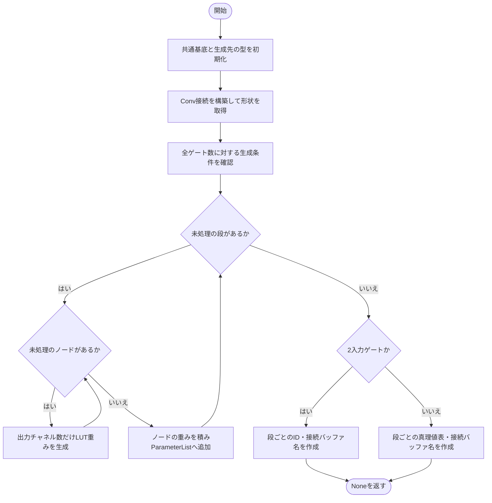
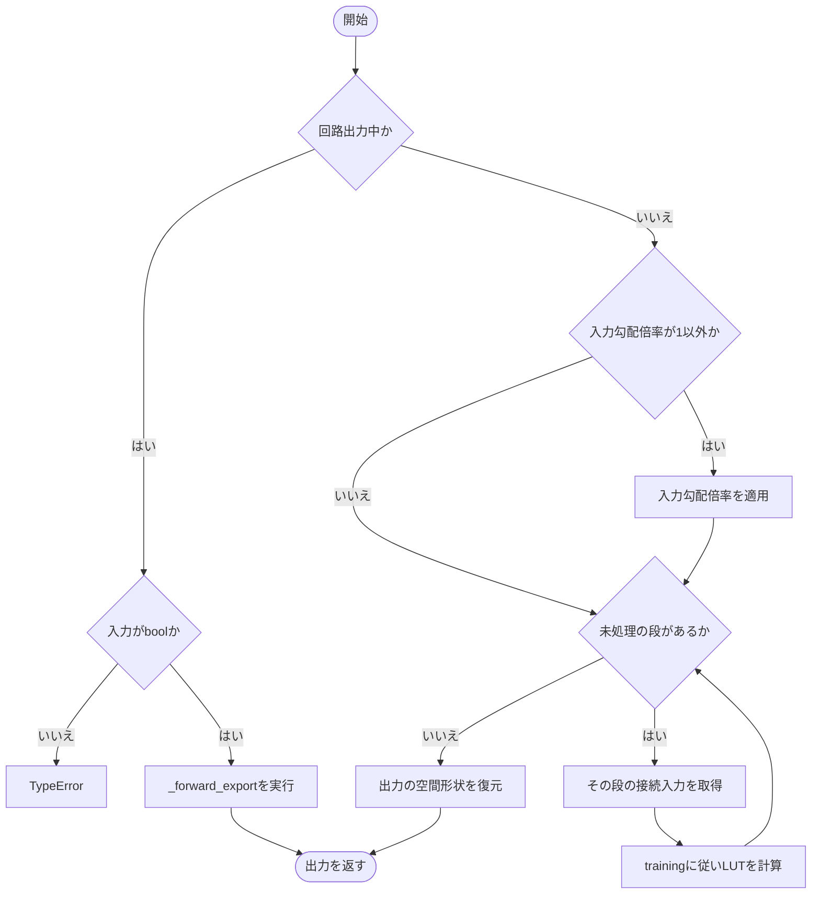
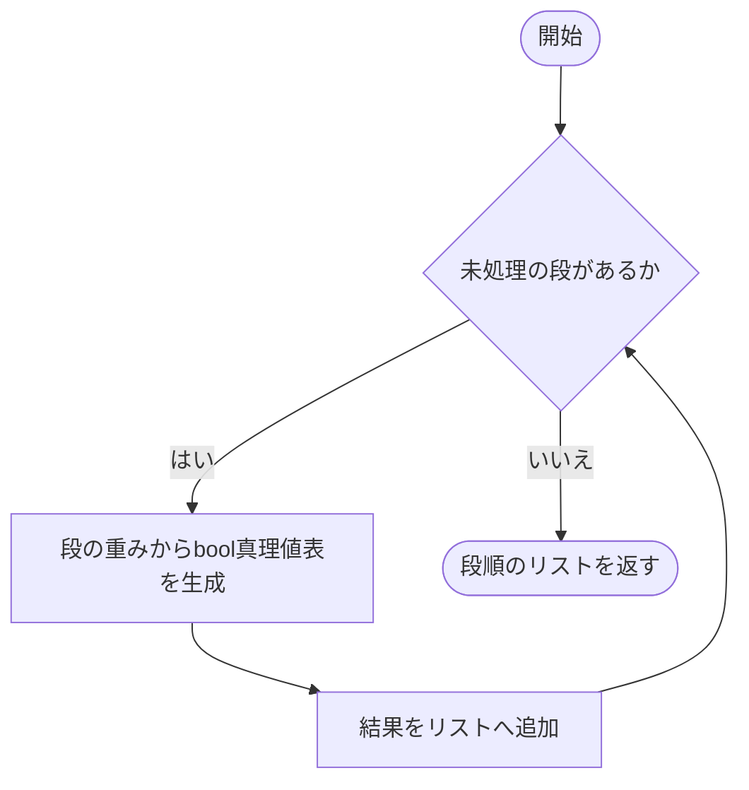
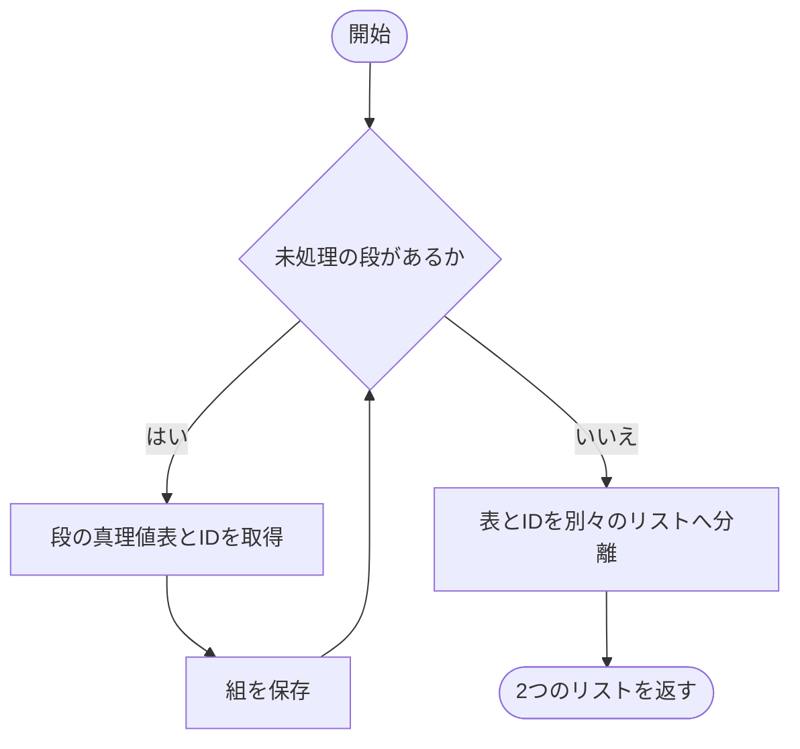
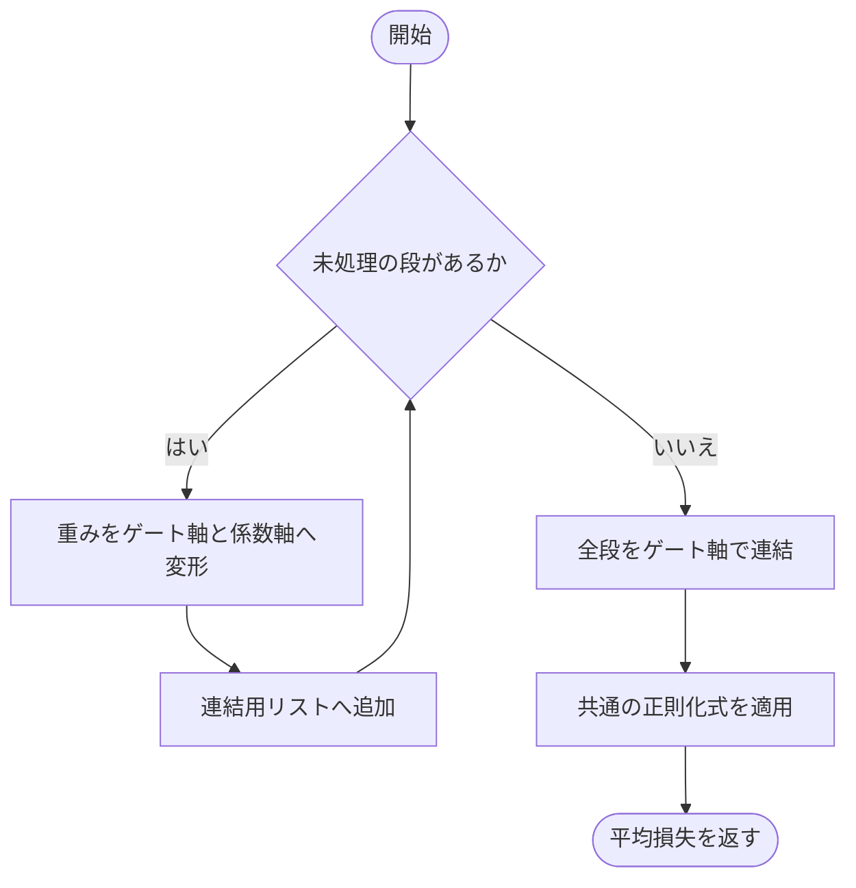
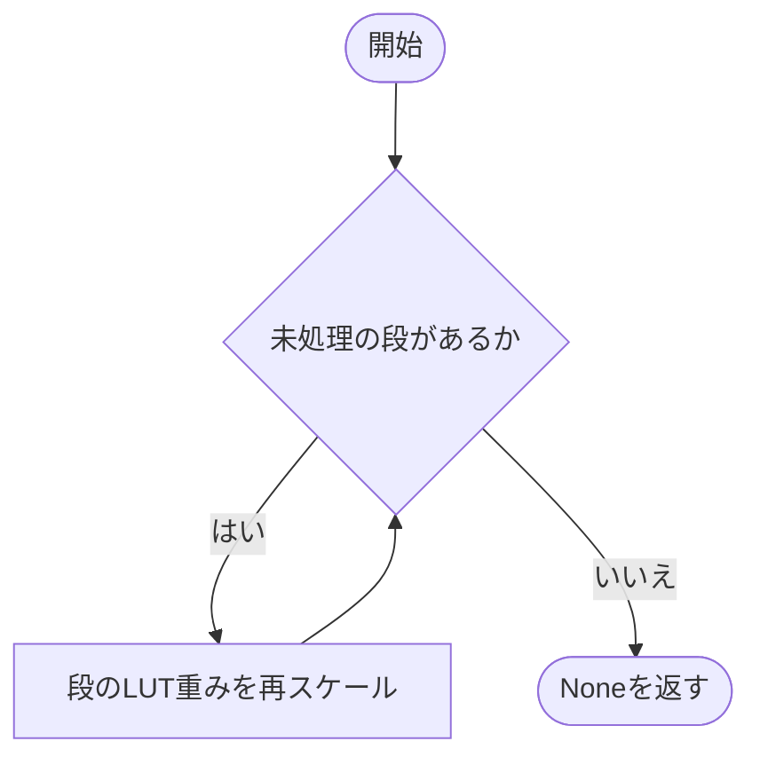
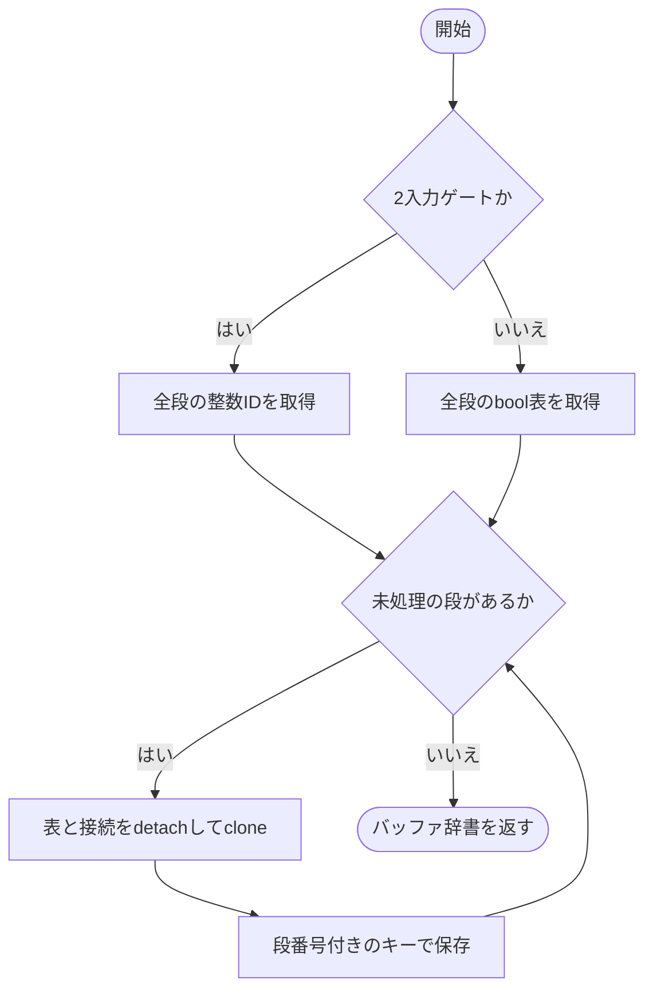
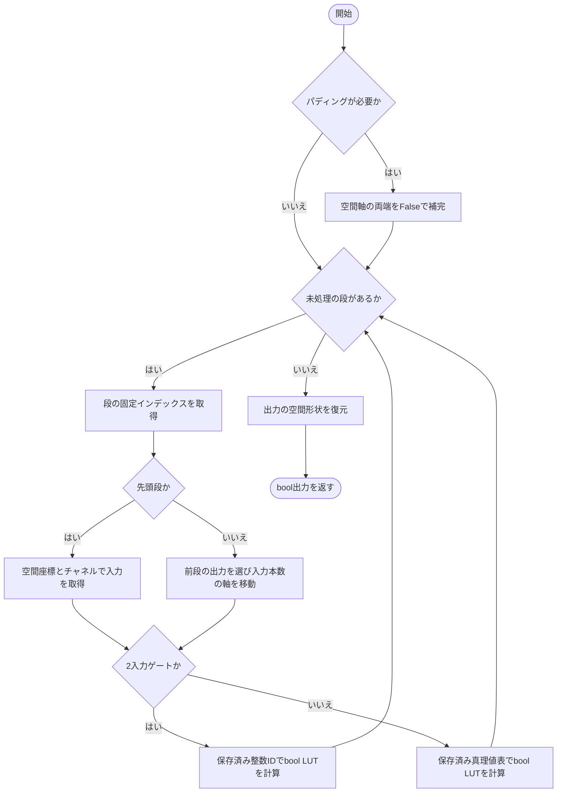
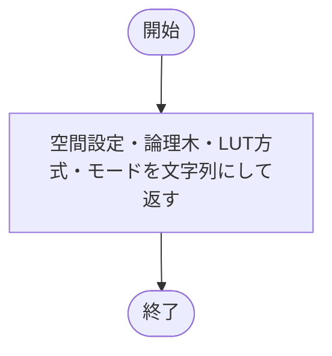
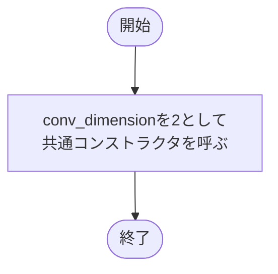

# convolution.py

`utils/logicNN_core/src/logicnn_core/layers/convolution.py`

2D・3Dの各受容野を、複数段の論理木で処理する畳み込み層です。各段のノード・出力チャネルごとにLUT重みを持ち、通常計算とbool回路計算を切り替えます。

{/* source-sha256: 2cc75eb38413756727b3dd86b754760c4452636f80ac3a1df3c079b9e0b9d194 */}

## \_LogicConvNd {/* #logicconvnd-class */}

2D・3Dで共通する論理木の構築と計算を実装する内部基底クラス。

継承元：`LogicLayer`

{/* function: _LogicConvNd.__init__@27 */}

## \_LogicConvNd.\_\_init\_\_() {/* #logicconvnd-init */}

```python
def __init__(
    self,
    input_size: int | tuple[int, ...],
    in_channels: int,
    out_channels: int,
    tree_depth: int,
    kernel_size: int | tuple[int, ...],
    *,
    stride: int | tuple[int, ...] = 1,
    padding: int | tuple[int, ...] = 0,
    conv_dimension: int,
    lut: LUTConfig = LUTConfig(),
    connections: ConnectionConfig = ConnectionConfig(),
    gradient_scale: float = 1.0,
    device: torch.device | str | None = None,
    dtype: torch.dtype | None = None,
) -> None:
```

### 機能概要

固定受容野の接続を構築して空間形状と論理木の構成を確定し、段ごと・ノードごとにLUT重みを初期化します。重みは段単位のParameterとして保持します。

### 引数

| 引数 | 型 | 既定値 | 説明 |
|---|---|---|---|
| `input_size` | `int \| tuple[int, ...]` | `必須` | 入力の空間サイズ。整数は各軸へ展開し、タプルでは軸ごとに指定します。 |
| `in_channels` | `int` | `必須` | 入力チャネル数。 |
| `out_channels` | `int` | `必須` | 出力チャネル数。 |
| `tree_depth` | `int` | `必須` | 受容野ごとの論理木の段数。 |
| `kernel_size` | `int \| tuple[int, ...]` | `必須` | 受容野の空間サイズ。 |
| `stride` | `int \| tuple[int, ...]` | `1` | 受容野を移動する幅。 |
| `padding` | `int \| tuple[int, ...]` | `0` | 各空間軸の両端へ追加する0の幅。 |
| `conv_dimension` | `int` | `必須` | 空間次元数。2または3。 |
| `lut` | `LUTConfig` | `LUTConfig()` | ゲートの入力本数・LUT方式・初期化方法などを指定するLUTConfig。 |
| `connections` | `ConnectionConfig` | `ConnectionConfig()` | 入力接続の方式と初期化を指定するConnectionConfig。 |
| `gradient_scale` | `float` | `1.0` | 入力へ伝わる逆伝播の勾配倍率。順伝播の値は変えません。 |
| `device` | `torch.device \| str \| None` | `None` | 重みと接続を生成するデバイス。NoneはPyTorchの既定デバイス。 |
| `dtype` | `torch.dtype \| None` | `None` | LUT重みの浮動小数点型。NoneはPyTorchの既定dtype。 |

### 処理の流れ



### 戻り値

型：`None`

None。

### 状態の変更・ファイル出力

- 重みと固定接続を初期化し、方式に応じた乱数を消費します。

### ソースコード

<details>
<summary>\_LogicConvNd.\_\_init\_\_() の実装を開く</summary>

```python
def __init__(
    self,
    input_size: int | tuple[int, ...],
    in_channels: int,
    out_channels: int,
    tree_depth: int,
    kernel_size: int | tuple[int, ...],
    *,
    stride: int | tuple[int, ...] = 1,
    padding: int | tuple[int, ...] = 0,
    conv_dimension: int,
    lut: LUTConfig = LUTConfig(),
    connections: ConnectionConfig = ConnectionConfig(),
    gradient_scale: float = 1.0,
    device: torch.device | str | None = None,
    dtype: torch.dtype | None = None,
) -> None:
    """接続geometryを検証し、旧来のnode単位の抽選で各levelの重みを生成する。"""
    super().__init__(lut=lut, connections=connections, gradient_scale=gradient_scale)
    device, dtype    = self.parametrization._initialization_options(1, device, dtype)
    self.connections = build_conv_connections(input_size, in_channels, out_channels, tree_depth, kernel_size, num_inputs=self.num_inputs,
                                               stride=stride, padding=padding, conv_dimension=conv_dimension, config=connections, device=device)
    self.input_size     = self.connections.input_size
    self.in_channels    = self.connections.in_channels
    self.out_channels   = self.connections.out_channels
    self.tree_depth     = self.connections.tree_depth
    self.kernel_size    = self.connections.kernel_size
    self.stride         = self.connections.stride
    self.padding        = self.connections.padding
    self.conv_dimension = self.connections.conv_dimension
    self.output_size    = self.connections.output_size
    self.node_counts    = self.connections.node_counts
    self.tree_weights   = nn.ParameterList()
    total_gates         = sum(self.node_counts) * self.out_channels
    self.parametrization._initialization_options(total_gates, device, dtype)
    for nodes in self.node_counts:
        weights = torch.stack([self.parametrization.initialize(out_channels, device=device, dtype=dtype) for _ in range(nodes)])
        self.tree_weights.append(nn.Parameter(weights))
    self._export_table_kind   = "lut_ids" if self.num_inputs == 2 else "truth_tables"
    self._export_buffer_names = tuple(f"_export_{kind}_{level}" for level in range(tree_depth) for kind in (self._export_table_kind, "indices"))
```

</details>

{/* function: _LogicConvNd.forward@68 */}

## \_LogicConvNd.forward() {/* #logicconvnd-forward */}

```python
def forward(self, inputs: Tensor) -> Tensor:
```

### 機能概要

通常計算では最初に入力勾配倍率を適用し、各段で接続先の入力を集めてLUTを計算します。回路出力時はbool入力を確認して専用経路へ渡します。

### 引数

| 引数 | 型 | 既定値 | 説明 |
|---|---|---|---|
| `inputs` | `Tensor` | `必須` | [batch, in_channels, *input_size]のTensor。回路出力時はbool。 |

### 処理の流れ



### 戻り値

型：`Tensor`

[batch, out_channels, *output_size]のTensor。通常はLUT重みのdtype、回路出力時はbool。

### ソースコード

<details>
<summary>\_LogicConvNd.forward() の実装を開く</summary>

```python
def forward(self, inputs: Tensor) -> Tensor:
    """入力勾配倍率を一度だけ適用し、全levelを集約して元の空間次元へ戻す。"""
    if self.export_mode:
        if inputs.dtype != torch.bool:
            raise TypeError("export入力はbool Tensorで指定してください。必要な二値化を層の前で明示してください")
        return self._forward_export(inputs)
    values = scale_gradient(inputs, self.gradient_scale) if self.gradient_scale != 1.0 else inputs
    for level, weights in enumerate(self.tree_weights):
        selected = self.connections(values, level)
        values   = self.parametrization(selected, weights, training=self.training, contraction="fc,bcsf->bcsf")
    return values.reshape(inputs.shape[0], self.out_channels, *self.output_size)
```

</details>

{/* function: _LogicConvNd.truth_tables@80 */}

## \_LogicConvNd.truth\_tables() {/* #logicconvnd-truth-tables */}

```python
def truth_tables(self) -> list[Tensor]:
```

### 機能概要

論理木の入力側から順に、各段の最新重みをbool真理値表へ変換します。

### 引数

`self` 以外に指定する引数はありません。

### 処理の流れ



### 戻り値

型：`list[Tensor]`

段順のリスト。各Tensorは[node数, out_channels, 2**num_inputs]のbool。

### ソースコード

<details>
<summary>\_LogicConvNd.truth\_tables() の実装を開く</summary>

```python
def truth_tables(self) -> list[Tensor]:
    """最新の重みから、各levelのnode・channel順を保つbool真理値表を返す。"""
    return [self.parametrization.truth_tables(weights) for weights in self.tree_weights]
```

</details>

{/* function: _LogicConvNd.truth_tables_with_ids@84 */}

## \_LogicConvNd.truth\_tables\_with\_ids() {/* #logicconvnd-truth-tables-with-ids */}

```python
def truth_tables_with_ids(self) -> tuple[list[Tensor], list[Tensor | None]]:
```

### 機能概要

各段の最新重みから真理値表と整数IDを取得し、表のリストとIDのリストに分けて返します。

### 引数

`self` 以外に指定する引数はありません。

### 処理の流れ



### 戻り値

型：`tuple[list[Tensor], list[Tensor \| None]]`

段順のbool表リストとIDリストの組。IDは[node数, out_channels]のint64で、6入力では各要素がNone。

### ソースコード

<details>
<summary>\_LogicConvNd.truth\_tables\_with\_ids() の実装を開く</summary>

```python
def truth_tables_with_ids(self) -> tuple[list[Tensor], list[Tensor | None]]:
    """levelごとの真理値表と整数IDを返し、rank6のIDはNoneとして扱う。"""
    pairs = [self.parametrization.truth_tables_with_ids(weights) for weights in self.tree_weights]
    return [table for table, _ in pairs], [ids for _, ids in pairs]
```

</details>

{/* function: _LogicConvNd.regularization_loss@89 */}

## \_LogicConvNd.regularization\_loss() {/* #logicconvnd-regularization-loss */}

```python
def regularization_loss(self, kind: str | None = None) -> Tensor:
```

### 機能概要

各段のノードとチャネルをゲート軸へまとめて連結し、全ゲートで平均した正則化損失を返します。段ごとの平均をさらに平均する方法ではありません。

### 引数

| 引数 | 型 | 既定値 | 説明 |
|---|---|---|---|
| `kind` | `str \| None` | `None` | None、L2、abs_sum。 |

### 処理の流れ



### 戻り値

型：`Tensor`

重みと同じdtype・deviceのスカラーTensor。

### ソースコード

<details>
<summary>\_LogicConvNd.regularization\_loss() の実装を開く</summary>

```python
def regularization_loss(self, kind: str | None = None) -> Tensor:
    """全levelのLUTをゲート軸へ連結し、level数ではなく全ゲート数で平均する。"""
    weights = torch.cat([values.reshape(-1, values.shape[-1]) for values in self.tree_weights])
    return regularization_loss(weights, kind)
```

</details>

{/* function: _LogicConvNd.rescale_weights_@94 */}

## \_LogicConvNd.rescale\_weights\_() {/* #logicconvnd-rescale-weights */}

```python
def rescale_weights_(self, method: str | None = None) -> None:
```

### 機能概要

論理木のすべての段について、LUT重みへ同じ再スケール方式を適用します。

### 引数

| 引数 | 型 | 既定値 | 説明 |
|---|---|---|---|
| `method` | `str \| None` | `None` | None、clip、L2、abs_sum。 |

### 処理の流れ



### 戻り値

型：`None`

None。

### 状態の変更・ファイル出力

- 指定方式に応じて各Parameterをin-place更新します。接続と既存gradは変更しません。

### ソースコード

<details>
<summary>\_LogicConvNd.rescale\_weights\_() の実装を開く</summary>

```python
def rescale_weights_(self, method: str | None = None) -> None:
    """各levelの係数だけを再スケールし、Parameterと既存gradを保持する。"""
    for weights in self.tree_weights:
        rescale_weights_(weights, method)
```

</details>

{/* function: _LogicConvNd._make_export_buffers@99 */}

## \_LogicConvNd.\_make\_export\_buffers() {/* #logicconvnd-make-export-buffers */}

```python
def _make_export_buffers(self) -> dict[str, Tensor]:
```

### 機能概要

入力本数に応じて全段のIDまたはbool表を選び、段ごとの接続とともに独立コピーした辞書を作ります。

### 引数

`self` 以外に指定する引数はありません。

### 処理の流れ



### 戻り値

型：`dict[str, Tensor]`

段番号付きの真理値表またはID・接続Tensorを格納した辞書。

### ソースコード

<details>
<summary>\_LogicConvNd.\_make\_export\_buffers() の実装を開く</summary>

```python
def _make_export_buffers(self) -> dict[str, Tensor]:
    """全levelの整数IDまたはbool表を、固定した接続と一緒に独立保存する。"""
    values  = self.truth_tables_with_ids()[1] if self.num_inputs == 2 else self.truth_tables()
    buffers = {}
    for level, (table, indices) in enumerate(zip(values, self.connections.indices)):
        buffers[f"_export_{self._export_table_kind}_{level}"] = table.detach().clone()
        buffers[f"_export_indices_{level}"] = indices.detach().clone()
    return buffers
```

</details>

{/* function: _LogicConvNd._forward_export@108 */}

## \_LogicConvNd.\_forward\_export() {/* #logicconvnd-forward-export */}

```python
def _forward_export(self, inputs: Tensor) -> Tensor:
```

### 機能概要

保存済み接続で各段の入力を選択し、整数IDまたはbool真理値表で計算します。先頭段はパディング済み入力の座標を参照し、後続段は前段のノード出力を参照します。

### 引数

| 引数 | 型 | 既定値 | 説明 |
|---|---|---|---|
| `inputs` | `Tensor` | `必須` | [batch, in_channels, *input_size]のbool Tensor。 |

### 処理の流れ



### 戻り値

型：`Tensor`

[batch, out_channels, *output_size]のbool Tensor。

### ソースコード

<details>
<summary>\_LogicConvNd.\_forward\_export() の実装を開く</summary>

```python
def _forward_export(self, inputs: Tensor) -> Tensor:
    """固定snapshotだけでpadding・入力選択・bool LUTを実行し、FXの値抽出を避ける。"""
    values = inputs
    if any(self.padding):
        padding = tuple(value for pad in reversed(self.padding) for value in (pad, pad))
        values  = F.pad(values, padding, mode="constant", value=False)
    for level in range(self.tree_depth):
        indices = getattr(self, f"_export_indices_{level}")
        if level == 0:
            coordinates = indices.unbind(-1)
            selected    = values[(slice(None), coordinates[-1], *coordinates[:-1])]
        else:
            selected = values[..., indices].movedim(-2, 1)
        if self.num_inputs == 2:
            ids    = getattr(self, f"_export_lut_ids_{level}").T.unsqueeze(1)
            values = apply_export_luts(selected[:, 0], selected[:, 1], ids)
        else:
            tables = getattr(self, f"_export_truth_tables_{level}").transpose(0, 1).unsqueeze(1)
            values = apply_export_truth_tables(selected.unbind(1), tables)
    return values.reshape(inputs.shape[0], self.out_channels, *self.output_size)
```

</details>

{/* function: _LogicConvNd.extra_repr@129 */}

## \_LogicConvNd.extra\_repr() {/* #logicconvnd-extra-repr */}

```python
def extra_repr(self) -> str:
```

### 機能概要

入出力形状に関係する設定、論理木の深さ、LUT方式、回路出力状態を表示用文字列へまとめます。

### 引数

`self` 以外に指定する引数はありません。

### 処理の流れ



### 戻り値

型：`str`

nn.Moduleの表示に追加する文字列。

### ソースコード

<details>
<summary>\_LogicConvNd.extra\_repr() の実装を開く</summary>

```python
def extra_repr(self) -> str:
    """入力geometry、論理木の深さ、LUT方式と回路出力状態を簡潔に表示する。"""
    return (f"input_size={self.input_size}, in_channels={self.in_channels}, out_channels={self.out_channels}, "
            f"tree_depth={self.tree_depth}, kernel_size={self.kernel_size}, stride={self.stride}, padding={self.padding}, "
            f"num_inputs={self.num_inputs}, lut={self.lut_config.kind}, export_mode={self.export_mode}")
```

</details>

## LogicConv2d {/* #logicconv2d-class */}

[batch, channels, height, width]を扱う2次元の論理畳み込み層。

継承元：`_LogicConvNd`

{/* function: LogicConv2d.__init__@139 */}

## LogicConv2d.\_\_init\_\_() {/* #logicconv2d-init */}

```python
def __init__(
    self,
    input_size: int | tuple[int, int],
    in_channels: int,
    out_channels: int,
    tree_depth: int,
    kernel_size: int | tuple[int, int],
    *,
    stride: int | tuple[int, int] = 1,
    padding: int | tuple[int, int] = 0,
    lut: LUTConfig = LUTConfig(),
    connections: ConnectionConfig = ConnectionConfig(),
    gradient_scale: float = 1.0,
    device: torch.device | str | None = None,
    dtype: torch.dtype | None = None,
) -> None:
```

### 機能概要

指定した2Dの形状と層設定を共通実装へ渡し、空間次元数を2に固定して構築します。

### 引数

| 引数 | 型 | 既定値 | 説明 |
|---|---|---|---|
| `input_size` | `int \| tuple[int, int]` | `必須` | 入力の空間サイズ。整数は各軸へ展開し、タプルでは軸ごとに指定します。 |
| `in_channels` | `int` | `必須` | 入力チャネル数。 |
| `out_channels` | `int` | `必須` | 出力チャネル数。 |
| `tree_depth` | `int` | `必須` | 受容野ごとの論理木の段数。 |
| `kernel_size` | `int \| tuple[int, int]` | `必須` | 受容野の空間サイズ。 |
| `stride` | `int \| tuple[int, int]` | `1` | 受容野を移動する幅。 |
| `padding` | `int \| tuple[int, int]` | `0` | 各空間軸の両端へ追加する0の幅。 |
| `lut` | `LUTConfig` | `LUTConfig()` | ゲートの入力本数・LUT方式・初期化方法などを指定するLUTConfig。 |
| `connections` | `ConnectionConfig` | `ConnectionConfig()` | 入力接続の方式と初期化を指定するConnectionConfig。 |
| `gradient_scale` | `float` | `1.0` | 入力へ伝わる逆伝播の勾配倍率。順伝播の値は変えません。 |
| `device` | `torch.device \| str \| None` | `None` | 重みと接続を生成するデバイス。NoneはPyTorchの既定デバイス。 |
| `dtype` | `torch.dtype \| None` | `None` | LUT重みの浮動小数点型。NoneはPyTorchの既定dtype。 |

### 処理の流れ



### 戻り値

型：`None`

None。

### 状態の変更・ファイル出力

- 共通実装で重みと接続を生成します。

### ソースコード

<details>
<summary>LogicConv2d.\_\_init\_\_() の実装を開く</summary>

```python
def __init__(
    self,
    input_size: int | tuple[int, int],
    in_channels: int,
    out_channels: int,
    tree_depth: int,
    kernel_size: int | tuple[int, int],
    *,
    stride: int | tuple[int, int] = 1,
    padding: int | tuple[int, int] = 0,
    lut: LUTConfig = LUTConfig(),
    connections: ConnectionConfig = ConnectionConfig(),
    gradient_scale: float = 1.0,
    device: torch.device | str | None = None,
    dtype: torch.dtype | None = None,
) -> None:
    """2Dの入力・kernel・stride・paddingを共通論理Convへ渡す。"""
    super().__init__(input_size, in_channels, out_channels, tree_depth, kernel_size, stride=stride, padding=padding, conv_dimension=2,
                     lut=lut, connections=connections, gradient_scale=gradient_scale, device=device, dtype=dtype)
```

</details>

## LogicConv3d {/* #logicconv3d-class */}

[batch, channels, depth, height, width]を扱う3次元の論理畳み込み層。

継承元：`_LogicConvNd`

{/* function: LogicConv3d.__init__@163 */}

## LogicConv3d.\_\_init\_\_() {/* #logicconv3d-init */}

```python
def __init__(
    self,
    input_size: int | tuple[int, int, int],
    in_channels: int,
    out_channels: int,
    tree_depth: int,
    kernel_size: int | tuple[int, int, int],
    *,
    stride: int | tuple[int, int, int] = 1,
    padding: int | tuple[int, int, int] = 0,
    lut: LUTConfig = LUTConfig(),
    connections: ConnectionConfig = ConnectionConfig(),
    gradient_scale: float = 1.0,
    device: torch.device | str | None = None,
    dtype: torch.dtype | None = None,
) -> None:
```

### 機能概要

指定した3Dの形状と層設定を共通実装へ渡し、空間次元数を3に固定して構築します。

### 引数

| 引数 | 型 | 既定値 | 説明 |
|---|---|---|---|
| `input_size` | `int \| tuple[int, int, int]` | `必須` | 入力の空間サイズ。整数は各軸へ展開し、タプルでは軸ごとに指定します。 |
| `in_channels` | `int` | `必須` | 入力チャネル数。 |
| `out_channels` | `int` | `必須` | 出力チャネル数。 |
| `tree_depth` | `int` | `必須` | 受容野ごとの論理木の段数。 |
| `kernel_size` | `int \| tuple[int, int, int]` | `必須` | 受容野の空間サイズ。 |
| `stride` | `int \| tuple[int, int, int]` | `1` | 受容野を移動する幅。 |
| `padding` | `int \| tuple[int, int, int]` | `0` | 各空間軸の両端へ追加する0の幅。 |
| `lut` | `LUTConfig` | `LUTConfig()` | ゲートの入力本数・LUT方式・初期化方法などを指定するLUTConfig。 |
| `connections` | `ConnectionConfig` | `ConnectionConfig()` | 入力接続の方式と初期化を指定するConnectionConfig。 |
| `gradient_scale` | `float` | `1.0` | 入力へ伝わる逆伝播の勾配倍率。順伝播の値は変えません。 |
| `device` | `torch.device \| str \| None` | `None` | 重みと接続を生成するデバイス。NoneはPyTorchの既定デバイス。 |
| `dtype` | `torch.dtype \| None` | `None` | LUT重みの浮動小数点型。NoneはPyTorchの既定dtype。 |

### 処理の流れ


### 戻り値

型：`None`

None。

### 状態の変更・ファイル出力

- 共通実装で重みと接続を生成します。

### ソースコード

<details>
<summary>LogicConv3d.\_\_init\_\_() の実装を開く</summary>

```python
def __init__(
    self,
    input_size: int | tuple[int, int, int],
    in_channels: int,
    out_channels: int,
    tree_depth: int,
    kernel_size: int | tuple[int, int, int],
    *,
    stride: int | tuple[int, int, int] = 1,
    padding: int | tuple[int, int, int] = 0,
    lut: LUTConfig = LUTConfig(),
    connections: ConnectionConfig = ConnectionConfig(),
    gradient_scale: float = 1.0,
    device: torch.device | str | None = None,
    dtype: torch.dtype | None = None,
) -> None:
    """3Dの入力・kernel・stride・paddingを共通論理Convへ渡す。"""
    super().__init__(input_size, in_channels, out_channels, tree_depth, kernel_size, stride=stride, padding=padding, conv_dimension=3,
                     lut=lut, connections=connections, gradient_scale=gradient_scale, device=device, dtype=dtype)
```

</details>

## 関連ファイル

- [utils/logicNN_core/src/logicnn_core/connections/\_\_init\_\_.py](/code-reference/utils/logicNN_core/src/logicnn_core/connections/__init__)
- [utils/logicNN_core/src/logicnn_core/functional/logic.py](/code-reference/utils/logicNN_core/src/logicnn_core/functional/logic)
- [utils/logicNN_core/src/logicnn_core/functional/regularization.py](/code-reference/utils/logicNN_core/src/logicnn_core/functional/regularization)
- [utils/logicNN_core/src/logicnn_core/functional/sampling.py](/code-reference/utils/logicNN_core/src/logicnn_core/functional/sampling)
- [utils/logicNN_core/src/logicnn_core/layer_settings.py](/code-reference/utils/logicNN_core/src/logicnn_core/layer_settings)
- [utils/logicNN_core/src/logicnn_core/layers/base.py](/code-reference/utils/logicNN_core/src/logicnn_core/layers/base)
