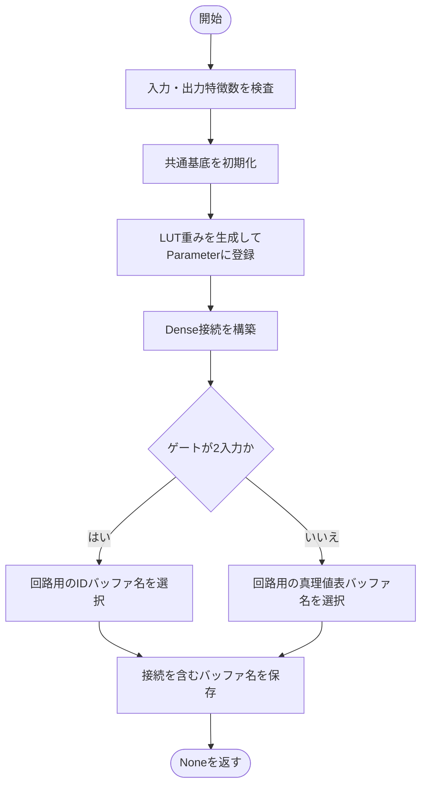
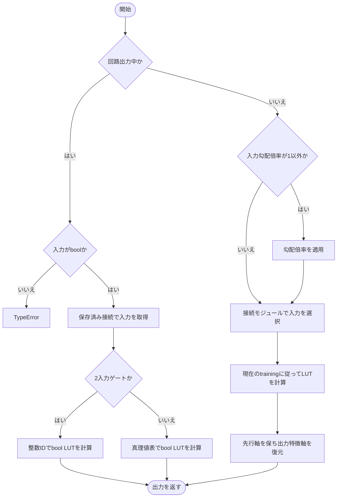
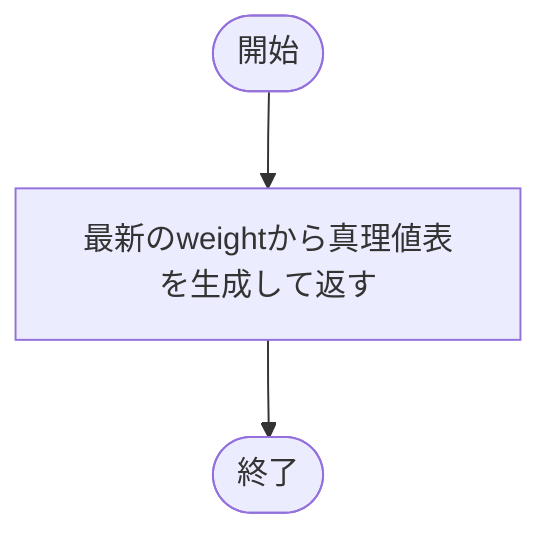
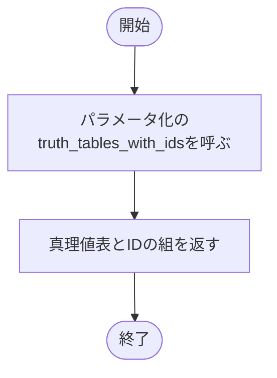
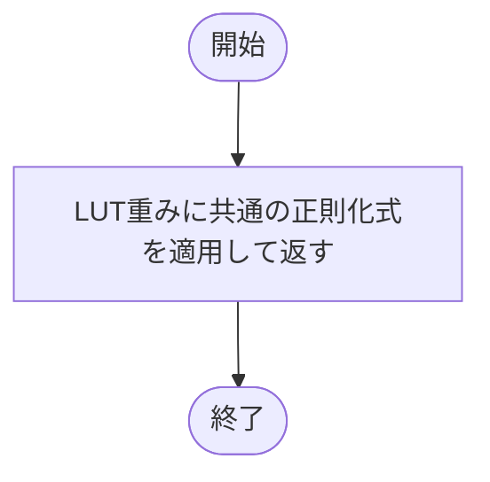
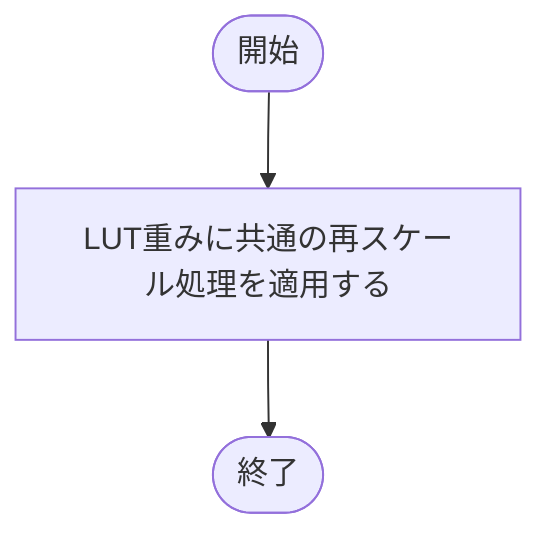
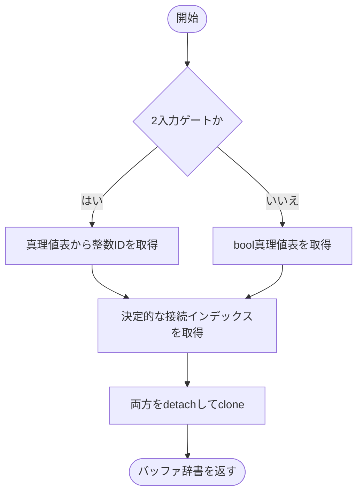
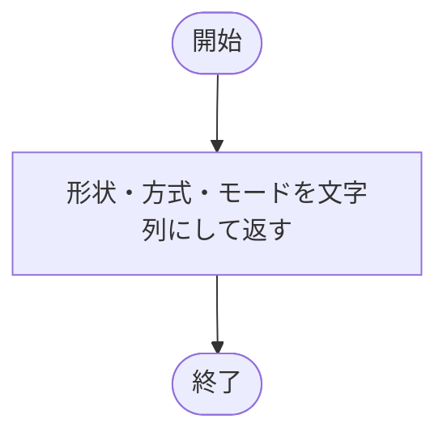

# dense.py

`utils/logicNN_core/src/logicnn_core/layers/dense.py`

末尾の特徴軸を論理ゲートで変換する全結合層です。固定接続と学習可能接続を共通に扱い、回路出力では固定した接続と真理値表だけを使います。

{/* source-sha256: a520ebd186f7545e7034abcb35ba17bf4cc59be929a9f32699ae2b0fefe65966 */}

## LogicDense {/* #logicdense-class */}

各出力特徴に1つのLUTを配置する論理全結合層。

継承元：`LogicLayer`

{/* function: LogicDense.__init__@26 */}

## LogicDense.\_\_init\_\_() {/* #logicdense-init */}

```python
def __init__(
    self,
    in_features: int,
    out_features: int,
    *,
    lut: LUTConfig = LUTConfig(),
    connections: ConnectionConfig = ConnectionConfig(),
    gradient_scale: float = 1.0,
    device: torch.device | str | None = None,
    dtype: torch.dtype | None = None,
) -> None:
```

### 機能概要

正の入力・出力特徴数を確認し、LUTの初期重みをParameterとして生成します。その重みと同じデバイスで接続を作り、入力本数に応じた回路用バッファ名を決めます。

### 引数

| 引数 | 型 | 既定値 | 説明 |
|---|---|---|---|
| `in_features` | `int` | `必須` | 入力の末尾の特徴数。 |
| `out_features` | `int` | `必須` | 出力特徴数、すなわちゲート数。 |
| `lut` | `LUTConfig` | `LUTConfig()` | ゲートの入力本数・LUT方式・初期化方法などを指定するLUTConfig。 |
| `connections` | `ConnectionConfig` | `ConnectionConfig()` | 入力接続の方式と初期化を指定するConnectionConfig。 |
| `gradient_scale` | `float` | `1.0` | 入力へ伝わる逆伝播の勾配倍率。順伝播の値は変えません。 |
| `device` | `torch.device \| str \| None` | `None` | 重みと接続を生成するデバイス。NoneはPyTorchの既定デバイス。 |
| `dtype` | `torch.dtype \| None` | `None` | LUT重みの浮動小数点型。NoneはPyTorchの既定dtype。 |

### 処理の流れ



### 戻り値

型：`None`

None。

### 状態の変更・ファイル出力

- 初期化方式に応じて乱数を消費し、重み・接続を生成します。

### ソースコード

<details>
<summary>LogicDense.\_\_init\_\_() の実装を開く</summary>

```python
def __init__(
    self,
    in_features: int,
    out_features: int,
    *,
    lut: LUTConfig = LUTConfig(),
    connections: ConnectionConfig = ConnectionConfig(),
    gradient_scale: float = 1.0,
    device: torch.device | str | None = None,
    dtype: torch.dtype | None = None,
) -> None:
    """LUTのParameterと接続moduleを、指定した特徴数・device・dtypeで生成する。"""
    _validate_positive_integer("in_features", in_features)
    _validate_positive_integer("out_features", out_features)
    super().__init__(lut=lut, connections=connections, gradient_scale=gradient_scale)
    self.in_features  = in_features
    self.out_features = out_features
    self.weight       = nn.Parameter(self.parametrization.initialize(out_features, device=device, dtype=dtype))
    self.connections  = build_dense_connections(in_features, out_features, num_inputs=self.num_inputs, config=connections,
                                                device=self.weight.device, dtype=self.weight.dtype)
    self._export_table_name   = "_export_lut_ids" if self.num_inputs == 2 else "_export_truth_tables"
    self._export_buffer_names = (self._export_table_name, "_export_indices")
```

</details>

{/* function: LogicDense.forward@49 */}

## LogicDense.forward() {/* #logicdense-forward */}

```python
def forward(self, inputs: Tensor) -> Tensor:
```

### 機能概要

通常実行では接続モジュールで入力を選び、LUT方式に従って計算します。回路出力では選択済みの接続とIDまたはbool真理値表を使い、学習用の重みを直接参照しません。

### 引数

| 引数 | 型 | 既定値 | 説明 |
|---|---|---|---|
| `inputs` | `Tensor` | `必須` | [..., in_features]のTensor。通常実行では連続値も扱い、回路出力時はboolが必要です。 |

### 処理の流れ



### 戻り値

型：`Tensor`

[..., out_features]のTensor。通常計算はLUT重みのdtype、回路計算はbool。

### ソースコード

<details>
<summary>LogicDense.forward() の実装を開く</summary>

```python
def forward(self, inputs: Tensor) -> Tensor:
    """元入力の精度を保って接続を選び、通常LUT計算または固定bool回路を適用する。"""
    if self.export_mode:
        if inputs.dtype != torch.bool:
            raise TypeError("export入力はbool Tensorで指定してください。必要な二値化を層の前で明示してください")
        selected = inputs[..., self._export_indices]
        if self.num_inputs == 2:
            return apply_export_luts(selected[..., 0, :], selected[..., 1, :], self._export_lut_ids)
        return apply_export_truth_tables(selected.unbind(-2), self._export_truth_tables)
    values   = scale_gradient(inputs, self.gradient_scale) if self.gradient_scale != 1.0 else inputs
    selected = self.connections(values)
    result   = self.parametrization(selected, self.weight, training=self.training, contraction="n,bn->bn")
    return result.reshape(*inputs.shape[:-1], self.out_features)
```

</details>

{/* function: LogicDense.truth_tables@63 */}

## LogicDense.truth\_tables() {/* #logicdense-truth-tables */}

```python
def truth_tables(self) -> Tensor:
```

### 機能概要

現在の重みをパラメータ化へ渡し、各出力ゲートの離散真理値表を取得します。回路用スナップショットではなく最新の重みが対象です。

### 引数

`self` 以外に指定する引数はありません。

### 処理の流れ



### 戻り値

型：`Tensor`

[out_features, 2**num_inputs]のbool Tensor。

### ソースコード

<details>
<summary>LogicDense.truth\_tables() の実装を開く</summary>

```python
def truth_tables(self) -> Tensor:
    """最新の重みから、出力ゲート順の独立したbool真理値表を生成する。"""
    return self.parametrization.truth_tables(self.weight)
```

</details>

{/* function: LogicDense.truth_tables_with_ids@67 */}

## LogicDense.truth\_tables\_with\_ids() {/* #logicdense-truth-tables-with-ids */}

```python
def truth_tables_with_ids(self) -> tuple[Tensor, Tensor | None]:
```

### 機能概要

最新の真理値表に加え、4入力以下では表の先頭を上位ビットとする整数IDも取得します。

### 引数

`self` 以外に指定する引数はありません。

### 処理の流れ



### 戻り値

型：`tuple[Tensor, Tensor \| None]`

bool表と整数IDの組。IDは[out_features]のint64で、6入力ではNone。

### ソースコード

<details>
<summary>LogicDense.truth\_tables\_with\_ids() の実装を開く</summary>

```python
def truth_tables_with_ids(self) -> tuple[Tensor, Tensor | None]:
    """最新のbool表とMSB-first整数IDを返し、高rankではIDをNoneにする。"""
    return self.parametrization.truth_tables_with_ids(self.weight)
```

</details>

{/* function: LogicDense.regularization_loss@71 */}

## LogicDense.regularization\_loss() {/* #logicdense-regularization-loss */}

```python
def regularization_loss(self, kind: str | None = None) -> Tensor:
```

### 機能概要

LUT重みだけを共通の正則化関数へ渡し、ゲートごとのペナルティの平均を返します。接続のlogitは含めません。

### 引数

| 引数 | 型 | 既定値 | 説明 |
|---|---|---|---|
| `kind` | `str \| None` | `None` | None、L2、abs_sum。Noneは重みと勾配経路のつながった0。 |

### 処理の流れ



### 戻り値

型：`Tensor`

重みと同じdtype・deviceのスカラーTensor。

### ソースコード

<details>
<summary>LogicDense.regularization\_loss() の実装を開く</summary>

```python
def regularization_loss(self, kind: str | None = None) -> Tensor:
    """接続logitとは分けて、LUT重みのゲート平均正則化を返す。"""
    return regularization_loss(self.weight, kind)
```

</details>

{/* function: LogicDense.rescale_weights_@75 */}

## LogicDense.rescale\_weights\_() {/* #logicdense-rescale-weights */}

```python
def rescale_weights_(self, method: str | None = None) -> None:
```

### 機能概要

LUTのParameterを置き換えず、共通関数で係数を再スケールします。接続パラメータには触れません。

### 引数

| 引数 | 型 | 既定値 | 説明 |
|---|---|---|---|
| `method` | `str \| None` | `None` | None、clip、L2、abs_sum。Noneなら変更しません。 |

### 処理の流れ



### 戻り値

型：`None`

None。

### 状態の変更・ファイル出力

- methodがNone以外ならweightをin-place更新します。既存のgradは変更しません。

### ソースコード

<details>
<summary>LogicDense.rescale\_weights\_() の実装を開く</summary>

```python
def rescale_weights_(self, method: str | None = None) -> None:
    """LUT重みのParameterを維持したまま再スケールし、接続logitは変更しない。"""
    rescale_weights_(self.weight, method)
```

</details>

{/* function: LogicDense._make_export_buffers@79 */}

## LogicDense.\_make\_export\_buffers() {/* #logicdense-make-export-buffers */}

```python
def _make_export_buffers(self) -> dict[str, Tensor]:
```

### 機能概要

最新の離散LUTと決定的な接続インデックスを取得し、学習状態から切り離したコピーを作ります。

### 引数

`self` 以外に指定する引数はありません。

### 処理の流れ



### 戻り値

型：`dict[str, Tensor]`

回路用テーブル名と_export_indicesをキーとするTensor辞書。

### ソースコード

<details>
<summary>LogicDense.\_make\_export\_buffers() の実装を開く</summary>

```python
def _make_export_buffers(self) -> dict[str, Tensor]:
    """2入力は整数ID、それ以外はbool表として、決定的な接続と一緒に独立保存する。"""
    values  = self.truth_tables_with_ids()[1] if self.num_inputs == 2 else self.truth_tables()
    indices = self.connections.get_indices()
    return {self._export_table_name: values.detach().clone(), "_export_indices": indices.detach().clone()}
```

</details>

{/* function: LogicDense.extra_repr@85 */}

## LogicDense.extra\_repr() {/* #logicdense-extra-repr */}

```python
def extra_repr(self) -> str:
```

### 機能概要

nn.Moduleの表示用に、入出力特徴数、入力本数、LUT・接続方式、回路出力状態を文字列にまとめます。

### 引数

`self` 以外に指定する引数はありません。

### 処理の流れ



### 戻り値

型：`str`

層の設定を表す文字列。

### ソースコード

<details>
<summary>LogicDense.extra\_repr() の実装を開く</summary>

```python
def extra_repr(self) -> str:
    """特徴数・LUT方式・接続方式と回路出力状態を簡潔に表示する。"""
    return (f"in_features={self.in_features}, out_features={self.out_features}, num_inputs={self.num_inputs}, "
            f"lut={self.lut_config.kind}, connections={self.connection_config.kind}, export_mode={self.export_mode}")
```

</details>

## 関連ファイル

- [utils/logicNN_core/src/logicnn_core/connections/\_\_init\_\_.py](/code-reference/utils/logicNN_core/src/logicnn_core/connections/__init__)
- [utils/logicNN_core/src/logicnn_core/functional/logic.py](/code-reference/utils/logicNN_core/src/logicnn_core/functional/logic)
- [utils/logicNN_core/src/logicnn_core/functional/regularization.py](/code-reference/utils/logicNN_core/src/logicnn_core/functional/regularization)
- [utils/logicNN_core/src/logicnn_core/functional/sampling.py](/code-reference/utils/logicNN_core/src/logicnn_core/functional/sampling)
- [utils/logicNN_core/src/logicnn_core/layer_settings.py](/code-reference/utils/logicNN_core/src/logicnn_core/layer_settings)
- [utils/logicNN_core/src/logicnn_core/layers/base.py](/code-reference/utils/logicNN_core/src/logicnn_core/layers/base)
