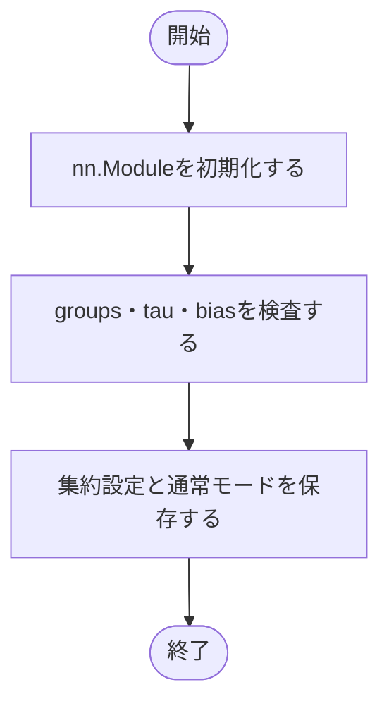
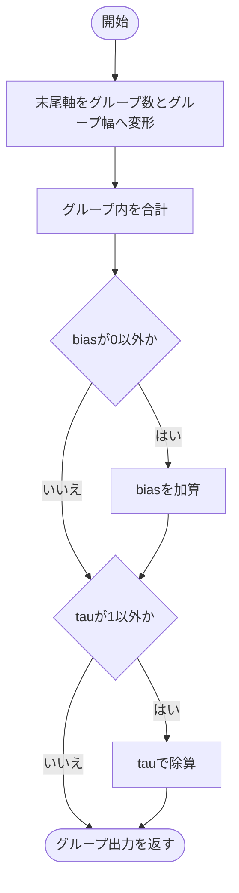
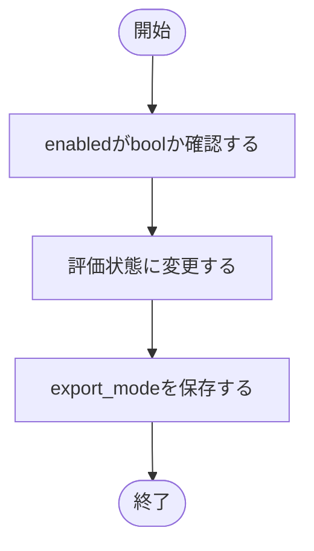
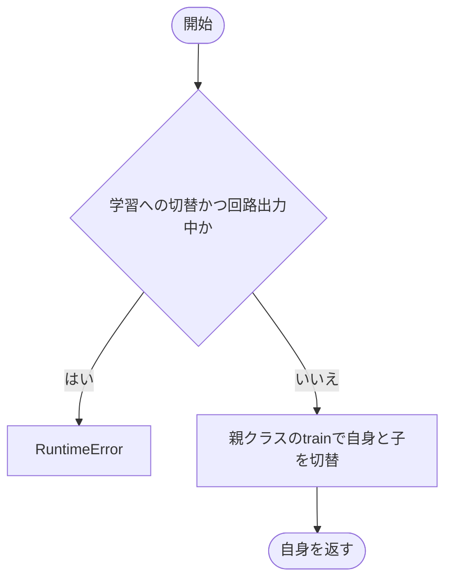

# group_sum.py

`utils/logicNN_core/src/logicnn_core/layers/group_sum.py`

末尾の特徴を連続する同サイズのグループへ分け、グループごとの和を計算します。分類モデルでは各クラスのスコア集約に使います。

{/* source-sha256: b35504b8a9ceea567bc3a3612a190c43467e50bc63990077e372e7dbaa3384d6 */}

## GroupSum {/* #groupsum-class */}

学習パラメータを持たない連続グループ集約層。

継承元：`nn.Module`

{/* function: GroupSum.__init__@17 */}

## GroupSum.\_\_init\_\_() {/* #groupsum-init */}

```python
def __init__(self, groups: int, *, tau: float = 1.0, bias: float = 0.0) -> None:
```

### 機能概要

正のグループ数・正の温度・有限のbiasを確認し、通常実行の集約層を初期化します。

### 引数

| 引数 | 型 | 既定値 | 説明 |
|---|---|---|---|
| `groups` | `int` | `必須` | 末尾特徴軸を分割するグループ数。 |
| `tau` | `float` | `1.0` | 集約後の除数。正の有限値。 |
| `bias` | `float` | `0.0` | 各グループの和に加える有限の実数。 |

### 処理の流れ



### 戻り値

型：`None`

None。

### ソースコード

<details>
<summary>GroupSum.\_\_init\_\_() の実装を開く</summary>

```python
def __init__(self, groups: int, *, tau: float = 1.0, bias: float = 0.0) -> None:
    """group数と有限なbias・正のtauを検証して集約層を作る。"""
    super().__init__()
    _validate_positive_integer("groups", groups)
    _validate_positive_number("tau", tau)
    _validate_finite_number("bias", bias)
    self.groups      = groups
    self.tau         = float(tau)
    self.bias        = float(bias)
    self.export_mode = False
```

</details>

{/* function: GroupSum.forward@28 */}

## GroupSum.forward() {/* #groupsum-forward */}

```python
def forward(self, inputs: Tensor) -> Tensor:
```

### 機能概要

末尾特徴軸を[groups, グループ内の特徴数]へ変形して和を取り、biasが0以外なら加算、tauが1以外なら除算します。既定値では不要な浮動小数点演算を加えません。

### 引数

| 引数 | 型 | 既定値 | 説明 |
|---|---|---|---|
| `inputs` | `Tensor` | `必須` | [..., features]のTensor。featuresはgroupsで割り切れる必要があります。 |

### 処理の流れ



### 戻り値

型：`Tensor`

[..., groups]のTensor。dtypeはPyTorchのsumと条件付き加算・除算に従います。

### 例外・注意事項

- 回路出力モードでもGroupSum自体は同じ集約式です。bool入力のsumは整数になります。

### ソースコード

<details>
<summary>GroupSum.forward() の実装を開く</summary>

```python
def forward(self, inputs: Tensor) -> Tensor:
    """各groupの和に非既定biasとtauだけを適用し、Torchのdtype演算を保つ。"""
    shape  = (*inputs.shape[:-1], self.groups, inputs.shape[-1] // self.groups)
    result = inputs.reshape(shape).sum(-1)
    if self.bias != 0:
        result = result + self.bias
    if self.tau != 1:
        result = result / self.tau
    return result
```

</details>

{/* function: GroupSum.set_export_mode@38 */}

## GroupSum.set\_export\_mode() {/* #groupsum-set-export-mode */}

```python
def set_export_mode(self, enabled: bool = True) -> None:
```

### 機能概要

計算式を変更せず、評価状態へ移して回路出力フラグを設定します。

### 引数

| 引数 | 型 | 既定値 | 説明 |
|---|---|---|---|
| `enabled` | `bool` | `True` | Trueで回路出力を有効化、Falseで解除。 |

### 処理の流れ



### 戻り値

型：`None`

None。

### 状態の変更・ファイル出力

- trainingとexport_modeを更新します。

### ソースコード

<details>
<summary>GroupSum.set\_export\_mode() の実装を開く</summary>

```python
def set_export_mode(self, enabled: bool = True) -> None:
    """集約計算を変えずに回路出力状態を切り替え、評価状態へ移る。"""
    _validate_boolean("enabled", enabled)
    self.eval()
    self.export_mode = enabled
```

</details>

{/* function: GroupSum.train@44 */}

## GroupSum.train() {/* #groupsum-train */}

```python
def train(self, mode: bool = True) -> GroupSum:
```

### 機能概要

回路出力中の学習切替を禁止し、それ以外は標準のモード切替を実行します。

### 引数

| 引数 | 型 | 既定値 | 説明 |
|---|---|---|---|
| `mode` | `bool` | `True` | Trueで学習状態、Falseで評価状態。 |

### 処理の流れ



### 戻り値

型：`GroupSum`

この層自身。

### ソースコード

<details>
<summary>GroupSum.train() の実装を開く</summary>

```python
def train(self, mode: bool = True) -> GroupSum:
    """回路出力モードの明示解除前に学習へ戻る操作を拒否する。"""
    if mode and self.export_mode:
        raise RuntimeError("回路出力中は学習できません。先にset_export_mode(False)で明示解除してからtrain()を呼んでください")
    return super().train(mode)
```

</details>

## 関連ファイル

- [utils/logicNN_core/src/logicnn_core/layer_settings.py](/code-reference/utils/logicNN_core/src/logicnn_core/layer_settings)
