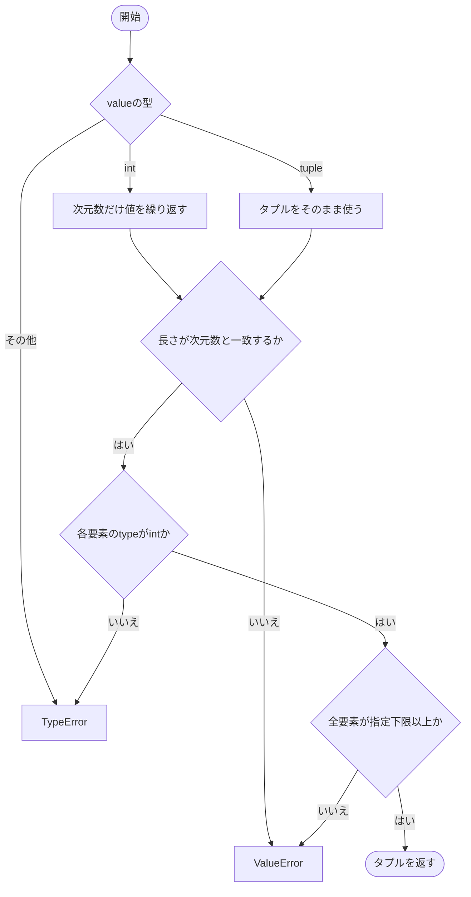
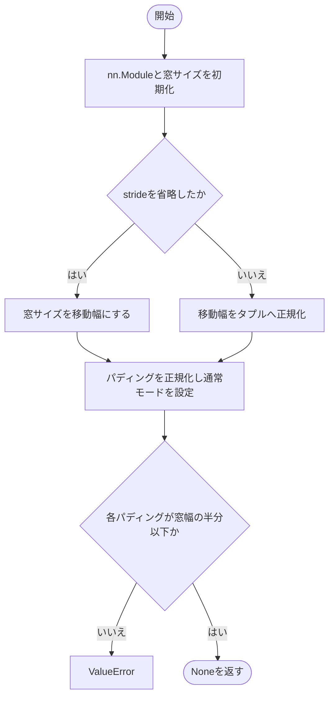
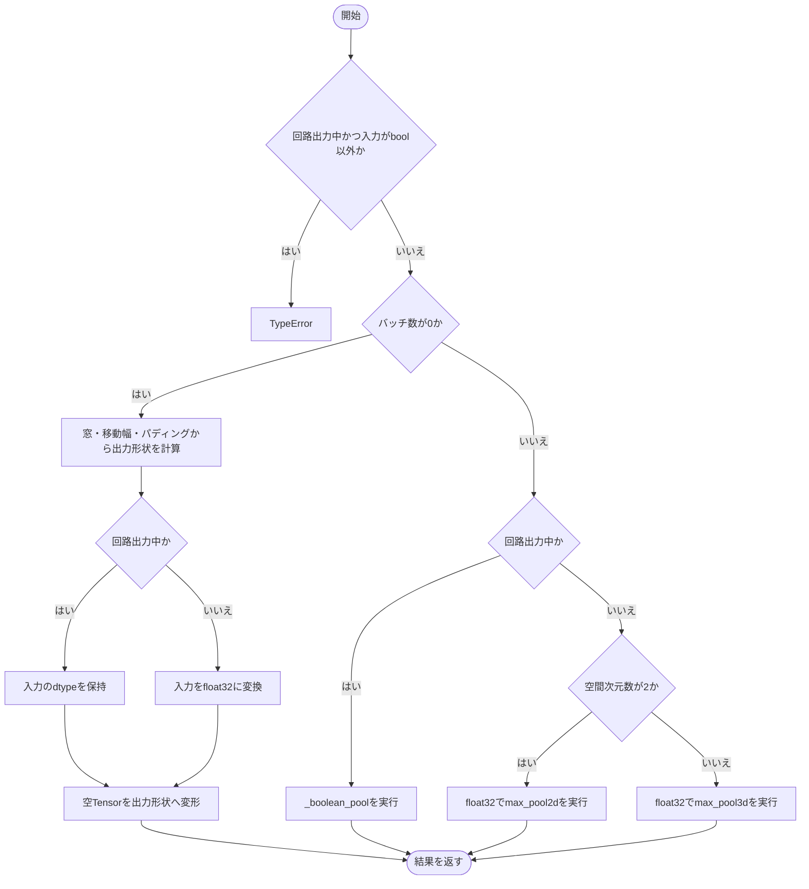
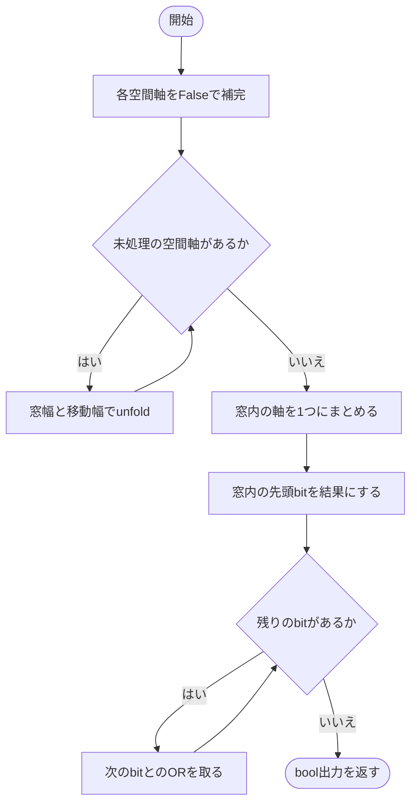
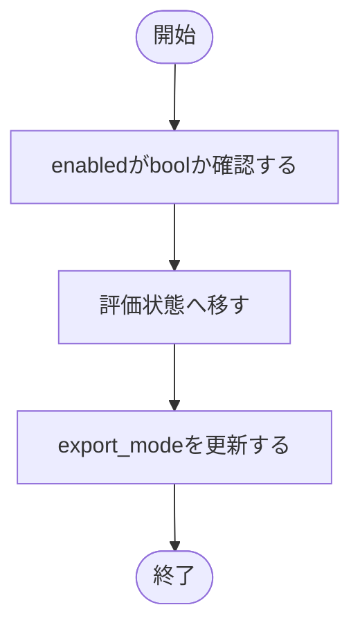
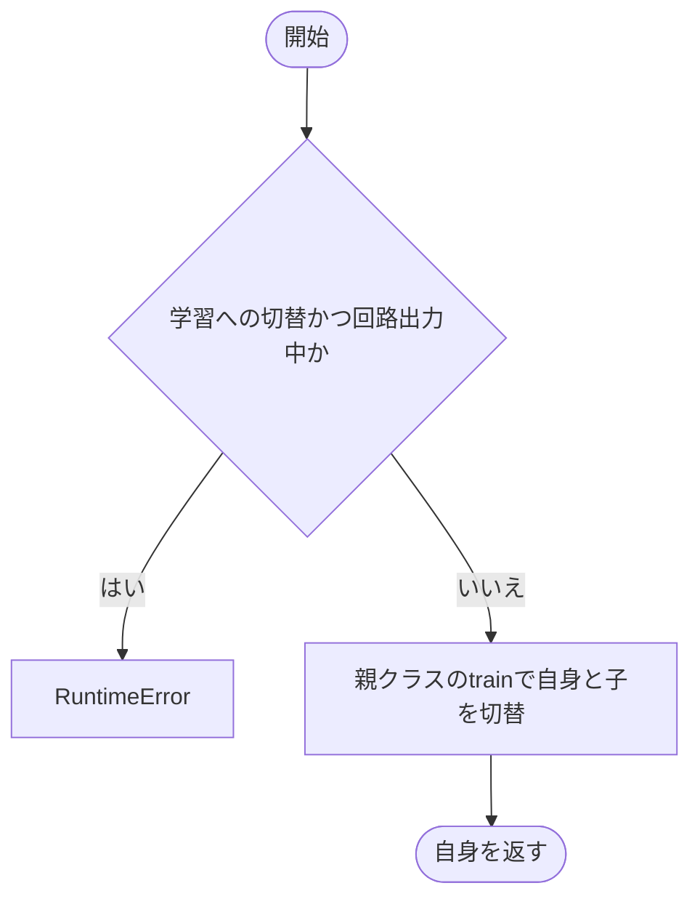

# pooling.py

`utils/logicNN_core/src/logicnn_core/layers/pooling.py`

通常実行ではfloat32の最大値プーリングを行い、回路出力では窓内のbool値をORで集約します。2Dと3Dは空間次元数だけを切り替えて同じ実装を共有します。

{/* source-sha256: 05bda4453fc7c43a5077ac0ef30b050559a88a94e068185f228b2b63eb6a47e2 */}

{/* function: _spatial_tuple@18 */}

## \_spatial\_tuple() {/* #spatial-tuple */}

```python
def _spatial_tuple(name: str, value: int | tuple[int, ...], dimensions: int, *, allow_zero: bool = False) -> tuple[int, ...]:
```

### 機能概要

単一の整数は空間次元数だけ繰り返し、タプルはそのまま使います。長さ、Python整数であること、0を許すかに応じた下限を確認します。

### 引数

| 引数 | 型 | 既定値 | 説明 |
|---|---|---|---|
| `name` | `str` | `必須` | エラー表示用の設定名。 |
| `value` | `int \| tuple[int, ...]` | `必須` | 整数または空間軸ごとの整数タプル。 |
| `dimensions` | `int` | `必須` | 空間次元数。 |
| `allow_zero` | `bool` | `False` | Trueでは各値の下限を0、Falseでは1とします。 |

### 処理の流れ



### 戻り値

型：`tuple[int, ...]`

dimensions個の整数タプル。

### ソースコード

<details>
<summary>\_spatial\_tuple() の実装を開く</summary>

```python
def _spatial_tuple(name: str, value: int | tuple[int, ...], dimensions: int, *, allow_zero: bool = False) -> tuple[int, ...]:
    """空間設定を次元数に合う整数tupleへそろえ、各値の下限を確認する。"""
    if type(value) is int:
        values = (value,) * dimensions
    elif isinstance(value, tuple):
        values = value
    else:
        raise TypeError(f"{name} はboolではない整数または整数tupleで指定してください")
    if len(values) != dimensions:
        raise ValueError(f"{name} のtupleには {dimensions} 個の値が必要です")
    if any(type(item) is not int for item in values):
        raise TypeError(f"{name} の各値はboolではない整数で指定してください")
    if any(item < (0 if allow_zero else 1) for item in values):
        raise ValueError(f"{name} の各値は {'0以上' if allow_zero else '0より大きい'}整数で指定してください")
    return values
```

</details>

## \_OrPooling {/* #orpooling-class */}

2D・3Dの設定正規化と、通常・boolのプーリングを実装する内部基底。

継承元：`nn.Module`

| 属性 | 型 | 既定値 | 説明 |
|---|---|---|---|
| `_dimensions` | `int` | `必須` | 派生クラスが指定する空間次元数。 |

{/* function: _OrPooling.__init__@40 */}

## \_OrPooling.\_\_init\_\_() {/* #orpooling-init */}

```python
def __init__(self, kernel_size: int | tuple[int, ...], stride: int | tuple[int, ...] | None = None, padding: int | tuple[int, ...] = 0) -> None:
```

### 機能概要

窓・移動幅・パディングを空間軸ごとのタプルへ統一します。strideを省略した場合は窓サイズを使い、各パディングが窓サイズの半分以下か確認します。

### 引数

| 引数 | 型 | 既定値 | 説明 |
|---|---|---|---|
| `kernel_size` | `int \| tuple[int, ...]` | `必須` | 窓サイズ。整数または軸ごとのタプル。 |
| `stride` | `int \| tuple[int, ...] \| None` | `None` | 窓の移動幅。Noneならkernel_sizeと同じ。 |
| `padding` | `int \| tuple[int, ...]` | `0` | 各空間軸の両端へ追加する幅。 |

### 処理の流れ



### 戻り値

型：`None`

None。

### ソースコード

<details>
<summary>\_OrPooling.\_\_init\_\_() の実装を開く</summary>

```python
def __init__(self, kernel_size: int | tuple[int, ...], stride: int | tuple[int, ...] | None = None, padding: int | tuple[int, ...] = 0) -> None:
    """窓・移動幅・paddingを検証し、通常モードのpooling層を作る。"""
    super().__init__()
    self.kernel_size = _spatial_tuple("kernel_size", kernel_size, self._dimensions)
    self.stride      = self.kernel_size if stride is None else _spatial_tuple("stride", stride, self._dimensions)
    self.padding     = _spatial_tuple("padding", padding, self._dimensions, allow_zero=True)
    self.export_mode = False
    if any(pad > width // 2 for pad, width in zip(self.padding, self.kernel_size)):
        raise ValueError("padding は各次元のkernel_size // 2以下で指定してください")
```

</details>

{/* function: _OrPooling.forward@50 */}

## \_OrPooling.forward() {/* #orpooling-forward */}

```python
def forward(self, inputs: Tensor) -> Tensor:
```

### 機能概要

空バッチは出力形状だけを計算して返します。それ以外は通常実行でfloat32のmax_pool2d/3d、回路出力でbool ORの専用実装を選びます。

### 引数

| 引数 | 型 | 既定値 | 説明 |
|---|---|---|---|
| `inputs` | `Tensor` | `必須` | [batch, channels, *spatial]のTensor。回路出力時はbool。 |

### 処理の流れ



### 戻り値

型：`Tensor`

プーリング後のTensor。通常はfloat32、回路出力はbool。

### ソースコード

<details>
<summary>\_OrPooling.forward() の実装を開く</summary>

```python
def forward(self, inputs: Tensor) -> Tensor:
    """通常はfloat32 max、回路出力中はboolの窓内ORを計算する。"""
    if self.export_mode and inputs.dtype != torch.bool:
        raise TypeError("回路出力モードのpooling入力はbool Tensorで指定してください")
    if inputs.shape[0] == 0:
        output_shape = tuple((size + 2 * pad - width) // step + 1 for size, pad, width, step
                             in zip(inputs.shape[2:], self.padding, self.kernel_size, self.stride))
        values = inputs if self.export_mode else inputs.float()
        return values.reshape(0, inputs.shape[1], *output_shape)
    if self.export_mode:
        return self._boolean_pool(inputs)
    pool = torch_functional.max_pool2d if self._dimensions == 2 else torch_functional.max_pool3d
    return pool(inputs.float(), self.kernel_size, self.stride, self.padding)
```

</details>

{/* function: _OrPooling._boolean_pool@64 */}

## \_OrPooling.\_boolean\_pool() {/* #orpooling-boolean-pool */}

```python
def _boolean_pool(self, inputs: Tensor) -> Tensor:
```

### 機能概要

入力の両端をFalseで補完し、各空間軸をunfoldして窓を取り出します。窓内の軸を1つへまとめ、最初のbitから順にORを取ります。

### 引数

| 引数 | 型 | 既定値 | 説明 |
|---|---|---|---|
| `inputs` | `Tensor` | `必須` | 空でないバッチのbool Tensor。 |

### 処理の流れ



### 戻り値

型：`Tensor`

窓ごとにORで集約したbool Tensor。

### ソースコード

<details>
<summary>\_OrPooling.\_boolean\_pool() の実装を開く</summary>

```python
def _boolean_pool(self, inputs: Tensor) -> Tensor:
    """Falseでpaddingした窓を展開し、bit単位ORだけで集約する。"""
    padding = tuple(size for width in reversed(self.padding) for size in (width, width))
    values  = torch_functional.pad(inputs, padding, value=False)
    for axis, (width, step) in enumerate(zip(self.kernel_size, self.stride), start=2):
        values = values.unfold(axis, width, step)
    windows = values.flatten(start_dim=self._dimensions + 2)
    result  = windows[..., 0]
    for index in range(1, math.prod(self.kernel_size)):
        result = result | windows[..., index]
    return result
```

</details>

{/* function: _OrPooling.set_export_mode@76 */}

## \_OrPooling.set\_export\_mode() {/* #orpooling-set-export-mode */}

```python
def set_export_mode(self, enabled: bool = True) -> None:
```

### 機能概要

評価状態へ移し、bool ORを使うかを切り替えます。解除後も評価状態を維持します。

### 引数

| 引数 | 型 | 既定値 | 説明 |
|---|---|---|---|
| `enabled` | `bool` | `True` | Trueで回路出力を有効化、Falseで解除。 |

### 処理の流れ



### 戻り値

型：`None`

None。

### ソースコード

<details>
<summary>\_OrPooling.set\_export\_mode() の実装を開く</summary>

```python
def set_export_mode(self, enabled: bool = True) -> None:
    """回路出力モードを切り替え、解除した場合も評価状態を維持する。"""
    _validate_boolean("enabled", enabled)
    self.eval()
    self.export_mode = enabled
```

</details>

{/* function: _OrPooling.train@82 */}

## \_OrPooling.train() {/* #orpooling-train */}

```python
def train(self, mode: bool = True) -> _OrPooling:
```

### 機能概要

回路出力を解除せず学習へ戻る操作を拒否し、それ以外は標準のモード切替を実行します。

### 引数

| 引数 | 型 | 既定値 | 説明 |
|---|---|---|---|
| `mode` | `bool` | `True` | Trueで学習状態、Falseで評価状態。 |

### 処理の流れ



### 戻り値

型：`_OrPooling`

この層自身。

### ソースコード

<details>
<summary>\_OrPooling.train() の実装を開く</summary>

```python
def train(self, mode: bool = True) -> _OrPooling:
    """回路出力モードの明示解除前に学習へ戻る操作を拒否する。"""
    if mode and self.export_mode:
        raise RuntimeError("回路出力中は学習できません。先にset_export_mode(False)で明示解除してからtrain()を呼んでください")
    return super().train(mode)
```

</details>

## OrPooling2d {/* #orpooling2d-class */}

[batch, channels, height, width]を集約する2Dプーリング層。

継承元：`_OrPooling`

このクラスには独自の関数実装はありません。

<details>
<summary>OrPooling2d の定義を開く</summary>

```python
class OrPooling2d(_OrPooling):
    """2次元の空間窓を通常maxまたは回路用ORで集約する。"""

    _dimensions = 2
```

</details>

## OrPooling3d {/* #orpooling3d-class */}

[batch, channels, depth, height, width]を集約する3Dプーリング層。

継承元：`_OrPooling`

このクラスには独自の関数実装はありません。

<details>
<summary>OrPooling3d の定義を開く</summary>

```python
class OrPooling3d(_OrPooling):
    """3次元の空間窓を通常maxまたは回路用ORで集約する。"""

    _dimensions = 3
```

</details>

## 関連ファイル

- [utils/logicNN_core/src/logicnn_core/layer_settings.py](/code-reference/utils/logicNN_core/src/logicnn_core/layer_settings)
