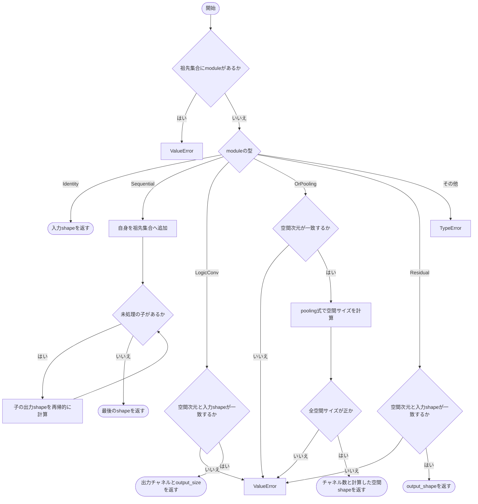
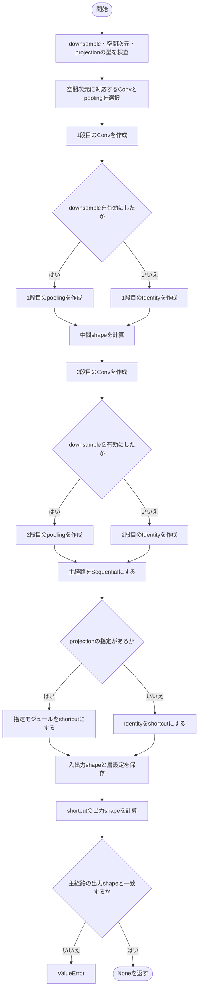
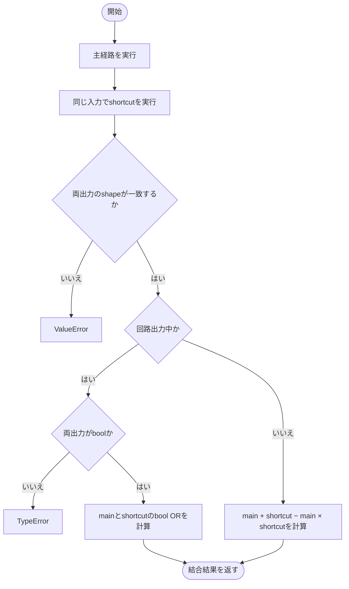
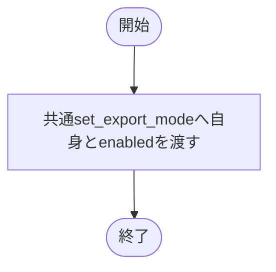
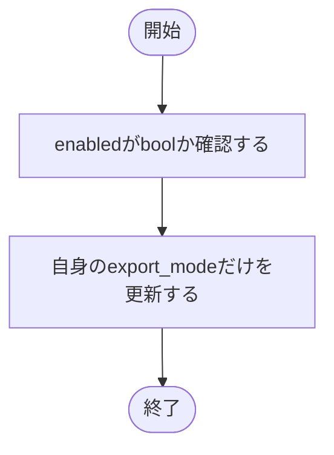
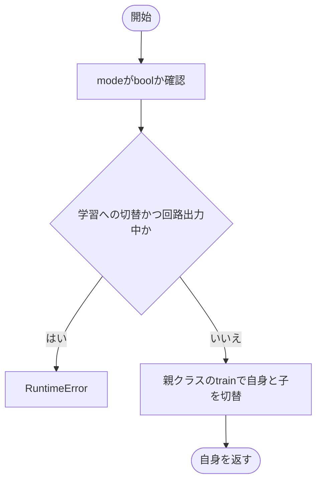
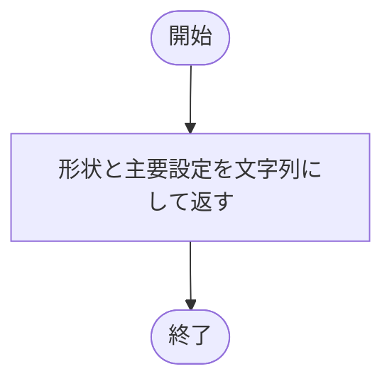

# residual.py

`utils/logicNN_core/src/logicnn_core/modules/residual.py`

2つの論理Convからなる主経路と、利用者が指定するshortcutをORで結合します。構築時に既知の層のメタデータから形状を計算し、不要な試行forwardを行わず両経路を確認します。

{/* source-sha256: a4fe81d17c769300502cbebc6701332b0d68f05511dccb13e09e517f6c72c225 */}

{/* function: _output_shape@21 */}

## \_output\_shape() {/* #output-shape */}

```python
def _output_shape(module: nn.Module, shape: tuple[int, ...], dimensions: int, ancestors: frozenset[int] = frozenset()) -> tuple[int, ...]:
```

### 機能概要

Identity・Sequential・論理Conv・OR pooling・Residualの既知メタデータから、入力に対応する出力形状を求めます。Sequentialは子を順にたどり、祖先オブジェクトの再登場を循環参照として拒否します。

### 引数

| 引数 | 型 | 既定値 | 説明 |
|---|---|---|---|
| `module` | `nn.Module` | `必須` | 形状を調べる既知のnn.Module。型は完全一致で判定します。 |
| `shape` | `tuple[int, ...]` | `必須` | バッチを除いた入力の[channels, *spatial]を表すタプル。 |
| `dimensions` | `int` | `必須` | Residual全体の空間次元数。 |
| `ancestors` | `frozenset[int]` | `frozenset()` | 再帰探索中の祖先モジュールのid集合。循環検出に使います。 |

### 処理の流れ



### 戻り値

型：`tuple[int, ...]`

バッチを除く出力形状のタプル。

### 例外・注意事項

- 未知の層や派生型を試行実行して形状を推定する処理はありません。

### ソースコード

<details>
<summary>\_output\_shape() の実装を開く</summary>

```python
def _output_shape(module: nn.Module, shape: tuple[int, ...], dimensions: int, ancestors: frozenset[int] = frozenset()) -> tuple[int, ...]:
    """既知moduleのmetadataだけでchannel・空間shapeを追跡し、dummy forwardを避ける。"""
    if id(module) in ancestors:
        raise ValueError("projectionに循環参照を含めることはできません")
    if type(module) is nn.Identity:
        return shape
    if type(module) is nn.Sequential:
        ancestors = ancestors | {id(module)}
        for child in module:
            shape = _output_shape(child, shape, dimensions, ancestors)
        return shape
    if type(module) in (LogicConv2d, LogicConv3d):
        if module.conv_dimension != dimensions or shape != (module.in_channels, *module.input_size):
            raise ValueError("projectionのLogicConv入力shape・空間次元が直前の出力と一致しません")
        return (module.out_channels, *module.output_size)
    if type(module) in (OrPooling2d, OrPooling3d):
        expected_dimensions = 2 if type(module) is OrPooling2d else 3
        if expected_dimensions != dimensions:
            raise ValueError("projectionのOR poolingの空間次元がResidualと一致しません")
        spatial = tuple((size + 2 * pad - width) // step + 1 for size, pad, width, step in zip(shape[1:], module.padding, module.kernel_size, module.stride))
        if any(size <= 0 for size in spatial):
            raise ValueError("projectionのOR poolingから得られる出力shapeは正の空間サイズが必要です")
        return (shape[0], *spatial)
    if type(module) is ResidualLogicBlock:
        if module.conv_dimension != dimensions or module.input_shape != shape:
            raise ValueError("projectionのResidual入力shape・空間次元が直前の出力と一致しません")
        return module.output_shape
    raise TypeError(f"projectionの静的shape検証で未対応のmoduleです: {type(module).__name__}。既知の論理Conv・OR pooling・Identity・Sequentialを使用してください")
```

</details>

## ResidualLogicBlock {/* #residuallogicblock-class */}

通常はa+b−ab、回路出力ではbool ORで2つの経路を結ぶ残差ブロック。形状調整用projectionは明示指定します。

継承元：`nn.Module`

{/* function: ResidualLogicBlock.__init__@54 */}

## ResidualLogicBlock.\_\_init\_\_() {/* #residuallogicblock-init */}

```python
def __init__(
    self,
    input_size: int | tuple[int, ...],
    in_channels: int,
    out_channels: int,
    *,
    tree_depth: int = 3,
    kernel_size: int | tuple[int, ...] = 3,
    padding: int | tuple[int, ...] = 1,
    downsample: bool = False,
    conv_dimension: int = 2,
    projection: nn.Module | None = None,
    lut: LUTConfig = LUTConfig(),
    connections: ConnectionConfig = ConnectionConfig(),
    gradient_scale: float = 1.0,
    device: torch.device | str | None = None,
    dtype: torch.dtype | None = None,
) -> None:
```

### 機能概要

空間次元に応じたConvとpoolingを選び、主経路を2段のConvで構築します。downsampleでは両方のConv直後で縮小します。shortcutは指定projectionまたはIdentityとし、静的に計算した出力形状の一致を確認します。

### 引数

| 引数 | 型 | 既定値 | 説明 |
|---|---|---|---|
| `input_size` | `int \| tuple[int, ...]` | `必須` | 入力の空間サイズ。整数または軸ごとのタプル。 |
| `in_channels` | `int` | `必須` | 入力チャネル数。 |
| `out_channels` | `int` | `必須` | 主経路のConv出力チャネル数。 |
| `tree_depth` | `int` | `3` | 各Conv内の論理木の深さ。 |
| `kernel_size` | `int \| tuple[int, ...]` | `3` | 各Convの受容野サイズ。 |
| `padding` | `int \| tuple[int, ...]` | `1` | 各Convのパディング幅。 |
| `downsample` | `bool` | `False` | Trueなら各Convの直後に窓2・stride2のpoolingを追加。 |
| `conv_dimension` | `int` | `2` | 空間次元数。2または3。 |
| `projection` | `nn.Module \| None` | `None` | shortcut側の形状調整用モジュール。NoneではIdentity。 |
| `lut` | `LUTConfig` | `LUTConfig()` | ゲートの入力本数・LUT方式・初期化方法などを指定するLUTConfig。 |
| `connections` | `ConnectionConfig` | `ConnectionConfig()` | 入力接続の方式と初期化を指定するConnectionConfig。 |
| `gradient_scale` | `float` | `1.0` | 入力へ伝わる逆伝播の勾配倍率。順伝播の値は変えません。 |
| `device` | `torch.device \| str \| None` | `None` | 重みと接続を生成するデバイス。NoneはPyTorchの既定デバイス。 |
| `dtype` | `torch.dtype \| None` | `None` | LUT重みの浮動小数点型。NoneはPyTorchの既定dtype。 |

### 処理の流れ



### 戻り値

型：`None`

None。

### 状態の変更・ファイル出力

- 主経路の重みと接続を初期化し、乱数を消費します。指定projectionは複製せず子として保持します。

### 例外・注意事項

- projectionを自動生成する機能はありません。downsample=Trueでは通常2回の縮小が入るため、その出力へ一致するprojectionが必要です。

### ソースコード

<details>
<summary>ResidualLogicBlock.\_\_init\_\_() の実装を開く</summary>

```python
def __init__(
    self,
    input_size: int | tuple[int, ...],
    in_channels: int,
    out_channels: int,
    *,
    tree_depth: int = 3,
    kernel_size: int | tuple[int, ...] = 3,
    padding: int | tuple[int, ...] = 1,
    downsample: bool = False,
    conv_dimension: int = 2,
    projection: nn.Module | None = None,
    lut: LUTConfig = LUTConfig(),
    connections: ConnectionConfig = ConnectionConfig(),
    gradient_scale: float = 1.0,
    device: torch.device | str | None = None,
    dtype: torch.dtype | None = None,
) -> None:
    """実際のConv・pool公式で両経路のshapeを確定し、自動projectionなしで整合を検証する。"""
    super().__init__()
    _validate_boolean("downsample", downsample)
    if type(conv_dimension) is not int:
        raise TypeError("conv_dimension はboolではないPython整数で指定してください")
    if conv_dimension not in (2, 3):
        raise ValueError("conv_dimension は2または3で指定してください")
    if projection is not None and not isinstance(projection, nn.Module):
        raise TypeError("projection はnn.ModuleまたはNoneで指定してください")
    conv   = LogicConv2d if conv_dimension == 2 else LogicConv3d
    pool   = OrPooling2d if conv_dimension == 2 else OrPooling3d
    first  = conv(input_size, in_channels, out_channels, tree_depth, kernel_size, padding=padding, lut=lut, connections=connections,
                  gradient_scale=gradient_scale, device=device, dtype=dtype)
    pool_1 = pool(2, 2) if downsample else nn.Identity()
    middle = _output_shape(pool_1, (out_channels, *first.output_size), conv_dimension)
    second = conv(middle[1:], out_channels, out_channels, tree_depth, kernel_size, padding=padding, lut=lut, connections=connections,
                  gradient_scale=gradient_scale, device=device, dtype=dtype)
    pool_2 = pool(2, 2) if downsample else nn.Identity()
    self.main              = nn.Sequential(first, pool_1, second, pool_2)
    self.shortcut          = nn.Identity() if projection is None else projection
    self.input_size        = first.input_size
    self.input_shape       = (in_channels, *self.input_size)
    self.output_shape      = _output_shape(pool_2, (out_channels, *second.output_size), conv_dimension)
    self.output_size       = self.output_shape[1:]
    self.in_channels       = in_channels
    self.out_channels      = out_channels
    self.tree_depth        = tree_depth
    self.kernel_size       = first.kernel_size
    self.padding           = first.padding
    self.downsample        = downsample
    self.conv_dimension    = conv_dimension
    self.lut_config        = first.lut_config
    self.connection_config = first.connection_config
    self.gradient_scale    = first.gradient_scale
    self.export_mode       = False
    shortcut_shape         = _output_shape(self.shortcut, self.input_shape, conv_dimension)
    if shortcut_shape != self.output_shape:
        raise ValueError(f"mainの出力shape {self.output_shape} とskipのshape {shortcut_shape} が異なります。一致するprojectionを明示してください")
```

</details>

{/* function: ResidualLogicBlock.forward@111 */}

## ResidualLogicBlock.forward() {/* #residuallogicblock-forward */}

```python
def forward(self, inputs: Tensor) -> Tensor:
```

### 機能概要

同じ入力を主経路とshortcutへ渡して両方を計算します。出力shapeが一致した場合だけ結合し、回路出力はbool OR、通常計算はa+b−abを使います。

### 引数

| 引数 | 型 | 既定値 | 説明 |
|---|---|---|---|
| `inputs` | `Tensor` | `必須` | [batch, *input_shape]のTensor。各経路が受け付けるdtypeで指定します。 |

### 処理の流れ



### 戻り値

型：`Tensor`

[batch, *output_shape]のTensor。回路出力時はbool。

### 例外・注意事項

- shapeの違いをbroadcastで補いません。通常経路は連続値に対するORの式で、bool ORそのものではありません。

### ソースコード

<details>
<summary>ResidualLogicBlock.forward() の実装を開く</summary>

```python
def forward(self, inputs: Tensor) -> Tensor:
    """mainとshortcutを、broadcastせずrelaxed ORまたはbool ORで結合する。"""
    main     = self.main(inputs)
    shortcut = self.shortcut(inputs)

    if main.shape != shortcut.shape:
        raise ValueError("mainとshortcutのshapeは一致させてください。暗黙のbroadcastは行いません")
    if self.export_mode:
        if main.dtype != torch.bool or shortcut.dtype != torch.bool:
            raise TypeError("export中のmainとshortcutはbool Tensorを返す必要があります")
        return main | shortcut

    return main + shortcut - main * shortcut
```

</details>

{/* function: ResidualLogicBlock.set_export_mode@125 */}

## ResidualLogicBlock.set\_export\_mode() {/* #residuallogicblock-set-export-mode */}

```python
def set_export_mode(self, enabled: bool = True) -> None:
```

### 機能概要

ブロック全体の切替を共通のモジュール走査へ渡します。走査側はこのブロックのローカル切替を使うため、この公開メソッドを再帰的に呼び続けません。

### 引数

| 引数 | 型 | 既定値 | 説明 |
|---|---|---|---|
| `enabled` | `bool` | `True` | Trueで回路出力を有効化、Falseで解除。 |

### 処理の流れ



### 戻り値

型：`None`

None。

### 状態の変更・ファイル出力

- 主経路・shortcutを含む対応層のモードと回路用状態を更新します。

### ソースコード

<details>
<summary>ResidualLogicBlock.set\_export\_mode() の実装を開く</summary>

```python
def set_export_mode(self, enabled: bool = True) -> None:
    """共通の単一走査へ委譲し、共有moduleを重複更新せず内部のmodeを伝播する。"""
    set_export_mode(self, enabled)
```

</details>

{/* function: ResidualLogicBlock._set_export_mode_local@129 */}

## ResidualLogicBlock.\_set\_export\_mode\_local() {/* #residuallogicblock-set-export-mode-local */}

```python
def _set_export_mode_local(self, enabled: bool = True) -> None:
```

### 機能概要

共通走査から呼び出され、自身のexport_modeだけを変更します。子の走査やevalへの切替は共通関数が行います。

### 引数

| 引数 | 型 | 既定値 | 説明 |
|---|---|---|---|
| `enabled` | `bool` | `True` | 自身に設定する回路出力フラグ。 |

### 処理の流れ



### 戻り値

型：`None`

None。

### ソースコード

<details>
<summary>ResidualLogicBlock.\_set\_export\_mode\_local() の実装を開く</summary>

```python
def _set_export_mode_local(self, enabled: bool = True) -> None:
    """共通walkerから呼ばれたときに、再帰せず自分の回路出力flagだけを設定する。"""
    _validate_boolean("enabled", enabled)
    self.export_mode = enabled
```

</details>

{/* function: ResidualLogicBlock.train@134 */}

## ResidualLogicBlock.train() {/* #residuallogicblock-train */}

```python
def train(self, mode: bool = True) -> ResidualLogicBlock:
```

### 機能概要

modeの型を確認した上で、回路出力中の学習切替を拒否します。正常時は標準のモード変更を主経路とshortcutにも伝えます。

### 引数

| 引数 | 型 | 既定値 | 説明 |
|---|---|---|---|
| `mode` | `bool` | `True` | Trueで学習状態、Falseで評価状態。 |

### 処理の流れ



### 戻り値

型：`ResidualLogicBlock`

このブロック自身。

### ソースコード

<details>
<summary>ResidualLogicBlock.train() の実装を開く</summary>

```python
def train(self, mode: bool = True) -> ResidualLogicBlock:
    """回路出力中の学習切替を明示拒否し、それ以外は標準のmodule切替を使う。"""
    _validate_boolean("mode", mode)
    if mode and self.export_mode:
        raise RuntimeError("export中は学習できません。先にset_export_mode(False)で明示解除してからtrain()を呼んでください")
    return super().train(mode)
```

</details>

{/* function: ResidualLogicBlock.extra_repr@141 */}

## ResidualLogicBlock.extra\_repr() {/* #residuallogicblock-extra-repr */}

```python
def extra_repr(self) -> str:
```

### 機能概要

入出力shape、空間次元、論理木の深さ、縮小設定、回路出力状態を表示用文字列にまとめます。

### 引数

`self` 以外に指定する引数はありません。

### 処理の流れ



### 戻り値

型：`str`

nn.Moduleの表示に追加する文字列。

### ソースコード

<details>
<summary>ResidualLogicBlock.extra\_repr() の実装を開く</summary>

```python
def extra_repr(self) -> str:
    """入力・出力shapeと空間次元、縮小設定、回路出力状態を簡潔に表示する。"""
    return (f"input_shape={self.input_shape}, output_shape={self.output_shape}, conv_dimension={self.conv_dimension}, "
            f"tree_depth={self.tree_depth}, downsample={self.downsample}, export_mode={self.export_mode}")
```

</details>

## 関連ファイル

- [utils/logicNN_core/src/logicnn_core/export_mode.py](/code-reference/utils/logicNN_core/src/logicnn_core/export_mode)
- [utils/logicNN_core/src/logicnn_core/layer_settings.py](/code-reference/utils/logicNN_core/src/logicnn_core/layer_settings)
- [utils/logicNN_core/src/logicnn_core/layers/convolution.py](/code-reference/utils/logicNN_core/src/logicnn_core/layers/convolution)
- [utils/logicNN_core/src/logicnn_core/layers/pooling.py](/code-reference/utils/logicNN_core/src/logicnn_core/layers/pooling)
