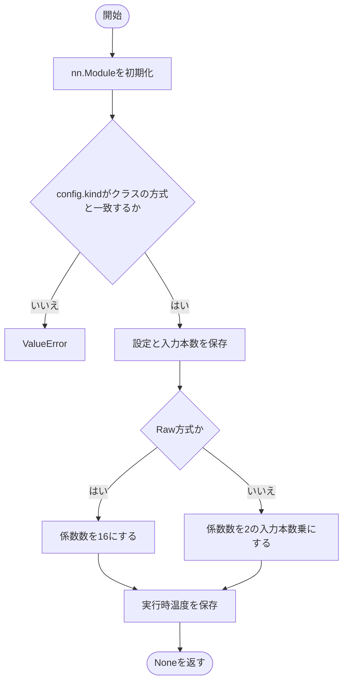
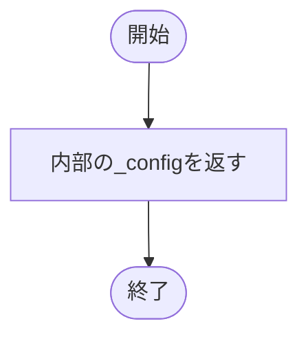
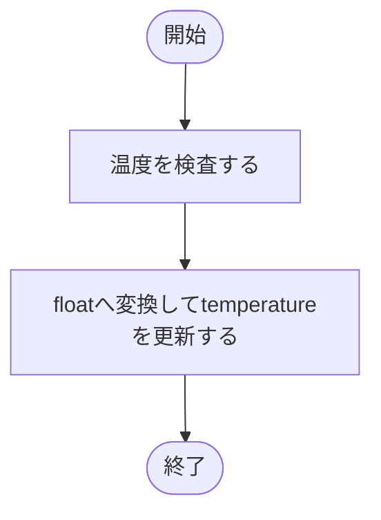
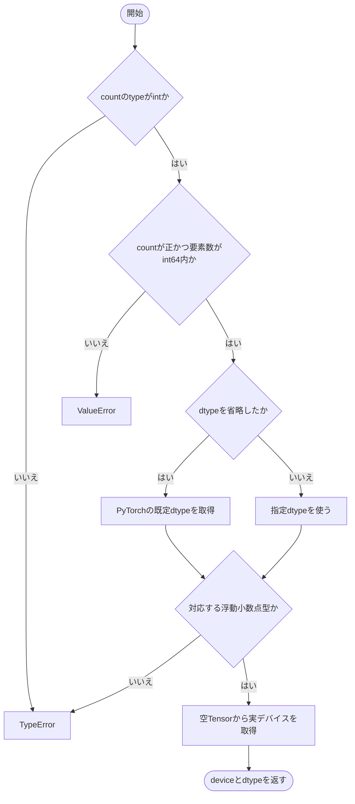
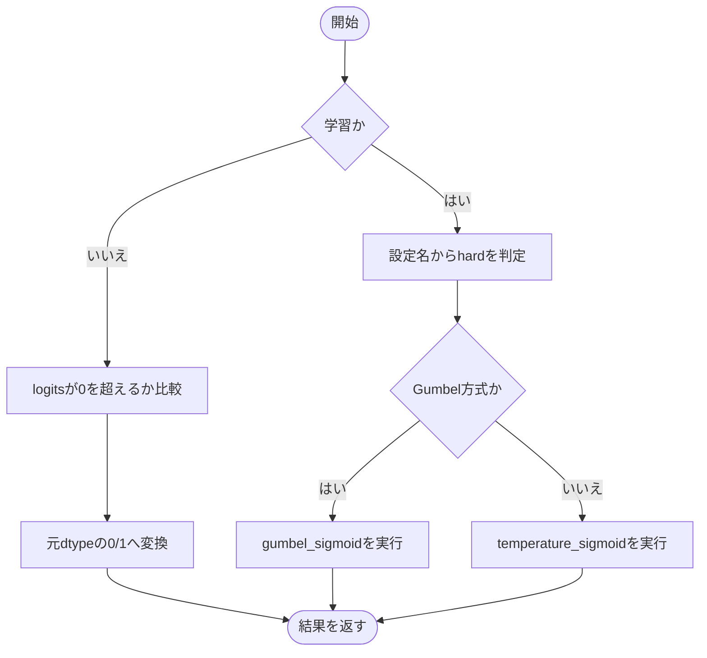
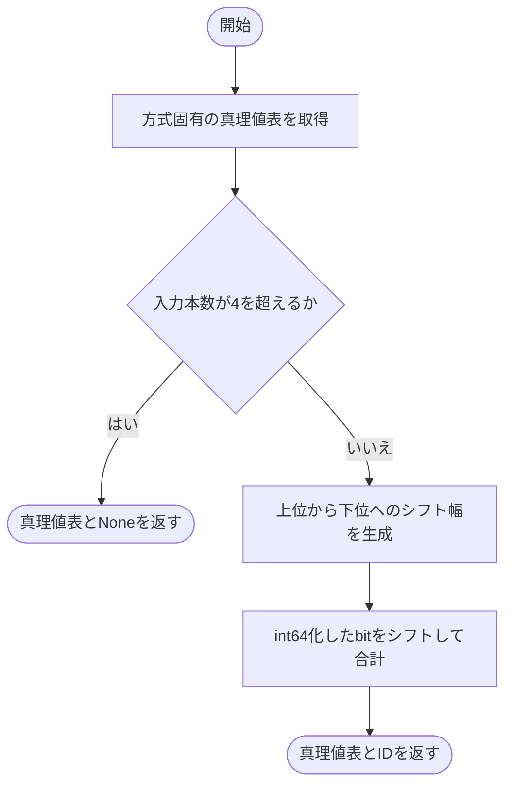
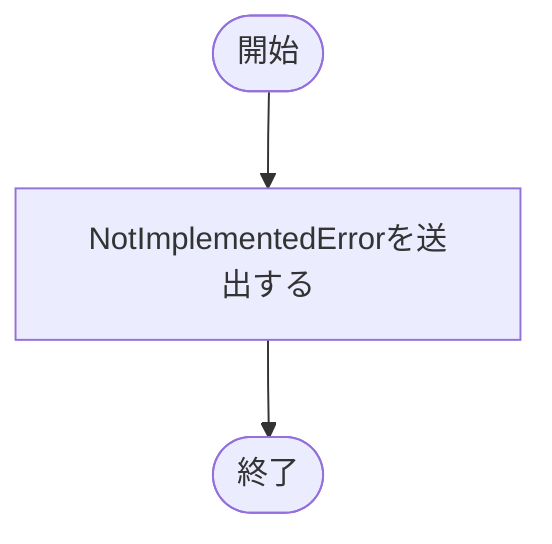

# base.py

`utils/logicNN_core/src/logicnn_core/parametrizations/base.py`

LUTの学習表現に共通する設定、初期化条件、温度の更新、二値サンプリング、真理値表のID化を実装します。重みはこのモジュールでは所有せず、LogicDenseなどの層から渡します。

{/* source-sha256: 10038ee9f3d11ea9565aabfb66b896690f62531c7ee78752e00698d892fab126 */}

## LUTParametrization {/* #lutparametrization-class */}

Raw・Warp・Lightの共通インターフェースを定める抽象基底。

継承元：`nn.Module, ABC`

| 属性 | 型 | 既定値 | 説明 |
|---|---|---|---|
| `_kind` | `str` | `''` | 派生クラスが指定する方式名。 |

{/* function: LUTParametrization.__init__@23 */}

## LUTParametrization.\_\_init\_\_() {/* #lutparametrization-init */}

```python
def __init__(self, config: LUTConfig) -> None:
```

### 機能概要

指定された方式名が派生クラスと一致することを確認し、入力本数、係数数、実行時の温度を設定します。

### 引数

| 引数 | 型 | 既定値 | 説明 |
|---|---|---|---|
| `config` | `LUTConfig` | `必須` | 派生クラスの方式と一致するLUTConfig。 |

### 処理の流れ



### 戻り値

型：`None`

None。

### ソースコード

<details>
<summary>LUTParametrization.\_\_init\_\_() の実装を開く</summary>

```python
def __init__(self, config: LUTConfig) -> None:
    """方式の一致を検証し、不変の生成時設定と実行用の値を分離する。"""
    super().__init__()
    if config.kind != self._kind:
        raise ValueError(f"{type(self).__name__} のconfig.kindは {self._kind!r} で指定してください")
    self._config          = config
    self.num_inputs       = config.num_inputs
    self.num_coefficients = 16 if config.kind == "raw" else 1 << self.num_inputs
    self.temperature      = float(config.temperature)
```

</details>

{/* function: LUTParametrization.config@34 */}

## LUTParametrization.config()（プロパティ） {/* #lutparametrization-config */}

```python
def config(self) -> LUTConfig:
```

### 機能概要

構築時に受け取った不変のLUTConfigを返す読み取り専用プロパティです。

### 引数

`self` 以外に指定する引数はありません。

### 処理の流れ



### 戻り値

型：`LUTConfig`

保持しているLUTConfig。

### ソースコード

<details>
<summary>LUTParametrization.config() の実装を開く</summary>

```python
@property
def config(self) -> LUTConfig:
    """構築時の不変設定を返し、方式と実行属性の整合性を保つ。"""
    return self._config
```

</details>

{/* function: LUTParametrization.set_temperature@38 */}

## LUTParametrization.set\_temperature() {/* #lutparametrization-set-temperature */}

```python
def set_temperature(self, temperature: float) -> None:
```

### 機能概要

正で有限の温度を確認し、サンプリングに使う現在値だけを更新します。構築時のconfig.temperatureは書き換えません。

### 引数

| 引数 | 型 | 既定値 | 説明 |
|---|---|---|---|
| `temperature` | `float` | `必須` | 更新する正の有限な温度。 |

### 処理の流れ



### 戻り値

型：`None`

None。

### 状態の変更・ファイル出力

- 実行時のtemperature属性を更新します。

### ソースコード

<details>
<summary>LUTParametrization.set\_temperature() の実装を開く</summary>

```python
def set_temperature(self, temperature: float) -> None:
    """元configを変更せず、検証済みの正の有限temperatureへ更新する。"""
    _validate_positive_number("temperature", temperature)
    self.temperature = float(temperature)
```

</details>

{/* function: LUTParametrization._initialization_options@43 */}

## LUTParametrization.\_initialization\_options() {/* #lutparametrization-initialization-options */}

```python
def _initialization_options(self, count: int, device: torch.device | str | None, dtype: torch.dtype | None) -> tuple[torch.device, torch.dtype]:
```

### 機能概要

ゲート数と重み要素数が扱える範囲かを確認し、浮動小数点dtypeとデバイスを解決します。空Tensorを作って、PyTorchが実際に選ぶデバイスを取得します。

### 引数

| 引数 | 型 | 既定値 | 説明 |
|---|---|---|---|
| `count` | `int` | `必須` | 生成するゲート数。正のPython整数。 |
| `device` | `torch.device \| str \| None` | `必須` | 生成先デバイス。NoneはPyTorchの既定値。 |
| `dtype` | `torch.dtype \| None` | `必須` | 生成する浮動小数点型。NoneはPyTorchの既定dtype。 |

### 処理の流れ



### 戻り値

型：`tuple[torch.device, torch.dtype]`

解決済みのtorch.deviceとtorch.dtypeの組。

### 例外・注意事項

- 対応dtypeはfloat16・bfloat16・float32・float64です。

### ソースコード

<details>
<summary>LUTParametrization.\_initialization\_options() の実装を開く</summary>

```python
def _initialization_options(self, count: int, device: torch.device | str | None, dtype: torch.dtype | None) -> tuple[torch.device, torch.dtype]:
    """初期化の件数・dtypeを検証し、省略したdeviceとdtypeをPyTorch既定値で解決する。"""
    if type(count) is not int:
        raise TypeError("count はboolではないPython整数で指定してください")
    if count <= 0 or count * self.num_coefficients > torch.iinfo(torch.int64).max:
        raise ValueError("count は正の値とし、重みの要素数がint64上限を超えないよう指定してください")
    chosen_dtype = torch.get_default_dtype() if dtype is None else dtype
    if chosen_dtype not in _FLOAT_DTYPES:
        raise TypeError("dtype はfloat16／bfloat16／float32／float64で指定してください")
    chosen_device = torch.empty(0, dtype=chosen_dtype, device=device).device
    return chosen_device, chosen_dtype
```

</details>

{/* function: LUTParametrization._sample_binary@55 */}

## LUTParametrization.\_sample\_binary() {/* #lutparametrization-sample-binary */}

```python
def _sample_binary(self, logits: Tensor, training: bool) -> Tensor:
```

### 機能概要

通常評価ではlogitが厳密に0を超える位置を1にします。学習時は設定名からhardとGumbelの有無を選び、現在温度でsigmoid系のサンプリングを行います。

### 引数

| 引数 | 型 | 既定値 | 説明 |
|---|---|---|---|
| `logits` | `Tensor` | `必須` | 二値へ変換する実数Tensor。 |
| `training` | `bool` | `必須` | Trueで学習用サンプリング、Falseで閾値0の離散評価。 |

### 処理の流れ



### 戻り値

型：`Tensor`

logitsと同じshape・dtypeのTensor。評価時は0/1。

### 状態の変更・ファイル出力

- 学習時のGumbel方式では乱数を消費します。

### ソースコード

<details>
<summary>LUTParametrization.\_sample\_binary() の実装を開く</summary>

```python
def _sample_binary(self, logits: Tensor, training: bool) -> Tensor:
    """sigmoid系の学習選択を行い、評価時は温度や乱数を使わず0を厳密に超えた値を選ぶ。"""
    if not training:
        return (logits > 0).to(dtype=logits.dtype)
    sampling = self.config.sampling
    hard     = sampling in ("hard", "gumbel_hard")
    if sampling.startswith("gumbel_"):
        return gumbel_sigmoid(logits, temperature=self.temperature, hard=hard)
    return temperature_sigmoid(logits, temperature=self.temperature, hard=hard)
```

</details>

{/* function: LUTParametrization.truth_tables_with_ids@65 */}

## LUTParametrization.truth\_tables\_with\_ids() {/* #lutparametrization-truth-tables-with-ids */}

```python
def truth_tables_with_ids(self, weights: Tensor) -> tuple[Tensor, Tensor | None]:
```

### 機能概要

方式固有の真理値表を取得し、4入力以下では表の先頭要素から上位ビットへ詰めてint64のIDに変換します。6入力の64bit表は整数IDへ詰めずNoneにします。

### 引数

| 引数 | 型 | 既定値 | 説明 |
|---|---|---|---|
| `weights` | `Tensor` | `必須` | 末尾がLUT係数軸の重みTensor。先行軸のゲート配置を保持します。 |

### 処理の流れ



### 戻り値

型：`tuple[Tensor, Tensor \| None]`

bool真理値表とIDの組。IDのshapeは表の末尾軸を除いたshapeで、4入力を超えるとNone。

### ソースコード

<details>
<summary>LUTParametrization.truth\_tables\_with\_ids() の実装を開く</summary>

```python
def truth_tables_with_ids(self, weights: Tensor) -> tuple[Tensor, Tensor | None]:
    """bool真理値表とrank 4以下のMSB-first整数IDを返し、高rankのIDはNoneにする。"""
    tables = self.truth_tables(weights)
    if self.num_inputs > 4:
        return tables, None
    shifts = torch.arange((1 << self.num_inputs) - 1, -1, -1, device=tables.device)
    ids    = (tables.to(dtype=torch.int64) << shifts).sum(dim=-1)
    return tables, ids
```

</details>

{/* function: LUTParametrization.initialize@75 */}

## LUTParametrization.initialize() {/* #lutparametrization-initialize */}

```python
def initialize(self, count: int, *, device: torch.device | str | None = None, dtype: torch.dtype | None = None) -> Tensor:
```

### 機能概要

方式固有の初期係数Tensorを作る抽象メソッドです。Parameter化は呼び出し側の層で行います。

### 引数

| 引数 | 型 | 既定値 | 説明 |
|---|---|---|---|
| `count` | `int` | `必須` | 生成するゲート数。正のPython整数。 |
| `device` | `torch.device \| str \| None` | `None` | 生成先デバイス。NoneはPyTorchの既定値。 |
| `dtype` | `torch.dtype \| None` | `None` | 生成する浮動小数点型。NoneはPyTorchの既定dtype。 |

### 処理の流れ


### 戻り値

型：`Tensor`

基底実装は戻らずNotImplementedErrorを送出します。

### ソースコード

<details>
<summary>LUTParametrization.initialize() の実装を開く</summary>

```python
@abstractmethod
def initialize(self, count: int, *, device: torch.device | str | None = None, dtype: torch.dtype | None = None) -> Tensor:
    """方式別の初期重みを生成し、Parameter化と所有を呼出側へ委ねる。"""
    raise NotImplementedError
```

</details>

{/* function: LUTParametrization.forward@80 */}

## LUTParametrization.forward() {/* #lutparametrization-forward */}

```python
def forward(self, inputs: Tensor, weights: Tensor, *, training: bool, contraction: str) -> Tensor:
```

### 機能概要

入力と重みを指定した軸対応で計算するための抽象メソッドです。実際の式は各方式で定義します。

### 引数

| 引数 | 型 | 既定値 | 説明 |
|---|---|---|---|
| `inputs` | `Tensor` | `必須` | 入力本数が第1軸に並ぶTensor。Denseでは[batch, num_inputs, gates]、Convでは[batch, num_inputs, channels, positions, nodes]。 |
| `weights` | `Tensor` | `必須` | 末尾が係数軸のLUT重み。先行軸はゲートを表します。 |
| `training` | `bool` | `必須` | 学習時のサンプリングか、決定的な通常評価かを指定します。 |
| `contraction` | `str` | `必須` | 重みのゲート軸と入力の軸を対応させるeinsum式。例はn,bn->bn、fc,bcsf->bcsf。 |

### 処理の流れ


### 戻り値

型：`Tensor`

基底実装は戻らずNotImplementedErrorを送出します。

### ソースコード

<details>
<summary>LUTParametrization.forward() の実装を開く</summary>

```python
@abstractmethod
def forward(self, inputs: Tensor, weights: Tensor, *, training: bool, contraction: str) -> Tensor:
    """方式別の学習・評価計算を明示された縮約軸に沿って実行する。"""
    raise NotImplementedError
```

</details>

{/* function: LUTParametrization.truth_tables@85 */}

## LUTParametrization.truth\_tables() {/* #lutparametrization-truth-tables */}

```python
def truth_tables(self, weights: Tensor) -> Tensor:
```

### 機能概要

方式固有の係数から離散真理値表を取得するための抽象メソッドです。

### 引数

| 引数 | 型 | 既定値 | 説明 |
|---|---|---|---|
| `weights` | `Tensor` | `必須` | 末尾がLUT係数軸の重みTensor。先行軸のゲート配置を保持します。 |

### 処理の流れ



### 戻り値

型：`Tensor`

基底実装は戻らずNotImplementedErrorを送出します。

### ソースコード

<details>
<summary>LUTParametrization.truth\_tables() の実装を開く</summary>

```python
@abstractmethod
def truth_tables(self, weights: Tensor) -> Tensor:
    """方式別の重みから末尾に真理値を並べたbool Tensorを返す。"""
    raise NotImplementedError
```

</details>

## 関連ファイル

- [utils/logicNN_core/src/logicnn_core/functional/sampling.py](/code-reference/utils/logicNN_core/src/logicnn_core/functional/sampling)
- [utils/logicNN_core/src/logicnn_core/layer_settings.py](/code-reference/utils/logicNN_core/src/logicnn_core/layer_settings)
