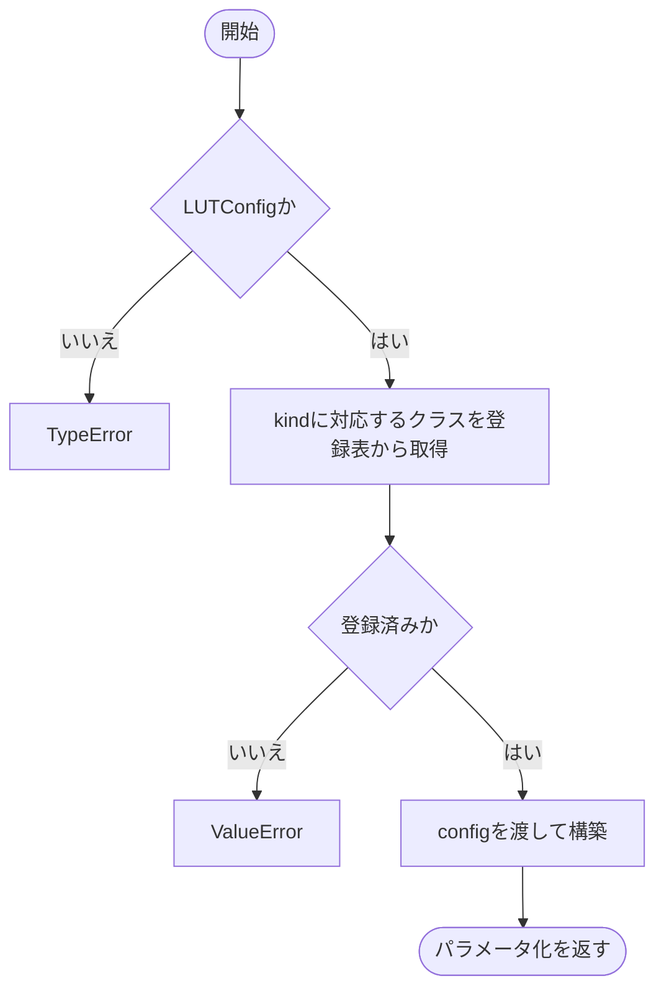

# builder.py

`utils/logicNN_core/src/logicnn_core/parametrizations/builder.py`

LUTConfigのkindを、対応するRaw・Warp・Lightのパラメータ化クラスへ対応付けて構築します。

{/* source-sha256: 54e467f969630fb09fe8ec2ea77b6723830e51d272ef3e76a8ca98849d25f458 */}

{/* function: build_parametrization@18 */}

## build\_parametrization() {/* #build-parametrization */}

```python
def build_parametrization(config: LUTConfig) -> LUTParametrization:
```

### 機能概要

LUTConfigであることを確認して登録表からコンストラクタを取得し、同じ設定を渡して計算方式のオブジェクトを作ります。

### 引数

| 引数 | 型 | 既定値 | 説明 |
|---|---|---|---|
| `config` | `LUTConfig` | `必須` | 構築する方式を含むLUTConfig。 |

### 処理の流れ



### 戻り値

型：`LUTParametrization`

対応するLUTParametrizationの派生オブジェクト。

### ソースコード

<details>
<summary>build\_parametrization() の実装を開く</summary>

```python
def build_parametrization(config: LUTConfig) -> LUTParametrization:
    """検証済み設定のkindに対応する計算方式を作り、未知の登録名は明示拒否する。"""
    if not isinstance(config, LUTConfig):
        raise TypeError("config はLUTConfigで指定してください")
    constructor = _PARAMETRIZATIONS.get(config.kind)
    if constructor is None:
        raise ValueError(f"未対応のLUTパラメータ化です: {config.kind!r}")
    return constructor(config)
```

</details>

## 関連ファイル

- [utils/logicNN_core/src/logicnn_core/layer_settings.py](/code-reference/utils/logicNN_core/src/logicnn_core/layer_settings)
- [utils/logicNN_core/src/logicnn_core/parametrizations/base.py](/code-reference/utils/logicNN_core/src/logicnn_core/parametrizations/base)
- [utils/logicNN_core/src/logicnn_core/parametrizations/light.py](/code-reference/utils/logicNN_core/src/logicnn_core/parametrizations/light)
- [utils/logicNN_core/src/logicnn_core/parametrizations/raw.py](/code-reference/utils/logicNN_core/src/logicnn_core/parametrizations/raw)
- [utils/logicNN_core/src/logicnn_core/parametrizations/warp.py](/code-reference/utils/logicNN_core/src/logicnn_core/parametrizations/warp)
