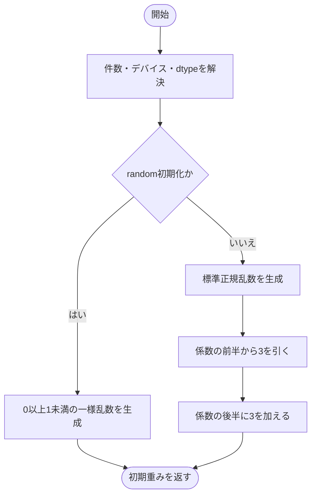
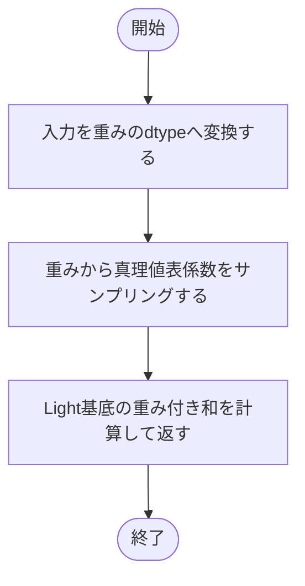
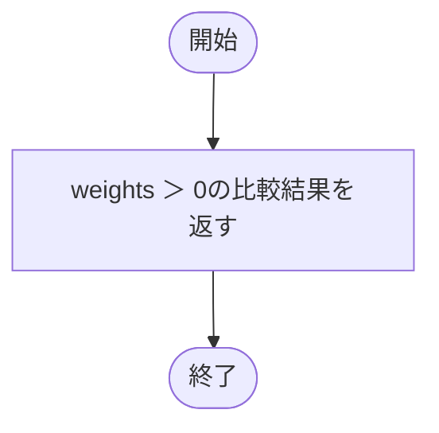

# light.py

`utils/logicNN_core/src/logicnn_core/parametrizations/light.py`

真理値表の各出力bitにlogitを持たせるLight方式です。学習時に各bitをsigmoidで連続化し、入力のLight基底で多重線形補間します。2・4・6入力に対応します。

{/* source-sha256: e7e8ea8a3406bb19eef95fbd863b1545006f1000f18e6102117f5abf5730d1ba */}

## LightLUTParametrization {/* #lightlutparametrization-class */}

2**num_inputs個の真理値表係数を直接サンプリングする方式。

継承元：`LUTParametrization`

{/* function: LightLUTParametrization.initialize@24 */}

## LightLUTParametrization.initialize() {/* #lightlutparametrization-initialize */}

```python
def initialize(self, count: int, *, device: torch.device | str | None = None, dtype: torch.dtype | None = None) -> Tensor:
```

### 機能概要

randomでは0以上1未満の一様乱数を生成します。residualでは標準正規乱数の前半へ−3、後半へ＋3を加え、最初の入力を通す表へ偏らせます。

### 引数

| 引数 | 型 | 既定値 | 説明 |
|---|---|---|---|
| `count` | `int` | `必須` | 生成するゲート数。正のPython整数。 |
| `device` | `torch.device \| str \| None` | `None` | 生成先デバイス。NoneはPyTorchの既定値。 |
| `dtype` | `torch.dtype \| None` | `None` | 生成する浮動小数点型。NoneはPyTorchの既定dtype。 |

### 処理の流れ



### 戻り値

型：`Tensor`

[count, 2**num_inputs]の初期logit Tensor。

### 状態の変更・ファイル出力

- どちらの方式も乱数を消費します。

### 例外・注意事項

- Lightのこの初期化式はresidual_probabilityを使用しません。

### ソースコード

<details>
<summary>LightLUTParametrization.initialize() の実装を開く</summary>

```python
def initialize(self, count: int, *, device: torch.device | str | None = None, dtype: torch.dtype | None = None) -> Tensor:
    """residualは正規乱数へ前半−3・後半＋3を加え、randomは一様乱数で初期化する。"""
    device, dtype = self._initialization_options(count, device, dtype)
    if self.config.weight_init == "random":
        return torch.rand(count, self.num_coefficients, device=device, dtype=dtype)
    weights = torch.randn(count, self.num_coefficients, device=device, dtype=dtype)
    weights[:, :self.num_coefficients // 2] -= 3
    weights[:, self.num_coefficients // 2:] += 3
    return weights
```

</details>

{/* function: LightLUTParametrization.forward@34 */}

## LightLUTParametrization.forward() {/* #lightlutparametrization-forward */}

```python
def forward(self, inputs: Tensor, weights: Tensor, *, training: bool, contraction: str) -> Tensor:
```

### 機能概要

入力を重みのdtypeへ合わせ、重みを学習時はsigmoid系、評価時は閾値0でサンプリングします。その係数とLight基底の和を指定された軸で計算します。

### 引数

| 引数 | 型 | 既定値 | 説明 |
|---|---|---|---|
| `inputs` | `Tensor` | `必須` | 入力本数が第1軸に並ぶTensor。Denseでは[batch, num_inputs, gates]、Convでは[batch, num_inputs, channels, positions, nodes]。 |
| `weights` | `Tensor` | `必須` | 末尾が係数軸のLUT重み。先行軸はゲートを表します。 |
| `training` | `bool` | `必須` | 学習時のサンプリングか、決定的な通常評価かを指定します。 |
| `contraction` | `str` | `必須` | 重みのゲート軸と入力の軸を対応させるeinsum式。例はn,bn->bn、fc,bcsf->bcsf。 |

### 処理の流れ



### 戻り値

型：`Tensor`

contractionの出力軸に従う、重みと同じdtypeのTensor。

### 例外・注意事項

- 入力自体は二値化しません。基底を一括生成するかはmaterialize_basisに従います。

### ソースコード

<details>
<summary>LightLUTParametrization.forward() の実装を開く</summary>

```python
def forward(self, inputs: Tensor, weights: Tensor, *, training: bool, contraction: str) -> Tensor:
    """truth table係数をsamplingしてLight基底と縮約し、入力自体は二値化しない。"""
    inputs       = inputs.to(dtype=weights.dtype)
    coefficients = self._sample_binary(weights, training)
    return weighted_light_basis_sum(inputs, coefficients, contraction, self.num_inputs, materialize_basis=self.config.materialize_basis)
```

</details>

{/* function: LightLUTParametrization.truth_tables@40 */}

## LightLUTParametrization.truth\_tables() {/* #lightlutparametrization-truth-tables */}

```python
def truth_tables(self, weights: Tensor) -> Tensor:
```

### 機能概要

重みが厳密に0を超えた位置をTrueにすることで、ゲートごとの離散真理値表を生成します。

### 引数

| 引数 | 型 | 既定値 | 説明 |
|---|---|---|---|
| `weights` | `Tensor` | `必須` | 末尾がLUT係数軸の重みTensor。先行軸のゲート配置を保持します。 |

### 処理の流れ



### 戻り値

型：`Tensor`

weightsと同じshapeのbool Tensor。

### 例外・注意事項

- 重みが0の行はFalseです。温度や乱数は使いません。

### ソースコード

<details>
<summary>LightLUTParametrization.truth\_tables() の実装を開く</summary>

```python
def truth_tables(self, weights: Tensor) -> Tensor:
    """係数が厳密に正の位置をTrueとして元のゲート・真理値表shapeで返す。"""
    return weights > 0
```

</details>

## 関連ファイル

- [utils/logicNN_core/src/logicnn_core/functional/walsh.py](/code-reference/utils/logicNN_core/src/logicnn_core/functional/walsh)
- [utils/logicNN_core/src/logicnn_core/parametrizations/base.py](/code-reference/utils/logicNN_core/src/logicnn_core/parametrizations/base)
