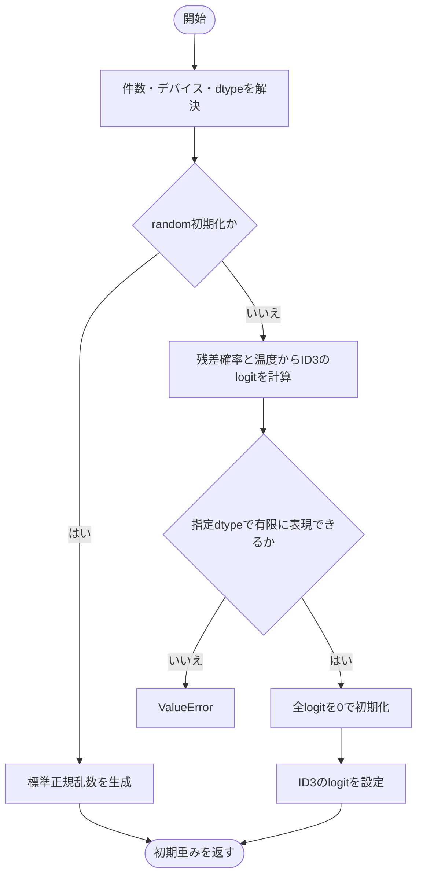
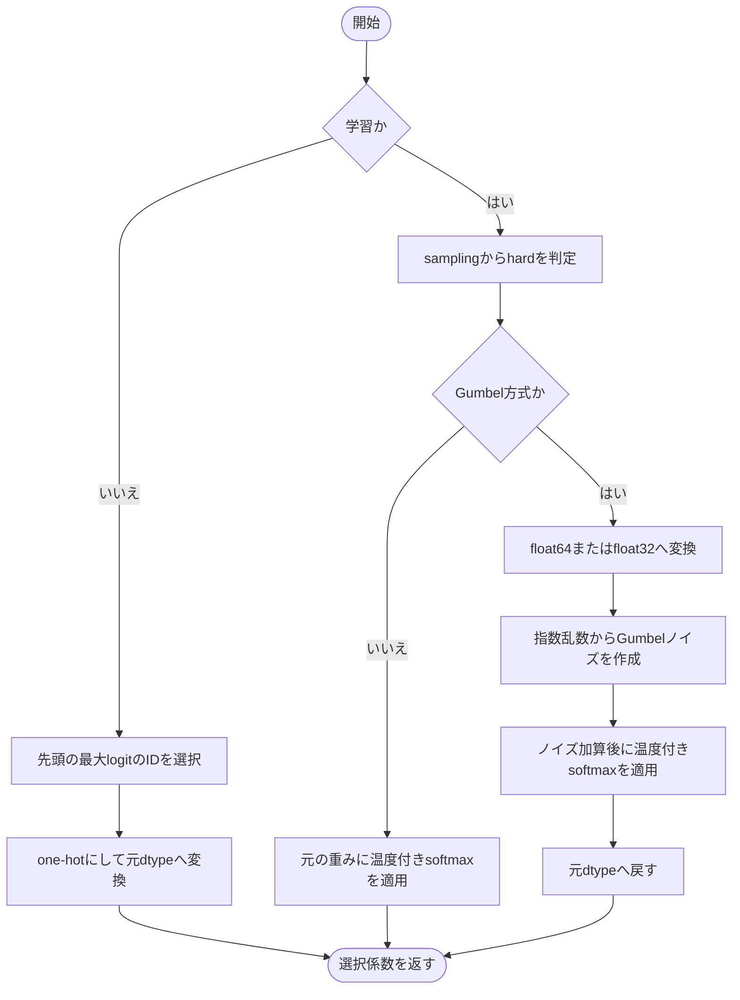
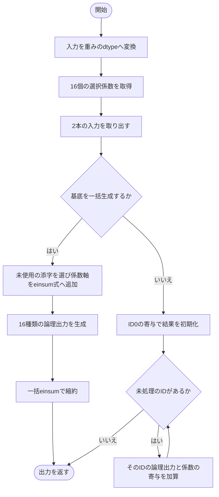
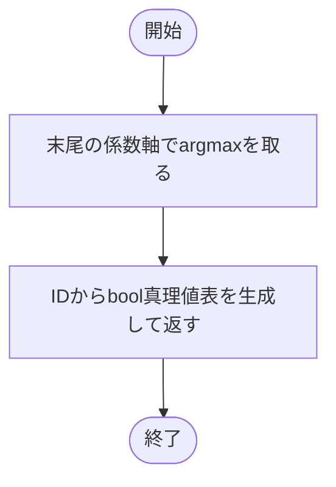

# raw.py

`utils/logicNN_core/src/logicnn_core/parametrizations/raw.py`

2入力の16種類の論理関数それぞれにlogitを持つRaw方式です。学習時は論理関数を重み付きで混合し、通常評価では最大logitの関数を1つ選びます。

{/* source-sha256: b95ea5f57bf3c5f32c52efa171c69f299fd04a0aa526b965373cdce5e5529e23 */}

## RawLUTParametrization {/* #rawlutparametrization-class */}

16個の連続論理基底を用いる2入力LUTのパラメータ化。

継承元：`LUTParametrization`

{/* function: RawLUTParametrization.initialize@30 */}

## RawLUTParametrization.initialize() {/* #rawlutparametrization-initialize */}

```python
def initialize(self, count: int, *, device: torch.device | str | None = None, dtype: torch.dtype | None = None) -> Tensor:
```

### 機能概要

randomでは16個のlogitを標準正規分布から生成します。residualではID3のlogitだけを温度と残差確率から計算した値にし、残りを0にします。

### 引数

| 引数 | 型 | 既定値 | 説明 |
|---|---|---|---|
| `count` | `int` | `必須` | 生成するゲート数。正のPython整数。 |
| `device` | `torch.device \| str \| None` | `None` | 生成先デバイス。NoneはPyTorchの既定値。 |
| `dtype` | `torch.dtype \| None` | `None` | 生成する浮動小数点型。NoneはPyTorchの既定dtype。 |

### 処理の流れ



### 戻り値

型：`Tensor`

[count, 16]の初期重みTensor。

### 状態の変更・ファイル出力

- randomでは乱数を消費します。

### 例外・注意事項

- residualのlogitはtemperature × &#123;log(15p−7) − log(1−p)&#125;です。入力そのものを直接コピーする処理ではありません。

### ソースコード

<details>
<summary>RawLUTParametrization.initialize() の実装を開く</summary>

```python
def initialize(self, count: int, *, device: torch.device | str | None = None, dtype: torch.dtype | None = None) -> Tensor:
    """旧残差式でID3を優先するか、標準正規分布で16 logitを初期化する。"""
    device, dtype = self._initialization_options(count, device, dtype)
    if self.config.weight_init == "random":
        return torch.randn(count, self.num_coefficients, device=device, dtype=dtype)
    probability = self.config.residual_probability
    value       = (math.log(15 * probability - 7) - math.log(1 - probability)) * self.temperature
    if not math.isfinite(value) or abs(value) > torch.finfo(dtype).max:
        raise ValueError("Raw残差初期値は指定dtypeで表現できる有限値である必要があります。")
    weights       = torch.zeros(count, self.num_coefficients, device=device, dtype=dtype)
    weights[:, 3] = value
    return weights
```

</details>

{/* function: RawLUTParametrization._sample_weights@43 */}

## RawLUTParametrization.\_sample\_weights() {/* #rawlutparametrization-sample-weights */}

```python
def _sample_weights(self, weights: Tensor, training: bool) -> Tensor:
```

### 機能概要

評価時はargmaxによるone-hotを返します。学習時は温度付きsoftmaxを使い、Gumbel方式なら指数乱数から作ったノイズを加えます。

### 引数

| 引数 | 型 | 既定値 | 説明 |
|---|---|---|---|
| `weights` | `Tensor` | `必須` | 末尾軸が16のlogit Tensor。 |
| `training` | `bool` | `必須` | Trueで学習用選択、Falseで決定的な最大logitの選択。 |

### 処理の流れ



### 戻り値

型：`Tensor`

weightsと同じshape・dtypeの選択係数Tensor。

### 状態の変更・ファイル出力

- 学習時のGumbel方式で乱数を消費します。

### 例外・注意事項

- 評価時の同率最大値ではargmaxが返す先頭のIDを選びます。

### ソースコード

<details>
<summary>RawLUTParametrization.\_sample\_weights() の実装を開く</summary>

```python
def _sample_weights(self, weights: Tensor, training: bool) -> Tensor:
    """学習時は温度付き選択、評価時は先頭最大IDの決定的one-hotを返す。"""
    if not training:
        return torch_functional.one_hot(weights.argmax(-1), self.num_coefficients).to(dtype=weights.dtype)
    sampling = self.config.sampling
    hard     = sampling in ("hard", "gumbel_hard")
    if sampling.startswith("gumbel"):
        dtype  = torch.float64 if weights.dtype == torch.float64 else torch.float32
        values = weights.to(dtype=dtype)
        # PyTorch標準と同じ指数乱数由来のGumbelノイズを使い、温度除算はC2の安定経路へ渡す。
        noise  = -torch.empty_like(values, memory_format=torch.contiguous_format).exponential_().log()
        return temperature_softmax(values + noise, temperature=self.temperature, hard=hard).to(dtype=weights.dtype)
    return temperature_softmax(weights, temperature=self.temperature, hard=hard)
```

</details>

{/* function: RawLUTParametrization.forward@57 */}

## RawLUTParametrization.forward() {/* #rawlutparametrization-forward */}

```python
def forward(self, inputs: Tensor, weights: Tensor, *, training: bool, contraction: str) -> Tensor:
```

### 機能概要

入力を重みのdtypeへ揃え、選択係数と各二入力論理関数の出力を縮約します。基底を一括生成する方式と、16項を順に加算する方式を選べます。

### 引数

| 引数 | 型 | 既定値 | 説明 |
|---|---|---|---|
| `inputs` | `Tensor` | `必須` | 入力本数が第1軸に並ぶTensor。Denseでは[batch, num_inputs, gates]、Convでは[batch, num_inputs, channels, positions, nodes]。 |
| `weights` | `Tensor` | `必須` | 末尾が係数軸のLUT重み。先行軸はゲートを表します。 |
| `training` | `bool` | `必須` | 学習時のサンプリングか、決定的な通常評価かを指定します。 |
| `contraction` | `str` | `必須` | 重みのゲート軸と入力の軸を対応させるeinsum式。例はn,bn->bn、fc,bcsf->bcsf。 |

### 処理の流れ



### 戻り値

型：`Tensor`

contractionの出力軸に従う、重みと同じdtypeのTensor。

### 例外・注意事項

- 通常評価も連続入力へ論理関数の連続式を適用します。入力をboolへ変換する回路出力経路ではありません。

### ソースコード

<details>
<summary>RawLUTParametrization.forward() の実装を開く</summary>

```python
def forward(self, inputs: Tensor, weights: Tensor, *, training: bool, contraction: str) -> Tensor:
    """二入力の連続論理基底を、明示された重み・基底のeinsum式で縮約する。"""
    inputs        = inputs.to(dtype=weights.dtype)
    sampled       = self._sample_weights(weights, training)
    first, second = inputs[:, 0], inputs[:, 1]
    if self.config.materialize_basis:
        operands, output       = contraction.split("->")
        weight_axes, basis_axes = operands.split(",")
        coefficient_axis       = next(label for label in ascii_letters if label not in contraction)
        full_contraction       = f"{weight_axes}{coefficient_axis},{basis_axes}{coefficient_axis}->{output}"
        return torch.einsum(full_contraction, sampled, all_binary_logic_outputs(first, second))
    result = torch.einsum(contraction, sampled[..., 0], apply_binary_lut(first, second, 0))
    for lut_id in range(1, self.num_coefficients):
        result = result + torch.einsum(contraction, sampled[..., lut_id], apply_binary_lut(first, second, lut_id))
    return result
```

</details>

{/* function: RawLUTParametrization.truth_tables@73 */}

## RawLUTParametrization.truth\_tables() {/* #rawlutparametrization-truth-tables */}

```python
def truth_tables(self, weights: Tensor) -> Tensor:
```

### 機能概要

各ゲートで最大logitのIDを選び、IDを二入力の4行の真理値表へ変換します。

### 引数

| 引数 | 型 | 既定値 | 説明 |
|---|---|---|---|
| `weights` | `Tensor` | `必須` | 末尾がLUT係数軸の重みTensor。先行軸のゲート配置を保持します。 |

### 処理の流れ



### 戻り値

型：`Tensor`

[*weights.shape[:-1], 4]のbool Tensor。

### ソースコード

<details>
<summary>RawLUTParametrization.truth\_tables() の実装を開く</summary>

```python
def truth_tables(self, weights: Tensor) -> Tensor:
    """末尾16 logitの先頭最大IDを選び、先行shapeを保つbool真理値表を返す。"""
    return truth_table_from_id(weights.argmax(-1), self.num_inputs)
```

</details>

## 関連ファイル

- [utils/logicNN_core/src/logicnn_core/functional/combinatorics.py](/code-reference/utils/logicNN_core/src/logicnn_core/functional/combinatorics)
- [utils/logicNN_core/src/logicnn_core/functional/logic.py](/code-reference/utils/logicNN_core/src/logicnn_core/functional/logic)
- [utils/logicNN_core/src/logicnn_core/functional/sampling.py](/code-reference/utils/logicNN_core/src/logicnn_core/functional/sampling)
- [utils/logicNN_core/src/logicnn_core/parametrizations/base.py](/code-reference/utils/logicNN_core/src/logicnn_core/parametrizations/base)
